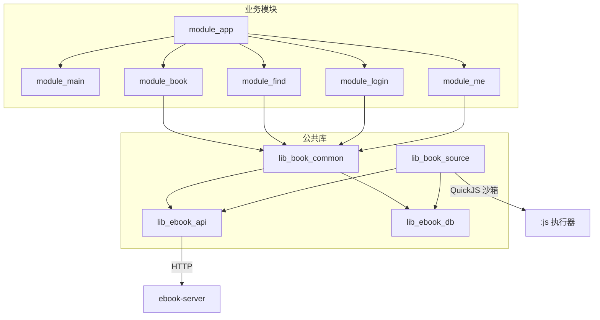
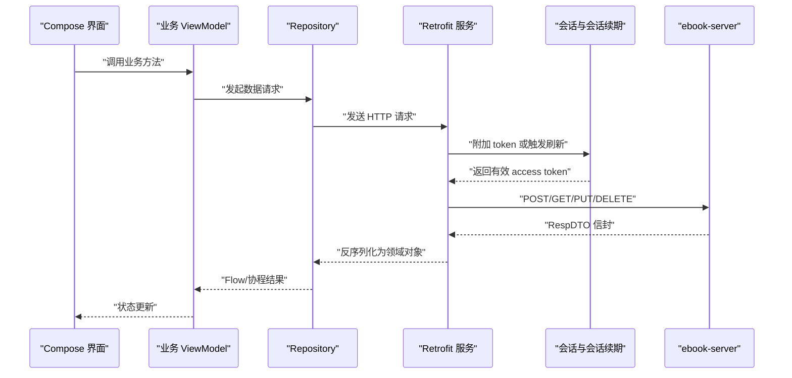
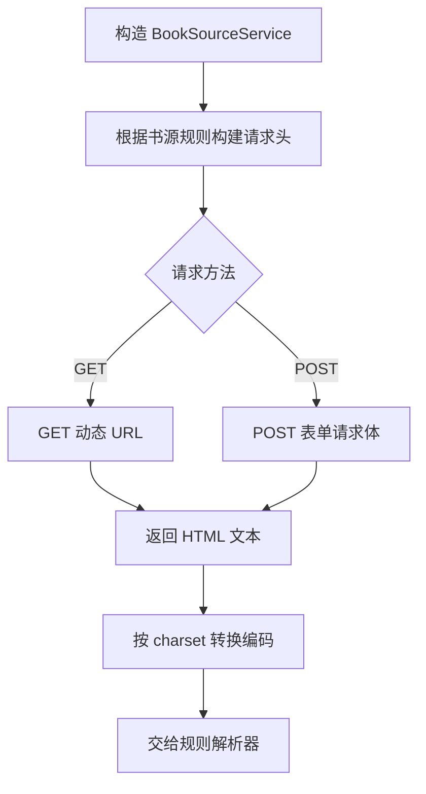
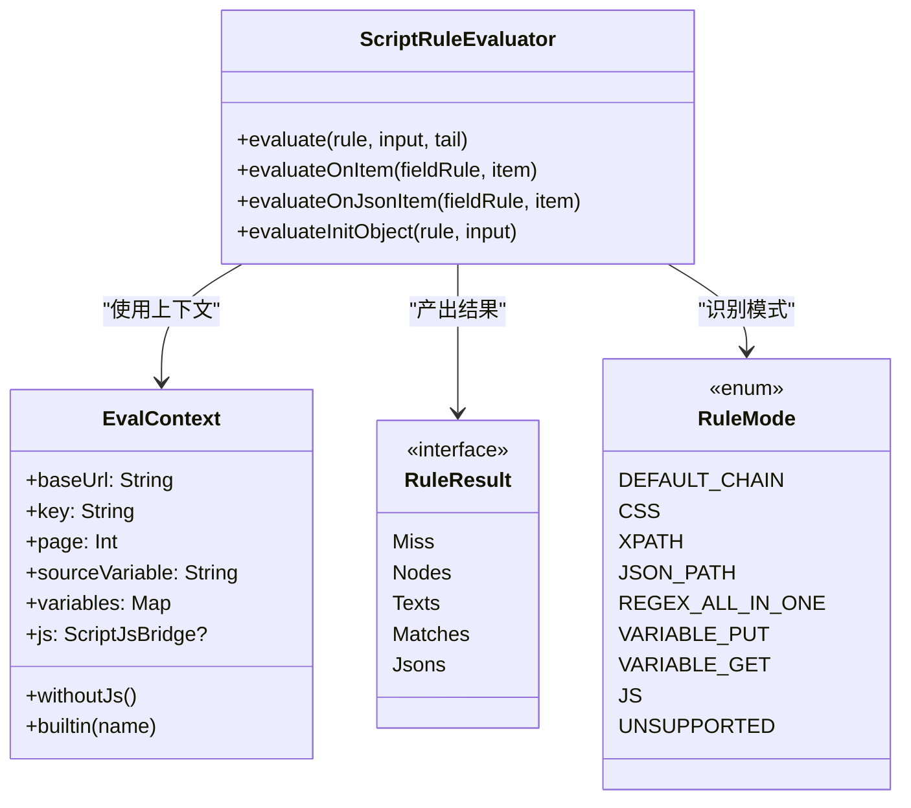
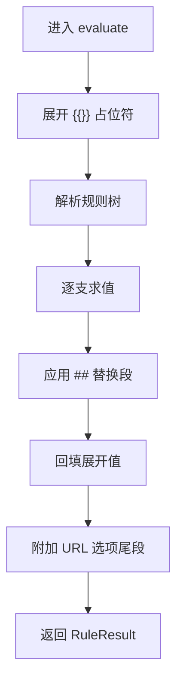
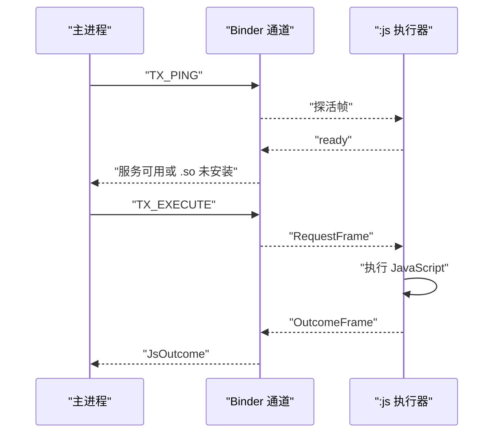
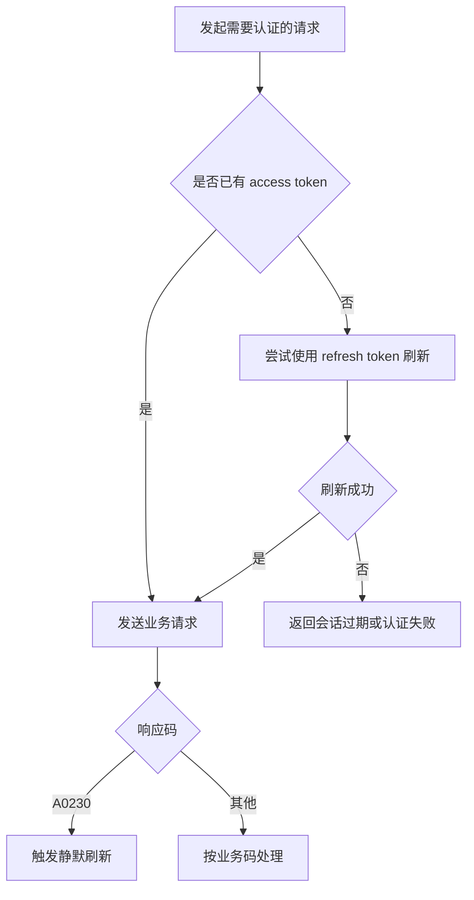

# API 参考

<cite>
**本文引用的文件**   
- [README.MD](file://README.MD)
- [UserService.kt](file://lib_ebook_api/src/main/java/com/ebook/api/service/user/UserService.kt)
- [BookSourceService.kt](file://lib_ebook_api/src/main/java/com/ebook/api/service/source/BookSourceService.kt)
- [CommentService.kt](file://lib_ebook_api/src/main/java/com/ebook/api/service/comment/CommentService.kt)
- [ReleaseService.kt](file://lib_ebook_api/src/main/java/com/ebook/api/service/release/ReleaseService.kt)
- [RetrofitBuilder.kt](file://lib_ebook_api/src/main/java/com/ebook/api/RetrofitBuilder.kt)
- [TokenRefresher.kt](file://lib_ebook_api/src/main/java/com/ebook/api/auth/TokenRefresher.kt)
- [LoginInterceptor.kt](file://lib_book_common/src/main/java/com/ebook/common/interceptor/LoginInterceptor.kt)
- [IBookProvider.kt](file://lib_book_common/src/main/java/com/ebook/common/provider/IBookProvider.kt)
- [IFindProvider.kt](file://lib_book_common/src/main/java/com/ebook/common/provider/IFindProvider.kt)
- [ILoginProvider.kt](file://lib_book_common/src/main/java/com/ebook/common/provider/ILoginProvider.kt)
- [IMeProvider.kt](file://lib_book_common/src/main/java/com/ebook/common/provider/IMeProvider.kt)
- [LoginRequest.kt](file://lib_ebook_api/src/main/java/com/ebook/api/entity/LoginRequest.kt)
- [RegisterRequest.kt](file://lib_ebook_api/src/main/java/com/ebook/api/entity/RegisterRequest.kt)
- [RefreshTokenRequest.kt](file://lib_ebook_api/src/main/java/com/ebook/api/entity/RefreshTokenRequest.kt)
- [ModifyPwdRequest.kt](file://lib_ebook_api/src/main/java/com/ebook/api/entity/ModifyPwdRequest.kt)
- [ResetPasswordRequest.kt](file://lib_ebook_api/src/main/java/com/ebook/api/entity/ResetPasswordRequest.kt)
- [SendCodeRequest.kt](file://lib_ebook_api/src/main/java/com/ebook/api/entity/SendCodeRequest.kt)
- [UpdateUserRequest.kt](file://lib_ebook_api/src/main/java/com/ebook/api/entity/UpdateUserRequest.kt)
- [User.kt](file://lib_ebook_api/src/main/java/com/ebook/api/entity/User.kt)
- [LoginDTO.kt](file://lib_ebook_api/src/main/java/com/ebook/api/entity/LoginDTO.kt)
- [CommentPage.kt](file://lib_ebook_api/src/main/java/com/ebook/api/entity/CommentPage.kt)
- [Comment.kt](file://lib_ebook_api/src/main/java/com/ebook/api/entity/Comment.kt)
- [ReleaseResponse.kt](file://lib_ebook_api/src/main/java/com/ebook/api/entity/ReleaseResponse.kt)
- [UploadResponse.kt](file://lib_ebook_api/src/main/java/com/ebook/api/entity/UploadResponse.kt)
- [ScriptRuleEvaluator.kt](file://lib_book_source/src/main/java/com/ebook/source/script/ScriptRuleEvaluator.kt)
- [JsHostApi.kt](file://lib_book_source/src/main/java/com/ebook/source/script/JsHostApi.kt)
- [EvalContext.kt](file://lib_book_source/src/main/java/com/ebook/source/script/EvalContext.kt)
- [RuleResult.kt](file://lib_book_source/src/main/java/com/ebook/source/script/RuleResult.kt)
- [RuleMode.kt](file://lib_book_source/src/main/java/com/ebook/source/script/RuleMode.kt)
- [SandboxContract.kt](file://lib_book_source/src/main/java/com/ebook/source/sandbox/SandboxContract.kt)
- [JsProtocol.kt](file://lib_book_source/src/main/java/com/ebook/source/sandbox/JsProtocol.kt)
- [versioning-practice.md](file://docs/versioning-practice.md)
</cite>

## 目录
1. [简介](#简介)
2. [项目结构](#项目结构)
3. [核心接口总览](#核心接口总览)
4. [架构概览](#架构概览)
5. [RESTful API 参考](#restful-api-参考)
6. [跨模块 Provider 接口](#跨模块-provider-接口)
7. [书源解析 API](#书源解析-api)
8. [脚本沙箱 IPC 协议](#脚本沙箱-ipc-协议)
9. [依赖与认证流程](#依赖与认证流程)
10. [性能与调试](#性能与调试)
11. [版本管理与兼容性](#版本管理与兼容性)
12. [故障排查](#故障排查)
13. [结论](#结论)

## 简介
本 API 参考文档面向 Android 小说阅读器的客户端集成者与维护者，覆盖三类对外契约：
- **RESTful API**：基于 Retrofit 的用户、评论、发布检查和书源 HTTP 请求。
- **跨模块 Provider 接口**：通过 TheRouter 暴露给宿主模块的 Compose 页面入口与服务能力。
- **书源解析 API**：JSON 规则语法、JavaScript 函数白名单及返回值格式。
- **脚本沙箱 IPC**：主进程与 `:js` QuickJS 执行器之间的 Binder 通信帧。

项目采用 MVVM + 多模块架构，UI 全面迁移至 Jetpack Compose；网络层使用 Retrofit + OkHttp，数据库使用 Room，书源引擎由原生解析器和 JavaScript 沙箱共同实现。后端基址通过 `local.properties` 注入，默认指向模拟器宿主机地址。

**章节来源**
- [README.MD:1-120](file://README.MD#L1-L120)

## 项目结构
从 API 视角看，仓库按职责分层组织：
- `lib_ebook_api`：网络层，定义 Retrofit 服务、实体和拦截器。
- `lib_book_common`：通用域、Provider SPI、登录路由拦截器。
- `lib_book_source`：书源解析引擎、规则求值器、JavaScript 白名单与沙箱 IPC。
- `module_*`：业务模块，消费上述库并通过 Provider 暴露页面。

**图示来源**
- [README.MD:80-120](file://README.MD#L80-L120)
- [RetrofitBuilder.kt:1-45](file://lib_ebook_api/src/main/java/com/ebook/api/RetrofitBuilder.kt#L1-L45)
- [SandboxContract.kt:1-47](file://lib_book_source/src/main/java/com/ebook/source/sandbox/SandboxContract.kt#L1-L47)

**章节来源**
- [README.MD:80-120](file://README.MD#L80-L120)

## 核心接口总览
| 类别 | 主要接口或类 | 职责 | 关键约束 |
|---|---|---|---|
| REST 用户服务 | `UserService` | 登录、注册、刷新 token、登出、改密、重置密码、更新用户信息、上传头像 | JSON 请求体，恒返回 `RespDTO` 信封 |
| REST 评论服务 | `CommentService` | 创建、删除、查询、分页、迁移评论 | M2 起使用 `comment_keys`，旧 `chapter_url` 兼容保留 |
| REST 书源 HTTP | `BookSourceService` | 动态 URL GET/POST，返回 HTML 文本 | 可自定义请求头、表单字符集 |
| REST 发布检查 | `ReleaseService` | 拉取 GitHub/Gitcode latest Release | 匿名访问，不依赖 token |
| 跨模块 Provider | `IBookProvider` / `IFindProvider` / `IMeProvider` | 暴露 Compose 页面入口 | 返回 `@Composable`，非 Fragment |
| 登录 Provider | `ILoginProvider` | 服务端登出 | 独立模式可为空实现 |
| 规则求值器 | `ScriptRuleEvaluator` | 将规则串解析并求值为节点、文本或 JSON | 错误必须抛出类型化异常 |
| JavaScript 白名单 | `JsHostApi` | 脚本可调用的计算、网络、变量、Cookie、日志等能力 | deny-by-default，仅允许枚举项 |
| 沙箱协议 | `SandboxContract` / `JsProtocol` | Binder 事务码、请求帧、响应帧 | 协议版本固定为 1 |

**章节来源**
- [UserService.kt:1-72](file://lib_ebook_api/src/main/java/com/ebook/api/service/user/UserService.kt#L1-L72)
- [CommentService.kt:1-62](file://lib_ebook_api/src/main/java/com/ebook/api/service/comment/CommentService.kt#L1-L62)
- [BookSourceService.kt:1-92](file://lib_ebook_api/src/main/java/com/ebook/api/service/source/BookSourceService.kt#L1-L92)
- [ReleaseService.kt:1-25](file://lib_ebook_api/src/main/java/com/ebook/api/service/release/ReleaseService.kt#L1-L25)
- [IBookProvider.kt:1-23](file://lib_book_common/src/main/java/com/ebook/common/provider/IBookProvider.kt#L1-L23)
- [IFindProvider.kt:1-13](file://lib_book_common/src/main/java/com/ebook/common/provider/IFindProvider.kt#L1-L13)
- [IMeProvider.kt:1-13](file://lib_book_common/src/main/java/com/ebook/common/provider/IMeProvider.kt#L1-L13)
- [ILoginProvider.kt:1-19](file://lib_book_common/src/main/java/com/ebook/common/provider/ILoginProvider.kt#L1-L19)
- [ScriptRuleEvaluator.kt:1-200](file://lib_book_source/src/main/java/com/ebook/source/script/ScriptRuleEvaluator.kt#L1-L200)
- [JsHostApi.kt:1-114](file://lib_book_source/src/main/java/com/ebook/source/script/JsHostApi.kt#L1-L114)
- [SandboxContract.kt:1-47](file://lib_book_source/src/main/java/com/ebook/source/sandbox/SandboxContract.kt#L1-L47)
- [JsProtocol.kt:1-200](file://lib_book_source/src/main/java/com/ebook/source/sandbox/JsProtocol.kt#L1-L200)

## 架构概览
整个客户端 API 体系围绕“网络契约、领域模型、规则引擎、跨模块边界”四个层次构建。

**图示来源**
- [RetrofitBuilder.kt:1-45](file://lib_ebook_api/src/main/java/com/ebook/api/RetrofitBuilder.kt#L1-L45)
- [TokenRefresher.kt:1-27](file://lib_ebook_api/src/main/java/com/ebook/api/auth/TokenRefresher.kt#L1-L27)
- [UserService.kt:1-72](file://lib_ebook_api/src/main/java/com/ebook/api/service/user/UserService.kt#L1-L72)

**章节来源**
- [README.MD:100-212](file://README.MD#L100-L212)
- [RetrofitBuilder.kt:1-45](file://lib_ebook_api/src/main/java/com/ebook/api/RetrofitBuilder.kt#L1-L45)
- [TokenRefresher.kt:1-27](file://lib_ebook_api/src/main/java/com/ebook/api/auth/TokenRefresher.kt#L1-L27)

## RESTful API 参考

### 通用约定
- **传输格式**：除头像上传外，请求体均为 JSON，响应统一包裹在 `RespDTO` 信封中。
- **认证方式**：需要登录的端点依赖服务端 token；客户端侧通过双 token（access 与 refresh）静默续期。
- **错误处理**：业务失败以五位业务码表示；网络失败、超时、token 过期分别由上层拦截器和刷新机制处理。
- **基础路径**：所有 `/api/*` 路径相对于后端基址配置，不在代码中硬编码完整域名。

**章节来源**
- [README.MD:100-180](file://README.MD#L100-L180)
- [TokenRefresher.kt:1-27](file://lib_ebook_api/src/main/java/com/ebook/api/auth/TokenRefresher.kt#L1-L27)

### 用户认证与信息

#### 登录
| 字段 | 说明 |
|---|---|
| 方法 | `POST` |
| URL | `/api/auth/login` |
| 请求头 | `Content-Type: application/json;charset=UTF-8` |
| 请求体 | `LoginRequest` |
| 响应体 | `RespDTO<LoginDTO>` |
| 认证要求 | 否 |

**请求体结构**
| 字段 | 类型 | 必填 | 说明 |
|---|---|---:|---|
| `email` | String | 是 | 邮箱，作为登录主标识 |
| `password` | String | 是 | 密码 |

**响应载荷结构**
| 字段 | 类型 | 说明 |
|---|---|---|
| `user` | User? | 用户展示信息 |
| `token` | String? | access token |
| `refresh_token` | String? | refresh token，Kotlin 映射为 `refreshToken` |

**章节来源**
- [UserService.kt:10-20](file://lib_ebook_api/src/main/java/com/ebook/api/service/user/UserService.kt#L10-L20)
- [LoginRequest.kt:1-15](file://lib_ebook_api/src/main/java/com/ebook/api/entity/LoginRequest.kt#L1-L15)
- [LoginDTO.kt:1-16](file://lib_ebook_api/src/main/java/com/ebook/api/entity/LoginDTO.kt#L1-L16)

#### 发送注册验证码
| 字段 | 说明 |
|---|---|
| 方法 | `POST` |
| URL | `/api/auth/send-code` |
| 请求头 | `Content-Type: application/json;charset=UTF-8` |
| 请求体 | `SendCodeRequest` |
| 响应体 | `RespDTO<Unit>` |
| 认证要求 | 否 |

**请求体结构**
| 字段 | 类型 | 必填 | 说明 |
|---|---|---:|---|
| `email` | String | 是 | 目标邮箱 |

**章节来源**
- [UserService.kt:22-29](file://lib_ebook_api/src/main/java/com/ebook/api/service/user/UserService.kt#L22-L29)
- [SendCodeRequest.kt:1-13](file://lib_ebook_api/src/main/java/com/ebook/api/entity/SendCodeRequest.kt#L1-L13)

#### 注册
| 字段 | 说明 |
|---|---|
| 方法 | `POST` |
| URL | `/api/auth/register` |
| 请求头 | `Content-Type: application/json;charset=UTF-8` |
| 请求体 | `RegisterRequest` |
| 响应体 | `RespDTO<Unit>` |
| 认证要求 | 否 |

**请求体结构**
| 字段 | 类型 | 必填 | 说明 |
|---|---|---:|---|
| `email` | String | 是 | 邮箱 |
| `code` | String | 是 | 六位邮箱验证码 |
| `password` | String | 是 | 密码 |

**章节来源**
- [UserService.kt:31-38](file://lib_ebook_api/src/main/java/com/ebook/api/service/user/UserService.kt#L31-L38)
- [RegisterRequest.kt:1-17](file://lib_ebook_api/src/main/java/com/ebook/api/entity/RegisterRequest.kt#L1-L17)

#### 刷新 token
| 字段 | 说明 |
|---|---|
| 方法 | `POST` |
| URL | `/api/auth/refresh` |
| 请求头 | `Content-Type: application/json;charset=UTF-8` |
| 请求体 | `RefreshTokenRequest` |
| 响应体 | `RespDTO<LoginDTO>` |
| 认证要求 | 否 |

**请求体结构**
| 字段 | 类型 | 必填 | 说明 |
|---|---|---:|---|
| `refresh_token` | String | 是 | refresh token |

**章节来源**
- [UserService.kt:40-46](file://lib_ebook_api/src/main/java/com/ebook/api/service/user/UserService.kt#L40-L46)
- [RefreshTokenRequest.kt:1-15](file://lib_ebook_api/src/main/java/com/ebook/api/entity/RefreshTokenRequest.kt#L1-L15)
- [LoginDTO.kt:1-16](file://lib_ebook_api/src/main/java/com/ebook/api/entity/LoginDTO.kt#L1-L16)

#### 登出
| 字段 | 说明 |
|---|---|
| 方法 | `POST` |
| URL | `/api/auth/logout` |
| 请求头 | `Content-Type: application/json;charset=UTF-8` |
| 请求体 | 无 |
| 响应体 | `RespDTO<Unit>` |
| 认证要求 | 是 |

**章节来源**
- [UserService.kt:48-54](file://lib_ebook_api/src/main/java/com/ebook/api/service/user/UserService.kt#L48-L54)

#### 已登录修改密码
| 字段 | 说明 |
|---|---|
| 方法 | `PUT` |
| URL | `/api/users/me/password` |
| 请求头 | `Content-Type: application/json;charset=UTF-8` |
| 请求体 | `ModifyPwdRequest` |
| 响应体 | `RespDTO<Unit>` |
| 认证要求 | 是 |

**请求体结构**
| 字段 | 类型 | 必填 | 说明 |
|---|---|---:|---|
| `old_password` | String | 是 | 旧密码 |
| `new_password` | String | 是 | 新密码 |

**章节来源**
- [UserService.kt:56-62](file://lib_ebook_api/src/main/java/com/ebook/api/service/user/UserService.kt#L56-L62)
- [ModifyPwdRequest.kt:1-18](file://lib_ebook_api/src/main/java/com/ebook/api/entity/ModifyPwdRequest.kt#L1-L18)

#### 忘记密码：发送验证码
| 字段 | 说明 |
|---|---|
| 方法 | `POST` |
| URL | `/api/auth/forgot-password/send-code` |
| 请求头 | `Content-Type: application/json;charset=UTF-8` |
| 请求体 | `SendCodeRequest` |
| 响应体 | `RespDTO<Unit>` |
| 认证要求 | 否 |

**章节来源**
- [UserService.kt:64-70](file://lib_ebook_api/src/main/java/com/ebook/api/service/user/UserService.kt#L64-L70)
- [SendCodeRequest.kt:1-13](file://lib_ebook_api/src/main/java/com/ebook/api/entity/SendCodeRequest.kt#L1-L13)

#### 忘记密码：验证码重置密码
| 字段 | 说明 |
|---|---|
| 方法 | `POST` |
| URL | `/api/auth/forgot-password/reset` |
| 请求头 | `Content-Type: application/json;charset=UTF-8` |
| 请求体 | `ResetPasswordRequest` |
| 响应体 | `RespDTO<Unit>` |
| 认证要求 | 否 |

**请求体结构**
| 字段 | 类型 | 必填 | 说明 |
|---|---|---:|---|
| `email` | String | 是 | 账号邮箱 |
| `code` | String | 是 | 六位邮箱验证码 |
| `new_password` | String | 是 | 新密码 |

**章节来源**
- [UserService.kt:72-72](file://lib_ebook_api/src/main/java/com/ebook/api/service/user/UserService.kt#L72-L72)
- [ResetPasswordRequest.kt:1-19](file://lib_ebook_api/src/main/java/com/ebook/api/entity/ResetPasswordRequest.kt#L1-L19)

#### 更新当前用户信息
| 字段 | 说明 |
|---|---|
| 方法 | `PUT` |
| URL | `/api/users/me` |
| 请求头 | `Content-Type: application/json;charset=UTF-8` |
| 请求体 | `UpdateUserRequest` |
| 响应体 | `RespDTO<User>` |
| 认证要求 | 是 |

**请求体结构**
| 字段 | 类型 | 必填 | 说明 |
|---|---|---:|---|
| `avatar` | String? | 否 | 头像 URL |
| `email` | String? | 否 | 邮箱 |
| `nickname` | String? | 否 | 昵称 |
| `username` | String? | 否 | 用户名 |

**章节来源**
- [UserService.kt:72-72](file://lib_ebook_api/src/main/java/com/ebook/api/service/user/UserService.kt#L72-L72)
- [UpdateUserRequest.kt:1-22](file://lib_ebook_api/src/main/java/com/ebook/api/entity/UpdateUserRequest.kt#L1-L22)

#### 上传头像
| 字段 | 说明 |
|---|---|
| 方法 | `POST` |
| URL | `/api/uploads/avatar` |
| 请求头 | multipart/form-data |
| 表单字段 | `avatar` |
| 响应体 | `RespDTO<UploadResponse>` |
| 认证要求 | 是 |

**响应载荷结构**
| 字段 | 类型 | 说明 |
|---|---|---|
| `url` | String | 可访问的图片 URL |

**章节来源**
- [UserService.kt:72-72](file://lib_ebook_api/src/main/java/com/ebook/api/service/user/UserService.kt#L72-L72)
- [UploadResponse.kt:1-13](file://lib_ebook_api/src/main/java/com/ebook/api/entity/UploadResponse.kt#L1-L13)

#### 用户实体
| 字段 | 类型 | 说明 |
|---|---|---|
| `uid` | Long | 账号根标识 |
| `username` | String | 展示用用户名 |
| `avatar` | String | 头像地址 |
| `nickname` | String | 昵称 |
| `email` | String | 邮箱 |

**章节来源**
- [User.kt:1-29](file://lib_ebook_api/src/main/java/com/ebook/api/entity/User.kt#L1-L29)

### 评论 API

#### 创建评论
| 字段 | 说明 |
|---|---|
| 方法 | `POST` |
| URL | `/api/comments` |
| 请求头 | `Content-Type: application/json;charset=UTF-8` |
| 请求体 | `Comment` |
| 响应体 | `RespDTO<Comment>` |
| 认证要求 | 是 |

**请求体结构**
| 字段 | 类型 | 必填 | 说明 |
|---|---|---:|---|
| `id` | Long | 否 | 服务端生成 |
| `user` | User | 否 | 评论作者视图 |
| `comment_key` | String? | 是 | 评论聚合键 |
| `chapter_url` | String? | 否 | 章节链接，已废弃但兼容 |
| `chapter_name` | String? | 否 | 章节名称 |
| `book_name` | String? | 否 | 书名 |
| `content` | String? | 是 | 评论内容 |
| `add_time` | String | 否 | 添加时间 |

**章节来源**
- [CommentService.kt:19-28](file://lib_ebook_api/src/main/java/com/ebook/api/service/comment/CommentService.kt#L19-L28)
- [Comment.kt:1-39](file://lib_ebook_api/src/main/java/com/ebook/api/entity/Comment.kt#L1-L39)

#### 删除评论
| 字段 | 说明 |
|---|---|
| 方法 | `DELETE` |
| URL | `/api/comments/{id}` |
| 路径参数 | `id`：Long |
| 响应体 | `RespDTO<Unit>` |
| 认证要求 | 是 |

**章节来源**
- [CommentService.kt:30-36](file://lib_ebook_api/src/main/java/com/ebook/api/service/comment/CommentService.kt#L30-L36)

#### 我的评论列表
| 字段 | 说明 |
|---|---|
| 方法 | `GET` |
| URL | `/api/comments/my` |
| 查询参数 | `page`、`page_size` |
| 响应体 | `RespDTO<CommentPage>` |
| 认证要求 | 是 |

**分页响应结构**
| 字段 | 类型 | 说明 |
|---|---|---|
| `items` | List<Comment> | 评论列表 |
| `total` | Long | 总数 |
| `page` | Int | 当前页 |
| `page_size` | Int | 每页数量 |

**章节来源**
- [CommentService.kt:38-44](file://lib_ebook_api/src/main/java/com/ebook/api/service/comment/CommentService.kt#L38-L44)
- [CommentPage.kt:1-18](file://lib_ebook_api/src/main/java/com/ebook/api/entity/CommentPage.kt#L1-L18)

#### 查询评论
| 字段 | 说明 |
|---|---|
| 方法 | `GET` |
| URL | `/api/comments` |
| 查询参数 | `comment_keys`、`page`、`page_size` |
| 响应体 | `RespDTO<CommentPage>` |
| 认证要求 | 视服务端策略而定 |

**章节来源**
- [CommentService.kt:46-54](file://lib_ebook_api/src/main/java/com/ebook/api/service/comment/CommentService.kt#L46-L54)

#### 迁移我的评论
| 字段 | 说明 |
|---|---|
| 方法 | `POST` |
| URL | `/api/comments/migrate` |
| 请求体 | `CommentMigrateRequest` |
| 响应体 | `RespDTO<CommentMigrateResponse>` |
| 认证要求 | 是 |

**章节来源**
- [CommentService.kt:56-62](file://lib_ebook_api/src/main/java/com/ebook/api/service/comment/CommentService.kt#L56-L62)

### 发布检查 API

#### 获取最新 Release
| 字段 | 说明 |
|---|---|
| 方法 | `GET` |
| URL | 完整绝对地址，例如 GitHub 或 Gitcode 的 releases/latest 端点 |
| 请求头 | 无特殊要求 |
| 响应体 | `ReleaseResponse` |
| 认证要求 | 否 |

**响应载荷结构**
| 字段 | 类型 | 说明 |
|---|---|---|
| `tag_name` | String? | 版本标签 |
| `name` | String? | 发布名 |
| `body` | String? | 发布说明 |
| `assets` | List<ReleaseAsset>? | 附件清单 |

**附件结构**
| 字段 | 类型 | 说明 |
|---|---|---|
| `name` | String? | 附件名 |
| `browser_download_url` | String? | 下载地址 |

**章节来源**
- [ReleaseService.kt:1-25](file://lib_ebook_api/src/main/java/com/ebook/api/service/release/ReleaseService.kt#L1-L25)
- [ReleaseResponse.kt:1-45](file://lib_ebook_api/src/main/java/com/ebook/api/entity/ReleaseResponse.kt#L1-L45)

### 书源 HTTP API

`BookSourceService` 不是传统 REST 接口，而是为第三方书源站点提供的动态 HTTP 通道。它支持：
- 动态 URL：`@Url` 参数直接传入完整地址。
- 动态请求头：`@HeaderMap` 传入键值对。
- POST 表单体：字符集由书源规则决定。
- 返回原始 HTML 文本，供后续 JSoup 或脚本解析。

**图示来源**
- [BookSourceService.kt:15-92](file://lib_ebook_api/src/main/java/com/ebook/api/service/source/BookSourceService.kt#L15-L92)

**章节来源**
- [BookSourceService.kt:15-92](file://lib_ebook_api/src/main/java/com/ebook/api/service/source/BookSourceService.kt#L15-L92)

## 跨模块 Provider 接口

### IBookProvider
书架模块对外暴露 Compose 页面入口，宿主通过 NavHost 组合页面。

| 成员 | 类型 | 说明 |
|---|---|---|
| `mainBookPage` | `@Composable (onGoBookstore: (() -> Unit)?) -> Unit` | 书架主页面，回调用于跳转到书城 Tab |

**设计要点**
- 返回 Compose 组件，而非 Fragment。
- `onGoBookstore` 可能为 null，此时调用方不应渲染跳转动作。
- ViewModel 作用域绑定到宿主 NavBackStackEntry。

**章节来源**
- [IBookProvider.kt:1-23](file://lib_book_common/src/main/java/com/ebook/common/provider/IBookProvider.kt#L1-L23)

### IFindProvider
书城模块对外暴露 Compose 页面入口。

| 成员 | 类型 | 说明 |
|---|---|---|
| `mainFindPage` | `@Composable () -> Unit` | 书城主页面 |

**章节来源**
- [IFindProvider.kt:1-13](file://lib_book_common/src/main/java/com/ebook/common/provider/IFindProvider.kt#L1-L13)

### IMeProvider
个人中心模块对外暴露 Compose 页面入口。

| 成员 | 类型 | 说明 |
|---|---|---|
| `mainMePage` | `@Composable () -> Unit` | 个人中心主页面 |

**章节来源**
- [IMeProvider.kt:1-13](file://lib_book_common/src/main/java/com/ebook/common/provider/IMeProvider.kt#L1-L13)

### ILoginProvider
登录域对外暴露服务端登出能力。

| 成员 | 类型 | 说明 |
|---|---|---|
| `logout` | `suspend fun logout(): Result<Unit>` | 作废服务端会话 |

**设计要点**
- 只暴露服务端登出，本地会话清理由 `UserSessionManager` 单点负责。
- 独立运行模式下可没有实现，调用方需容忍空实现。
- 成功返回 `Unit`，失败返回异常。

**章节来源**
- [ILoginProvider.kt:1-19](file://lib_book_common/src/main/java/com/ebook/common/provider/ILoginProvider.kt#L1-L19)

## 书源解析 API

### 规则语法总览
书源解析引擎支持多种规则模式，包括链式选择、CSS 选择器、XPath、JSONPath、正则全匹配、变量读写、JavaScript 片段和不受支持标记。

**图示来源**
- [RuleMode.kt:1-118](file://lib_book_source/src/main/java/com/ebook/source/script/RuleMode.kt#L1-L118)
- [ScriptRuleEvaluator.kt:1-200](file://lib_book_source/src/main/java/com/ebook/source/script/ScriptRuleEvaluator.kt#L1-L200)
- [EvalContext.kt:1-83](file://lib_book_source/src/main/java/com/ebook/source/script/EvalContext.kt#L1-L83)
- [RuleResult.kt:1-119](file://lib_book_source/src/main/java/com/ebook/source/script/RuleResult.kt#L1-L119)

**章节来源**
- [RuleMode.kt:1-118](file://lib_book_source/src/main/java/com/ebook/source/script/RuleMode.kt#L1-L118)
- [ScriptRuleEvaluator.kt:1-200](file://lib_book_source/src/main/java/com/ebook/source/script/ScriptRuleEvaluator.kt#L1-L200)

### 规则求值流程
规则求值遵循规格顺序：先展开插值，再切分规则，再逐支求值，最后应用替换段并附加 URL 选项尾段。

**图示来源**
- [ScriptRuleEvaluator.kt:1-200](file://lib_book_source/src/main/java/com/ebook/source/script/ScriptRuleEvaluator.kt#L1-L200)

**章节来源**
- [ScriptRuleEvaluator.kt:1-200](file://lib_book_source/src/main/java/com/ebook/source/script/ScriptRuleEvaluator.kt#L1-L200)

### JavaScript 函数接口
JavaScript 白名单是脚本可调用的唯一能力清单，采用 deny-by-default 策略。

| 功能族 | 示例函数 | 目标 | 参数范围 | 说明 |
|---|---|---|---|---|
| 摘要与编码 | `md5`、`sha1`、`sha256` | COMPUTE | 1 | 摘要算法 |
| Base64 | `base64Encode`、`base64Decode`、`base64EncodeUrl`、`base64DecodeUrl` | COMPUTE | 1 | Base64 编解码 |
| Hex | `hexEncode`、`hexDecode` | COMPUTE | 1 | 十六进制编解码 |
| 对称加密 | `aesEncode`、`aesDecode`、`desEncode`、`desDecode` | COMPUTE | 2 | 对称加解密 |
| 签名与通用加密 | `digestHex`、`hmacBase64`、`symmetricCrypto` | COMPUTE | 2~5 | 签名、HMAC、对称加密工厂 |
| URI 工具 | `uriEncode` | COMPUTE | 1~2 | URI 编码 |
| 随机与字节 | `randomUUID`、`bytesToStr` | COMPUTE | 0~2 | UUID、字节转字符串 |
| 时间 | `timestamp`、`FormatDate` | COMPUTE | 0~2 | 时间戳、格式化日期 |
| 网络 | `ajax`、`post`、`load`、`responseCode` | HOST | 1~3 | 经主进程受限代理 |
| 变量 | `putVar`、`getVar`、`rmVar` | HOST | 1~2 | 任务级变量 |
| 源级变量 | `sourceGetVariable`、`sourceSetVariable` | HOST | 0~1 | 整串读写 |
| 规则递归 | `getElements`、`getElement`、`queryString`、`putToPage` | HOST | 1~2 | 回调规则求值 |
| 页面改写 | `setContent` | HOST | 1~2 | 设置当前页内容 |
| Cookie | `cookieGet`、`cookieSet`、`cookieRemove` | HOST | 1~2 | 源级会话 Cookie |
| 日志 | `toast`、`log` | HOST | 1 | 输出日志，不弹 UI |

**章节来源**
- [JsHostApi.kt:1-114](file://lib_book_source/src/main/java/com/ebook/source/script/JsHostApi.kt#L1-L114)

### 规则求值输入与上下文
`EvalContext` 提供一次解析任务的可变上下文，包括基准 URL、搜索 key、页码、源级变量表、变量 JSON 文本和 JS 桥。

| 字段 | 类型 | 说明 |
|---|---|---|
| `baseUrl` | String | 当前页绝对地址，翻页时推进 |
| `key` | String | 搜索或发现任务的 key |
| `page` | Int | 当前页码 |
| `sourceVariable` | String | 源级自定义变量整串 |
| `variables` | MutableMap<String, String> | 按键存取的任务级变量 |
| `js` | ScriptJsBridge? | 通往沙箱执行器的桥 |

**章节来源**
- [EvalContext.kt:1-83](file://lib_book_source/src/main/java/com/ebook/source/script/EvalContext.kt#L1-L83)

### 规则求值结果
`RuleResult` 是一次规则求值的输出，区分“未取到值”与“空列表”，避免短路语义被污染。

| 类型 | 含义 |
|---|---|
| `Miss` | 未取到值 |
| `Nodes` | Jsoup 元素集合 |
| `Texts` | 文本列表 |
| `Matches` | 正则捕获组列表 |
| `Jsons` | JSONPath 命中节点 |

**章节来源**
- [RuleResult.kt:1-119](file://lib_book_source/src/main/java/com/ebook/source/script/RuleResult.kt#L1-L119)

## 脚本沙箱 IPC 协议

### 协议概述
主进程与 `:js` 执行器之间使用手写 Binder 通信，不使用 AIDL，原因是安全关键路径上的协议需要可审计、可追踪。协议由 `SandboxContract` 定义事务码和接口标识，由 `JsProtocol` 定义请求帧与响应帧的 JSON 形态。

**图示来源**
- [SandboxContract.kt:1-47](file://lib_book_source/src/main/java/com/ebook/source/sandbox/SandboxContract.kt#L1-L47)
- [JsProtocol.kt:1-200](file://lib_book_source/src/main/java/com/ebook/source/sandbox/JsProtocol.kt#L1-L200)

**章节来源**
- [SandboxContract.kt:1-47](file://lib_book_source/src/main/java/com/ebook/source/sandbox/SandboxContract.kt#L1-L47)
- [JsProtocol.kt:1-200](file://lib_book_source/src/main/java/com/ebook/source/sandbox/JsProtocol.kt#L1-L200)

### 事务与接口标识
| 常量 | 值 | 说明 |
|---|---|---|
| `INTERFACE_TOKEN` | `"com.ebook.source.sandbox.IJsExecutor"` | 执行器接口标识 |
| `PROTOCOL_VERSION` | `1` | 控制面协议版本 |
| `TX_EXECUTE` | `1` | 一次 JS 执行 |
| `TX_PING` | `2` | 探活 |
| `CALLBACK_TOKEN` | `"com.ebook.source.sandbox.IHostCallback"` | 执行器 → 主进程回调标识 |
| `TX_HOST_CALL` | `1` | 主进程 → 执行器的 host call |

**章节来源**
- [SandboxContract.kt:1-47](file://lib_book_source/src/main/java/com/ebook/source/sandbox/SandboxContract.kt#L1-L47)

### 请求帧
主进程向执行器发送的请求包含：
- `mode`：执行模式，如 SEGMENT、EXPRESSION、URL_OPTION、BODY_JS、INIT。
- `source`：JavaScript 源码。
- `bindings`：脚本绑定的变量，值为 null 表示该量不可用。
- `deadline`：单调时钟毫秒死线，防止系统时间篡改影响超时。

**章节来源**
- [JsProtocol.kt:1-200](file://lib_book_source/src/main/java/com/ebook/source/sandbox/JsProtocol.kt#L1-L200)

### 响应帧
执行器返回的响应包含：
- `status`：成功、超时、内存超限、栈溢出、语法错误、运行时错误、不支持 API、响应过大、不可用。
- `data`：完成值的 JSON 形态，仅在成功时存在。
- `error`：失败消息，仅在失败时存在。

**章节来源**
- [JsProtocol.kt:1-200](file://lib_book_source/src/main/java/com/ebook/source/sandbox/JsProtocol.kt#L1-L200)

## 依赖与认证流程

### Retrofit 构建与拦截器
Retrofit 构建器复用共享 OkHttp Call Factory，避免重复配置 AuthInterceptor 和白名单、debug 脱敏日志。JSON 转换器优先注册 kotlinx 序列化，Scalars 转换器殿后处理 String 返回类型。

**章节来源**
- [RetrofitBuilder.kt:1-45](file://lib_ebook_api/src/main/java/com/ebook/api/RetrofitBuilder.kt#L1-L45)

### Token 刷新机制
`TokenRefresher` 是会话刷新接缝，由上层注入实现。触发时机为业务响应码 A0230（access token 过期）。刷新过程不得再次经过会触发刷新的适配器，以避免死循环。

**章节来源**
- [TokenRefresher.kt:1-27](file://lib_ebook_api/src/main/java/com/ebook/api/auth/TokenRefresher.kt#L1-L27)

### 登录路由拦截
`LoginInterceptor` 在 TheRouter 跳转过程中判断是否需要登录。未登录且目标路由标记需要登录时，会被重定向到登录页。

**章节来源**
- [LoginInterceptor.kt:1-42](file://lib_book_common/src/main/java/com/ebook/common/interceptor/LoginInterceptor.kt#L1-L42)

### 认证流程图

**图示来源**
- [TokenRefresher.kt:1-27](file://lib_ebook_api/src/main/java/com/ebook/api/auth/TokenRefresher.kt#L1-L27)
- [UserService.kt:10-72](file://lib_ebook_api/src/main/java/com/ebook/api/service/user/UserService.kt#L10-L72)

## 性能与调试

### 网络层建议
- 使用 mock flavor 在无后端环境下开发调试。
- 使用真实 flavor 连接 `ebook-server`，并通过 `local.properties` 配置后端基址。
- 注意 Retrofit 同时注册 kotlinx 和 Scalars 转换器，避免 String 返回类型解析失败。

**章节来源**
- [README.MD:60-120](file://README.MD#L60-L120)
- [RetrofitBuilder.kt:1-45](file://lib_ebook_api/src/main/java/com/ebook/api/RetrofitBuilder.kt#L1-L45)

### 书源解析建议
- 优先通过 JSON 规则适配新网站，减少 JavaScript 复杂度。
- 使用 `RuleResult` 的多值语义理解“未取到值”和“空列表”的区别。
- JavaScript 段应控制在白名单内，避免触发 `UNSUPPORTED_API`。

**章节来源**
- [RuleResult.kt:1-119](file://lib_book_source/src/main/java/com/ebook/source/script/RuleResult.kt#L1-L119)
- [JsHostApi.kt:1-114](file://lib_book_source/src/main/java/com/ebook/source/script/JsHostApi.kt#L1-L114)

### 沙箱调试建议
- 关注 `JsStatus`，区分超时、内存、栈溢出、语法、运行时、不支持 API 和不可用。
- 大响应体会被拒绝，避免脚本输出超大 JSON。
- 使用单调时钟死线，不依赖系统墙钟。

**章节来源**
- [JsProtocol.kt:1-200](file://lib_book_source/src/main/java/com/ebook/source/sandbox/JsProtocol.kt#L1-L200)

## 版本管理与兼容性

### SemVer 与 tag 前缀
项目遵循 SemVer 2.0.0 规范，但 tag 历史使用大写 `V` 前缀；规范本身不强制前缀，主流生态更倾向小写 `v`。App 内部版本解析器兼容两种大小写前缀。

**章节来源**
- [versioning-practice.md:1-200](file://docs/versioning-practice.md#L1-L200)

### Android 版本号
- `versionCode` 必须是正整数且单调递增，Google Play 上限为 2100000000。
- `versionName` 是展示字符串，无严格格式约束。
- 当前仓库实践从 `versionName` 反解 `versionCode`，属于工程约定而非 Android 官方强制公式。

**章节来源**
- [versioning-practice.md:200-588](file://docs/versioning-practice.md#L200-L588)

### API 向后兼容策略
- 评论 M2 引入 `comment_key`，保留 `chapter_url` 兼容字段。
- 用户信息更新统一走 `PUT /api/users/me`，历史独立端点废弃。
- JavaScript 白名单新增能力以枚举扩展，旧行为不被破坏。
- 沙箱协议通过 `PROTOCOL_VERSION` 和 `INTERFACE_TOKEN` 防止两侧实现不一致。

**章节来源**
- [CommentService.kt:1-62](file://lib_ebook_api/src/main/java/com/ebook/api/service/comment/CommentService.kt#L1-L62)
- [UpdateUserRequest.kt:1-22](file://lib_ebook_api/src/main/java/com/ebook/api/entity/UpdateUserRequest.kt#L1-L22)
- [JsHostApi.kt:1-114](file://lib_book_source/src/main/java/com/ebook/source/script/JsHostApi.kt#L1-L114)
- [SandboxContract.kt:1-47](file://lib_book_source/src/main/java/com/ebook/source/sandbox/SandboxContract.kt#L1-L47)

## 故障排查

### 常见问题
| 现象 | 可能原因 | 排查方向 |
|---|---|---|
| 登录后仍被重定向到登录页 | 本地会话未标记已登录，或目标路由未标记需要登录 | 检查 `LoginInterceptor` 和路由 extra |
| access token 过期导致请求失败 | refresh token 缺失或服务端拒绝刷新 | 检查 `TokenRefresher` 和 `/api/auth/refresh` |
| 书源解析结果为空 | 规则未匹配、正则写错、JSONPath 路径错误 | 检查 `RuleResult.Miss` 与规则分支 |
| 脚本报错“不支持 API” | 调用了白名单外的函数 | 检查 `JsHostApi` 枚举 |
| 沙箱执行超时 | 脚本耗时过长或网络阻塞 | 检查 `JsStatus.TIMEOUT` 和请求代理 |
| 头像上传后无法更新用户信息 | 两步流程未完成 | 先上传头像拿到 URL，再提交 `UpdateUserRequest` |

**章节来源**
- [LoginInterceptor.kt:1-42](file://lib_book_common/src/main/java/com/ebook/common/interceptor/LoginInterceptor.kt#L1-L42)
- [TokenRefresher.kt:1-27](file://lib_ebook_api/src/main/java/com/ebook/api/auth/TokenRefresher.kt#L1-L27)
- [RuleResult.kt:1-119](file://lib_book_source/src/main/java/com/ebook/source/script/RuleResult.kt#L1-L119)
- [JsHostApi.kt:1-114](file://lib_book_source/src/main/java/com/ebook/source/script/JsHostApi.kt#L1-L114)
- [JsProtocol.kt:1-200](file://lib_book_source/src/main/java/com/ebook/source/sandbox/JsProtocol.kt#L1-L200)
- [UploadResponse.kt:1-13](file://lib_ebook_api/src/main/java/com/ebook/api/entity/UploadResponse.kt#L1-L13)
- [UpdateUserRequest.kt:1-22](file://lib_ebook_api/src/main/java/com/ebook/api/entity/UpdateUserRequest.kt#L1-L22)

## 结论
本项目 API 体系以清晰的边界划分责任：REST 层对齐后端契约，Provider 层隔离跨模块耦合，书源解析层抽象第三方站点差异，沙箱 IPC 层保障脚本执行安全。对集成者而言，最重要的三条原则是：
- 始终通过 Retrofit 服务调用 REST API，不要绕过统一信封和会话机制。
- 跨模块交互通过 Provider 接口，不要在业务模块间直接引用具体实现。
- 书源规则优先声明式表达，JavaScript 仅用于白名单能力，避免绕过沙箱限制。