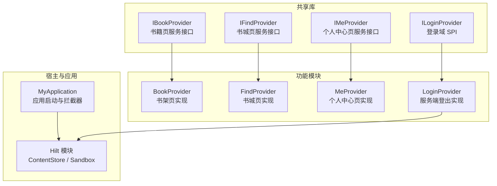
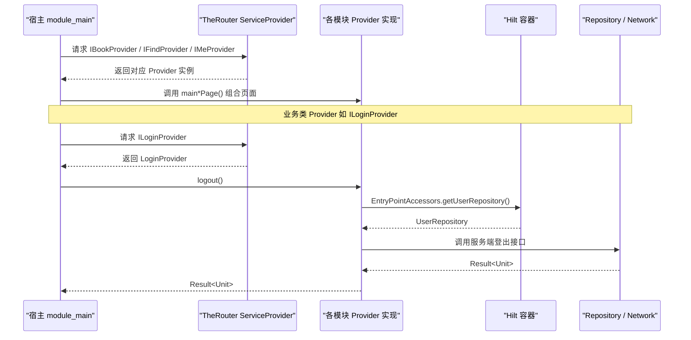
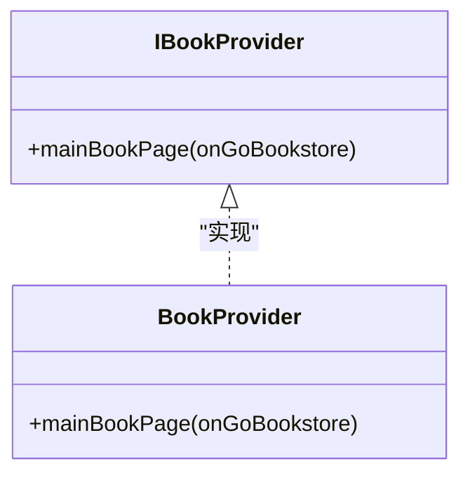
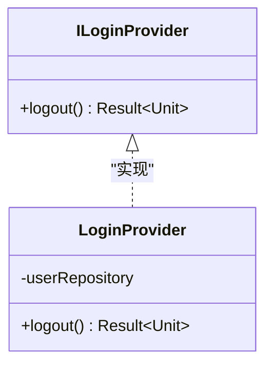
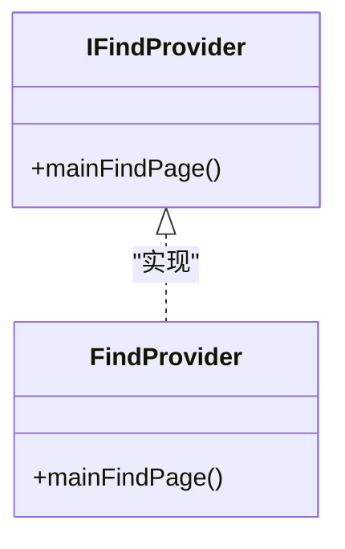
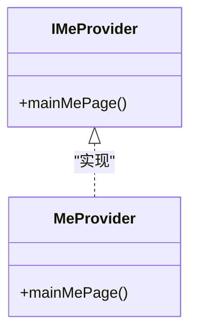
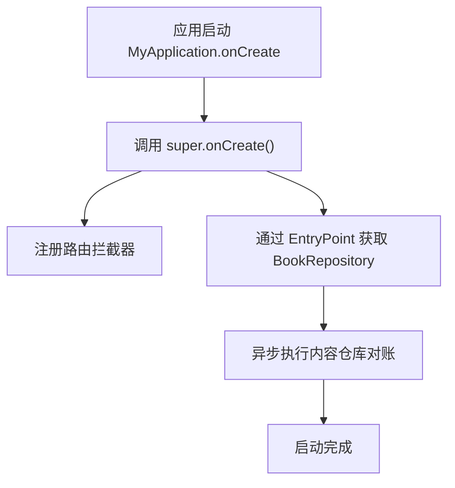
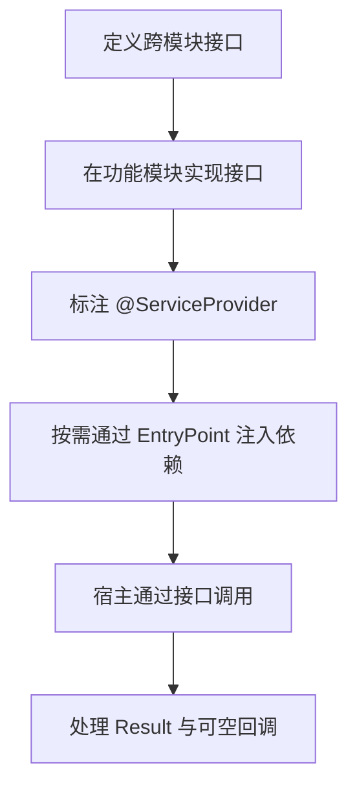

# Provider 接口

<cite>
**本文引用的文件**   
- [IBookProvider.kt](file://lib_book_common/src/main/java/com/ebook/common/provider/IBookProvider.kt)
- [BookProvider.kt](file://module_book/src/main/java/com/ebook/book/provider/BookProvider.kt)
- [ILoginProvider.kt](file://lib_book_common/src/main/java/com/ebook/common/provider/ILoginProvider.kt)
- [LoginProvider.kt](file://module_login/src/main/java/com/ebook/login/provider/LoginProvider.kt)
- [IFindProvider.kt](file://lib_book_common/src/main/java/com/ebook/common/provider/IFindProvider.kt)
- [FindProvider.kt](file://module_find/src/main/java/com/ebook/find/provider/FindProvider.kt)
- [IMeProvider.kt](file://lib_book_common/src/main/java/com/ebook/common/provider/IMeProvider.kt)
- [MeProvider.kt](file://module_me/src/main/java/com/ebook/me/provider/MeProvider.kt)
- [MyApplication.kt](file://module_app/src/main/java/com/ebook/MyApplication.kt)
- [ContentStoreModule.kt](file://lib_book_common/src/main/java/com/ebook/common/di/ContentStoreModule.kt)
- [SandboxModule.kt](file://lib_book_common/src/main/java/com/ebook/common/di/SandboxModule.kt)
</cite>

## 目录
1. [引言](#引言)
2. [项目结构](#项目结构)
3. [核心组件](#核心组件)
4. [架构总览](#架构总览)
5. [详细组件分析](#详细组件分析)
6. [依赖与装配关系](#依赖与装配关系)
7. [版本兼容与扩展点](#版本兼容与扩展点)
8. [调用示例](#调用示例)
9. [错误处理模式](#错误处理模式)
10. [性能考虑](#性能考虑)
11. [调试技巧](#调试技巧)
12. [实现约定与自定义指南](#实现约定与自定义指南)
13. [结论](#结论)

## 引言
本文面向 Android 小说阅读器的跨模块通信层，聚焦 Provider 接口规范。项目中并未定义 `IUserProvider` 或 `ISourceProvider`；跨模块能力通过以下已存在的 Provider 抽象：
- 页面级 Provider：`IBookProvider`、`IFindProvider`、`IMeProvider`
- 业务 SPI Provider：`ILoginProvider`

这些接口位于共享库 `lib_book_common`，由各功能模块（`module_book`、`module_find`、`module_me`、`module_login`）提供实现，并通过 TheRouter 的 `ServiceProvider` 机制在宿主 `module_main` 中解析使用。文档同时补充 Hilt 在数据层与基础设施层的依赖注入配置，帮助读者理解 Provider 与其底层依赖的关系。

## 项目结构
Provider 相关代码采用“接口放公共库、实现放功能模块”的组织方式：

**图表来源**
- [IBookProvider.kt:1-23](file://lib_book_common/src/main/java/com/ebook/common/provider/IBookProvider.kt#L1-L23)
- [BookProvider.kt:1-16](file://module_book/src/main/java/com/ebook/book/provider/BookProvider.kt#L1-L16)
- [IFindProvider.kt:1-13](file://lib_book_common/src/main/java/com/ebook/common/provider/IFindProvider.kt#L1-L13)
- [FindProvider.kt:1-19](file://module_find/src/main/java/com/ebook/find/provider/FindProvider.kt#L1-L19)
- [IMeProvider.kt:1-13](file://lib_book_common/src/main/java/com/ebook/common/provider/IMeProvider.kt#L1-L13)
- [MeProvider.kt:1-20](file://module_me/src/main/java/com/ebook/me/provider/MeProvider.kt#L1-L20)
- [ILoginProvider.kt:1-19](file://lib_book_common/src/main/java/com/ebook/common/provider/ILoginProvider.kt#L1-L19)
- [LoginProvider.kt:1-36](file://module_login/src/main/java/com/ebook/login/provider/LoginProvider.kt#L1-L36)
- [MyApplication.kt:1-66](file://module_app/src/main/java/com/ebook/MyApplication.kt#L1-L66)

**章节来源**
- [IBookProvider.kt:1-23](file://lib_book_common/src/main/java/com/ebook/common/provider/IBookProvider.kt#L1-L23)
- [ILoginProvider.kt:1-19](file://lib_book_common/src/main/java/com/ebook/common/provider/ILoginProvider.kt#L1-L19)
- [IFindProvider.kt:1-13](file://lib_book_common/src/main/java/com/ebook/common/provider/IFindProvider.kt#L1-L13)
- [IMeProvider.kt:1-13](file://lib_book_common/src/main/java/com/ebook/common/provider/IMeProvider.kt#L1-L13)

## 核心组件
本节按 Provider 分类说明其职责、方法签名语义、参数和返回值约定。

### 书籍模块 Provider：IBookProvider
- 定位：书籍模块对外暴露的页面级服务。
- 设计目标：返回 Compose 页面供宿主 NavHost 直接组合，而不是 Fragment。
- 关键成员：
  - `mainBookPage`：接收一个可选回调 `onGoBookstore`，用于从书架跳转到宿主的书城 Tab。
- 参数约定：
  - `onGoBookstore`：类型为可空函数；为 `null` 时调用方不应渲染跳转动作。
- 返回值：无返回值，副作用由 Composable 完成。
- 异常：该接口本身不声明异常；具体 UI 行为由页面实现决定。

**章节来源**
- [IBookProvider.kt:1-23](file://lib_book_common/src/main/java/com/ebook/common/provider/IBookProvider.kt#L1-L23)

### 登录域 SPI：ILoginProvider
- 定位：登录域对外暴露的跨模块能力。
- 设计目标：只暴露“作废服务端会话”，本地会话清理由 `UserSessionManager.clearSession` 单点负责。
- 关键成员：
  - `logout()`：挂起函数，返回 `Result<Unit>`。
- 参数：无。
- 返回值：
  - 成功：`Result.success(Unit)`。
  - 失败：`Result.failure(Exception)`，由调用方决定是否提示用户。
- 独立运行场景：若 `module_login` 不在依赖图中，Provider 不可获取，调用方应允许空实现或跳过。

**章节来源**
- [ILoginProvider.kt:1-19](file://lib_book_common/src/main/java/com/ebook/common/provider/ILoginProvider.kt#L1-L19)

### 书城模块 Provider：IFindProvider
- 定位：书城模块对外暴露的页面级服务。
- 关键成员：
  - `mainFindPage`：返回无参 Composable 页面。
- 适用场景：宿主通过该接口组合书城主页面。

**章节来源**
- [IFindProvider.kt:1-13](file://lib_book_common/src/main/java/com/ebook/common/provider/IFindProvider.kt#L1-L13)

### 个人中心模块 Provider：IMeProvider
- 定位：个人中心模块对外暴露的页面级服务。
- 关键成员：
  - `mainMePage`：返回无参 Composable 页面。
- 适用场景：宿主通过该接口组合个人中心主页面。

**章节来源**
- [IMeProvider.kt:1-13](file://lib_book_common/src/main/java/com/ebook/common/provider/IMeProvider.kt#L1-L13)

## 架构总览
Provider 是跨模块边界契约：接口放在 `lib_book_common`，实现放在各自功能模块，并由 TheRouter 的 `ServiceProvider` 机制发现。对于需要访问仓库等重资源的 Provider，如 `LoginProvider`，再通过 Hilt EntryPoint 桥接获取。

**图表来源**
- [BookProvider.kt:1-16](file://module_book/src/main/java/com/ebook/book/provider/BookProvider.kt#L1-L16)
- [FindProvider.kt:1-19](file://module_find/src/main/java/com/ebook/find/provider/FindProvider.kt#L1-L19)
- [MeProvider.kt:1-20](file://module_me/src/main/java/com/ebook/me/provider/MeProvider.kt#L1-L20)
- [LoginProvider.kt:1-36](file://module_login/src/main/java/com/ebook/login/provider/LoginProvider.kt#L1-L36)

## 详细组件分析

### IBookProvider 与 BookProvider
- `IBookProvider` 是书籍模块对宿主的 Compose 页面出口。
- `BookProvider` 用 `@ServiceProvider` 注册，并委托给 `BookShelfPage`。
- 重要设计：
  - 页面以 Composable 形式暴露，ViewModel 作用域由 `hiltViewModel` 默认绑定到当前 `NavBackStackEntry`。
  - `onGoBookstore` 由宿主传入，避免模块内部耦合路由实现。

**图表来源**
- [IBookProvider.kt:1-23](file://lib_book_common/src/main/java/com/ebook/common/provider/IBookProvider.kt#L1-L23)
- [BookProvider.kt:1-16](file://module_book/src/main/java/com/ebook/book/provider/BookProvider.kt#L1-L16)

**章节来源**
- [IBookProvider.kt:1-23](file://lib_book_common/src/main/java/com/ebook/common/provider/IBookProvider.kt#L1-L23)
- [BookProvider.kt:1-16](file://module_book/src/main/java/com/ebook/book/provider/BookProvider.kt#L1-L16)

### ILoginProvider 与 LoginProvider
- `ILoginProvider` 只暴露服务端侧登出；本地会话清理由 `UserSessionManager.clearSession` 统一处理。
- `LoginProvider` 通过 `@ServiceProvider` 暴露给 TheRouter，并用 `@Singleton` 保证生命周期内单例。
- 依赖桥接：
  - 通过 `EntryPointAccessors.fromApplication(context, UserRepositoryEntryPoint::class.java)` 从 Hilt 容器中取 `UserRepository`。
- 返回值语义：
  - `logout()` 返回 `Result<Unit>`，网络或业务异常封装在 `failure` 中。

**图表来源**
- [ILoginProvider.kt:1-19](file://lib_book_common/src/main/java/com/ebook/common/provider/ILoginProvider.kt#L1-L19)
- [LoginProvider.kt:1-36](file://module_login/src/main/java/com/ebook/login/provider/LoginProvider.kt#L1-L36)

**章节来源**
- [ILoginProvider.kt:1-19](file://lib_book_common/src/main/java/com/ebook/common/provider/ILoginProvider.kt#L1-L19)
- [LoginProvider.kt:1-36](file://module_login/src/main/java/com/ebook/login/provider/LoginProvider.kt#L1-L36)

### IFindProvider 与 FindProvider
- `IFindProvider` 暴露书城主页面。
- `FindProvider` 用 `@ServiceProvider` 注册，委托给 `BookstorePage`。

**图表来源**
- [IFindProvider.kt:1-13](file://lib_book_common/src/main/java/com/ebook/common/provider/IFindProvider.kt#L1-L13)
- [FindProvider.kt:1-19](file://module_find/src/main/java/com/ebook/find/provider/FindProvider.kt#L1-L19)

**章节来源**
- [IFindProvider.kt:1-13](file://lib_book_common/src/main/java/com/ebook/common/provider/IFindProvider.kt#L1-L13)
- [FindProvider.kt:1-19](file://module_find/src/main/java/com/ebook/find/provider/FindProvider.kt#L1-L19)

### IMeProvider 与 MeProvider
- `IMeProvider` 暴露个人中心主页面。
- `MeProvider` 用 `@ServiceProvider` 注册，委托给 `MePage`。

**图表来源**
- [IMeProvider.kt:1-13](file://lib_book_common/src/main/java/com/ebook/common/provider/IMeProvider.kt#L1-L13)
- [MeProvider.kt:1-20](file://module_me/src/main/java/com/ebook/me/provider/MeProvider.kt#L1-L20)

**章节来源**
- [IMeProvider.kt:1-13](file://lib_book_common/src/main/java/com/ebook/common/provider/IMeProvider.kt#L1-L13)
- [MeProvider.kt:1-20](file://module_me/src/main/java/com/ebook/me/provider/MeProvider.kt#L1-L20)

## 依赖与装配关系

### TheRouter ServiceProvider 注册
- 页面类 Provider：`BookProvider`、`FindProvider`、`MeProvider` 均标注 `@ServiceProvider`，由 TheRouter 创建。
- 业务类 Provider：`LoginProvider` 同样标注 `@ServiceProvider`，并使用 `@Singleton` 控制生命周期。

**章节来源**
- [BookProvider.kt:1-16](file://module_book/src/main/java/com/ebook/book/provider/BookProvider.kt#L1-L16)
- [FindProvider.kt:1-19](file://module_find/src/main/java/com/ebook/find/provider/FindProvider.kt#L1-L19)
- [MeProvider.kt:1-20](file://module_me/src/main/java/com/ebook/me/provider/MeProvider.kt#L1-L20)
- [LoginProvider.kt:1-36](file://module_login/src/main/java/com/ebook/login/provider/LoginProvider.kt#L1-L36)

### Hilt 依赖注入与 EntryPoint
- `MyApplication` 是 `@HiltAndroidApp`，负责初始化 Hilt 与路由拦截器。
- 为避免 Application 字段注入过早触发沙箱进程问题，`BookRepository` 通过 `@EntryPoint` 延迟获取。
- `ContentStoreModule`、`SandboxModule` 等 Hilt 模块负责数据层和沙箱基础设施的单例装配。

**图表来源**
- [MyApplication.kt:1-66](file://module_app/src/main/java/com/ebook/MyApplication.kt#L1-L66)
- [ContentStoreModule.kt:1-87](file://lib_book_common/src/main/java/com/ebook/common/di/ContentStoreModule.kt#L1-L87)
- [SandboxModule.kt:1-56](file://lib_book_common/src/main/java/com/ebook/common/di/SandboxModule.kt#L1-L56)

**章节来源**
- [MyApplication.kt:1-66](file://module_app/src/main/java/com/ebook/MyApplication.kt#L1-L66)
- [ContentStoreModule.kt:1-87](file://lib_book_common/src/main/java/com/ebook/common/di/ContentStoreModule.kt#L1-L87)
- [SandboxModule.kt:1-56](file://lib_book_common/src/main/java/com/ebook/common/di/SandboxModule.kt#L1-L56)

## 版本兼容与扩展点

### 现有接口范围
- 当前代码库中存在：
  - 页面级 Provider：`IBookProvider`、`IFindProvider`、`IMeProvider`
  - 业务 SPI：`ILoginProvider`
- 不存在：
  - `IUserProvider`
  - `ISourceProvider`

如果未来新增用户信息或书源管理的跨模块能力，建议沿用同一模式：接口放在 `lib_book_common`，实现放在对应模块，并通过 `@ServiceProvider` 暴露。

### 向后兼容原则
- 新增方法应默认兼容旧实现，或使用可选参数。
- 回调参数（如 `onGoBookstore`）使用可空类型，便于独立运行或旧宿主不传能力时安全降级。
- 业务接口返回 `Result`，避免把未检查异常抛到上层 UI。

**章节来源**
- [IBookProvider.kt:1-23](file://lib_book_common/src/main/java/com/ebook/common/provider/IBookProvider.kt#L1-L23)
- [ILoginProvider.kt:1-19](file://lib_book_common/src/main/java/com/ebook/common/provider/ILoginProvider.kt#L1-L19)

## 调用示例

### 在宿主中组合书籍页面
宿主通过 `IBookProvider` 获取书架页面，并传入书城跳转回调。若回调为空，则不渲染跳转入口。

- 调用流程：
  1. 从 TheRouter 获取 `IBookProvider`。
  2. 调用 `mainBookPage`。
  3. 在书架空态显示“去书城找书”，点击后调用传入的 `onGoBookstore`。

**章节来源**
- [IBookProvider.kt:1-23](file://lib_book_common/src/main/java/com/ebook/common/provider/IBookProvider.kt#L1-L23)
- [BookProvider.kt:1-16](file://module_book/src/main/java/com/ebook/book/provider/BookProvider.kt#L1-L16)

### 在宿主中组合书城页面
宿主通过 `IFindProvider` 获取书城主页面并组合。

**章节来源**
- [IFindProvider.kt:1-13](file://lib_book_common/src/main/java/com/ebook/common/provider/IFindProvider.kt#L1-L13)
- [FindProvider.kt:1-19](file://module_find/src/main/java/com/ebook/find/provider/FindProvider.kt#L1-L19)

### 在宿主中组合个人中心页面
宿主通过 `IMeProvider` 获取个人中心主页面并组合。

**章节来源**
- [IMeProvider.kt:1-13](file://lib_book_common/src/main/java/com/ebook/common/provider/IMeProvider.kt#L1-L13)
- [MeProvider.kt:1-20](file://module_me/src/main/java/com/ebook/me/provider/MeProvider.kt#L1-L20)

### 调用登录域登出接口
调用方通过 `ILoginProvider.logout()` 发起服务端会话作废，再结合本地会话清理策略。

- 推荐流程：
  1. 尝试调用 `logout()`。
  2. 无论结果如何，继续调用本地会话清理逻辑。
  3. 根据 `Result` 状态提示用户。

**章节来源**
- [ILoginProvider.kt:1-19](file://lib_book_common/src/main/java/com/ebook/common/provider/ILoginProvider.kt#L1-L19)
- [LoginProvider.kt:1-36](file://module_login/src/main/java/com/ebook/login/provider/LoginProvider.kt#L1-L36)

## 错误处理模式

### 业务接口返回 Result
- `ILoginProvider.logout()` 使用 `Result<Unit>`，将网络异常、业务异常统一封装。
- 调用方应判断 `isSuccess`，失败时记录日志并决定是否提示用户。

### 可空回调降级
- `IBookProvider.mainBookPage` 的 `onGoBookstore` 为可空，调用方应根据是否为 `null` 决定是否渲染跳转入口。
- 这种设计使模块在独立运行时仍能工作，而不必强依赖宿主路由。

### 应用启动容错
- `MyApplication` 中对内容仓库对账使用 `runCatching`，对账失败仅记日志，不影响应用启动。

**章节来源**
- [ILoginProvider.kt:1-19](file://lib_book_common/src/main/java/com/ebook/common/provider/ILoginProvider.kt#L1-L19)
- [IBookProvider.kt:1-23](file://lib_book_common/src/main/java/com/ebook/common/provider/IBookProvider.kt#L1-L23)
- [MyApplication.kt:1-66](file://module_app/src/main/java/com/ebook/MyApplication.kt#L1-L66)

## 性能考虑

### Provider 实例化
- 页面类 Provider 是轻量代理，主要作用是返回 Composable；实际页面实例每次组合创建，ViewModel 作用域由 `hiltViewModel` 管理。
- 业务类 Provider 如 `LoginProvider` 使用 `@Singleton`，避免重复创建。

### 依赖获取时机
- `LoginProvider` 通过 Hilt EntryPoint 获取仓库，避免在 Provider 构造期阻塞或提前触发重型依赖。
- `MyApplication` 通过 EntryPoint 延迟获取 `BookRepository`，防止沙箱进程误读 Room 库。

### 沙箱与网络
- 沙箱客户端不预热，首次真正执行脚本时才建立连接，避免冷启动额外开销。

**章节来源**
- [BookProvider.kt:1-16](file://module_book/src/main/java/com/ebook/book/provider/BookProvider.kt#L1-L16)
- [LoginProvider.kt:1-36](file://module_login/src/main/java/com/ebook/login/provider/LoginProvider.kt#L1-L36)
- [MyApplication.kt:1-66](file://module_app/src/main/java/com/ebook/MyApplication.kt#L1-L66)
- [SandboxModule.kt:1-56](file://lib_book_common/src/main/java/com/ebook/common/di/SandboxModule.kt#L1-L56)

## 调试技巧

### 独立运行模式
- 当某个功能模块不在依赖图中时，对应的 Provider 可能无法获取。
- 调用方应容忍空实现或空回调，避免崩溃。例如 `ILoginProvider` 在独立模式下可跳过服务端登出。

### 路由回调为空
- 检查 `onGoBookstore` 是否为 `null`，避免在独立宿主中渲染无效按钮。

### 日志与异常
- 对 `Result.failure` 进行日志输出，区分网络异常与业务异常。
- 关注 `MyApplication` 中对内容仓库对账失败的日志，它不会阻断启动，但会影响磁盘空间回收。

**章节来源**
- [ILoginProvider.kt:1-19](file://lib_book_common/src/main/java/com/ebook/common/provider/ILoginProvider.kt#L1-L19)
- [IBookProvider.kt:1-23](file://lib_book_common/src/main/java/com/ebook/common/provider/IBookProvider.kt#L1-L23)
- [MyApplication.kt:1-66](file://module_app/src/main/java/com/ebook/MyApplication.kt#L1-L66)

## 实现约定与自定义指南

### Provider 接口设计规范
- 接口放在 `lib_book_common`，保持模块间最小依赖。
- 页面类 Provider 返回 Composable，不持有 UI 状态。
- 业务类 Provider 返回 `Result`，不吞异常。
- 可选回调使用可空类型，支持独立运行。

### Provider 实现类约定
- 使用 `@ServiceProvider` 暴露给 TheRouter。
- 如需单例，加 `@Singleton`。
- 不要直接在 Provider 构造期注入重型依赖；必要时使用 Hilt EntryPoint 延迟获取。

### 自定义 Provider 开发步骤
1. 在 `lib_book_common` 中定义接口。
2. 在对应功能模块中实现接口。
3. 使用 `@ServiceProvider` 标注实现类。
4. 如需仓库或网络资源，通过 Hilt EntryPoint 或 Repository 间接获取。
5. 在宿主中通过 TheRouter 获取接口并调用。

[本图为概念流程，不对应具体源码]

**章节来源**
- [BookProvider.kt:1-16](file://module_book/src/main/java/com/ebook/book/provider/BookProvider.kt#L1-L16)
- [LoginProvider.kt:1-36](file://module_login/src/main/java/com/ebook/login/provider/LoginProvider.kt#L1-L36)
- [FindProvider.kt:1-19](file://module_find/src/main/java/com/ebook/find/provider/FindProvider.kt#L1-L19)
- [MeProvider.kt:1-20](file://module_me/src/main/java/com/ebook/me/provider/MeProvider.kt#L1-L20)

## 结论
本项目通过 Provider 接口实现了清晰的跨模块边界：页面类 Provider 暴露 Composable 页面，业务类 Provider 暴露 `Result` 驱动的业务能力。TheRouter 的 `ServiceProvider` 与 Hilt 的 `@EntryPoint` 配合，既解耦了模块依赖，又避免了早期注入带来的启动风险。虽然当前没有 `IUserProvider` 和 `ISourceProvider`，但已有 `ILoginProvider` 提供了可扩展的业务 SPI 范式。新增跨模块能力时，应遵循本文约定的接口位置、注解、返回值和错误处理模式。