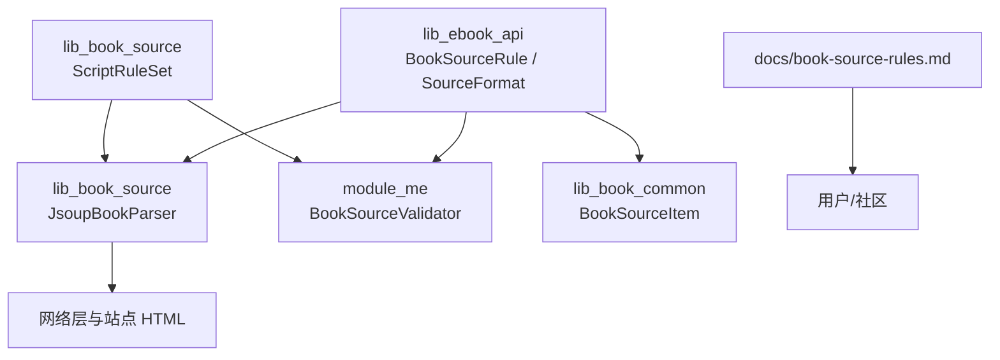
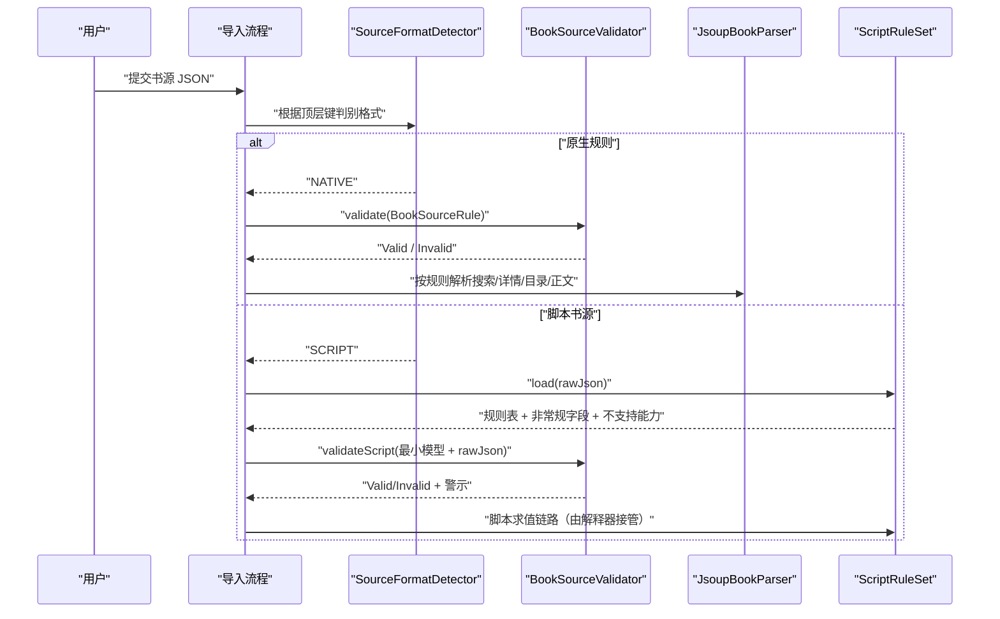
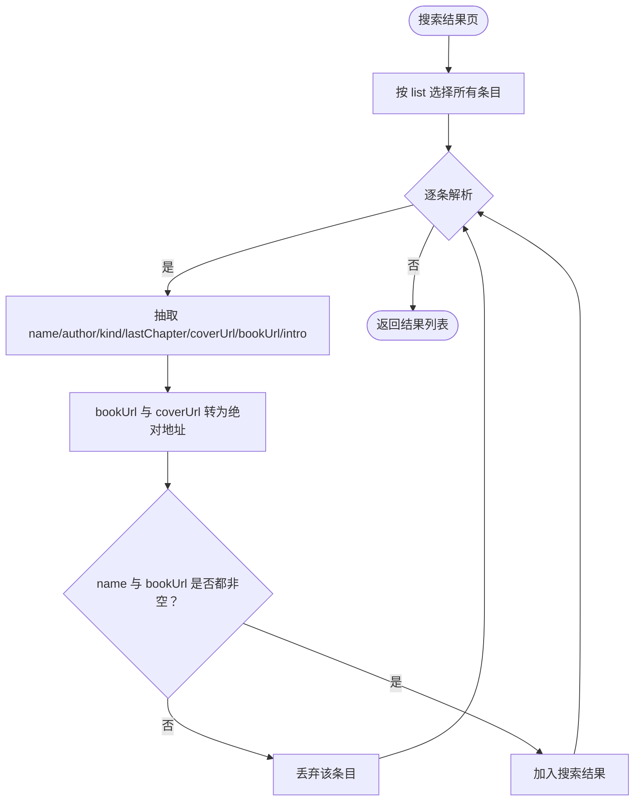
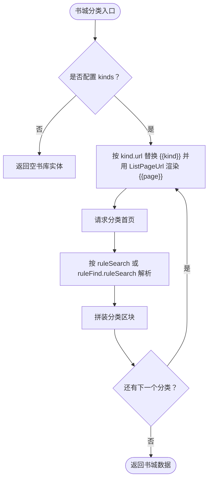
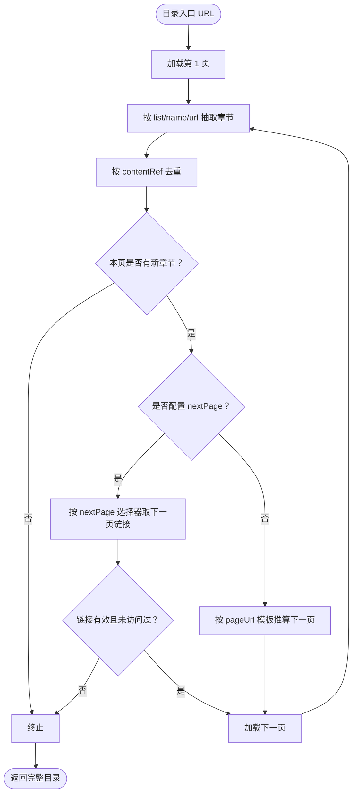
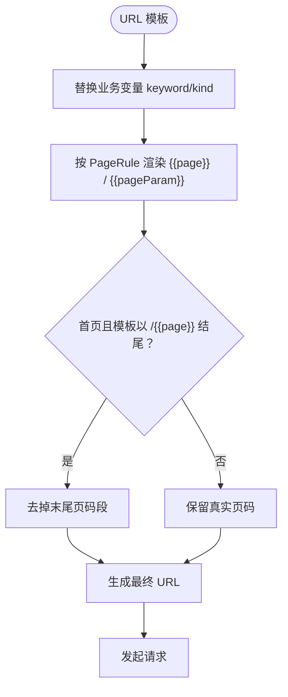
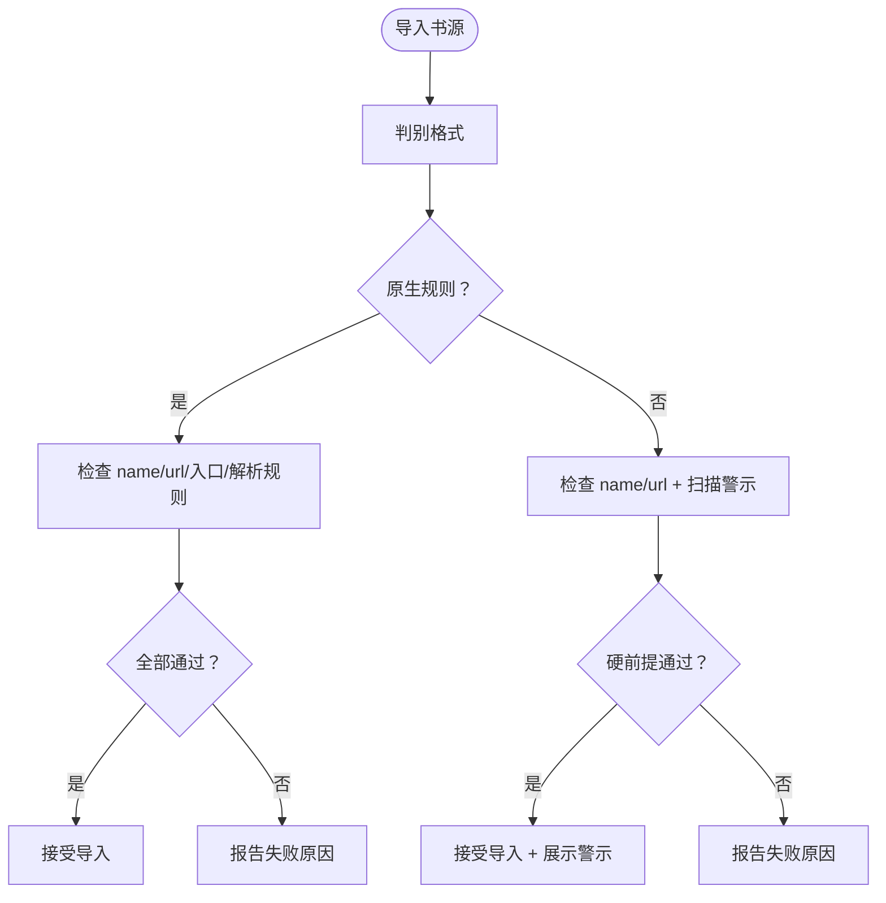
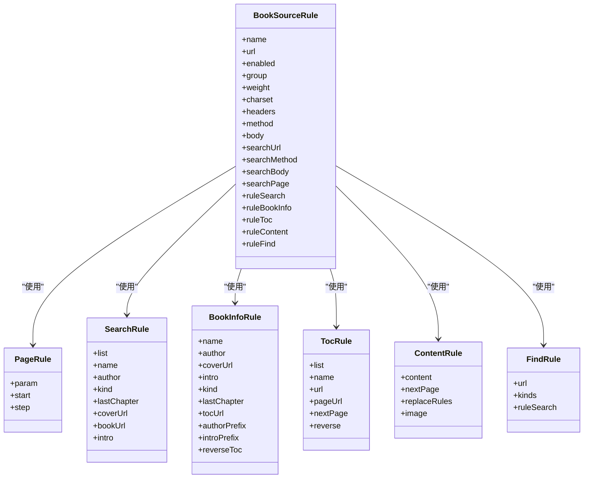

# JSON 规则语法规范

<cite>
**本文引用的文件**   
- [BookSourceRule.kt](file://lib_ebook_api/src/main/java/com/ebook/api/entity/BookSourceRule.kt)
- [SourceFormat.kt](file://lib_ebook_api/src/main/java/com/ebook/api/entity/SourceFormat.kt)
- [JsoupBookParser.kt](file://lib_book_source/src/main/java/com/ebook/source/analyze/JsoupBookParser.kt)
- [ScriptRuleSet.kt](file://lib_book_source/src/main/java/com/ebook/source/script/ScriptRuleSet.kt)
- [BookSourceValidator.kt](file://module_me/src/main/java/com/ebook/me/domain/BookSourceValidator.kt)
- [BookSourceItem.kt](file://lib_book_common/src/main/java/com/ebook/common/analyze/source/BookSourceItem.kt)
- [book-source-rules.md](file://docs/book-source-rules.md)
</cite>

## 目录
1. [引言](#引言)
2. [项目结构](#项目结构)
3. [核心组件](#核心组件)
4. [架构总览](#架构总览)
5. [详细规则语法](#详细规则语法)
6. [URL 模板与分页链](#url-模板与分页链)
7. [基础配置字段](#基础配置字段)
8. [高级选项](#高级选项)
9. [非常规字段形态与兼容性](#非常规字段形态与兼容性)
10. [规则验证流程](#规则验证流程)
11. [错误处理与调试建议](#错误处理与调试建议)
12. [完整书源示例与编写指南](#完整书源示例与编写指南)
13. [依赖关系分析](#依赖关系分析)
14. [性能考虑](#性能考虑)
15. [结论](#结论)

## 引言
本文面向 Android 小说阅读器项目的“JSON 规则”能力，聚焦原生声明式规则（Native）和脚本书源格式（Script），系统化说明六类规则对象、URL 模板、分页机制、基础配置字段、高级选项、非常规字段处理、验证流程与调试方法。目标是让读者既能写出可用的书源 JSON，也能理解应用端如何解析、校验和执行这些规则。

## 项目结构
本仓库中与 JSON 规则相关的实现主要分布在以下模块：
- `lib_ebook_api`：定义原生规则的数据模型与书源格式判别逻辑。
- `lib_book_source`：基于 Jsoup 的原生规则解析器，以及脚本规则的装载视图、能力检测等。
- `module_me`：导入前的最小可用校验逻辑，输出可测试的失败原因与警示。
- `lib_book_common`：书源管理项封装，区分“展示面元数据”和“解析面纯规则”。
- `docs`：用户可见的书源规则文档，包含两种格式的说明、CSS 选择器语法、常见问题。

**图示来源**
- [BookSourceRule.kt:1-200](file://lib_ebook_api/src/main/java/com/ebook/api/entity/BookSourceRule.kt#L1-L200)
- [SourceFormat.kt:1-91](file://lib_ebook_api/src/main/java/com/ebook/api/entity/SourceFormat.kt#L1-L91)
- [JsoupBookParser.kt:1-200](file://lib_book_source/src/main/java/com/ebook/source/analyze/JsoupBookParser.kt#L1-L200)
- [ScriptRuleSet.kt:1-200](file://lib_book_source/src/main/java/com/ebook/source/script/ScriptRuleSet.kt#L1-L200)
- [BookSourceValidator.kt:1-198](file://module_me/src/main/java/com/ebook/me/domain/BookSourceValidator.kt#L1-L198)
- [BookSourceItem.kt:1-49](file://lib_book_common/src/main/java/com/ebook/common/analyze/source/BookSourceItem.kt#L1-L49)

**章节来源**
- [book-source-rules.md:1-411](file://docs/book-source-rules.md#L1-L411)

## 核心组件
- **BookSourceRule**：原生声明式书源规则的 Kotlin 数据模型，承载搜索、详情、目录、正文、发现五组规则以及通用请求配置。
- **PageRule**：统一分页参数，描述页码名、起始页、步长。
- **SearchRule**：搜索结果字段选择器。
- **BookInfoRule**：书籍详情页字段选择器。
- **TocRule**：章节目录选择器与分页方式。
- **ContentRule**：正文容器、下一页、清理规则与图片模式。
- **FindRule**：书城分类发现页 URL 与结果解析规则。
- **SourceFormat / SourceFormatDetector**：判别 JSON 属于“原生规则”还是“脚本书源”，并封装默认源载体。
- **JsoupBookParser**：按 BookSourceRule 发起网络请求、解析 HTML、组装搜索结果、书籍信息、章节列表与书城分类数据。
- **ScriptRuleSet**：脚本 JSON 的规则装载视图，负责把原始 JSON 拆成字符串规则表、记录非常规字段、登记不支持能力。
- **BookSourceValidator**：导入前最小可用校验，原生四条判据、脚本两条硬前提加三项警示。
- **BookSourceItem**：面向管理页的条目封装，携带“展示用规则”和“格式出身”。

**章节来源**
- [BookSourceRule.kt:1-200](file://lib_ebook_api/src/main/java/com/ebook/api/entity/BookSourceRule.kt#L1-L200)
- [SourceFormat.kt:1-91](file://lib_ebook_api/src/main/java/com/ebook/api/entity/SourceFormat.kt#L1-L91)
- [JsoupBookParser.kt:1-200](file://lib_book_source/src/main/java/com/ebook/source/analyze/JsoupBookParser.kt#L1-L200)
- [ScriptRuleSet.kt:1-200](file://lib_book_source/src/main/java/com/ebook/source/script/ScriptRuleSet.kt#L1-L200)
- [BookSourceValidator.kt:1-198](file://module_me/src/main/java/com/ebook/me/domain/BookSourceValidator.kt#L1-L198)
- [BookSourceItem.kt:1-49](file://lib_book_common/src/main/java/com/ebook/common/analyze/source/BookSourceItem.kt#L1-L49)

## 架构总览
原生规则走“JSON → BookSourceRule → JsoupBookParser → HTML 解析”的声明式链路；脚本 JSON 则走“原始 JSON → ScriptRuleSet → 脚本求值器”的可执行链路。两者在导入阶段共用格式判别与最小校验，但解析路径不同。

**图示来源**
- [SourceFormat.kt:1-91](file://lib_ebook_api/src/main/java/com/ebook/api/entity/SourceFormat.kt#L1-L91)
- [BookSourceValidator.kt:1-198](file://module_me/src/main/java/com/ebook/me/domain/BookSourceValidator.kt#L1-L198)
- [ScriptRuleSet.kt:1-200](file://lib_book_source/src/main/java/com/ebook/source/script/ScriptRuleSet.kt#L1-L200)
- [JsoupBookParser.kt:1-200](file://lib_book_source/src/main/java/com/ebook/source/analyze/JsoupBookParser.kt#L1-L200)

## 详细规则语法
本节聚焦六类规则对象：ruleSearch、ruleExplore、ruleBookInfo、ruleToc、ruleContent，以及与之对应的原生模型字段。

### ruleSearch：搜索结果规则
原生侧对应 SearchRule，用于从搜索结果页提取书目条目。关键字段包括：
- list：搜索结果列表的选择器。
- name：书名选择器。
- author：作者选择器。
- kind：分类或类型选择器。
- lastChapter：最新章节选择器。
- coverUrl：封面图选择器，支持属性取值。
- bookUrl：详情页链接选择器，支持属性取值。
- intro：简介选择器。

解析行为要点：
- 列表元素遍历后逐项抽取字段。
- bookUrl 与 coverUrl 会结合书源根地址解析为绝对地址。
- 只有 name 与 bookUrl 非空时才保留该条目。
- desc 字段来自 intro，若为空则显示最新章节作为兜底。

**图示来源**
- [BookSourceRule.kt:1-200](file://lib_ebook_api/src/main/java/com/ebook/api/entity/BookSourceRule.kt#L1-L200)
- [JsoupBookParser.kt:1-200](file://lib_book_source/src/main/java/com/ebook/source/analyze/JsoupBookParser.kt#L1-L200)

**章节来源**
- [BookSourceRule.kt:1-200](file://lib_ebook_api/src/main/java/com/ebook/api/entity/BookSourceRule.kt#L1-L200)
- [JsoupBookParser.kt:1-200](file://lib_book_source/src/main/java/com/ebook/source/analyze/JsoupBookParser.kt#L1-L200)

### ruleExplore：发现/分类规则
脚本侧以 RuleObjectKind.EXPLORE 表示 ruleExplore；原生侧对应 FindRule。两者语义相近但模型不同：
- 脚本规则对象键名为 ruleExplore，原生规则对象键名为 ruleFind。
- 脚本侧有 exploreUrl；原生侧有 url、kinds、ruleSearch。
- 脚本侧支持更复杂的表达式语言；原生侧使用 CSS 选择器。

原生 FindRule 字段：
- url：分类页 URL 模板，必须包含 {{page}}。
- kinds：分类标题与 URL 映射。
- ruleSearch：复用 SearchRule 的结构。

解析行为要点：
- 分类首页通过 ListPageUrl 渲染，避免首页出现 `/{{page}}` 导致 404。
- 分类结果解析优先使用 findRule.ruleSearch，否则回退到全局 ruleSearch。
- 单个分类失败不中断整批，返回空书列表，由仓库层决定是否写入缓存。

**图示来源**
- [BookSourceRule.kt:1-200](file://lib_ebook_api/src/main/java/com/ebook/api/entity/BookSourceRule.kt#L1-L200)
- [JsoupBookParser.kt:201-257](file://lib_book_source/src/main/java/com/ebook/source/analyze/JsoupBookParser.kt#L201-L257)

**章节来源**
- [BookSourceRule.kt:1-200](file://lib_ebook_api/src/main/java/com/ebook/api/entity/BookSourceRule.kt#L1-L200)
- [JsoupBookParser.kt:201-257](file://lib_book_source/src/main/java/com/ebook/source/analyze/JsoupBookParser.kt#L201-L257)

### ruleBookInfo：书籍详情规则
原生侧对应 BookInfoRule，用于从书籍详情页补充书名、作者、封面、简介、分类、最新章节、目录页地址等信息。关键字段包括：
- name、author、coverUrl、intro、kind、lastChapter。
- tocUrl：目录页 URL；为空时使用详情页 URL。
- authorPrefix、introPrefix：文本前缀去除。
- reverseToc：是否反转章节顺序。

解析行为要点：
- 详情页 URL 通常基于已获取的 noteUrl 相对书源根地址拼接。
- 如果 tocUrl 存在，后续目录抓取改用 tocUrl；否则沿用详情页 URL。
- 简介为空时填充默认提示文本。
- 目录顺序可由 BookInfoRule.reverseToc 控制。

**章节来源**
- [BookSourceRule.kt:1-200](file://lib_ebook_api/src/main/java/com/ebook/api/entity/BookSourceRule.kt#L1-L200)
- [JsoupBookParser.kt:1-200](file://lib_book_source/src/main/java/com/ebook/source/analyze/JsoupBookParser.kt#L1-L200)

### ruleToc：目录规则
原生侧对应 TocRule，用于从目录页抽取章节列表，支持两种分页方式：
- nextPage：下一页链接选择器，优先于 pageUrl。
- pageUrl：目录页 URL 模板，按页码递增推算。

关键字段：
- list：章节列表选择器，支持多段。
- name：章节名选择器。
- url：章节内容链接选择器。
- pageUrl：目录分页模板。
- nextPage：下一页选择器。
- reverse：是否反转章节顺序。

解析行为要点：
- 目录抓取由 TocPager 完成，先收集本页章节，再判断下一页或模板下一页。
- 去重依据章节 URL；软 404 与末页都会因“零新增”终止。
- 存在章节数量防御上限，防止规则配错导致无限循环。
- 最终顺序可能受 TocRule.reverse 与 BookInfoRule.reverseToc 共同影响。

**图示来源**
- [BookSourceRule.kt:1-200](file://lib_ebook_api/src/main/java/com/ebook/api/entity/BookSourceRule.kt#L1-L200)
- [JsoupBookParser.kt:257-513](file://lib_book_source/src/main/java/com/ebook/source/analyze/JsoupBookParser.kt#L257-L513)

**章节来源**
- [BookSourceRule.kt:1-200](file://lib_ebook_api/src/main/java/com/ebook/api/entity/BookSourceRule.kt#L1-L200)
- [JsoupBookParser.kt:257-513](file://lib_book_source/src/main/java/com/ebook/source/analyze/JsoupBookParser.kt#L257-L513)

### ruleContent：正文规则
原生侧对应 ContentRule，用于提取章节正文，支持正文分页、清理规则和图片正文模式。关键字段：
- content：正文容器选择器，支持多页。
- nextPage：正文下一页选择器。
- replaceRules：正则清理规则数组。
- image：正文图片选择器。

解析行为要点：
- 正文分页由“下一页 URL 选择器”驱动，空串表示不分页。
- 清理规则按 pattern/replacement/enabled 逐项生效。
- 图片模式适用于正文本身就是图片的站点。

**章节来源**
- [BookSourceRule.kt:1-200](file://lib_ebook_api/src/main/java/com/ebook/api/entity/BookSourceRule.kt#L1-L200)
- [book-source-rules.md:201-411](file://docs/book-source-rules.md#L201-L411)

### ruleExplore 在脚本侧的定位
脚本侧的 RuleObjectKind 明确列出 SEARCH、EXPLORE、BOOK_INFO、TOC、CONTENT 五种规则对象键名，其中 EXPLORE 对应发现/分类场景。它与原生 FindRule 的职责相同，但表达形式由脚本表达式语言承担。脚本规则装载时会对 exploreUrl 做特殊处理：若值为脚本程序形态，则标记为不支持，而不是当作可执行 JS 直接执行。

**章节来源**
- [ScriptRuleSet.kt:1-200](file://lib_book_source/src/main/java/com/ebook/source/script/ScriptRuleSet.kt#L1-L200)

## URL 模板与分页链
URL 模板是书源规则的核心，贯穿搜索、分类、目录、正文多个环节。

### 变量插值
- `{{keyword}}`：搜索关键词，通常由调用方先行编码后再替换。
- `{{page}}`：页码，由分页工具统一换算。
- `{{pageParam}}`：分页参数名，例如 page、p。
- `{{kind}}`：分类 URL，用于发现/分类场景。
- 脚本侧还支持 `@put:key=value`、`@get:key` 等变量机制。

### URL 选项
- 原生规则中，选择器可使用 `@attr` 形式取出属性值，如 `a@href`、`img@src`。
- 脚本侧链式规则支持 `@css:`、`@json:`、`@xpath:`、`@js:` 等模式标志。
- 脚本规则组合符包括 `&&`、`||`、`%%`。

### 分页链机制
- 列表分页：searchUrl 和 ruleFind.url 均通过 ListPageUrl 渲染，首页对 `/{{page}}` 结尾模板做裁剪。
- 目录分页：TocRule.nextPage 优先；pageUrl 作为模板推算。
- 正文分页：ContentRule.nextPage 决定是否需要继续翻页。
- 脚本侧 URL 数组：nextTocUrl、nextContentUrl 可写为数组形态，表示多页一次给出，按固定页序访问。

**图示来源**
- [JsoupBookParser.kt:257-317](file://lib_book_source/src/main/java/com/ebook/source/analyze/JsoupBookParser.kt#L257-L317)
- [ScriptRuleSet.kt:201-286](file://lib_book_source/src/main/java/com/ebook/source/script/ScriptRuleSet.kt#L201-L286)

**章节来源**
- [JsoupBookParser.kt:257-513](file://lib_book_source/src/main/java/com/ebook/source/analyze/JsoupBookParser.kt#L257-L513)
- [ScriptRuleSet.kt:201-286](file://lib_book_source/src/main/java/com/ebook/source/script/ScriptRuleSet.kt#L201-L286)

## 基础配置字段
原生规则的基础字段集中在 BookSourceRule 顶部，常见字段如下：
- name：书源名称。
- url：书源根地址，也是唯一标识和请求拼接起点。
- enabled：是否启用。
- group：分组名。
- weight：排序权重。
- charset：字符编码。
- headers：自定义请求头。
- method：默认请求方法。
- body：默认 POST 请求体模板。
- searchUrl：搜索 URL 模板。
- searchMethod：覆盖默认 method。
- searchBody：覆盖默认 body。
- searchPage：搜索分页规则。
- ruleSearch：搜索结果规则。
- ruleBookInfo：书籍详情规则。
- ruleToc：目录规则。
- ruleContent：正文规则。
- ruleFind：发现/分类规则。

约束与默认值：
- 多数字段有默认值，便于部分配置。
- url 必须是 http(s) 开头，否则导入校验失败。
- searchUrl 与 ruleFind.url 至少有一个非空，否则视为没有入口。
- ruleSearch.list 与 ruleContent.content 不能同时缺失，否则视为缺少解析规则。

**章节来源**
- [BookSourceRule.kt:1-200](file://lib_ebook_api/src/main/java/com/ebook/api/entity/BookSourceRule.kt#L1-L200)
- [BookSourceValidator.kt:1-198](file://module_me/src/main/java/com/ebook/me/domain/BookSourceValidator.kt#L1-L198)

## 高级选项
### variable 与 variableComment
脚本侧源级字段：
- variable：源级自定义变量原文，供脚本读取。
- variableComment：变量说明文本，常用于判断用户是否填写过。

### header
脚本侧源级字段：
- header：请求头 JSON 字符串，脚本侧常通过 JSON.parse 读取。

### loginUrl
脚本侧源级字段：
- loginUrl：登录地址文本。
- 本项目不实现登录态维持，因此 presence 会被标记为不支持能力 LOGIN。
- 校验阶段作为警示而非阻断条件。

### lastUpdateTime
脚本侧源级字段：
- lastUpdateTime：最后更新时间原文，保持字符串形态，避免数字与日期混装导致静默变 0。

### enabledExplore
脚本侧源级字段：
- enabledExplore：是否启用发现能力，默认 true。

**章节来源**
- [ScriptRuleSet.kt:1-200](file://lib_book_source/src/main/java/com/ebook/source/script/ScriptRuleSet.kt#L1-L200)
- [ScriptRuleSet.kt:201-286](file://lib_book_source/src/main/java/com/ebook/source/script/ScriptRuleSet.kt#L201-L286)

## 非常规字段形态与兼容性
脚本规则装载器会把 JSON 中的每个规则对象字段分为三类：
- 字符串形态：进入 objects 规则表，参与能力判定与求值。
- 数组形态：元素逐个分类能力，但整笔记为 irregularFields，不进规则表。
- 其他形态（对象、数字等）：记为 irregularFields，不进规则表。

典型非常规字段：
- nextTocUrl：目录下一页 URL 数组。
- nextContentUrl：正文下一页 URL 数组。
- contentBatch：正文批量字段，被登记为不规则字段。
- webJs、sourceRegex：正文扩展能力，分别标记为 WEB_JS 与 SOURCE_REGEX。
- downloadUrls：下载相关能力，标记为 DOWNLOAD_URLS。
- jsLib、coverDecodeJs、exploreScreen、bookUrlPattern、ruleReview：标记为不支持能力。

兼容性原则：
- 未知键忽略，不抛异常，保证社区 JSON 可导入。
- 非常规字段不破坏“未配置”语义，由求值层决定是否展开。
- 能力登记与规则解析分离，避免“读不懂”与“不支持”混淆。

**章节来源**
- [ScriptRuleSet.kt:1-200](file://lib_book_source/src/main/java/com/ebook/source/script/ScriptRuleSet.kt#L1-L200)
- [ScriptRuleSet.kt:201-286](file://lib_book_source/src/main/java/com/ebook/source/script/ScriptRuleSet.kt#L201-L286)

## 规则验证流程
导入前校验分为原生规则与脚本两类。

### 原生规则验证
四条判据逐条独立、全部收集：
1. name 是否为空白。
2. url 是否为 http(s) 开头。
3. searchUrl 与 ruleFind.url 是否都为空白。
4. ruleSearch.list 与 ruleContent.content 是否都为空白。

结果类型：
- Valid：可导入。
- Invalid：带原因列表，用于预览层一次性展示所有问题。

### 脚本规则验证
两条硬前提：
1. bookSourceName 是否为空白。
2. bookSourceUrl 是否为 http(s) 开头。

三项警示不阻断导入：
1. HAS_EXECUTABLE_CODE：规则含 `<js>` 或 `@js:`。
2. NEEDS_LOGIN：loginUrl 非空。
3. NOT_TEXT_SOURCE：bookSourceType 非 0。

此外，若脚本 JSON 无法解码为最小模型，会报 SCRIPT_UNPARSABLE。

**图示来源**
- [BookSourceValidator.kt:1-198](file://module_me/src/main/java/com/ebook/me/domain/BookSourceValidator.kt#L1-L198)
- [SourceFormat.kt:1-91](file://lib_ebook_api/src/main/java/com/ebook/api/entity/SourceFormat.kt#L1-L91)

**章节来源**
- [BookSourceValidator.kt:1-198](file://module_me/src/main/java/com/ebook/me/domain/BookSourceValidator.kt#L1-L198)

## 错误处理与调试建议
### 解析层错误处理
- 搜索请求失败：捕获异常并返回空列表，不影响其他书源。
- 分类抓取失败：单个分类失败记录日志并返回空书列表，不中断整批。
- 目录抓取：网络失败不回退部分列表，异常原样抛出，由上层刷新重试。
- URL 编码失败：字符编码异常时回落原始内容并记录日志。

### 调试建议
- 先用浏览器开发者工具确认 CSS 选择器能选中目标元素。
- 检查 charset 是否与站点一致。
- 对 searchUrl 和 ruleFind.url，确认首页是否真的不带页码段。
- 对 ruleToc.pageUrl，确认相对目录语义是否符合预期。
- 对 ruleContent.replaceRules，逐项关闭正则，定位误删段落。
- 对脚本规则，关注 unsupported 能力报告，特别是 LOGIN、JS、WEB_JS、SOURCE_REGEX。
- 对非常规字段，检查 nextTocUrl、nextContentUrl 是否为字符串数组。

**章节来源**
- [JsoupBookParser.kt:1-200](file://lib_book_source/src/main/java/com/ebook/source/analyze/JsoupBookParser.kt#L1-L200)
- [JsoupBookParser.kt:201-513](file://lib_book_source/src/main/java/com/ebook/source/analyze/JsoupBookParser.kt#L201-L513)
- [ScriptRuleSet.kt:1-200](file://lib_book_source/src/main/java/com/ebook/source/script/ScriptRuleSet.kt#L1-L200)

## 完整书源示例与编写指南
以下示例以“如何组织一个完整书源 JSON”为目标，覆盖搜索、详情、目录、正文与发现场景。为避免泄露具体站点内容，这里只给出字段结构和说明，不包含真实网站源码片段。

### 原生规则示例结构
- 顶层：name、url、enabled、group、weight、charset、headers、method、body。
- 搜索：searchUrl、searchMethod、searchBody、searchPage、ruleSearch。
- 详情：ruleBookInfo。
- 目录：ruleToc。
- 正文：ruleContent。
- 发现：ruleFind。

编写步骤：
1. 填写 name 与 url。
2. 写 searchUrl，确保关键词与分页正确。
3. 写 ruleSearch.list 与 bookUrl，确保能拿到书目。
4. 写 ruleBookInfo.name、author、coverUrl、intro。
5. 写 ruleToc.list 与 url，必要时配置 nextPage 或 pageUrl。
6. 写 ruleContent.content，必要时配置 nextPage 与 replaceRules。
7. 如需书城分类，填写 ruleFind.url、kinds 与 ruleSearch。

### 脚本规则示例结构
- 顶层：bookSourceUrl、bookSourceName、bookSourceGroup、bookSourceType、enabled、enabledExplore、variable、variableComment、header、bookSourceComment、loginUrl、lastUpdateTime。
- 规则对象：ruleSearch、ruleExplore、ruleBookInfo、ruleToc、ruleContent。
- 非常规字段：nextTocUrl、nextContentUrl、contentBatch 等数组或对象形态。

编写步骤：
1. 确认顶层 bookSourceUrl 与 bookSourceName。
2. 若需要变量，填写 variable 与 variableComment。
3. 若需要请求头，填写 header。
4. 编写 ruleSearch 与 ruleBookInfo，确保能解析书目与详情。
5. 编写 ruleToc，优先尝试 nextPage，其次 pageUrl。
6. 编写 ruleContent，必要时使用数组形式的 nextContentUrl。
7. 若需要发现能力，编写 ruleExplore 或 ruleSearch 配合外部发现逻辑。

**章节来源**
- [book-source-rules.md:1-411](file://docs/book-source-rules.md#L1-L411)
- [BookSourceRule.kt:1-200](file://lib_ebook_api/src/main/java/com/ebook/api/entity/BookSourceRule.kt#L1-L200)
- [ScriptRuleSet.kt:1-200](file://lib_book_source/src/main/java/com/ebook/source/script/ScriptRuleSet.kt#L1-L200)

## 依赖关系分析
- BookSourceRule 是原生规则的唯一数据契约，被解析器与管理层共用。
- SourceFormat 与 SourceFormatDetector 决定 JSON 路由到原生还是脚本路径。
- JsoupBookParser 依赖 OkHttp 与 Jsoup，负责网络与 HTML 解析。
- ScriptRuleSet 依赖 JSON 解析，负责脚本规则装载、能力登记与非常规字段记录。
- BookSourceValidator 不依赖 Android，可在 JVM 单测中验证规则有效性。
- BookSourceItem 仅在管理面携带 format 出身，避免 UI 直连数据库实体。

**图示来源**
- [BookSourceRule.kt:1-200](file://lib_ebook_api/src/main/java/com/ebook/api/entity/BookSourceRule.kt#L1-L200)

**章节来源**
- [BookSourceRule.kt:1-200](file://lib_ebook_api/src/main/java/com/ebook/api/entity/BookSourceRule.kt#L1-L200)

## 性能考虑
- 搜索与分类解析使用协程 IO 线程，避免阻塞主线程。
- 分类加载失败按空区块计入，降低单次网络故障对整体书城页面的影响。
- 目录抓取设置章节数量上限，防止规则错误导致的内存与时间膨胀。
- URL 模板渲染为纯函数，无需构造解析器即可单测，有利于单元测试性能与稳定性。
- 脚本规则装载与求值分离，避免导入阶段执行复杂解析逻辑。

[本节为通用性能讨论，不直接分析具体代码行]

## 结论
JSON 规则语法在本项目中分为两条主线：原生声明式规则强调稳定、可测试、可维护；脚本规则强调灵活、强大、可执行。六类规则对象覆盖了“找到书 → 看详情 → 取目录 → 读正文 → 分类浏览”的主要阅读流程。URL 模板与分页链是规则之间最关键的连接点，而基础配置字段与高级选项则决定了请求行为与可扩展能力。导入阶段的格式判别与最小校验保证了规则质量，非常规字段机制则提供了向后兼容空间。对于书源维护者，建议从最小可用配置开始，逐步完善搜索、详情、目录、正文与发现规则，并通过浏览器开发者工具与日志定位问题。