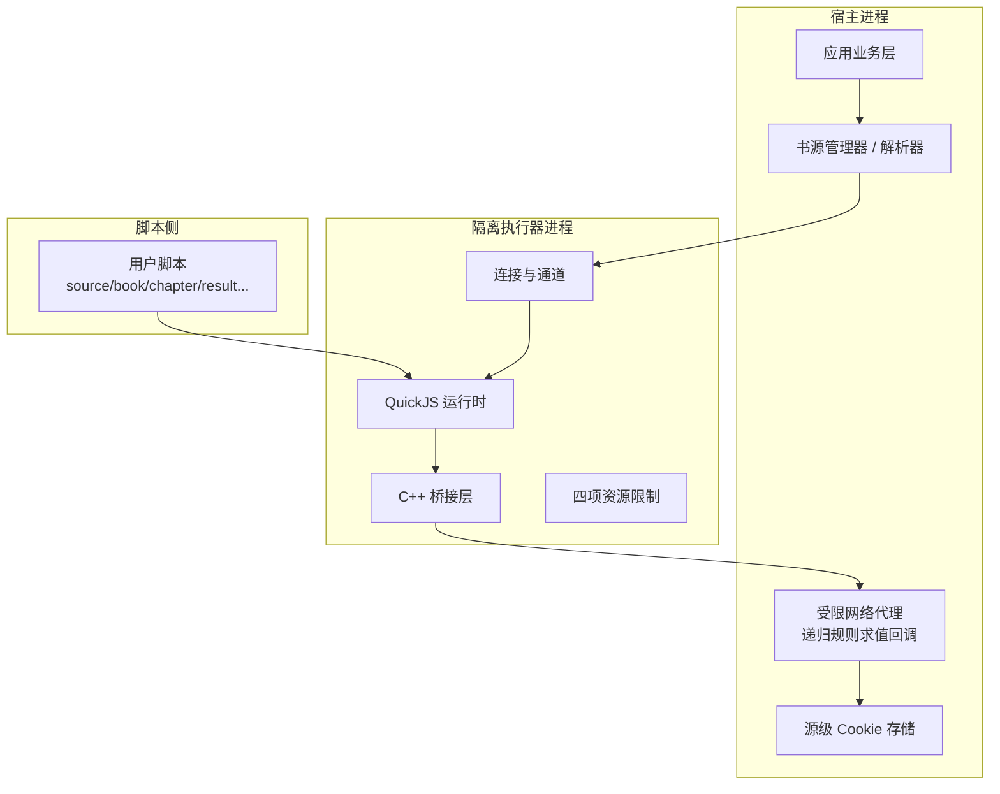
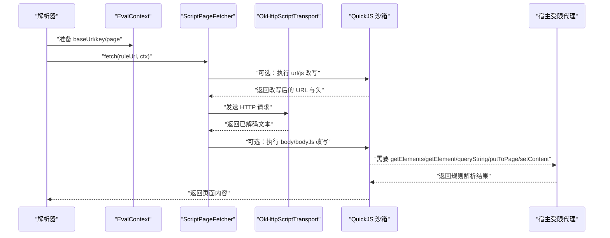
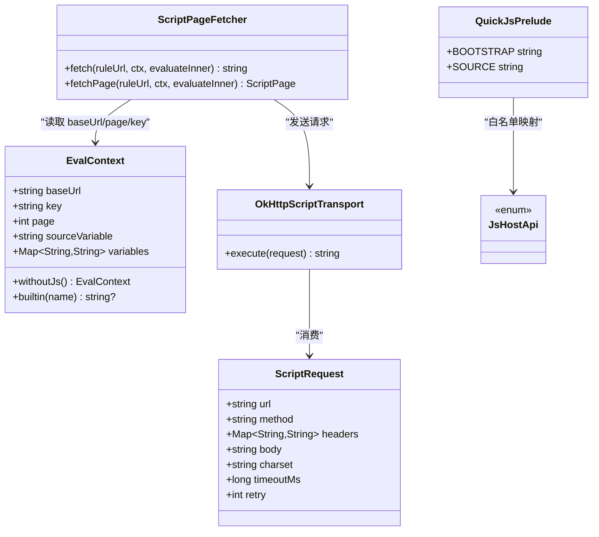
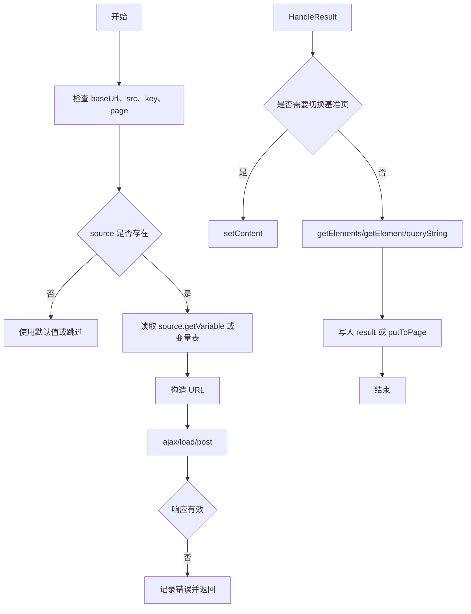

# JavaScript 脚本接口

<cite>
**本文引用的文件**   
- [JsHostApi.kt](file://lib_book_source/src/main/java/com/ebook/source/script/JsHostApi.kt)
- [EvalContext.kt](file://lib_book_source/src/main/java/com/ebook/source/script/EvalContext.kt)
- [ScriptHttp.kt](file://lib_book_source/src/main/java/com/ebook/source/script/ScriptHttp.kt)
- [QuickJsPrelude.kt](file://lib_book_source/src/main/java/com/ebook/source/sandbox/QuickJsPrelude.kt)
- [0028-untrusted-js-sandbox.md](file://docs/adr/0028-untrusted-js-sandbox.md)
- [2026-09-09-js-sandbox-executor.md](file://docs/superpowers/plans/2026-09-09-js-sandbox-executor.md)
- [2026-09-10-bookstore-script-source-wiring.md](file://docs/superpowers/plans/2026-09-10-bookstore-script-source-wiring.md)
</cite>

## 目录
1. [引言](#引言)
2. [项目结构](#项目结构)
3. [核心组件](#核心组件)
4. [架构总览](#架构总览)
5. [详细接口分析](#详细接口分析)
6. [依赖关系分析](#依赖关系分析)
7. [性能与安全约束](#性能与安全约束)
8. [调试与排错指南](#调试与排错指南)
9. [最佳实践](#最佳实践)
10. [结论](#结论)

## 引言
本文件面向编写“脚本书源”的开发者，说明 Android 小说阅读器中 JavaScript 脚本的执行环境、可用全局对象与方法、网络请求 API、内置工具函数、沙箱限制以及宿主进程通信协议。文档以仓库中的实际实现为依据，重点覆盖：

- `source` 对象属性与方法：`bookSourceUrl`、`bookSourceName`、`key`、`getVariable`、`setVariable`、`putVariable`、`put`、`get`、`rmKey` 等。
- 顶层变量：`baseUrl`、`src`、`key`、`page`、`title`、`result`、`book`、`chapter`。
- 网络与页面处理 API：`ajax`、`load`、`post`、`responseCode`、`setContent`、`getElements`、`getElement`、`queryString`、`putToPage`。
- Cookie 会话 API：`cookie.getCookie`、`cookie.setCookie`、`cookie.removeCookie`。
- 计算与编码工具：摘要、Base64、十六进制、URI 编码、时间格式化、对称加密、随机 UUID、HMAC、字节编解码等。
- 沙箱限制：零权限隔离进程、白名单能力、拒绝的 API、超时、堆栈与报文大小上限、任务级作用域。
- 宿主通信协议：Binder + JSON 控制面、双向回调通道、序列化格式与错误语义。

## 项目结构
JavaScript 脚本能力由三层组成：

**图示来源**   
- [0028-untrusted-js-sandbox.md:1-65](file://docs/adr/0028-untrusted-js-sandbox.md#L1-L65)
- [2026-09-09-js-sandbox-executor.md:1-120](file://docs/superpowers/plans/2026-09-09-js-sandbox-executor.md#L1-L120)

关键实现位置：

| 职责 | 主要文件 |
|---|---|
| 白名单能力表 | [JsHostApi.kt](file://lib_book_source/src/main/java/com/ebook/source/script/JsHostApi.kt) |
| 解析上下文与作用域 | [EvalContext.kt](file://lib_book_source/src/main/java/com/ebook/source/script/EvalContext.kt) |
| 取文与 HTTP 传输 | [ScriptHttp.kt](file://lib_book_source/src/main/java/com/ebook/source/script/ScriptHttp.kt) |
| 沙箱全局装配与垫片 | [QuickJsPrelude.kt](file://lib_book_source/src/main/java/com/ebook/source/sandbox/QuickJsPrelude.kt) |
| 安全决策与执行器计划 | [0028-untrusted-js-sandbox.md](file://docs/adr/0028-untrusted-js-sandbox.md), [2026-09-09-js-sandbox-executor.md](file://docs/superpowers/plans/2026-09-09-js-sandbox-executor.md) |
| 书城默认源接线 | [2026-09-10-bookstore-script-source-wiring.md](file://docs/superpowers/plans/2026-09-10-bookstore-script-source-wiring.md) |

**章节来源**   
- [JsHostApi.kt:1-114](file://lib_book_source/src/main/java/com/ebook/source/script/JsHostApi.kt#L1-L114)
- [EvalContext.kt:1-83](file://lib_book_source/src/main/java/com/ebook/source/script/EvalContext.kt#L1-L83)
- [ScriptHttp.kt:1-157](file://lib_book_source/src/main/java/com/ebook/source/script/ScriptHttp.kt#L1-L157)
- [QuickJsPrelude.kt:1-256](file://lib_book_source/src/main/java/com/ebook/source/sandbox/QuickJsPrelude.kt#L1-L256)
- [0028-untrusted-js-sandbox.md:1-65](file://docs/adr/0028-untrusted-js-sandbox.md#L1-L65)
- [2026-09-09-js-sandbox-executor.md:1-120](file://docs/superpowers/plans/2026-09-09-js-sandbox-executor.md#L1-L120)

## 核心组件
### 执行环境与全局绑定
每次执行前，沙箱会注入一组全局变量和对象：

| 名称 | 类型 | 含义 |
|---|---|---|
| `baseUrl` | 字符串或 `undefined` | 当前页面绝对地址；翻页时逐页推进 |
| `src` | 字符串或 `undefined` | 当前页面原始内容 |
| `key` | 字符串或 `undefined` | 搜索关键字或定位键 |
| `page` | 整数或 `undefined` | 当前页码 |
| `title` | 字符串或 `undefined` | 当前标题 |
| `result` | 字符串或 `undefined` | 最终结果载体（字段解析后填入） |
| `book` | 对象或 `undefined` | 书籍实体 JSON 的反序列化结果 |
| `chapter` | 对象或 `undefined` | 章节实体 JSON 的反序列化结果 |
| `source` | 对象或 `undefined` | 书源数据对象，附带行为方法 |

这些绑定由沙箱前置代码注入，缺失或空值会被转为 `undefined`，因此判断是否存在时应使用 `typeof result === 'undefined'` 这类判空方式。

**章节来源**   
- [QuickJsPrelude.kt:1-120](file://lib_book_source/src/main/java/com/ebook/source/sandbox/QuickJsPrelude.kt#L1-L120)

### 解析上下文
一次解析任务持有可变状态：

| 字段 | 说明 |
|---|---|
| `baseUrl` | 可变的当前页基准地址 |
| `key` | 搜索或发现阶段的键 |
| `page` | 当前页码 |
| `sourceVariable` | 书源自定义变量的整串 JSON 文本 |
| `variables` | 任务级变量表，按键保存字符串值 |
| `js` | 指向 JS 桥；嵌套规则求值时为空，避免再次进入沙箱 |

上下文强调“单次解析任务”的作用域：变量不会跨任务持久化，跨段的全局缓存写法在本实现中不可靠。

**章节来源**   
- [EvalContext.kt:1-83](file://lib_book_source/src/main/java/com/ebook/source/script/EvalContext.kt#L1-L83)

## 架构总览
脚本通过 QuickJS 在隔离进程中执行，宿主进程只暴露白名单能力。网络请求、变量存取、递归规则求值和日志都由主进程受限代理完成。

**图示来源**   
- [ScriptHttp.kt:80-157](file://lib_book_source/src/main/java/com/ebook/source/script/ScriptHttp.kt#L80-L157)
- [QuickJsPrelude.kt:120-256](file://lib_book_source/src/main/java/com/ebook/source/sandbox/QuickJsPrelude.kt#L120-L256)
- [0028-untrusted-js-sandbox.md:30-65](file://docs/adr/0028-untrusted-js-sandbox.md#L30-L65)

## 详细接口分析

### source 对象
`source` 是书源数据对象。它的数据来自宿主传入的 JSON，行为则通过垫片安装。

#### 数据属性
| 属性 | 类型 | 说明 |
|---|---|---|
| `bookSourceUrl` | 字符串 | 书源地址 |
| `bookSourceName` | 字符串 | 书源名称 |
| `key` | 字符串 | 与 `bookSourceUrl` 同值的别名 |
| `getKey()` | 字符串 | 返回 `bookSourceUrl` |

其他字段取决于书源 JSON 的结构，例如规则定义、登录配置、评论接口等。脚本不应假设固定字段，而应优先检查是否存在。

**章节来源**   
- [QuickJsPrelude.kt:201-256](file://lib_book_source/src/main/java/com/ebook/source/sandbox/QuickJsPrelude.kt#L201-L256)

#### 变量读取与写入
`source` 提供两类变量接口：

| API | 参数 | 返回值 | 作用域 |
|---|---|---|---|
| `source.getVariable()` | 无 | 整串 JSON 文本 | 书源级，但本仓实现为任务级 |
| `source.setVariable(json)` | 字符串 | 无 | 书源级，本仓实现为任务级 |
| `source.putVariable(key, value)` | 键、值 | 无 | 任务级变量表 |
| `source.put(key, value)` | 键、值 | 无 | 任务级变量表 |
| `source.get(key)` | 键 | 字符串或 `undefined` | 任务级变量表 |
| `source.rmKey(key)` | 键 | 无 | 任务级变量表 |

重要约束：

- `source.getVariable()` 读写的是整串 JSON 文本，不是按键表。
- `source.get(key)` 只有“读变量”语义，不重载成网络请求。
- 变量表 `variables` 是任务级：同一解析任务内的嵌套规则可以共享同一张表，但不同任务之间不共享。
- 上游另有 book 级和 chapter 级变量面，本仓把它们也落到同一张任务变量表上；`cache` 不在沙箱中出现，遇到即 `ReferenceError`。

**章节来源**   
- [EvalContext.kt:1-83](file://lib_book_source/src/main/java/com/ebook/source/script/EvalContext.kt#L1-L83)
- [QuickJsPrelude.kt:201-256](file://lib_book_source/src/main/java/com/ebook/source/sandbox/QuickJsPrelude.kt#L201-L256)
- [JsHostApi.kt:60-114](file://lib_book_source/src/main/java/com/ebook/source/script/JsHostApi.kt#L60-L114)

### 顶层变量
| 名称 | 类型 | 用法 |
|---|---|---|
| `baseUrl` | 字符串或 `undefined` | 相对 URL 与翻页基准 |
| `src` | 字符串或 `undefined` | 当前页面正文 |
| `key` | 字符串或 `undefined` | 搜索关键字 |
| `page` | 整数或 `undefined` | 当前页码 |
| `title` | 字符串或 `undefined` | 当前标题 |
| `result` | 字符串或 `undefined` | 字段解析后的结果 |
| `book` | 对象或 `undefined` | 书籍实体 |
| `chapter` | 对象或 `undefined` | 章节实体 |

**章节来源**   
- [QuickJsPrelude.kt:1-120](file://lib_book_source/src/main/java/com/ebook/source/sandbox/QuickJsPrelude.kt#L1-L120)

### 网络请求 API

#### ajax
调用方式等价于向宿主发起受限网络请求。参数为一个包含请求信息的对象，通常包括 URL、HTTP 方法、请求头和请求体。

典型用途：

- 获取登录态。
- 抓取外部站点正文。
- 按书源约定构造带签名或加密的请求。

注意：

- 所有网络请求都走宿主受限代理。
- 私网地址、非法 scheme、过大响应等由宿主侧判定。
- 脚本不应直接访问底层网络库，也不应绕过这个入口。

**章节来源**   
- [JsHostApi.kt:30-60](file://lib_book_source/src/main/java/com/ebook/source/script/JsHostApi.kt#L30-L60)
- [QuickJsPrelude.kt:120-180](file://lib_book_source/src/main/java/com/ebook/source/sandbox/QuickJsPrelude.kt#L120-L180)

#### load
用于加载网页并返回正文。与 `ajax` 的区别主要在宿主封装的返回形态；脚本侧统一通过宿主代理转发。

**章节来源**   
- [JsHostApi.kt:30-60](file://lib_book_source/src/main/java/com/ebook/source/script/JsHostApi.kt#L30-L60)
- [QuickJsPrelude.kt:120-180](file://lib_book_source/src/main/java/com/ebook/source/sandbox/QuickJsPrelude.kt#L120-L180)

#### post
POST 请求，支持三个参数：URL、请求体、请求头对象。若省略请求头，则不附加自定义头。

**章节来源**   
- [JsHostApi.kt:30-60](file://lib_book_source/src/main/java/com/ebook/source/script/JsHostApi.kt#L30-L60)
- [QuickJsPrelude.kt:120-180](file://lib_book_source/src/main/java/com/ebook/source/sandbox/QuickJsPrelude.kt#L120-L180)

#### responseCode
根据 URL 查询对应响应的状态码。该能力依赖宿主记录最近一次网络调用的状态。

**章节来源**   
- [JsHostApi.kt:30-60](file://lib_book_source/src/main/java/com/ebook/source/script/JsHostApi.kt#L30-L60)
- [QuickJsPrelude.kt:120-180](file://lib_book_source/src/main/java/com/ebook/source/sandbox/QuickJsPrelude.kt#L120-L180)

#### setContent
将脚本自己通过 `ajax`、`load` 或 `post` 取回的页面内容设为后续规则求值的基准页。

常见模式：

1. 用 `ajax` 或 `post` 抓取目标页。
2. 用 `setContent(正文, 页面地址)` 把基准页切换到新页面。
3. 继续调用 `getElements`、`getString` 等规则解析新页面的 DOM。

**章节来源**   
- [JsHostApi.kt:60-90](file://lib_book_source/src/main/java/com/ebook/source/script/JsHostApi.kt#L60-L90)
- [QuickJsPrelude.kt:120-180](file://lib_book_source/src/main/java/com/ebook/source/sandbox/QuickJsPrelude.kt#L120-L180)

#### getElements、getElement、queryString、putToPage
这些是“递归规则求值”能力：脚本把规则串交给宿主解释器，在当前页面上下文中执行原生解析逻辑。

| API | 参数 | 返回值 | 用途 |
|---|---|---|---|
| `getElements(rule)` | 规则串 | 元素集合 | 批量解析 |
| `getElement(rule)` | 规则串 | 单个元素 | 单条解析 |
| `queryString(rule)` | 规则串 | 字符串 | 提取文本 |
| `putToPage(key, value)` | 键、值 | 无 | 把结果写回页面上下文 |

嵌套规则求值不再执行 JS：如果嵌套层遇到 `@js:` 或 `<js>`，会抛出“需要脚本沙箱执行器”的类型化异常，而不是真正进入二次 JS 执行。

**章节来源**   
- [JsHostApi.kt:60-90](file://lib_book_source/src/main/java/com/ebook/source/script/JsHostApi.kt#L60-L90)
- [QuickJsPrelude.kt:120-180](file://lib_book_source/src/main/java/com/ebook/source/sandbox/QuickJsPrelude.kt#L120-L180)
- [2026-09-09-js-sandbox-executor.md:90-160](file://docs/superpowers/plans/2026-09-09-js-sandbox-executor.md#L90-L160)

### Cookie 会话 API
每个书源有一份会话 Cookie 存储。脚本可通过 `cookie` 对象管理：

| API | 参数 | 作用 |
|---|---|---|
| `cookie.getCookie(name)` | 名称 | 读取会话 Cookie |
| `cookie.setCookie(name, value)` | 名称、值 | 设置会话 Cookie |
| `cookie.removeCookie(name)` | 名称 | 删除会话 Cookie |

这些操作不发外呼，不消耗取页配额，适合在登录后保存 token、鉴权头等。

**章节来源**   
- [JsHostApi.kt:90-114](file://lib_book_source/src/main/java/com/ebook/source/script/JsHostApi.kt#L90-L114)
- [QuickJsPrelude.kt:201-256](file://lib_book_source/src/main/java/com/ebook/source/sandbox/QuickJsPrelude.kt#L201-L256)

### 计算与编码工具
以下能力属于“纯计算”，不触发网络 I/O，通常在执行器进程内完成：

| API | 说明 |
|---|---|
| `md5` | MD5 摘要 |
| `sha1` | SHA-1 摘要 |
| `sha256` | SHA-256 摘要 |
| `base64Encode` | Base64 编码 |
| `base64Decode` | Base64 解码 |
| `base64EncodeUrl` | URL 安全的 Base64 编码 |
| `base64DecodeUrl` | URL 安全的 Base64 解码 |
| `hexEncode` | 十六进制编码 |
| `hexDecode` | 十六进制解码 |
| `aesEncode` / `aesDecode` | AES 对称加解密 |
| `desEncode` / `desDecode` | DES 对称加解密 |
| `uriEncode` | URI 编码 |
| `randomUUID` | 生成随机 UUID |
| `digestHex` | 通用摘要十六进制输出 |
| `hmacBase64` | HMAC + Base64 |
| `symmetricCrypto` | 创建对称加密对象 |
| `bytesToStr` | 字节标记转字符串 |
| `timestamp` | 时间戳 |
| `FormatDate` | 格式化日期 |

对称加密对象还提供 `encrypt`、`decrypt`、`encryptBase64`、`encryptHex`、`decryptStr` 等方法。

**章节来源**   
- [JsHostApi.kt:10-60](file://lib_book_source/src/main/java/com/ebook/source/script/JsHostApi.kt#L10-L60)
- [QuickJsPrelude.kt:1-180](file://lib_book_source/src/main/java/com/ebook/source/sandbox/QuickJsPrelude.kt#L1-L180)

### 日志 API
| API | 参数 | 行为 |
|---|---|---|
| `toast(message)` | 消息 | 映射为日志，不弹出 UI |
| `log(message)` | 消息 | 输出日志 |

这是为了兼容旧脚本中的 toast 习惯，同时避免脚本直接操作 UI。

**章节来源**   
- [JsHostApi.kt:90-114](file://lib_book_source/src/main/java/com/ebook/source/script/JsHostApi.kt#L90-L114)
- [QuickJsPrelude.kt:120-180](file://lib_book_source/src/main/java/com/ebook/source/sandbox/QuickJsPrelude.kt#L120-L180)

## 依赖关系分析

**图示来源**   
- [EvalContext.kt:1-83](file://lib_book_source/src/main/java/com/ebook/source/script/EvalContext.kt#L1-L83)
- [ScriptHttp.kt:1-157](file://lib_book_source/src/main/java/com/ebook/source/script/ScriptHttp.kt#L1-L157)
- [JsHostApi.kt:1-114](file://lib_book_source/src/main/java/com/ebook/source/script/JsHostApi.kt#L1-L114)
- [QuickJsPrelude.kt:1-256](file://lib_book_source/src/main/java/com/ebook/source/sandbox/QuickJsPrelude.kt#L1-L256)

**章节来源**   
- [ScriptHttp.kt:1-157](file://lib_book_source/src/main/java/com/ebook/source/script/ScriptHttp.kt#L1-L157)
- [EvalContext.kt:1-83](file://lib_book_source/src/main/java/com/ebook/source/script/EvalContext.kt#L1-L83)
- [JsHostApi.kt:1-114](file://lib_book_source/src/main/java/com/ebook/source/script/JsHostApi.kt#L1-L114)

## 性能与安全约束

### 执行模型
- 引擎：自集成 QuickJS。
- 执行器：独立的 Android 进程，声明 `isolatedProcess`，零权限运行。
- 通信：Binder + JSON 控制面。
- 并发：同一时刻只有一帧在执行，避免 runtime 线程安全问题。
- 任务边界：每次 `execute` 重建 `JSContext`，脚本经 `globalThis` 留下的状态不会跨任务存活。

**章节来源**   
- [0028-untrusted-js-sandbox.md:1-65](file://docs/adr/0028-untrusted-js-sandbox.md#L1-L65)
- [2026-09-09-js-sandbox-executor.md:1-120](file://docs/superpowers/plans/2026-09-09-js-sandbox-executor.md#L1-L120)

### 资源限制四件套
| 限制 | 说明 |
|---|---|
| wall-clock 超时 | 通过内核中断器打断，绝对截止时间由宿主传入 |
| 堆上限 | 超出时销毁 runtime，无法恢复则杀进程 |
| JS 栈上限 | 深递归保护；实际栈空间还受线程影响 |
| 报文大小上限 | binder 事务缓冲约 1 MB，超限会抛大事务异常 |

此外还有：

- 每任务外呼次数上限。
- 回调重入深度上限。
- 每页请求/响应大小上限。

**章节来源**   
- [0028-untrusted-js-sandbox.md:30-65](file://docs/adr/0028-untrusted-js-sandbox.md#L30-L65)

### 白名单与拒绝项
白名单是“正面清单”：只有表中登记的名字存在，其他名字根本不存在于脚本全局对象上。

允许的能力类别：

- 摘要与编码。
- 对称加解密。
- URI 编码、UUID、时间格式化。
- 受限网络代理。
- 变量存取。
- 递归规则求值。
- Cookie 会话。
- 日志。

明确不支持的能力包括：

- 浏览器自动化。
- 登录流程。
- 验证码。
- 文件与资产访问。
- Java/Android 反射。
- 批量外呼。
- 持久化登录信息。
- 刷新探索条目。
- 并发控制。

被拒绝时会抛出带有特殊前缀的错误，便于区分“能力未实现”和“普通解析失败”。

**章节来源**   
- [JsHostApi.kt:1-114](file://lib_book_source/src/main/java/com/ebook/source/script/JsHostApi.kt#L1-L114)
- [QuickJsPrelude.kt:120-256](file://lib_book_source/src/main/java/com/ebook/source/sandbox/QuickJsPrelude.kt#L120-L256)
- [0028-untrusted-js-sandbox.md:30-65](file://docs/adr/0028-untrusted-js-sandbox.md#L30-L65)

### 变量作用域
- 任务级变量表：`@put:`、`java.put`、`source.put`、`source.get`、`book.putVariable`、`chapter.putVariable` 落点相同。
- 书源级整串变量：`source.getVariable`、`source.setVariable` 是另一组形状，但本仓仍按任务级实现。
- 嵌套规则求值共享变量表，但 `baseUrl`、`page`、`key` 快照传递，防止嵌套翻页污染外层基准。

**章节来源**   
- [EvalContext.kt:1-83](file://lib_book_source/src/main/java/com/ebook/source/script/EvalContext.kt#L1-L83)
- [QuickJsPrelude.kt:201-256](file://lib_book_source/src/main/java/com/ebook/source/sandbox/QuickJsPrelude.kt#L201-L256)

## 调试与排错指南

### 常见错误分类
| 现象 | 可能原因 | 建议排查 |
|---|---|---|
| `ReferenceError` | 使用了不存在的全局变量或 API | 检查是否属于白名单；确认 `book`、`chapter`、`source` 是否存在 |
| 参数个数不符 | 方法元数不匹配 | 对照 `JsHostApi` 的 min/max 参数 |
| 网络请求失败 | URL 非法、非 2xx、私网地址、大小超限 | 先打印 URL、method、headers；检查 host 是否在白名单 |
| 中文乱码 | 字符集不正确 | 检查 `charset` 选项；服务端 Content-Type 可能被拦截器修改 |
| 正文太大 | 超过 binder 事务缓冲 | 减少响应体或使用分页 |
| 超时或卡住 | wall-clock 到期、主线程调用、死循环 | 避免阻塞逻辑；不要在主线程直接调沙箱 |
| “本机没装沙箱” | 沙箱不可用或处于嵌套规则求值层 | 检查隔离进程是否可用；嵌套层不允许再执行 JS |

### 网络请求诊断
推荐步骤：

1. 先打印要请求的 URL。
2. 打印 HTTP 方法和请求头。
3. 确认请求体是否为预期字符串。
4. 确认 charset 与站点编码一致。
5. 检查响应状态码是否为 2xx。
6. 对大响应进行截断后再调试。

**章节来源**   
- [ScriptHttp.kt:1-157](file://lib_book_source/src/main/java/com/ebook/source/script/ScriptHttp.kt#L1-L157)

### 变量与上下文诊断
推荐步骤：

1. 使用 `source.getVariable()` 读取整串 JSON，观察书源级变量结构。
2. 使用 `source.get(key)` 读取任务级变量。
3. 检查 `baseUrl` 是否与翻页逻辑一致。
4. 检查 `page` 是否在搜索或发现 URL 场景下有意义。
5. 不要把跨任务的期望写在 `globalThis` 中。

**章节来源**   
- [EvalContext.kt:1-83](file://lib_book_source/src/main/java/com/ebook/source/script/EvalContext.kt#L1-L83)
- [QuickJsPrelude.kt:201-256](file://lib_book_source/src/main/java/com/ebook/source/sandbox/QuickJsPrelude.kt#L201-L256)

## 最佳实践

### 错误处理
- 始终检查 `baseUrl`、`src`、`result`、`book`、`chapter`、`source` 是否存在。
- 对网络请求做 try/catch，并把异常转换为可读错误。
- 不要依赖 `java.get(url)` 的网络语义；网络请求应使用 `ajax`、`load`、`post`。
- 对超大响应提前截断，避免触发报文大小限制。
- 对 charset 显式指定，不要依赖站点 Content-Type。

### 性能优化
- 复用计算结果：在同一任务内缓存正则、摘要、解码结果。
- 避免重复请求：能用 `baseUrl`、`page`、`key` 推导的 URL 不要额外拉取。
- 谨慎使用递归规则求值：每次嵌套都可能触发宿主回调。
- 避免无限循环和指数级 DOM 遍历。
- 不要在脚本中做长时间同步阻塞操作。

### 调试技巧
- 使用 `log` 输出关键中间状态。
- 打印 `baseUrl` 和当前 URL，确认相对路径落位正确。
- 使用 `setContent` 切换基准页后，立即打印下一页解析结果。
- 对签名 URL 使用 `uriEncode`、`base64Encode`、`hmacBase64` 等工具单独验证。
- 遇到“需要脚本沙箱执行器”时，确认是否处于嵌套规则求值层。

### 脚本开发流程

[此图为概念流程图，不直接映射具体源码文件]

## 结论
本项目的 JavaScript 脚本接口围绕“最小能力、最大可控性”设计：

- 脚本可见的全局对象和方法全部来自白名单。
- 网络请求、变量存取、递归规则求值和 Cookie 都由宿主受限代理统一控制。
- 执行器进程使用隔离进程、QuickJS、Binder+JSON 协议，并叠加超时、堆、栈、报文大小和资源计数限制。
- `source` 对象既承载书源数据，也暴露变量读写与会话管理能力。
- 开发脚本时应优先考虑健壮的错误处理、明确的字符集、合理的分页和缓存策略，并避免依赖已被拒绝的能力。

对于更底层的实现细节，例如隔离进程自检、C++ 桥接层、Binder 帧格式、连接重试与断连重启，请参考 ADR 和执行器计划；对于脚本作者而言，最关键的契约是 `JsHostApi` 白名单、`QuickJsPrelude` 全局装配和 `EvalContext` 的任务级作用域。