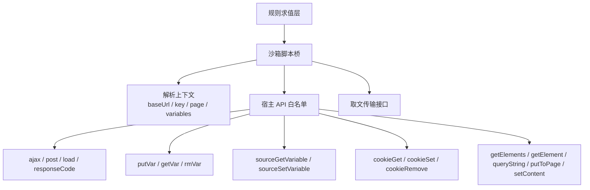
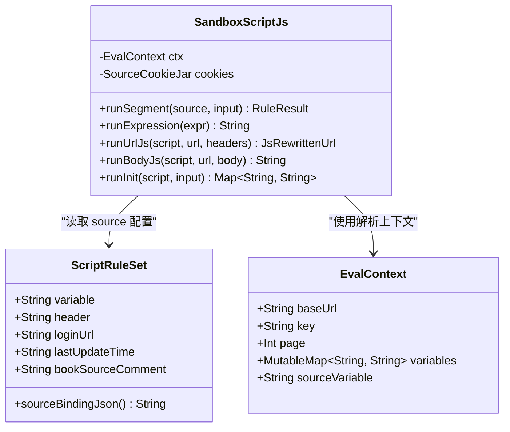
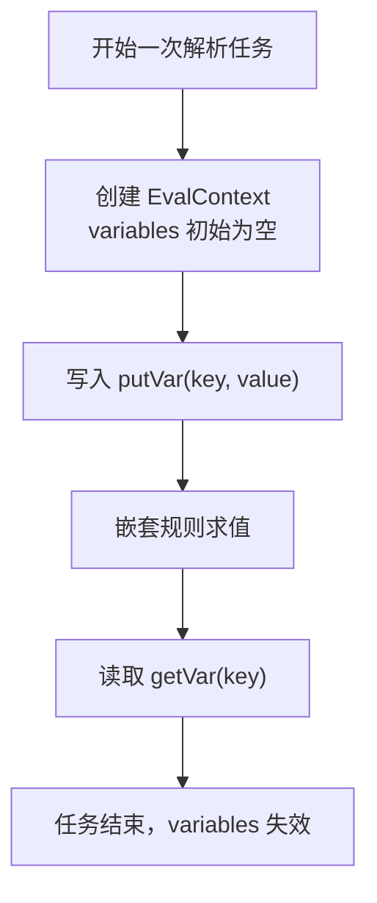
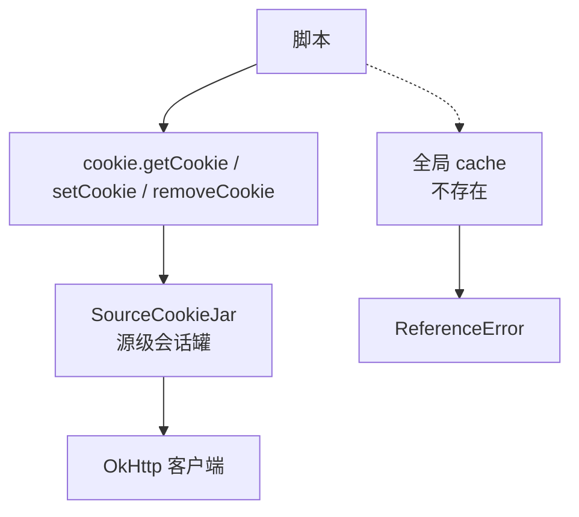
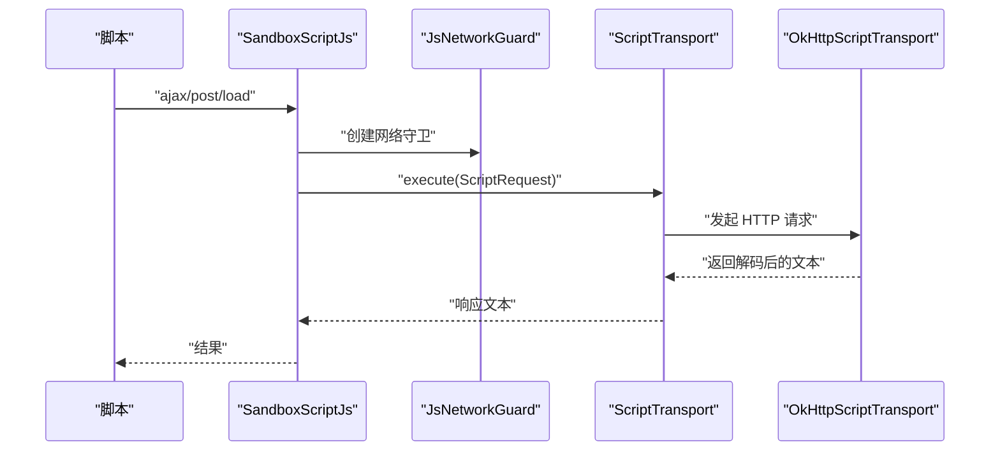
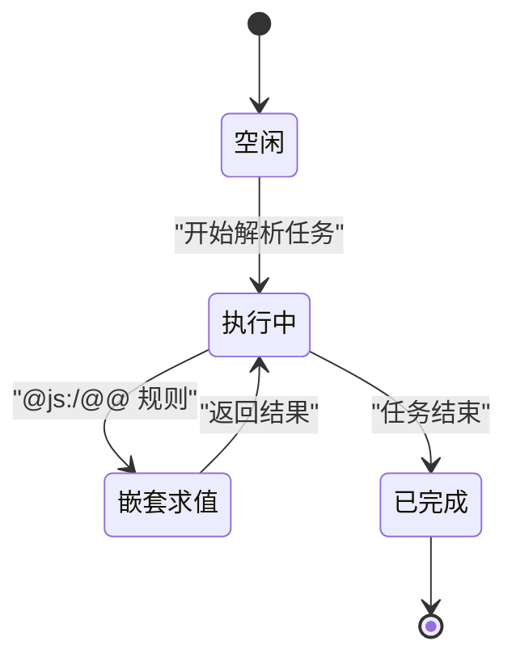

# 全局对象与方法

<cite>
**本文引用的文件**   
- [JsHostApi.kt](file://lib_book_source/src/main/java/com/ebook/source/script/JsHostApi.kt)
- [EvalContext.kt](file://lib_book_source/src/main/java/com/ebook/source/script/EvalContext.kt)
- [ScriptRuleSet.kt](file://lib_book_source/src/main/java/com/ebook/source/script/ScriptRuleSet.kt)
- [SandboxScriptJs.kt](file://lib_book_source/src/main/java/com/ebook/source/script/SandboxScriptJs.kt)
- [ScriptHttp.kt](file://lib_book_source/src/main/java/com/ebook/source/script/ScriptHttp.kt)
- [SandboxScriptJsTest.kt](file://lib_book_source/src/test/java/com/ebook/source/script/SandboxScriptJsTest.kt)
</cite>

## 目录

1. [引言](#引言)
2. [执行环境概览](#执行环境概览)
3. [source 对象的完整 API](#source-对象的完整-api)
4. [持久变量与任务级作用域](#持久变量与任务级作用域)
5. [Cookie 管理与缓存访问接口](#cookie-管理与缓存访问接口)
6. [网络与页面处理入口](#网络与页面处理入口)
7. [线程安全与并发注意事项](#线程安全与并发注意事项)
8. [常见脚本模式与示例路径](#常见脚本模式与示例路径)
9. [故障排查与边界行为](#故障排查与边界行为)
10. [结论](#结论)

## 引言

本文面向书源 JavaScript 脚本作者，说明脚本执行环境中对外暴露的全局能力。重点包括：

- `source` 对象中只读配置字段和可变字段的读取方式。
- 持久变量 API：任务级键值存储、源级整串变量、Cookie 会话。
- Cookie 管理、缓存访问在脚本侧的真实形态。
- 变量的作用域、生命周期、线程安全约束。
- 如何把 `source` 配置与请求头、登录地址、最后更新时间等字段结合到真实脚本逻辑中。

需要特别注意：**本仓库并未实现完整的“JavaScript 全局对象”语义**。脚本侧可见的能力集中在白名单 API 表、`source` 数据绑定以及规则层上下文；许多常见浏览器或 Node.js 全局名（例如 `window`、`document`、`fs`）并不存在。审查脚本能做什么，应以白名单 API 表为准。

**章节来源**
- [JsHostApi.kt:1-114](file://lib_book_source/src/main/java/com/ebook/source/script/JsHostApi.kt#L1-L114)
- [ScriptRuleSet.kt:70-121](file://lib_book_source/src/main/java/com/ebook/source/script/ScriptRuleSet.kt#L70-L121)

## 执行环境概览

脚本执行由沙箱桥接器驱动：规则层把脚本片段、输入页面和当前上下文交给 `SandboxScriptJs`，后者构造调用代理、注入绑定变量、通过宿主调用接口进入受限执行器。

**图表来源**
- [SandboxScriptJs.kt:1-200](file://lib_book_source/src/main/java/com/ebook/source/script/SandboxScriptJs.kt#L1-L200)
- [JsHostApi.kt:1-114](file://lib_book_source/src/main/java/com/ebook/source/script/JsHostApi.kt#L1-L114)
- [EvalContext.kt:1-83](file://lib_book_source/src/main/java/com/ebook/source/script/EvalContext.kt#L1-L83)

### 关键事实

| 维度 | 实现口径 |
|---|---|
| 全局能力来源 | `JsHostApi` 枚举中的 `jsName` 集合，白名单之外不存在。 |
| 计算型 API | `md5`、`sha1`、`sha256`、`base64Encode`、`hexEncode`、`aesEncode`、`desEncode`、`timestamp`、`formatDate`、`randomUUID`、`digestHex`、`hmacBase64`、`symmetricCrypto`、`bytesToStr` 等。 |
| 网络型 API | `ajax`、`post`、`load`、`responseCode`，一律经主进程代理，不直接走执行器进程网络。 |
| 变量 API | `putVar`、`getVar`、`rmVar`；源级整串变量 `source.getVariable`、`source.setVariable`。 |
| Cookie API | `cookie.getCookie`、`cookie.setCookie`、`cookie.removeCookie`。 |
| DOM/规则递归 API | `getElements`、`getElement`、`queryString`、`putToPage`、`setContent`。 |
| 日志 API | `toast`、`log`。 |

**章节来源**
- [JsHostApi.kt:1-114](file://lib_book_source/src/main/java/com/ebook/source/script/JsHostApi.kt#L1-L114)

## source 对象的完整 API

### 设计目标

`source` 对象是脚本读取书源配置的入口。它分为两类：

1. **只读配置属性**：来自已加载的书源定义，脚本只能读取。
2. **可变配置属性**：脚本可以读取并写入，但写入结果属于解析期状态，不会自动落库。

`source` 的数据面由 `ScriptRuleSet.sourceBindingJson()` 生成，作为 JSON 字符串传给脚本侧。方法名（如 `getKey()`、`getVariable()`、`put()`）不在这里装配，而是在 JS 垫片层挂到可执行对象上，以便在执行过程中回主进程读取最新状态。

**图表来源**
- [ScriptRuleSet.kt:70-121](file://lib_book_source/src/main/java/com/ebook/source/script/ScriptRuleSet.kt#L70-L121)
- [EvalContext.kt:1-83](file://lib_book_source/src/main/java/com/ebook/source/script/EvalContext.kt#L1-L83)
- [SandboxScriptJs.kt:1-200](file://lib_book_source/src/main/java/com/ebook/source/script/SandboxScriptJs.kt#L1-L200)

### 只读属性

| 属性名 | 类型 | 含义 | 是否始终存在 |
|---|---|---|---|
| `bookSourceUrl` | 字符串 | 书源 URL。 | 是 |
| `bookSourceName` | 字符串 | 书源名称。 | 是 |
| `bookSourceGroup` | 字符串或空 | 书源分组。未声明时不出现在 `source` 对象。 | 否 |
| `bookSourceComment` | 字符串或空 | 书源注释。未声明时不出现在 `source` 对象。 | 否 |

这些属性用于识别当前书源，也可被脚本当作开关或调试信息。例如，脚本可以用 `bookSourceName` 判断是否处于预期源，或用 `bookSourceComment` 读取用户自定义的配置开关。

**章节来源**
- [ScriptRuleSet.kt:111-120](file://lib_book_source/src/main/java/com/ebook/source/script/ScriptRuleSet.kt#L111-L120)

### 可变属性

| 属性名 | 类型 | 读写方式 | 说明 |
|---|---|---|---|
| `variable` | 字符串 | 可读可写 | 源级自定义变量，通常保存一段 JSON 文本。 |
| `header` | 字符串或空 | 可读 | 源自带头域，通常以 JSON 字符串形式存在。 |
| `loginUrl` | 字符串或空 | 可读 | 登录地址文本。本仓不实现登录流程，脚本可把它当作配置项。 |
| `lastUpdateTime` | 字符串或空 | 可读 | 最后更新时间原文，可能是数字或日期字符串。 |

#### 读取方式

- `source.bookSourceName`：直接读取书源名称。
- `source.header`：读取头域 JSON 字符串，通常需要 `JSON.parse(source.header)` 再取字段。
- `source.variable`：读取源级自定义变量整串。
- `source.loginUrl`：读取登录地址文本。
- `source.lastUpdateTime`：读取最后更新时间文本。

#### 写入方式

- `source.variable = newValue`：更新源级整串变量。
- `source.header = newHeaderJson`：覆盖头域 JSON 字符串。
- `source.loginUrl`、`source.lastUpdateTime`：虽然结构上允许写入，但脚本侧通常只读；写入后只在本次解析任务的 `source` 快照内可见，不会自动持久化。

#### 重要边界

- `variable` 和 `header` 默认可能为空字符串。空串表示“声明了但内容为空”，与“未声明”不同。
- `loginUrl`、`lastUpdateTime` 的默认值是空字符串；若原书源 JSON 没有这两个键，`sourceBindingJson()` 会跳过它们，脚本读到的是 `undefined`。
- `variable` 的内容由上层持久化到书源行；本仓解析阶段的作用域与任务级变量相同，即单次解析任务。

**章节来源**
- [ScriptRuleSet.kt:70-86](file://lib_book_source/src/main/java/com/ebook/source/script/ScriptRuleSet.kt#L70-L86)
- [ScriptRuleSet.kt:111-120](file://lib_book_source/src/main/java/com/ebook/source/script/ScriptRuleSet.kt#L111-L120)
- [ScriptRuleSet.kt:220-231](file://lib_book_source/src/main/java/com/ebook/source/script/ScriptRuleSet.kt#L220-L231)

## 持久变量与任务级作用域

### 三套变量形态

代码中存在三种与“变量”相关的形态，不能混为一谈：

| 形态 | 脚本侧入口 | 存储形状 | 作用域 | 典型用途 |
|---|---|---|---|---|
| 任务级键值变量 | `java.put`、`java.get`、`java.rm` | 键到字符串的映射 | 单次解析任务 | 翻页链中传递中间状态。 |
| 源级整串变量 | `source.getVariable()`、`source.setVariable()` | 一整段 JSON 字符串 | 单次解析任务 | 保存复杂结构化配置。 |
| Cookie 会话 | `cookie.getCookie()`、`cookie.setCookie()`、`cookie.removeCookie()` | 按源会话管理的 Cookie 字符串 | 源级会话 | 维持登录态、鉴权头所需的 Cookie。 |

### 任务级键值 API

| 方法 | 参数 | 返回值 | 说明 |
|---|---|---|---|
| `putVar(key, value)` | 键、值 | 无实际完成值 | 写入任务级变量。 |
| `getVar(key)` | 单个键 | 字符串或空 | 读取任务级变量。 |
| `rmVar(key)` | 键 | 无实际完成值 | 删除任务级变量。 |

注意：文档描述中提到 `getVariable`、`put`、`removeVariable`，但在本仓库白名单中，对应实现是 `getVar`、`putVar`、`rmVar`。如果脚本使用旧名字，应确认垫片是否做了别名映射；否则应优先采用当前白名单中的名字。

### 作用域规则

`EvalContext.variables` 是一个每次新建的可变映射。嵌套求值共享同一个变量表实例，因此外层 `@get:` 能读到内层 `@put:` 写入的值。但 `baseUrl`、`page`、`sourceVariable` 在 `withoutJs()` 中取快照，避免内层修改污染外层翻页链。

**图表来源**
- [EvalContext.kt:1-83](file://lib_book_source/src/main/java/com/ebook/source/script/EvalContext.kt#L1-L83)
- [SandboxScriptJsTest.kt:250-258](file://lib_book_source/src/test/java/com/ebook/source/script/SandboxScriptJsTest.kt#L250-L258)

### 源级整串变量

`source.getVariable()` 返回整串 JSON 文本，典型用法是先解析、改字段、再整串写回：

1. 读取 `source.getVariable()`。
2. 用 `JSON.parse` 转为对象。
3. 修改需要的字段。
4. 用 `JSON.stringify` 转回字符串。
5. 调用 `source.setVariable(newValue)` 写回。

该变量在解析过程中与任务级变量共享作用域语义：单次解析任务。跨请求存活不是本仓保证的语义，依赖跨请求存活的源应在真实运行中自行处理，并由导入侧提示风险。

**章节来源**
- [EvalContext.kt:1-83](file://lib_book_source/src/main/java/com/ebook/source/script/EvalContext.kt#L1-L83)
- [JsHostApi.kt:1-114](file://lib_book_source/src/main/java/com/ebook/source/script/JsHostApi.kt#L1-L114)

## Cookie 管理与缓存访问接口

### Cookie 接口

Cookie 管理属于源级会话，不发送外部网络请求，也不消耗页配额。白名单暴露三个方法：

| 方法 | 参数 | 说明 |
|---|---|---|
| `cookie.getCookie(key)` | Cookie 键 | 读取源会话中的 Cookie 值。 |
| `cookie.setCookie(key, value)` | Cookie 键、值 | 设置源会话中的 Cookie。 |
| `cookie.removeCookie(key)` | Cookie 键 | 移除源会话中的 Cookie。 |

底层由 `SourceCookieJar` 承载，并与 `transport` 使用的客户端保持一致。这样脚本外呼攒下的会话，能通过 `cookie.getCookie` 读取。

### 缓存访问接口

仓库明确区分两类“缓存”：

1. **规则层的 `@cache:` 前缀**：在装载期会被记录为不支持项。
2. **脚本全局名 `cache`**：在沙箱中不存在；脚本直接访问会抛引用错误。

因此，脚本不应假设存在全局 `cache` 对象。如果需要跨请求缓存，应使用：

- 任务级变量：适合单次解析任务内的临时状态。
- 源级整串变量：适合结构化配置，但仍受解析任务作用域限制。
- Cookie：适合站点鉴权相关的小量会话数据。
- 其他持久化需求：应由上层服务或扩展机制提供，而不是假设存在通用全局缓存对象。

**图表来源**
- [JsHostApi.kt:1-114](file://lib_book_source/src/main/java/com/ebook/source/script/JsHostApi.kt#L1-L114)
- [SandboxScriptJs.kt:1-200](file://lib_book_source/src/main/java/com/ebook/source/script/SandboxScriptJs.kt#L1-L200)
- [EvalContext.kt:1-83](file://lib_book_source/src/main/java/com/ebook/source/script/EvalContext.kt#L1-L83)

**章节来源**
- [JsHostApi.kt:1-114](file://lib_book_source/src/main/java/com/ebook/source/script/JsHostApi.kt#L1-L114)
- [EvalContext.kt:1-83](file://lib_book_source/src/main/java/com/ebook/source/script/EvalContext.kt#L1-L83)

## 网络与页面处理入口

### 网络 API

| 方法 | 参数 | 说明 |
|---|---|---|
| `ajax(url)` | 一个参数 | 基础网络请求。 |
| `ajax(url, options)` | 两个参数 | 带选项的网络请求。 |
| `post(url, body)` | 两个参数 | POST 请求。 |
| `post(url, body, headers)` | 三个参数 | POST 请求，第三个参数是请求头对象。 |
| `load(url)` | 一个参数 | 加载资源。 |
| `load(url, options)` | 两个参数 | 带选项的资源加载。 |
| `responseCode(url)` | 一个参数 | 探测响应码。 |

所有网络调用都经过主进程受限代理。执行器进程本身没有网络能力，真正的 HTTP 由 `OkHttpScriptTransport` 发起。

### 页面处理 API

| 方法 | 参数 | 说明 |
|---|---|---|
| `getElements(html)` | HTML 字符串 | 元素选择。 |
| `getElement(html)` | HTML 字符串 | 单元素选择。 |
| `queryString(url)` | URL 字符串 | 解析查询参数。 |
| `putToPage(key, value)` | 键、值 | 向当前页写入数据。 |
| `setContent(html)` | HTML 字符串 | 改写当前页。 |
| `setContent(html, url)` | HTML、URL | 改写当前页并指定页面基准地址。 |

`setContent` 常用于脚本自己 `ajax` 取回一页后，让后续的 `getElements`、`getString` 定位到新页面。

### 取文流程

**图表来源**
- [SandboxScriptJs.kt:1-200](file://lib_book_source/src/main/java/com/ebook/source/script/SandboxScriptJs.kt#L1-L200)
- [ScriptHttp.kt:1-157](file://lib_book_source/src/main/java/com/ebook/source/script/ScriptHttp.kt#L1-L157)

### 编码与超时

- 响应体通过字节数组显式解码，不走 `body.string()`，以避免拦截器强制 UTF-8 导致 GBK 站点乱码。
- 非 2xx 响应抛出 IO 异常，参与重试。
- `timeoutMs` 是每请求派生客户端，仅当配置超时时付出额外开销。
- 非法 URL 或非法请求组合会转换为规则语法错误，便于脚本作者定位问题。

**章节来源**
- [ScriptHttp.kt:1-157](file://lib_book_source/src/main/java/com/ebook/source/script/ScriptHttp.kt#L1-L157)

## 线程安全与并发注意事项

### 解析任务作用域

`EvalContext` 是一次解析任务的可变上下文。它的变量表、基准 URL、页码、源级整串变量都属于该任务。多个任务之间不共享 `EvalContext`。

### 并发模型

注释明确指出：沙箱一次只有一帧在飞，客户端侧有 `inFlight` 锁。因此：

- 同一解析任务内，变量表的并发访问由单帧执行保障。
- 跨线程读写的前提是“上一帧结束、下一帧开始”，而不是任意时刻自由并发。
- 不要在脚本中启动自己的后台线程去读写 `source.variable` 或任务级变量。
- Cookie 也是源级会话，不要假设多并发下能安全共享未同步的外部可变状态。

### 嵌套求值

嵌套规则求值通过 `ctx.withoutJs()` 关闭 JS 视图，避免递归规则再次进入沙箱。变量表按引用共用，但 `baseUrl`、`key`、`page`、`sourceVariable` 取快照，防止内层修改影响外层翻页链。

**图表来源**
- [EvalContext.kt:1-83](file://lib_book_source/src/main/java/com/ebook/source/script/EvalContext.kt#L1-L83)

**章节来源**
- [EvalContext.kt:1-83](file://lib_book_source/src/main/java/com/ebook/source/script/EvalContext.kt#L1-L83)

## 常见脚本模式与示例路径

### 读取书源配置

常见做法：

- 读取 `source.bookSourceName` 判断来源。
- 读取 `source.header` 并解析为对象，获取默认请求头。
- 读取 `source.variable` 并解析为对象，获取用户自定义配置。
- 读取 `source.loginUrl` 作为登录地址提示。
- 读取 `source.lastUpdateTime` 显示或比较更新时间。

推荐示例路径：
- [ScriptRuleSet.kt:111-120](file://lib_book_source/src/main/java/com/ebook/source/script/ScriptRuleSet.kt#L111-L120)

### 管理任务级状态

典型模式：

1. 在 URL 选项或正文预处理中用 `java.put` 写入 token、页码、签名等。
2. 后续规则用 `@get:key` 或 `java.get("key")` 读取。
3. 不再需要的变量用 `java.rm` 清理。

推荐示例路径：
- [SandboxScriptJsTest.kt:250-258](file://lib_book_source/src/test/java/com/ebook/source/script/SandboxScriptJsTest.kt#L250-L258)

### 管理源级结构化配置

典型模式：

1. 从 `source.getVariable()` 取出 JSON 字符串。
2. 解析为对象。
3. 根据业务逻辑更新字段。
4. 序列化后调用 `source.setVariable()` 写回。

推荐示例路径：
- [EvalContext.kt:1-83](file://lib_book_source/src/main/java/com/ebook/source/script/EvalContext.kt#L1-L83)
- [JsHostApi.kt:1-114](file://lib_book_source/src/main/java/com/ebook/source/script/JsHostApi.kt#L1-L114)

### 维护 Cookie 会话

典型模式：

1. 登录后调用 `cookie.setCookie("token", value)`。
2. 后续请求前调用 `cookie.getCookie("token")` 拼接。
3. 退出或登出时调用 `cookie.removeCookie("token")`。

推荐示例路径：
- [JsHostApi.kt:1-114](file://lib_book_source/src/main/java/com/ebook/source/script/JsHostApi.kt#L1-L114)

### 改写请求头和地址

`js` 选项会把 `url` 和 `headers` 暴露给脚本，脚本可以：

- 改写 `url`。
- 合并 `headers`。
- 动态添加鉴权头、签名参数或 UA。

推荐示例路径：
- [SandboxScriptJs.kt:1-200](file://lib_book_source/src/main/java/com/ebook/source/script/SandboxScriptJs.kt#L1-L200)

### 与其他模块交互

脚本不能直接访问 Room、数据库或应用层对象。它只能通过白名单 API 与系统交互：

- 网络：`ajax`、`post`、`load`、`responseCode`。
- 解析：`getElements`、`getElement`、`queryString`、`putToPage`、`setContent`。
- 状态：任务级变量、源级整串变量、Cookie。
- 工具：哈希、Base64、AES/DES、时间戳、随机 UUID、HMAC 等。

推荐示例路径：
- [JsHostApi.kt:1-114](file://lib_book_source/src/main/java/com/ebook/source/script/JsHostApi.kt#L1-L114)
- [ScriptHttp.kt:1-157](file://lib_book_source/src/main/java/com/ebook/source/script/ScriptHttp.kt#L1-L157)

## 故障排查与边界行为

### 常见问题

| 现象 | 可能原因 | 处理方式 |
|---|---|---|
| 脚本访问 `cache` 报引用错误 | 沙箱中没有全局 `cache`。 | 改用任务级变量、源级整串变量或 Cookie。 |
| `source.loginUrl` 或 `source.lastUpdateTime` 为 `undefined` | 原书源 JSON 未声明该字段。 | 先判是否存在，或使用默认值。 |
| `source.variable` 或 `source.header` 为空串 | 字段声明了但内容为空。 | 用空串语义判断“已声明但未填写”。 |
| `@cache:` 规则不被支持 | 装载期标记为不支持项。 | 改用其他缓存策略或上层能力。 |
| `java.put` 完成后表达式结果为空 | 表达式完成值为 `undefined`，按空串展开。 | 把这类表达式当成副作用，不要依赖返回值。 |
| 网络请求失败 | 非 2xx 响应、IO 异常、超时或参数非法。 | 检查 URL、请求头、字符集、重试次数和响应码。 |

### 行为细节

- 表达式完成值为空时，按空串展开，不会拖垮整条规则。
- URL 选项 `js` 执行失败时，会抛出运行时异常，而不是静默回退原地址。
- `headers` 在 URL 选项中是合并而非整体替换，避免误删 User-Agent、Content-Type 等头。
- `charset` 不可识别时抛出规则语法错误，帮助脚本作者修正编码配置。
- 非 2xx 响应抛出 IO 异常，参与 `retry` 重试。

**章节来源**
- [SandboxScriptJs.kt:1-238](file://lib_book_source/src/main/java/com/ebook/source/script/SandboxScriptJs.kt#L1-L238)
- [ScriptHttp.kt:1-157](file://lib_book_source/src/main/java/com/ebook/source/script/ScriptHttp.kt#L1-L157)
- [SandboxScriptJsTest.kt:129-141](file://lib_book_source/src/test/java/com/ebook/source/script/SandboxScriptJsTest.kt#L129-L141)
- [SandboxScriptJsTest.kt:245-258](file://lib_book_source/src/test/java/com/ebook/source/script/SandboxScriptJsTest.kt#L245-L258)

## 结论

脚本执行环境的核心不是“完整 JavaScript 全局对象”，而是围绕书源解析设计的受限能力集：

- `source` 对象提供书源配置读取和部分可变字段写入。
- 持久变量以任务级键值为主，源级整串变量适合结构化配置。
- Cookie 提供源级会话管理，但不等同于通用缓存。
- 全局 `cache` 不存在，`@cache:` 规则在当前实现中被标记为不支持。
- 所有网络请求经过主进程代理，所有可调 API 必须出现在白名单表中。
- 变量作用域以单次解析任务为主，并发由单帧执行模型约束。

编写书源脚本时，应优先使用 `source` 读取配置，用任务级变量传递中间状态，用 Cookie 维护会话，用白名单工具函数处理编码、签名和数据结构。超出白名单的能力不应假设存在。