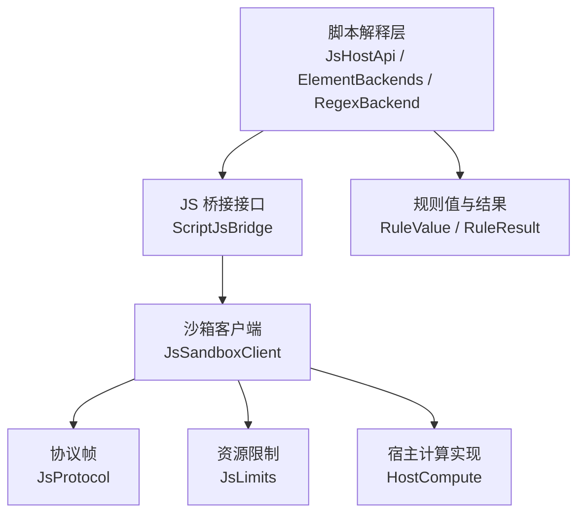
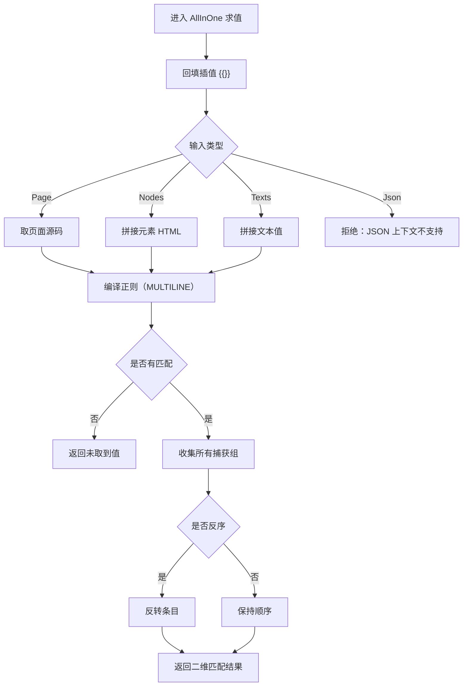
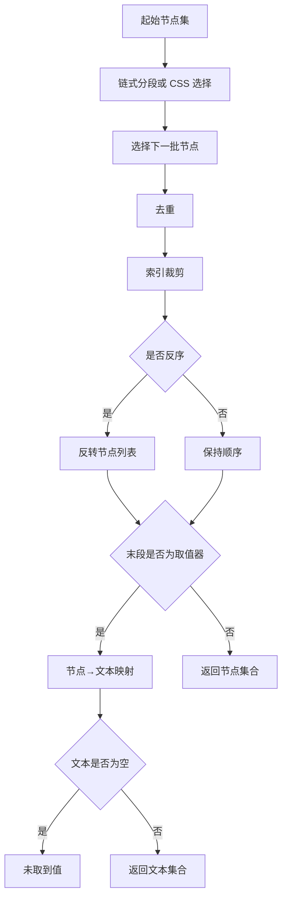
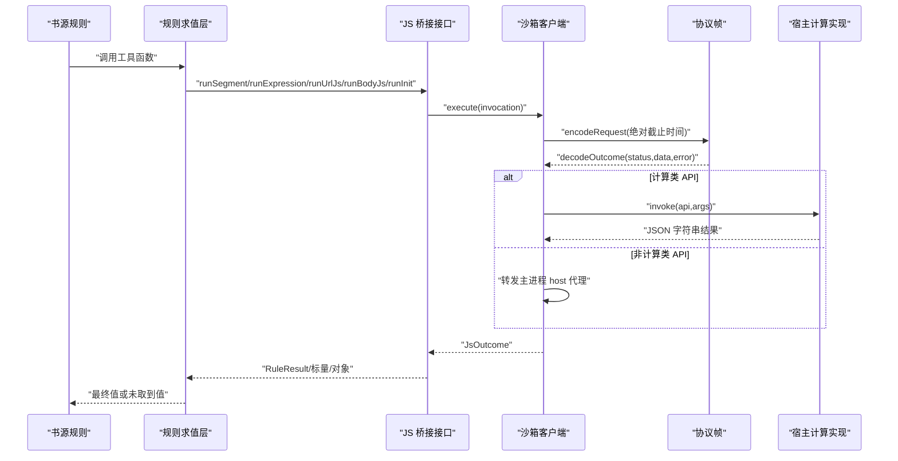
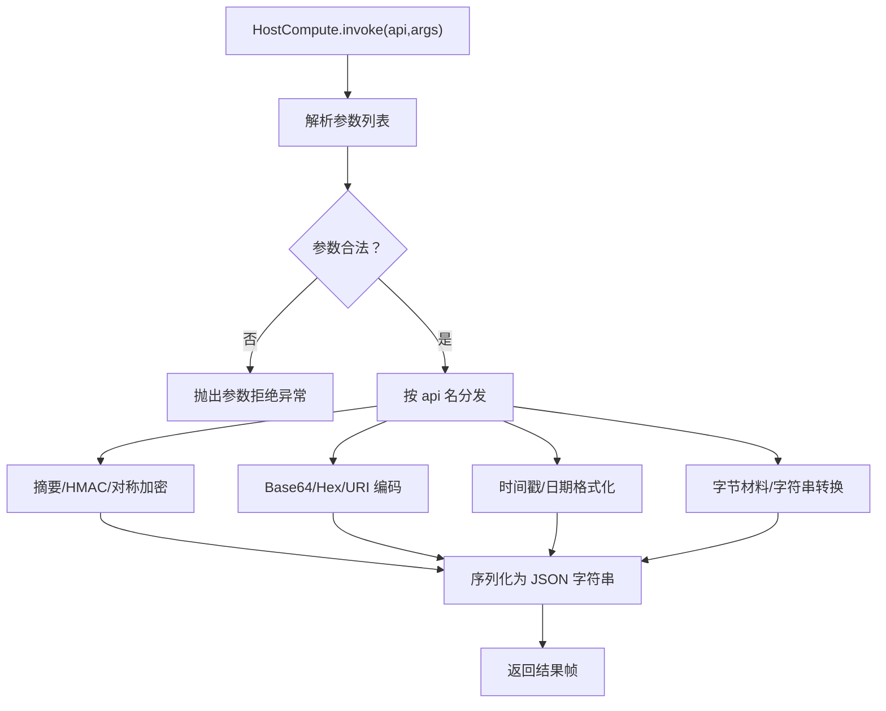
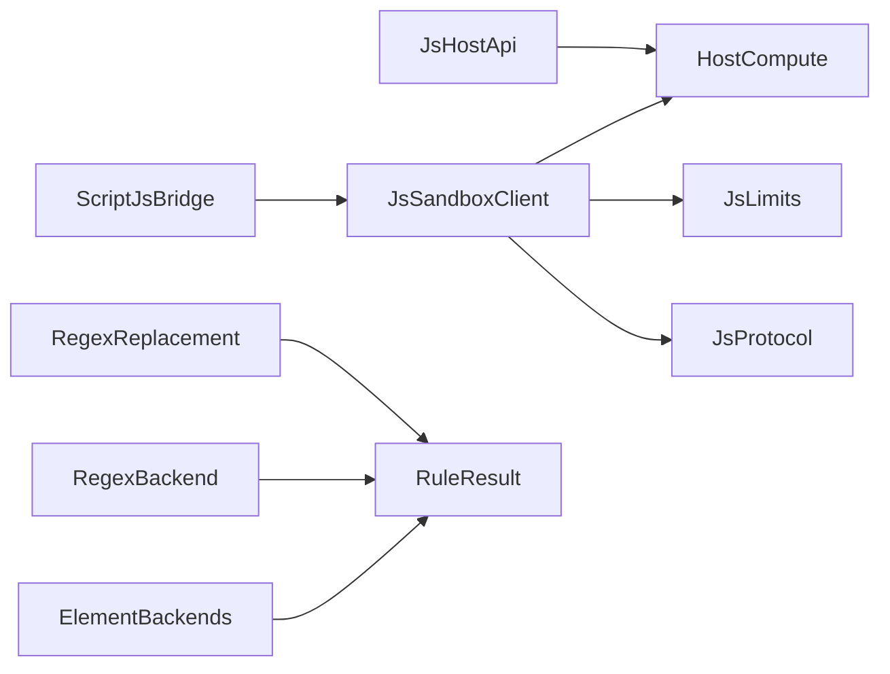

# 工具函数库

<cite>
**本文引用的文件**   
- [JsHostApi.kt](file://lib_book_source/src/main/java/com/ebook/source/script/JsHostApi.kt)
- [RegexBackend.kt](file://lib_book_source/src/main/java/com/ebook/source/script/RegexBackend.kt)
- [RegexReplacement.kt](file://lib_book_source/src/main/java/com/ebook/source/script/RegexReplacement.kt)
- [ElementBackends.kt](file://lib_book_source/src/main/java/com/ebook/source/script/ElementBackends.kt)
- [ScriptJsBridge.kt](file://lib_book_source/src/main/java/com/ebook/source/script/ScriptJsBridge.kt)
- [RuleResult.kt](file://lib_book_source/src/main/java/com/ebook/source/script/RuleResult.kt)
- [RuleValue.kt](file://lib_book_source/src/main/java/com/ebook/source/script/RuleValue.kt)
- [Interpolation.kt](file://lib_book_source/src/main/java/com/ebook/source/script/Interpolation.kt)
- [ChainLink.kt](file://lib_book_source/src/main/java/com/ebook/source/script/ChainLink.kt)
- [IndexSelector.kt](file://lib_book_source/src/main/java/com/ebook/source/script/IndexSelector.kt)
- [HostCompute.kt](file://lib_book_source/src/main/java/com/ebook/source/sandbox/HostCompute.kt)
- [JsSandboxClient.kt](file://lib_book_source/src/main/java/com/ebook/source/sandbox/JsSandboxClient.kt)
- [JsLimits.kt](file://lib_book_source/src/main/java/com/ebook/source/sandbox/JsLimits.kt)
- [JsProtocol.kt](file://lib_book_source/src/main/java/com/ebook/source/sandbox/JsProtocol.kt)
- [0028-untrusted-js-sandbox.md](file://docs/adr/0028-untrusted-js-sandbox.md)
</cite>

## 目录
1. [简介](#简介)
2. [项目结构](#项目结构)
3. [核心组件](#核心组件)
4. [架构总览](#架构总览)
5. [详细组件分析](#详细组件分析)
6. [依赖关系分析](#依赖关系分析)
7. [性能与最佳实践](#性能与最佳实践)
8. [故障排查](#故障排查)
9. [结论](#结论)
10. [附录：书源数据解析示例](#附录书源数据解析示例)

## 简介
本文件聚焦“脚本工具函数库”，即书源规则在 JavaScript 执行环境中可用的能力，以及宿主进程为这些能力提供的实现。它覆盖以下范围：
- 字符串处理：截取、替换、编码解码、摘要、对称加解密、十六进制、时间格式化等。
- 正则表达式支持与文本匹配：AllInOne 整源正则、`$n` 捕获组引用、`##` 替换净化段。
- DOM 操作接口：HTML 解析、元素选择、链式与 CSS 模式取值、节点到文本的映射。
- 数学计算、日期时间与数据格式化：摘要、HMAC、UUID、时间戳、格式化和字节串转换。
- 宿主 API 白名单与类型映射：哪些 JS 名可调用、参数形态、返回值形态、失败语义。
- 沙箱执行边界：跨进程协议、资源限制、超时、内存上限、回调重入限制。
- 复杂书源规则的实战思路：如何在列表页、详情页、目录页和正文页组合使用规则。

## 项目结构
与“工具函数库”直接相关的代码主要分布在两个模块：
- `lib_book_source`：面向书源规则的解释层、DOM 后端、正则后端、规则值与结果模型、JS 桥接接口。
- `lib_book_source` 的 sandbox 子包：隔离执行器客户端、计算类 Host API 实现、协议与限制。

**图表来源**
- [JsHostApi.kt:1-114](file://lib_book_source/src/main/java/com/ebook/source/script/JsHostApi.kt#L1-L114)
- [ElementBackends.kt:1-211](file://lib_book_source/src/main/java/com/ebook/source/script/ElementBackends.kt#L1-L211)
- [RegexBackend.kt:1-75](file://lib_book_source/src/main/java/com/ebook/source/script/RegexBackend.kt#L1-L75)
- [ScriptJsBridge.kt:1-37](file://lib_book_source/src/main/java/com/ebook/source/script/ScriptJsBridge.kt#L1-L37)
- [JsSandboxClient.kt:1-185](file://lib_book_source/src/main/java/com/ebook/source/sandbox/JsSandboxClient.kt#L1-L185)
- [JsProtocol.kt:未展开](file://lib_book_source/src/main/java/com/ebook/source/sandbox/JsProtocol.kt)
- [JsLimits.kt:未展开](file://lib_book_source/src/main/java/com/ebook/source/sandbox/JsLimits.kt)
- [HostCompute.kt:1-345](file://lib_book_source/src/main/java/com/ebook/source/sandbox/HostCompute.kt#L1-L345)

**章节来源**
- [JsHostApi.kt:1-114](file://lib_book_source/src/main/java/com/ebook/source/script/JsHostApi.kt#L1-L114)
- [ScriptJsBridge.kt:1-37](file://lib_book_source/src/main/java/com/ebook/source/script/ScriptJsBridge.kt#L1-L37)

## 核心组件
本节把“工具函数库”拆成五类能力，并说明它们如何从 JS 名落到宿主实现。

### 字符串处理与编码解码
- 摘要算法：MD5、SHA1、SHA256、通用 digestHex。
- Base64：标准编码/解码、URL 安全编码/解码。
- 十六进制：hexEncode/hexDecode。
- URI 编码：uriEncode，支持可选字符集；空字符集按 UTF-8。
- 对称加密：aesEncode/aesDecode、desEncode/desDecode。
- 通用对称变换：symmetricCrypto，允许自定义算法/模式/填充。
- HMAC：hmacBase64，算法名大小写与连字符不敏感。
- 字节串转换：bytesToStr，把带编码标记的字节材料还原为字符串。
- UUID：randomUUID。

这些能力的 JS 名称集中在 JsHostApi 枚举中，实际计算逻辑落在 HostCompute.invoke 的分发表里。HostCompute 对输入做严格校验：
- 参数必须是标量或 null；对象/数组一律拒绝。
- 所有字符串走 UTF-8 字节边界。
- 失败抛出类型化异常，而不是返回 null 导致“假成功”。

**章节来源**
- [JsHostApi.kt:1-114](file://lib_book_source/src/main/java/com/ebook/source/script/JsHostApi.kt#L1-L114)
- [HostCompute.kt:1-200](file://lib_book_source/src/main/java/com/ebook/source/sandbox/HostCompute.kt#L1-L200)
- [HostCompute.kt:201-345](file://lib_book_source/src/main/java/com/ebook/source/sandbox/HostCompute.kt#L201-L345)

### 正则表达式支持与文本匹配
- AllInOne 模式：以 `:` 开头，对整个源文本切分，字段用 `$n` 引用。
- 捕获组引用：GroupRef.parseOrNull 识别 `$n`，越界返回空串而非抛错。
- 正则替换净化段：`##` 分隔模式与替换文本，`###` 表示只替换第一个匹配。
- 多行语义：AllInOne 使用 MULTILINE，使 `^`/$ 按行锚定。
- JSON 上下文不支持 AllInOne：类型化拒绝，避免把 JSON 全文当 HTML 猜语义。

**图表来源**
- [RegexBackend.kt:1-75](file://lib_book_source/src/main/java/com/ebook/source/script/RegexBackend.kt#L1-L75)
- [RegexReplacement.kt:1-49](file://lib_book_source/src/main/java/com/ebook/source/script/RegexReplacement.kt#L1-L49)

**章节来源**
- [RegexBackend.kt:1-75](file://lib_book_source/src/main/java/com/ebook/source/script/RegexBackend.kt#L1-L75)
- [RegexReplacement.kt:1-49](file://lib_book_source/src/main/java/com/ebook/source/script/RegexReplacement.kt#L1-L49)

### DOM 操作接口
DOM 能力通过 ElementBackends 提供两种模式：
- 链式模式：`@` 分段，逐级收窄节点集合，最后一段可以是取值器或选择器。
- CSS 模式：`@css:` 整段交给 Jsoup，尾随可选取值器。

共同骨架：
1. 起步节点集：页面根节点、已有节点集、首段文本解析为 HTML、JSON 上下文类型拒绝。
2. 逐步选择：class/id/tag/text/children/CSS/attribute。
3. 去重与索引裁剪：统一走 IndexSelector，闭区间、负索引从尾数、越界不抛。
4. 反序：先反序再出文本。
5. 取值器：text/html/属性等，映射为空则视为“未取到值”。

**图表来源**
- [ElementBackends.kt:1-211](file://lib_book_source/src/main/java/com/ebook/source/script/ElementBackends.kt#L1-L211)
- [ChainLink.kt:未展开](file://lib_book_source/src/main/java/com/ebook/source/script/ChainLink.kt)
- [IndexSelector.kt:未展开](file://lib_book_source/src/main/java/com/ebook/source/script/IndexSelector.kt)

**章节来源**
- [ElementBackends.kt:1-211](file://lib_book_source/src/main/java/com/ebook/source/script/ElementBackends.kt#L1-L211)
- [RuleValue.kt:未展开](file://lib_book_source/src/main/java/com/ebook/source/script/RuleValue.kt)
- [RuleResult.kt:未展开](file://lib_book_source/src/main/java/com/ebook/source/script/RuleResult.kt)

### 数学计算、日期时间与数据格式化
- 摘要与哈希：md5/sha1/sha256/digestHex。
- HMAC：hmacBase64(data, algorithm, key)。
- 随机标识：randomUUID。
- 时间戳：timestamp，返回毫秒级系统时间。
- 日期格式化：FormatDate(millis, pattern)，Locale.US。
- 通用对称加密：symmetricCrypto(op, transformation, key, iv, data)。
- 字节转字符串：bytesToStr(value, charset)，支持 base64/hex/utf8/latin1 材料标记。

这些能力全部属于 JsApiTarget.COMPUTE，运行在执行器进程内，不走 Binder 往返。

**章节来源**
- [JsHostApi.kt:1-114](file://lib_book_source/src/main/java/com/ebook/source/script/JsHostApi.kt#L1-L114)
- [HostCompute.kt:1-345](file://lib_book_source/src/main/java/com/ebook/source/sandbox/HostCompute.kt#L1-L345)

### 常用宿主 API 分类
JsHostApi 把能力分为两类目标：
- COMPUTE：纯计算，执行器进程内完成，零 IPC。
- HOST：需要主进程参与，如网络请求、变量存取、递归规则求值、Cookie 读写、日志等。

常见 HOST 能力包括 ajax/post/load/responseCode/getVar/putVar/rmVar/sourceGetVariable/sourceSetVariable/getElements/getElement/queryString/putToPage/setContent/cookieGet/cookieSet/cookieRemove/toast/log。

**章节来源**
- [JsHostApi.kt:1-114](file://lib_book_source/src/main/java/com/ebook/source/script/JsHostApi.kt#L1-L114)

## 架构总览
JS 工具函数库不是单纯的“函数集合”，而是“规则解释层 + 宿主白名单 + 隔离执行器”的组合。

**图表来源**
- [ScriptJsBridge.kt:1-37](file://lib_book_source/src/main/java/com/ebook/source/script/ScriptJsBridge.kt#L1-L37)
- [JsSandboxClient.kt:1-185](file://lib_book_source/src/main/java/com/ebook/source/sandbox/JsSandboxClient.kt#L1-L185)
- [HostCompute.kt:1-200](file://lib_book_source/src/main/java/com/ebook/source/sandbox/HostCompute.kt#L1-L200)
- [JsProtocol.kt:未展开](file://lib_book_source/src/main/java/com/ebook/source/sandbox/JsProtocol.kt)

## 详细组件分析

### JsHostApi：工具函数白名单
JsHostApi 是“脚本能干什么”的唯一入口清单。它的 jsName 就是脚本全局对象上的方法名；不在表中的名字不存在，而不是存在后被禁用。minArgs/maxArgs 由 JS 垫片校验，避免内核侧拿到 undefined 参数后走进“看似正常失败”的路径。

关键设计要点：
- 计算类 API 与 HOST 类 API 明确分离。
- 参数元数约束写在枚举里，错误路径应被类型化。
- 名称稳定，别名集中在测试中对照，避免不同上游写法造成实现漂移。

**章节来源**
- [JsHostApi.kt:1-114](file://lib_book_source/src/main/java/com/ebook/source/script/JsHostApi.kt#L1-L114)

### HostCompute：计算类宿主 API 实现
HostCompute 是所有 COMPUTE 分支的统一实现。它承担：
- 参数解析：只接受标量或 null，否则拒绝。
- 算法分发：md5/sha1/sha256/base64/hex/aes/des/timestamp/FormatDate/uriEncode/randomUUID/digestHex/hmacBase64/symmetricCrypto/bytesToStr。
- 失败语义：统一包装为 JsApiRejectedException，消息必须包含 api 名以便调试。
- 字节边界：所有密文、摘要、HMAC、base64 输出都按 UTF-8 字符串进出；二进制产物必要时带 base64 标记。

**图表来源**
- [HostCompute.kt:1-200](file://lib_book_source/src/main/java/com/ebook/source/sandbox/HostCompute.kt#L1-L200)
- [HostCompute.kt:201-345](file://lib_book_source/src/main/java/com/ebook/source/sandbox/HostCompute.kt#L201-L345)

**章节来源**
- [HostCompute.kt:1-345](file://lib_book_source/src/main/java/com/ebook/source/sandbox/HostCompute.kt#L1-L345)

### RegexBackend 与 GroupRef：AllInOne 与捕获组
RegexBackend.evaluate 负责 AllInOne 模式：
- 先回填插值。
- 根据输入类型构造源文本。
- 使用 MULTILINE 编译正则。
- 收集 findAll 的所有 groupValues。
- 支持 reverse 前缀。
- 对 JSON 上下文抛出类型化异常。

GroupRef 负责 `$n` 语法：
- parseOrNull 只在纯 `$数字` 时返回组号。
- valueOf 越界返回空串，符合“未取到值”的语料常态。

**章节来源**
- [RegexBackend.kt:1-75](file://lib_book_source/src/main/java/com/ebook/source/script/RegexBackend.kt#L1-L75)

### RegexReplacement：`##` 替换净化段
RegexReplacement.parse 负责解析 `##pattern##replacement` 及三井号 OnlyFirst 形态：
- 首个深度 0 的 `##` 作为模式与替换的分界。
- 尾部 `###` 表示只替换第一个匹配。
- 替换段内部再次出现 `##` 仍属字面量。
- 该解析只负责切段，不执行替换，以便词法阶段独立锁形。

**章节来源**
- [RegexReplacement.kt:1-49](file://lib_book_source/src/main/java/com/ebook/source/script/RegexReplacement.kt#L1-L49)

### ElementBackends：DOM 选择与取值
ElementBackends 统一处理链式与 CSS 两种选择方式，并保证：
- 取值器只能在链尾。
- 选择器名称不能为空。
- 非法 CSS 选择器转换为类型化语法错误。
- 取值器映射为空时统一返回“未取到值”，避免静默解错。
- 中间步骤选空立即短路为未取到值，防止后续误判。

**章节来源**
- [ElementBackends.kt:1-211](file://lib_book_source/src/main/java/com/ebook/source/script/ElementBackends.kt#L1-L211)

### ScriptJsBridge：规则层看到的 JS 执行接口
ScriptJsBridge 暴露五个入口：
- runSegment：整段 JS，完成值按文本或文本表取，undefined 视为未取到值。
- runExpression：表达式求值，标量文本回填，undefined/null 展开为空串。
- runUrlJs：改写 URL 与请求头。
- runBodyJs：对响应体二次处理。
- runInit：init 分支返回对象字段。

失败口径是“执行失败”，不返回 null 冒充“没取到值”。

**章节来源**
- [ScriptJsBridge.kt:1-37](file://lib_book_source/src/main/java/com/ebook/source/script/ScriptJsBridge.kt#L1-L37)

### JsSandboxClient：沙箱客户端与执行边界
JsSandboxClient 是主进程侧唯一传输入口，负责：
- 计算绝对截止时间，使用单调时钟 SystemClock.elapsedRealtime。
- 串行化 execute，保证同一时刻只有一帧在飞。
- 阻止主线程调用，避免 ANR。
- 阻止 host 回调中嵌套发起沙箱调用，避免双向死锁。
- 断连后最多重放一次，但已转发过 host 回调的请求不再重放。
- 对所有通道异常进行命名化处理，不向外泄露未类型化异常。

**章节来源**
- [JsSandboxClient.kt:1-185](file://lib_book_source/src/main/java/com/ebook/source/sandbox/JsSandboxClient.kt#L1-L185)

## 依赖关系分析
工具函数库的依赖关系可以理解为三层：
- 规则层：JsHostApi、ElementBackends、RegexBackend、RegexReplacement、ScriptJsBridge。
- 执行层：JsSandboxClient、JsProtocol、JsLimits。
- 宿主实现层：HostCompute。

**图表来源**
- [JsHostApi.kt:1-114](file://lib_book_source/src/main/java/com/ebook/source/script/JsHostApi.kt#L1-L114)
- [ElementBackends.kt:1-211](file://lib_book_source/src/main/java/com/ebook/source/script/ElementBackends.kt#L1-L211)
- [RegexBackend.kt:1-75](file://lib_book_source/src/main/java/com/ebook/source/script/RegexBackend.kt#L1-L75)
- [RegexReplacement.kt:1-49](file://lib_book_source/src/main/java/com/ebook/source/script/RegexReplacement.kt#L1-L49)
- [ScriptJsBridge.kt:1-37](file://lib_book_source/src/main/java/com/ebook/source/script/ScriptJsBridge.kt#L1-L37)
- [JsSandboxClient.kt:1-185](file://lib_book_source/src/main/java/com/ebook/source/sandbox/JsSandboxClient.kt#L1-L185)
- [JsProtocol.kt:未展开](file://lib_book_source/src/main/java/com/ebook/source/sandbox/JsProtocol.kt)
- [JsLimits.kt:未展开](file://lib_book_source/src/main/java/com/ebook/source/sandbox/JsLimits.kt)
- [HostCompute.kt:1-345](file://lib_book_source/src/main/java/com/ebook/source/sandbox/HostCompute.kt#L1-L345)

**章节来源**
- [JsHostApi.kt:1-114](file://lib_book_source/src/main/java/com/ebook/source/script/JsHostApi.kt#L1-L114)
- [JsSandboxClient.kt:1-185](file://lib_book_source/src/main/java/com/ebook/source/sandbox/JsSandboxClient.kt#L1-L185)

## 性能与最佳实践
### 性能特征
- 计算类 API 走 HostCompute，执行器进程内完成，零 IPC 往返，适合高频签名、摘要、编码解码。
- DOM 选择依赖 Jsoup，链式模式逐段收窄，CSS 模式整段交给选择器引擎；大量重复节点会先去重再裁剪索引。
- AllInOne 正则会扫描整个源文本，适合列表页整页切分，但不适合正文逐章频繁执行的大规模正则。
- JsSandboxClient 串行执行，确保同一 runtime 不被并发抢占，同时由 wall-clock 超时保护排队请求。

### 最佳实践
- 优先使用 COMPUTE 能力做本地计算，减少跨进程开销。
- AllInOne 的正则应尽可能精准，避免全量贪婪匹配。
- DOM 选择尽量限定起点，避免从 html/body 一路遍历。
- 取值器结果为空时应显式兜底，不要依赖静默空串。
- 网络类 HOST API 受主进程代理限制，不应假设任意 URL、私网地址或凭证都能访问。
- 不要在主线程调用沙箱；也不要在 host 回调中再次发起沙箱调用。

[本节为通用指导，不直接分析具体文件]

## 故障排查
### 常见问题定位
- “参数个数不符”：检查 JsHostApi 的 minArgs/maxArgs，确认脚本传参数量。
- “参数不能是对象或数组”：HostCompute 只接受标量，如需字节材料改用 base64/hex/utf8/latin1 标记。
- “base64 解码失败”：可能是 MIME 折行、URL 安全位、或输入根本不是合法 base64。
- “AES/DES 初始化失败”：密钥派生、IV、模式、填充配置不一致。
- “不支持的摘要算法”：digestAlgorithm 归一化后找不到 JCA 名称。
- “URI 编码失败/字符集不可用”：charset 名称无效，默认按 UTF-8。
- “HTML 选择器作用于 JSON 上下文”：ElementBackends 遇到 JSON 输入会类型拒绝。
- “正则 AllInOne 作用于 JSON 上下文”：RegexBackend 拒绝 JSON 上下文。
- “沙箱执行器当前不可用”：可能因主线程调用、断连、连接失败、或进程隔离校验失败。

**章节来源**
- [HostCompute.kt:1-345](file://lib_book_source/src/main/java/com/ebook/source/sandbox/HostCompute.kt#L1-L345)
- [ElementBackends.kt:1-211](file://lib_book_source/src/main/java/com/ebook/source/script/ElementBackends.kt#L1-L211)
- [RegexBackend.kt:1-75](file://lib_book_source/src/main/java/com/ebook/source/script/RegexBackend.kt#L1-L75)
- [JsSandboxClient.kt:1-185](file://lib_book_source/src/main/java/com/ebook/source/sandbox/JsSandboxClient.kt#L1-L185)
- [0028-untrusted-js-sandbox.md:1-65](file://docs/adr/0028-untrusted-js-sandbox.md#L1-L65)

## 结论
JavaScript 工具函数库的核心不是“一堆 JS 原生方法”，而是“受控白名单 + 类型化错误 + 隔离执行 + 宿主实现”。字符串与编码能力集中在 HostCompute，DOM 能力集中在 ElementBackends，正则能力集中在 RegexBackend 与 RegexReplacement，而 JsSandboxClient 保证执行边界与资源限制。编写书源规则时，应优先使用本地计算、谨慎使用正则与 DOM 遍历，并通过明确的兜底策略避免静默解错。

[本节为总结性内容，不直接分析具体文件]

## 附录：书源数据解析示例
以下示例展示如何组合工具函数库能力，完成常见书源解析流程。示例不给出完整代码，只给出调用路径与数据流转。

### 示例一：列表页 AllInOne 提取条目
- 输入：搜索结果页 HTML。
- 规则：使用 `:` AllInOne 正则，匹配每个条目行，并用 `$1`、`$2`、`$3` 引用标题、作者、链接。
- 处理：若条目顺序与站点相反，加上反序前缀。
- 输出：二维匹配结果，供后续字段规则逐项取值。

参考路径：
- [RegexBackend.kt:1-75](file://lib_book_source/src/main/java/com/ebook/source/script/RegexBackend.kt#L1-L75)
- [RegexReplacement.kt:1-49](file://lib_book_source/src/main/java/com/ebook/source/script/RegexReplacement.kt#L1-L49)

### 示例二：详情页 DOM 取值
- 输入：详情页 HTML。
- 规则：使用链式选择器定位封面、简介、标签；最后一段用 text/html/属性取值器。
- 兜底：若懒加载属性缺失，先用备用属性再回退到主属性。
- 输出：文本集合；为空时视为未取到值，继续其他支。

参考路径：
- [ElementBackends.kt:1-211](file://lib_book_source/src/main/java/com/ebook/source/script/ElementBackends.kt#L1-L211)

### 示例三：签名 URL 计算
- 输入：原始 URL、参数、密钥。
- 步骤：
  1. 使用 uriEncode 编码参数。
  2. 使用 digestHex 或 hmacBase64 生成签名。
  3. 使用 aesEncode 或 symmetricCrypto 对敏感字段加密。
  4. 拼接最终 URL。
- 注意：所有计算走 HostCompute，零 IPC；失败时返回类型化错误。

参考路径：
- [HostCompute.kt:1-345](file://lib_book_source/src/main/java/com/ebook/source/sandbox/HostCompute.kt#L1-L345)
- [JsHostApi.kt:1-114](file://lib_book_source/src/main/java/com/ebook/source/script/JsHostApi.kt#L1-L114)

### 示例四：正文净化与替换
- 输入：正文 HTML。
- 规则：使用 `##` 替换段清理广告、换行、无关标签；OnlyFirst 形态只替换首处匹配。
- 输出：净化后的正文文本。

参考路径：
- [RegexReplacement.kt:1-49](file://lib_book_source/src/main/java/com/ebook/source/script/RegexReplacement.kt#L1-L49)