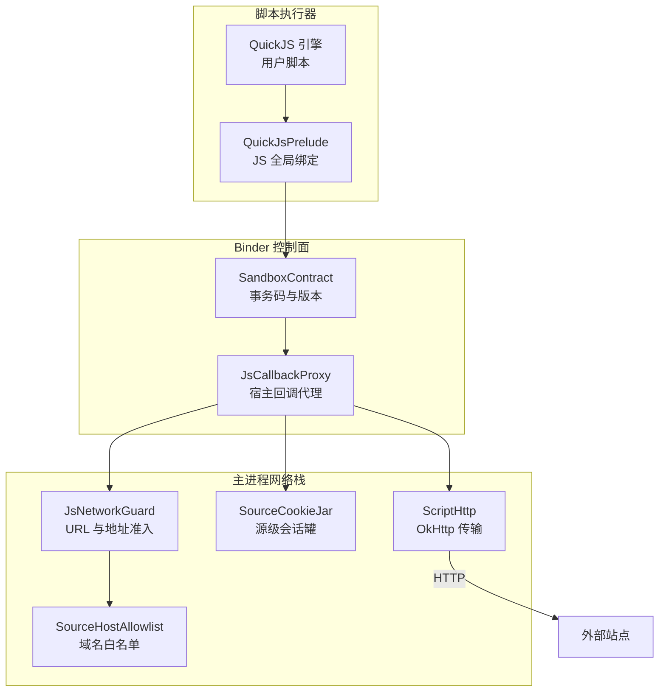
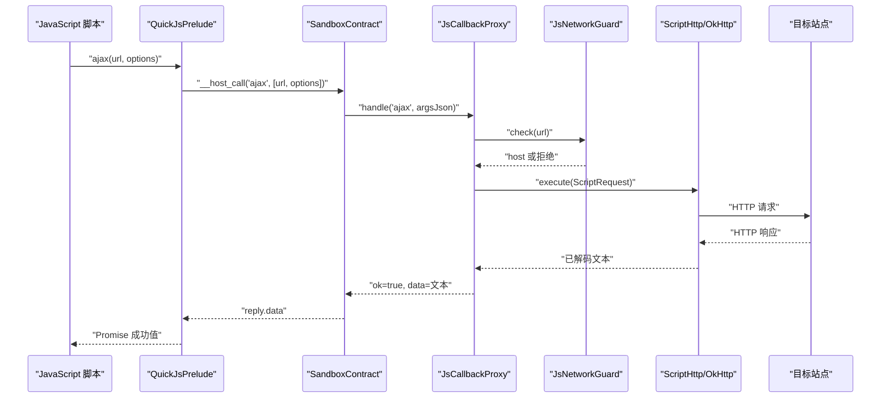
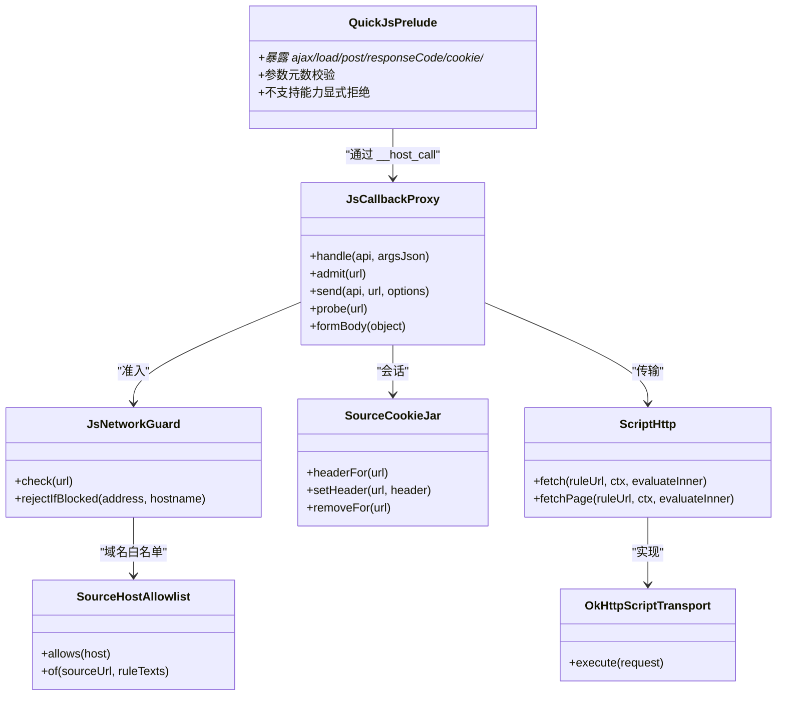
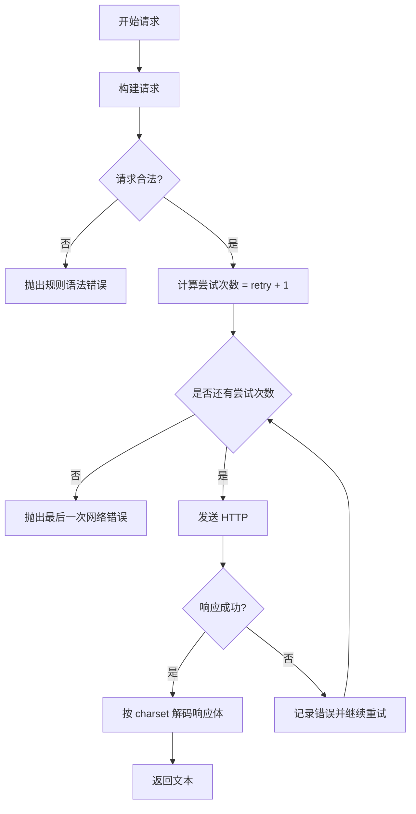

# 网络请求接口

<cite>
**本文引用的文件**   
- [lib_book_source/src/main/java/com/ebook/source/script/ScriptHttp.kt](file://lib_book_source/src/main/java/com/ebook/source/script/ScriptHttp.kt)
- [lib_book_source/src/main/java/com/ebook/source/sandbox/JsCallbackProxy.kt](file://lib_book_source/src/main/java/com/ebook/source/sandbox/JsCallbackProxy.kt)
- [lib_book_source/src/main/java/com/ebook/source/sandbox/QuickJsPrelude.kt](file://lib_book_source/src/main/java/com/ebook/source/sandbox/QuickJsPrelude.kt)
- [lib_book_source/src/main/java/com/ebook/source/sandbox/JsNetworkGuard.kt](file://lib_book_source/src/main/java/com/ebook/source/sandbox/JsNetworkGuard.kt)
- [lib_book_source/src/main/java/com/ebook/source/sandbox/SourceHostAllowlist.kt](file://lib_book_source/src/main/java/com/ebook/source/sandbox/SourceHostAllowlist.kt)
- [lib_book_source/src/main/java/com/ebook/source/sandbox/SourceCookieJar.kt](file://lib_book_source/src/main/java/com/ebook/source/sandbox/SourceCookieJar.kt)
- [lib_book_source/src/main/java/com/ebook/source/sandbox/JsLimits.kt](file://lib_book_source/src/main/java/com/ebook/source/sandbox/JsLimits.kt)
- [lib_book_source/src/main/java/com/ebook/source/sandbox/SandboxContract.kt](file://lib_book_source/src/main/java/com/ebook/source/sandbox/SandboxContract.kt)
- [lib_book_source/src/main/java/com/ebook/source/script/ScriptJsBridge.kt](file://lib_book_source/src/main/java/com/ebook/source/script/ScriptJsBridge.kt)
- [docs/adr/0028-untrusted-js-sandbox.md](file://docs/adr/0028-untrusted-js-sandbox.md)
- [lib_book_source/src/test/java/com/ebook/source/script/ScriptHttpTest.kt](file://lib_book_source/src/test/java/com/ebook/source/script/ScriptHttpTest.kt)
- [lib_book_source/src/test/java/com/ebook/source/sandbox/JsCallbackProxyTest.kt](file://lib_book_source/src/test/java/com/ebook/source/sandbox/JsCallbackProxyTest.kt)
- [lib_book_source/src/test/java/com/ebook/source/sandbox/SourceCookieJarTest.kt](file://lib_book_source/src/test/java/com/ebook/source/sandbox/SourceCookieJarTest.kt)
</cite>

## 目录
1. [简介](#简介)
2. [项目结构](#项目结构)
3. [核心组件](#核心组件)
4. [架构总览](#架构总览)
5. [详细组件分析](#详细组件分析)
6. [依赖关系分析](#依赖关系分析)
7. [性能与限制](#性能与限制)
8. [故障排查指南](#故障排查指南)
9. [结论](#结论)
10. [附录：接口参考](#附录接口参考)

## 简介
本文面向“脚本侧网络请求接口”，即社区书源中可内嵌的 JavaScript 通过沙箱暴露的方法发起 HTTP 请求。本仓没有直接提供浏览器 `fetch`；对外暴露的是 `ajax`、`load`、`post` 以及辅助能力 `responseCode`、`cookie.getCookie/setCookie/removeCookie`、`setContent`、日志方法等，全部经主进程的受限代理发出。

关键点：
- 协议层使用 OkHttp，但脚本只看到精简 API。
- 所有外呼都受域名白名单、私网地址拦截、大小上限、任务级限流和超时约束。
- Cookie 以“源实例”为单位隔离，不落盘。
- 响应体先按选项字符集解码为文本，再交给脚本处理。
- 异步由 Kotlin 协程在 IO 线程执行，脚本侧通过 JS Promise / 异常语义消费结果。

**章节来源**
- [lib_book_source/src/main/java/com/ebook/source/sandbox/QuickJsPrelude.kt:1-200](file://lib_book_source/src/main/java/com/ebook/source/sandbox/QuickJsPrelude.kt#L1-L200)
- [docs/adr/0028-untrusted-js-sandbox.md:1-47](file://docs/adr/0028-untrusted-js-sandbox.md#L1-L47)

## 项目结构
与本主题相关的代码主要分布在两个模块：
- `lib_book_source`：沙箱桥接、JS 绑定、网络守卫、OkHttp 传输实现、测试。
- `docs/adr/0028`：不可信 JS 执行的安全决策记录，解释为什么必须用隔离进程和白名单。

**图表来源**
- [lib_book_source/src/main/java/com/ebook/source/sandbox/QuickJsPrelude.kt:1-200](file://lib_book_source/src/main/java/com/ebook/source/sandbox/QuickJsPrelude.kt#L1-L200)
- [lib_book_source/src/main/java/com/ebook/source/sandbox/SandboxContract.kt:1-47](file://lib_book_source/src/main/java/com/ebook/source/sandbox/SandboxContract.kt#L1-L47)
- [lib_book_source/src/main/java/com/ebook/source/sandbox/JsCallbackProxy.kt:1-200](file://lib_book_source/src/main/java/com/ebook/source/sandbox/JsCallbackProxy.kt#L1-L200)
- [lib_book_source/src/main/java/com/ebook/source/sandbox/JsNetworkGuard.kt:1-167](file://lib_book_source/src/main/java/com/ebook/source/sandbox/JsNetworkGuard.kt#L1-L167)
- [lib_book_source/src/main/java/com/ebook/source/script/ScriptHttp.kt:1-157](file://lib_book_source/src/main/java/com/ebook/source/script/ScriptHttp.kt#L1-L157)

**章节来源**
- [lib_book_source/src/main/java/com/ebook/source/script/ScriptHttp.kt:1-157](file://lib_book_source/src/main/java/com/ebook/source/script/ScriptHttp.kt#L1-L157)
- [lib_book_source/src/main/java/com/ebook/source/sandbox/JsCallbackProxy.kt:1-200](file://lib_book_source/src/main/java/com/ebook/source/sandbox/JsCallbackProxy.kt#L1-L200)
- [docs/adr/0028-untrusted-js-sandbox.md:1-47](file://docs/adr/0028-untrusted-js-sandbox.md#L1-L47)

## 核心组件
| 组件 | 职责 | 关键行为 |
|---|---|---|
| `QuickJsPrelude` | 向脚本暴露 `java.ajax/load/post/responseCode/cookie/*` 等能力 | 名称白名单、参数个数校验、字节标记、不支持能力显式拒绝 |
| `JsCallbackProxy` | 主进程侧统一受理脚本回调 | 准入检查、限流、参数解析、状态码探测、基准页更新、变量读写 |
| `JsNetworkGuard` | URL 字符串层准入 + DNS 地址层拦截 | 仅允许 http(s)、拒绝相对地址、拒绝内网/保留/组播/广播等地址 |
| `SourceHostAllowlist` | 从书源自身 URL 和规则文本导出可访问 host | 归一化 host、不自动放行子域 |
| `SourceCookieJar` | 源级 Cookie 存储与自动回发 | 同名覆盖、过期清理、空串清空域、跨路径删除 |
| `ScriptHttp` | 取文门面与 OkHttp 传输实现 | 显式字节解码、非 2xx 重试、每请求 timeout 派生客户端 |
| `JsLimits` | 沙箱资源限制唯一来源 | 挂钟超时、堆/栈/报文/响应/回调大小、任务请求数、回调深度 |

**章节来源**
- [lib_book_source/src/main/java/com/ebook/source/sandbox/QuickJsPrelude.kt:1-200](file://lib_book_source/src/main/java/com/ebook/source/sandbox/QuickJsPrelude.kt#L1-L200)
- [lib_book_source/src/main/java/com/ebook/source/sandbox/JsCallbackProxy.kt:1-200](file://lib_book_source/src/main/java/com/ebook/source/sandbox/JsCallbackProxy.kt#L1-L200)
- [lib_book_source/src/main/java/com/ebook/source/sandbox/JsNetworkGuard.kt:1-167](file://lib_book_source/src/main/java/com/ebook/source/sandbox/JsNetworkGuard.kt#L1-L167)
- [lib_book_source/src/main/java/com/ebook/source/sandbox/SourceHostAllowlist.kt:1-74](file://lib_book_source/src/main/java/com/ebook/source/sandbox/SourceHostAllowlist.kt#L1-L74)
- [lib_book_source/src/main/java/com/ebook/source/sandbox/SourceCookieJar.kt:1-127](file://lib_book_source/src/main/java/com/ebook/source/sandbox/SourceCookieJar.kt#L1-L127)
- [lib_book_source/src/main/java/com/ebook/source/script/ScriptHttp.kt:1-157](file://lib_book_source/src/main/java/com/ebook/source/script/ScriptHttp.kt#L1-L157)
- [lib_book_source/src/main/java/com/ebook/source/sandbox/JsLimits.kt:1-58](file://lib_book_source/src/main/java/com/ebook/source/sandbox/JsLimits.kt#L1-L58)

## 架构总览
脚本调用经过三层边界：
1. **JS 绑定层**：`QuickJsPrelude` 把 `ajax/load/post/responseCode/cookie/*` 等名字挂到全局对象。
2. **Binder 回调层**：`SandboxContract` 定义事务码，`JsCallbackProxy` 解析 JSON 参数并分发。
3. **安全网络层**：`JsNetworkGuard` 与 `SourceHostAllowlist` 做域名与地址拦截，`SourceCookieJar` 管理会话，`ScriptHttp` 走 OkHttp。

**图表来源**
- [lib_book_source/src/main/java/com/ebook/source/sandbox/QuickJsPrelude.kt:1-200](file://lib_book_source/src/main/java/com/ebook/source/sandbox/QuickJsPrelude.kt#L1-L200)
- [lib_book_source/src/main/java/com/ebook/source/sandbox/SandboxContract.kt:1-47](file://lib_book_source/src/main/java/com/ebook/source/sandbox/SandboxContract.kt#L1-L47)
- [lib_book_source/src/main/java/com/ebook/source/sandbox/JsCallbackProxy.kt:1-200](file://lib_book_source/src/main/java/com/ebook/source/sandbox/JsCallbackProxy.kt#L1-L200)
- [lib_book_source/src/main/java/com/ebook/source/sandbox/JsNetworkGuard.kt:1-167](file://lib_book_source/src/main/java/com/ebook/source/sandbox/JsNetworkGuard.kt#L1-L167)
- [lib_book_source/src/main/java/com/ebook/source/script/ScriptHttp.kt:1-157](file://lib_book_source/src/main/java/com/ebook/source/script/ScriptHttp.kt#L1-L157)

## 详细组件分析

### JavaScript 侧可用接口
脚本不应直接使用浏览器 `fetch`，应使用以下接口：

| 接口 | 参数 | 返回值 | 说明 |
|---|---|---|---|
| `ajax(url)` | `url` 为绝对地址 | Promise\<string\> | 默认 GET，返回响应体文本 |
| `ajax(url, options)` | `options` 为对象或字符集字符串 | Promise\<string\> | 对象见下表；字符串表示 charset |
| `load(url)` | 同 `ajax` | Promise\<string\> | 语义等价于 `ajax`，历史别名 |
| `post(url, body, headers?)` | `body` 可为对象或字符串；`headers` 可选 | Promise\<string\> | 对象体转表单；字符串体原样发送 |
| `responseCode(url)` | `url` 为绝对地址 | Promise\<number\> | 对目标做一次 HEAD 探测，返回状态码 |
| `cookie.getCookie(url)` | `url` 或裸 host | string | 当前域的 Cookie 头文本 |
| `cookie.setCookie(url, header)` | `header` 为 `k=v; k2=v2` 或空串 | Promise\<void\> | 设置或清空会话 |
| `cookie.removeCookie(url)` | `url` 或裸 host | Promise\<void\> | 清空该 host 的所有条目 |
| `setContent(text, url?)` | 页面文本和可选基准 URL | void | 改写后续规则定位的基准页 |
| `toast(message)` / `log(message)` | 任意消息 | void | 映射为主进程日志，不是弹窗 |

**章节来源**
- [lib_book_source/src/main/java/com/ebook/source/sandbox/QuickJsPrelude.kt:1-200](file://lib_book_source/src/main/java/com/ebook/source/sandbox/QuickJsPrelude.kt#L1-L200)
- [lib_book_source/src/main/java/com/ebook/source/sandbox/JsCallbackProxy.kt:201-495](file://lib_book_source/src/main/java/com/ebook/source/sandbox/JsCallbackProxy.kt#L201-L495)

### ajax/load 调用语法
`ajax(url, options)` 的第二个参数有两种形态：

1. **字符集字符串**：例如 `"gbk"`。此时 method 默认为 GET，其他字段为空。
2. **对象**：键与规则尾段选项共用同一套解析逻辑。有效键包括：
   - `method`：HTTP 方法，默认 GET。
   - `headers`：键值对象，用于设置请求头。
   - `body`：请求体，通常配合 POST。
   - `charset`：响应体解码字符集，默认 UTF-8。
   - `timeout`：毫秒数，用于单次请求派生客户端。
   - `retry`：重试次数，非 2xx 会作为 `IOException` 参与重试，总尝试次数为 `retry + 1`。

不允许的选项（如 `webView`）会在组装期直接拒绝，且不会发出请求。

**章节来源**
- [lib_book_source/src/main/java/com/ebook/source/script/ScriptHttp.kt:1-157](file://lib_book_source/src/main/java/com/ebook/source/script/ScriptHttp.kt#L1-L157)
- [lib_book_source/src/test/java/com/ebook/source/script/ScriptHttpTest.kt:1-178](file://lib_book_source/src/test/java/com/ebook/source/script/ScriptHttpTest.kt#L1-L178)
- [lib_book_source/src/test/java/com/ebook/source/sandbox/JsCallbackProxyTest.kt:1-200](file://lib_book_source/src/test/java/com/ebook/source/sandbox/JsCallbackProxyTest.kt#L1-L200)

### post 调用语法
`post(url, body, headers?)`：

| body 类型 | 行为 |
|---|---|
| JSON 对象 | 转为 `application/x-www-form-urlencoded; charset=utf-8` 表单体，键按字典序排序 |
| 字符串 | 原样发送，不猜测 Content-Type |

`headers` 可以是 JSON 对象或其字符串形式。若未传，字符串 body 不留默认头；对象 body 默认加表单 Content-Type，脚本仍可覆盖。

**章节来源**
- [lib_book_source/src/main/java/com/ebook/source/sandbox/JsCallbackProxy.kt:201-495](file://lib_book_source/src/main/java/com/ebook/source/sandbox/JsCallbackProxy.kt#L201-L495)
- [lib_book_source/src/test/java/com/ebook/source/sandbox/JsCallbackProxyTest.kt:1-200](file://lib_book_source/src/test/java/com/ebook/source/sandbox/JsCallbackProxyTest.kt#L1-L200)

### responseCode 调用语法
`responseCode(url)` 不是读取“上一次请求的状态码”，而是对目标 URL 进行一次 HEAD 探测，返回实际状态码。它同样经过白名单、限流和准入检查，因此会计入任务请求次数。

**章节来源**
- [lib_book_source/src/main/java/com/ebook/source/sandbox/JsCallbackProxy.kt:201-495](file://lib_book_source/src/main/java/com/ebook/source/sandbox/JsCallbackProxy.kt#L201-L495)

### Cookie 管理
Cookie 以“源实例”为单位隔离，不同源之间不会共享会话。行为如下：

| 操作 | 行为 |
|---|---|
| `cookie.getCookie(url)` | 返回形如 `k1=v1; k2=v2` 的请求头文本，无则返回空串 |
| `cookie.setCookie(url, header)` | 逐对解析 `k=v`；空串表示清空该域 |
| `cookie.removeCookie(url)` | 清空归属该 host 的全部条目，跨路径 |
| 自动保存 | OkHttp 收到 `Set-Cookie` 后自动存入同源罐 |
| 自动发送 | 下一次匹配 host、path、过期时间的请求自动携带 Cookie |

注意：
- Cookie 不落盘，应用重启或源实例被逐出后登录态丢失。
- 裸 host 写法会被补成 `https://host` 后再交给 OkHttp。
- 如果 cookie 功能未装配，调用会抛出可诊断的错误，而不是静默返回空串。

**章节来源**
- [lib_book_source/src/main/java/com/ebook/source/sandbox/SourceCookieJar.kt:1-127](file://lib_book_source/src/main/java/com/ebook/source/sandbox/SourceCookieJar.kt#L1-L127)
- [lib_book_source/src/test/java/com/ebook/source/sandbox/SourceCookieJarTest.kt:1-161](file://lib_book_source/src/test/java/com/ebook/source/sandbox/SourceCookieJarTest.kt#L1-L161)
- [lib_book_source/src/main/java/com/ebook/source/sandbox/JsCallbackProxy.kt:201-495](file://lib_book_source/src/main/java/com/ebook/source/sandbox/JsCallbackProxy.kt#L201-L495)

### 重定向与响应体解码
- 响应体解码：**不走** `body.string()`，而是读取原始字节并按 `charset` 构造字符串。这是为了避免上游拦截器强制把 `Content-Type` 改为 UTF-8 后导致 GBK 站点乱码。
- 非 2xx 响应：视为失败并抛出 `IOException`，从而触发 `retry` 次重试。
- 重定向策略：仓库文档未声明自定义重定向开关；真实重定向行为取决于注入的 OkHttp 客户端配置。脚本侧不应依赖隐式重定向来绕过白名单，因为域名与地址判定发生在真正网络层。

**章节来源**
- [lib_book_source/src/main/java/com/ebook/source/script/ScriptHttp.kt:1-157](file://lib_book_source/src/main/java/com/ebook/source/script/ScriptHttp.kt#L1-L157)

### 请求头设置
- `ajax/load`：通过 options 的 `headers` 对象设置。
- `post`：对象体默认带表单 Content-Type；字符串体不猜 Content-Type。
- 特殊头部：凭证类头部（如 Cookie）由 `SourceCookieJar` 自动附加，不应手工拼错。
- 不支持的能力：脚本不能直接访问 `okhttp3`、`Java` 反射等底层对象，只能通过白名单能力。

**章节来源**
- [lib_book_source/src/main/java/com/ebook/source/sandbox/QuickJsPrelude.kt:1-200](file://lib_book_source/src/main/java/com/ebook/source/sandbox/QuickJsPrelude.kt#L1-L200)
- [lib_book_source/src/main/java/com/ebook/source/sandbox/SourceCookieJar.kt:1-127](file://lib_book_source/src/main/java/com/ebook/source/sandbox/SourceCookieJar.kt#L1-L127)

### 异步编程模式与回调处理
- 主进程侧使用 Kotlin 协程与 `Dispatchers.IO` 执行网络请求。
- Binder 回调入口是同步方法，内部用 `runBlocking` 等待 suspend 传输结果，真正阻塞的是 IO 线程而非主线程。
- 脚本侧看到的是 Promise 风格：成功时返回响应文本，失败时抛出错误。
- 嵌套求值（如 `getElements/getElement/queryString`）通过关闭 JS 的执行上下文递归调用，有最大回调深度限制，避免无限嵌套。

**章节来源**
- [lib_book_source/src/main/java/com/ebook/source/sandbox/JsCallbackProxy.kt:1-200](file://lib_book_source/src/main/java/com/ebook/source/sandbox/JsCallbackProxy.kt#L1-L200)
- [lib_book_source/src/main/java/com/ebook/source/sandbox/JsLimits.kt:1-58](file://lib_book_source/src/main/java/com/ebook/source/sandbox/JsLimits.kt#L1-L58)

## 依赖关系分析

**图表来源**
- [lib_book_source/src/main/java/com/ebook/source/sandbox/QuickJsPrelude.kt:1-200](file://lib_book_source/src/main/java/com/ebook/source/sandbox/QuickJsPrelude.kt#L1-L200)
- [lib_book_source/src/main/java/com/ebook/source/sandbox/JsCallbackProxy.kt:1-200](file://lib_book_source/src/main/java/com/ebook/source/sandbox/JsCallbackProxy.kt#L1-L200)
- [lib_book_source/src/main/java/com/ebook/source/sandbox/JsNetworkGuard.kt:1-167](file://lib_book_source/src/main/java/com/ebook/source/sandbox/JsNetworkGuard.kt#L1-L167)
- [lib_book_source/src/main/java/com/ebook/source/sandbox/SourceHostAllowlist.kt:1-74](file://lib_book_source/src/main/java/com/ebook/source/sandbox/SourceHostAllowlist.kt#L1-L74)
- [lib_book_source/src/main/java/com/ebook/source/sandbox/SourceCookieJar.kt:1-127](file://lib_book_source/src/main/java/com/ebook/source/sandbox/SourceCookieJar.kt#L1-L127)
- [lib_book_source/src/main/java/com/ebook/source/script/ScriptHttp.kt:1-157](file://lib_book_source/src/main/java/com/ebook/source/script/ScriptHttp.kt#L1-L157)

**章节来源**
- [lib_book_source/src/main/java/com/ebook/source/script/ScriptHttp.kt:1-157](file://lib_book_source/src/main/java/com/ebook/source/script/ScriptHttp.kt#L1-L157)
- [lib_book_source/src/main/java/com/ebook/source/sandbox/JsCallbackProxy.kt:1-200](file://lib_book_source/src/main/java/com/ebook/source/sandbox/JsCallbackProxy.kt#L1-L200)

## 性能与限制

### 域名白名单
- 白名单由书源自身的 URL 和规则文本中出现的所有绝对 URL host 导出。
- 不自动放行子域：`example.com` 不等于 `cdn.example.com`。
- 主机名归一化后比较：小写、去端口、去 IPv6 方括号、去尾点。
- 白名单外的 host 会抛 `JsApiRejectedException`，并附带 host 信息以便调校。

**章节来源**
- [lib_book_source/src/main/java/com/ebook/source/sandbox/SourceHostAllowlist.kt:1-74](file://lib_book_source/src/main/java/com/ebook/source/sandbox/SourceHostAllowlist.kt#L1-L74)
- [lib_book_source/src/test/java/com/ebook/source/sandbox/SourceHostAllowlistTest.kt:1-107](file://lib_book_source/src/test/java/com/ebook/source/sandbox/SourceHostAllowlistTest.kt#L1-L107)

### 私网与保留地址拦截
- 仅允许 `http` 与 `https`。
- 禁止相对地址、无协议地址、URL 中内嵌用户名密码。
- DNS 解析结果全部检查，只要有一个地址属于内网、环回、链路本地、云元数据、CGNAT、组播、广播或保留段，就整体拒绝。
- 地址判断基于原始字节，避免平台 IPv4/IPv6 映射差异。

**章节来源**
- [lib_book_source/src/main/java/com/ebook/source/sandbox/JsNetworkGuard.kt:1-167](file://lib_book_source/src/main/java/com/ebook/source/sandbox/JsNetworkGuard.kt#L1-L167)
- [lib_book_source/src/test/java/com/ebook/source/sandbox/JsNetworkGuardTest.kt:1-200](file://lib_book_source/src/test/java/com/ebook/source/sandbox/JsNetworkGuardTest.kt#L1-L200)

### 请求大小与响应大小限制
- 单次请求帧上限约 900 KB。
- 单次响应帧上限约 900 KB。
- 单次 host 回调返回的整页 HTML 也受 900 KB 限制。
- 这些限制主要保护 Binder 事务缓冲，而非 JVM 堆内存。

**章节来源**
- [lib_book_source/src/main/java/com/ebook/source/sandbox/JsLimits.kt:1-58](file://lib_book_source/src/main/java/com/ebook/source/sandbox/JsLimits.kt#L1-L58)
- [lib_book_source/src/main/java/com/ebook/source/sandbox/JsCallbackProxy.kt:201-495](file://lib_book_source/src/main/java/com/ebook/source/sandbox/JsCallbackProxy.kt#L201-L495)

### 超时控制
- 每个请求可通过 options 的 `timeout` 指定连接读超时。
- 每次需要 timeout 的请求会派生新客户端，避免共享连接池的额外代价。
- 代理层的 `await` 使用挂钟超时保护 binder 线程不被长时间占用；若底层 OkHttp 调用未响应取消，真正上限仍是客户端自身的 connect/read 超时。

**章节来源**
- [lib_book_source/src/main/java/com/ebook/source/script/ScriptHttp.kt:1-157](file://lib_book_source/src/main/java/com/ebook/source/script/ScriptHttp.kt#L1-L157)
- [lib_book_source/src/main/java/com/ebook/source/sandbox/JsCallbackProxy.kt:201-495](file://lib_book_source/src/main/java/com/ebook/source/sandbox/JsCallbackProxy.kt#L201-L495)
- [docs/adr/0028-untrusted-js-sandbox.md:1-47](file://docs/adr/0028-untrusted-js-sandbox.md#L1-L47)

### 任务级限流
- 单任务网络代理请求次数上限默认 40。
- 准入与限流都在真正外呼之前完成，被拒请求不计入配额。
- 超过上限会返回明确错误，包含已用次数和目标 host。

**章节来源**
- [lib_book_source/src/main/java/com/ebook/source/sandbox/JsLimits.kt:1-58](file://lib_book_source/src/main/java/com/ebook/source/sandbox/JsLimits.kt#L1-L58)
- [lib_book_source/src/test/java/com/ebook/source/sandbox/JsCallbackProxyTest.kt:1-200](file://lib_book_source/src/test/java/com/ebook/source/sandbox/JsCallbackProxyTest.kt#L1-L200)

### 重试机制
- `ScriptHttp` 的重试针对网络层 `IOException`，包括非 2xx 响应。
- `retry` 表示额外重试次数，总尝试次数为 `retry + 1`。
- 非法 URL 或 `GET` 带 body 等情况会提前转为规则语法错误，不参与重试。

**图表来源**
- [lib_book_source/src/main/java/com/ebook/source/script/ScriptHttp.kt:1-157](file://lib_book_source/src/main/java/com/ebook/source/script/ScriptHttp.kt#L1-L157)

**章节来源**
- [lib_book_source/src/main/java/com/ebook/source/script/ScriptHttp.kt:1-157](file://lib_book_source/src/main/java/com/ebook/source/script/ScriptHttp.kt#L1-L157)

## 故障排查指南

### 常见错误与原因
| 现象 | 可能原因 | 建议 |
|---|---|---|
| 沙箱里没有某个能力 | 该能力不在 `QuickJsPrelude` 白名单 | 改用支持的能力，不要直接访问 Java 底层 |
| 参数个数不符 | 脚本调用元数与绑定不一致 | 检查 `ajax/load/post/responseCode/cookie/*` 的参数数量 |
| URL 长度超限 | URL 超过 4096 字节 | 缩短动态拼接参数 |
| 仅代理 http(s) | 使用了 file、ftp、data、javascript 等协议 | 改为 http 或 https |
| host 不在白名单 | 域名未在规则文本或源 URL 中出现 | 检查规则文本中的绝对 URL |
| 访问内网地址 | DNS 解析到环回、私有、链路本地、云元数据等地址 | 确认目标是否为公网站点 |
| 响应过大 | 单次回调响应超过 900 KB | 分页或裁剪正文 |
| 请求过多 | 单任务超过 40 次外呼 | 合并请求、减少轮询 |
| Cookie 一直为空 | cookie 未装配或 host/path 不匹配 | 检查 `cookie.getCookie` 传入的 URL 是否与站点一致 |
| POST 400 | 表单键序或 Content-Type 不符合服务端预期 | 对象体会按字典序编码；必要时手写字符串 body |

**章节来源**
- [lib_book_source/src/main/java/com/ebook/source/sandbox/QuickJsPrelude.kt:1-200](file://lib_book_source/src/main/java/com/ebook/source/sandbox/QuickJsPrelude.kt#L1-L200)
- [lib_book_source/src/main/java/com/ebook/source/sandbox/JsNetworkGuard.kt:1-167](file://lib_book_source/src/main/java/com/ebook/source/sandbox/JsNetworkGuard.kt#L1-L167)
- [lib_book_source/src/main/java/com/ebook/source/sandbox/SourceHostAllowlist.kt:1-74](file://lib_book_source/src/main/java/com/ebook/source/sandbox/SourceHostAllowlist.kt#L1-L74)
- [lib_book_source/src/main/java/com/ebook/source/sandbox/SourceCookieJar.kt:1-127](file://lib_book_source/src/main/java/com/ebook/source/sandbox/SourceCookieJar.kt#L1-L127)
- [lib_book_source/src/main/java/com/ebook/source/sandbox/JsCallbackProxy.kt:201-495](file://lib_book_source/src/main/java/com/ebook/source/sandbox/JsCallbackProxy.kt#L201-L495)

### 调试技巧
- 使用 `toast` 与 `log` 输出中间状态，它们最终映射为主进程日志。
- 使用 `responseCode` 单独探测目标 URL 是否可达。
- 使用 `setContent` 把一次成功的响应设为后续规则定位的基准页。
- 利用单元测试中的假传输 `ScriptTransport` 断言发出的 `ScriptRequest`，验证 method、headers、body、charset、timeout、retry。
- 通过 `JsNetworkGuard` 和 `SourceHostAllowlist` 的单测思路检查 host 归一化与白名单是否覆盖真实域名。

**章节来源**
- [lib_book_source/src/main/java/com/ebook/source/sandbox/QuickJsPrelude.kt:1-200](file://lib_book_source/src/main/java/com/ebook/source/sandbox/QuickJsPrelude.kt#L1-L200)
- [lib_book_source/src/test/java/com/ebook/source/script/ScriptHttpTest.kt:1-178](file://lib_book_source/src/test/java/com/ebook/source/script/ScriptHttpTest.kt#L1-L178)
- [lib_book_source/src/test/java/com/ebook/source/sandbox/JsCallbackProxyTest.kt:1-200](file://lib_book_source/src/test/java/com/ebook/source/sandbox/JsCallbackProxyTest.kt#L1-L200)

## 结论
本仓的脚本网络接口是一个“最小能力 + 多层防御”的设计：脚本只能看到 `ajax/load/post/responseCode/cookie/*`，而真正的 OkHttp 调用必须通过 `JsNetworkGuard`、`SourceHostAllowlist`、`SourceCookieJar` 和 `JsLimits` 的多重约束。这样既满足社区书源的取文需求，又把 SSRF、内网泄露、资源耗尽、会话污染和跨源泄漏控制在可审计边界内。

对于脚本作者而言，最安全的实践是：
- 只访问白名单内的 http(s) 域名。
- 显式设置正确的 charset。
- 合理设置 timeout 和 retry。
- 使用 `cookie` 接口管理会话，不要手动拼装 Cookie。
- 对大页面分页，避免超过单次回调大小限制。
- 对网络失败做 try/catch，并把错误归类为“站点不可用”。

**章节来源**
- [docs/adr/0028-untrusted-js-sandbox.md:1-47](file://docs/adr/0028-untrusted-js-sandbox.md#L1-L47)
- [lib_book_source/src/main/java/com/ebook/source/sandbox/JsLimits.kt:1-58](file://lib_book_source/src/main/java/com/ebook/source/sandbox/JsLimits.kt#L1-L58)

## 附录：接口参考

### 请求体数据结构
| 字段 | 类型 | 默认值 | 含义 |
|---|---|---|---|
| `url` | string | 必填 | 目标绝对地址 |
| `method` | string | GET | HTTP 方法 |
| `headers` | map\<string,string\> | 空 | 请求头 |
| `body` | string? | null | 请求体 |
| `charset` | string | UTF-8 | 响应体解码字符集 |
| `timeoutMs` | long? | null | 单次请求超时毫秒 |
| `retry` | int | 0 | 非 2xx 时的重试次数 |

**章节来源**
- [lib_book_source/src/main/java/com/ebook/source/script/ScriptHttp.kt:1-157](file://lib_book_source/src/main/java/com/ebook/source/script/ScriptHttp.kt#L1-L157)

### 典型场景示例说明

#### GET 请求
- 使用 `ajax(url)` 获取页面文本。
- 如需字符集，使用 `ajax(url, "gbk")`。
- 如需请求头，使用 `ajax(url, { headers: { ... }, charset: "utf-8" })`。

**章节来源**
- [lib_book_source/src/test/java/com/ebook/source/script/ScriptHttpTest.kt:1-178](file://lib_book_source/src/test/java/com/ebook/source/script/ScriptHttpTest.kt#L1-L178)
- [lib_book_source/src/test/java/com/ebook/source/sandbox/JsCallbackProxyTest.kt:1-200](file://lib_book_source/src/test/java/com/ebook/source/sandbox/JsCallbackProxyTest.kt#L1-L200)

#### POST 请求
- 表单体：`post(url, { a: "x", b: "y" })`，键按字典序编码。
- 原始体：`post(url, "raw=payload")`，不猜 Content-Type。
- 需要 JSON 体时，传字符串并自行设置 `Content-Type`。

**章节来源**
- [lib_book_source/src/main/java/com/ebook/source/sandbox/JsCallbackProxy.kt:201-495](file://lib_book_source/src/main/java/com/ebook/source/sandbox/JsCallbackProxy.kt#L201-L495)

#### 文件上传
- 当前脚本接口没有原生 `FormData` 或二进制上传能力。
- 若站点接受 base64 或 hex 字符串作为附件内容，可使用 `base64Encode/hexEncode` 等纯计算能力。
- 若站点要求 multipart/form-data，通常需要手写字符串 body 并自行设置正确 Content-Type。

**章节来源**
- [lib_book_source/src/main/java/com/ebook/source/sandbox/QuickJsPrelude.kt:1-200](file://lib_book_source/src/main/java/com/ebook/source/sandbox/QuickJsPrelude.kt#L1-L200)

#### 文件下载
- 当前接口返回字符串响应体，适合文本型内容。
- 二进制文件不建议直接当字符串处理；如需字节，优先使用 `base64DecodeToByteArray/hexDecodeToByteArray/strToBytes` 等标记型字节接口，并在真正需要时由宿主解码。

**章节来源**
- [lib_book_source/src/main/java/com/ebook/source/sandbox/QuickJsPrelude.kt:1-200](file://lib_book_source/src/main/java/com/ebook/source/sandbox/QuickJsPrelude.kt#L1-L200)

#### 错误处理与重试
- 捕获 `ajax/load/post/responseCode` 的 Promise 失败。
- 将 4xx/5xx 与非网络错误区分：前者通常是业务失败，后者可能是白名单、DNS、内网拦截或超时。
- 合理设置 `retry`，但不要对确定性 4xx 做无限重试。

**章节来源**
- [lib_book_source/src/main/java/com/ebook/source/script/ScriptHttp.kt:1-157](file://lib_book_source/src/main/java/com/ebook/source/script/ScriptHttp.kt#L1-L157)
- [lib_book_source/src/main/java/com/ebook/source/sandbox/JsCallbackProxy.kt:201-495](file://lib_book_source/src/main/java/com/ebook/source/sandbox/JsCallbackProxy.kt#L201-L495)