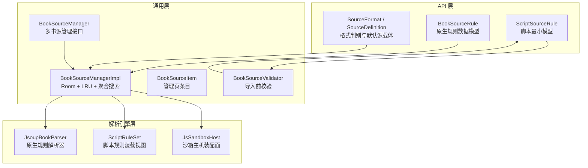
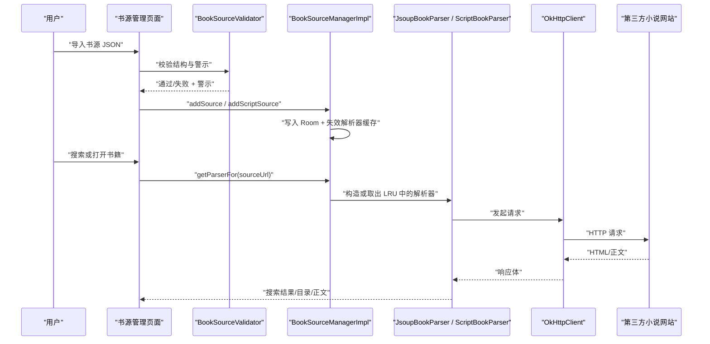
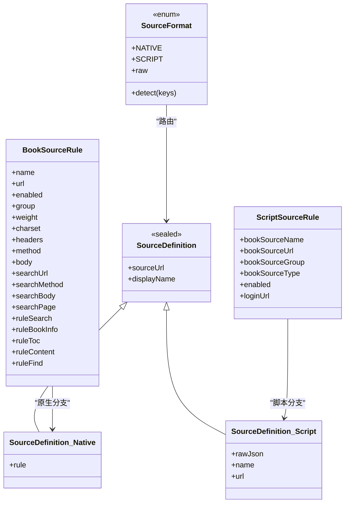
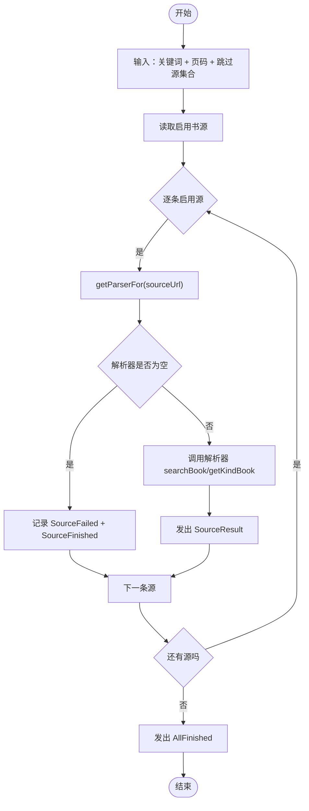
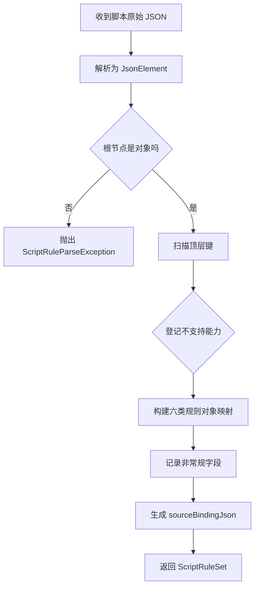
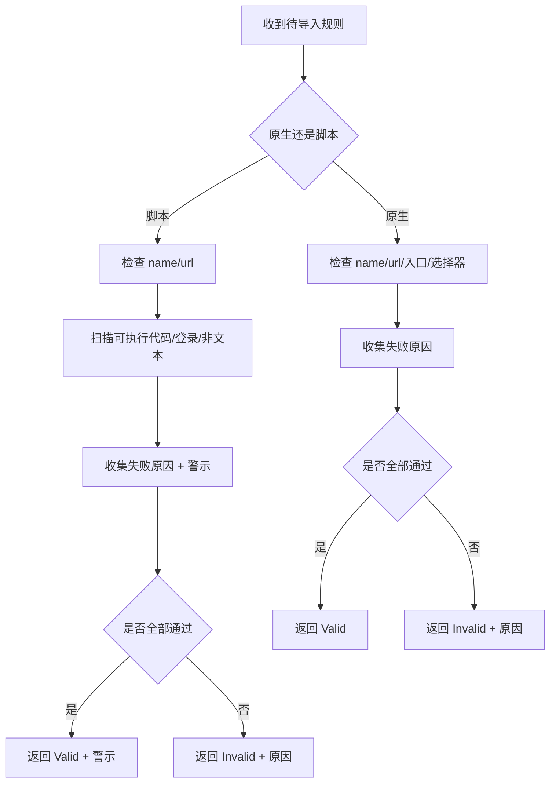
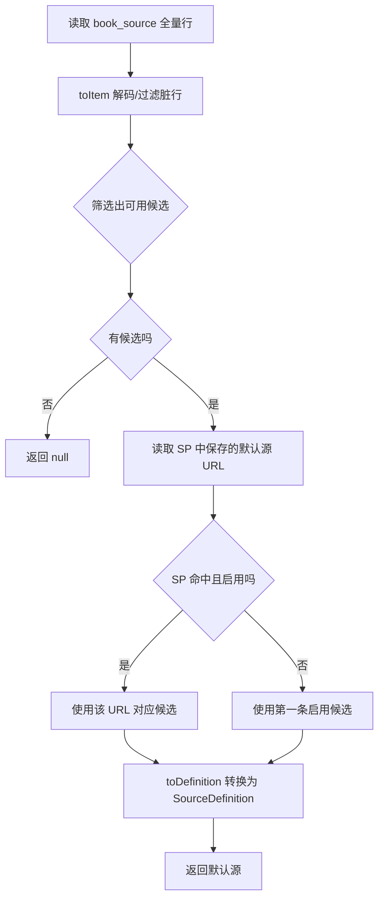
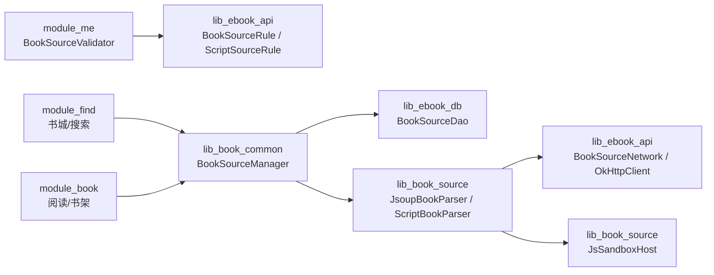

# 书源开发指南

<cite>
**本文引用的文件**   
- [README.MD](file://README.MD)
- [BookSourceRule.kt](file://lib_ebook_api/src/main/java/com/ebook/api/entity/BookSourceRule.kt)
- [ScriptSourceRule.kt](file://lib_ebook_api/src/main/java/com/ebook/api/entity/ScriptSourceRule.kt)
- [SourceFormat.kt](file://lib_ebook_api/src/main/java/com/ebook/api/entity/SourceFormat.kt)
- [SourceFormatDetectorTest.kt](file://lib_ebook_api/src/test/java/com/ebook/api/entity/SourceFormatDetectorTest.kt)
- [BookSourceItem.kt](file://lib_book_common/src/main/java/com/ebook/common/analyze/source/BookSourceItem.kt)
- [BookSourceManager.kt](file://lib_book_common/src/main/java/com/ebook/common/analyze/source/BookSourceManager.kt)
- [BookSourceManagerImpl.kt](file://lib_book_common/src/main/java/com/ebook/common/analyze/source/BookSourceManagerImpl.kt)
- [JsoupBookParser.kt](file://lib_book_source/src/main/java/com/ebook/source/analyze/JsoupBookParser.kt)
- [ScriptRuleSet.kt](file://lib_book_source/src/main/java/com/ebook/source/script/ScriptRuleSet.kt)
- [ScriptRuleExceptions.kt](file://lib_book_source/src/main/java/com/ebook/source/script/ScriptRuleExceptions.kt)
- [JsSandboxHost.kt](file://lib_book_source/src/main/java/com/ebook/source/sandbox/JsSandboxHost.kt)
- [BookSourceValidator.kt](file://module_me/src/main/java/com/ebook/me/domain/BookSourceValidator.kt)
- [book-source-rules.md](file://docs/book-source-rules.md)
</cite>

## 目录
1. [引言](#引言)
2. [项目结构](#项目结构)
3. [核心组件](#核心组件)
4. [架构总览](#架构总览)
5. [详细组件分析](#详细组件分析)
6. [依赖关系分析](#依赖关系分析)
7. [性能与并发特性](#性能与并发特性)
8. [调试与排障](#调试与排障)
9. [版本管理与更新机制](#版本管理与更新机制)
10. [书源质量评估标准与审核流程](#书源质量评估标准与审核流程)
11. [实战案例与最佳实践](#实战案例与最佳实践)
12. [结论](#结论)

## 引言
本指南面向为 Android 小说阅读器编写“书源”的开发者。本项目支持两类书源：原生规则书源和脚本书源，两者在同一张数据库表中并存，由应用根据 JSON 顶层键自动判别格式；用户通过“我的 → 设置 → 书源管理”导入、启用、禁用、删除并设置默认源，每本书绑定自己的来源各自解析，搜索书城支持跨源聚合。

关键约束需要前置说明：
- 应用不随包携带任何书源，启动时也没有可同步给出的默认源；空表就是“无可用书源”，调用方应展示引导态。
- 应用只保证书源解析引擎（规则词法/求值/取文、JS 沙箱执行器）的正确性，不保证用户导入的具体书源能正常加载。
- 脚本规则在零权限隔离进程内执行，请求一律走纯净客户端，不得泄露用户登录凭证。
- 书源以 URL 作为主键；新增或覆盖导入按 URL 替换旧行。

**章节来源**
- [README.MD:1-212](file://README.MD#L1-L212)

## 项目结构
书源相关代码分布在四个模块中：
- `lib_ebook_api`：书源配置的数据模型与格式判别逻辑。
- `lib_book_common`：书源管理器、清单持久化、条目映射、聚合搜索编排。
- `lib_book_source`：解析引擎，包括基于 Jsoup 的原生解析器和脚本解释器、沙箱主机装配。
- `module_me`：书源导入前的最小校验与警示。

**图表来源**
- [BookSourceRule.kt:1-209](file://lib_ebook_api/src/main/java/com/ebook/api/entity/BookSourceRule.kt#L1-L209)
- [ScriptSourceRule.kt:1-28](file://lib_ebook_api/src/main/java/com/ebook/api/entity/ScriptSourceRule.kt#L1-L28)
- [SourceFormat.kt:1-91](file://lib_ebook_api/src/main/java/com/ebook/api/entity/SourceFormat.kt#L1-L91)
- [BookSourceManager.kt:1-277](file://lib_book_common/src/main/java/com/ebook/common/analyze/source/BookSourceManager.kt#L1-L277)
- [BookSourceManagerImpl.kt:1-200](file://lib_book_common/src/main/java/com/ebook/common/analyze/source/BookSourceManagerImpl.kt#L1-L200)
- [BookSourceItem.kt:1-49](file://lib_book_common/src/main/java/com/ebook/common/analyze/source/BookSourceItem.kt#L1-L49)
- [BookSourceValidator.kt:1-198](file://module_me/src/main/java/com/ebook/me/domain/BookSourceValidator.kt#L1-L198)
- [JsoupBookParser.kt:1-200](file://lib_book_source/src/main/java/com/ebook/source/analyze/JsoupBookParser.kt#L1-L200)
- [ScriptRuleSet.kt:1-200](file://lib_book_source/src/main/java/com/ebook/source/script/ScriptRuleSet.kt#L1-L200)
- [JsSandboxHost.kt:1-60](file://lib_book_source/src/main/java/com/ebook/source/sandbox/JsSandboxHost.kt#L1-L60)

**章节来源**
- [README.MD:120-212](file://README.MD#L120-L212)

## 核心组件
### 原生规则数据模型
原生书源使用声明式 JSON，核心类型是 `BookSourceRule`，包含：
- 基础信息：名称、URL、是否启用、分组、权重、字符编码、请求头、请求方法与请求体模板。
- 搜索规则：搜索 URL、分页参数、搜索结果选择器、详情页链接、封面、简介等。
- 书籍详情规则：书名、作者、封面、简介、分类、最新章节、目录页 URL、前缀清理、目录反转。
- 目录规则：列表选择器、章节名、章节 URL、分页 URL 模板、“下一页”选择器、顺序反转。
- 正文规则：正文容器、下一页、替换规则、图片模式。
- 发现/分类规则：分类 URL、分类项、复用搜索结果规则。

该模型的目标是“仅通过 JSON 配置即可适配新网站”。

**章节来源**
- [BookSourceRule.kt:1-209](file://lib_ebook_api/src/main/java/com/ebook/api/entity/BookSourceRule.kt#L1-L209)

### 脚本最小模型
脚本书源的最小模型 `ScriptSourceRule` 只保留导入校验与落库所需字段：名称、地址、分组、内容类型、是否启用、登录入口。它采用忽略未知键的解码策略，未声明的规则原样保留在原始 JSON 中，由解释器直接消费，避免导入层与求值层各持一套接受集。

**章节来源**
- [ScriptSourceRule.kt:1-28](file://lib_ebook_api/src/main/java/com/ebook/api/entity/ScriptSourceRule.kt#L1-L28)

### 格式判别与默认源载体
`SourceFormat` 用枚举表示原生与脚本两种出身，存储列值是小写字符串；`fromRaw` 把未知值归回原生，以便脏数据仍走既有校验。`SourceFormatDetector` 仅凭 JSON 顶层是否含 `bookSourceUrl` 判定脚本格式，其他情况回落原生。

`SourceDefinition` 是 Manager 构造解析器与默认源的密封类型：
- 原生分支承载已解码的 `BookSourceRule`。
- 脚本分支承载原始 JSON，并附带展示用的名称与 URL。

**章节来源**
- [SourceFormat.kt:1-91](file://lib_ebook_api/src/main/java/com/ebook/api/entity/SourceFormat.kt#L1-L91)
- [SourceFormatDetectorTest.kt:1-24](file://lib_ebook_api/src/test/java/com/ebook/api/entity/SourceFormatDetectorTest.kt#L1-L24)

### 书源管理器
`BookSourceManager` 是多书源共存清单的唯一入口，职责包括：
- 提供全部书源、启用书源、按 URL 获取规则。
- 按 URL 获取解析器，并维护 LRU 缓存。
- 聚合搜索：对每条启用源并发解析，增量输出事件。
- 新增或覆盖原生规则、新增或覆盖脚本源。
- 查询格式出身、书城分类条目、默认源观察流。

接口明确区分三种失败语义：
- 返回 null：本地书 tag、空白 URL、库里没有这行、原生格式规则解不出来。
- 类型化异常：源存在但规则解不动。
- 取消异常：协程取消原样上抛，不让旧轮次继续灌结果。

**章节来源**
- [BookSourceManager.kt:1-277](file://lib_book_common/src/main/java/com/ebook/common/analyze/source/BookSourceManager.kt#L1-L277)

### 管理器实现
`BookSourceManagerImpl` 是 Room 之上的实现，关键点：
- 使用名为 `source` 的纯净 OkHttpClient，不带用户 token。
- 默认源每次现算：SP 命中启用源优先，否则第一条启用源；无启用源则返回 null。
- 实体行到对外条目的映射 `toItem` 对原生行解码并以实体列覆盖，对脚本行合成展示空壳。
- 实体行到求值输入的映射 `toDefinition` 是唯一格式分岔点。
- 解析器工厂根据 `SourceDefinition` 分支生产 `JsoupBookParser` 或 `ScriptBookParser`。
- LRU 容量为 3，保护频繁重建 Retrofit service 的成本。
- 聚合搜索并发上限为 5，避免同时打太多第三方站点触发风控。

**章节来源**
- [BookSourceManagerImpl.kt:1-200](file://lib_book_common/src/main/java/com/ebook/common/analyze/source/BookSourceManagerImpl.kt#L1-L200)
- [BookSourceManagerImpl.kt:200-435](file://lib_book_common/src/main/java/com/ebook/common/analyze/source/BookSourceManagerImpl.kt#L200-L435)

### 原生解析器
`JsoupBookParser` 接收 `BookSourceRule` 和 OkHttpClient，负责：
- 搜索：URL 编码、渲染分页 URL、发起请求、按 `SearchRule` 解析列表。
- 书籍详情：填充 `BookInfoEntity`，处理作者/简介前缀、目录页 URL。
- 章节目录：按 `TocRule` 收集章节，支持反转。
- 发现/分类：按 `FindRule.url` 渲染分类页，复用搜索结果解析链。

搜索解析结果会补全 `tag`、`origin`、封面、简介等字段；当简介为空时回填默认提示。

**章节来源**
- [JsoupBookParser.kt:1-200](file://lib_book_source/src/main/java/com/ebook/source/analyze/JsoupBookParser.kt#L1-L200)

### 脚本规则装载
`ScriptRuleSet` 是脚本规则的装载视图，从原始 JSON 提取：
- 源级元数据：地址、名称、分组、类型、启用状态、发现开关、变量、注释、登录地址、更新时间。
- 六类规则对象：搜索、发现、书籍详情、目录、正文。
- 非常规字段：数组形态或其他非字符串形态，留待求值层展开。
- 不支持能力标记：登录、Web JS、源正则、JS 库、封面解密、发现屏、下载 URL、评论、XPath、内嵌 JS、缓存前缀等。
- 源码原文：供导入报告、校验与解释器消费。

**章节来源**
- [ScriptRuleSet.kt:1-200](file://lib_book_source/src/main/java/com/ebook/source/script/ScriptRuleSet.kt#L1-L200)

### 脚本异常体系
脚本规则错误被拆成多种类型化异常，避免把“规则读不懂”“语法错误”“能力不支持”“沙箱不可用”“执行失败”混为一谈：
- `ScriptRuleParseException`：JSON 无法解析或形态不是书源对象。
- `RuleSyntaxException`：规则串有确定语法错误。
- `JsEvaluationPendingException`：规则含 JS，但当前环境缺少沙箱。
- `UnsupportedRuleFeatureException`：使用了项目未实现的能力。
- `SandboxProtocolException`：沙箱响应无法解析。
- `SandboxUnavailableException`：沙箱当前不可用。
- `JsExecutionFailedException`：脚本实际执行失败。

**章节来源**
- [ScriptRuleExceptions.kt:1-85](file://lib_book_source/src/main/java/com/ebook/source/script/ScriptRuleExceptions.kt#L1-L85)

### 沙箱主机
`JsSandboxHost` 是主进程侧的沙箱装配面：
- 持有长命客户端和任务级回调路由器。
- 为一次解析任务创建桥接对象，传入执行上下文、网络守卫、传输、静态绑定、Cookie 和状态探测。
- 所有外发请求都经过守卫客户端，永远不带用户 token。

**章节来源**
- [JsSandboxHost.kt:1-60](file://lib_book_source/src/main/java/com/ebook/source/sandbox/JsSandboxHost.kt#L1-L60)

### 导入前校验
`BookSourceValidator` 只做结构校验，不做连通性测试：
- 原生规则四条：名称不能空、URL 必须 http(s)、至少提供搜索入口或分类入口、搜索结果列表和正文容器不能缺。
- 脚本最小模型两条：名称和地址必填。
- 脚本三条警示：含可执行代码、依赖登录、非文本类型；这些警示不阻断导入，只是告知能力边界。

**章节来源**
- [BookSourceValidator.kt:1-198](file://module_me/src/main/java/com/ebook/me/domain/BookSourceValidator.kt#L1-L198)

## 架构总览
书源开发涉及“配置定义 → 导入校验 → 持久化 → 解析器装配 → 网络请求 → HTML/脚本解析 → 领域实体”的完整链路。

**图表来源**
- [BookSourceValidator.kt:1-198](file://module_me/src/main/java/com/ebook/me/domain/BookSourceValidator.kt#L1-L198)
- [BookSourceManagerImpl.kt:1-200](file://lib_book_common/src/main/java/com/ebook/common/analyze/source/BookSourceManagerImpl.kt#L1-L200)
- [JsoupBookParser.kt:1-200](file://lib_book_source/src/main/java/com/ebook/source/analyze/JsoupBookParser.kt#L1-L200)
- [JsSandboxHost.kt:1-60](file://lib_book_source/src/main/java/com/ebook/source/sandbox/JsSandboxHost.kt#L1-L60)

## 详细组件分析

### 书源格式与数据结构

**图表来源**
- [BookSourceRule.kt:1-209](file://lib_ebook_api/src/main/java/com/ebook/api/entity/BookSourceRule.kt#L1-L209)
- [ScriptSourceRule.kt:1-28](file://lib_ebook_api/src/main/java/com/ebook/api/entity/ScriptSourceRule.kt#L1-L28)
- [SourceFormat.kt:1-91](file://lib_ebook_api/src/main/java/com/ebook/api/entity/SourceFormat.kt#L1-L91)

### 书源解析流程

**图表来源**
- [BookSourceManager.kt:1-277](file://lib_book_common/src/main/java/com/ebook/common/analyze/source/BookSourceManager.kt#L1-L277)
- [BookSourceManagerImpl.kt:1-200](file://lib_book_common/src/main/java/com/ebook/common/analyze/source/BookSourceManagerImpl.kt#L1-L200)
- [JsoupBookParser.kt:1-200](file://lib_book_source/src/main/java/com/ebook/source/analyze/JsoupBookParser.kt#L1-L200)

### 脚本规则装载流程

**图表来源**
- [ScriptRuleSet.kt:1-200](file://lib_book_source/src/main/java/com/ebook/source/script/ScriptRuleSet.kt#L1-L200)
- [ScriptRuleExceptions.kt:1-85](file://lib_book_source/src/main/java/com/ebook/source/script/ScriptRuleExceptions.kt#L1-L85)

### 导入校验流程

**图表来源**
- [BookSourceValidator.kt:1-198](file://module_me/src/main/java/com/ebook/me/domain/BookSourceValidator.kt#L1-L198)

### 默认源选择流程

**图表来源**
- [BookSourceManagerImpl.kt:200-435](file://lib_book_common/src/main/java/com/ebook/common/analyze/source/BookSourceManagerImpl.kt#L200-L435)
- [SourceFormat.kt:1-91](file://lib_ebook_api/src/main/java/com/ebook/api/entity/SourceFormat.kt#L1-L91)

## 依赖关系分析
- API 层只暴露数据模型与格式判别，不包含业务逻辑。
- 通用层依赖 DAO、实体、解析器接口和沙箱装配面，但不反向依赖具体 UI。
- 解析引擎层依赖 OkHttp、Jsoup、QuickJS 沙箱桥接，不依赖 Room。
- 个人中心模块只承担导入前的最小校验，真正的解析错误由解析器抛出类型化异常。

**图表来源**
- [BookSourceValidator.kt:1-198](file://module_me/src/main/java/com/ebook/me/domain/BookSourceValidator.kt#L1-L198)
- [BookSourceManager.kt:1-277](file://lib_book_common/src/main/java/com/ebook/common/analyze/source/BookSourceManager.kt#L1-L277)
- [BookSourceManagerImpl.kt:1-200](file://lib_book_common/src/main/java/com/ebook/common/analyze/source/BookSourceManagerImpl.kt#L1-L200)
- [JsoupBookParser.kt:1-200](file://lib_book_source/src/main/java/com/ebook/source/analyze/JsoupBookParser.kt#L1-L200)
- [JsSandboxHost.kt:1-60](file://lib_book_source/src/main/java/com/ebook/source/sandbox/JsSandboxHost.kt#L1-L60)

**章节来源**
- [BookSourceManager.kt:1-277](file://lib_book_common/src/main/java/com/ebook/common/analyze/source/BookSourceManager.kt#L1-L277)
- [BookSourceManagerImpl.kt:1-200](file://lib_book_common/src/main/java/com/ebook/common/analyze/source/BookSourceManagerImpl.kt#L1-L200)

## 性能与并发特性
- 解析器 LRU 缓存容量为 3，适合“同时活跃书籍数量级”的使用场景；超出容量淘汰最久未用项，代价是下一轮重建解析器实例。
- 聚合搜索并发上限为 5，避免对多个第三方站点同时发送相同关键词导致封 IP 或验证码。
- 单源失败不会终止聚合流；取消异常原样上抛，防止旧轮次污染新结果。
- 解析器工厂只在缓存未命中时构造，避免重复创建 Retrofit service。
- 默认源不持有内存快照，而是每次从 Room 计算，避免“默认源事实源分裂”。

优化建议：
- 不要盲目提高聚合搜索并发，第三方站点的反爬风险高于本机性能收益。
- 不要绕过 `getParserFor` 自行 new 解析器，否则会破坏 LRU 与缓存失效契约。
- 不要在规则里写无界循环或无限翻页逻辑，应由规则选择器和分页边界控制。
- 正文替换规则应尽可能精确，避免全局正则扫描大段 HTML 造成卡顿。

**章节来源**
- [BookSourceManagerImpl.kt:1-200](file://lib_book_common/src/main/java/com/ebook/common/analyze/source/BookSourceManagerImpl.kt#L1-L200)
- [BookSourceManager.kt:1-277](file://lib_book_common/src/main/java/com/ebook/common/analyze/source/BookSourceManager.kt#L1-L277)

## 调试与排障
### 日志定位
- 原生解析器会对搜索 URL、方法、结果数量输出调试日志，便于确认 URL 渲染是否正确。
- 管理器会对非原生格式跳过规则类型化读面、脚本书源求值路由、脏行解码失败等情况输出日志。
- 脚本异常消息统一面向用户文案，禁止出现生态项目名，便于直接定位“规则问题”还是“沙箱问题”。

排查步骤：
1. 先确认导入阶段是否通过：名称、URL、入口、选择器是否齐全。
2. 再确认格式判别：JSON 顶层是否含 `bookSourceUrl`。
3. 再确认默认源：SP 中是否指向一个启用的源。
4. 再确认解析器是否命中 LRU：同一 URL 换格式后是否失效缓存。
5. 最后区分异常类型：是解析器返回空结果，还是抛出类型化异常。

### 断点调试建议
- 在 `BookSourceManagerImpl.getParserFor` 打断点，确认 URL 是否进入查库与缓存分支。
- 在 `JsoupBookParser.searchBook` 打断点，确认 URL 模板渲染、分页参数、请求体替换。
- 在脚本异常抛出点打断点，区分 JSON 解析失败、语法错误、能力不支持、沙箱不可用、执行失败。
- 在 `BookSourceValidator.validate` 与 `validateScript` 打断点，确认导入失败原因。

### 网络抓包建议
- 书源解析使用名为 `source` 的纯净 OkHttpClient，不携带用户 token，因此抓包看到的通常是匿名请求。
- 如果书源需要登录态，脚本端应通过宿主白名单提供的 Cookie 或会话能力，而不是把 token 硬编码进规则。
- 抓包时注意区分首页 URL 与“下一页” URL；对于以 `/{{page}}` 结尾的模板，首页不应带 `/1`。

**章节来源**
- [JsoupBookParser.kt:1-200](file://lib_book_source/src/main/java/com/ebook/source/analyze/JsoupBookParser.kt#L1-L200)
- [BookSourceManagerImpl.kt:1-200](file://lib_book_common/src/main/java/com/ebook/common/analyze/source/BookSourceManagerImpl.kt#L1-L200)
- [ScriptRuleExceptions.kt:1-85](file://lib_book_source/src/main/java/com/ebook/source/script/ScriptRuleExceptions.kt#L1-L85)
- [BookSourceValidator.kt:1-198](file://module_me/src/main/java/com/ebook/me/domain/BookSourceValidator.kt#L1-L198)

## 版本管理与更新机制
- 书源以 URL 为主键，新增或覆盖导入会 REPLACE 旧行，社区整包重导即更新规则。
- 写操作成功后会失效该 URL 对应的解析器缓存，避免旧解析器继续生效。
- 若无可用默认源，新导入的启用源会被提升为默认源；脚本源也参与这一行为。
- 书源规则文档位于仓库文档目录，应用本身不随包携带任何书源，因此“版本”概念更偏向“社区规则版本”而非内置资源版本。
- 若后端提供书源分发能力，应通过现有书源管理入口导入，而不是修改应用内置配置。

**章节来源**
- [BookSourceManager.kt:1-277](file://lib_book_common/src/main/java/com/ebook/common/analyze/source/BookSourceManager.kt#L1-L277)
- [BookSourceManagerImpl.kt:1-200](file://lib_book_common/src/main/java/com/ebook/common/analyze/source/BookSourceManagerImpl.kt#L1-L200)
- [README.MD:1-212](file://README.MD#L1-L212)

## 书源质量评估标准与审核流程
### 结构质量
- 原生规则必须满足：名称非空、URL 是 http(s)、至少提供搜索入口或分类入口、搜索结果列表与正文容器均非空。
- 脚本书源必须满足：名称非空、URL 是 http(s)，并能被最小模型解码。
- 脚本书源可能产生三类警示：含可执行代码、依赖登录、非文本类型；这些警示不阻止导入，但应在导入预览中明示。

### 行为质量
- 搜索结果能拿到书名和详情页 URL。
- 书籍详情能拿到书名、作者、封面、简介、目录页 URL。
- 目录能按规则分页或按“下一页”翻页。
- 正文能按容器提取并按“下一页”拼接。
- 分类发现能按分类胶囊访问不同类目。

### 安全质量
- 不向第三方站点泄漏用户 token。
- 脚本在零权限沙箱进程执行。
- 不使用未实现能力而不告知用户。

### 推荐审核流程
1. 结构校验：通过 `BookSourceValidator` 判断是否可导入。
2. 导入预览：查看格式判别、是否将覆盖已有源、是否含警示。
3. 手动验证：在书城搜索、书籍详情、目录、正文四类路径逐一验证。
4. 稳定性验证：多次翻页、换设备、弱网环境下确认不会串章或静默空结果。
5. 发布维护：社区更新规则时通过覆盖导入更新 URL；站点改版后重新调整选择器或分页规则。

**章节来源**
- [BookSourceValidator.kt:1-198](file://module_me/src/main/java/com/ebook/me/domain/BookSourceValidator.kt#L1-L198)
- [book-source-rules.md:1-200](file://docs/book-source-rules.md#L1-L200)

## 实战案例与最佳实践

### 案例一：适配普通列表型小说站
适用场景：搜索结果是一列卡片，详情页有目录和正文。
要点：
- `searchUrl` 使用 `{{keyword}}` 和 `{{page}}`。
- `ruleSearch.list` 指向搜索结果项。
- `ruleBookInfo.tocUrl` 可留空，让目录页 URL 复用详情页。
- `ruleToc.list` 指向章节列表，`nextPage` 优先于 `pageUrl`。
- `ruleContent.content` 指向正文容器，必要时补充 `replaceRules` 清理广告。

参考实现位置：
- 原生规则字段定义：[BookSourceRule.kt:1-209](file://lib_ebook_api/src/main/java/com/ebook/api/entity/BookSourceRule.kt#L1-L209)
- 搜索结果解析：[JsoupBookParser.kt:1-200](file://lib_book_source/src/main/java/com/ebook/source/analyze/JsoupBookParser.kt#L1-L200)

### 案例二：适配分类发现型书城
适用场景：书城顶部有多个分类胶囊，点击后加载对应分类书目。
要点：
- `ruleFind.url` 必须包含 `{{kind}}` 与 `{{page}}`。
- `ruleFind.kinds` 提供分类标题与标识。
- `ruleFind.ruleSearch` 可复用 `ruleSearch`，也可单独声明。
- 模板以 `/{{page}}` 结尾时，首页会自动裁掉页码段。

参考实现位置：
- 发现规则字段定义：[BookSourceRule.kt:1-209](file://lib_ebook_api/src/main/java/com/ebook/api/entity/BookSourceRule.kt#L1-L209)
- 分类解析流程：[JsoupBookParser.kt:1-200](file://lib_book_source/src/main/java/com/ebook/source/analyze/JsoupBookParser.kt#L1-L200)

### 案例三：适配脚本书源
适用场景：社区通用 JSON，规则中包含 JavaScript。
要点：
- JSON 顶层含 `bookSourceUrl`，格式判别为脚本。
- 导入前进行结构校验，并显示可执行代码、登录、非文本警示。
- 运行时由 `ScriptRuleSet` 装载规则，并由沙箱主机装配请求能力。
- 若规则使用未实现能力，应抛出明确的类型化异常，而不是静默返回空结果。

参考实现位置：
- 脚本最小模型：[ScriptSourceRule.kt:1-28](file://lib_ebook_api/src/main/java/com/ebook/api/entity/ScriptSourceRule.kt#L1-L28)
- 脚本规则装载：[ScriptRuleSet.kt:1-200](file://lib_book_source/src/main/java/com/ebook/source/script/ScriptRuleSet.kt#L1-L200)
- 沙箱主机装配：[JsSandboxHost.kt:1-60](file://lib_book_source/src/main/java/com/ebook/source/sandbox/JsSandboxHost.kt#L1-L60)
- 脚本异常类型：[ScriptRuleExceptions.kt:1-85](file://lib_book_source/src/main/java/com/ebook/source/script/ScriptRuleExceptions.kt#L1-L85)

### 最佳实践清单
- 始终确保 URL 是 http(s) 开头。
- 列表分页模板必须带 `{{page}}`，首页渲染遵循 `/{{page}}` 裁剪语义。
- “下一页”优先于 URL 模板翻页。
- 正文清理规则尽量局部匹配，避免全局正则扫描。
- 不要为了“首帧不空白”引入内存默认书源；默认源必须来自 Room。
- 不要绕过 `getParserFor` 自行构造解析器。
- 不要把用户 token 放入书源请求头或脚本明文。
- 导入失败要一次性列出所有原因，不要修一个报一个。
- 对脚本书源区分“能导入但能力受限”和“真的坏了”。

**章节来源**
- [BookSourceRule.kt:1-209](file://lib_ebook_api/src/main/java/com/ebook/api/entity/BookSourceRule.kt#L1-L209)
- [BookSourceValidator.kt:1-198](file://module_me/src/main/java/com/ebook/me/domain/BookSourceValidator.kt#L1-L198)
- [BookSourceManagerImpl.kt:1-200](file://lib_book_common/src/main/java/com/ebook/common/analyze/source/BookSourceManagerImpl.kt#L1-L200)
- [JsoupBookParser.kt:1-200](file://lib_book_source/src/main/java/com/ebook/source/analyze/JsoupBookParser.kt#L1-L200)
- [ScriptRuleSet.kt:1-200](file://lib_book_source/src/main/java/com/ebook/source/script/ScriptRuleSet.kt#L1-L200)

## 结论
书源开发的本质是把“第三方网站的页面结构”翻译成“解析器能消费的规则”。在本项目中，原生规则走声明式 JSON 和 Jsoup 选择器，脚本规则走社区通用 JSON 和零权限沙箱执行；两者通过 `BookSourceManagerImpl` 统一接入 Room、LRU 解析器缓存和聚合搜索。

对书源开发者而言，最重要的原则有三条：
1. 规则要准确描述站点结构，尤其要正确处理搜索 URL、分页、目录和正文。
2. 失败要可区分：空结果是“没有这条信息”，类型化异常是“规则解不动”。
3. 安全要优先：脚本在沙箱中运行，请求不带用户 token，未实现能力要如实告知。

只要遵循这些原则，并结合导入校验、调试日志、网络抓包和手动验证，就能快速完成从需求分析到部署上线的书源开发闭环。