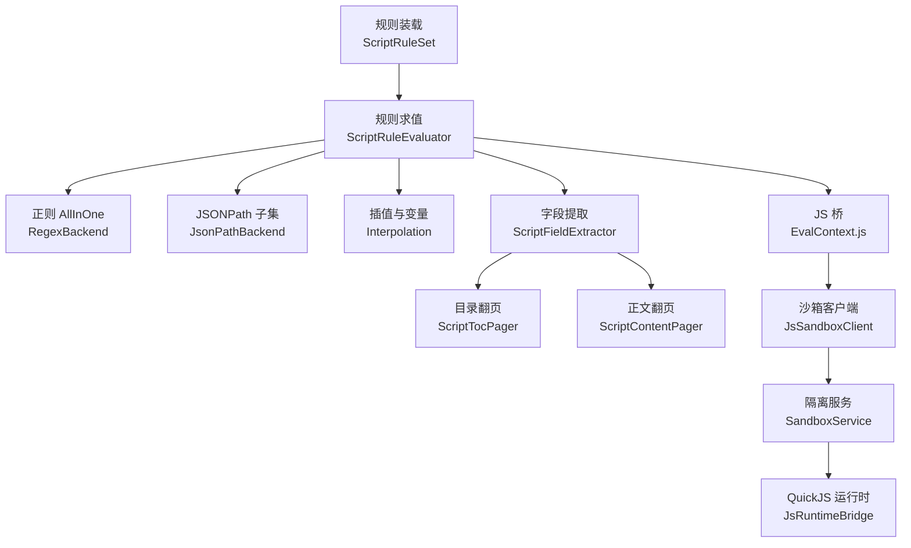
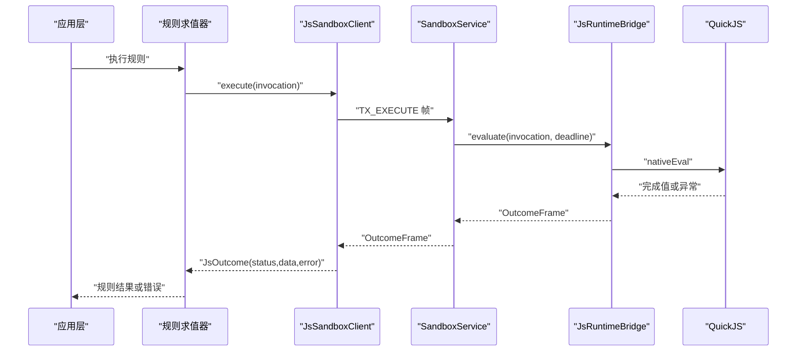
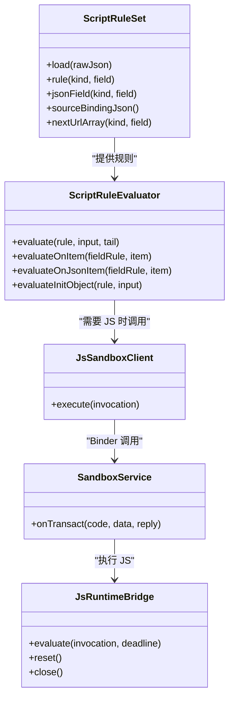

# 书源解析 API

<cite>
**本文引用的文件**   
- [SandboxContract.kt](file://lib_book_source/src/main/java/com/ebook/source/sandbox/SandboxContract.kt)
- [JsProtocol.kt](file://lib_book_source/src/main/java/com/ebook/source/sandbox/JsProtocol.kt)
- [JsSandboxClient.kt](file://lib_book_source/src/main/java/com/ebook/source/sandbox/JsSandboxClient.kt)
- [JsRuntimeBridge.kt](file://lib_book_source/src/main/java/com/ebook/source/sandbox/JsRuntimeBridge.kt)
- [JsLimits.kt](file://lib_book_source/src/main/java/com/ebook/source/sandbox/JsLimits.kt)
- [SourceHostAllowlist.kt](file://lib_book_source/src/main/java/com/ebook/source/sandbox/SourceHostAllowlist.kt)
- [JsNetworkGuard.kt](file://lib_book_source/src/main/java/com/ebook/source/sandbox/JsNetworkGuard.kt)
- [SourceCookieJar.kt](file://lib_book_source/src/main/java/com/ebook/source/sandbox/SourceCookieJar.kt)
- [SandboxProcess.kt](file://lib_book_source/src/main/java/com/ebook/source/sandbox/SandboxProcess.kt)
- [SandboxService.kt](file://lib_book_source/src/main/java/com/ebook/source/sandbox/SandboxService.kt)
- [ScriptRuleSet.kt](file://lib_book_source/src/main/java/com/ebook/source/script/ScriptRuleSet.kt)
- [RuleMode.kt](file://lib_book_source/src/main/java/com/ebook/source/script/RuleMode.kt)
- [Interpolation.kt](file://lib_book_source/src/main/java/com/ebook/source/script/Interpolation.kt)
- [RuleNode.kt](file://lib_book_source/src/main/java/com/ebook/source/script/RuleNode.kt)
- [RuleValue.kt](file://lib_book_source/src/main/java/com/ebook/source/script/RuleValue.kt)
- [ScriptRuleEvaluator.kt](file://lib_book_source/src/main/java/com/ebook/source/script/ScriptRuleEvaluator.kt)
- [RegexBackend.kt](file://lib_book_source/src/main/java/com/ebook/source/script/RegexBackend.kt)
- [JsonPathBackend.kt](file://lib_book_source/src/main/java/com/ebook/source/script/JsonPathBackend.kt)
- [ScriptFieldExtractor.kt](file://lib_book_source/src/main/java/com/ebook/source/script/ScriptFieldExtractor.kt)
- [ScriptExplore.kt](file://lib_book_source/src/main/java/com/ebook/source/script/ScriptExplore.kt)
- [ScriptTocPager.kt](file://lib_book_source/src/main/java/com/ebook/source/script/ScriptTocPager.kt)
- [ScriptContentPager.kt](file://lib_book_source/src/main/java/com/ebook/source/script/ScriptContentPager.kt)
</cite>

## 目录
1. [简介](#简介)
2. [项目结构](#项目结构)
3. [核心组件](#核心组件)
4. [架构总览](#架构总览)
5. [详细组件分析](#详细组件分析)
6. [依赖关系分析](#依赖关系分析)
7. [性能与资源限制](#性能与资源限制)
8. [调试与故障排查](#调试与故障排查)
9. [最佳实践](#最佳实践)
10. [结论](#结论)

## 简介
本文件为 Android 小说阅读器项目的“书源解析 API”文档，面向使用脚本定义 JSON 规则来抓取书籍列表、目录和正文的作者。内容覆盖：
- JSON 规则语法与字段语义（搜索、发现、详情、目录、正文）。
- JavaScript 脚本接口、全局对象、内置函数与调用方式。
- QuickJS 沙箱执行环境的安全约束、内存上限、超时与重入保护。
- 主进程与隔离 `:js` 进程的桥接协议、数据序列化与错误传播。
- 完整书源配置示例说明、开发调试方法与性能优化建议。
- 书源验证流程、测试方法与部署注意事项。

## 项目结构
书源解析由两层组成：
- **规则解释层**：负责加载脚本 JSON、切分规则、求值正则/JSONPath/CSS/链式选择器/插值等。
- **沙箱执行层**：负责在隔离进程中运行 QuickJS，对外暴露受限的网络、Cookie、缓存等能力。

**图示来源**
- [ScriptRuleSet.kt](file://lib_book_source/src/main/java/com/ebook/source/script/ScriptRuleSet.kt)
- [ScriptRuleEvaluator.kt](file://lib_book_source/src/main/java/com/ebook/source/script/ScriptRuleEvaluator.kt)
- [RegexBackend.kt](file://lib_book_source/src/main/java/com/ebook/source/script/RegexBackend.kt)
- [JsonPathBackend.kt](file://lib_book_source/src/main/java/com/ebook/source/script/JsonPathBackend.kt)
- [Interpolation.kt](file://lib_book_source/src/main/java/com/ebook/source/script/Interpolation.kt)
- [ScriptFieldExtractor.kt](file://lib_book_source/src/main/java/com/ebook/source/script/ScriptFieldExtractor.kt)
- [ScriptTocPager.kt](file://lib_book_source/src/main/java/com/ebook/source/script/ScriptTocPager.kt)
- [ScriptContentPager.kt](file://lib_book_source/src/main/java/com/ebook/source/script/ScriptContentPager.kt)
- [JsSandboxClient.kt](file://lib_book_source/src/main/java/com/ebook/source/sandbox/JsSandboxClient.kt)
- [SandboxService.kt](file://lib_book_source/src/main/java/com/ebook/source/sandbox/SandboxService.kt)
- [JsRuntimeBridge.kt](file://lib_book_source/src/main/java/com/ebook/source/sandbox/JsRuntimeBridge.kt)

**章节来源**
- [ScriptRuleSet.kt](file://lib_book_source/src/main/java/com/ebook/source/script/ScriptRuleSet.kt)
- [ScriptRuleEvaluator.kt](file://lib_book_source/src/main/java/com/ebook/source/script/ScriptRuleEvaluator.kt)
- [JsSandboxClient.kt](file://lib_book_source/src/main/java/com/ebook/source/sandbox/JsSandboxClient.kt)

## 核心组件
- **规则装载**：`ScriptRuleSet` 把原始 JSON 转为可求值的规则表，并记录未实现能力（登录、XPath、封面解密、网页 JS 等）。
- **规则求值**：`ScriptRuleEvaluator` 按规格顺序处理插值、切分、逐支求值、替换段与 URL 尾段。
- **模式后端**：正则 AllInOne、JSONPath 子集、CSS/链式选择器、变量读写。
- **字段提取**：`ScriptFieldExtractor` 把列表结果展开成条目上下文，再按字段规则取值、落位 URL。
- **翻页器**：`ScriptTocPager` 抓目录；`ScriptContentPager` 拼接正文，支持 `replaceRegex` 净化。
- **沙箱客户端**：`JsSandboxClient` 是全部跨进程执行入口，负责串行化、超时、断连重放、host 回调中继。
- **协议层**：`JsProtocol` 定义请求帧与响应帧的 JSON 形态；`SandboxContract` 定义 Binder 事务码与协议版本。
- **安全限制**：`JsLimits` 集中堆、栈、挂钟、报文长度、请求次数等限制；`JsNetworkGuard` 与 `AddressPolicy` 限制网络目标；`SourceHostAllowlist` 从规则文本导出 host 白名单。
- **Cookie 管理**：`SourceCookieJar` 提供源级会话 Cookie 存取，供网络代理与脚本共享。

**章节来源**
- [ScriptRuleSet.kt](file://lib_book_source/src/main/java/com/ebook/source/script/ScriptRuleSet.kt)
- [ScriptRuleEvaluator.kt](file://lib_book_source/src/main/java/com/ebook/source/script/ScriptRuleEvaluator.kt)
- [ScriptFieldExtractor.kt](file://lib_book_source/src/main/java/com/ebook/source/script/ScriptFieldExtractor.kt)
- [ScriptTocPager.kt](file://lib_book_source/src/main/java/com/ebook/source/script/ScriptTocPager.kt)
- [ScriptContentPager.kt](file://lib_book_source/src/main/java/com/ebook/source/script/ScriptContentPager.kt)
- [JsSandboxClient.kt](file://lib_book_source/src/main/java/com/ebook/source/sandbox/JsSandboxClient.kt)
- [JsProtocol.kt](file://lib_book_source/src/main/java/com/ebook/source/sandbox/JsProtocol.kt)
- [SandboxContract.kt](file://lib_book_source/src/main/java/com/ebook/source/sandbox/SandboxContract.kt)
- [JsLimits.kt](file://lib_book_source/src/main/java/com/ebook/source/sandbox/JsLimits.kt)
- [JsNetworkGuard.kt](file://lib_book_source/src/main/java/com/ebook/source/sandbox/JsNetworkGuard.kt)
- [SourceHostAllowlist.kt](file://lib_book_source/src/main/java/com/ebook/source/sandbox/SourceHostAllowlist.kt)
- [SourceCookieJar.kt](file://lib_book_source/src/main/java/com/ebook/source/sandbox/SourceCookieJar.kt)

## 架构总览
书源解析的请求路径如下：
1. 应用侧根据书源 JSON 构造规则集合。
2. 搜索/发现/详情/目录/正文链路分别调用规则求值或翻页器。
3. 遇到 JS 段时，通过 `EvalContext.js` 调用 `JsSandboxClient.execute`。
4. 客户端把请求序列化为 JSON 帧，经 Binder 发送到 `:js` 进程。
5. `SandboxService` 校验 token 与协议版本后交给 `JsRuntimeBridge`。
6. 运行时执行 QuickJS，返回成功状态或带错误信息的失败状态。
7. 客户端解码响应并按 `JsStatus` 分类，上层据此决定重试、降级或报错。

**图示来源**
- [JsSandboxClient.kt](file://lib_book_source/src/main/java/com/ebook/source/sandbox/JsSandboxClient.kt)
- [SandboxService.kt](file://lib_book_source/src/main/java/com/ebook/source/sandbox/SandboxService.kt)
- [JsRuntimeBridge.kt](file://lib_book_source/src/main/java/com/ebook/source/sandbox/JsRuntimeBridge.kt)
- [JsProtocol.kt](file://lib_book_source/src/main/java/com/ebook/source/sandbox/JsProtocol.kt)

**章节来源**
- [JsSandboxClient.kt](file://lib_book_source/src/main/java/com/ebook/source/sandbox/JsSandboxClient.kt)
- [SandboxService.kt](file://lib_book_source/src/main/java/com/ebook/source/sandbox/SandboxService.kt)
- [JsRuntimeBridge.kt](file://lib_book_source/src/main/java/com/ebook/source/sandbox/JsRuntimeBridge.kt)

## 详细组件分析

### JSON 规则语法
#### 规则对象与顶层字段
脚本书源 JSON 包含以下规则对象键：
- `ruleSearch`：搜索列表解析。
- `ruleExplore`：发现页入口。
- `ruleBookInfo`：书籍详情解析。
- `ruleToc`：目录列表解析。
- `ruleContent`：正文内容解析。

顶层还允许 `searchUrl`、`exploreUrl` 等 URL 选项。导入阶段会把缺失的能力标记为不支持（例如登录、XPath、封面解密、网页 JS、评论、下载 URL 等），以便导入报告明确提示。

**章节来源**
- [ScriptRuleSet.kt](file://lib_book_source/src/main/java/com/ebook/source/script/ScriptRuleSet.kt)

#### 规则模式标志
一条规则可以以标志开头，指定解析模式：
- `@@` 或省略：默认链式/CSS 选择器。
- `@css:`：CSS 选择器。
- `@xpath:` 或 `//`：XPath（当前视为不支持）。
- `@json:` 或 `$.`：JSONPath。
- `:`：正则 AllInOne，对整个文本切分，字段用 `$n` 引用。
- `@put:` / `@get:`：变量写入与读取。
- `@cache:`：暂不支持。
- `<js>` / `@js:`：JavaScript 脚本。

反序前缀 `-` 可用于列表取数反转；`+` 在当前列表语义中仅剥除不改变行为。

**章节来源**
- [RuleMode.kt](file://lib_book_source/src/main/java/com/ebook/source/script/RuleMode.kt)

#### 组合语法
规则可以组合：
- `||`：第一个取到值即返回，语法错误会跳过继续下一支。
- `&&`：每支都求值并合并；节点、匹配项、JSON 节点分别合并，文本扁平连接。
- `%%`：多路交错取数，短列表走完不再补位。

空规则段对应“未取到值”，不是没有节点。

**章节来源**
- [ScriptRuleEvaluator.kt](file://lib_book_source/src/main/java/com/ebook/source/script/ScriptRuleEvaluator.kt)
- [RuleNode.kt](file://lib_book_source/src/main/java/com/ebook/source/script/RuleNode.kt)

#### 插值与变量
- `{{...}}` 在切分前先展开，但展开值不会参与切分，而是以占位符形式保留到最终结果回填。
- 声明式子集支持：
  - `@@<规则>` 递归求值。
  - 内置量 `key`、`page`、`baseUrl`。
  - `@put:` 写入、`@get:` 读取的变量。
- 其他表达式交给 JS 引擎；若未装配沙箱则抛出待执行异常，避免静默拼出字面量表达式。

**章节来源**
- [Interpolation.kt](file://lib_book_source/src/main/java/com/ebook/source/script/Interpolation.kt)
- [EvalContext.kt](file://lib_book_source/src/main/java/com/ebook/source/script/EvalContext.kt)

#### 正则 AllInOne
以 `:` 开头的模式对整篇页面文本运行正则，每条匹配生成一个条目，字段规则可用 `$n` 引用捕获组。该模式用于“造条目”的场景，如搜索、发现、详情预处理、目录列表。

**章节来源**
- [RegexBackend.kt](file://lib_book_source/src/main/java/com/ebook/source/script/RegexBackend.kt)

#### JSONPath 子集
支持的语法包括根 `$`、点号属性、方括号键名、数字索引、负索引、通配 `*`、递归 `..name`、切片 `[a:b(:c)]`、联合 `[a,b]`。过滤器和脚本表达式暂不支持。结果保持 JSON 节点形态，便于后续字段规则继续取子字段。

**章节来源**
- [JsonPathBackend.kt](file://lib_book_source/src/main/java/com/ebook/source/script/JsonPathBackend.kt)

#### 字段取值与 URL 落位
- 列表字段结果会被展开成条目上下文：HTML 节点、正则捕获组、JSON 节点或文本。
- 单值字段默认取第一个文本；空白规则直接返回空串。
- URL 类字段取值后会剥离 URL 尾段选项，按基地址落位绝对 URL，再把尾段重新附回作为下一次请求输入的一部分。

**章节来源**
- [ScriptFieldExtractor.kt](file://lib_book_source/src/main/java/com/ebook/source/script/ScriptFieldExtractor.kt)

### 书籍列表与搜索解析
搜索解析通常走 `ruleSearch`：
1. 使用 `ruleSearch.searchList` 获取搜索结果列表。
2. 列表字段结果展开为条目。
3. 对每个条目按 `bookName`、`authorText`、`bookUrl` 等字段规则取值。
4. URL 字段通过 `resolveUrl` 做相对地址落位。

搜索结果的 URL 可携带选项尾段，由取文层消费 POST、编码、缓存策略等参数。

**章节来源**
- [ScriptRuleSet.kt](file://lib_book_source/src/main/java/com/ebook/source/script/ScriptRuleSet.kt)
- [ScriptFieldExtractor.kt](file://lib_book_source/src/main/java/com/ebook/source/script/ScriptFieldExtractor.kt)

### 目录列表与翻页
目录翻页由 `ScriptTocPager` 驱动：
- 入口 URL 来自 `ruleToc.tocUrl`。
- 列表字段来自 `ruleToc.chapterList`。
- 条目字段包括 `chapterUrl`、`chapterName`。
- 下一页由 `ruleToc.nextTocUrl` 或 URL 数组决定。
- 终止条件：零新增、回环、超过 `MAX_TOC_CHAPTERS`（20,000 章）截断。
- 每页取回后更新 `baseUrl`，使下一页相对链接正确落位。

**章节来源**
- [ScriptTocPager.kt](file://lib_book_source/src/main/java/com/ebook/source/script/ScriptTocPager.kt)

### 正文内容与翻页
正文翻页由 `ScriptContentPager` 驱动：
- 内容字段 `content` 按单值字段语义取值，但段落性结果按换行拼接。
- 下一页由 `nextContentUrl` 或 URL 数组决定。
- 支持 `replaceRegex` 净化正文，先拼接再净化，最后 trim。
- 正文翻页**不使用** URL 形状启发式匹配，因为 `nextContentUrl` 是作者显式给出的下一页。
- 单章正文页数上限为 50 页。

**章节来源**
- [ScriptContentPager.kt](file://lib_book_source/src/main/java/com/ebook/source/script/ScriptContentPager.kt)

### 发现页与探索入口
`ScriptExplore` 提供只读入口：
- 从书源 JSON 中取出 `exploreUrl`。
- 把发现页 URL 拆分为多个分类条目，每个条目包含标题与 URL 规则。
- 纯解析，零网络、零 JS，确保分类胶囊渲染不触发请求。

**章节来源**
- [ScriptExplore.kt](file://lib_book_source/src/main/java/com/ebook/source/script/ScriptExplore.kt)
- [ScriptRuleSet.kt](file://lib_book_source/src/main/java/com/ebook/source/script/ScriptRuleSet.kt)

### JavaScript 脚本接口
脚本运行在隔离进程的 QuickJS 中，可通过以下机制访问宿主能力：
- 全局绑定：书源基础信息以 `sourceJson` 传入，脚本侧通过 `source` 对象读取书源元数据。
- 表达式求值：`{{...}}` 中的复杂表达式由 JS 引擎计算，返回值必须能转成字符串。
- URL 改写：URL 选项 `js` 可返回对象，改写 `url`、`headers`。
- 正文二次处理：URL 选项 `bodyJs` 可对响应体进行二次处理，返回新文本。
- 详情初始化：`ruleBookInfo.init` 的 JS 分支可返回对象，字段名即详情字段键。
- 宿主回调：脚本可调用受控 API，如网络代理、Cookie 读写、缓存键等，由主进程 `HostHandler` 处理。

**章节来源**
- [ScriptRuleSet.kt](file://lib_book_source/src/main/java/com/ebook/source/script/ScriptRuleSet.kt)
- [JsProtocol.kt](file://lib_book_source/src/main/java/com/ebook/source/sandbox/JsProtocol.kt)
- [JsSandboxClient.kt](file://lib_book_source/src/main/java/com/ebook/source/sandbox/JsSandboxClient.kt)

### 沙箱执行环境与限制
#### 安全边界
- 脚本只在 `android:isolatedProcess="true"` 的 `:js` 进程运行。
- 非隔离进程拒绝提供 Binder 通道。
- 所有外部能力通过受限 API 暴露，未经白名单的能力会被拒绝。

**章节来源**
- [SandboxProcess.kt](file://lib_book_source/src/main/java/com/ebook/source/sandbox/SandboxProcess.kt)
- [SandboxService.kt](file://lib_book_source/src/main/java/com/ebook/source/sandbox/SandboxService.kt)

#### 资源限制
- 单次执行挂钟上限：默认 5,000 ms。
- QuickJS 堆上限：默认 8 MB。
- JS 栈上限：默认 1 MB，实际还会根据线程剩余栈收紧。
- 请求帧、响应帧、host 回调帧 UTF-8 字节上限：默认 900 KB。
- 回调嵌套深度上限：默认 8。
- 单任务网络请求次数上限：默认 40。
- 连接超时：默认 2,000 ms。

**章节来源**
- [JsLimits.kt](file://lib_book_source/src/main/java/com/ebook/source/sandbox/JsLimits.kt)

#### 超时与内存保护
- 超时、内存超限、栈溢出会重置 QuickJS context，避免残留状态影响下一条规则。
- 响应帧在进入主进程前检查 UTF-8 长度，防止大响应绕过堆限制。
- 客户端串行化 execute，保证同一时刻只有一个请求在飞，从而让 900 KB 上限有意义。

**章节来源**
- [JsRuntimeBridge.kt](file://lib_book_source/src/main/java/com/ebook/source/sandbox/JsRuntimeBridge.kt)
- [JsProtocol.kt](file://lib_book_source/src/main/java/com/ebook/source/sandbox/JsProtocol.kt)
- [JsSandboxClient.kt](file://lib_book_source/src/main/java/com/ebook/source/sandbox/JsSandboxClient.kt)

#### 网络限制
- 仅允许 `http` 与 `https`。
- URL 长度上限 4,096。
- 禁止内嵌凭证、控制字符、百分号编码 host。
- host 必须在规则文本导出的白名单中。
- DNS 解析后按字节级策略拒绝内网、保留、不可路由地址。

**章节来源**
- [JsNetworkGuard.kt](file://lib_book_source/src/main/java/com/ebook/source/sandbox/JsNetworkGuard.kt)
- [SourceHostAllowlist.kt](file://lib_book_source/src/main/java/com/ebook/source/sandbox/SourceHostAllowlist.kt)

#### Cookie 与会话
- Cookie 罐按书源实例隔离，不落盘。
- 自动保存服务端 `Set-Cookie`，并在请求时带回匹配的 Cookie。
- 脚本可读取、设置、删除 Cookie。
- 空值设置表示清空该域会话。

**章节来源**
- [SourceCookieJar.kt](file://lib_book_source/src/main/java/com/ebook/source/sandbox/SourceCookieJar.kt)

### QuickJS 桥接通信协议
#### 协议标识与版本
- 接口 token：`com.ebook.source.sandbox.IJsExecutor`。
- 回调 token：`com.ebook.source.sandbox.IHostCallback`。
- 协议版本：当前为 1。两侧不一致立即拒绝，不猜测字段顺序。

**章节来源**
- [SandboxContract.kt](file://lib_book_source/src/main/java/com/ebook/source/sandbox/SandboxContract.kt)

#### 事务码
- `TX_EXECUTE`：主进程向执行器发起一次 JS 求值。
- `TX_PING`：探活，只校验 token、版本与 `.so` 是否就绪。
- `TX_HOST_CALL`：执行器向主进程发起 host 调用。

**章节来源**
- [SandboxContract.kt](file://lib_book_source/src/main/java/com/ebook/source/sandbox/SandboxContract.kt)

#### 请求帧
请求帧包含：
- `mode`：执行模式名称。
- `source`：脚本源码。
- `bindings`：绑定变量映射。
- `deadline`：单调时钟截止时间。

**章节来源**
- [JsProtocol.kt](file://lib_book_source/src/main/java/com/ebook/source/sandbox/JsProtocol.kt)

#### 响应帧
响应帧包含：
- `status`：成功或失败类别。
- `data`：成功时的 JSON 完成值。
- `error`：失败时的错误消息。

**章节来源**
- [JsProtocol.kt](file://lib_book_source/src/main/java/com/ebook/source/sandbox/JsProtocol.kt)

#### 错误分类
- `OK`：执行成功。
- `TIMEOUT`：执行超时。
- `MEMORY`：堆内存不足。
- `STACK`：栈溢出或过深。
- `SYNTAX`：语法错误。
- `RUNTIME`：运行时错误。
- `UNSUPPORTED_API`：调用了白名单外能力。
- `TOO_LARGE`：响应过大。
- `UNAVAILABLE`：执行器不可用或断连。

**章节来源**
- [JsProtocol.kt](file://lib_book_source/src/main/java/com/ebook/source/sandbox/JsProtocol.kt)

### 完整书源配置文件示例
由于不应直接输出仓库代码片段，下面给出应填写的配置结构与说明。

#### 基础信息
- `sourceUrl`：书源自身 URL。
- `name`：书源显示名称。
- `group`：分组。
- `type`：类型。
- `enabled`：是否启用。
- `enabledExplore`：是否启用发现页。
- `searchUrl`：搜索入口 URL。
- `exploreUrl`：发现页 URL。
- `variable`：源级自定义变量 JSON 文本。
- `variableComment`：自定义变量说明。
- `header`：请求头 JSON 文本。
- `bookSourceComment`：书源注释。
- `loginUrl`：登录地址（当前不实现登录）。
- `lastUpdateTime`：最后更新时间原文。

#### 解析规则
- `ruleSearch`：搜索列表解析规则对象。
- `ruleExplore`：发现页解析规则对象。
- `ruleBookInfo`：书籍详情解析规则对象。
- `ruleToc`：目录解析规则对象。
- `ruleContent`：正文解析规则对象。

#### 高级选项
- `jsLib`：JS 库（当前标记为不支持）。
- `coverDecodeJs`：封面解密 JS（当前标记为不支持）。
- `exploreScreen`：发现页 UI（当前标记为不支持）。
- `bookUrlPattern`：书籍 URL 模式（当前标记为不支持）。
- `downloadUrls`：下载 URL（当前标记为不支持）。
- `ruleReview`：评论（当前标记为不支持）。

**章节来源**
- [ScriptRuleSet.kt](file://lib_book_source/src/main/java/com/ebook/source/script/ScriptRuleSet.kt)

## 依赖关系分析
规则解释层与沙箱层的职责清晰分离：
- 规则解释层只关心 JSON 规则如何切分、求值、组合。
- 沙箱层只关心如何安全地执行一段 JS 源码，并把结果、错误、超时、内存问题传回主进程。
- 两者通过 `JsInvocation`、`JsOutcome`、`RequestFrame`、`OutcomeFrame` 等结构化帧通信。

**图示来源**
- [ScriptRuleSet.kt](file://lib_book_source/src/main/java/com/ebook/source/script/ScriptRuleSet.kt)
- [ScriptRuleEvaluator.kt](file://lib_book_source/src/main/java/com/ebook/source/script/ScriptRuleEvaluator.kt)
- [JsSandboxClient.kt](file://lib_book_source/src/main/java/com/ebook/source/sandbox/JsSandboxClient.kt)
- [SandboxService.kt](file://lib_book_source/src/main/java/com/ebook/source/sandbox/SandboxService.kt)
- [JsRuntimeBridge.kt](file://lib_book_source/src/main/java/com/ebook/source/sandbox/JsRuntimeBridge.kt)

**章节来源**
- [ScriptRuleSet.kt](file://lib_book_source/src/main/java/com/ebook/source/script/ScriptRuleSet.kt)
- [ScriptRuleEvaluator.kt](file://lib_book_source/src/main/java/com/ebook/source/script/ScriptRuleEvaluator.kt)
- [JsSandboxClient.kt](file://lib_book_source/src/main/java/com/ebook/source/sandbox/JsSandboxClient.kt)
- [SandboxService.kt](file://lib_book_source/src/main/java/com/ebook/source/sandbox/SandboxService.kt)
- [JsRuntimeBridge.kt](file://lib_book_source/src/main/java/com/ebook/source/sandbox/JsRuntimeBridge.kt)

## 性能与资源限制
### 关键限制值
| 限制项 | 默认值 | 用途 |
|---|---:|---|
| 单次执行挂钟上限 | 5,000 ms | 防死循环与慢脚本 |
| QuickJS 堆上限 | 8 MB | 防指数分配 |
| JS 栈上限 | 1 MB | 防无限递归 |
| 请求帧上限 | 900 KB | 防 Binder 缓冲溢出 |
| 响应帧上限 | 900 KB | 防大响应进入主进程 |
| host 回调帧上限 | 900 KB | 防整页 HTML 过大 |
| 回调嵌套深度上限 | 8 | 防规则套规则过深 |
| 连接超时 | 2,000 ms | 防冷启动阻塞 |
| 单任务网络请求次数 | 40 | 防轮询式恶意脚本 |

**章节来源**
- [JsLimits.kt](file://lib_book_source/src/main/java/com/ebook/source/sandbox/JsLimits.kt)

### 正文与目录防御
- 目录最大章节数：20,000。
- 正文最大页数：50。
- 目录翻页零新增即到底，正文翻页不以零新增为终止条件。
- URL 访问集用于检测回环，防止循环翻页。

**章节来源**
- [ScriptTocPager.kt](file://lib_book_source/src/main/java/com/ebook/source/script/ScriptTocPager.kt)
- [ScriptContentPager.kt](file://lib_book_source/src/main/java/com/ebook/source/script/ScriptContentPager.kt)

## 调试与故障排查
### 常见错误状态
- `TIMEOUT`：脚本执行时间过长。检查死循环、过度递归、过多网络请求。
- `MEMORY`：堆内存超限。减少大对象、避免整页 HTML 留在 JS 侧。
- `STACK`：栈溢出。减少递归与深层链式选择器。
- `SYNTAX`：JS 语法错误或规则语法错误。优先确认规则标志与正则写法。
- `RUNTIME`：脚本运行时错误。检查空引用、非法转换。
- `UNSUPPORTED_API`：调用了未授权能力。确认 host 在白名单内，且只使用允许的 API。
- `TOO_LARGE`：响应或请求超出字节上限。拆分分页、缩小响应。
- `UNAVAILABLE`：沙箱不可用、断连或协议版本不合。检查 `.so` 是否加载、进程是否隔离、构建是否同步。

**章节来源**
- [JsProtocol.kt](file://lib_book_source/src/main/java/com/ebook/source/sandbox/JsProtocol.kt)
- [JsSandboxClient.kt](file://lib_book_source/src/main/java/com/ebook/source/sandbox/JsSandboxClient.kt)

### 断连与重放
客户端会在通道断连后尝试重连并重放一次请求，但如果本次已经转发过 host 回调，则认为已产生副作用，不再重放，避免重复请求同一页。

**章节来源**
- [JsSandboxClient.kt](file://lib_book_source/src/main/java/com/ebook/source/sandbox/JsSandboxClient.kt)

### 主线程保护
沙箱执行不能在 Android 主线程上调用，否则会抛出明确异常。异步解析应放在后台线程。

**章节来源**
- [JsSandboxClient.kt](file://lib_book_source/src/main/java/com/ebook/source/sandbox/JsSandboxClient.kt)

### 日志与诊断
- 沙箱协议版本不合会记录对端版本与本地版本。
- host 回调失败会记录主进程处理异常。
- host 回复超出字节上限会记录实际大小。
- 目录触顶会记录警告日志。

**章节来源**
- [SandboxService.kt](file://lib_book_source/src/main/java/com/ebook/source/sandbox/SandboxService.kt)
- [JsSandboxClient.kt](file://lib_book_source/src/main/java/com/ebook/source/sandbox/JsSandboxClient.kt)
- [ScriptTocPager.kt](file://lib_book_source/src/main/java/com/ebook/source/script/ScriptTocPager.kt)

## 最佳实践
### 规则编写
- 优先使用选择器或 JSONPath，只有在需要整源切分时才用正则 AllInOne。
- 列表字段尽量稳定，避免依赖页面布局细节。
- URL 字段注意相对地址落位，必要时用 `baseUrl` 辅助定位。
- 正文净化使用 `replaceRegex`，避免在 JS 中做大量字符串拼接。
- 翻页规则要给出明确的终止条件，不要依赖隐式空值。

**章节来源**
- [RegexBackend.kt](file://lib_book_source/src/main/java/com/ebook/source/script/RegexBackend.kt)
- [JsonPathBackend.kt](file://lib_book_source/src/main/java/com/ebook/source/script/JsonPathBackend.kt)
- [ScriptFieldExtractor.kt](file://lib_book_source/src/main/java/com/ebook/source/script/ScriptFieldExtractor.kt)
- [ScriptContentPager.kt](file://lib_book_source/src/main/java/com/ebook/source/script/ScriptContentPager.kt)

### JS 脚本编写
- 尽量避免整页 HTML 进入 JS 侧，优先用规则层解析后再把少量数据传给 JS。
- 不要把 `while(true)` 或高频轮询写在脚本里，会被请求次数上限拦截。
- 使用 `cookie` 能力时要区分源级会话，避免跨站泄漏。
- 对可能失败的 URL 请求加 `try/catch`，让错误表现为普通失败而非进程崩溃。

**章节来源**
- [JsLimits.kt](file://lib_book_source/src/main/java/com/ebook/source/sandbox/JsLimits.kt)
- [SourceCookieJar.kt](file://lib_book_source/src/main/java/com/ebook/source/sandbox/SourceCookieJar.kt)
- [JsNetworkGuard.kt](file://lib_book_source/src/main/java/com/ebook/source/sandbox/JsNetworkGuard.kt)

### 性能优化
- 使用 JSONPath 解析结构化 API 响应，比正则更稳定也更省内存。
- 合理使用 `baseUrl` 推进，避免每次手动拼接绝对地址。
- 避免在 JS 中反复创建大对象；如需缓存，使用受控缓存 API。
- 正文拼接时利用 `replaceRegex` 一次性净化，而不是多次正则替换。

**章节来源**
- [JsonPathBackend.kt](file://lib_book_source/src/main/java/com/ebook/source/script/JsonPathBackend.kt)
- [ScriptFieldExtractor.kt](file://lib_book_source/src/main/java/com/ebook/source/script/ScriptFieldExtractor.kt)
- [ScriptContentPager.kt](file://lib_book_source/src/main/java/com/ebook/source/script/ScriptContentPager.kt)

### 验证流程
- 导入阶段检查顶层字段与规则对象是否存在。
- 装载阶段识别未实现能力并记录到 `unsupported`。
- 求值阶段对未知或不支持语法抛出类型化异常，而不是静默 Miss。
- 网络请求经过 host 白名单与地址策略双重校验。
- 响应帧长度在解析前检查，避免大响应进入主进程。

**章节来源**
- [ScriptRuleSet.kt](file://lib_book_source/src/main/java/com/ebook/source/script/ScriptRuleSet.kt)
- [JsProtocol.kt](file://lib_book_source/src/main/java/com/ebook/source/sandbox/JsProtocol.kt)
- [JsNetworkGuard.kt](file://lib_book_source/src/main/java/com/ebook/source/sandbox/JsNetworkGuard.kt)

### 测试方法
- 单元测试应覆盖：
  - 规则切分与组合语法。
  - 正则 AllInOne 与 JSONPath 子集。
  - 插值、变量读写、URL 落位。
  - 目录翻页与正文翻页边界条件。
  - 沙箱超时、内存、栈、协议版本、断连重放。
  - host 回调白名单与内网地址拒绝。
- 金标准测试应覆盖真实语料中最常见的站点结构。

**章节来源**
- [ScriptRuleEvaluator.kt](file://lib_book_source/src/main/java/com/ebook/source/script/ScriptRuleEvaluator.kt)
- [ScriptTocPager.kt](file://lib_book_source/src/main/java/com/ebook/source/script/ScriptTocPager.kt)
- [ScriptContentPager.kt](file://lib_book_source/src/main/java/com/ebook/source/script/ScriptContentPager.kt)
- [JsSandboxClient.kt](file://lib_book_source/src/main/java/com/ebook/source/sandbox/JsSandboxClient.kt)

### 部署配置
- 确保 `:js` 进程在清单中声明为隔离进程。
- 确保 `libebook_js.so` 与本仓 Kotlin 代码同一次构建。
- 确保主进程与 `:js` 进程使用相同的 `SandboxContract.PROTOCOL_VERSION`。
- 部署前检查沙箱可用性，区分“服务不在”和“.so 未加载”。

**章节来源**
- [SandboxProcess.kt](file://lib_book_source/src/main/java/com/ebook/source/sandbox/SandboxProcess.kt)
- [SandboxService.kt](file://lib_book_source/src/main/java/com/ebook/source/sandbox/SandboxService.kt)
- [JsRuntimeBridge.kt](file://lib_book_source/src/main/java/com/ebook/source/sandbox/JsRuntimeBridge.kt)
- [SandboxContract.kt](file://lib_book_source/src/main/java/com/ebook/source/sandbox/SandboxContract.kt)

## 结论
本项目书源解析 API 将“规则语言”和“脚本执行”分层设计：规则层负责稳定、可审计的数据抽取逻辑；脚本层负责灵活但受限的动态扩展。协议层通过严格的 token、版本、帧长度与错误分类，保证跨进程执行的可观测性与安全性。作者编写书源时，应优先使用规则语法，仅在确有必要时使用 JS；同时遵守网络白名单、资源上限与翻页终止条件，以获得稳定、可维护、可调试的书源体验。