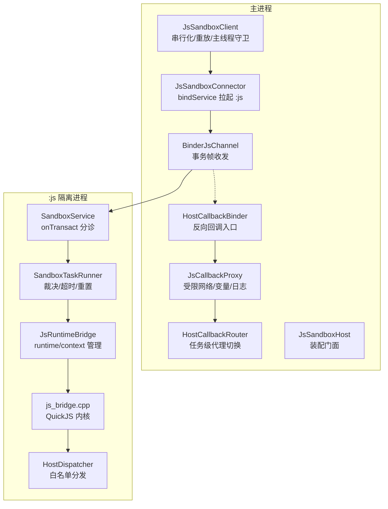
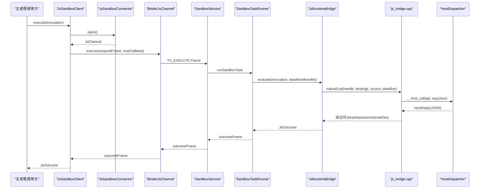
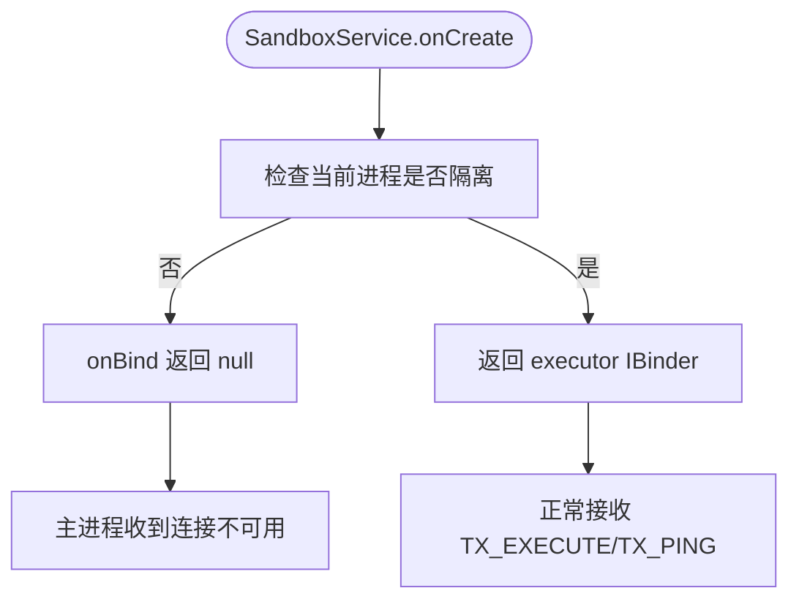
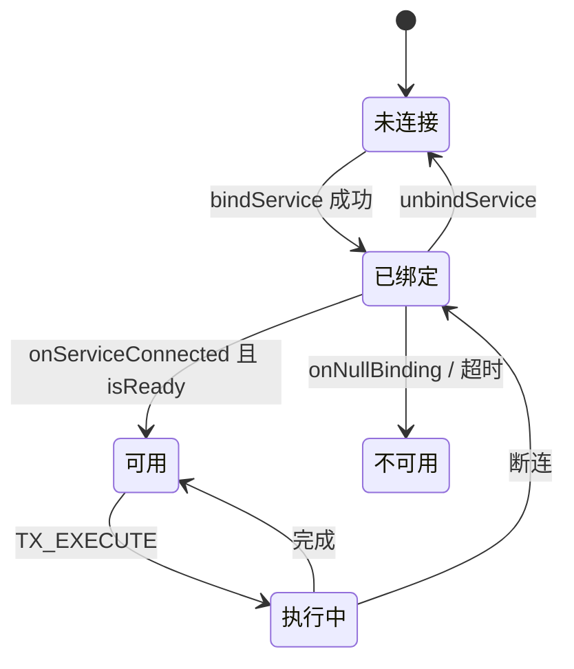
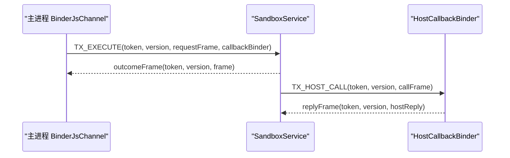
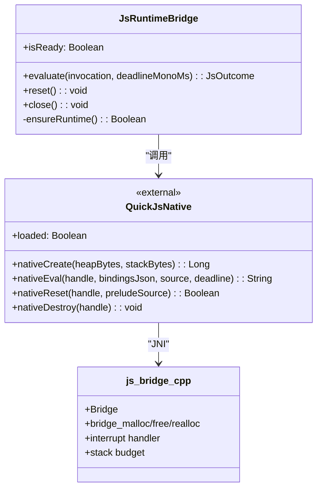
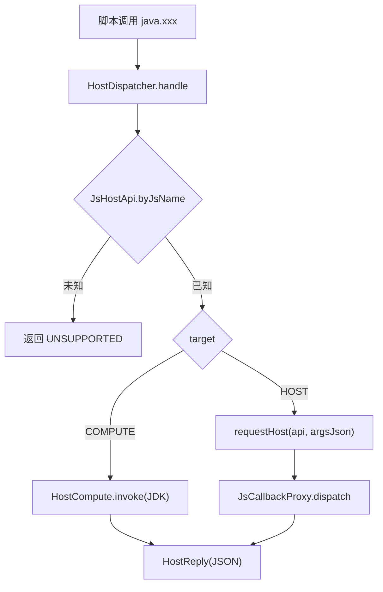
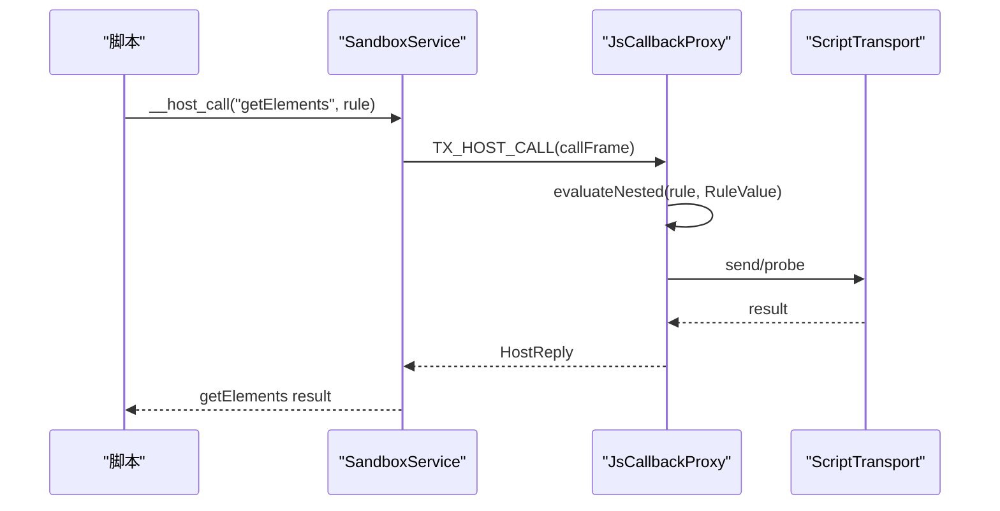
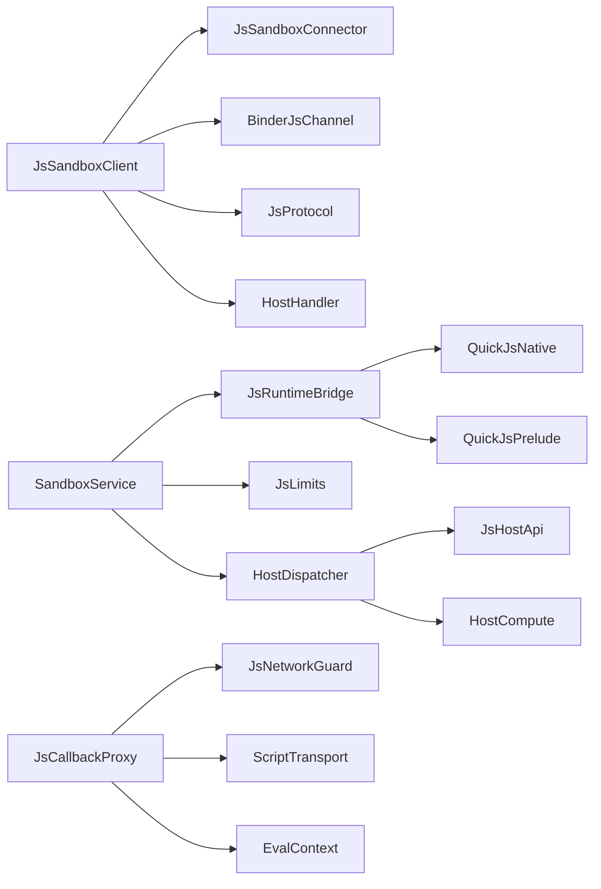

# 沙箱执行环境

<cite>
**本文引用的文件**   
- [不可信 JS 执行：零权限隔离进程 + 自集成 QuickJS](file://docs/adr/0028-untrusted-js-sandbox.md)
- [脚本书源 JS 沙箱执行器（Plan 3）实施计划](file://docs/superpowers/plans/2026-09-09-js-sandbox-executor.md)
- [js_bridge.cpp](file://lib_book_source/src/main/cpp/bridge/js_bridge.cpp)
- [SandboxProcess.kt](file://lib_book_source/src/main/java/com/ebook/source/sandbox/SandboxProcess.kt)
- [SandboxService.kt](file://lib_book_source/src/main/java/com/ebook/source/sandbox/SandboxService.kt)
- [BinderJsChannel.kt](file://lib_book_source/src/main/java/com/ebook/source/sandbox/BinderJsChannel.kt)
- [JsSandboxClient.kt](file://lib_book_source/src/main/java/com/ebook/source/sandbox/JsSandboxClient.kt)
- [JsSandboxConnector.kt](file://lib_book_source/src/main/java/com/ebook/source/sandbox/JsSandboxConnector.kt)
- [SandboxTaskRunner.kt](file://lib_book_source/src/main/java/com/ebook/source/sandbox/SandboxTaskRunner.kt)
- [JsRuntimeBridge.kt](file://lib_book_source/src/main/java/com/ebook/source/sandbox/JsRuntimeBridge.kt)
- [HostDispatcher.kt](file://lib_book_source/src/main/java/com/ebook/source/sandbox/HostDispatcher.kt)
- [JsCallbackProxy.kt](file://lib_book_source/src/main/java/com/ebook/source/sandbox/JsCallbackProxy.kt)
- [QuickJsPrelude.kt](file://lib_book_source/src/main/java/com/ebook/source/sandbox/QuickJsPrelude.kt)
- [JsLimits.kt](file://lib_book_source/src/main/java/com/ebook/source/sandbox/JsLimits.kt)
- [SandboxContract.kt](file://lib_book_source/src/main/java/com/ebook/source/sandbox/SandboxContract.kt)
- [JsProtocol.kt](file://lib_book_source/src/main/java/com/ebook/source/sandbox/JsProtocol.kt)
- [JsSandboxHost.kt](file://lib_book_source/src/main/java/com/ebook/source/sandbox/JsSandboxHost.kt)
</cite>

## 目录
1. [引言](#引言)
2. [项目结构](#项目结构)
3. [核心组件](#核心组件)
4. [架构总览](#架构总览)
5. [详细组件分析](#详细组件分析)
6. [依赖关系分析](#依赖关系分析)
7. [性能与安全约束](#性能与安全约束)
8. [故障排查指南](#故障排查指南)
9. [结论](#结论)

## 引言
本项目为 Android 小说阅读器引入「不可信 JavaScript 执行」能力，用于解析社区书源规则。安全设计采用「独立 Android 进程 + 零权限 isolatedProcess + 自集成 QuickJS C 内核 + Binder JSON 控制面 + 双向回调通道」，遵循 deny-by-default 原则，不依赖单一边界。主进程与脚本之间只暴露白名单 Host API；网络、文件、反射、JNI、Java/Android 大 API 默认不存在。

本文件面向开发者与运维者，说明引擎集成方式、进程隔离机制、安全边界、生命周期、通信协议、配置参数、监控指标与故障排查方法。

**章节来源**
- [不可信 JS 执行：零权限隔离进程 + 自集成 QuickJS:1-15](file://docs/adr/0028-untrusted-js-sandbox.md#L1-L15)

## 项目结构
沙箱相关代码集中在 `lib_book_source` 模块：
- `src/main/cpp/bridge/js_bridge.cpp`：唯一 C++ 桥接层，负责 QuickJS runtime/context 生命周期、内存/栈限制、中断器、分配器替换、描述符编解码。
- `src/main/java/com/ebook/source/sandbox/*`：Kotlin 侧协议、连接、运行时桥、宿主能力分发、回调代理、限制配置、契约常量等。
- `third_party/quickjs/*`：vendored QuickJS 源码，不改一行，仅作为静态库被桥接层使用。

**图表来源**
- [JsSandboxClient.kt:1-185](file://lib_book_source/src/main/java/com/ebook/source/sandbox/JsSandboxClient.kt#L1-L185)
- [JsSandboxConnector.kt:1-142](file://lib_book_source/src/main/java/com/ebook/source/sandbox/JsSandboxConnector.kt#L1-L142)
- [BinderJsChannel.kt:1-132](file://lib_book_source/src/main/java/com/ebook/source/sandbox/BinderJsChannel.kt#L1-L132)
- [SandboxService.kt:1-200](file://lib_book_source/src/main/java/com/ebook/source/sandbox/SandboxService.kt#L1-L200)
- [SandboxTaskRunner.kt:1-69](file://lib_book_source/src/main/java/com/ebook/source/sandbox/SandboxTaskRunner.kt#L1-L69)
- [JsRuntimeBridge.kt:1-113](file://lib_book_source/src/main/java/com/ebook/source/sandbox/JsRuntimeBridge.kt#L1-L113)
- [js_bridge.cpp:1-200](file://lib_book_source/src/main/cpp/bridge/js_bridge.cpp#L1-L200)
- [HostDispatcher.kt:1-74](file://lib_book_source/src/main/java/com/ebook/source/sandbox/HostDispatcher.kt#L1-L74)

**章节来源**
- [脚本书源 JS 沙箱执行器（Plan 3）实施计划:1-60](file://docs/superpowers/plans/2026-09-09-js-sandbox-executor.md#L1-L60)

## 核心组件
- **隔离判据与进程门**：`SandboxProcess.isInIsolatedProcess` 提供统一判据，服务在 `onBind` 再次校验，非隔离则返回 null，让主进程走“不可用”路径。
- **服务与控制面**：`SandboxService` 实现手写 `Binder.onTransact`，按 `SandboxContract` 分诊 `TX_EXECUTE` 与 `TX_PING`，并中继 host 回调到主进程。
- **客户端与连接**：`JsSandboxClient` 是主进程唯一执行入口，负责截止日期计算、主线程守卫、串行锁、断连重放；`JsSandboxConnector` 通过 `bindService` 拉起 `:js` 进程。
- **通道与回调**：`BinderJsChannel` 封装一次事务一帧；`HostCallbackBinder` 处理执行器 → 主进程的 host 回调。
- **运行时桥**：`JsRuntimeBridge` 管理 QuickJS runtime/context，设置堆/栈/阻塞开关，调用原生 `nativeEval`，并按描述符映射状态。
- **宿主能力分发**：`HostDispatcher` 在 `:js` 进程内按白名单表分发纯计算或回主进程回调；`JsCallbackProxy` 在主进程实现受限网络、变量存取、递归求值、日志。
- **预加载垫片**：`QuickJsPrelude` 定义脚本可见的 `java.*`、`source`、`book`、`chapter` 对象面与白名单注册逻辑。
- **限制与契约**：`JsLimits` 集中四项资源限制与报文上限；`SandboxContract` 定义接口 token、协议版本、事务码。

**章节来源**
- [SandboxProcess.kt:1-28](file://lib_book_source/src/main/java/com/ebook/source/sandbox/SandboxProcess.kt#L1-L28)
- [SandboxService.kt:1-200](file://lib_book_source/src/main/java/com/ebook/source/sandbox/SandboxService.kt#L1-L200)
- [JsSandboxClient.kt:1-185](file://lib_book_source/src/main/java/com/ebook/source/sandbox/JsSandboxClient.kt#L1-L185)
- [JsSandboxConnector.kt:1-142](file://lib_book_source/src/main/java/com/ebook/source/sandbox/JsSandboxConnector.kt#L1-L142)
- [BinderJsChannel.kt:1-132](file://lib_book_source/src/main/java/com/ebook/source/sandbox/BinderJsChannel.kt#L1-L132)
- [JsRuntimeBridge.kt:1-113](file://lib_book_source/src/main/java/com/ebook/source/sandbox/JsRuntimeBridge.kt#L1-L113)
- [HostDispatcher.kt:1-74](file://lib_book_source/src/main/java/com/ebook/source/sandbox/HostDispatcher.kt#L1-L74)
- [JsCallbackProxy.kt:1-200](file://lib_book_source/src/main/java/com/ebook/source/sandbox/JsCallbackProxy.kt#L1-L200)
- [QuickJsPrelude.kt:1-200](file://lib_book_source/src/main/java/com/ebook/source/sandbox/QuickJsPrelude.kt#L1-L200)
- [JsLimits.kt:1-58](file://lib_book_source/src/main/java/com/ebook/source/sandbox/JsLimits.kt#L1-L58)
- [SandboxContract.kt:1-47](file://lib_book_source/src/main/java/com/ebook/source/sandbox/SandboxContract.kt#L1-L47)

## 架构总览
系统分为三层：
- **内核层**：vendored QuickJS，不改源码，提供 JS 解释执行。
- **桥接层**：C++ `js_bridge.cpp`，唯一 native 文件，负责 runtime/context、限值开关、中断器、分配器替换、结果描述符。
- **协议与能力层**：Kotlin 侧帧编解码、白名单表、受限网络代理、递归求值回调。

**图表来源**
- [JsSandboxClient.kt:1-185](file://lib_book_source/src/main/java/com/ebook/source/sandbox/JsSandboxClient.kt#L1-L185)
- [JsSandboxConnector.kt:1-142](file://lib_book_source/src/main/java/com/ebook/source/sandbox/JsSandboxConnector.kt#L1-L142)
- [BinderJsChannel.kt:1-132](file://lib_book_source/src/main/java/com/ebook/source/sandbox/BinderJsChannel.kt#L1-L132)
- [SandboxService.kt:1-200](file://lib_book_source/src/main/java/com/ebook/source/sandbox/SandboxService.kt#L1-L200)
- [SandboxTaskRunner.kt:1-69](file://lib_book_source/src/main/java/com/ebook/source/sandbox/SandboxTaskRunner.kt#L1-L69)
- [JsRuntimeBridge.kt:1-113](file://lib_book_source/src/main/java/com/ebook/source/sandbox/JsRuntimeBridge.kt#L1-L113)
- [js_bridge.cpp:1-200](file://lib_book_source/src/main/cpp/bridge/js_bridge.cpp#L1-L200)
- [HostDispatcher.kt:1-74](file://lib_book_source/src/main/java/com/ebook/source/sandbox/HostDispatcher.kt#L1-L74)

## 详细组件分析

### 进程隔离与安全边界
- 清单声明 `android:isolatedProcess="true"`，使执行器运行在独立 uid 与受限 SELinux 域下，默认无网络/文件/App 数据访问能力。
- `SandboxService.onBind` 二次校验 `SandboxProcess.isInIsolatedProcess`，若非隔离直接返回 null，主进程无法拿到 binder，最终表现为“沙箱不可用”。
- 主进程永不加载 `.so`，引擎与不可信代码只存在于执行器进程；`.so` 加载失败时返回 UNAVAILABLE，崩溃不传染主进程。

**图表来源**
- [SandboxProcess.kt:1-28](file://lib_book_source/src/main/java/com/ebook/source/sandbox/SandboxProcess.kt#L1-L28)
- [SandboxService.kt:1-200](file://lib_book_source/src/main/java/com/ebook/source/sandbox/SandboxService.kt#L1-L200)

**章节来源**
- [不可信 JS 执行：零权限隔离进程 + 自集成 QuickJS:16-40](file://docs/adr/0028-untrusted-js-sandbox.md#L16-L40)
- [SandboxProcess.kt:1-28](file://lib_book_source/src/main/java/com/ebook/source/sandbox/SandboxProcess.kt#L1-L28)
- [SandboxService.kt:1-200](file://lib_book_source/src/main/java/com/ebook/source/sandbox/SandboxService.kt#L1-L200)

### 生命周期管理
- **启动**：主进程通过 `JsSandboxConnector.bindService` 拉起 `:js` 进程，等待 `onServiceConnected` 或 `onNullBinding`，并在 `bindTimeoutMs` 内收口。
- **初始化**：`SandboxService.onCreate` 安装 `HostDispatcher.relay`；`JsRuntimeBridge.ensureRuntime` 创建 `JSRuntime` 并装载垫片。
- **执行**：`SandboxTaskRunner.runSandboxTask` 先重置任务边界，再调用 `JsRuntimeBridge.evaluate`，由 `js_bridge.cpp` 设置中断器、分配器、上下文后执行脚本。
- **销毁**：`SandboxService.onDestroy` 清理 relay、ThreadLocal、销毁 bridge；连接器在通道关闭时解绑 service。

**图表来源**
- [JsSandboxConnector.kt:1-142](file://lib_book_source/src/main/java/com/ebook/source/sandbox/JsSandboxConnector.kt#L1-L142)
- [SandboxService.kt:1-200](file://lib_book_source/src/main/java/com/ebook/source/sandbox/SandboxService.kt#L1-L200)
- [JsRuntimeBridge.kt:1-113](file://lib_book_source/src/main/java/com/ebook/source/sandbox/JsRuntimeBridge.kt#L1-L113)

**章节来源**
- [JsSandboxConnector.kt:1-142](file://lib_book_source/src/main/java/com/ebook/source/sandbox/JsSandboxConnector.kt#L1-L142)
- [SandboxService.kt:1-200](file://lib_book_source/src/main/java/com/ebook/source/sandbox/SandboxService.kt#L1-L200)
- [JsRuntimeBridge.kt:1-113](file://lib_book_source/src/main/java/com/ebook/source/sandbox/JsRuntimeBridge.kt#L1-L113)

### 主进程与沙箱通信协议
- **控制面**：手写 `Binder.onTransact`，不使用 AIDL，避免生成桩隐藏细节。
- **接口标识与版本**：`SandboxContract.INTERFACE_TOKEN` 与 `PROTOCOL_VERSION` 先校验，再读帧体。
- **事务码**：
  - `TX_EXECUTE=1`：请求帧含 mode/source/bindings/deadline，附带反向回调 binder。
  - `TX_PING=2`：轻量探活，只返回 ready 位。
  - 反向 `TX_HOST_CALL=1`：执行器 → 主进程回调，携带 callFrame。
- **序列化**：请求/响应均为 JSON 字符串，由 `JsProtocol` 编解码；大小先于 JSON 解析判断，防止超限文本进入主进程。
- **错误传播**：异常不会从执行器抛到主进程；所有失败都转为可命名的 `JsStatus` 与 `error` 消息。

**图表来源**
- [SandboxContract.kt:1-47](file://lib_book_source/src/main/java/com/ebook/source/sandbox/SandboxContract.kt#L1-L47)
- [BinderJsChannel.kt:1-132](file://lib_book_source/src/main/java/com/ebook/source/sandbox/BinderJsChannel.kt#L1-L132)
- [SandboxService.kt:1-200](file://lib_book_source/src/main/java/com/ebook/source/sandbox/SandboxService.kt#L1-L200)
- [JsProtocol.kt:1-200](file://lib_book_source/src/main/java/com/ebook/source/sandbox/JsProtocol.kt#L1-L200)

**章节来源**
- [SandboxContract.kt:1-47](file://lib_book_source/src/main/java/com/ebook/source/sandbox/SandboxContract.kt#L1-L47)
- [BinderJsChannel.kt:1-132](file://lib_book_source/src/main/java/com/ebook/source/sandbox/BinderJsChannel.kt#L1-L132)
- [JsProtocol.kt:1-200](file://lib_book_source/src/main/java/com/ebook/source/sandbox/JsProtocol.kt#L1-L200)

### QuickJS 引擎集成
- 引擎源码 vendored 在 `third_party/quickjs`，不修改源码。
- 唯一 C++ 文件 `js_bridge.cpp` 实现：
  - 替换分配器以记录分配拒绝次数，用于区分“内存超限”。
  - 设置 `JS_SetMemoryLimit`、`JS_SetMaxStackSize`、`JS_SetCanBlock(rt, 0)`。
  - 使用 `JS_SetInterruptHandler` 配合单调时钟比对绝对期限，打断解释器轮询点。
  - 每次任务重建 `JSContext`，复用 `JSRuntime`。
- Kotlin 侧通过 `QuickJsNative.external fun` 调用原生函数；`HostDispatcher.handle` 由 C++ 通过类名+方法名字符串查找。

**图表来源**
- [JsRuntimeBridge.kt:1-113](file://lib_book_source/src/main/java/com/ebook/source/sandbox/JsRuntimeBridge.kt#L1-L113)
- [js_bridge.cpp:1-200](file://lib_book_source/src/main/cpp/bridge/js_bridge.cpp#L1-L200)

**章节来源**
- [脚本书源 JS 沙箱执行器（Plan 3）实施计划:60-140](file://docs/superpowers/plans/2026-09-09-js-sandbox-executor.md#L60-L140)
- [JsRuntimeBridge.kt:1-113](file://lib_book_source/src/main/java/com/ebook/source/sandbox/JsRuntimeBridge.kt#L1-L113)
- [js_bridge.cpp:1-200](file://lib_book_source/src/main/cpp/bridge/js_bridge.cpp#L1-L200)

### 白名单与 Host API
- 白名单由 `JsHostApi` 表与 `QuickJsPrelude` 共同定义；`HostDispatcher` 第二次校验 api 名称与元数。
- 纯计算能力（md5/base64/aes/hex/time 等）在 `:js` 进程内通过 JNI 调用 Kotlin/JDK 实现，零 IPC。
- 网络类能力一律经主进程受限代理：仅允许 http(s)、拒绝私网地址、大小/超时/限流上限、按源导出 host 白名单、永不附加凭证。
- 不支持浏览器自动化、登录流程、验证码族、持久变量、旧 Java 类桥；命中即返回拒绝消息。

**图表来源**
- [HostDispatcher.kt:1-74](file://lib_book_source/src/main/java/com/ebook/source/sandbox/HostDispatcher.kt#L1-L74)
- [JsCallbackProxy.kt:1-200](file://lib_book_source/src/main/java/com/ebook/source/sandbox/JsCallbackProxy.kt#L1-L200)
- [QuickJsPrelude.kt:1-200](file://lib_book_source/src/main/java/com/ebook/source/sandbox/QuickJsPrelude.kt#L1-L200)

**章节来源**
- [HostDispatcher.kt:1-74](file://lib_book_source/src/main/java/com/ebook/source/sandbox/HostDispatcher.kt#L1-L74)
- [JsCallbackProxy.kt:1-200](file://lib_book_source/src/main/java/com/ebook/source/sandbox/JsCallbackProxy.kt#L1-L200)
- [QuickJsPrelude.kt:1-200](file://lib_book_source/src/main/java/com/ebook/source/sandbox/QuickJsPrelude.kt#L1-L200)

### 双向回调与嵌套求值
- 执行器在执行过程中可通过反向 binder 调用主进程，两类用途：
  - 递归规则求值：脚本把规则串交回解释器，输入是当前页面。
  - 受限网络代理：ajax/load/post/responseCode/setContent 等。
- 嵌套求值不再执行 JS，以避免打乱按帧记账的超时与堆限；嵌套层若需要 JS，会返回“需脚本沙箱执行器”的类型化异常。
- 变量表跨嵌套按引用共享，页面基准按快照传递。

**图表来源**
- [JsCallbackProxy.kt:1-200](file://lib_book_source/src/main/java/com/ebook/source/sandbox/JsCallbackProxy.kt#L1-L200)
- [SandboxService.kt:1-200](file://lib_book_source/src/main/java/com/ebook/source/sandbox/SandboxService.kt#L1-L200)

**章节来源**
- [JsCallbackProxy.kt:1-200](file://lib_book_source/src/main/java/com/ebook/source/sandbox/JsCallbackProxy.kt#L1-L200)
- [脚本书源 JS 沙箱执行器（Plan 3）实施计划:140-220](file://docs/superpowers/plans/2026-09-09-js-sandbox-executor.md#L140-L220)

## 依赖关系分析
- `JsSandboxClient` 依赖 `JsSandboxConnector`、`BinderJsChannel`、`JsProtocol`、`HostHandler`。
- `SandboxService` 依赖 `JsRuntimeBridge`、`JsLimits`、`HostDispatcher`。
- `JsRuntimeBridge` 依赖 `QuickJsNative`、`QuickJsPrelude`。
- `HostDispatcher` 依赖 `JsHostApi`、`HostCompute`。
- `JsCallbackProxy` 依赖 `JsNetworkGuard`、`ScriptTransport`、`EvalContext`。

**图表来源**
- [JsSandboxClient.kt:1-185](file://lib_book_source/src/main/java/com/ebook/source/sandbox/JsSandboxClient.kt#L1-L185)
- [SandboxService.kt:1-200](file://lib_book_source/src/main/java/com/ebook/source/sandbox/SandboxService.kt#L1-L200)
- [JsRuntimeBridge.kt:1-113](file://lib_book_source/src/main/java/com/ebook/source/sandbox/JsRuntimeBridge.kt#L1-L113)
- [HostDispatcher.kt:1-74](file://lib_book_source/src/main/java/com/ebook/source/sandbox/HostDispatcher.kt#L1-L74)
- [JsCallbackProxy.kt:1-200](file://lib_book_source/src/main/java/com/ebook/source/sandbox/JsCallbackProxy.kt#L1-L200)

**章节来源**
- [JsSandboxClient.kt:1-185](file://lib_book_source/src/main/java/com/ebook/source/sandbox/JsSandboxClient.kt#L1-L185)
- [SandboxService.kt:1-200](file://lib_book_source/src/main/java/com/ebook/source/sandbox/SandboxService.kt#L1-L200)
- [JsRuntimeBridge.kt:1-113](file://lib_book_source/src/main/java/com/ebook/source/sandbox/JsRuntimeBridge.kt#L1-L113)
- [HostDispatcher.kt:1-74](file://lib_book_source/src/main/java/com/ebook/source/sandbox/HostDispatcher.kt#L1-L74)
- [JsCallbackProxy.kt:1-200](file://lib_book_source/src/main/java/com/ebook/source/sandbox/JsCallbackProxy.kt#L1-L200)

## 性能与安全约束

### 安全约束
- **进程隔离**：`android:isolatedProcess="true"`，deny-by-default，无 socket/文件/App 数据。
- **能力白名单**：仅 ECMAScript 标准能力 + 显式注册的 Host API；其他能力返回 UNSUPPORTED。
- **阻塞原语禁用**：`JS_SetCanBlock(rt, 0)` 禁止 `Atomics.wait`。
- **内存限制**：`JS_SetMemoryLimit`，分配器替换记录拒绝次数，用于准确归类 OOM。
- **栈限制**：`JS_SetMaxStackSize`，并按线程剩余栈再做天花板修正。
- **CPU 时间限制**：`JS_SetInterruptHandler` 结合单调时钟比对绝对期限，打断解释器轮询点；微任务队列有最大 pending jobs 限制。
- **报文大小限制**：请求帧、响应帧、host 回复均受 `maxRequestBytes`/`maxOutcomeBytes`/`maxHostReplyBytes` 约束，基于 binder 事务缓冲估算。
- **主线程保护**：主进程不允许从主线程调沙箱，避免 ANR 与双向死锁。
- **单帧串行**：`JsSandboxClient.inFlight` 保证同一时刻只有一帧在飞，确保字节限额有效。

**章节来源**
- [JsLimits.kt:1-58](file://lib_book_source/src/main/java/com/ebook/source/sandbox/JsLimits.kt#L1-L58)
- [JsSandboxClient.kt:1-185](file://lib_book_source/src/main/java/com/ebook/source/sandbox/JsSandboxClient.kt#L1-L185)
- [js_bridge.cpp:1-200](file://lib_book_source/src/main/cpp/bridge/js_bridge.cpp#L1-L200)
- [不可信 JS 执行：零权限隔离进程 + 自集成 QuickJS:40-75](file://docs/adr/0028-untrusted-js-sandbox.md#L40-L75)

### 配置与调优参数
- `wallClockMs`：单次执行挂钟上限，默认 5 秒。
- `heapBytes`：QuickJS 堆上限，默认 8 MB。
- `stackBytes`：JS 栈上限，默认 1 MB，语义为天花板。
- `maxRequestBytes`：请求帧上限，默认 900 KB。
- `maxOutcomeBytes`：响应帧上限，默认 900 KB。
- `maxHostReplyBytes`：host 回复上限，默认 900 KB。
- `maxCallbackDepth`：回调重入深度上限，默认 8。
- `bindTimeoutMs`：绑定连接超时，默认 2 秒。
- `maxRequestsPerTask`：单任务网络代理请求次数上限，默认 40。

**章节来源**
- [JsLimits.kt:1-58](file://lib_book_source/src/main/java/com/ebook/source/sandbox/JsLimits.kt#L1-L58)

### 性能监控指标
建议采集以下指标用于诊断与优化：
- **连接成功率**：`bindService` 成功比例、`onServiceConnected` 到达率。
- **可用性**：`isReady` 探针命中率，区分“.so 未加载”和“服务不存在”。
- **执行耗时分布**：从提交 deadline 到 outcome 返回的时间，区分排队等待与实际执行。
- **失败分类**：TIMEOUT/MEMORY/STACK/SYNTAX/RUNTIME/UNSUPPORTED_API/TOO_LARGE/UNAVAILABLE 占比。
- **报文大小分布**：request/outcome/hostReply 长度直方图，观察 TOO_LARGE 热点。
- **host 回调次数与深度**：每任务的 ajax/load/post 次数、嵌套深度。
- **进程存活率**：`:js` 进程崩溃/回收频率，以及自动重连次数。

[本节为通用监控建议，不直接分析具体文件]

## 故障排查指南

### 常见问题定位
- **沙箱不可用**：
  - 检查 `SandboxProcess.isInIsolatedProcess` 是否为 true。
  - 检查 `SandboxService.onBind` 是否返回 null。
  - 检查 `bindTimeoutMs` 是否过短导致冷启动连接超时。
- **协议不合**：
  - 检查 `SandboxContract.PROTOCOL_VERSION` 两侧是否一致。
  - 检查 `INTERFACE_TOKEN` 与 `CALLBACK_TOKEN` 是否传错 binder。
- **内存超限**：
  - 检查 `heapBytes` 是否过小；确认分配器拒绝标志是否触发。
  - 注意 OOM 时异常 message 可能为空，分类依赖分配器证据。
- **栈溢出**：
  - 检查 `stackBytes` 与线程实际栈空间；深递归可能在 native 栈撞穿后才崩溃。
- **超时**：
  - 确认 deadline 使用单调时钟；host 回调阻塞不会被子进程中断器打断，需主进程侧兜超时。
- **响应过大**：
  - 检查 `maxOutcomeBytes`/`maxHostReplyBytes`；过大正文应在主进程侧拒绝而非透传。
- **主机回调失败**：
  - 检查 `HostDispatcher.relay` 是否安装；检查 `JsCallbackProxy` 当前任务是否存在。
  - 检查网络守卫是否拒绝 scheme/私网地址/超出 host 白名单。

**章节来源**
- [SandboxProcess.kt:1-28](file://lib_book_source/src/main/java/com/ebook/source/sandbox/SandboxProcess.kt#L1-L28)
- [SandboxService.kt:1-200](file://lib_book_source/src/main/java/com/ebook/source/sandbox/SandboxService.kt#L1-L200)
- [JsSandboxConnector.kt:1-142](file://lib_book_source/src/main/java/com/ebook/source/sandbox/JsSandboxConnector.kt#L1-L142)
- [JsProtocol.kt:1-200](file://lib_book_source/src/main/java/com/ebook/source/sandbox/JsProtocol.kt#L1-L200)
- [js_bridge.cpp:1-200](file://lib_book_source/src/main/cpp/bridge/js_bridge.cpp#L1-L200)
- [HostDispatcher.kt:1-74](file://lib_book_source/src/main/java/com/ebook/source/sandbox/HostDispatcher.kt#L1-L74)
- [JsCallbackProxy.kt:1-200](file://lib_book_source/src/main/java/com/ebook/source/sandbox/JsCallbackProxy.kt#L1-L200)

### 调试建议
- 使用 `TX_PING` 探测执行器就绪，区分“服务不在”和“.so 未加载”。
- 启用日志收集：主进程侧记录断连原因、协议版本不合、host 代理失败；执行器侧记录分配拒绝与中断次数。
- 对过大响应在本地提前截断，避免 `TransactionTooLargeException` 掩盖业务错误。
- 对频繁超时源，优先调整 `wallClockMs` 与 host 代理超时，而不是盲目扩大堆/栈。
- 对不稳定机型，保留退化路径：`.so` 加载失败回 UNAVAILABLE，不要退化为普通 `:js` 进程。

**章节来源**
- [SandboxService.kt:1-200](file://lib_book_source/src/main/java/com/ebook/source/sandbox/SandboxService.kt#L1-L200)
- [JsSandboxClient.kt:1-185](file://lib_book_source/src/main/java/com/ebook/source/sandbox/JsSandboxClient.kt#L1-L185)
- [BinderJsChannel.kt:1-132](file://lib_book_source/src/main/java/com/ebook/source/sandbox/BinderJsChannel.kt#L1-L132)

## 结论
该沙箱执行环境通过 isolatedProcess 零权限隔离、QuickJS 自集成内核、Binder JSON 控制面与双向回调通道，构建了多层防御体系。安全关键路径包括进程隔离校验、白名单分发、报文大小闸门、内存/栈/CPU 时限、主线程保护与单帧串行。生产部署应关注连接可用性、失败分类、报文大小与 host 回调配额，并通过可调参数 `JsLimits` 进行容量规划与压测验证。遇到故障时，优先从协议一致性、隔离状态、.so 加载与网络守卫四个维度入手。

[本节为总结性内容，不直接分析具体文件]