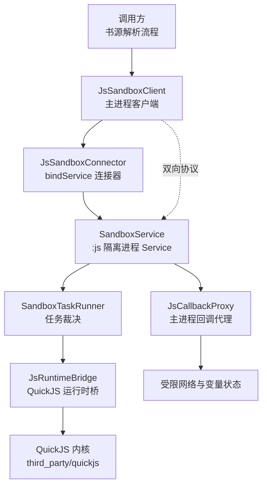
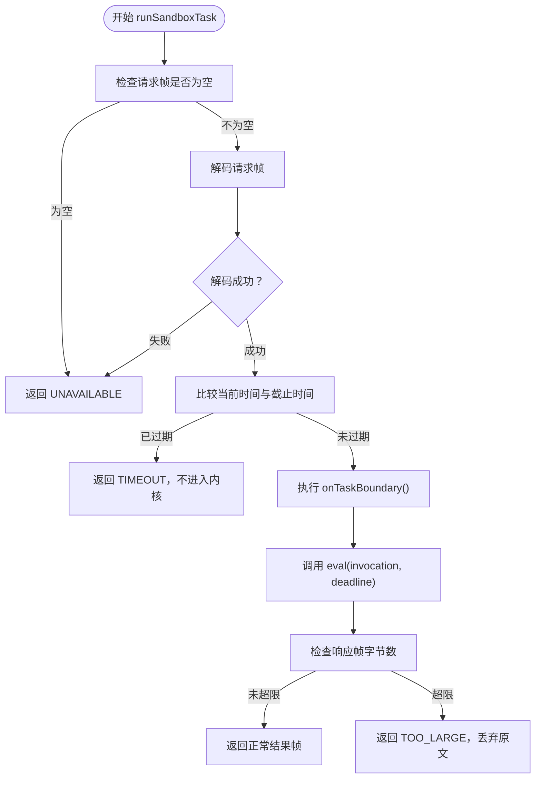
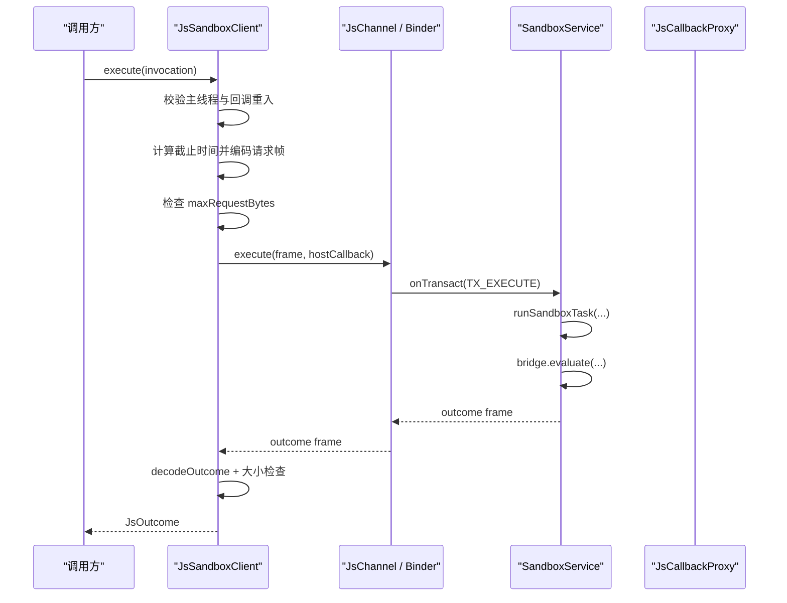
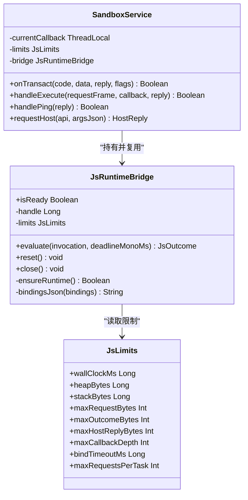
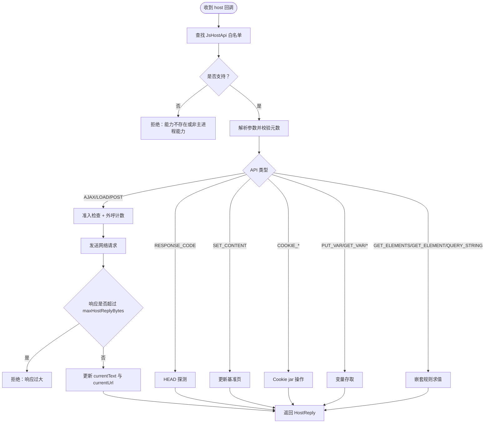
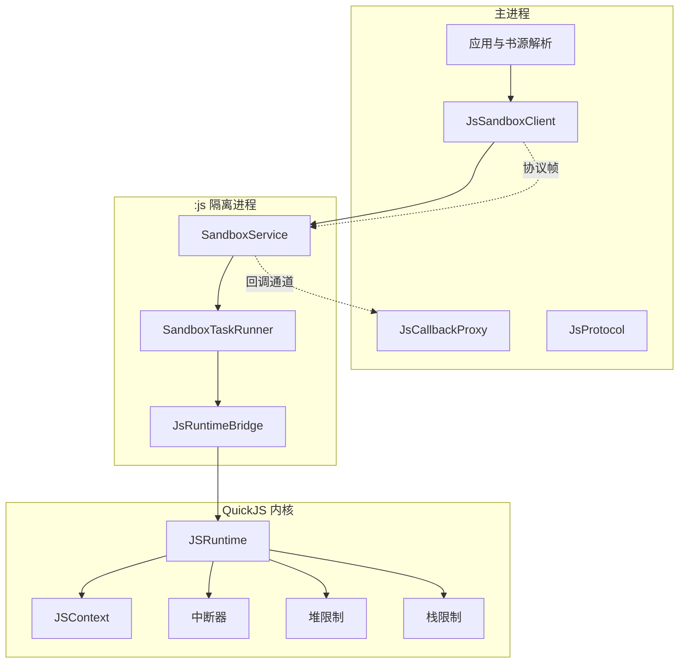
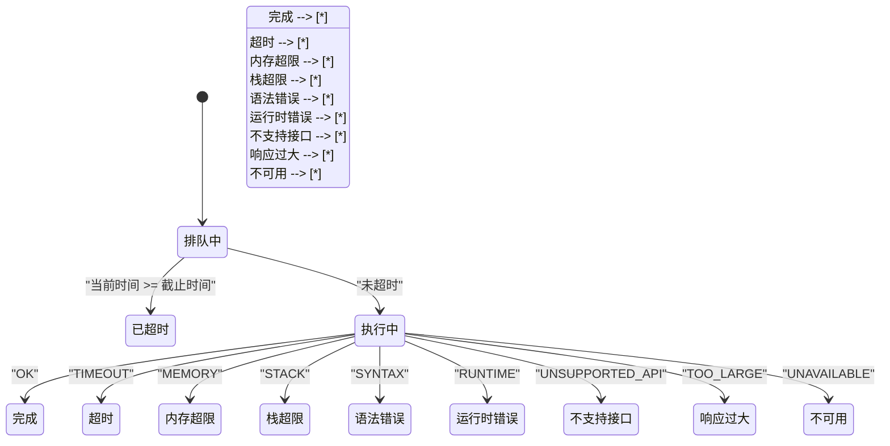
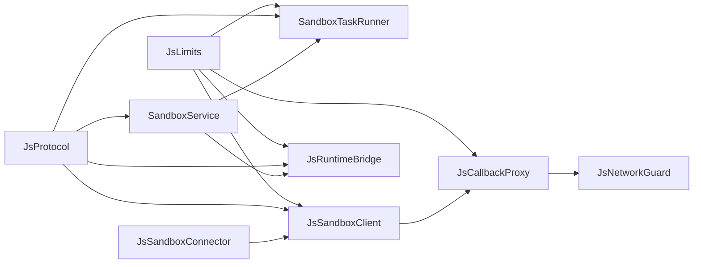
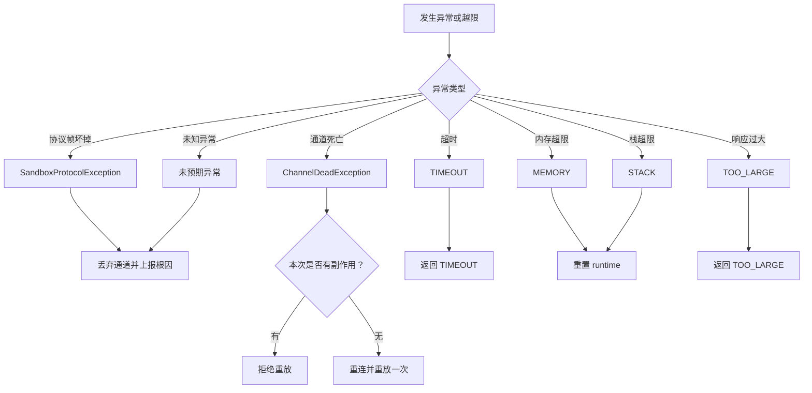

# 资源限制与监控

<cite>
**本文引用的文件**   
- [JsLimits.kt](file://lib_book_source/src/main/java/com/ebook/source/sandbox/JsLimits.kt)
- [SandboxTaskRunner.kt](file://lib_book_source/src/main/java/com/ebook/source/sandbox/SandboxTaskRunner.kt)
- [JsSandboxClient.kt](file://lib_book_source/src/main/java/com/ebook/source/sandbox/JsSandboxClient.kt)
- [SandboxService.kt](file://lib_book_source/src/main/java/com/ebook/source/sandbox/SandboxService.kt)
- [JsProtocol.kt](file://lib_book_source/src/main/java/com/ebook/source/sandbox/JsProtocol.kt)
- [JsRuntimeBridge.kt](file://lib_book_source/src/main/java/com/ebook/source/sandbox/JsRuntimeBridge.kt)
- [JsSandboxConnector.kt](file://lib_book_source/src/main/java/com/ebook/source/sandbox/JsSandboxConnector.kt)
- [JsCallbackProxy.kt](file://lib_book_source/src/main/java/com/ebook/source/sandbox/JsCallbackProxy.kt)
- [SandboxTaskRunnerTest.kt](file://lib_book_source/src/test/java/com/ebook/source/sandbox/SandboxTaskRunnerTest.kt)
- [JsSandboxClientTest.kt](file://lib_book_source/src/test/java/com/ebook/source/sandbox/JsSandboxClientTest.kt)
- [0028-untrusted-js-sandbox.md](file://docs/adr/0028-untrusted-js-sandbox.md)
- [2026-09-09-js-sandbox-executor.md](file://docs/superpowers/plans/2026-09-09-js-sandbox-executor.md)
</cite>

## 目录

1. [引言](#引言)
2. [项目结构](#项目结构)
3. [核心组件](#核心组件)
4. [架构总览](#架构总览)
5. [详细组件分析](#详细组件分析)
6. [依赖关系分析](#依赖关系分析)
7. [性能与监控](#性能与监控)
8. [资源限制配置说明](#资源限制配置说明)
9. [告警机制](#告警机制)
10. [异常处理与降级](#异常处理与降级)
11. [性能调优指南](#性能调优指南)
12. [故障排查](#故障排查)
13. [结论](#结论)

## 引言

本仓库的脚本执行能力围绕一个不可信的 JavaScript 沙箱展开：社区书源可以嵌入 JS 代码，但这些代码必须运行在独立的 Android 隔离进程中，由自集成的 QuickJS 内核执行。项目的安全与稳定性关键不在“能不能跑脚本”，而在“脚本能占用多少时间、堆内存、栈空间、网络请求和进程间通信缓冲”。

资源限制与监控体系由五个层次组成：

- **参数层**：`JsLimits` 集中定义所有可调数值。
- **调度层**：`SandboxTaskRunner` 负责一次事务的准入、超时判断、任务边界清理和回帧大小闸门。
- **客户端层**：`JsSandboxClient` 控制跨进程调用串行化、主线程保护、断连重放和回调重入保护。
- **执行器层**：`SandboxService` + `JsRuntimeBridge` 管理 QuickJS runtime、context、中断器和堆/栈限制。
- **回调与网络层**：`JsCallbackProxy` 实现受限网络代理、递归规则求值、变量存取和外呼限流。

本文重点记录这些层次如何协作，而不是重复介绍 UI、数据库或普通业务模块。

## 项目结构

沙箱相关的主要源码集中在 `lib_book_source` 模块的 `sandbox` 包中；QuickJS 引擎以 vendored 形式放在 `third_party/quickjs`；C++ 桥接层位于 `lib_book_source/src/main/cpp/bridge/js_bridge.cpp`；决策与设计背景在 `docs/adr/0028-untrusted-js-sandbox.md` 和实施计划 `docs/superpowers/plans/2026-09-09-js-sandbox-executor.md` 中给出。

**图示来源**
- [JsSandboxClient.kt:1-185](file://lib_book_source/src/main/java/com/ebook/source/sandbox/JsSandboxClient.kt#L1-L185)
- [JsSandboxConnector.kt:1-142](file://lib_book_source/src/main/java/com/ebook/source/sandbox/JsSandboxConnector.kt#L1-L142)
- [SandboxService.kt:1-210](file://lib_book_source/src/main/java/com/ebook/source/sandbox/SandboxService.kt#L1-L210)
- [SandboxTaskRunner.kt:1-69](file://lib_book_source/src/main/java/com/ebook/source/sandbox/SandboxTaskRunner.kt#L1-L69)
- [JsRuntimeBridge.kt:1-113](file://lib_book_source/src/main/java/com/ebook/source/sandbox/JsRuntimeBridge.kt#L1-L113)
- [JsCallbackProxy.kt:1-506](file://lib_book_source/src/main/java/com/ebook/source/sandbox/JsCallbackProxy.kt#L1-L506)

**章节来源**
- [0028-untrusted-js-sandbox.md:1-47](file://docs/adr/0028-untrusted-js-sandbox.md#L1-L47)
- [2026-09-09-js-sandbox-executor.md:1-158](file://docs/superpowers/plans/2026-09-09-js-sandbox-executor.md#L1-L158)

## 核心组件

### JsLimits：资源限制的单一事实来源

`JsLimits` 是一个数据类，承担以下职责：

- 把挂钟超时、堆上限、栈上限、报文上限、绑定超时、外呼次数上限、回调深度等全部参数收敛到一个对象。
- 明确每个数字要防的攻击面：`wallClockMs` 防死循环，`heapBytes` 防指数分配，`stackBytes` 防无限递归，`maxRequestBytes/maxOutcomeBytes/maxHostReplyBytes` 防 binder 事务缓冲被撑爆。
- 作为跨进程、跨组件共享的配置入口：客户端、执行器、回调代理都从同一份默认值出发。

当前默认值体现的设计取舍是：**单次脚本执行不超过 5 秒，堆上限 8 MB，JS 栈上限 1 MB，请求/响应/主机回调帧均不超过约 900 KB，单次任务最多 40 次外呼，回调嵌套最深 8 层，连接等待 2 秒**。

| 字段 | 类型 | 默认值 | 含义 | 主要风险 |
|---|---:|---:|---|---|
| `wallClockMs` | Long | 5000 | 单次执行的挂钟超时 | 死循环、无终止规则 |
| `heapBytes` | Long | 8388608 | QuickJS 堆上限 | 指数级字符串/数组分配 |
| `stackBytes` | Long | 1048576 | JS 栈上限 | 深递归、规则互相嵌套 |
| `maxRequestBytes` | Int | 900000 | 主进程发给执行器的请求帧上限 | binder 事务缓冲溢出 |
| `maxOutcomeBytes` | Int | 900000 | 执行器返回给主进程的响应帧上限 | binder 事务缓冲溢出 |
| `maxHostReplyBytes` | Int | 900000 | 主进程回调回复给脚本的单次上限 | binder 事务缓冲溢出 |
| `maxCallbackDepth` | Int | 8 | 嵌套规则求值的最大深度 | 规则套规则导致栈爆炸 |
| `bindTimeoutMs` | Long | 2000 | 绑定隔离进程并拿到 IBinder 的上限 | 冷启动阻塞 |
| `maxRequestsPerTask` | Int | 40 | 单任务网络代理请求次数上限 | `while(true)` 轮询网络 |

**章节来源**
- [JsLimits.kt:1-58](file://lib_book_source/src/main/java/com/ebook/source/sandbox/JsLimits.kt#L1-L58)

### SandboxTaskRunner：一次事务的裁决中心

`runSandboxTask` 不是完整调度器，而是一次沙箱事务的执行控制器。它接受四个抽象参数：请求帧、限制对象、单调时钟函数、求值函数、任务边界回调。

其核心流程是：

1. 请求帧为空时返回明确的 `UNAVAILABLE`。
2. 解码请求帧失败时返回可读的 `UNAVAILABLE`，避免 Binder 异常穿透。
3. 若当前时间已超过请求中的绝对截止时间，直接返回 `TIMEOUT`，不再进入内核。
4. 在执行前调用 `onTaskBoundary()`，确保上一个任务的残留不会污染下一次执行。
5. 调用 `eval` 执行脚本。
6. 对结果进行字节数检查，超限则返回 `TOO_LARGE`，并且不把原始超限文本送回主进程。

该实现的关键设计是：**“不进内核”比“进内核后失败”更重要**，因为队列里过期的任务如果继续执行，会抢占后续任务的时限。

**图示来源**
- [SandboxTaskRunner.kt:1-69](file://lib_book_source/src/main/java/com/ebook/source/sandbox/SandboxTaskRunner.kt#L1-L69)

**章节来源**
- [SandboxTaskRunner.kt:1-69](file://lib_book_source/src/main/java/com/ebook/source/sandbox/SandboxTaskRunner.kt#L1-L69)
- [SandboxTaskRunnerTest.kt:1-108](file://lib_book_source/src/test/java/com/ebook/source/sandbox/SandboxTaskRunnerTest.kt#L1-L108)

### JsSandboxClient：主进程侧唯一传输策略

`JsSandboxClient` 是调用方接触沙箱的唯一入口。它不负责业务逻辑，只做四件事：

- 计算跨进程可比的时间截止点。
- 决定是否在断连后重放。
- 中继 host 回调。
- 防止主线程阻塞和回调内重入。

它使用一把非重入锁 `inFlight` 串行化 `execute`，保证同一时刻只有一帧在飞。这个不变量非常重要，因为：

- 一个 QuickJS runtime 不是线程安全的。
- binder 自带线程池至多约 15 条线程，但并发并不等于安全。
- 900 KB 的请求帧上限前提是“同一时刻只有一个事务在占用 binder 缓冲”。

客户端还维护一个 `ThreadLocal` 深度计数器，用于检测“host 回调中再次发起沙箱执行”，这种路径会导致双向死锁。

**图示来源**
- [JsSandboxClient.kt:1-185](file://lib_book_source/src/main/java/com/ebook/source/sandbox/JsSandboxClient.kt#L1-L185)
- [SandboxService.kt:1-210](file://lib_book_source/src/main/java/com/ebook/source/sandbox/SandboxService.kt#L1-L210)

**章节来源**
- [JsSandboxClient.kt:1-185](file://lib_book_source/src/main/java/com/ebook/source/sandbox/JsSandboxClient.kt#L1-L185)
- [JsSandboxClientTest.kt:1-200](file://lib_book_source/src/test/java/com/ebook/source/sandbox/JsSandboxClientTest.kt#L1-L200)

### SandboxService 与 JsRuntimeBridge：执行器侧运行时

`SandboxService` 是 `:js` 隔离进程里的唯一组件。它很薄：读 Parcel、调用 `runSandboxTask`、写回 Parcel、中继 host 调用。真正的策略在 JVM 可测的 `SandboxTaskRunner` 中，真正的引擎集成在 `JsRuntimeBridge` 中。

`JsRuntimeBridge` 的职责包括：

- 懒创建 QuickJS runtime。
- 设置堆上限和栈上限。
- 预加载垫片（`QuickJsPrelude`）。
- 把宿主绑定序列化为 JSON 传给原生层。
- 把原生层描述符反序列化为 `JsStatus`。
- 在超时、内存超限、栈耗尽后重建 context。
- 提供 PING 探测能力。

**图示来源**
- [SandboxService.kt:1-210](file://lib_book_source/src/main/java/com/ebook/source/sandbox/SandboxService.kt#L1-L210)
- [JsRuntimeBridge.kt:1-113](file://lib_book_source/src/main/java/com/ebook/source/sandbox/JsRuntimeBridge.kt#L1-L113)
- [JsLimits.kt:1-58](file://lib_book_source/src/main/java/com/ebook/source/sandbox/JsLimits.kt#L1-L58)

**章节来源**
- [SandboxService.kt:1-210](file://lib_book_source/src/main/java/com/ebook/source/sandbox/SandboxService.kt#L1-L210)
- [JsRuntimeBridge.kt:1-113](file://lib_book_source/src/main/java/com/ebook/source/sandbox/JsRuntimeBridge.kt#L1-L113)

### JsCallbackProxy：主进程回调与网络代理

`JsCallbackProxy` 是主进程侧受理脚本回调的唯一入口。它封装了：

- 白名单 API 路由。
- 网络请求准入、限流、外呼和响应大小检查。
- 页面基准与 URL 状态更新。
- 变量读写。
- 嵌套规则求值深度控制。
- toast/log 日志输出。
- HEAD 探测。
- Cookie jar 接入。

它的实例作用域是“一次解析任务”，而不是进程级单例。这样可以保证：

- 外呼计数按任务清零。
- `java.put` 写入的变量只在本次任务可见。
- 当前页内容不会污染其他书。
- 回调深度按任务重置。

**图示来源**
- [JsCallbackProxy.kt:1-506](file://lib_book_source/src/main/java/com/ebook/source/sandbox/JsCallbackProxy.kt#L1-L506)

**章节来源**
- [JsCallbackProxy.kt:1-506](file://lib_book_source/src/main/java/com/ebook/source/sandbox/JsCallbackProxy.kt#L1-L506)

## 架构总览

沙箱执行环境采用三层防御：

1. **进程隔离**：执行器运行在 `isolatedProcess` 中，零权限，没有网络、文件和 App 数据。
2. **能力白名单**：脚本只能看到 ECMAScript 标准能力和显式注册的 Host API。
3. **资源限制**：时间、堆、栈、报文、回调深度、外呼次数全部有限制。

**图示来源**
- [0028-untrusted-js-sandbox.md:1-47](file://docs/adr/0028-untrusted-js-sandbox.md#L1-L47)
- [2026-09-09-js-sandbox-executor.md:1-158](file://docs/superpowers/plans/2026-09-09-js-sandbox-executor.md#L1-L158)
- [JsSandboxClient.kt:1-185](file://lib_book_source/src/main/java/com/ebook/source/sandbox/JsSandboxClient.kt#L1-L185)
- [SandboxService.kt:1-210](file://lib_book_source/src/main/java/com/ebook/source/sandbox/SandboxService.kt#L1-L210)
- [JsRuntimeBridge.kt:1-113](file://lib_book_source/src/main/java/com/ebook/source/sandbox/JsRuntimeBridge.kt#L1-L113)

## 详细组件分析

### 任务调度算法

项目中没有传统意义上的优先级调度器。沙箱执行器的工作模型更接近“串行队列 + 截止日期优先”：

- 所有 `execute` 调用通过 `JsSandboxClient.inFlight` 串行排队。
- 每次排队的请求携带同一个绝对截止时间。
- 排在后面的任务如果在截止时间之后才开始执行，会被直接拒绝。
- 执行器侧再检查一次截止时间，避免队列积压导致“排队到期限之后才进内核”。
- 每个任务开始前都会执行任务边界清理，从而让任务之间互不干扰。

因此，“优先级”体现在**截止时间早的任务先获得执行机会**，而不是按业务重要性排序。当前实现也没有任务取消队列，已经投递到执行器且未被超时的任务会一直运行到超时或被内核打断。

**图示来源**
- [SandboxTaskRunner.kt:1-69](file://lib_book_source/src/main/java/com/ebook/source/sandbox/SandboxTaskRunner.kt#L1-L69)
- [JsSandboxClient.kt:1-185](file://lib_book_source/src/main/java/com/ebook/source/sandbox/JsSandboxClient.kt#L1-L185)
- [JsProtocol.kt:1-281](file://lib_book_source/src/main/java/com/ebook/source/sandbox/JsProtocol.kt#L1-L281)

**章节来源**
- [SandboxTaskRunner.kt:1-69](file://lib_book_source/src/main/java/com/ebook/source/sandbox/SandboxTaskRunner.kt#L1-L69)
- [JsSandboxClient.kt:1-185](file://lib_book_source/src/main/java/com/ebook/source/sandbox/JsSandboxClient.kt#L1-L185)
- [2026-09-09-js-sandbox-executor.md:1-158](file://docs/superpowers/plans/2026-09-09-js-sandbox-executor.md#L1-L158)

### 资源限制实现细节

#### 最大执行时间

最大执行时间由两个层面共同保障：

1. **主进程侧**：`JsSandboxClient.execute` 在构造请求帧时加入 `SystemClock.elapsedRealtime() + wallClockMs`。这是机器级单调钟，跨进程可比。
2. **执行器侧**：`SandboxTaskRunner.runSandboxTask` 在真正调用 `eval` 之前比较当前时间与 `deadlineMonoMs`；`JsRuntimeBridge` 会把截止时间传给原生层，由 QuickJS 中断器周期性检查。

注意：注释明确指出，挂钟上限“不保证打断阻塞中的 host call”。所以网络请求的超时还需要主进程侧 `JsCallbackProxy.await` 兜住。

#### 堆大小限制

堆上限通过 `JsRuntimeBridge.ensureRuntime` 调用原生 `nativeCreate(heapBytes, stackBytes)` 传入。QuickJS 内核会在分配时拒绝超出限制的对象。当堆真的到限时，桥接层需要区分“正常的 out of memory 消息”和“分配器已经拒过分配的裸异常”，并把后者也归类为 `MEMORY`。

#### 递归深度限制

递归深度有两道门：

- **JS 栈上限**：由 QuickJS 的 `JS_SetMaxStackSize` 提供。它是“天花板”，不是精确剩余栈。
- **回调嵌套深度**：由 `JsCallbackProxy.depth` 和 `JsLimits.maxCallbackDepth` 控制。默认值为 8，表示脚本里套规则、规则里再套脚本的最大层数。

由于不同线程的 native 栈大小不同，仅靠内核栈限不够可靠，因此实现中还强调在执行前按当前线程剩余栈做额外估算。

#### 并发任务数

并发任务数不是“同时运行多个脚本”的能力，而是**串行执行**：

- 主进程端 `JsSandboxClient` 用 `synchronized(inFlight)` 串行化 `execute`。
- 执行器端没有第二把锁，依赖主进程端的不变量。
- binder 线程池虽然有多条线程，但每帧都是独立事务，不代表脚本可以并行。

这意味着沙箱是聚合搜索中的一个串行瓶颈，但换来的是内存计数清晰、runtime 安全、调试简单。

**章节来源**
- [JsLimits.kt:1-58](file://lib_book_source/src/main/java/com/ebook/source/sandbox/JsLimits.kt#L1-L58)
- [JsSandboxClient.kt:1-185](file://lib_book_source/src/main/java/com/ebook/source/sandbox/JsSandboxClient.kt#L1-L185)
- [SandboxTaskRunner.kt:1-69](file://lib_book_source/src/main/java/com/ebook/source/sandbox/SandboxTaskRunner.kt#L1-L69)
- [JsRuntimeBridge.kt:1-113](file://lib_book_source/src/main/java/com/ebook/source/sandbox/JsRuntimeBridge.kt#L1-L113)
- [JsCallbackProxy.kt:1-506](file://lib_book_source/src/main/java/com/ebook/source/sandbox/JsCallbackProxy.kt#L1-L506)

## 依赖关系分析

沙箱模块内部依赖方向如下：

**图示来源**
- [JsLimits.kt:1-58](file://lib_book_source/src/main/java/com/ebook/source/sandbox/JsLimits.kt#L1-L58)
- [JsProtocol.kt:1-281](file://lib_book_source/src/main/java/com/ebook/source/sandbox/JsProtocol.kt#L1-L281)
- [SandboxTaskRunner.kt:1-69](file://lib_book_source/src/main/java/com/ebook/source/sandbox/SandboxTaskRunner.kt#L1-L69)
- [JsSandboxClient.kt:1-185](file://lib_book_source/src/main/java/com/ebook/source/sandbox/JsSandboxClient.kt#L1-L185)
- [JsSandboxConnector.kt:1-142](file://lib_book_source/src/main/java/com/ebook/source/sandbox/JsSandboxConnector.kt#L1-L142)
- [SandboxService.kt:1-210](file://lib_book_source/src/main/java/com/ebook/source/sandbox/SandboxService.kt#L1-L210)
- [JsRuntimeBridge.kt:1-113](file://lib_book_source/src/main/java/com/ebook/source/sandbox/JsRuntimeBridge.kt#L1-L113)
- [JsCallbackProxy.kt:1-506](file://lib_book_source/src/main/java/com/ebook/source/sandbox/JsCallbackProxy.kt#L1-L506)

**章节来源**
- [JsProtocol.kt:1-281](file://lib_book_source/src/main/java/com/ebook/source/sandbox/JsProtocol.kt#L1-L281)
- [JsSandboxClient.kt:1-185](file://lib_book_source/src/main/java/com/ebook/source/sandbox/JsSandboxClient.kt#L1-L185)
- [SandboxService.kt:1-210](file://lib_book_source/src/main/java/com/ebook/source/sandbox/SandboxService.kt#L1-L210)

## 性能与监控

### 执行耗时统计

当前实现并没有一个全局的“执行耗时指标收集器”。耗时的观测主要通过以下方式间接获得：

- 调用方可以看到 `JsOutcome.status == TIMEOUT`，说明执行超过 `wallClockMs`。
- 执行器侧在超时后标记 `timedOut`，并通过 `JsProtocol.mapStatus` 映射为 `TIMEOUT`。
- `JsCallbackProxy.await` 会对没有显式 `timeoutMs` 的网络请求施加 `wallClockMs` 上界，防止 binder 线程被长期占用。
- 日志通过 `Logger` 记录断连、协议不合、host 代理失败等关键事件。

如果需要更细粒度的耗时统计，应新增一个轻量指标收集器，分别记录：

- 排队耗时：提交到 `execute` 到实际进入内核的时间。
- 内核耗时：进入 `bridge.evaluate` 到返回 `JsOutcome` 的时间。
- IPC 耗时：主进程到 `:js` 进程往返时间。
- 回调耗时：主进程侧 host 回调处理时间。
- 网络耗时：受 `timeoutMs` 约束前的外部请求时间。

### 内存使用监控

现有监控偏向“硬门限”而非“趋势采集”：

- QuickJS 堆上限通过 `heapBytes` 控制。
- binder 事务缓冲通过 `maxRequestBytes/maxOutcomeBytes/maxHostReplyBytes` 控制。
- `utf8Length` 在不分配中间数组的情况下计算 UTF-8 字节数，避免大小检查本身放大内存。
- 响应帧超过上限时，执行器侧会重新编码一个 `TOO_LARGE` 帧，而不是把超限原文送回主进程。

目前缺少的是：

- 当前 heap 使用量。
- GC 次数与耗时。
- binder 事务缓冲峰值。
- 大对象分配热点。

### CPU 占用率采样

文档明确指出，CPU 时间计量是 ADR-0028 的遗留项，当前实现不采集 CPU 时间。QuickJS 中断器只在解释器轮询点被调用，不在阻塞的原生函数中触发，因此 CPU 占用率不能仅靠中断器推断。

如果要增加 CPU 监控，建议：

- 在 `runSandboxTask` 前后采样系统 CPU 或进程 CPU。
- 在 `JsCallbackProxy` 中区分脚本 CPU 与网络 IO。
- 对高 CPU 低 IO 的任务标记为“计算密集型”。
- 对高 IO 低 CPU 的任务标记为“网络密集型”。
- 不要把 CPU 采样频率设得太高，否则采样本身成为热点。

**章节来源**
- [JsProtocol.kt:1-281](file://lib_book_source/src/main/java/com/ebook/source/sandbox/JsProtocol.kt#L1-L281)
- [SandboxTaskRunner.kt:1-69](file://lib_book_source/src/main/java/com/ebook/source/sandbox/SandboxTaskRunner.kt#L1-L69)
- [JsCallbackProxy.kt:1-506](file://lib_book_source/src/main/java/com/ebook/source/sandbox/JsCallbackProxy.kt#L1-L506)
- [2026-09-09-js-sandbox-executor.md:1-158](file://docs/superpowers/plans/2026-09-09-js-sandbox-executor.md#L1-L158)

## 资源限制配置说明

### 默认值汇总

| 配置项 | 默认值 | 可调范围建议 | 影响范围 |
|---|---:|---|---|
| `wallClockMs` | 5000 ms | 2000–30000 ms | 单次脚本执行超时、host 回调等待上界 |
| `heapBytes` | 8 MB | 4 MB–64 MB | QuickJS 堆上限、正则回溯余量 |
| `stackBytes` | 1 MB | 256 KB–8 MB | JS 栈上限、深递归保护 |
| `maxRequestBytes` | 900000 字节 | 100 KB–950 KB | 请求帧 binder 缓冲 |
| `maxOutcomeBytes` | 900000 字节 | 100 KB–950 KB | 响应帧 binder 缓冲 |
| `maxHostReplyBytes` | 900000 字节 | 100 KB–950 KB | 主进程回调回复 binder 缓冲 |
| `maxCallbackDepth` | 8 | 2–16 | 嵌套规则求值深度 |
| `bindTimeoutMs` | 2000 ms | 500–10000 ms | 隔离进程绑定与 IBinder 获取 |
| `maxRequestsPerTask` | 40 | 10–200 | 单任务网络外呼次数 |

### 可调范围依据

- **binder 事务缓冲约 1 MB**：因此单个帧不应接近 1 MB。当前 900 KB 留出约 100 KB 余量，前提是同一时刻只有一帧在飞。
- **正文 HTML 通常远小于 900 KB**：中文一页文本约 20 KB，UTF-8 后约 60 KB，因此 900 KB 足以容纳大多数整页正文。
- **8 MB 堆留给正则回溯**：一本小说正文字符串远小于此，预留空间是为了应对复杂正则的回溯。
- **40 次外呼来自语料经验**：一轮正文解析通常是取文、CDN 图片、翻页探测；超过这个数量级的脚本很可能是 `while(true)` 轮询。
- **2 秒绑定超时**：连接失败应该尽快报不可用，不应该吃掉整条规则的 5 秒预算。

### 配置最佳实践

1. **不要同时放大所有限制**：堆、栈、报文、外呼次数各自对应不同攻击面，随意放大会削弱整体安全性。
2. **优先调整 `maxRequestsPerTask` 和 `maxCallbackDepth`**：这两个是主进程侧可控的软限制，改起来成本较低。
3. **谨慎调整 `heapBytes` 和 `stackBytes`**：它们直接影响 QuickJS 内核行为，且崩溃可能带走整个 `:js` 进程。
4. **不要为了绕过 900 KB 限制而放宽 binder 缓冲**：更好的做法是让脚本分页抓取或减少正文体积。
5. **生产环境建议使用保守默认值**：只有经过真实源失败率验证后再微调。
6. **测试环境可以单独注入更宽松的 `JsLimits`**：便于复现脚本问题，但不代表线上行为。

**章节来源**
- [JsLimits.kt:1-58](file://lib_book_source/src/main/java/com/ebook/source/sandbox/JsLimits.kt#L1-L58)
- [0028-untrusted-js-sandbox.md:1-47](file://docs/adr/0028-untrusted-js-sandbox.md#L1-L47)
- [SandboxTaskRunner.kt:1-69](file://lib_book_source/src/main/java/com/ebook/source/sandbox/SandboxTaskRunner.kt#L1-L69)
- [JsSandboxClient.kt:1-185](file://lib_book_source/src/main/java/com/ebook/source/sandbox/JsSandboxClient.kt#L1-L185)

## 告警机制

当前告警机制主要由三类组成：

### 阈值触发

| 阈值 | 触发位置 | 行为 |
|---|---|---|
| 请求帧超过 `maxRequestBytes` | `JsSandboxClient.execute` | 直接返回 `TOO_LARGE`，不发往沙箱 |
| 响应帧超过 `maxOutcomeBytes` | `SandboxTaskRunner.gateOutcomeSize` | 返回 `TOO_LARGE`，丢弃原文 |
| host 回复超过 `maxHostReplyBytes` | `JsSandboxClient.relay` 与 `JsCallbackProxy.send` | 返回失败，不推进页面基准 |
| 单任务外呼超过 `maxRequestsPerTask` | `JsCallbackProxy.admit` | 抛出拒绝异常 |
| 回调嵌套超过 `maxCallbackDepth` | `JsCallbackProxy.nested` | 抛出拒绝异常 |
| 绑定连接超过 `bindTimeoutMs` | `JsSandboxConnector.Connection.await` | 抛出 `SandboxUnavailableException` |
| 脚本执行超过 `wallClockMs` | `SandboxTaskRunner` 与 `JsRuntimeBridge` | 返回 `TIMEOUT` |

### 日志记录

日志主要走 `com.xrn1997.common.util.Logger`，典型场景包括：

- 协议版本不合。
- 沙箱事务接口标识不符。
- 断连与重连。
- host 代理失败。
- binder 解绑失败。
- 执行器进程断开。
- 主进程回复解不出来。
- 嵌套规则求值达到深度上限。

### 外部通知

当前实现没有内置的外部通知通道（例如告警平台、埋点服务、远程配置）。需要扩展时建议新增一个独立的告警处理器，而不是把通知逻辑塞进 `JsCallbackProxy` 或 `SandboxService`。推荐方案：

- 新增 `SandboxAlertSink` 接口。
- 在 `JsSandboxClient`、`SandboxService`、`JsCallbackProxy` 中注入。
- 对严重错误（进程崩溃、协议不一致）立即上报。
- 对阈值命中（超时、内存超限、响应过大）采样上报。
- 对临时错误（断连、重试）降低上报频率，避免告警风暴。

**章节来源**
- [SandboxService.kt:1-210](file://lib_book_source/src/main/java/com/ebook/source/sandbox/SandboxService.kt#L1-L210)
- [JsSandboxClient.kt:1-185](file://lib_book_source/src/main/java/com/ebook/source/sandbox/JsSandboxClient.kt#L1-L185)
- [JsCallbackProxy.kt:1-506](file://lib_book_source/src/main/java/com/ebook/source/sandbox/JsCallbackProxy.kt#L1-L506)
- [JsSandboxConnector.kt:1-142](file://lib_book_source/src/main/java/com/ebook/source/sandbox/JsSandboxConnector.kt#L1-L142)

## 异常处理与降级

### 资源泄漏防护

实现中对常见泄漏路径做了多处防护：

- `JsSandboxConnector` 每次 `open()` 创建独立的 `Connection`，解绑挂在返回通道的 `close()` 上，避免旧 binder 与新连接互相干扰。
- `JsSandboxClient.dropChannel()` 在替换通道前先置空字段，再尝试关闭旧通道，并用 `runCatching` 包裹，避免关闭异常传播。
- `SandboxService.onDestroy()` 清理 `currentCallback`、关闭 bridge。
- `JsRuntimeBridge.close()` 销毁 native handle。
- `Parcel.obtain()` 与 `Parcel.recycle()` 成对使用。
- `JsCallbackProxy` 实例作用域是单次解析任务，避免跨任务泄漏变量和计数器。

### 优雅降级机制

沙箱的降级策略总体遵循“失败有名字，不抛未类型化异常”的原则：

- 协议解码失败 → `UNAVAILABLE` 或 `SandboxProtocolException`。
- 内核未加载 → `UNAVAILABLE`。
- 连接失败 → `SandboxUnavailableException`。
- 断连且本次已转发过 host 回调 → 不重放，避免重复请求。
- 断连且本次未转发过 host 回调 → 重连并重放一次。
- 主线程调用 → 直接抛异常，阻止 ANR。
- host 回调中再次发起执行 → 返回不可用，避免双向死锁。
- 响应过大 → 返回 `TOO_LARGE`，不传超限原文。
- 脚本能力不存在 → 返回明确拒绝信息。

**图示来源**
- [JsSandboxClient.kt:1-185](file://lib_book_source/src/main/java/com/ebook/source/sandbox/JsSandboxClient.kt#L1-L185)
- [SandboxTaskRunner.kt:1-69](file://lib_book_source/src/main/java/com/ebook/source/sandbox/SandboxTaskRunner.kt#L1-L69)
- [JsRuntimeBridge.kt:1-113](file://lib_book_source/src/main/java/com/ebook/source/sandbox/JsRuntimeBridge.kt#L1-L113)

**章节来源**
- [JsSandboxClient.kt:1-185](file://lib_book_source/src/main/java/com/ebook/source/sandbox/JsSandboxClient.kt#L1-L185)
- [SandboxService.kt:1-210](file://lib_book_source/src/main/java/com/ebook/source/sandbox/SandboxService.kt#L1-L210)
- [JsRuntimeBridge.kt:1-113](file://lib_book_source/src/main/java/com/ebook/source/sandbox/JsRuntimeBridge.kt#L1-L113)

## 性能调优指南

### 瓶颈识别

沙箱的性能瓶颈通常不在 QuickJS 本身，而在以下位置：

1. **Binder IPC**：每次 `execute` 都要跨进程序列化 JSON、传递帧、可能还要回调主进程。
2. **网络请求**：正文解析常包含 CDN 图片、翻页探测、资源下载。
3. **进程冷启动**：第一次 `bindService` 拉起 `:js` 进程并加载 `.so`。
4. **JSON 编解码**：请求帧、响应帧、host 回调、绑定变量都会产生 JSON。
5. **串行执行**：`inFlight` 锁让多源解析在沙箱处排队。

### 参数优化顺序

建议按以下顺序优化：

1. **确认脚本没有无效循环**：先看 `TIMEOUT` 和 `maxRequestsPerTask`。
2. **检查正文是否过大**：再看 `maxOutcomeBytes` 和 `maxHostReplyBytes`。
3. **检查正则或数据结构是否过大**：再看 `heapBytes`。
4. **检查规则嵌套是否过深**：再看 `maxCallbackDepth`。
5. **确认线程栈是否过小**：最后考虑 `stackBytes`。
6. **评估是否需要提升并发**：这不只是调大线程数，还需要解决 runtime 线程安全和内存记账问题。

### 扩展性考虑

当前实现选择串行执行，是因为：

- QuickJS runtime 不是线程安全的。
- 并发会让 binder 事务缓冲上限难以估计。
- 脚本执行瓶颈通常是网络，不是 CPU。
- 多源并发解析的收益低于失控内存的风险。

未来若要提高并发，至少需要考虑：

- 每条 binder 线程持有独立 runtime。
- 每线程独立 heap/stack 预算。
- 每任务独立外呼计数。
- 每任务独立回调深度。
- 每任务独立 binder 事务缓冲。
- 全局资源水位监控，避免多线程加起来压垮设备。

**章节来源**
- [JsLimits.kt:1-58](file://lib_book_source/src/main/java/com/ebook/source/sandbox/JsLimits.kt#L1-L58)
- [JsSandboxClient.kt:1-185](file://lib_book_source/src/main/java/com/ebook/source/sandbox/JsSandboxClient.kt#L1-L185)
- [JsCallbackProxy.kt:1-506](file://lib_book_source/src/main/java/com/ebook/source/sandbox/JsCallbackProxy.kt#L1-L506)
- [2026-09-09-js-sandbox-executor.md:1-158](file://docs/superpowers/plans/2026-09-09-js-sandbox-executor.md#L1-L158)

## 故障排查

### 常见问题定位

| 现象 | 可能原因 | 排查方向 |
|---|---|---|
| 沙箱始终不可用 | 服务未绑定、ABI 不匹配、`.so` 未加载 | 检查 `bindTimeoutMs`、`QuickJsNative.loaded` |
| 首次慢，后续快 | 进程冷启动、runtime 初始化 | 观察 `JsSandboxConnector` 绑定耗时 |
| 偶尔报超时 | 脚本死循环、网络慢、队列积压 | 查看 `TIMEOUT` 日志与 `wallClockMs` |
| 响应太大 | 正文过大、正则捕获过多、HTML 绑定 | 检查 `maxOutcomeBytes` 与 `maxHostReplyBytes` |
| 主进程回调失败 | host 代理异常、白名单拒绝、网络失败 | 查看 `JsCallbackProxy` 日志 |
| 断连后重复请求 | 重放窗口误判 | 检查 `Attempt.relayed` 可见性与断连时机 |
| 嵌套规则报错 | 超过 `maxCallbackDepth` | 检查规则是否递归套规则 |
| binder 线程卡住 | host 回调长时间阻塞 | 检查 `await` 超时和网络层取消 |

### 调试建议

1. **先用最小脚本复现**：去掉网络和 DOM 相关逻辑，只看纯 JS 执行。
2. **区分超时类型**：是内核超时、队列超时，还是 host 回调超时。
3. **区分内存类型**：是 QuickJS 堆超限，还是 binder 帧超限。
4. **检查构建一致性**：协议帧解不出通常意味着 Kotlin 与 `.so` 不是同一次构建。
5. **记录关键帧长度**：用 `utf8Length` 口径检查请求、响应、host 回复是否接近 900 KB。
6. **不要盲目调大限制**：先确认是业务需要，还是脚本缺陷。

**章节来源**
- [SandboxTaskRunnerTest.kt:1-108](file://lib_book_source/src/test/java/com/ebook/source/sandbox/SandboxTaskRunnerTest.kt#L1-L108)
- [JsSandboxClientTest.kt:1-200](file://lib_book_source/src/test/java/com/ebook/source/sandbox/JsSandboxClientTest.kt#L1-L200)
- [JsProtocol.kt:1-281](file://lib_book_source/src/main/java/com/ebook/source/sandbox/JsProtocol.kt#L1-L281)
- [JsSandboxConnector.kt:1-142](file://lib_book_source/src/main/java/com/ebook/source/sandbox/JsSandboxConnector.kt#L1-L142)

## 结论

该项目的沙箱资源限制与监控体系以 `JsLimits` 为中心，围绕“进程隔离 + 白名单 + 四层限制 + 严格协议”展开。它的核心优势是：

- 所有关键限制集中一处，避免散落在多个文件中遗漏。
- 超时、堆、栈、报文、回调深度、外呼次数各有明确攻击面。
- 失败路径尽量命名化，不依赖设备上偶发的未类型化异常。
- 执行器进程与主进程职责清晰，Kotlin 层可测，JNI 层可审计。
- 断连重放、任务边界重置、回调重入保护等边界情况都有覆盖。

当前实现的短板在于：

- 没有全局性能指标采集。
- 没有 CPU 时间计量。
- 没有外部告警通道。
- 并发度被刻意限制为 1，扩展时需要重新设计 runtime 生命周期和资源记账。

对于生产部署，建议优先保持默认限制稳定，补充指标采集和告警出口，再用真实书源语料逐步校准阈值。任何放宽限制的决定都应伴随对应的回归测试和线上观测。