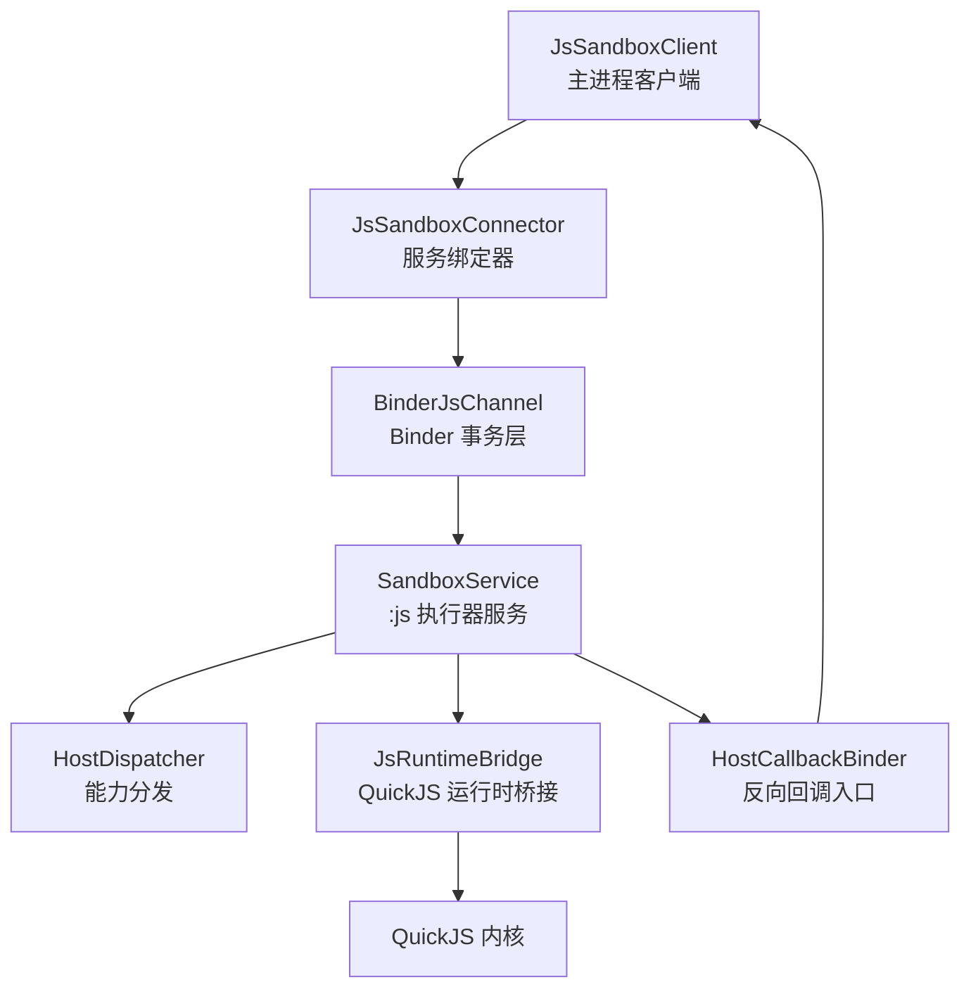
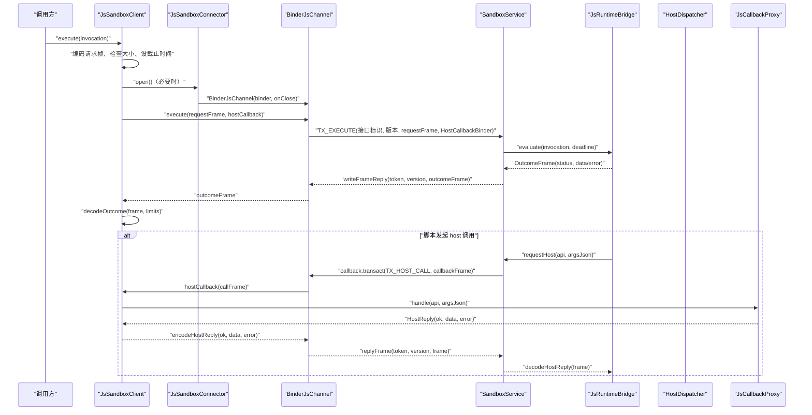
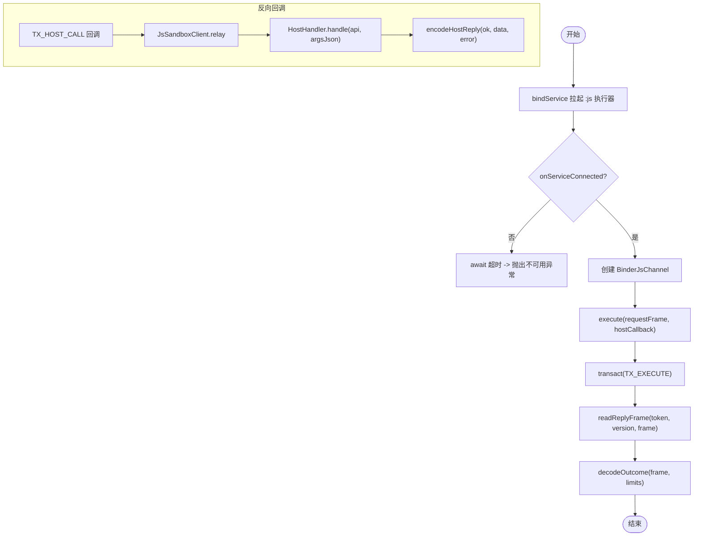
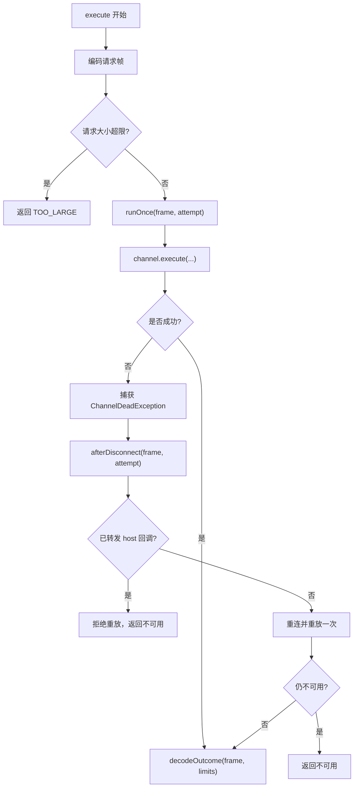
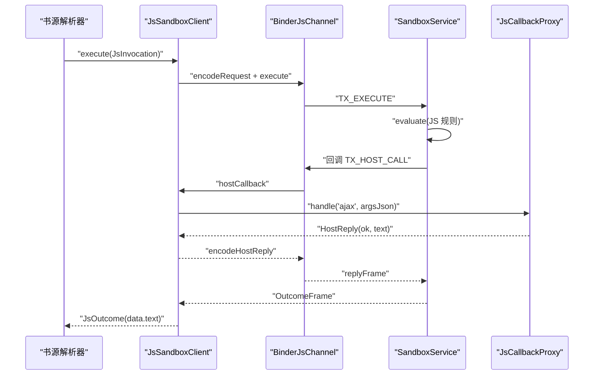
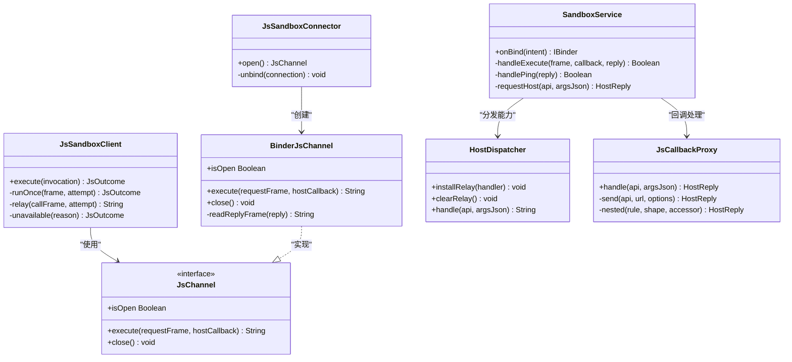

# 进程间通信协议

<cite>
**本文引用的文件**   
- [SandboxContract.kt](file://lib_book_source/src/main/java/com/ebook/source/sandbox/SandboxContract.kt)
- [JsProtocol.kt](file://lib_book_source/src/main/java/com/ebook/source/sandbox/JsProtocol.kt)
- [BinderJsChannel.kt](file://lib_book_source/src/main/java/com/ebook/source/sandbox/BinderJsChannel.kt)
- [JsChannel.kt](file://lib_book_source/src/main/java/com/ebook/source/sandbox/JsChannel.kt)
- [JsSandboxConnector.kt](file://lib_book_source/src/main/java/com/ebook/source/sandbox/JsSandboxConnector.kt)
- [JsSandboxClient.kt](file://lib_book_source/src/main/java/com/ebook/source/sandbox/JsSandboxClient.kt)
- [SandboxService.kt](file://lib_book_source/src/main/java/com/ebook/source/sandbox/SandboxService.kt)
- [HostDispatcher.kt](file://lib_book_source/src/main/java/com/ebook/source/sandbox/HostDispatcher.kt)
- [JsCallbackProxy.kt](file://lib_book_source/src/main/java/com/ebook/source/sandbox/JsCallbackProxy.kt)
- [JsLimits.kt](file://lib_book_source/src/main/java/com/ebook/source/sandbox/JsLimits.kt)
- [SandboxConnectionTest.kt](file://lib_book_source/src/androidTest/java/com/ebook/source/sandbox/SandboxConnectionTest.kt)
</cite>

## 目录
1. [引言](#引言)
2. [项目结构](#项目结构)
3. [核心组件](#核心组件)
4. [架构总览](#架构总览)
5. [详细组件分析](#详细组件分析)
6. [依赖关系分析](#依赖关系分析)
7. [性能考量](#性能考量)
8. [故障排查指南](#故障排查指南)
9. [结论](#结论)

## 引言
本文聚焦主进程与 `:js` 沙箱执行器之间的进程间通信协议。该协议由 Binder 通道承载，以 JSON 帧作为业务载荷，围绕以下目标展开：
- 明确 RequestMessage、ResponseMessage 与 ErrorMessage 的字段结构与数据类型。
- 说明 JSON 序列化与反序列化的实现细节，包括自定义类型（枚举、模式、状态）的编解码规则。
- 记录 Binder 通道的建立过程、连接生命周期管理与重连机制。
- 给出书源解析、章节获取等典型场景的消息交换示例。
- 说明错误传播机制、错误码定义和调试信息输出策略。
- 总结协议的版本兼容性与向后兼容性保证。
- 提供性能优化建议与常见问题排查方法。

## 项目结构
与本协议直接相关的代码集中在 `lib_book_source/src/main/java/com/ebook/source/sandbox` 包下，按职责划分为：
- 协议契约：[SandboxContract.kt](file://lib_book_source/src/main/java/com/ebook/source/sandbox/SandboxContract.kt)，定义接口标识、事务码、协议版本。
- 数据模型与编解码：[JsProtocol.kt](file://lib_book_source/src/main/java/com/ebook/source/sandbox/JsProtocol.kt)，定义请求帧、响应帧、Host 调用帧及 JSON 编解码。
- 传输抽象与 Binder 实现：[JsChannel.kt](file://lib_book_source/src/main/java/com/ebook/source/sandbox/JsChannel.kt)、[BinderJsChannel.kt](file://lib_book_source/src/main/java/com/ebook/source/sandbox/BinderJsChannel.kt)。
- 连接器与服务端：[JsSandboxConnector.kt](file://lib_book_source/src/main/java/com/ebook/source/sandbox/JsSandboxConnector.kt)、[SandboxService.kt](file://lib_book_source/src/main/java/com/ebook/source/sandbox/SandboxService.kt)。
- 客户端调度与 Host 回调：[JsSandboxClient.kt](file://lib_book_source/src/main/java/com/ebook/source/sandbox/JsSandboxClient.kt)、[HostDispatcher.kt](file://lib_book_source/src/main/java/com/ebook/source/sandbox/HostDispatcher.kt)、[JsCallbackProxy.kt](file://lib_book_source/src/main/java/com/ebook/source/sandbox/JsCallbackProxy.kt)。
- 资源限制：[JsLimits.kt](file://lib_book_source/src/main/java/com/ebook/source/sandbox/JsLimits.kt)。
- 端到端验证：[SandboxConnectionTest.kt](file://lib_book_source/src/androidTest/java/com/ebook/source/sandbox/SandboxConnectionTest.kt)。

**图表来源**
- [JsSandboxClient.kt:1-185](file://lib_book_source/src/main/java/com/ebook/source/sandbox/JsSandboxClient.kt#L1-L185)
- [JsSandboxConnector.kt:1-142](file://lib_book_source/src/main/java/com/ebook/source/sandbox/JsSandboxConnector.kt#L1-L142)
- [BinderJsChannel.kt:1-132](file://lib_book_source/src/main/java/com/ebook/source/sandbox/BinderJsChannel.kt#L1-L132)
- [SandboxService.kt:1-210](file://lib_book_source/src/main/java/com/ebook/source/sandbox/SandboxService.kt#L1-L210)
- [HostDispatcher.kt:1-74](file://lib_book_source/src/main/java/com/ebook/source/sandbox/HostDispatcher.kt#L1-L74)

**章节来源**
- [SandboxContract.kt:1-47](file://lib_book_source/src/main/java/com/ebook/source/sandbox/SandboxContract.kt#L1-L47)
- [JsProtocol.kt:1-281](file://lib_book_source/src/main/java/com/ebook/source/sandbox/JsProtocol.kt#L1-L281)

## 核心组件
本节从“消息格式、Binder 通道、连接管理、回调中继、错误处理”五个维度说明核心组件的职责与协作方式。

- 协议契约与版本控制
  - 接口标识与回调标识分离，避免传错 Binder 时误读帧。
  - 协议版本号用于 Parcel 布局变更检测，不一致即报不可用。
  - 两个方向各有独立的事务码空间，防止编号冲突。

- 数据模型与编解码
  - 请求帧包含执行模式、源码、绑定变量、单调时钟截止时间。
  - 响应帧包含状态、完成值或错误文本；成功时 error 为空，失败时 data 为空。
  - Host 调用帧只搬运 API 名与未解析的参数 JSON 串，由接收方再解。
  - JSON 配置为严格模式：忽略未知键关闭，确保两侧不同构建会报错而非静丢字段。

- Binder 通道
  - 抽象接口屏蔽 Android 类型，便于 JVM 测试。
  - Binder 实现负责写接口标识、版本、帧体与回调 Binder，并读取回复帧。
  - 反向回调通过内部 Binder 实现，校验接口标识与版本，再中继给主进程。

- 连接管理
  - 连接器使用 bindService 拉起执行器服务，等待 IBinder，超时抛出不可用异常。
  - 每个 open 对应一次独立绑定，close 时解绑，避免旧 Connection 干扰新连接。
  - onServiceDisconnected 不立即清 Binder，留给下一次事务判死并重连。

- 客户端调度与重放
  - execute 串行化，保证同一时刻只有一帧在飞，保护 Binder 事务缓冲上限。
  - 断连后若无副作用则重连并重放一次；若有副作用则拒绝重放。
  - 主线程守卫与回调嵌套深度限制，避免 ANR 与双向死锁。

- Host 回调与能力分发
  - 执行器侧通过 HostDispatcher 白名单路由到计算类或宿主类能力。
  - 主进程侧 JsCallbackProxy 实现网络访问、变量读写、页面基准更新等能力。
  - 所有 Host 回调异常被兜底成 ok=false 的友好错误，不穿透到执行器 JNI。

**章节来源**
- [SandboxContract.kt:10-47](file://lib_book_source/src/main/java/com/ebook/source/sandbox/SandboxContract.kt#L10-L47)
- [JsProtocol.kt:1-120](file://lib_book_source/src/main/java/com/ebook/source/sandbox/JsProtocol.kt#L1-L120)
- [BinderJsChannel.kt:1-132](file://lib_book_source/src/main/java/com/ebook/source/sandbox/BinderJsChannel.kt#L1-L132)
- [JsChannel.kt:1-37](file://lib_book_source/src/main/java/com/ebook/source/sandbox/JsChannel.kt#L1-L37)
- [JsSandboxConnector.kt:1-142](file://lib_book_source/src/main/java/com/ebook/source/sandbox/JsSandboxConnector.kt#L1-L142)
- [JsSandboxClient.kt:1-185](file://lib_book_source/src/main/java/com/ebook/source/sandbox/JsSandboxClient.kt#L1-L185)
- [HostDispatcher.kt:1-74](file://lib_book_source/src/main/java/com/ebook/source/sandbox/HostDispatcher.kt#L1-L74)
- [JsCallbackProxy.kt:1-506](file://lib_book_source/src/main/java/com/ebook/source/sandbox/JsCallbackProxy.kt#L1-L506)

## 架构总览
下图展示一次完整的主进程请求到执行器并可能触发主进程回调的时序。

**图表来源**
- [JsSandboxClient.kt:55-120](file://lib_book_source/src/main/java/com/ebook/source/sandbox/JsSandboxClient.kt#L55-L120)
- [BinderJsChannel.kt:41-90](file://lib_book_source/src/main/java/com/ebook/source/sandbox/BinderJsChannel.kt#L41-L90)
- [SandboxService.kt:60-120](file://lib_book_source/src/main/java/com/ebook/source/sandbox/SandboxService.kt#L60-L120)
- [HostDispatcher.kt:35-74](file://lib_book_source/src/main/java/com/ebook/source/sandbox/HostDispatcher.kt#L35-L74)
- [JsCallbackProxy.kt:140-240](file://lib_book_source/src/main/java/com/ebook/source/sandbox/JsCallbackProxy.kt#L140-L240)

## 详细组件分析

### 协议契约与消息格式
- 接口标识与回调标识
  - 执行器接口标识用于主进程 → 执行器的 TX_EXECUTE/TX_PING。
  - 回调接口标识用于执行器 → 主进程的 TX_HOST_CALL。
  - 两者分离，使 enforceInterface 能当场拒绝错误的 Binder。

- 事务码
  - TX_EXECUTE：一次 JS 执行，写 token、version、requestFrame、host 回调 Binder；回 token、version、outcomeFrame。
  - TX_PING：探活，仅验 token 与版本，不回帧体，返回 ready 标志位。
  - TX_HOST_CALL：执行器主动调主进程，写 token、version、callFrame；回 token、version、replyFrame。

- 协议版本
  - PROTOCOL_VERSION 为整数，Parcel 布局变化需 +1。
  - 两端不一致时，服务端写 UNAVAILABLE，客户端抛协议异常。

- 请求帧（RequestMessage）
  - mode：字符串，枚举名，决定执行语义（SEGMENT、EXPRESSION、URL_OPTION、BODY_JS、INIT）。
  - source：字符串，JS 源码。
  - bindings：Map<String, String?>，绑定变量，null 表示不可用并由垫片转为 undefined。
  - deadline：Long，单调毫秒截止时间，跨进程可比。

- 响应帧（ResponseMessage）
  - status：字符串，枚举名，映射到 JsStatus（OK、TIMEOUT、MEMORY、STACK、SYNTAX、RUNTIME、UNSUPPORTED_API、TOO_LARGE、UNAVAILABLE）。
  - data：可空 JSON 元素，成功时为完成值；失败时为 null。
  - error：可空字符串，失败时携带原因；成功时为 null。

- Host 调用帧（ErrorMessage 相关）
  - api：字符串，能力名，由 HostDispatcher 白名单匹配。
  - args：字符串，未解析的 JSON 参数数组。
  - 主进程回复帧：ok、data、error；错误路径通常 ok=false 且 error 非空。

- 自定义类型编解码规则
  - 枚举以 name 形式过边界：mode.name、status.name。
  - JSON 严格模式：ignoreUnknownKeys=false，encodeDefaults=true。
  - 解码统一入口捕获 SerializationException，转换为 SandboxProtocolException。

**章节来源**
- [SandboxContract.kt:10-47](file://lib_book_source/src/main/java/com/ebook/source/sandbox/SandboxContract.kt#L10-L47)
- [JsProtocol.kt:1-200](file://lib_book_source/src/main/java/com/ebook/source/sandbox/JsProtocol.kt#L1-L200)
- [JsProtocol.kt:201-281](file://lib_book_source/src/main/java/com/ebook/source/sandbox/JsProtocol.kt#L201-L281)

### Binder 通道建立与生命周期
- 连接器打开通道
  - bindService 拉起 SandboxService。
  - 若系统拒绝绑定或未回调 onServiceConnected，抛出不可用异常。
  - await 等待 IBinder，超时抛出不可用异常。
  - 返回 BinderJsChannel，并在 close 时解绑。

- 通道打开与关闭
  - BinderJsChannel.execute 写接口标识、版本、requestFrame、HostCallbackBinder。
  - readReplyFrame 顺序读取 token、version、outcomeFrame；任一失败均为协议异常。
  - close 幂等关闭，内部标记 closed 并调用 onClose。

- 反向回调通道
  - HostCallbackBinder.onTransact 分诊 PING/DUMP/INTERFACE 管家事务。
  - TX_HOST_CALL 校验 token、version、callFrame，中继到 JsSandboxClient.relay。
  - writeCallReply 写 token、version、frame。

**图表来源**
- [JsSandboxConnector.kt:30-90](file://lib_book_source/src/main/java/com/ebook/source/sandbox/JsSandboxConnector.kt#L30-L90)
- [BinderJsChannel.kt:41-120](file://lib_book_source/src/main/java/com/ebook/source/sandbox/BinderJsChannel.kt#L41-L120)

**章节来源**
- [JsSandboxConnector.kt:1-142](file://lib_book_source/src/main/java/com/ebook/source/sandbox/JsSandboxConnector.kt#L1-L142)
- [BinderJsChannel.kt:1-132](file://lib_book_source/src/main/java/com/ebook/source/sandbox/BinderJsChannel.kt#L1-L132)

### 重连机制与断连处置
- 断连检测
  - RemoteException（含 DeadObjectException、TransactionTooLargeException）视为通道死亡。
  - onServiceDisconnected 只记日志，不立即清 Binder，交由下一次事务判死。

- 重连策略
  - afterDisconnect：无副作用时重连并重放一次；有副作用时拒绝重放。
  - runOnce：已有通道可用则复用，否则 openChannel 新建。
  - dropChannel：丢弃旧通道并关闭，避免脏句柄残留。

- 重放预算
  - Attempt.relayed 计数已转发的 host 回调次数。
  - relayed > 0 表示本次调用已有副作用，禁止重放，避免重复请求同一页。

**图表来源**
- [JsSandboxClient.kt:55-185](file://lib_book_source/src/main/java/com/ebook/source/sandbox/JsSandboxClient.kt#L55-L185)

**章节来源**
- [JsSandboxClient.kt:55-185](file://lib_book_source/src/main/java/com/ebook/source/sandbox/JsSandboxClient.kt#L55-L185)

### 典型场景：书源解析与章节获取
- 书源解析
  - 调用方构造 JsInvocation(mode=SEGMENT/EXPRESSION/URL_OPTION/BODY_JS/INIT, source=JS 规则, bindings=变量)。
  - 客户端编码 RequestFrame，设置 deadline 为当前单调时间 + wallClockMs。
  - 执行器执行 QuickJS，返回 OutcomeFrame(status, data/error)。
  - 客户端 decodeOutcome 将 status 映射到 JsStatus，并将 data.text 作为结果文本。

- 章节获取
  - 若 JS 规则需要网络，执行器通过 HostDispatcher 分发到 JsCallbackProxy。
  - JsCallbackProxy.admit 进行白名单与限流检查。
  - 发送 HTTP 请求，返回整页 HTML；校验字节长度不超过 maxHostReplyBytes。
  - 更新 currentText/currentUrl，并以 JsonPrimitive(text) 回传给脚本。

**图表来源**
- [SandboxConnectionTest.kt:24-70](file://lib_book_source/src/androidTest/java/com/ebook/source/sandbox/SandboxConnectionTest.kt#L24-L70)
- [JsCallbackProxy.kt:240-340](file://lib_book_source/src/main/java/com/ebook/source/sandbox/JsCallbackProxy.kt#L240-L340)

**章节来源**
- [SandboxConnectionTest.kt:24-132](file://lib_book_source/src/androidTest/java/com/ebook/source/sandbox/SandboxConnectionTest.kt#L24-L132)
- [JsCallbackProxy.kt:140-340](file://lib_book_source/src/main/java/com/ebook/source/sandbox/JsCallbackProxy.kt#L140-L340)

### 错误传播机制
- 异常分类
  - SandboxProtocolException：帧形态不符、接口标识不符、协议版本不合、未知模式名。
  - ChannelDeadException：对端不可达、事务失败、通道关闭。
  - SandboxUnavailableException：服务绑定失败、超时、进程未隔离。

- 状态映射
  - mapStatus 区分完成但超时、正常完成、不支持的 API、语法错误、内存溢出、栈溢出、运行时错误。
  - 超时优先于其他错误；堆分配失败时补齐 out of memory 消息。

- 调试信息
  - Logger 输出关键节点：绑定失败、通道死亡、协议版本不合、host 代理失败。
  - Host 回调异常被兜底成 ok=false 的友好错误，避免带走执行器进程。

- 错误码定义
  - JsStatus.OK：成功。
  - JsStatus.TIMEOUT：超时。
  - JsStatus.MEMORY：内存溢出。
  - JsStatus.STACK：栈溢出。
  - JsStatus.SYNTAX：语法错误。
  - JsStatus.RUNTIME：运行时错误。
  - JsStatus.UNSUPPORTED_API：调用白名单外的能力。
  - JsStatus.TOO_LARGE：报文超限。
  - JsStatus.UNAVAILABLE：执行器不可用。

**章节来源**
- [JsProtocol.kt:80-200](file://lib_book_source/src/main/java/com/ebook/source/sandbox/JsProtocol.kt#L80-L200)
- [BinderJsChannel.kt:41-120](file://lib_book_source/src/main/java/com/ebook/source/sandbox/BinderJsChannel.kt#L41-L120)
- [JsSandboxClient.kt:55-185](file://lib_book_source/src/main/java/com/ebook/source/sandbox/JsSandboxClient.kt#L55-L185)
- [HostDispatcher.kt:35-74](file://lib_book_source/src/main/java/com/ebook/source/sandbox/HostDispatcher.kt#L35-L74)

### 协议版本兼容性与向后兼容性
- 版本探测
  - PROTOCOL_VERSION 在两端一致才继续；不一致时服务端写 UNAVAILABLE，客户端抛协议异常。
  - 接口标识强制校验，避免传错 Binder。

- 向后兼容策略
  - 新增字段采用可空默认值，严格解码模式下未知键导致失败，从而显式暴露不同构建问题。
  - 枚举名过边界，新增枚举需同步两端；未知模式名抛协议异常。
  - 探活 TX_PING 返回 ready 标志位，区分“.so 加载失败”与“服务不在”。

- 安全加固
  - onBind 在非隔离进程返回 null，阻止脚本在不安全环境执行。
  - HostDispatcher 白名单二次判定，防止绕过垫片直接调用 __host_call。

**章节来源**
- [SandboxContract.kt:10-47](file://lib_book_source/src/main/java/com/ebook/source/sandbox/SandboxContract.kt#L10-L47)
- [SandboxService.kt:140-210](file://lib_book_source/src/main/java/com/ebook/source/sandbox/SandboxService.kt#L140-L210)
- [HostDispatcher.kt:1-74](file://lib_book_source/src/main/java/com/ebook/source/sandbox/HostDispatcher.kt#L1-L74)

## 依赖关系分析
- 组件耦合
  - JsSandboxClient 依赖 JsChannel 抽象，屏蔽 Binder 具体实现。
  - BinderJsChannel 依赖 SandboxContract 与 JsProtocol，承担帧读写。
  - SandboxService 依赖 HostDispatcher 与 JsRuntimeBridge，负责执行与能力分发。
  - JsCallbackProxy 依赖 JsNetworkGuard 与 ScriptTransport，封装网络与守门逻辑。

- 外部依赖
  - kotlinx.serialization：JSON 编解码。
  - OkHttp：HTTP 请求。
  - Android Binder/Service：进程间通信。

**图表来源**
- [JsSandboxClient.kt:1-185](file://lib_book_source/src/main/java/com/ebook/source/sandbox/JsSandboxClient.kt#L1-L185)
- [BinderJsChannel.kt:1-132](file://lib_book_source/src/main/java/com/ebook/source/sandbox/BinderJsChannel.kt#L1-L132)
- [JsSandboxConnector.kt:1-142](file://lib_book_source/src/main/java/com/ebook/source/sandbox/JsSandboxConnector.kt#L1-L142)
- [SandboxService.kt:1-210](file://lib_book_source/src/main/java/com/ebook/source/sandbox/SandboxService.kt#L1-L210)
- [HostDispatcher.kt:1-74](file://lib_book_source/src/main/java/com/ebook/source/sandbox/HostDispatcher.kt#L1-L74)
- [JsCallbackProxy.kt:1-506](file://lib_book_source/src/main/java/com/ebook/source/sandbox/JsCallbackProxy.kt#L1-L506)

**章节来源**
- [JsSandboxClient.kt:1-185](file://lib_book_source/src/main/java/com/ebook/source/sandbox/JsSandboxClient.kt#L1-L185)
- [BinderJsChannel.kt:1-132](file://lib_book_source/src/main/java/com/ebook/source/sandbox/BinderJsChannel.kt#L1-L132)
- [JsSandboxConnector.kt:1-142](file://lib_book_source/src/main/java/com/ebook/source/sandbox/JsSandboxConnector.kt#L1-L142)
- [SandboxService.kt:1-210](file://lib_book_source/src/main/java/com/ebook/source/sandbox/SandboxService.kt#L1-L210)
- [HostDispatcher.kt:1-74](file://lib_book_source/src/main/java/com/ebook/source/sandbox/HostDispatcher.kt#L1-L74)
- [JsCallbackProxy.kt:1-506](file://lib_book_source/src/main/java/com/ebook/source/sandbox/JsCallbackProxy.kt#L1-L506)

## 性能考量
- 串行执行
  - JsSandboxClient.inFlight 锁串行化 execute，避免并发争抢 Binder 事务缓冲。
  - 代价是排队请求共享同一 deadline，可能提前 TIMEOUT，但比悄悄多跑更安全。

- 报文大小限制
  - maxRequestBytes、maxOutcomeBytes、maxHostReplyBytes 均约 900 KB，受 Binder 事务缓冲约束。
  - utf8Length 零分配计算 UTF-8 字节数，避免中间数组复制。

- 超时与中断
  - wallClockMs 使用 SystemClock.elapsedRealtime()，跨进程单调可比。
  - Host 回调中的网络请求使用 withTimeout 保护 binder 线程不被长时间占用。

- 栈与内存
  - heapBytes=8MB，stackBytes=1MB，配合内核分配器与栈预算，防止指数分配与深递归。
  - 回调深度限制 maxCallbackDepth=8，避免嵌套求值死循环。

- 连接超时
  - bindTimeoutMs=2000ms，冷启动快速失败，避免吞掉整条规则预算。

- 优化建议
  - 合并多次小请求，减少 Binder 调用次数。
  - 缓存热点 URL 的头部探测结果，降低 HEAD 请求频率。
  - 合理设置 timeoutMs，避免阻塞协程取消。

**章节来源**
- [JsLimits.kt:1-58](file://lib_book_source/src/main/java/com/ebook/source/sandbox/JsLimits.kt#L1-L58)
- [JsProtocol.kt:250-281](file://lib_book_source/src/main/java/com/ebook/source/sandbox/JsProtocol.kt#L250-L281)
- [JsSandboxClient.kt:55-185](file://lib_book_source/src/main/java/com/ebook/source/sandbox/JsSandboxClient.kt#L55-L185)
- [JsCallbackProxy.kt:300-420](file://lib_book_source/src/main/java/com/ebook/source/sandbox/JsCallbackProxy.kt#L300-L420)

## 故障排查指南
- 无法连接执行器
  - 检查 bindService 是否成功，onServiceConnected 是否回调。
  - 确认 SandboxProcess.isInIsolatedProcess 为真，非隔离进程 onBind 返回 null。
  - 查看 bindTimeoutMs 是否过小，或设备性能导致冷启动慢。

- 协议版本不合
  - 确认两端使用同一构建产物，PROTOCOL_VERSION 一致。
  - 检查接口标识是否正确，避免传错 Binder。

- 通道断开
  - 观察 onServiceDisconnected 日志，确认执行器进程是否被回收。
  - 检查 TransactionTooLargeException，可能是多个大帧并发。

- Host 回调失败
  - 查看 HostDispatcher 白名单是否包含目标 API。
  - 检查 JsCallbackProxy 的 admit 限流与白名单守卫。
  - 确认 cookie 罐装配正确，避免登录循环。

- 脚本执行失败
  - 根据 JsStatus 判断是超时、内存、栈溢出、语法错误或运行时错误。
  - 检查 deadline 是否合理，wallClockMs 是否过长导致 ANR。

- 调试信息输出
  - Logger 输出绑定失败、通道死亡、协议版本不合、host 代理失败。
  - SandboxConnectionTest 覆盖连通性、双向事务、进程隔离性。

**章节来源**
- [JsSandboxConnector.kt:30-142](file://lib_book_source/src/main/java/com/ebook/source/sandbox/JsSandboxConnector.kt#L30-L142)
- [BinderJsChannel.kt:41-120](file://lib_book_source/src/main/java/com/ebook/source/sandbox/BinderJsChannel.kt#L41-L120)
- [HostDispatcher.kt:35-74](file://lib_book_source/src/main/java/com/ebook/source/sandbox/HostDispatcher.kt#L35-L74)
- [JsCallbackProxy.kt:240-506](file://lib_book_source/src/main/java/com/ebook/source/sandbox/JsCallbackProxy.kt#L240-L506)
- [SandboxConnectionTest.kt:24-132](file://lib_book_source/src/androidTest/java/com/ebook/source/sandbox/SandboxConnectionTest.kt#L24-L132)

## 结论
本协议通过严格的接口标识与版本校验、清晰的帧结构定义、以及健壮的 Binder 通道管理，实现了主进程与 `:js` 执行器之间的可靠通信。其设计强调：
- 安全性：隔离进程、白名单能力、严格解码。
- 可观测性：详细的错误分类与日志输出。
- 稳定性：串行执行、报文大小限制、超时与重连机制。
- 可维护性：集中化的协议契约与编解码实现。

在实际使用中，应重点关注连接建立、协议版本一致性、Host 回调权限与限流，以及报文大小与时限配置，以确保书源解析与章节获取的稳定高效。