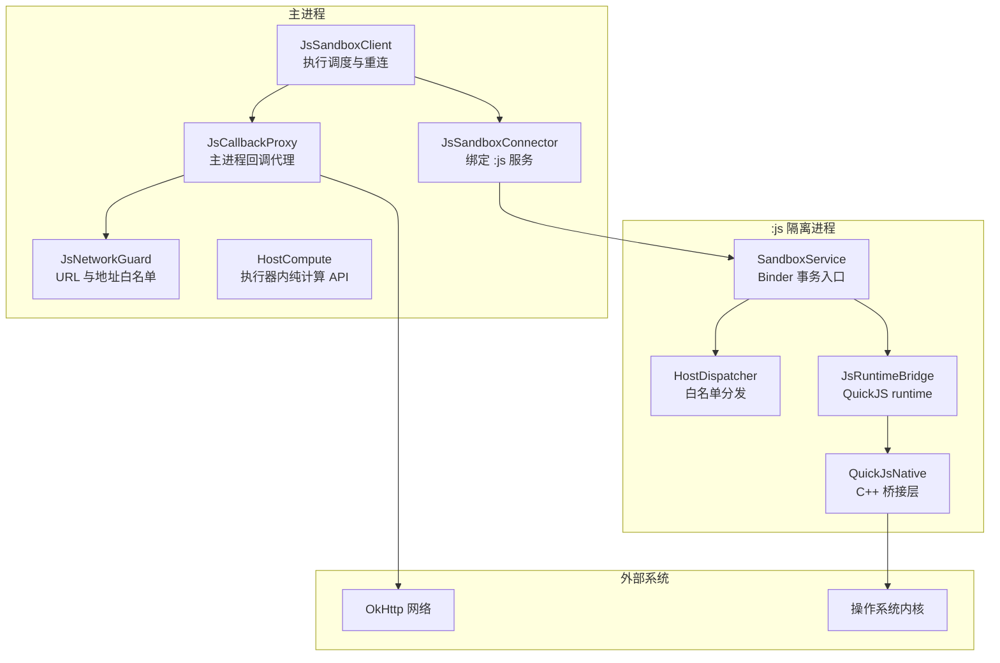
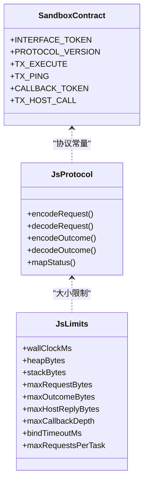
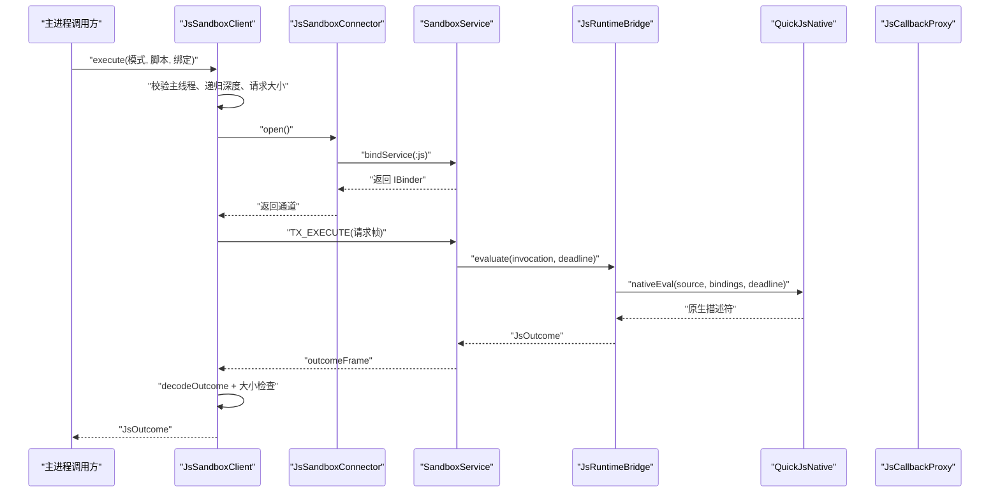
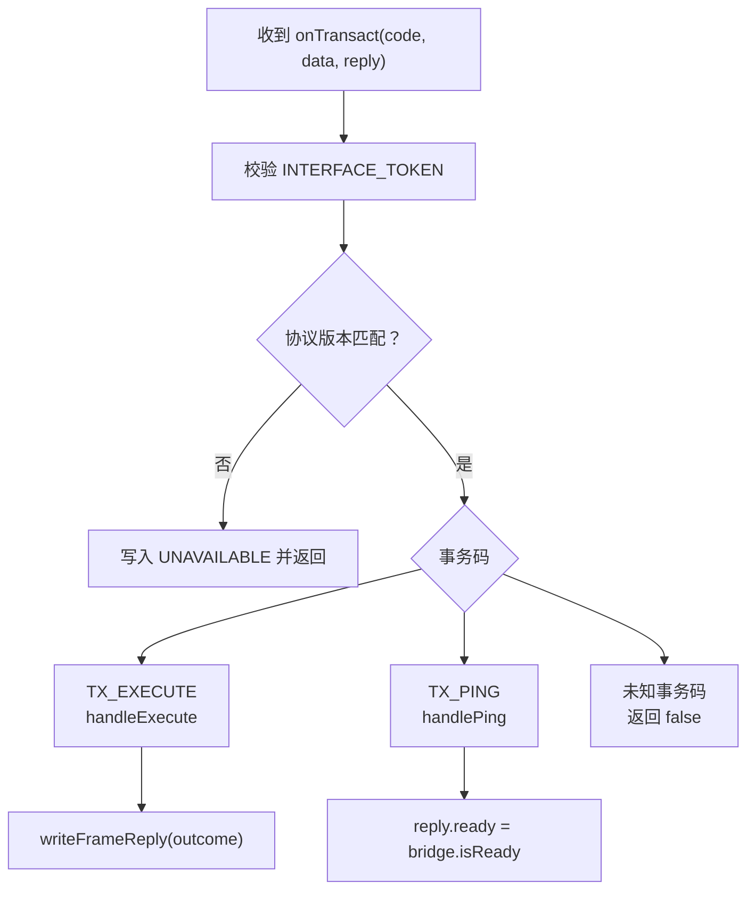
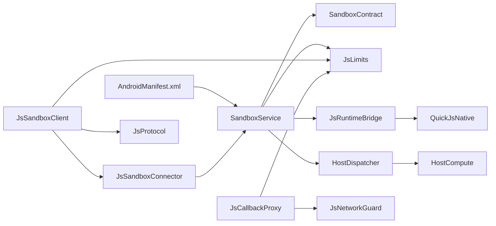

# 进程隔离与安全

<cite>
**本文引用的文件**   
- [0028-untrusted-js-sandbox.md](file://docs/adr/0028-untrusted-js-sandbox.md)
- [AndroidManifest.xml](file://lib_book_source/src/main/AndroidManifest.xml)
- [SandboxProcess.kt](file://lib_book_source/src/main/java/com/ebook/source/sandbox/SandboxProcess.kt)
- [SandboxService.kt](file://lib_book_source/src/main/java/com/ebook/source/sandbox/SandboxService.kt)
- [JsSandboxConnector.kt](file://lib_book_source/src/main/java/com/ebook/source/sandbox/JsSandboxConnector.kt)
- [JsSandboxClient.kt](file://lib_book_source/src/main/java/com/ebook/source/sandbox/JsSandboxClient.kt)
- [JsRuntimeBridge.kt](file://lib_book_source/src/main/java/com/ebook/source/sandbox/JsRuntimeBridge.kt)
- [HostDispatcher.kt](file://lib_book_source/src/main/java/com/ebook/source/sandbox/HostDispatcher.kt)
- [HostCompute.kt](file://lib_book_source/src/main/java/com/ebook/source/sandbox/HostCompute.kt)
- [JsCallbackProxy.kt](file://lib_book_source/src/main/java/com/ebook/source/sandbox/JsCallbackProxy.kt)
- [JsNetworkGuard.kt](file://lib_book_source/src/main/java/com/ebook/source/sandbox/JsNetworkGuard.kt)
- [JsProtocol.kt](file://lib_book_source/src/main/java/com/ebook/source/sandbox/JsProtocol.kt)
- [JsLimits.kt](file://lib_book_source/src/main/java/com/ebook/source/sandbox/JsLimits.kt)
- [SandboxContract.kt](file://lib_book_source/src/main/java/com/ebook/source/sandbox/SandboxContract.kt)
- [QuickJsNative.kt](file://lib_book_source/src/main/java/com/ebook/source/sandbox/QuickJsNative.kt)
</cite>

## 目录

1. [引言](#引言)
2. [项目结构](#项目结构)
3. [核心组件](#核心组件)
4. [架构总览](#架构总览)
5. [详细组件分析](#详细组件分析)
6. [依赖关系分析](#依赖关系分析)
7. [性能与资源特性](#性能与资源特性)
8. [安全配置最佳实践](#安全配置最佳实践)
9. [常见威胁防护方案](#常见威胁防护方案)
10. [恶意脚本检测机制](#恶意脚本检测机制)
11. [安全测试设计思路](#安全测试设计思路)
12. [故障排查指南](#故障排查指南)
13. [结论](#结论)

## 引言

本项目的书源系统允许社区提供内嵌 JavaScript 的规则，这些规则会解析网页、提取目录和正文。由于脚本来源不可信，项目采用「独立 Android 沙箱进程 + QuickJS 原生执行器 + Binder 双向协议 + deny-by-default 能力白名单」的多层防御模型，确保主进程和业务数据不会直接暴露给陌生脚本。

核心决策来自安全架构决策文档：执行器使用 `android:isolatedProcess="true"` 的零权限进程，脚本无法直接使用网络、文件系统或应用私有数据；所有对外能力必须经过显式注册；运行时通过挂钟超时、堆上限、栈上限和报文大小限制来防止资源耗尽；跨进程通信使用严格校验的 Binder 协议，并支持受限的主进程回调通道。

该文档从进程隔离、权限模型、能力白名单、资源限制、通信协议、威胁防护和安全测试等维度，完整说明沙箱执行器的实现与策略。

## 项目结构

安全相关代码集中在 `lib_book_source` 模块的 `sandbox` 包中，同时由清单声明一个独立的 `:js` 服务。整体可理解为三层：

| 层级 | 职责 | 主要文件 |
|---|---|---|
| 清单与进程入口 | 声明隔离服务、进程名和权限边界 | [AndroidManifest.xml](file://lib_book_source/src/main/AndroidManifest.xml) |
| 执行器进程侧 | 接收请求、创建 QuickJS runtime、执行脚本、转发 host 回调 | [SandboxService.kt](file://lib_book_source/src/main/java/com/ebook/source/sandbox/SandboxService.kt)、[HostDispatcher.kt](file://lib_book_source/src/main/java/com/ebook/source/sandbox/HostDispatcher.kt)、[JsRuntimeBridge.kt](file://lib_book_source/src/main/java/com/ebook/source/sandbox/JsRuntimeBridge.kt) |
| 主进程侧 | 建立连接、串行化执行、限制资源、代理网络和计算能力 | [JsSandboxConnector.kt](file://lib_book_source/src/main/java/com/ebook/source/sandbox/JsSandboxConnector.kt)、[JsSandboxClient.kt](file://lib_book_source/src/main/java/com/ebook/source/sandbox/JsSandboxClient.kt)、[JsCallbackProxy.kt](file://lib_book_source/src/main/java/com/ebook/source/sandbox/JsCallbackProxy.kt)、[JsNetworkGuard.kt](file://lib_book_source/src/main/java/com/ebook/source/sandbox/JsNetworkGuard.kt) |

**图示来源**
- [AndroidManifest.xml:1-23](file://lib_book_source/src/main/AndroidManifest.xml#L1-L23)
- [SandboxService.kt:1-200](file://lib_book_source/src/main/java/com/ebook/source/sandbox/SandboxService.kt#L1-L200)
- [JsSandboxClient.kt:1-185](file://lib_book_source/src/main/java/com/ebook/source/sandbox/JsSandboxClient.kt#L1-L185)
- [JsCallbackProxy.kt:1-200](file://lib_book_source/src/main/java/com/ebook/source/sandbox/JsCallbackProxy.kt#L1-L200)
- [JsNetworkGuard.kt:1-167](file://lib_book_source/src/main/java/com/ebook/source/sandbox/JsNetworkGuard.kt#L1-L167)
- [JsRuntimeBridge.kt:1-113](file://lib_book_source/src/main/java/com/ebook/source/sandbox/JsRuntimeBridge.kt#L1-L113)
- [QuickJsNative.kt:1-59](file://lib_book_source/src/main/java/com/ebook/source/sandbox/QuickJsNative.kt#L1-L59)

**章节来源**
- [AndroidManifest.xml:1-23](file://lib_book_source/src/main/AndroidManifest.xml#L1-L23)
- [0028-untrusted-js-sandbox.md:1-65](file://docs/adr/0028-untrusted-js-sandbox.md#L1-L65)

## 核心组件

### 进程门与隔离判据

`SandboxProcess` 提供唯一入口，判断当前进程是否由系统标记为隔离进程。判据要求 SDK 版本不低于 API 28，并且调用 `Process.isIsolated()`。短路与顺序被刻意安排为：先检查 SDK 版本，再调用可能不存在的 API，从而避免在低版本设备上崩溃。

该对象被多处复用：执行器自检、应用初始化进程门和设备用例。把它放在单独文件中，是因为它属于安全关键路径，且跨模块可见性要求较高。

**章节来源**
- [SandboxProcess.kt:1-28](file://lib_book_source/src/main/java/com/ebook/source/sandbox/SandboxProcess.kt#L1-L28)
- [0028-untrusted-js-sandbox.md:1-65](file://docs/adr/0028-untrusted-js-sandbox.md#L1-L65)

### 隔离服务

`SandboxService` 是 `:js` 进程中唯一的组件。它只做三件事：读取 Parcel、把执行结果写回 Parcel、把 host 调用中继给主进程。它不抛异常到外层，因为 Binder 异常在另一侧只表现为事务失败，而真实原因会留在被丢弃的栈里。

关键行为包括：

- 拦截默认事务码，仅放行 ping、dump 和两个自有事务码。
- 先校验接口标识和协议版本，再按事务码分派。
- 在 `onBind` 中再次确认当前进程是否隔离；若不隔离则返回 null，使主进程拿到“沙箱不可用”的错误，而不是在不设防的进程里执行脚本。
- 维护当前回调通道的线程局部变量，用于将脚本的 host 调用同步转回主进程。
- 在服务销毁时清理中继、移除线程局部状态并关闭桥接层。

**章节来源**
- [SandboxService.kt:1-200](file://lib_book_source/src/main/java/com/ebook/source/sandbox/SandboxService.kt#L1-L200)
- [0028-untrusted-js-sandbox.md:1-65](file://docs/adr/0028-untrusted-js-sandbox.md#L1-L65)

### 连接管理器

`JsSandboxConnector` 负责拉起 `:js` 进程并等待 binder。每次 `open()` 是一次独立绑定，解绑挂在返回通道的 `close()` 上。这样重连时旧连接会被作废，避免旧 binder 解绑意外切断新连接。

连接过程的特点：

- 使用 `bindService` 拉起服务，不支持 `startService`。
- 连接超时单独配置，不与规则挂钟预算混用。
- 连接失败抛出类型化的 `SandboxUnavailableException`，而不是让客户端误以为可以重放无副作用调用。
- 对 `onNullBinding`、`onServiceDisconnected`、`onBindingDied` 等生命周期做明确处理。

**章节来源**
- [JsSandboxConnector.kt:1-142](file://lib_book_source/src/main/java/com/ebook/source/sandbox/JsSandboxConnector.kt#L1-L142)
- [0028-untrusted-js-sandbox.md:1-65](file://docs/adr/0028-untrusted-js-sandbox.md#L1-L65)

### 主进程客户端

`JsSandboxClient` 是主进程侧的唯一执行入口。它负责：

- 使用单调时钟计算绝对截止时间。
- 串行化 execute 调用，保证同一时刻只有一帧在飞。
- 阻止主线程执行，避免 ANR。
- 阻止 host 回调内部再次发起沙箱调用，防止双向死锁。
- 在断连后根据是否有已转发回调决定是否重放一次。
- 校验请求和响应字节长度。

**章节来源**
- [JsSandboxClient.kt:1-185](file://lib_book_source/src/main/java/com/ebook/source/sandbox/JsSandboxClient.kt#L1-L185)
- [0028-untrusted-js-sandbox.md:1-65](file://docs/adr/0028-untrusted-js-sandbox.md#L1-L65)

### 运行时桥接层

`JsRuntimeBridge` 管理 QuickJS runtime 的生命周期，并在执行器进程内完成脚本求值。它不是线程安全的，因为并发控制由主进程客户端的单帧不变式保证。

关键职责：

- 按需创建 native runtime。
- 在任务边界重建 context，避免脚本全局状态污染下一条规则。
- 将 bindings 序列化为 JSON，交给 C++ 层。
- 将原生描述符反序列化为统一状态。
- 对超时、内存超限和栈耗尽执行 reset。
- 提供 isReady 探测，不创建 runtime。

**章节来源**
- [JsRuntimeBridge.kt:1-113](file://lib_book_source/src/main/java/com/ebook/source/sandbox/JsRuntimeBridge.kt#L1-L113)
- [QuickJsNative.kt:1-59](file://lib_book_source/src/main/java/com/ebook/source/sandbox/QuickJsNative.kt#L1-L59)

### Host 分发器

`HostDispatcher` 是脚本能力的唯一入口，运行在 `:js` 进程。它按名称查找白名单能力，并把计算类能力交给 `HostCompute`，把需要主进程参与的能力交给 relay。

重要安全点：

- 白名单在 Kotlin 层二次判定，防止脚本绕过垫片直接调用 `__host_call`。
- 方法名和签名由 C++ 字符串常量引用，混淆规则必须保留。
- 所有异常就地兜住，避免 JNI 栈异常带走整个执行器进程。

**章节来源**
- [HostDispatcher.kt:1-74](file://lib_book_source/src/main/java/com/ebook/source/sandbox/HostDispatcher.kt#L1-L74)
- [0028-untrusted-js-sandbox.md:1-65](file://docs/adr/0028-untrusted-js-sandbox.md#L1-L65)

### 纯计算能力

`HostCompute` 在执行器进程内实现 md5、base64、AES、DES、时间格式化、URI 编码等能力。它不走 Binder，因此没有 IPC 成本。

设计要点：

- 所有摘要和加密输入使用 UTF-8 字节。
- 所有失败抛出类型化的拒绝异常，避免静默假成功。
- 分组密码密钥派生是本仓规定，保证 URL 参数可复现。
- base64 解码失败和空结果被显式拒绝。

**章节来源**
- [HostCompute.kt:1-200](file://lib_book_source/src/main/java/com/ebook/source/sandbox/HostCompute.kt#L1-L200)

### 主进程回调代理

`JsCallbackProxy` 是主进程侧受理 host 回调的统一代理。它承载单次解析任务的状态，包括外呼计数、回调深度、当前页面和会话罐。

能力包括：

- AJAX、POST、LOAD、RESPONSE_CODE、SET_CONTENT、COOKIE_GET、COOKIE_SET 等。
- 嵌套规则求值（关掉 JS 的上下文）。
- 日志映射为 toast 或 debug 输出。
- 按任务作用域管理变量和 cookie。

**章节来源**
- [JsCallbackProxy.kt:1-200](file://lib_book_source/src/main/java/com/ebook/source/sandbox/JsCallbackProxy.kt#L1-L200)

### 网络守卫

`JsNetworkGuard` 负责 URL 准入和 DNS 结果过滤。它在两层拦截：

1. 字符串层检查 scheme、长度、授权段、凭证和内嵌主机白名单。
2. DNS 层在 OkHttp 真正解析地址时检查实际 IP。

它还实现了严格的内网地址阻断策略，覆盖 IPv4 和 IPv6，包括环回、RFC1918、链路本地、云元数据段、CGNAT、组播和保留段。

**章节来源**
- [JsNetworkGuard.kt:1-167](file://lib_book_source/src/main/java/com/ebook/source/sandbox/JsNetworkGuard.kt#L1-L167)

### 协议与限制

`SandboxContract` 定义 Binder 接口标识、协议版本和事务码。`JsProtocol` 定义请求帧、响应帧、模式枚举和状态归类。`JsLimits` 集中所有资源限制数值。

**图示来源**
- [SandboxContract.kt:1-47](file://lib_book_source/src/main/java/com/ebook/source/sandbox/SandboxContract.kt#L1-L47)
- [JsProtocol.kt:1-200](file://lib_book_source/src/main/java/com/ebook/source/sandbox/JsProtocol.kt#L1-L200)
- [JsLimits.kt:1-58](file://lib_book_source/src/main/java/com/ebook/source/sandbox/JsLimits.kt#L1-L58)

**章节来源**
- [SandboxContract.kt:1-47](file://lib_book_source/src/main/java/com/ebook/source/sandbox/SandboxContract.kt#L1-L47)
- [JsProtocol.kt:1-200](file://lib_book_source/src/main/java/com/ebook/source/sandbox/JsProtocol.kt#L1-L200)
- [JsLimits.kt:1-58](file://lib_book_source/src/main/java/com/ebook/source/sandbox/JsLimits.kt#L1-L58)

## 架构总览

下面用时序图展示一次典型的书源脚本执行流程。

**图示来源**
- [JsSandboxClient.kt:1-185](file://lib_book_source/src/main/java/com/ebook/source/sandbox/JsSandboxClient.kt#L1-L185)
- [JsSandboxConnector.kt:1-142](file://lib_book_source/src/main/java/com/ebook/source/sandbox/JsSandboxConnector.kt#L1-L142)
- [SandboxService.kt:1-200](file://lib_book_source/src/main/java/com/ebook/source/sandbox/SandboxService.kt#L1-L200)
- [JsRuntimeBridge.kt:1-113](file://lib_book_source/src/main/java/com/ebook/source/sandbox/JsRuntimeBridge.kt#L1-L113)
- [QuickJsNative.kt:1-59](file://lib_book_source/src/main/java/com/ebook/source/sandbox/QuickJsNative.kt#L1-L59)

## 详细组件分析

### 进程隔离与清单配置

清单中的服务声明包含三个关键属性：

| 属性 | 含义 | 安全作用 |
|---|---|---|
| `android:exported="false"` | 不允许其他应用绑定该服务 | 防止整机入口 |
| `android:isolatedProcess="true"` | 使用 Android isolated 进程 | 内核强制零网络、零应用数据访问 |
| `android:process=":js"` | 指定进程名 | 配合 isolated 使用，但进程名不是安全判据 |

隔离进程由系统在启动时削减能力：无网络、读不到应用数据目录。因此脚本能接触到的东西以内核为限，而不是以 Java 约定为限。

**章节来源**
- [AndroidManifest.xml:1-23](file://lib_book_source/src/main/AndroidManifest.xml#L1-L23)
- [0028-untrusted-js-sandbox.md:1-65](file://docs/adr/0028-untrusted-js-sandbox.md#L1-L65)

### Binder 双向协议

协议采用手写方式而非 AIDL，原因是安全关键路径不能依赖生成代码中难以审计的细节。协议包含：

- 接口标识：区分主进程和执行器两端。
- 协议版本：Parcel 布局变化时必须升级。
- 执行事务：主进程 → 执行器。
- Ping 事务：轻量探活。
- 回调事务：执行器 → 主进程。

**图示来源**
- [SandboxService.kt:1-200](file://lib_book_source/src/main/java/com/ebook/source/sandbox/SandboxService.kt#L1-L200)
- [SandboxContract.kt:1-47](file://lib_book_source/src/main/java/com/ebook/source/sandbox/SandboxContract.kt#L1-L47)

**章节来源**
- [SandboxService.kt:1-200](file://lib_book_source/src/main/java/com/ebook/source/sandbox/SandboxService.kt#L1-L200)
- [SandboxContract.kt:1-47](file://lib_book_source/src/main/java/com/ebook/source/sandbox/SandboxContract.kt#L1-L47)

### 资源限制四件套

资源限制集中在 `JsLimits`，分为四类：

| 限制 | 默认值 | 针对的攻击 | 实现位置 |
|---|---:|---|---|
| 挂钟超时 | 5 秒 | 无限循环、长时间阻塞 | 内核中断器 + 客户端截止日期 |
| 堆上限 | 8 MB | 指数分配、大对象泄漏 | nativeCreate + 分配器观测 |
| 栈上限 | 1 MB | 无限递归、深调用链 | nativeReset + 线程剩余栈检查 |
| 报文上限 | 900 KB | Binder 缓冲溢出、超大响应 | 客户端与服务端双重校验 |

此外还有：

- `bindTimeoutMs=2000`：连接期限，独立于规则超时。
- `maxRequestsPerTask=40`：单任务网络请求次数。
- `maxCallbackDepth=8`：回调嵌套深度。

**章节来源**
- [JsLimits.kt:1-58](file://lib_book_source/src/main/java/com/ebook/source/sandbox/JsLimits.kt#L1-L58)
- [0028-untrusted-js-sandbox.md:1-65](file://docs/adr/0028-untrusted-js-sandbox.md#L1-L65)

### 能力白名单模型

能力模型是 deny-by-default。脚本只能看到 ECMAScript 标准能力和显式注册的 Host API。

能力分为两类：

| 类别 | 运行位置 | 示例 | 风险特征 |
|---|---|---|---|
| COMPUTE | 执行器进程内 | md5、base64、aesEncode、formatDate | 纯计算，零 IPC |
| HOST | 主进程代理 | ajax、post、cookieGet、setContent | 需要网络、状态或业务上下文 |

未注册能力一律拒绝。宿主回调在主进程的 binder 线程池线程上同步返回，前提是主进程永不把 execute 放到主线程。

**章节来源**
- [HostDispatcher.kt:1-74](file://lib_book_source/src/main/java/com/ebook/source/sandbox/HostDispatcher.kt#L1-L74)
- [HostCompute.kt:1-200](file://lib_book_source/src/main/java/com/ebook/source/sandbox/HostCompute.kt#L1-L200)
- [JsCallbackProxy.kt:1-200](file://lib_book_source/src/main/java/com/ebook/source/sandbox/JsCallbackProxy.kt#L1-L200)

### 网络请求白名单

网络请求白名单不是简单域名匹配，而是分层验证：

1. URL 长度不超过 4096 字节。
2. 仅允许 http 和 https。
3. 授权段不含空白、控制字符或百分号。
4. 禁止在 URL 中内嵌用户名和密码。
5. host 必须在本源导出的可解析白名单中。
6. DNS 解析后的 IP 不得是内网、环回、链路本地、云元数据或保留地址。

DNS 重绑攻击通过把地址检查挂在 OkHttp 的真实解析点上解决：检查与使用是同一个地址，不存在缓存窗口。

**章节来源**
- [JsNetworkGuard.kt:1-167](file://lib_book_source/src/main/java/com/ebook/source/sandbox/JsNetworkGuard.kt#L1-L167)

### 系统 API 调用拦截

系统 API 拦截主要通过以下机制实现：

- 不使用 isolated 进程：脚本无法访问应用私有文件和网络。
- 不加载 Java/Android 反射桥：脚本不能随意调用 Java 类。
- QuickJS 源码自集成：不引入第三方绑定层，减少攻击面。
- 禁用阻塞原语：`Atomics.wait` 被内核关闭，执行器线程上不能等别人唤醒。
- 不暴露浏览器自动化、登录流程和验证码能力。
- 所有危险能力经白名单和主进程代理。

**章节来源**
- [0028-untrusted-js-sandbox.md:1-65](file://docs/adr/0028-untrusted-js-sandbox.md#L1-L65)

## 依赖关系分析

**图示来源**
- [AndroidManifest.xml:1-23](file://lib_book_source/src/main/AndroidManifest.xml#L1-L23)
- [SandboxService.kt:1-200](file://lib_book_source/src/main/java/com/ebook/source/sandbox/SandboxService.kt#L1-L200)
- [JsSandboxClient.kt:1-185](file://lib_book_source/src/main/java/com/ebook/source/sandbox/JsSandboxClient.kt#L1-L185)
- [JsSandboxConnector.kt:1-142](file://lib_book_source/src/main/java/com/ebook/source/sandbox/JsSandboxConnector.kt#L1-L142)
- [HostDispatcher.kt:1-74](file://lib_book_source/src/main/java/com/ebook/source/sandbox/HostDispatcher.kt#L1-L74)
- [HostCompute.kt:1-200](file://lib_book_source/src/main/java/com/ebook/source/sandbox/HostCompute.kt#L1-L200)
- [JsCallbackProxy.kt:1-200](file://lib_book_source/src/main/java/com/ebook/source/sandbox/JsCallbackProxy.kt#L1-L200)
- [JsNetworkGuard.kt:1-167](file://lib_book_source/src/main/java/com/ebook/source/sandbox/JsNetworkGuard.kt#L1-L167)

**章节来源**
- [JsSandboxClient.kt:1-185](file://lib_book_source/src/main/java/com/ebook/source/sandbox/JsSandboxClient.kt#L1-L185)
- [SandboxService.kt:1-200](file://lib_book_source/src/main/java/com/ebook/source/sandbox/SandboxService.kt#L1-L200)

## 性能与资源特性

### 执行器进程冷启动

绑定 `:js` 服务会触发进程冷启动，因此连接期限单独设置为 2 秒，避免一次冷启动消耗整条规则的 5 秒预算。连接失败应尽快返回“不可用”，让上层走源级降级话术。

### Runtime 复用

runtime 按任务复用，context 按任务重置。这样既避免每条规则都重新创建 native runtime，又防止脚本通过 `globalThis` 污染后续规则。

### Binder 缓冲限制

请求帧、响应帧和 host 回调共享约 1 MB 的进程级 Binder 事务缓冲。因此每个任务最多一帧在飞，否则 900 KB 上限就要保守减半。

### 主线程保护

客户端在 execute 前检查主线程。若允许主线程执行，一次最长 5 秒的阻塞会变成 ANR，而不是正常的解析失败。

**章节来源**
- [JsLimits.kt:1-58](file://lib_book_source/src/main/java/com/ebook/source/sandbox/JsLimits.kt#L1-L58)
- [JsSandboxClient.kt:1-185](file://lib_book_source/src/main/java/com/ebook/source/sandbox/JsSandboxClient.kt#L1-L185)
- [JsRuntimeBridge.kt:1-113](file://lib_book_source/src/main/java/com/ebook/source/sandbox/JsRuntimeBridge.kt#L1-L113)

## 安全配置最佳实践

### 不同信任等级的书源处理策略

| 信任等级 | 推荐策略 | 理由 |
|---|---|---|
| 高信任内置源 | 仍走沙箱进程 | 最小特权原则不因来源可信而放弃 |
| 社区审核源 | 沙箱进程 + 白名单 host + 严格限额 | 平衡可用性与隔离 |
| 未认证用户源 | 沙箱进程 + 更窄 host 白名单 + 更低超时 | 降低资源耗尽和网络滥用风险 |
| 临时调试源 | 可放宽日志级别，但不放宽隔离 | 便于排查而不破坏安全边界 |

### 清单配置建议

- 保持 `android:isolatedProcess="true"`。
- 保持 `exported="false"`。
- 不要为了兼容某台设备而退化成普通独立进程，除非先评估攻击面并记录决策。
- 合并清单后检查最终 manifest，确认 `:js` 服务确实被隔离。

### 白名单维护建议

- host 白名单按源导出，而不是全局开放。
- 新增 host 需审查其数据来源和证书策略。
- 定期清理不再使用的 host。
- 对含敏感信息的站点启用更严格的请求体大小限制。

### 资源阈值建议

- 初始使用仓库默认值作为基线。
- 根据真实源的失败率调整，而不是盲目放大。
- 优先调小请求体和响应体上限，因为它们直接影响 Binder 缓冲。
- 对正文解析频繁的书源关注挂钟超时命中率。

**章节来源**
- [AndroidManifest.xml:1-23](file://lib_book_source/src/main/AndroidManifest.xml#L1-L23)
- [JsLimits.kt:1-58](file://lib_book_source/src/main/java/com/ebook/source/sandbox/JsLimits.kt#L1-L58)
- [0028-untrusted-js-sandbox.md:1-65](file://docs/adr/0028-untrusted-js-sandbox.md#L1-L65)

## 常见威胁防护方案

### 无限循环

防护手段：

- 挂钟超时：使用单调时钟绝对截止期限。
- 内核中断器：QuickJS 执行时被周期性打断。
- 客户端串行锁：避免并发放大超时压力。
- 最大回调深度：防止规则嵌套拖垮执行器。

### 内存溢出

防护手段：

- QuickJS 堆上限。
- 请求帧和响应帧 900 KB 上限。
- host 回调响应体上限。
- 分配器侧观测：若本次执行拒过分配，即使内核消息不完整也归类为内存超限。
- 任务边界重建 context，避免残留对象累积。

### 栈溢出

防护手段：

- JS 栈上限。
- 执行前按当前线程剩余栈再收一道。
- 回调嵌套深度限制。
- 深递归命中后 reset runtime，避免带坏状态继续执行。

### 敏感信息泄露

防护手段：

- isolated 进程无应用数据目录。
- 禁止在 URL 中内嵌凭证。
- 不向脚本暴露 token、SharedPreferences、数据库路径。
- cookie 与作用域绑定，不跨任务泄露。
- 日志脱敏：toast 和 log 输出不包含完整敏感字段。

### 进程逃逸

防护手段：

- 引擎源码自集成，不引入第三方绑定层。
- 不加载 Java/Android 反射桥。
- 不启用 worker、信号处理和 POSIX 扩展。
- 执行器进程与主进程职责分离。
- `.so` 加载失败返回 UNAVAILABLE，不抛出未类型化异常。

**章节来源**
- [JsSandboxClient.kt:1-185](file://lib_book_source/src/main/java/com/ebook/source/sandbox/JsSandboxClient.kt#L1-L185)
- [JsRuntimeBridge.kt:1-113](file://lib_book_source/src/main/java/com/ebook/source/sandbox/JsRuntimeBridge.kt#L1-L113)
- [JsNetworkGuard.kt:1-167](file://lib_book_source/src/main/java/com/ebook/source/sandbox/JsNetworkGuard.kt#L1-L167)
- [0028-untrusted-js-sandbox.md:1-65](file://docs/adr/0028-untrusted-js-sandbox.md#L1-L65)

## 恶意脚本检测机制

本项目不以“静态扫描所有书源脚本”为主要防线，而是以运行时隔离为主、多层检测为辅。

### 代码静态分析

静态层面的重点是构建产物和协议一致性：

- Binder 协议版本必须两侧一致。
- consumer-rules.pro 必须保留 `HostDispatcher.handle`。
- NDK 和 ABI 必须按约定构建。
- QuickJS 原生桥接层必须与 Kotlin 影子声明同步。

这些检查在构建、混淆和真机探针中更容易发现，而不是依赖对任意脚本的语法树分析。

### 运行时行为监控

运行时检测包括：

- 超时检测：按绝对截止时间判断。
- 内存超限检测：结合内核错误消息和分配器观测。
- 栈溢出检测：识别 stack overflow 和 too deep。
- 报文超限检测：在进入 JSON 解析前截断。
- 请求次数限制：单任务网络请求上限。
- 回调深度限制：脚本套规则、规则套脚本的嵌套层数。

### 资源消耗阈值

| 指标 | 阈值 | 动作 |
|---|---:|---|
| 执行时长 | 5 秒 | TIMEOUT |
| JS 堆 | 8 MB | MEMORY |
| JS 栈 | 1 MB | STACK |
| 请求帧 | 900 KB | TOO_LARGE |
| 响应帧 | 900 KB | TOO_LARGE |
| host 回调响应 | 900 KB | 拒绝并返回失败 |
| 单任务网络请求 | 40 | 超出即拒绝 |
| 回调嵌套深度 | 8 | 超出即失败 |

**章节来源**
- [JsLimits.kt:1-58](file://lib_book_source/src/main/java/com/ebook/source/sandbox/JsLimits.kt#L1-L58)
- [JsProtocol.kt:1-200](file://lib_book_source/src/main/java/com/ebook/source/sandbox/JsProtocol.kt#L1-L200)
- [JsSandboxClient.kt:1-185](file://lib_book_source/src/main/java/com/ebook/source/sandbox/JsSandboxClient.kt#L1-L185)

## 安全测试设计思路

### 单元测试重点

- 协议编解码：坏帧、未知键、字段缺失、版本不一致。
- 资源限制：超时、堆满、栈深、报文过大。
- 白名单：未知 API、非法 URL、内网地址、凭证内嵌。
- 计算能力：base64 非法输入、hex 奇数长度、AES/DES 密钥派生。
- 连接生命周期：绑定失败、null binding、断开重连。

### 集成测试重点

- 真实 `:js` 进程是否能被绑定。
- isolated 进程是否真的隔离。
- `.so` 加载失败是否返回 UNAVAILABLE。
- 断连后是否按语义重放或拒绝重放。
- host 回调是否受主线程守卫和递归深度保护。

### 漏洞检测方法

| 漏洞类型 | 测试方法 | 预期结果 |
|---|---|---|
| 非隔离进程执行 | 伪造非 isolated 环境 | 返回不可用，不执行脚本 |
| 进程逃逸 | 尝试访问 Java/Android API | 拒绝并返回 UNSUPPORTED_API |
| 内网穿透 | 请求环回地址、云元数据地址 | DNS 层拒绝 |
| 内存攻击 | 构造指数增长对象 | MEMORY 或进程重启 |
| 死循环 | 构造长时间运行脚本 | TIMEOUT |
| 大报文攻击 | 发送 200 MB 响应 | TOO_LARGE，不进入 JSON 解析 |
| 协议注入 | 篡改 Parcel 字段顺序 | 接口标识或版本不匹配 |

**章节来源**
- [JsSandboxClient.kt:1-185](file://lib_book_source/src/main/java/com/ebook/source/sandbox/JsSandboxClient.kt#L1-L185)
- [JsProtocol.kt:1-200](file://lib_book_source/src/main/java/com/ebook/source/sandbox/JsProtocol.kt#L1-L200)
- [JsNetworkGuard.kt:1-167](file://lib_book_source/src/main/java/com/ebook/source/sandbox/JsNetworkGuard.kt#L1-L167)

## 故障排查指南

### 沙箱不可用

常见原因：

- 服务未被绑定或被系统禁用。
- 当前进程不是 isolated 进程。
- `.so` 未加载或缺少 ABI。
- 协议版本不一致。
- 连接超时。

排查步骤：

1. 检查清单是否保留 `isolatedProcess="true"`。
2. 检查 `SandboxProcess.isInIsolatedProcess` 是否在应用初始化中被正确拦截。
3. 查看连接日志，区分“绑定失败”和“通道断连”。
4. 检查 `QuickJsNative.loaded` 是否为 true。
5. 确认 consumer-rules.pro 保留了 `HostDispatcher`。

### 脚本报“沙箱里没有这个能力”

可能原因：

- API 名称不在白名单。
- 使用了宿主能力但处于 COMPUTE 分支。
- 混淆改变了方法名但未保留。
- 协议两侧不同步。

### 脚本报“响应太大”

可能原因：

- 书源返回了整站 HTML。
- 图片未分页或未流式处理。
- 正则回溯产生巨大中间文本。
- 响应体未经裁剪直接传给下一步。

### 脚本报“内存超限”

可能原因：

- 脚本分配了大量字符串或数组。
- 正则回溯占用过多堆。
- 多次 host 回调聚合了大页面。
- 上下文未重置导致状态累积。

### 脚本报“栈溢出”

可能原因：

- 无限递归。
- 规则嵌套过深。
- 回调深度超过限制。
- 线程栈本身较小，预算显得更紧。

**章节来源**
- [JsSandboxConnector.kt:1-142](file://lib_book_source/src/main/java/com/ebook/source/sandbox/JsSandboxConnector.kt#L1-L142)
- [JsRuntimeBridge.kt:1-113](file://lib_book_source/src/main/java/com/ebook/source/sandbox/JsRuntimeBridge.kt#L1-L113)
- [HostDispatcher.kt:1-74](file://lib_book_source/src/main/java/com/ebook/source/sandbox/HostDispatcher.kt#L1-L74)
- [QuickJsNative.kt:1-59](file://lib_book_source/src/main/java/com/ebook/source/sandbox/QuickJsNative.kt#L1-L59)

## 结论

该项目的书源脚本沙箱以 Android isolated 进程为第一道安全边界，以 QuickJS 自集成执行器为第二道边界，以 Binder 协议和能力白名单为第三道边界，以资源限制和主进程代理为第四道边界。它的核心思想是 deny-by-default：脚本默认什么都做不了，只有显式注册的能力才能工作，且所有对外操作都经过主进程严格控制。

在实际使用中，不应为了便利而关闭隔离、放宽 host 白名单或放大资源限制。更安全的做法是按书源信任等级逐步放开能力，并通过日志、失败率和真实语料持续校准阈值。对于任何涉及远程代码执行的改动，都应回到这份文档列出的进程隔离、权限模型、网络白名单、资源限制和协议校验五个维度进行回归审查。