# 搜索与书源 API

<cite>
**本文引用的文件**   
- [BookSourceManager.kt](file://lib_book_common/src/main/java/com/ebook/common/analyze/source/BookSourceManager.kt)
- [BookSourceManagerImpl.kt](file://lib_book_common/src/main/java/com/ebook/common/analyze/source/BookSourceManagerImpl.kt)
- [BookParser.kt](file://lib_book_source/src/main/java/com/ebook/source/analyze/BookParser.kt)
- [JsoupBookParser.kt](file://lib_book_source/src/main/java/com/ebook/source/analyze/JsoupBookParser.kt)
- [ScriptBookParser.kt](file://lib_book_source/src/main/java/com/ebook/source/analyze/ScriptBookParser.kt)
- [AggregateSearchEvent.kt](file://lib_book_source/src/main/java/com/ebook/source/analyze/AggregateSearchEvent.kt)
- [BookSourceRepository.kt](file://module_find/src/main/java/com/ebook/find/repository/BookSourceRepository.kt)
- [SearchViewModel.kt](file://module_find/src/main/java/com/ebook/find/mvvm/viewmodel/SearchViewModel.kt)
- [SearchBookEntity.kt](file://lib_ebook_db/src/main/java/com/ebook/db/entity/SearchBookEntity.kt)
- [BookShelfEntity.kt](file://lib_ebook_db/src/main/java/com/ebook/db/entity/BookShelfEntity.kt)
- [WebChapterEntity.kt](file://lib_ebook_db/src/main/java/com/ebook/db/entity/WebChapterEntity.kt)
</cite>

## 目录

1. [引言](#引言)
2. [项目结构](#项目结构)
3. [核心接口定义](#核心接口定义)
4. [多书源搜索 API](#多书源搜索-api)
5. [书籍详情获取 API](#书籍详情获取-api)
6. [章节目录查询 API](#章节目录查询-api)
7. [数据模型规范](#数据模型规范)
8. [书源管理机制](#书源管理机制)
9. [性能优化策略](#性能优化策略)
10. [错误处理与异常](#错误处理与异常)
11. [依赖关系分析](#依赖关系分析)
12. [故障排查指南](#故障排查指南)
13. [总结](#总结)

## 引言

本 API 文档面向搜索与书源相关服务，覆盖多书源聚合搜索、书籍详情获取、章节目录查询等核心能力。系统采用多书源架构，允许同时启用多个书源（原生规则书源与脚本书源），并对搜索结果进行并发采集、增量返回和去重合并。

设计目标：

- **多书源聚合**：一次搜索请求并行访问所有启用的书源，按事件流逐步返回结果。
- **稳定容错**：单书源失败不影响其他书源的结果聚合。
- **可配置解析**：通过 JSON 规则或脚本扩展不同站点的数据结构。
- **分页可控**：每源独立维护翻页游标，避免重复请求已到底的源。
- **缓存友好**：书城分类数据支持过期回刷；解析器实例具备 LRU 缓存。

## 项目结构

搜索与书源功能横跨以下模块：

| 模块 | 职责 |
| --- | --- |
| `lib_book_common` | 书源管理接口与实现、默认源策略、条目观察 |
| `lib_book_source` | 书源解析器抽象、HTML 规则解析、脚本沙箱执行 |
| `lib_ebook_api` | 网络请求封装、实体定义、拦截器 |
| `lib_ebook_db` | Room 数据库实体、DAO、迁移 |
| `module_find` | 发现页仓库、搜索 ViewModel、书城数据加载策略 |
| `module_book` | 书架、阅读、下载等业务入口 |

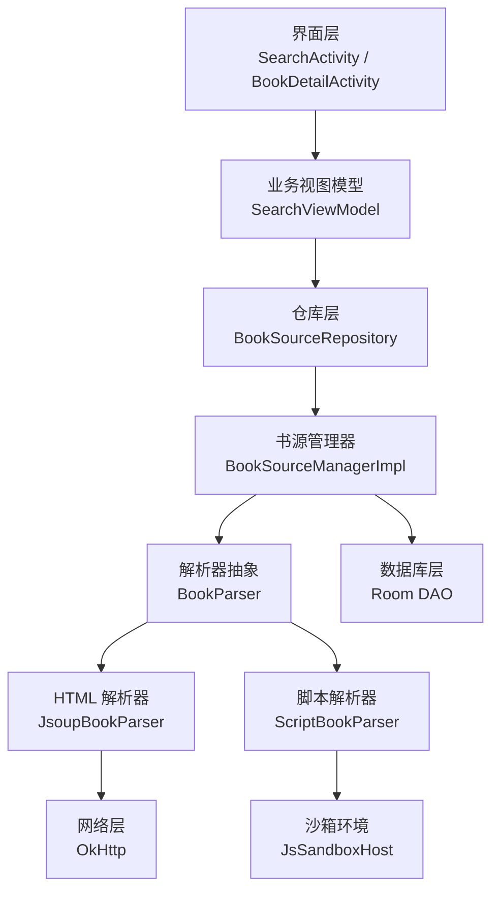

**图表来源**
- [BookSourceManager.kt:1-277](file://lib_book_common/src/main/java/com/ebook/common/analyze/source/BookSourceManager.kt#L1-L277)
- [BookParser.kt:1-30](file://lib_book_source/src/main/java/com/ebook/source/analyze/BookParser.kt#L1-L30)
- [BookSourceRepository.kt:1-199](file://module_find/src/main/java/com/ebook/find/repository/BookSourceRepository.kt#L1-L199)

**章节来源**
- [BookSourceManager.kt:1-277](file://lib_book_common/src/main/java/com/ebook/common/analyze/source/BookSourceManager.kt#L1-L277)
- [BookParser.kt:1-30](file://lib_book_source/src/main/java/com/ebook/source/analyze/BookParser.kt#L1-L30)
- [BookSourceRepository.kt:1-199](file://module_find/src/main/java/com/ebook/find/repository/BookSourceRepository.kt#L1-L199)

## 核心接口定义

### 书源解析器接口

`BookParser` 是所有书源解析器的统一抽象，定义了搜索、详情、目录、分类书库四类操作：

| 方法 | 参数 | 返回值 | 说明 |
| --- | --- | --- | --- |
| `searchBook` | `content`: 关键词, `page`: 页码 | `List<SearchBookEntity>` | 按书源规则搜索书籍 |
| `getBookInfo` | `bookShelf`: 书籍信息载体 | `BookShelfEntity` | 拉取并填充书籍详情 |
| `getChapterList` | `bookShelf`: 书籍信息载体 | `WebChapterEntity<BookShelfEntity>` | 获取章节目录及分页标记 |
| `getKindBook` | `url`: 分类地址, `page`: 页码 | `List<SearchBookEntity>` | 获取分类下的书籍列表 |
| `fetchLibraryData` | 无 | `LibraryEntity` | 拉取书城分类首页数据 |

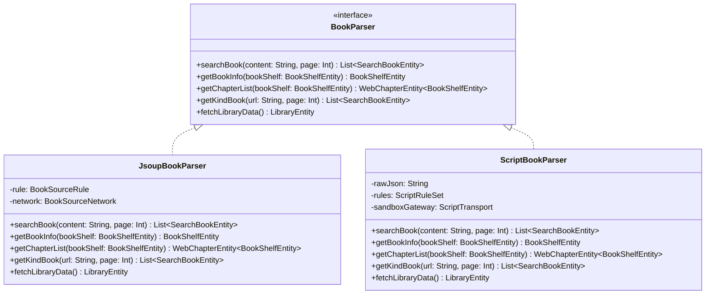

**图表来源**
- [BookParser.kt:1-30](file://lib_book_source/src/main/java/com/ebook/source/analyze/BookParser.kt#L1-L30)
- [JsoupBookParser.kt:1-513](file://lib_book_source/src/main/java/com/ebook/source/analyze/JsoupBookParser.kt#L1-L513)
- [ScriptBookParser.kt:1-468](file://lib_book_source/src/main/java/com/ebook/source/analyze/ScriptBookParser.kt#L1-L468)

### 书源管理器接口

`BookSourceManager` 是多书源清单与聚合搜索的唯一入口，承担以下职责：

| 方法 | 用途 | 关键约束 |
| --- | --- | --- |
| `getAllSources` | 获取全部书源（含禁用） | 仅返回原生规则书源 |
| `getEnabledSources` | 获取启用的原生规则书源 | 当前无生产调用方，保留接口 |
| `getSourceByUrl` | 按 URL 精确查找原生规则书源 | 脚本书源返回 `null` |
| `getParserFor` | 按 URL 获取解析器（带 LRU 缓存） | 本地书、缺失行、脏规则分别处理 |
| `searchAcross` | 对启用书源并发聚合搜索 | 并发上限 5，逐事件返回 |
| `addSource` | 新增或覆盖原生规则书源 | 主键命中即替换 |
| `addScriptSource` | 新增或覆盖脚本书源 | 原样落库 `rule_json` |
| `removeSource` | 删除任意一行书源 | 失败用 `Result` 表达 |
| `setEnabled` | 启用或禁用书源 | 禁用不切断已有归属 |
| `setDefaultSource` | 设置默认书源 | 自动启用被禁用的目标 |
| `observeSources` | 订阅书源清单（供管理页渲染） | 返回 `BookSourceItem`，含格式元数据 |
| `observeDefaultSource` | 订阅默认书源 | 无可用源时发 `null` |
| `importFromJson` | 将 JSON 解成规则对象 | 纯函数，不落库 |
| `exportToJson` | 导出美化 JSON | 用于社区交换 |

**章节来源**
- [BookSourceManager.kt:1-277](file://lib_book_common/src/main/java/com/ebook/common/analyze/source/BookSourceManager.kt#L1-L277)

## 多书源搜索 API

### 接口概述

多书源搜索通过 `BookSourceManager.searchAcross` 发起，是一个冷流：每次收集才查库、才发请求，收集结束即停。它不会共享状态，多个收集者会触发多轮全站请求。

#### 请求参数

| 参数 | 类型 | 必填 | 默认值 | 说明 |
| --- | --- | --- | --- | --- |
| `keyword` | `String` | 是 | — | 搜索关键词，原样交给各源解析器 |
| `page` | `Int` | 否 | 1 | 本轮向每条参与源请求的页码 |
| `skipSourceUrls` | `Set<String>` | 否 | `emptySet()` | 本轮不再请求的书源 URL 集合 |

#### 返回值

返回 `Flow<AggregateSearchEvent>`，按书源分批到达的事件序列。

#### 事件类型

| 事件 | 字段 | 含义 |
| --- | --- | --- |
| `SourceStarted` | `sourceUrl`, `sourceName` | 某书源开始解析 |
| `SourceResult` | `sourceUrl`, `books` | 某书源返回该页结果 |
| `SourceFailed` | `sourceUrl`, `error` | 某书源解析失败 |
| `SourceFinished` | `sourceUrl`, `hasMore` | 某书源本轮结束 |
| `AllFinished` | 无 | 本轮聚合结束，流完成 |

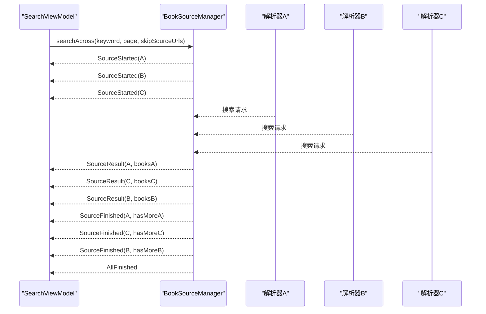

**图表来源**
- [BookSourceManager.kt:120-170](file://lib_book_common/src/main/java/com/ebook/common/analyze/source/BookSourceManager.kt#L120-L170)
- [AggregateSearchEvent.kt:1-75](file://lib_book_source/src/main/java/com/ebook/source/analyze/AggregateSearchEvent.kt#L1-L75)

### 搜索流程控制

搜索页的 `SearchViewModel` 负责：

1. 初始化书架快照，用于标记搜索结果是否已加入书架。
2. 启动聚合搜索流，消费 `AggregateSearchEvent` 并按 `noteUrl` 去重合并。
3. 维护每源独立翻页游标，只对尚未结束的源继续翻下一页。
4. 触底加载更多时跳过仍在运行的旧轮，避免共享集合交错写入。

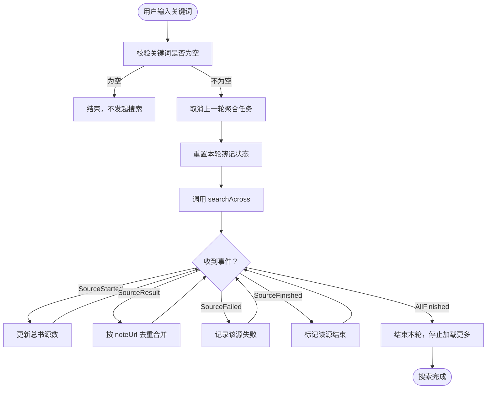

**图表来源**
- [SearchViewModel.kt:1-499](file://module_find/src/main/java/com/ebook/find/mvvm/viewmodel/SearchViewModel.kt#L1-L499)

**章节来源**
- [BookSourceManager.kt:120-170](file://lib_book_common/src/main/java/com/ebook/common/analyze/source/BookSourceManager.kt#L120-L170)
- [AggregateSearchEvent.kt:1-75](file://lib_book_source/src/main/java/com/ebook/source/analyze/AggregateSearchEvent.kt#L1-L75)
- [SearchViewModel.kt:1-499](file://module_find/src/main/java/com/ebook/find/mvvm/viewmodel/SearchViewModel.kt#L1-L499)

## 书籍详情获取 API

### 接口行为

书籍详情通过 `BookParser.getBookInfo` 获取。实现上：

- 原生规则解析器会从目标页面抓取书名、作者、简介、封面、目录链接等信息。
- 脚本解析器通过规则表达式从响应中提取对应字段。
- 解析完成后，结果写回传入的 `BookShelfEntity.bookInfo` 字段。

#### 输入

| 参数 | 类型 | 说明 |
| --- | --- | --- |
| `bookShelf` | `BookShelfEntity` | 包含书籍基本信息与归属标记的载体 |

#### 输出

返回同一份 `BookShelfEntity`，其中 `bookInfo` 字段被填充为完整书籍详情。

#### 关键字段

| 字段 | 类型 | 说明 |
| --- | --- | --- |
| `noteUrl` | `String` | 书籍唯一地址，作为主键与跨源标识 |
| `tag` | `String` | 书源归属 URL，决定后续使用哪个解析器 |
| `origin` | `String` | 书源名称，用于显示来源 |
| `name` | `String` | 书名 |
| `author` | `String` | 作者 |
| `introduce` | `String` | 简介 |
| `coverUrl` | `String` | 封面图地址 |
| `chapterUrl` | `String` | 目录页地址，未配置时回落 `noteUrl` |

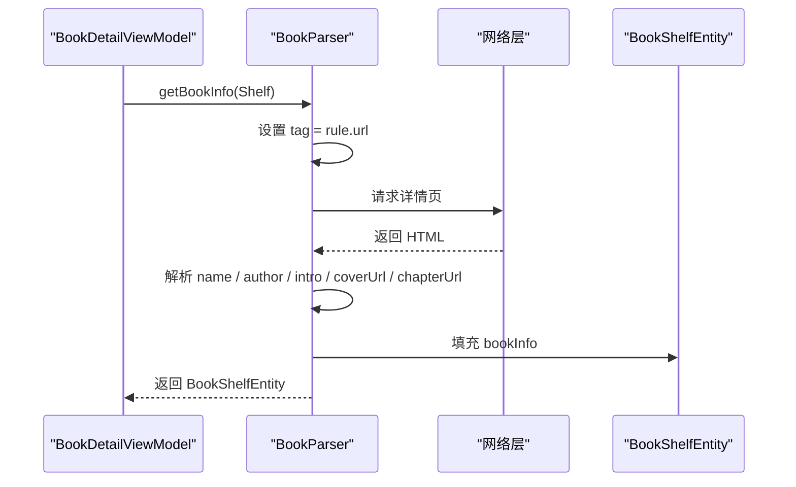

**图表来源**
- [JsoupBookParser.kt:1-513](file://lib_book_source/src/main/java/com/ebook/source/analyze/JsoupBookParser.kt#L1-L513)
- [BookShelfEntity.kt:1-83](file://lib_ebook_db/src/main/java/com/ebook/db/entity/BookShelfEntity.kt#L1-L83)

**章节来源**
- [BookParser.kt:1-30](file://lib_book_source/src/main/java/com/ebook/source/analyze/BookParser.kt#L1-L30)
- [JsoupBookParser.kt:1-513](file://lib_book_source/src/main/java/com/ebook/source/analyze/JsoupBookParser.kt#L1-L513)
- [BookShelfEntity.kt:1-83](file://lib_ebook_db/src/main/java/com/ebook/db/entity/BookShelfEntity.kt#L1-L83)

## 章节目录查询 API

### 接口行为

章节目录通过 `BookParser.getChapterList` 获取，返回 `WebChapterEntity<BookShelfEntity>`：

- `data` 是被填充了章节列表的 `BookShelfEntity`。
- `next` 表示是否还有下一章或下一页（原生规则解析器通常返回 `false`，因为目录采集会一次性遍历分页）。

#### 输入

同书籍详情接口，使用 `BookShelfEntity` 作为载体。

#### 输出

| 字段 | 类型 | 说明 |
| --- | --- | --- |
| `data` | `BookShelfEntity` | 填充后的书籍实体，含 `chapterList` |
| `next` | `Boolean` | 是否还有更多章节 |

#### 目录采集逻辑

- 优先使用 `bookInfo.chapterUrl`；若不存在则回落 `noteUrl`。
- 根据 `TocRule` 和页码参数分页抓取目录。
- 若规则声明倒序或详情页声明倒序，会对目录反转并重新计算索引。

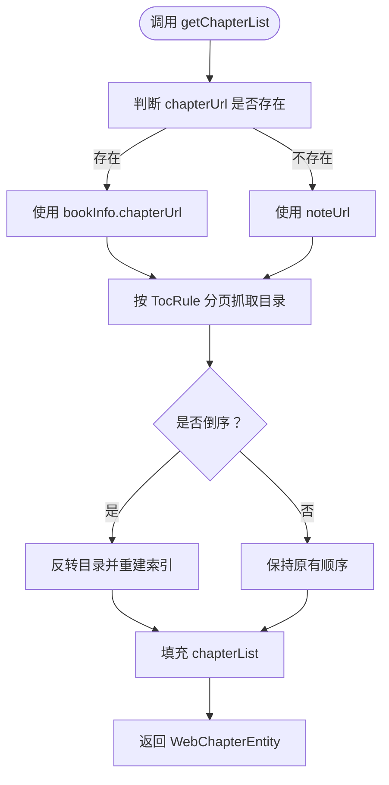

**图表来源**
- [JsoupBookParser.kt:1-513](file://lib_book_source/src/main/java/com/ebook/source/analyze/JsoupBookParser.kt#L1-L513)
- [WebChapterEntity.kt:1-11](file://lib_ebook_db/src/main/java/com/ebook/db/entity/WebChapterEntity.kt#L1-L11)

**章节来源**
- [BookParser.kt:1-30](file://lib_book_source/src/main/java/com/ebook/source/analyze/BookParser.kt#L1-L30)
- [JsoupBookParser.kt:1-513](file://lib_book_source/src/main/java/com/ebook/source/analyze/JsoupBookParser.kt#L1-L513)
- [WebChapterEntity.kt:1-11](file://lib_ebook_db/src/main/java/com/ebook/db/entity/WebChapterEntity.kt#L1-L11)

## 数据模型规范

### 搜索结果模型

`SearchBookEntity` 是搜索结果的内存传输模型，非数据库持久化实体：

| 字段 | 类型 | 必填 | 默认值 | 说明 |
| --- | --- | --- | --- | --- |
| `noteUrl` | `String` | 是 | `""` | 书籍唯一地址，用于去重与加书架 |
| `coverUrl` | `String` | 否 | `""` | 封面图地址 |
| `name` | `String` | 是 | `""` | 书名 |
| `author` | `String` | 否 | `""` | 作者 |
| `words` | `Long` | 否 | `0` | 字数 |
| `state` | `String` | 否 | `""` | 书籍状态 |
| `lastChapter` | `String` | 否 | `""` | 最新章节 |
| `add` | `Boolean` | 否 | `false` | 是否已加入书架 |
| `tag` | `String` | 是 | `""` | 书源归属 URL |
| `kind` | `String` | 否 | `""` | 分类标识 |
| `origin` | `String` | 是 | `""` | 书源名称 |
| `desc` | `String` | 否 | `""` | 简介或最新章节文本 |

### 书架实体模型

`BookShelfEntity` 是数据库中的书架项实体：

| 字段 | 类型 | 说明 |
| --- | --- | --- |
| `noteUrl` | `String` | 主键，对应书籍唯一地址 |
| `durChapter` | `Int` | 当前阅读章节 |
| `durChapterPage` | `Int` | 当前章节内页码 |
| `finalDate` | `Long` | 最后阅读时间 |
| `tag` | `String` | 书源归属标记 |
| `bookFormat` | `String?` | 本地书格式名 |
| `textCharset` | `String?` | 源文件编码 |
| `matchName` | `String?` | 主匹配名 |
| `matchAuthor` | `String?` | 匹配作者 |
| `bookInfo` | `BookInfoEntity?` | 由 UI 层填充的书籍详情 |
| `chapterList` | `List<ChapterListEntity>` | 由 UI 层填充的章节目录 |

### 章节承载模型

`WebChapterEntity<T>` 是章节解析结果的通用容器：

| 字段 | 类型 | 说明 |
| --- | --- | --- |
| `data` | `T` | 解析产物，通常为 `BookShelfEntity` |
| `next` | `Boolean` | 是否还有下一页或下一章 |

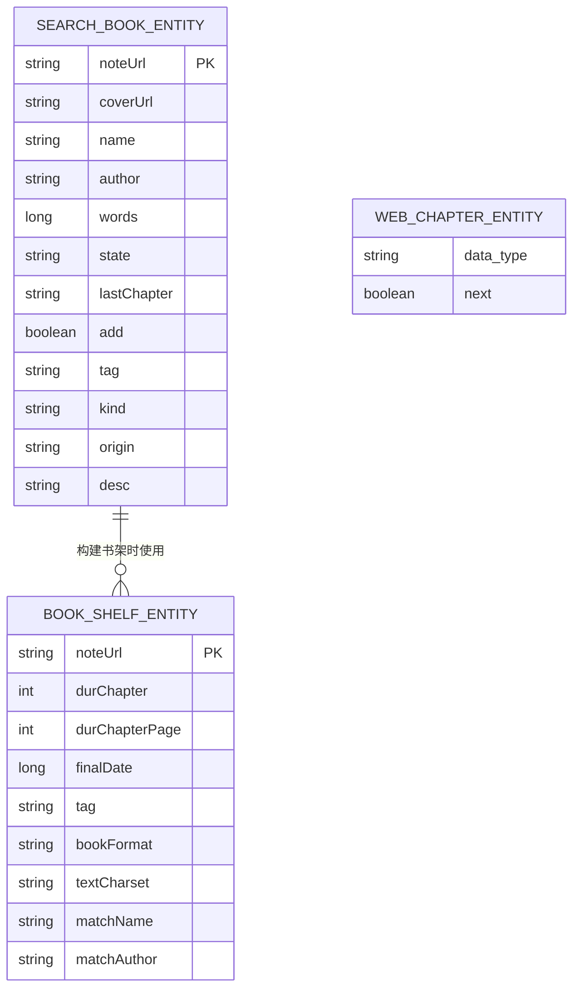

**图表来源**
- [SearchBookEntity.kt:1-25](file://lib_ebook_db/src/main/java/com/ebook/db/entity/SearchBookEntity.kt#L1-L25)
- [BookShelfEntity.kt:1-83](file://lib_ebook_db/src/main/java/com/ebook/db/entity/BookShelfEntity.kt#L1-L83)
- [WebChapterEntity.kt:1-11](file://lib_ebook_db/src/main/java/com/ebook/db/entity/WebChapterEntity.kt#L1-L11)

**章节来源**
- [SearchBookEntity.kt:1-25](file://lib_ebook_db/src/main/java/com/ebook/db/entity/SearchBookEntity.kt#L1-L25)
- [BookShelfEntity.kt:1-83](file://lib_ebook_db/src/main/java/com/ebook/db/entity/BookShelfEntity.kt#L1-L83)
- [WebChapterEntity.kt:1-11](file://lib_ebook_db/src/main/java/com/ebook/db/entity/WebChapterEntity.kt#L1-L11)

## 书源管理机制

### 书源类型

系统支持两种书源：

| 类型 | 描述 | 规则形式 | 特点 |
| --- | --- | --- | --- |
| 原生规则书源 | 基于 JSON 规则解析 HTML | `BookSourceRule` | 可预览、可导出、可导入 |
| 脚本书源 | 社区通用 JSON，内嵌可执行脚本 | 原始 JSON 字符串 | 灵活但需沙箱保护 |

### 书源生命周期

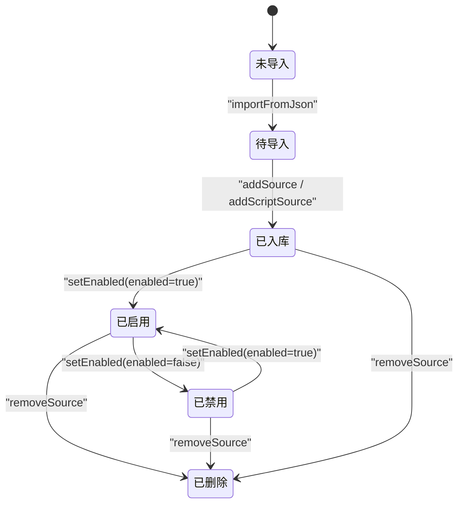

**图表来源**
- [BookSourceManager.kt:201-277](file://lib_book_common/src/main/java/com/ebook/common/analyze/source/BookSourceManager.kt#L201-L277)

### 默认源策略

默认源选择遵循以下规则：

1. 若无任何启用行，返回 `null`。
2. 优先选择 SharedPreferences 中命中的启用源。
3. 否则选择第一条启用源。
4. 原生规则书源与脚本书源在默认源候选中平等对待。
5. 设置默认源时，若目标处于禁用态，会自动启用。

### 解析器缓存

解析器按 URL 建立 LRU 缓存：

| 属性 | 值 | 说明 |
| --- | --- | --- |
| 容量 | 3 | 同时活跃书源数量级 |
| 淘汰策略 | 最久未使用 | 超出容量时淘汰旧解析器 |
| 线程安全 | 是 | 通过互斥锁保护 |
| 失效时机 | 增删改书源后 | 防止陈旧解析器继续生效 |

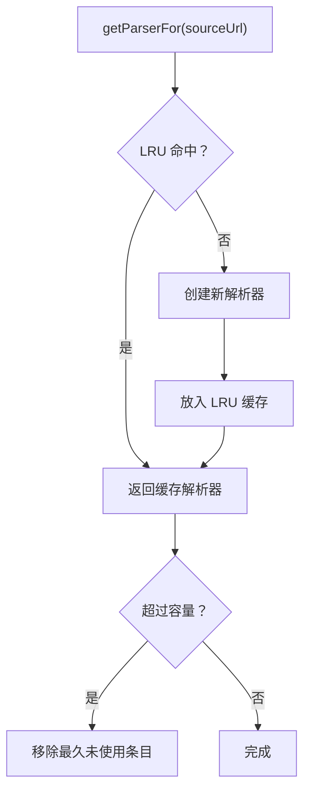

**图表来源**
- [BookSourceManagerImpl.kt:1-200](file://lib_book_common/src/main/java/com/ebook/common/analyze/source/BookSourceManagerImpl.kt#L1-L200)

**章节来源**
- [BookSourceManager.kt:201-277](file://lib_book_common/src/main/java/com/ebook/common/analyze/source/BookSourceManager.kt#L201-L277)
- [BookSourceManagerImpl.kt:1-200](file://lib_book_common/src/main/java/com/ebook/common/analyze/source/BookSourceManagerImpl.kt#L1-L200)

## 性能优化策略

### 并发搜索

聚合搜索对启用书源并发发起请求，并发上限为 5：

- 降低对第三方站点的压力，避免被封 IP 或触发验证码。
- 一条源失败不影响其他源的结果。
- 取消信号不会被吞掉，确保换关键词时旧轮及时终止。

### 结果去重

搜索结果按 `noteUrl` 全局去重：

- 同名同作者、来自不同书源的书籍会保留，为后续跨源切换提供备选。
- 同一书源内相同 `noteUrl` 的条目只保留一份。
- 去重发生在 VM 层，UI 以 `noteUrl` 作为 Compose 列表项 key，避免崩溃。

### 分页控制

每源独立维护翻页游标：

- 只有当某源一页带来新条目时，才会推进到下一页。
- 若某页没有带来新条目，即使后端返回 HTTP 200，也视为该源“到底”。
- 下一轮搜索只会对尚未结束的源发起请求。

### 书城缓存策略

书城分类数据采用“过期再验证”策略：

| 策略 | 行为 | 适用场景 |
| --- | --- | --- |
| `StaleWhileRevalidate` | 先返回缓存，再后台刷新 | 进入书城、切换书源 |
| `ForceNetwork` | 强制走网络，成功后回写缓存 | 下拉刷新 |

缓存有效期为 6 小时，且仅当至少一个分类有书时才落盘，避免把空结果长期缓存。

### 解析器缓存

解析器实例按 URL 做 LRU 缓存，减少频繁构造解析器和 Retrofit Service 的开销。

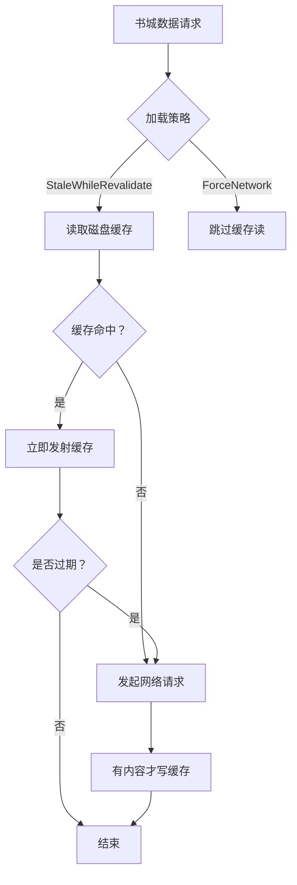

**图表来源**
- [BookSourceRepository.kt:1-199](file://module_find/src/main/java/com/ebook/find/repository/BookSourceRepository.kt#L1-L199)

**章节来源**
- [BookSourceManager.kt:120-170](file://lib_book_common/src/main/java/com/ebook/common/analyze/source/BookSourceManager.kt#L120-L170)
- [SearchViewModel.kt:1-499](file://module_find/src/main/java/com/ebook/find/mvvm/viewmodel/SearchViewModel.kt#L1-L499)
- [BookSourceRepository.kt:1-199](file://module_find/src/main/java/com/ebook/find/repository/BookSourceRepository.kt#L1-L199)

## 错误处理与异常

### 聚合搜索异常

| 情况 | 处理方式 |
| --- | --- |
| 单书源解析失败 | 发出 `SourceFailed`，随后仍发出 `SourceFinished(hasMore=false)` |
| 单书源网络异常 | 解析器内部捕获并返回空列表，表现为 `SourceResult([])` + `SourceFinished(false)` |
| 取消搜索 | `CancellationException` 原样上抛，不吞掉 |
| 全部书源失败 | 调用方自行决定展示错误态 |
| 零条启用书源 | 直接发出 `AllFinished` |

### 书源解析器异常

| 场景 | 行为 |
| --- | --- |
| 本地书调用 `getParserFor` | 返回 `null` |
| URL 在数据库中不存在 | 返回 `null` |
| 原生规则书源 `rule_json` 损坏 | 跳过该行并记录日志 |
| 脚本书源 `rule_json` 损坏 | 首次求值时抛出类型化异常，消息包含“脚本书源 JSON 无法解析” |
| 解析器网络异常 | 返回空列表，不向上抛出 |

### 书城数据加载异常

| 场景 | 行为 |
| --- | --- |
| 当前无可用书源 | 发射空 `LibraryEntity` 后正常结束 |
| 有书源但解析器不可用 | 抛出 `BookSourceNotFoundException` |
| 缓存存在且刷新失败 | 保留旧屏，记录警告日志 |
| 首拉无缓存且刷新失败 | 抛出异常给调用方 |

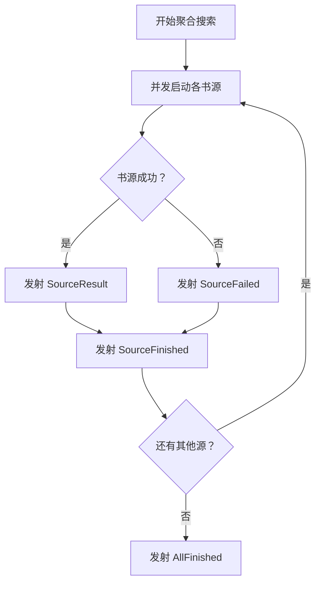

**图表来源**
- [AggregateSearchEvent.kt:1-75](file://lib_book_source/src/main/java/com/ebook/source/analyze/AggregateSearchEvent.kt#L1-L75)
- [BookSourceRepository.kt:1-199](file://module_find/src/main/java/com/ebook/find/repository/BookSourceRepository.kt#L1-L199)

**章节来源**
- [AggregateSearchEvent.kt:1-75](file://lib_book_source/src/main/java/com/ebook/source/analyze/AggregateSearchEvent.kt#L1-L75)
- [BookSourceManager.kt:120-170](file://lib_book_common/src/main/java/com/ebook/common/analyze/source/BookSourceManager.kt#L120-L170)
- [BookSourceRepository.kt:1-199](file://module_find/src/main/java/com/ebook/find/repository/BookSourceRepository.kt#L1-L199)

## 依赖关系分析

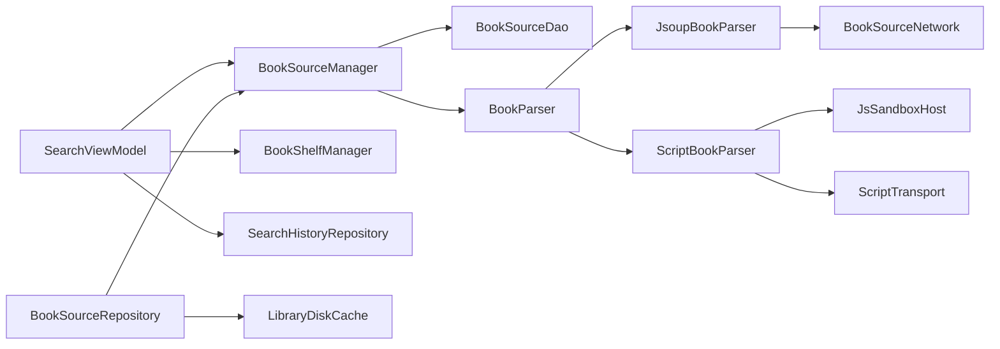

**图表来源**
- [SearchViewModel.kt:1-499](file://module_find/src/main/java/com/ebook/find/mvvm/viewmodel/SearchViewModel.kt#L1-L499)
- [BookSourceRepository.kt:1-199](file://module_find/src/main/java/com/ebook/find/repository/BookSourceRepository.kt#L1-L199)
- [BookSourceManagerImpl.kt:1-200](file://lib_book_common/src/main/java/com/ebook/common/analyze/source/BookSourceManagerImpl.kt#L1-L200)

**章节来源**
- [SearchViewModel.kt:1-499](file://module_find/src/main/java/com/ebook/find/mvvm/viewmodel/SearchViewModel.kt#L1-L499)
- [BookSourceRepository.kt:1-199](file://module_find/src/main/java/com/ebook/find/repository/BookSourceRepository.kt#L1-L199)
- [BookSourceManagerImpl.kt:1-200](file://lib_book_common/src/main/java/com/ebook/common/analyze/source/BookSourceManagerImpl.kt#L1-L200)

## 故障排查指南

### 搜索无结果

可能原因：

1. 没有启用任何书源。
2. 关键词过于宽泛或站点规则失效。
3. 所有书源都返回空页，被判定为“到底”。
4. `skipSourceUrls` 传入了过多 URL，导致本轮不再请求任何源。

排查建议：

- 检查 `observeDefaultSource` 是否返回 `null`。
- 检查 `AggregateSearchEvent.AllFinished` 是否在第一个事件中直接到达。
- 查看是否有大量 `SourceFailed`。
- 确认 `skipSourceUrls` 是否正确维护。

### 搜索结果重复

可能原因：

- 不同书源返回同名书籍属于预期行为，不应按书名去重。
- 同一书源内应通过 `noteUrl` 去重。
- Compose 列表项 key 必须唯一，否则直接崩溃。

### 书城空白

可能原因：

- 当前无可用书源。
- 书源规则损坏，解析器不可用。
- 缓存命中了空结果。
- 所有分类均无书。

排查建议：

- 区分“无源”与“源坏了”两种状态。
- 使用 `ForceNetwork` 模式绕过缓存。
- 检查缓存 TTL 是否过长。
- 确认 `ruleFind.kinds` 是否配置。

### 书源导入失败

可能原因：

- JSON 缺少 `name` 或 `url`。
- 脚本书源 JSON 无法解码。
- URL 已存在但格式不同。
- 网络层拒绝访问。

排查建议：

- 使用 `importFromJson` 先做纯解析预览。
- 检查 `getFormatByUrl` 是否返回预期格式。
- 确认 `addSource` 或 `addScriptSource` 的 `Result` 状态。

**章节来源**
- [SearchViewModel.kt:1-499](file://module_find/src/main/java/com/ebook/find/mvvm/viewmodel/SearchViewModel.kt#L1-L499)
- [BookSourceRepository.kt:1-199](file://module_find/src/main/java/com/ebook/find/repository/BookSourceRepository.kt#L1-L199)
- [BookSourceManager.kt:1-277](file://lib_book_common/src/main/java/com/ebook/common/analyze/source/BookSourceManager.kt#L1-L277)

## 总结

搜索与书源 API 围绕多书源聚合、可插拔解析器、稳定事件流和可控缓存展开。核心设计要点如下：

- **聚合搜索**以事件流形式返回结果，避免等待最慢书源，同时保证单源失败不污染其他源。
- **解析器抽象**屏蔽原生规则与脚本实现的差异，上层只需面对统一接口。
- **书源管理**将存储、默认源策略、解析器缓存集中在单一入口，避免分散状态。
- **分页与去重**在 ViewModel 层按 `noteUrl` 控制，既保证列表稳定性，又保留跨源切换空间。
- **书城缓存**采用过期再验证策略，兼顾首帧体验与数据新鲜度。
- **错误处理**分层明确：解析器吞网络异常，管理器收敛单源失败，仓库区分无源与源损坏。

对外部集成者而言，最重要的是理解 `SearchBookEntity.noteUrl` 是唯一可靠标识，`BookSourceManager.searchAcross` 返回的是事件流而非一次性数组，以及书源启用状态与书源归属是两个不同概念。