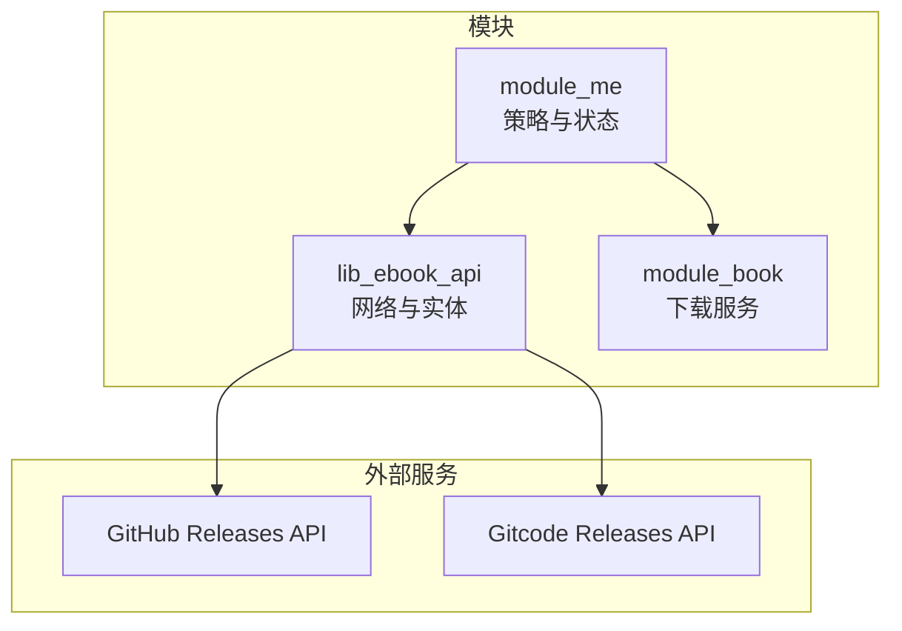
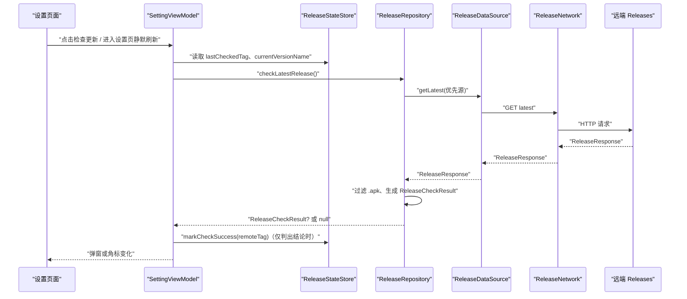
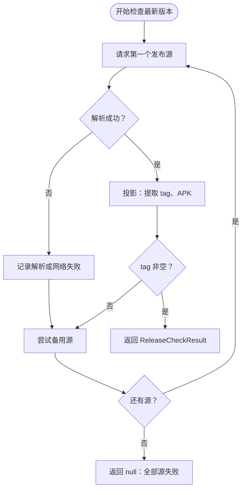
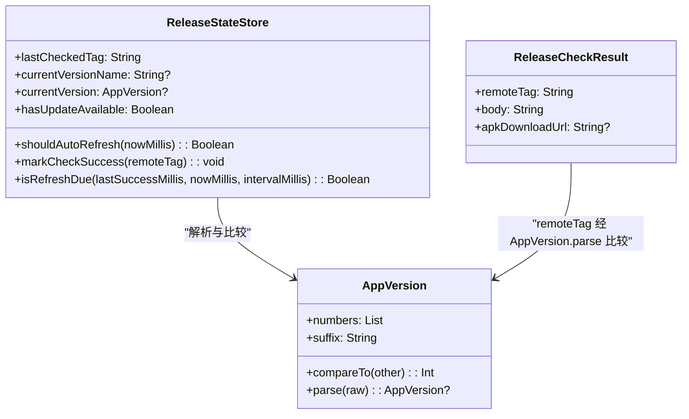
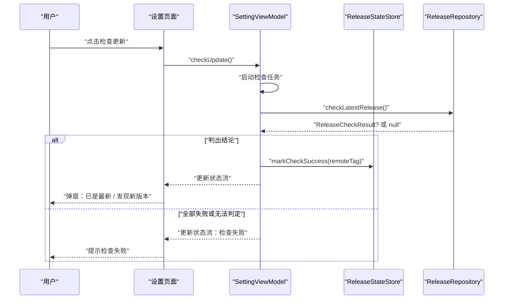
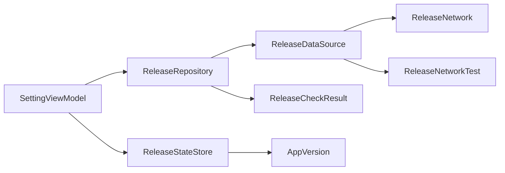

# 版本更新 API

<cite>
**本文引用的文件**   
- [ReleaseResponse.kt](file://lib_ebook_api/src/main/java/com/ebook/api/entity/ReleaseResponse.kt)
- [release_latest.json](file://lib_ebook_api/src/main/assets/release_latest.json)
- [ReleaseService.kt](file://lib_ebook_api/src/main/java/com/ebook/api/service/release/ReleaseService.kt)
- [ReleaseNetwork.kt](file://lib_ebook_api/src/main/java/com/ebook/api/service/release/ReleaseNetwork.kt)
- [ReleaseDataSource.kt](file://lib_ebook_api/src/main/java/com/ebook/api/service/release/ReleaseDataSource.kt)
- [ReleaseRepository.kt](file://module_me/src/main/java/com/ebook/me/repository/ReleaseRepository.kt)
- [ReleaseStateStore.kt](file://module_me/src/main/java/com/ebook/me/repository/ReleaseStateStore.kt)
- [AppVersion.kt](file://module_me/src/main/java/com/ebook/me/util/AppVersion.kt)
- [SettingViewModel.kt](file://module_me/src/main/java/com/ebook/me/mvvm/viewmodel/SettingViewModel.kt)
- [DownloadService.kt](file://module_book/src/main/java/com/ebook/book/service/DownloadService.kt)
- [0021-release-update-check-ownership.md](file://docs/adr/0021-release-update-check-ownership.md)
</cite>

## 目录
1. [简介](#简介)
2. [项目结构与职责边界](#项目结构与职责边界)
3. [核心组件](#核心组件)
4. [架构总览](#架构总览)
5. [详细组件分析](#详细组件分析)
6. [依赖关系分析](#依赖关系分析)
7. [性能与可用性特性](#性能与可用性特性)
8. [故障排查指南](#故障排查指南)
9. [结论](#结论)

## 简介
本文件面向“版本更新服务”的 API 与实现文档，覆盖以下范围：
- 应用版本检查接口：远端最新 Release 拉取、双源 failover、APK 附件过滤。
- 版本信息结构：版本号 tag、发布说明、APK 下载链接等字段语义。
- 版本比较与更新判断：本地版本与远端 tag 的比较、角标派生、静默刷新限频。
- 更新提示体验：主动检查弹窗、静默检查、无 APK 降级展示。
- 下载与安全：APK 下载入口、系统安装流程、签名与完整性校验建议。
- 兼容性、回滚与失败处理：断网、解析失败、取消、配额超时等异常路径。

本项目并未实现服务端版本的 REST API；版本检查是客户端向 GitHub/Gitcode 公开 Releases 接口发起请求，再由应用内部策略层决定如何提示用户。因此，“API 文档”同时描述网络契约（远端 JSON）与应用内 API（Repository/ViewModel/Store）。

## 项目结构与职责边界
版本更新功能横跨 `lib_ebook_api`（网络层）、`module_me`（策略与状态层）和 `module_book`（通用下载服务），职责如下：
- `lib_ebook_api`：定义远端 Release 实体、Retrofit Service、真实数据源与 mock 数据源。
- `module_me`：决定先打哪个源、何时检查、是否弹窗、角标如何显示、限频规则。
- `module_book`：提供通用的前台下载服务与通知体系，可用于安装包下载场景。

图表来源
- [ReleaseRepository.kt:1-126](file://module_me/src/main/java/com/ebook/me/repository/ReleaseRepository.kt#L1-L126)
- [ReleaseNetwork.kt:1-50](file://lib_ebook_api/src/main/java/com/ebook/api/service/release/ReleaseNetwork.kt#L1-L50)
- [ReleaseService.kt:1-25](file://lib_ebook_api/src/main/java/com/ebook/api/service/release/ReleaseService.kt#L1-L25)

章节来源
- [0021-release-update-check-ownership.md:1-36](file://docs/adr/0021-release-update-check-ownership.md#L1-L36)

## 核心组件
- `ReleaseResponse`：统一映射 GitHub/Gitcode 的 latest Release 响应。
- `ReleaseAsset`：Release 附件条目，用于筛选 `.apk`。
- `ReleaseService`：动态 `@Url` 的 Retrofit 接口。
- `ReleaseDataSource`：按端点拉取一次 latest 的数据源接口。
- `ReleaseNetwork`：真实网络实现，使用独立 OkHttp/Retrofit。
- `ReleaseNetworkTest`：mock 数据源，读取内置 `release_latest.json`。
- `ReleaseRepository`：发布源顺序、failover、APK 过滤、结果投影。
- `ReleaseCheckResult`：调用方可见的版本检查结论。
- `ReleaseStateStore`：上次检查 tag、成功时间、角标派生、7 天限频。
- `AppVersion`：可比较的版本号模型。
- `SettingViewModel`：设置页中触发检查、弹窗、角标与静默刷新的协调者。
- `DownloadService`：前台下载服务，可作为安装包下载的基础设施参考。

章节来源
- [ReleaseResponse.kt:1-45](file://lib_ebook_api/src/main/java/com/ebook/api/entity/ReleaseResponse.kt#L1-L45)
- [ReleaseService.kt:1-25](file://lib_ebook_api/src/main/java/com/ebook/api/service/release/ReleaseService.kt#L1-L25)
- [ReleaseDataSource.kt:1-20](file://lib_ebook_api/src/main/java/com/ebook/api/service/release/ReleaseDataSource.kt#L1-L20)
- [ReleaseNetwork.kt:1-50](file://lib_ebook_api/src/main/java/com/ebook/api/service/release/ReleaseNetwork.kt#L1-L50)
- [ReleaseRepository.kt:1-126](file://module_me/src/main/java/com/ebook/me/repository/ReleaseRepository.kt#L1-L126)
- [ReleaseStateStore.kt:1-129](file://module_me/src/main/java/com/ebook/me/repository/ReleaseStateStore.kt#L1-L129)
- [AppVersion.kt:1-87](file://module_me/src/main/java/com/ebook/me/util/AppVersion.kt#L1-L87)
- [SettingViewModel.kt:1-200](file://module_me/src/main/java/com/ebook/me/mvvm/viewmodel/SettingViewModel.kt#L1-L200)

## 架构总览
版本更新检查的整体流程如下：

图表来源
- [SettingViewModel.kt:1-200](file://module_me/src/main/java/com/ebook/me/mvvm/viewmodel/SettingViewModel.kt#L1-L200)
- [ReleaseRepository.kt:1-126](file://module_me/src/main/java/com/ebook/me/repository/ReleaseRepository.kt#L1-L126)
- [ReleaseDataSource.kt:1-20](file://lib_ebook_api/src/main/java/com/ebook/api/service/release/ReleaseDataSource.kt#L1-L20)
- [ReleaseNetwork.kt:1-50](file://lib_ebook_api/src/main/java/com/ebook/api/service/release/ReleaseNetwork.kt#L1-L50)

## 详细组件分析

### 版本检查网络接口与数据模型

#### 远端 JSON 契约
最新版本检查依赖 GitHub/Gitcode 的 `releases/latest` 返回体。本项目将两平台同构字段投影为 `ReleaseResponse`，关键结构如下：

| 字段 | 类型 | 是否必填 | 含义 |
|---|---|---:|---|
| `tag_name` | `String?` | 否 | 远端版本 tag，如 `V1.3.0`；比较基准 |
| `name` | `String?` | 否 | 发布名，当前未消费 |
| `body` | `String?` | 否 | 发布说明，Markdown 文本，UI 以纯文本展示 |
| `assets` | `List<ReleaseAsset>?` | 否 | 附件列表，需按扩展名筛选 APK |

`ReleaseAsset` 字段：

| 字段 | 类型 | 是否必填 | 含义 |
|---|---|---:|---|
| `name` | `String?` | 否 | 附件文件名 |
| `browser_download_url` | `String?` | 否 | 浏览器可直接访问的下载地址 |

注意：
- 所有字段均为可空，因为平台允许缺失。
- 资产中可能包含源码归档（zip/tar.gz），必须按 `.apk` 后缀过滤。
- 测试资产 `release_latest.json` 展示了带归档与 APK 的典型结构。

章节来源
- [ReleaseResponse.kt:1-45](file://lib_ebook_api/src/main/java/com/ebook/api/entity/ReleaseResponse.kt#L1-L45)
- [release_latest.json:1-19](file://lib_ebook_api/src/main/assets/release_latest.json#L1-L19)

#### Retrofit 接口
`ReleaseService.getLatest(@Url url)` 使用动态 URL，原因是 GitHub 与 Gitcode 的完整端点不同，无法收敛到单一 baseUrl。该接口不携带认证 token，也不包裹 ebook-server 的业务码信封。

章节来源
- [ReleaseService.kt:1-25](file://lib_ebook_api/src/main/java/com/ebook/api/service/release/ReleaseService.kt#L1-L25)

#### 数据源实现
- `ReleaseDataSource`：抽象“按端点取一次 latest”。
- `ReleaseNetwork`：真实实现，使用 `@Named("release")` 的 OkHttpClient 与独立 Retrofit。
- `ReleaseNetworkTest`：mock 实现，直接反序列化内置资产，用于 CI、离线开发与 mock flavor。

章节来源
- [ReleaseDataSource.kt:1-20](file://lib_ebook_api/src/main/java/com/ebook/api/service/release/ReleaseDataSource.kt#L1-L20)
- [ReleaseNetwork.kt:1-50](file://lib_ebook_api/src/main/java/com/ebook/api/service/release/ReleaseNetwork.kt#L1-L50)
- [ReleaseNetworkTest.kt:1-49](file://lib_ebook_api/src/main/java/com/ebook/api/service/release/ReleaseNetworkTest.kt#L1-L49)

### 版本检查策略层

`ReleaseRepository.checkLatestRelease()` 承担三项关键职责：
1. **源顺序与 failover**：优先 GitHub，再尝试 Gitcode。
2. **结果有效性判定**：远端 tag 为空视为该源无效，继续下一个源。
3. **APK 过滤**：只保留 `name` 以 `.apk` 结尾的附件；若无 APK，仍返回有效结果，但 `apkDownloadUrl` 为 null。

最终输出为 `ReleaseCheckResult`：

| 字段 | 类型 | 含义 |
|---|---|---|
| `remoteTag` | `String` | 远端 tag，比较前需做展示归一化 |
| `body` | `String` | 发布说明，平台无说明时为空串 |
| `apkDownloadUrl` | `String?` | 可直接打开的系统下载入口；null 表示本次发布没有 APK |

图表来源
- [ReleaseRepository.kt:1-126](file://module_me/src/main/java/com/ebook/me/repository/ReleaseRepository.kt#L1-L126)

章节来源
- [ReleaseRepository.kt:1-126](file://module_me/src/main/java/com/ebook/me/repository/ReleaseRepository.kt#L1-L126)

### 版本比较与更新状态

`AppVersion` 把 tag 与本地 `versionName` 解析为可比较对象：
- 支持 `V1.2.0`、`1.2`、`V1.2.3beta` 等形态。
- 数字段数量不限，逐段比较，缺失段按 0 补齐。
- 尾缀挂在最后一段数字之后，数字段相同才比较尾缀。
- `isOlderThan` 用于判断当前版本是否落后于远端版本。

`ReleaseStateStore` 负责：
- 存储上次成功检查到的远端 tag。
- 存储上次成功检查时间戳。
- 每次现场计算 `hasUpdateAvailable`，避免持久化错误结论。
- 提供 7 天限频窗口，控制设置页静默刷新。

图表来源
- [AppVersion.kt:1-87](file://module_me/src/main/java/com/ebook/me/util/AppVersion.kt#L1-L87)
- [ReleaseStateStore.kt:1-129](file://module_me/src/main/java/com/ebook/me/repository/ReleaseStateStore.kt#L1-L129)
- [ReleaseRepository.kt:1-126](file://module_me/src/main/java/com/ebook/me/repository/ReleaseRepository.kt#L1-L126)

章节来源
- [AppVersion.kt:1-87](file://module_me/src/main/java/com/ebook/me/util/AppVersion.kt#L1-L87)
- [ReleaseStateStore.kt:1-129](file://module_me/src/main/java/com/ebook/me/repository/ReleaseStateStore.kt#L1-L129)

### 设置页更新交互流程

`SettingViewModel` 是更新检查的用户侧编排者：
- 主动检查：用户点击“检查更新”，需要弹窗反馈。
- 静默检查：进入设置页且距上次成功检查超过 7 天时，后台刷新角标。
- 单飞任务：同一时刻最多一个检查任务，避免并发覆盖。
- 关闭即取消：用户关闭“检查中”弹窗时，取消在途任务，防止备用源再次弹出。
- “判不出结论不算成功”：远端 tag 解析失败或本地版本不可用，不会写入成功时间戳。

图表来源
- [SettingViewModel.kt:1-200](file://module_me/src/main/java/com/ebook/me/mvvm/viewmodel/SettingViewModel.kt#L1-L200)
- [ReleaseRepository.kt:1-126](file://module_me/src/main/java/com/ebook/me/repository/ReleaseRepository.kt#L1-L126)
- [ReleaseStateStore.kt:1-129](file://module_me/src/main/java/com/ebook/me/repository/ReleaseStateStore.kt#L1-L129)

章节来源
- [SettingViewModel.kt:1-200](file://module_me/src/main/java/com/ebook/me/mvvm/viewmodel/SettingViewModel.kt#L1-L200)

## 依赖关系分析

图表来源
- [SettingViewModel.kt:1-200](file://module_me/src/main/java/com/ebook/me/mvvm/viewmodel/SettingViewModel.kt#L1-L200)
- [ReleaseRepository.kt:1-126](file://module_me/src/main/java/com/ebook/me/repository/ReleaseRepository.kt#L1-L126)
- [ReleaseStateStore.kt:1-129](file://module_me/src/main/java/com/ebook/me/repository/ReleaseStateStore.kt#L1-L129)
- [ReleaseNetwork.kt:1-50](file://lib_ebook_api/src/main/java/com/ebook/api/service/release/ReleaseNetwork.kt#L1-L50)
- [ReleaseNetworkTest.kt:1-49](file://lib_ebook_api/src/main/java/com/ebook/api/service/release/ReleaseNetworkTest.kt#L1-L49)

### 耦合与内聚评估
- 高内聚：`ReleaseRepository` 专注发布源策略，`ReleaseStateStore` 专注状态与限频，`AppVersion` 专注版本比较。
- 低耦合：`ReleaseDataSource` 作为网络接缝，真实实现与 mock 实现可替换。
- 依赖方向清晰：UI → ViewModel → Repository/Store → DataSource → Network。
- 无循环依赖：Repository 不反向依赖 ViewModel，Store 不依赖网络。

## 性能与可用性特性

### 限频与缓存
- 静默刷新间隔为 7 天，避免每次进入设置页都发请求。
- 角标结论不持久化，升级安装后重新派生自动纠正。
- 检查任务单飞，避免重复网络请求。

### 失败恢复
- 首个源解析失败或网络异常时，切换到第二个源。
- 两个源均失败时返回 null，由 UI 提示“检查失败”。
- 协程取消原样抛出，避免页面销毁后继续触发备用源。

### 下载与安装
- 若 `apkDownloadUrl` 不为 null，UI 应引导用户通过系统下载器或浏览器打开安装包。
- 若为 null，UI 应收起一键下载按钮，并提示前往发布页手动下载。
- 项目中的 `DownloadService` 是针对书内容的下载服务；APK 安装一般由系统完成，不应复用书籍下载队列。

### 安全验证机制
当前仓库中：
- 未看到对 APK 的 MD5、SHA-256 或签名校验实现。
- 下载入口直接使用远端 `browser_download_url`，属于信任远端链接的模式。
- 建议在应用侧增加：
  - 下载完成后校验服务器提供的摘要。
  - Android 安装前校验 APK 签名与包名一致性。
  - 失败时拒绝安装并提示用户。

### 强制更新与可选更新
当前实现未暴露“强制更新”字段：
- 远端 Release 的 `tagName`、`body`、`assets` 被消费。
- 未消费 `force_update`、`min_version`、`download_size`、`md5` 等字段。
- 因此，现有代码只能区分“有新版本”和“无新版本”，不能根据后端指令强制阻断旧版本运行。

建议扩展方式：
- 在 `ReleaseResponse` 中增加可选字段，如 `force_update`、`min_compatible_version`、`download_size_bytes`、`sha256`。
- 在 `ReleaseRepository.project` 中解析这些字段，并在 `ReleaseCheckResult` 中透出。
- 在 `SettingViewModel` 中根据 `force_update` 决定是否阻止退出、是否要求立即安装。

## 故障排查指南

### 检查更新始终失败
可能原因：
- 远端 tag 为空或格式不可解析。
- 网络不可达或 DNS 解析失败。
- 响应体不是预期 JSON，导致序列化异常。
- 两个源均失败。

排查步骤：
1. 确认远端 `releases/latest` 返回正常。
2. 检查日志中是否出现“发布源响应解析失败”“发布源请求失败”“全部发布源均失败”。
3. 在 mock 环境下验证 Asset 与 `ReleaseResponse` 是否匹配。
4. 确认 `ReleaseRepository.RELEASE_ENDPOINTS` 指向正确仓库。

章节来源
- [ReleaseRepository.kt:1-126](file://module_me/src/main/java/com/ebook/me/repository/ReleaseRepository.kt#L1-L126)
- [ReleaseNetworkTest.kt:1-49](file://lib_ebook_api/src/main/java/com/ebook/api/service/release/ReleaseNetworkTest.kt#L1-L49)

### 有新版但没有下载按钮
可能原因：
- 远端发布没有 `.apk` 附件。
- 附件名称不以 `.apk` 结尾。

行为说明：
- 这不算源失败，仍可提示“发现新版本”，但 UI 应隐藏一键下载按钮。
- 文案应引导用户去发布页手动下载。

章节来源
- [ReleaseRepository.kt:1-126](file://module_me/src/main/java/com/ebook/me/repository/ReleaseRepository.kt#L1-L126)

### 角标长期不消失
可能原因：
- 之前误把“是否有新版本”作为布尔量落盘。
- 升级安装后未重新派生角标。

修复要点：
- 落盘只存远端 tag，不存结论布尔量。
- 设置页 `onResume` 调用角标刷新逻辑。

章节来源
- [ReleaseStateStore.kt:1-129](file://module_me/src/main/java/com/ebook/me/repository/ReleaseStateStore.kt#L1-L129)
- [0021-release-update-check-ownership.md:1-36](file://docs/adr/0021-release-update-check-ownership.md#L1-L36)

### 弹窗反复出现或关闭后又被弹出
可能原因：
- 多个检查任务并发。
- 用户关闭弹窗后，备用源请求仍在执行并覆盖状态。

修复要点：
- 使用单飞检查任务。
- 取消任务时原样抛出取消异常，使备用源不再继续。

章节来源
- [SettingViewModel.kt:1-200](file://module_me/src/main/java/com/ebook/me/mvvm/viewmodel/SettingViewModel.kt#L1-L200)
- [ReleaseRepository.kt:1-126](file://module_me/src/main/java/com/ebook/me/repository/ReleaseRepository.kt#L1-L126)

### 长时间下载闪退
虽然这是书籍下载服务的行为，但可作为 APK 下载服务的参考：
- Android 前台服务有时长配额限制。
- 配额用尽时应快速收尾，避免继续后台执行 IO。
- 状态变更应同步写入 replay 缓冲，避免回调竞态。

章节来源
- [DownloadService.kt:1-200](file://module_book/src/main/java/com/ebook/book/service/DownloadService.kt#L1-L200)

## 结论
本项目的版本更新服务采用“网络契约与应用策略分离”的设计：
- 网络层聚焦 GitHub/Gitcode 的 Release JSON，保持轻量、匿名、可 mock。
- 策略层聚焦发布源顺序、APK 过滤、版本比较、角标与限频。
- 状态层只存事实，不存派生结论，保证升级后自动校正。
- 当前实现支持“有新版本/无新版本”的基本流程，但不支持强制更新、文件大小、MD5、最小兼容版本等高级字段。

如需对外提供“版本更新 API”，应在服务端新增明确的 REST 接口，并在客户端增加对应的 DTO、校验、安全验证、强制更新与兼容性检查逻辑。当前仓库已具备完善的策略与状态基础，可在不破坏现有分层的前提下扩展。