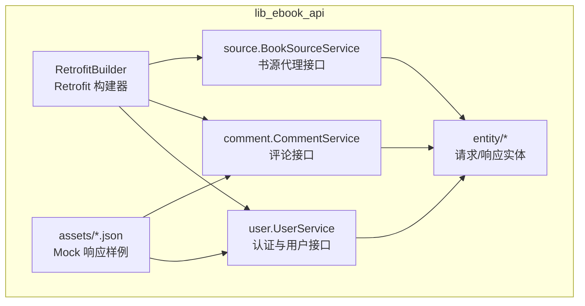
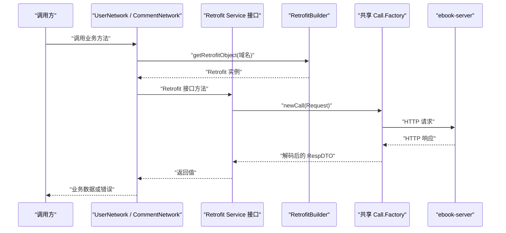
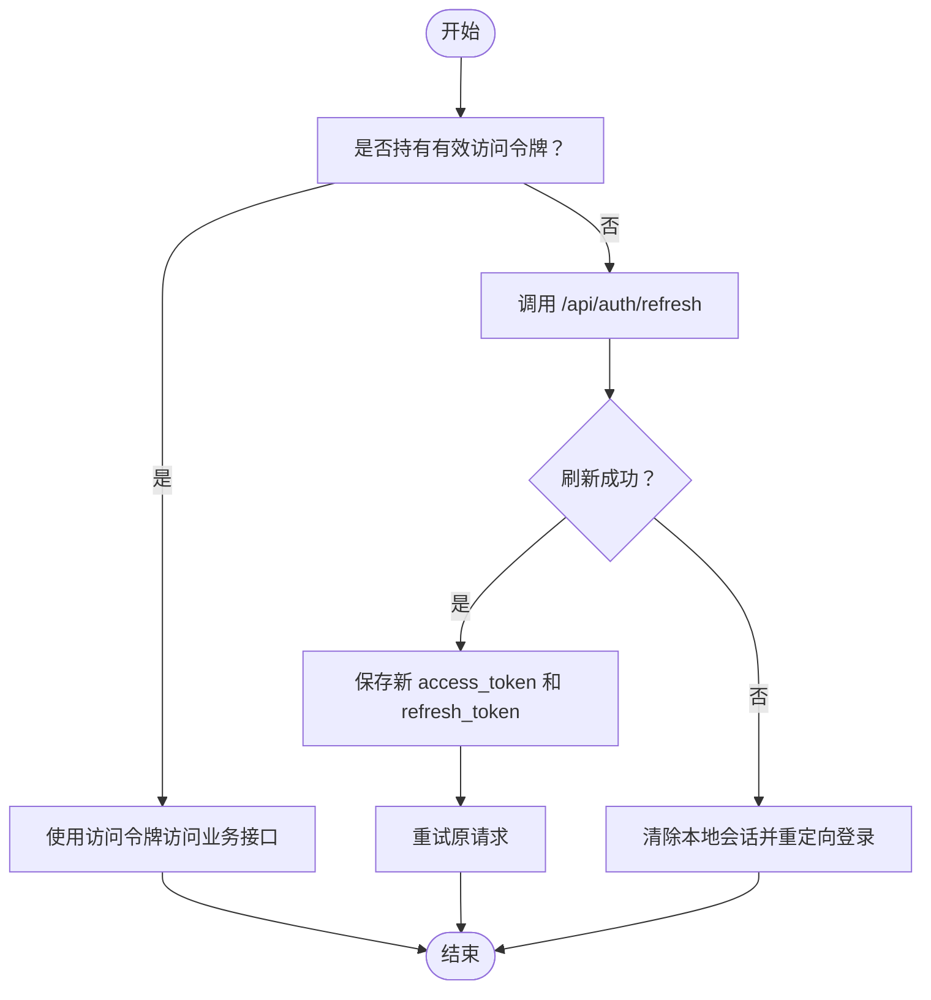
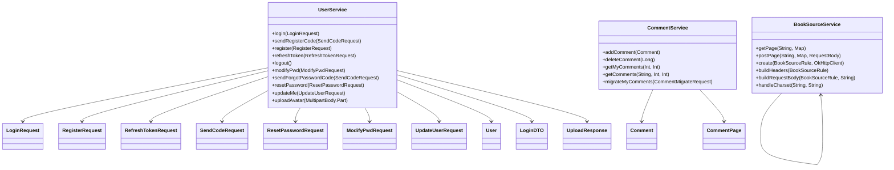
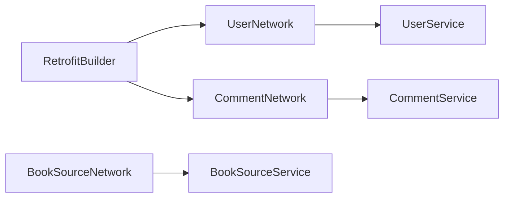

# 网络 API

<cite>
**本文引用的文件**   
- [RetrofitBuilder.kt](file://lib_ebook_api/src/main/java/com/ebook/api/RetrofitBuilder.kt)
- [UserService.kt](file://lib_ebook_api/src/main/java/com/ebook/api/service/user/UserService.kt)
- [UserNetwork.kt](file://lib_ebook_api/src/main/java/com/ebook/api/service/user/UserNetwork.kt)
- [CommentService.kt](file://lib_ebook_api/src/main/java/com/ebook/api/service/comment/CommentService.kt)
- [CommentNetwork.kt](file://lib_ebook_api/src/main/java/com/ebook/api/service/comment/CommentNetwork.kt)
- [BookSourceService.kt](file://lib_ebook_api/src/main/java/com/ebook/api/service/source/BookSourceService.kt)
- [BookSourceNetwork.kt](file://lib_ebook_api/src/main/java/com/ebook/api/service/source/BookSourceNetwork.kt)
- [LoginRequest.kt](file://lib_ebook_api/src/main/java/com/ebook/api/entity/LoginRequest.kt)
- [RegisterRequest.kt](file://lib_ebook_api/src/main/java/com/ebook/api/entity/RegisterRequest.kt)
- [RefreshTokenRequest.kt](file://lib_ebook_api/src/main/java/com/ebook/api/entity/RefreshTokenRequest.kt)
- [SendCodeRequest.kt](file://lib_ebook_api/src/main/java/com/ebook/api/entity/SendCodeRequest.kt)
- [ResetPasswordRequest.kt](file://lib_ebook_api/src/main/java/com/ebook/api/entity/ResetPasswordRequest.kt)
- [ModifyPwdRequest.kt](file://lib_ebook_api/src/main/java/com/ebook/api/entity/ModifyPwdRequest.kt)
- [UpdateUserRequest.kt](file://lib_ebook_api/src/main/java/com/ebook/api/entity/UpdateUserRequest.kt)
- [User.kt](file://lib_ebook_api/src/main/java/com/ebook/api/entity/User.kt)
- [LoginDTO.kt](file://lib_ebook_api/src/main/java/com/ebook/api/entity/LoginDTO.kt)
- [Comment.kt](file://lib_ebook_api/src/main/java/com/ebook/api/entity/Comment.kt)
- [CommentPage.kt](file://lib_ebook_api/src/main/java/com/ebook/api/entity/CommentPage.kt)
- [UploadResponse.kt](file://lib_ebook_api/src/main/java/com/ebook/api/entity/UploadResponse.kt)
- [ReleaseResponse.kt](file://lib_ebook_api/src/main/java/com/ebook/api/entity/ReleaseResponse.kt)
- [user_login.json](file://lib_ebook_api/src/main/assets/user_login.json)
- [user_register.json](file://lib_ebook_api/src/main/assets/user_register.json)
- [user_refresh_token.json](file://lib_ebook_api/src/main/assets/user_refresh_token.json)
- [user_modify_pwd.json](file://lib_ebook_api/src/main/assets/user_modify_pwd.json)
- [user_reset_password.json](file://lib_ebook_api/src/main/assets/user_reset_password.json)
- [user_send_code.json](file://lib_ebook_api/src/main/assets/user_send_code.json)
- [user_logout.json](file://lib_ebook_api/src/main/assets/user_logout.json)
- [chapter_comments.json](file://lib_ebook_api/src/main/assets/chapter_comments.json)
- [user_comments.json](file://lib_ebook_api/src/main/assets/user_comments.json)
</cite>

## 目录

1. [引言](#引言)
2. [项目结构](#项目结构)
3. [核心组件](#核心组件)
4. [架构总览](#架构总览)
5. [详细接口文档](#详细接口文档)
6. [认证机制与双 Token 刷新](#认证机制与双-token-刷新)
7. [依赖关系分析](#依赖关系分析)
8. [性能与优化建议](#性能与优化建议)
9. [故障排查指南](#故障排查指南)
10. [结论](#结论)

## 引言

本文面向 Android 小说阅读器项目的网络层，完整记录基于 Retrofit 的 REST API 契约和实现方式。重点覆盖三类服务：

- **认证与用户服务**：登录、注册、验证码、刷新 token、登出、修改密码、重置密码、更新用户信息、头像上传。
- **评论服务**：创建评论、删除评论、查询章节评论、查询我的评论、迁移旧键评论。
- **书源代理服务**：根据书源规则对第三方网站发起 GET/POST 请求，并处理动态 URL、自定义请求头和字符集。

所有服务端响应统一使用 `RespDTO` 包装体，业务数据位于 `data` 字段；错误码由上层统一解析，客户端 DTO 通过 kotlinx.serialization 与后端蛇形字段映射。

## 项目结构

网络相关代码集中在 `lib_ebook_api` 模块中，按“服务接口 + 网络适配层 + 实体模型 + 资源样例”组织：

**图表来源**
- [RetrofitBuilder.kt:1-45](file://lib_ebook_api/src/main/java/com/ebook/api/RetrofitBuilder.kt#L1-L45)
- [UserService.kt:1-72](file://lib_ebook_api/src/main/java/com/ebook/api/service/user/UserService.kt#L1-L72)
- [CommentService.kt:1-62](file://lib_ebook_api/src/main/java/com/ebook/api/service/comment/CommentService.kt#L1-L62)
- [BookSourceService.kt:1-92](file://lib_ebook_api/src/main/java/com/ebook/api/service/source/BookSourceService.kt#L1-L92)

**节内来源**
- [RetrofitBuilder.kt:1-45](file://lib_ebook_api/src/main/java/com/ebook/api/RetrofitBuilder.kt#L1-L45)

## 核心组件

### Retrofit 构建器

`RetrofitBuilder` 是应用统一的 Retrofit 工厂。它不直接持有 `OkHttpClient`，而是通过注入的 `Lazy<Call.Factory>` 复用 lib-common 提供的共享调用工厂，从而共享拦截器链、调试日志和白名单策略。

关键设计要点：

| 关注点 | 行为 |
| --- | --- |
| JSON 转换器 | 优先注册 kotlinx.serialization 转换器，复用 Hilt 注入的 `Json` 配置，保证 `ignoreUnknownKeys` 等策略与 mock 链路一致。 |
| 标量转换器 | 在 JSON 转换器之后追加 `ScalarsConverterFactory`，用于返回原始字符串的场景（如书源 HTML）。 |
| 基础地址 | 每个 Network 类根据业务域名单独构造 Retrofit 实例，避免认证域与书源域互相污染。 |
| 循环依赖防护 | 使用 `dagger.Lazy` 延迟获取 `Call.Factory`，避免 Hilt 循环依赖。 |

**节内来源**
- [RetrofitBuilder.kt:1-45](file://lib_ebook_api/src/main/java/com/ebook/api/RetrofitBuilder.kt#L1-L45)

### 用户网络适配层

`UserNetwork` 将 `UserService` 暴露为数据源，负责把 Retrofit 调用结果透传给上层 Repository。它使用用户服务的域名拼接基础 URL，并通过 `retrofitBuilder.getRetrofitObject(...)` 创建实例。

| 职责 | 说明 |
| --- | --- |
| 域名隔离 | 用户认证相关接口使用独立主机名和端口。 |
| 方法透传 | 所有 suspend 函数直接委托给 Retrofit 接口。 |
| 多部分上传 | 头像上传通过 `MultipartBody.Part` 传入。 |

**节内来源**
- [UserNetwork.kt:1-67](file://lib_ebook_api/src/main/java/com/ebook/api/service/user/UserNetwork.kt#L1-L67)

### 评论网络适配层

`CommentNetwork` 提供评论查询与迁移能力，其中查询评论时会将 Kotlin 集合参数转换为服务端要求的逗号分隔字符串。该转换逻辑还包含去重和上限截断，以避免超过服务端最大过滤键数量导致错误。

**节内来源**
- [CommentNetwork.kt:1-63](file://lib_ebook_api/src/main/java/com/ebook/api/service/comment/CommentNetwork.kt#L1-L63)

### 书源网络适配层

`BookSourceNetwork` 不是传统业务 API，而是对第三方书源网站的通用 HTTP 代理。它根据 `BookSourceRule` 决定目标 URL、HTTP 方法、请求体和字符集，并把响应交给上层脚本解析器。

**节内来源**
- [BookSourceNetwork.kt:1-34](file://lib_ebook_api/src/main/java/com/ebook/api/service/source/BookSourceNetwork.kt#L1-L34)
- [BookSourceService.kt:1-92](file://lib_ebook_api/src/main/java/com/ebook/api/service/source/BookSourceService.kt#L1-L92)

## 架构总览

下图展示从调用方到 Retrofit 的网络调用路径：

**图表来源**
- [RetrofitBuilder.kt:15-45](file://lib_ebook_api/src/main/java/com/ebook/api/RetrofitBuilder.kt#L15-L45)
- [UserNetwork.kt:12-24](file://lib_ebook_api/src/main/java/com/ebook/api/service/user/UserNetwork.kt#L12-L24)
- [CommentNetwork.kt:13-25](file://lib_ebook_api/src/main/java/com/ebook/api/service/comment/CommentNetwork.kt#L13-L25)

## 详细接口文档

### 统一响应格式

所有 ebook-server 接口返回 `RespDTO<T>`，典型结构如下：

| 字段 | 类型 | 含义 |
| --- | --- | --- |
| `code` | 字符串 | 业务状态码；成功示例为 `00000`。 |
| `error` | 字符串 | 错误描述；成功时为空字符串。 |
| `data` | T 或 null | 业务数据；部分端点成功时可能为 null。 |

客户端不应仅依据 HTTP 状态码判断业务成功与否，需要同时解析 `code` 与 `error`。

**节内来源**
- [user_login.json:1-15](file://lib_ebook_api/src/main/assets/user_login.json#L1-L15)
- [user_register.json:1-5](file://lib_ebook_api/src/main/assets/user_register.json#L1-L5)
- [user_refresh_token.json:1-8](file://lib_ebook_api/src/main/assets/user_refresh_token.json#L1-L8)

---

### 认证与用户服务

#### 登录

| 属性 | 值 |
| --- | --- |
| 方法 | POST |
| URL | `/api/auth/login` |
| 内容类型 | `application/json;charset=UTF-8` |
| 鉴权 | 不需要 |
| 请求体 | `LoginRequest` |
| 响应体 | `RespDTO<LoginDTO>` |

**请求体字段**

| 字段 | 类型 | 必填 | 说明 |
| --- | --- | --- | --- |
| `email` | 字符串 | 是 | 邮箱作为登录主标识 |
| `password` | 字符串 | 是 | 登录密码 |

**成功响应中的 data 结构**

| 字段 | 类型 | 说明 |
| --- | --- | --- |
| `token` | 字符串 | 访问令牌 |
| `refresh_token` | 字符串 | 刷新令牌 |
| `user.uid` | 数字 | 用户 ID |
| `user.username` | 字符串 | 用户名 |
| `user.nickname` | 字符串 | 昵称 |
| `user.avatar` | 字符串 | 头像地址 |
| `user.email` | 字符串 | 邮箱 |

**失败示例**

成功时 `error` 为空字符串；失败时 `code` 非 `00000`，`error` 携带错误描述。

**节内来源**
- [UserService.kt:16-20](file://lib_ebook_api/src/main/java/com/ebook/api/service/user/UserService.kt#L16-L20)
- [LoginRequest.kt:1-15](file://lib_ebook_api/src/main/java/com/ebook/api/entity/LoginRequest.kt#L1-L15)
- [LoginDTO.kt:1-16](file://lib_ebook_api/src/main/java/com/ebook/api/entity/LoginDTO.kt#L1-L16)
- [user_login.json:1-15](file://lib_ebook_api/src/main/assets/user_login.json#L1-L15)

---

#### 发送注册验证码

| 属性 | 值 |
| --- | --- |
| 方法 | POST |
| URL | `/api/auth/send-code` |
| 内容类型 | `application/json;charset=UTF-8` |
| 鉴权 | 不需要 |
| 请求体 | `SendCodeRequest` |
| 响应体 | `RespDTO<Unit>` |

**请求体字段**

| 字段 | 类型 | 必填 | 说明 |
| --- | --- | --- | --- |
| `email` | 字符串 | 是 | 接收验证码的目标邮箱 |

**节内来源**
- [UserService.kt:22-27](file://lib_ebook_api/src/main/java/com/ebook/api/service/user/UserService.kt#L22-L27)
- [SendCodeRequest.kt:1-13](file://lib_ebook_api/src/main/java/com/ebook/api/entity/SendCodeRequest.kt#L1-L13)
- [user_send_code.json:1-5](file://lib_ebook_api/src/main/assets/user_send_code.json#L1-L5)

---

#### 注册

| 属性 | 值 |
| --- | --- |
| 方法 | POST |
| URL | `/api/auth/register` |
| 内容类型 | `application/json;charset=UTF-8` |
| 鉴权 | 不需要 |
| 请求体 | `RegisterRequest` |
| 响应体 | `RespDTO<Unit>` |

**请求体字段**

| 字段 | 类型 | 必填 | 说明 |
| --- | --- | --- | --- |
| `email` | 字符串 | 是 | 账号主标识 |
| `code` | 字符串 | 是 | 6 位邮箱验证码 |
| `password` | 字符串 | 是 | 登录密码 |

注意：注册成功后不会返回 token，用户需要主动调用登录接口。

**节内来源**
- [UserService.kt:29-34](file://lib_ebook_api/src/main/java/com/ebook/api/service/user/UserService.kt#L29-L34)
- [RegisterRequest.kt:1-17](file://lib_ebook_api/src/main/java/com/ebook/api/entity/RegisterRequest.kt#L1-L17)
- [user_register.json:1-5](file://lib_ebook_api/src/main/assets/user_register.json#L1-L5)

---

#### 刷新 Token

| 属性 | 值 |
| --- | --- |
| 方法 | POST |
| URL | `/api/auth/refresh` |
| 内容类型 | `application/json;charset=UTF-8` |
| 鉴权 | 不需要 |
| 请求体 | `RefreshTokenRequest` |
| 响应体 | `RespDTO<LoginDTO>` |

**请求体字段**

| 字段 | 类型 | 必填 | 说明 |
| --- | --- | --- | --- |
| `refresh_token` | 字符串 | 是 | 线上键名为 `refresh_token` |

**成功响应中的 data 结构**

| 字段 | 类型 | 说明 |
| --- | --- | --- |
| `token` | 字符串 | 新的访问令牌 |
| `refresh_token` | 字符串 | 新的刷新令牌 |

**节内来源**
- [UserService.kt:36-41](file://lib_ebook_api/src/main/java/com/ebook/api/service/user/UserService.kt#L36-L41)
- [RefreshTokenRequest.kt:1-15](file://lib_ebook_api/src/main/java/com/ebook/api/entity/RefreshTokenRequest.kt#L1-L15)
- [LoginDTO.kt:1-16](file://lib_ebook_api/src/main/java/com/ebook/api/entity/LoginDTO.kt#L1-L16)
- [user_refresh_token.json:1-8](file://lib_ebook_api/src/main/assets/user_refresh_token.json#L1-L8)

---

#### 登出

| 属性 | 值 |
| --- | --- |
| 方法 | POST |
| URL | `/api/auth/logout` |
| 内容类型 | `application/json;charset=UTF-8` |
| 鉴权 | 需要 |
| 请求体 | 无 |
| 响应体 | `RespDTO<Unit>` |

**节内来源**
- [UserService.kt:43-47](file://lib_ebook_api/src/main/java/com/ebook/api/service/user/UserService.kt#L43-L47)
- [user_logout.json:1-5](file://lib_ebook_api/src/main/assets/user_logout.json#L1-L5)

---

#### 已登录修改密码

| 属性 | 值 |
| --- | --- |
| 方法 | PUT |
| URL | `/api/users/me/password` |
| 内容类型 | `application/json;charset=UTF-8` |
| 鉴权 | 需要 |
| 请求体 | `ModifyPwdRequest` |
| 响应体 | `RespDTO<Unit>` |

**请求体字段**

| 字段 | 类型 | 必填 | 说明 |
| --- | --- | --- | --- |
| `old_password` | 字符串 | 是 | 旧密码 |
| `new_password` | 字符串 | 是 | 新密码 |

**节内来源**
- [UserService.kt:49-53](file://lib_ebook_api/src/main/java/com/ebook/api/service/user/UserService.kt#L49-L53)
- [ModifyPwdRequest.kt:1-18](file://lib_ebook_api/src/main/java/com/ebook/api/entity/ModifyPwdRequest.kt#L1-L18)
- [user_modify_pwd.json:1-5](file://lib_ebook_api/src/main/assets/user_modify_pwd.json#L1-L5)

---

#### 发送忘记密码验证码

| 属性 | 值 |
| --- | --- |
| 方法 | POST |
| URL | `/api/auth/forgot-password/send-code` |
| 内容类型 | `application/json;charset=UTF-8` |
| 鉴权 | 不需要 |
| 请求体 | `SendCodeRequest` |
| 响应体 | `RespDTO<Unit>` |

**节内来源**
- [UserService.kt:55-59](file://lib_ebook_api/src/main/java/com/ebook/api/service/user/UserService.kt#L55-L59)
- [SendCodeRequest.kt:1-13](file://lib_ebook_api/src/main/java/com/ebook/api/entity/SendCodeRequest.kt#L1-L13)

---

#### 验证码重置密码

| 属性 | 值 |
| --- | --- |
| 方法 | POST |
| URL | `/api/auth/forgot-password/reset` |
| 内容类型 | `application/json;charset=UTF-8` |
| 鉴权 | 不需要 |
| 请求体 | `ResetPasswordRequest` |
| 响应体 | `RespDTO<Unit>` |

**请求体字段**

| 字段 | 类型 | 必填 | 说明 |
| --- | --- | --- | --- |
| `email` | 字符串 | 是 | 账号邮箱 |
| `code` | 字符串 | 是 | 6 位邮箱验证码 |
| `new_password` | 字符串 | 是 | 新密码 |

**节内来源**
- [UserService.kt:61-65](file://lib_ebook_api/src/main/java/com/ebook/api/service/user/UserService.kt#L61-L65)
- [ResetPasswordRequest.kt:1-19](file://lib_ebook_api/src/main/java/com/ebook/api/entity/ResetPasswordRequest.kt#L1-L19)
- [user_reset_password.json:1-5](file://lib_ebook_api/src/main/assets/user_reset_password.json#L1-L5)

---

#### 更新当前用户信息

| 属性 | 值 |
| --- | --- |
| 方法 | PUT |
| URL | `/api/users/me` |
| 内容类型 | `application/json;charset=UTF-8` |
| 鉴权 | 需要 |
| 请求体 | `UpdateUserRequest` |
| 响应体 | `RespDTO<User>` |

**请求体字段**

| 字段 | 类型 | 必填 | 说明 |
| --- | --- | --- | --- |
| `avatar` | 字符串 | 否 | 头像 URL，先通过上传接口获取 |
| `email` | 字符串 | 否 | 邮箱 |
| `nickname` | 字符串 | 否 | 昵称 |
| `username` | 字符串 | 否 | 用户名 |

服务端采用“非空即更新”的部分更新语义。

**节内来源**
- [UserService.kt:67-71](file://lib_ebook_api/src/main/java/com/ebook/api/service/user/UserService.kt#L67-L71)
- [UpdateUserRequest.kt:1-22](file://lib_ebook_api/src/main/java/com/ebook/api/entity/UpdateUserRequest.kt#L1-L22)
- [User.kt:1-29](file://lib_ebook_api/src/main/java/com/ebook/api/entity/User.kt#L1-L29)

---

#### 上传头像

| 属性 | 值 |
| --- | --- |
| 方法 | POST |
| URL | `/api/uploads/avatar` |
| 编码 | `multipart/form-data` |
| 鉴权 | 需要 |
| 表单字段 | `avatar` |
| 支持格式 | JPG、PNG、WebP |
| 文件大小 | 不超过 5MB |
| 响应体 | `RespDTO<UploadResponse>` |

**流程说明**

1. 调用上传接口，传入头像文件。
2. 从响应中取得可访问 URL。
3. 调用更新用户接口，把 URL 写入 `avatar` 字段。

**节内来源**
- [UserService.kt:73-72](file://lib_ebook_api/src/main/java/com/ebook/api/service/user/UserService.kt#L73-L72)
- [UploadResponse.kt:1-13](file://lib_ebook_api/src/main/java/com/ebook/api/entity/UploadResponse.kt#L1-L13)

---

### 评论服务

#### 创建评论

| 属性 | 值 |
| --- | --- |
| 方法 | POST |
| URL | `/api/comments` |
| 内容类型 | `application/json;charset=UTF-8` |
| 鉴权 | 需要 |
| 请求体 | `Comment` |
| 响应体 | `RespDTO<Comment>` |

**请求体字段**

| 字段 | 类型 | 必填 | 说明 |
| --- | --- | --- | --- |
| `id` | 数字 | 否 | 服务端生成 |
| `user` | 对象 | 否 | 评论者信息 |
| `comment_key` | 字符串 | 是 | M2 新增聚合键 |
| `chapter_url` | 字符串 | 否 | 已废弃，保留兼容 |
| `chapter_name` | 字符串 | 否 | 章节名称 |
| `book_name` | 字符串 | 否 | 书籍名称 |
| `content` | 字符串 | 是 | 评论内容 |
| `add_time` | 字符串 | 否 | 添加时间 |

**节内来源**
- [CommentService.kt:18-25](file://lib_ebook_api/src/main/java/com/ebook/api/service/comment/CommentService.kt#L18-L25)
- [Comment.kt:1-39](file://lib_ebook_api/src/main/java/com/ebook/api/entity/Comment.kt#L1-L39)

---

#### 删除评论

| 属性 | 值 |
| --- | --- |
| 方法 | DELETE |
| URL | `/api/comments/{id}` |
| 内容类型 | `application/json;charset=UTF-8` |
| 鉴权 | 需要 |
| 路径参数 | `id` |
| 响应体 | `RespDTO<Unit>` |

权限说明：仅本人或管理员可删除；A0303 无权删除。

**节内来源**
- [CommentService.kt:27-32](file://lib_ebook_api/src/main/java/com/ebook/api/service/comment/CommentService.kt#L27-L32)

---

#### 我的评论列表

| 属性 | 值 |
| --- | --- |
| 方法 | GET |
| URL | `/api/comments/my` |
| 内容类型 | `application/json;charset=UTF-8` |
| 鉴权 | 需要 |
| 查询参数 | `page`、`page_size` |
| 响应体 | `RespDTO<CommentPage>` |

**查询参数**

| 参数 | 类型 | 默认值 | 说明 |
| --- | --- | --- | --- |
| `page` | 整数 | 未显式设置默认值 | 页码 |
| `page_size` | 整数 | 未显式设置默认值 | 每页大小 |

**节内来源**
- [CommentService.kt:34-40](file://lib_ebook_api/src/main/java/com/ebook/api/service/comment/CommentService.kt#L34-L40)
- [CommentPage.kt:1-18](file://lib_ebook_api/src/main/java/com/ebook/api/entity/CommentPage.kt#L1-L18)
- [user_comments.json:1-81](file://lib_ebook_api/src/main/assets/user_comments.json#L1-L81)

---

#### 查询章节评论

| 属性 | 值 |
| --- | --- |
| 方法 | GET |
| URL | `/api/comments` |
| 内容类型 | `application/json;charset=UTF-8` |
| 鉴权 | 不需要 |
| 查询参数 | `comment_keys`、`page`、`page_size` |
| 响应体 | `RespDTO<CommentPage>` |

**查询参数**

| 参数 | 类型 | 说明 |
| --- | --- | --- |
| `comment_keys` | 字符串 | 逗号分隔的聚合键列表；可为空 |
| `page` | 整数 | 页码 |
| `page_size` | 整数 | 每页大小 |

**分页响应结构**

| 字段 | 类型 | 说明 |
| --- | --- | --- |
| `items` | 数组 | 评论列表 |
| `total` | 数字 | 总数 |
| `page` | 整数 | 当前页 |
| `page_size` | 整数 | 每页大小 |

**节内来源**
- [CommentService.kt:42-50](file://lib_ebook_api/src/main/java/com/ebook/api/service/comment/CommentService.kt#L42-L50)
- [CommentPage.kt:1-18](file://lib_ebook_api/src/main/java/com/ebook/api/entity/CommentPage.kt#L1-L18)
- [chapter_comments.json:1-200](file://lib_ebook_api/src/main/assets/chapter_comments.json#L1-L200)

---

#### 迁移我的评论

| 属性 | 值 |
| --- | --- |
| 方法 | POST |
| URL | `/api/comments/migrate` |
| 内容类型 | `application/json;charset=UTF-8` |
| 鉴权 | 需要 |
| 请求体 | `CommentMigrateRequest` |
| 响应体 | `RespDTO<CommentMigrateResponse>` |

用途：将当前用户的旧键评论批量迁移到新键。

**节内来源**
- [CommentService.kt:52-60](file://lib_ebook_api/src/main/java/com/ebook/api/service/comment/CommentService.kt#L52-L60)
- [CommentNetwork.kt:39-47](file://lib_ebook_api/src/main/java/com/ebook/api/service/comment/CommentNetwork.kt#L39-L47)

---

### 书源代理服务

书源服务不是 ebook-server 的业务 API，而是对第三方书源网站的通用 HTTP 代理。

#### 获取页面

| 属性 | 值 |
| --- | --- |
| 方法 | GET |
| URL | 由调用方传入绝对 URL |
| 响应体 | 字符串 |

请求头由 `BookSourceService.buildHeaders(rule)` 构建，默认包括 Accept、Accept-Language、Cache-Control 和 User-Agent。

#### 提交页面

| 属性 | 值 |
| --- | --- |
| 方法 | POST |
| URL | 由调用方传入绝对 URL |
| 请求体 | `RequestBody`，字符集由书源规则决定 |
| 响应体 | 字符串 |

**节内来源**
- [BookSourceService.kt:18-31](file://lib_ebook_api/src/main/java/com/ebook/api/service/source/BookSourceService.kt#L18-L31)
- [BookSourceService.kt:33-92](file://lib_ebook_api/src/main/java/com/ebook/api/service/source/BookSourceService.kt#L33-L92)
- [BookSourceNetwork.kt:16-33](file://lib_ebook_api/src/main/java/com/ebook/api/service/source/BookSourceNetwork.kt#L16-L33)

## 认证机制与双 Token 刷新

### 双 Token 模型

登录后返回的 `LoginDTO` 包含：

| 字段 | 含义 |
| --- | --- |
| `token` | 访问令牌，用于受保护接口鉴权。 |
| `refresh_token` | 刷新令牌，用于续期访问令牌。 |
| `user` | 用户基本信息，包含 uid、username、avatar、nickname、email。 |

**节内来源**
- [LoginDTO.kt:1-16](file://lib_ebook_api/src/main/java/com/ebook/api/entity/LoginDTO.kt#L1-L16)
- [User.kt:1-29](file://lib_ebook_api/src/main/java/com/ebook/api/entity/User.kt#L1-L29)
- [user_login.json:1-15](file://lib_ebook_api/src/main/assets/user_login.json#L1-L15)

### 刷新策略

虽然本仓库未直接实现自动刷新拦截器，但接口契约明确区分访问令牌和刷新令牌：

**图表来源**
- [UserService.kt:36-41](file://lib_ebook_api/src/main/java/com/ebook/api/service/user/UserService.kt#L36-L41)
- [RefreshTokenRequest.kt:1-15](file://lib_ebook_api/src/main/java/com/ebook/api/entity/RefreshTokenRequest.kt#L1-L15)
- [LoginDTO.kt:1-16](file://lib_ebook_api/src/main/java/com/ebook/api/entity/LoginDTO.kt#L1-L16)

### 会话管理

结合现有接口，推荐会话状态如下：

| 状态 | 条件 | 行为 |
| --- | --- | --- |
| 未登录 | 本地无有效 token | 跳转到登录界面。 |
| 已登录 | 拥有有效访问令牌 | 正常访问受保护接口。 |
| 待刷新 | 访问令牌失效但存在刷新令牌 | 调用刷新接口，成功后重试。 |
| 会话失效 | 刷新失败或无刷新令牌 | 清理本地用户信息，要求重新登录。 |

### 权限控制

| 接口范围 | 权限要求 |
| --- | --- |
| 登录、注册、发验证码、重置密码 | 公开 |
| 刷新 token | 公开，但需携带有效刷新令牌 |
| 登出、修改密码、更新用户、头像上传 | 需要访问令牌 |
| 创建评论、删除评论、迁移评论 | 需要访问令牌 |
| 查询章节评论 | 公开 |
| 查询我的评论 | 需要访问令牌 |

**节内来源**
- [UserService.kt:16-72](file://lib_ebook_api/src/main/java/com/ebook/api/service/user/UserService.kt#L16-L72)
- [CommentService.kt:18-60](file://lib_ebook_api/src/main/java/com/ebook/api/service/comment/CommentService.kt#L18-L60)

## 依赖关系分析

### 服务与实体关系

**图表来源**
- [UserService.kt:15-72](file://lib_ebook_api/src/main/java/com/ebook/api/service/user/UserService.kt#L15-L72)
- [CommentService.kt:17-60](file://lib_ebook_api/src/main/java/com/ebook/api/service/comment/CommentService.kt#L17-L60)
- [BookSourceService.kt:17-92](file://lib_ebook_api/src/main/java/com/ebook/api/service/source/BookSourceService.kt#L17-L92)
- [LoginRequest.kt:1-15](file://lib_ebook_api/src/main/java/com/ebook/api/entity/LoginRequest.kt#L1-L15)
- [RegisterRequest.kt:1-17](file://lib_ebook_api/src/main/java/com/ebook/api/entity/RegisterRequest.kt#L1-L17)
- [RefreshTokenRequest.kt:1-15](file://lib_ebook_api/src/main/java/com/ebook/api/entity/RefreshTokenRequest.kt#L1-L15)
- [SendCodeRequest.kt:1-13](file://lib_ebook_api/src/main/java/com/ebook/api/entity/SendCodeRequest.kt#L1-L13)
- [ResetPasswordRequest.kt:1-19](file://lib_ebook_api/src/main/java/com/ebook/api/entity/ResetPasswordRequest.kt#L1-L19)
- [ModifyPwdRequest.kt:1-18](file://lib_ebook_api/src/main/java/com/ebook/api/entity/ModifyPwdRequest.kt#L1-L18)
- [UpdateUserRequest.kt:1-22](file://lib_ebook_api/src/main/java/com/ebook/api/entity/UpdateUserRequest.kt#L1-L22)
- [User.kt:1-29](file://lib_ebook_api/src/main/java/com/ebook/api/entity/User.kt#L1-L29)
- [LoginDTO.kt:1-16](file://lib_ebook_api/src/main/java/com/ebook/api/entity/LoginDTO.kt#L1-L16)
- [Comment.kt:1-39](file://lib_ebook_api/src/main/java/com/ebook/api/entity/Comment.kt#L1-L39)
- [CommentPage.kt:1-18](file://lib_ebook_api/src/main/java/com/ebook/api/entity/CommentPage.kt#L1-L18)
- [UploadResponse.kt:1-13](file://lib_ebook_api/src/main/java/com/ebook/api/entity/UploadResponse.kt#L1-L13)

### Retrofit 与 Network 层关系

**图表来源**
- [RetrofitBuilder.kt:15-45](file://lib_ebook_api/src/main/java/com/ebook/api/RetrofitBuilder.kt#L15-L45)
- [UserNetwork.kt:12-24](file://lib_ebook_api/src/main/java/com/ebook/api/service/user/UserNetwork.kt#L12-L24)
- [CommentNetwork.kt:13-25](file://lib_ebook_api/src/main/java/com/ebook/api/service/comment/CommentNetwork.kt#L13-L25)
- [BookSourceNetwork.kt:10-19](file://lib_ebook_api/src/main/java/com/ebook/api/service/source/BookSourceNetwork.kt#L10-L19)

## 性能与优化建议

### Retrofit 配置建议

| 建议 | 理由 |
| --- | --- |
| 复用 Retrofit 实例 | 当前每个 Network 类只持有一个 Retrofit 实例，避免重复初始化开销。 |
| 复用 OkHttp Call.Factory | 通过 `RetrofitBuilder` 复用 lib-common 提供的共享客户端，减少连接池和拦截器重复创建。 |
| 合理设置超时 | 应在共享 `Call.Factory` 或 `OkHttpClient` 层配置连接、读写和整体超时，而不是在每个接口单独设置。 |
| 启用 GZIP | 若共享客户端未启用压缩，建议在 `OkHttpClient` 层开启以减少 JSON 传输体积。 |
| 连接池复用 | 避免频繁创建 `OkHttpClient`，尤其对书源代理场景。 |

**节内来源**
- [RetrofitBuilder.kt:1-45](file://lib_ebook_api/src/main/java/com/ebook/api/RetrofitBuilder.kt#L1-L45)

### 序列化与兼容性

| 建议 | 说明 |
| --- | --- |
| 保持 `ignoreUnknownKeys` | 服务端可能扩展字段，客户端应忽略未知字段而非解析失败。 |
| 使用 `@SerialName` 映射蛇形字段 | 例如 `refresh_token`、`uid`、`avatar`、`comment_key`。 |
| 谨慎使用强制填充 | Release 相关注释明确指出不要开启 `coerceInputValues`，以免把可能为 null 的字段误填为默认值。 |

**节内来源**
- [LoginDTO.kt:1-16](file://lib_ebook_api/src/main/java/com/ebook/api/entity/LoginDTO.kt#L1-L16)
- [User.kt:1-29](file://lib_ebook_api/src/main/java/com/ebook/api/entity/User.kt#L1-L29)
- [Comment.kt:1-39](file://lib_ebook_api/src/main/java/com/ebook/api/entity/Comment.kt#L1-L39)
- [ReleaseResponse.kt:1-45](file://lib_ebook_api/src/main/java/com/ebook/api/entity/ReleaseResponse.kt#L1-L45)

### 评论键过滤优化

查询评论时对 `comment_keys` 进行去重并截断至服务端上限，避免第 51 个键导致整页失败：

| 步骤 | 行为 |
| --- | --- |
| 去重 | 同一书源的多个别名键不会产生冗余数据行，但仍会占用请求长度。 |
| 截断 | 最多取前 50 个键，超出则丢弃。 |
| 空列表 | 转为 null，表示不限制评论键。 |

**节内来源**
- [CommentNetwork.kt:49-63](file://lib_ebook_api/src/main/java/com/ebook/api/service/comment/CommentNetwork.kt#L49-L63)

### 书源代理优化

| 建议 | 说明 |
| --- | --- |
| 缓存 `OkHttpClient` | 书源数量可能较多，应复用客户端以复用连接池。 |
| 限制并发 | 大量书源同时请求容易触发反爬或网络拥塞，应由上层调度并发数。 |
| 字符集兜底 | 当书源声明非 UTF-8 时使用规则字符集解码，避免乱码。 |
| 默认 User-Agent | 书源服务在未显式指定时提供浏览器风格 UA，降低被简单反爬拦截的概率。 |

**节内来源**
- [BookSourceService.kt:33-92](file://lib_ebook_api/src/main/java/com/ebook/api/service/source/BookSourceService.kt#L33-L92)
- [BookSourceNetwork.kt:16-33](file://lib_ebook_api/src/main/java/com/ebook/api/service/source/BookSourceNetwork.kt#L16-L33)

## 故障排查指南

### 常见错误分类

| 类别 | 表现 | 处理建议 |
| --- | --- | --- |
| 业务错误 | `code` 不为 `00000` | 读取 `error` 字段并向用户提示；对鉴权失败引导登录。 |
| 鉴权失败 | 访问令牌过期或无效 | 尝试刷新 token；刷新失败则清理会话。 |
| 参数错误 | 缺少邮箱、验证码、密码或 comment_key | 在 UI 层校验必填字段后再发起请求。 |
| 权限不足 | 删除评论返回权限错误 | 提示用户只有本人或管理员可操作。 |
| 过滤键过多 | 评论查询返回 A0400 | 检查客户端是否已执行去重和截断逻辑。 |
| 字符集问题 | 书源内容乱码 | 确认书源规则中的 charset 配置是否正确。 |
| 上传失败 | 头像上传失败或 URL 不可用 | 检查文件格式、大小和上传后 URL 有效性。 |

### 请求与响应示例定位

| 场景 | 示例文件 |
| --- | --- |
| 登录成功 | [user_login.json](file://lib_ebook_api/src/main/assets/user_login.json) |
| 注册成功 | [user_register.json](file://lib_ebook_api/src/main/assets/user_register.json) |
| 刷新 token 成功 | [user_refresh_token.json](file://lib_ebook_api/src/main/assets/user_refresh_token.json) |
| 修改密码成功 | [user_modify_pwd.json](file://lib_ebook_api/src/main/assets/user_modify_pwd.json) |
| 重置密码成功 | [user_reset_password.json](file://lib_ebook_api/src/main/assets/user_reset_password.json) |
| 发送验证码成功 | [user_send_code.json](file://lib_ebook_api/src/main/assets/user_send_code.json) |
| 登出成功 | [user_logout.json](file://lib_ebook_api/src/main/assets/user_logout.json) |
| 章节评论列表 | [chapter_comments.json](file://lib_ebook_api/src/main/assets/chapter_comments.json) |
| 我的评论列表 | [user_comments.json](file://lib_ebook_api/src/main/assets/user_comments.json) |

### 调试建议

1. 优先确认 HTTP 状态码是否为 2xx。
2. 再确认 `RespDTO.code` 是否为业务成功码。
3. 对鉴权相关接口，检查本地是否持有有效 token。
4. 对评论查询，检查 `comment_keys` 是否去重且不超过 50。
5. 对书源代理，检查最终 URL、请求方法和字符集。
6. 对头像上传，检查文件后缀和大小是否符合约定。

**节内来源**
- [CommentNetwork.kt:49-63](file://lib_ebook_api/src/main/java/com/ebook/api/service/comment/CommentNetwork.kt#L49-L63)
- [BookSourceService.kt:65-92](file://lib_ebook_api/src/main/java/com/ebook/api/service/source/BookSourceService.kt#L65-L92)

## 结论

本项目网络层围绕三个层次展开：

- **Retrofit 构建器**提供统一的基础设施，复用共享 `Call.Factory` 和序列化配置。
- **业务服务接口**定义 ebook-server 的 RESTful 契约，涵盖认证、用户、评论和发布版本。
- **书源代理服务**为脚本化书源提供通用的 HTTP 通道，强调动态 URL、请求头和字符集处理。

在实际使用中，应重点关注：

1. 统一解析 `RespDTO`，不以 HTTP 状态码替代业务状态码。
2. 严格遵循双 token 模型，先刷新访问令牌再重试。
3. 对评论键过滤执行去重和上限截断。
4. 对书源代理复用 `OkHttpClient`，并正确设置字符集。
5. 所有敏感字段和鉴权信息都应通过共享拦截器链处理，避免在服务接口中散落安全逻辑。