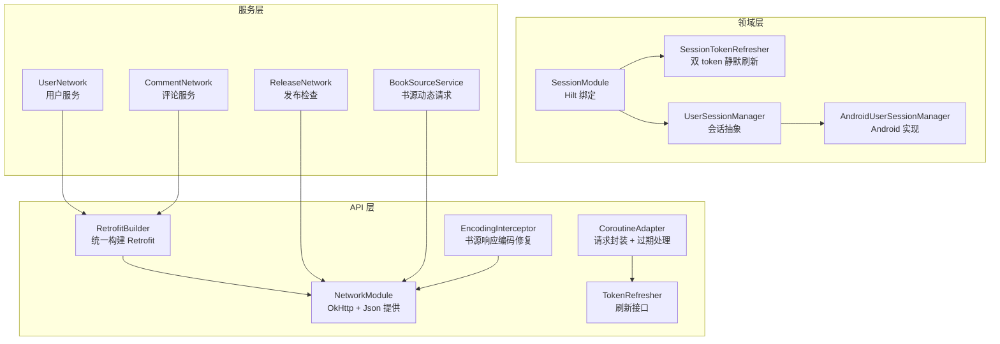
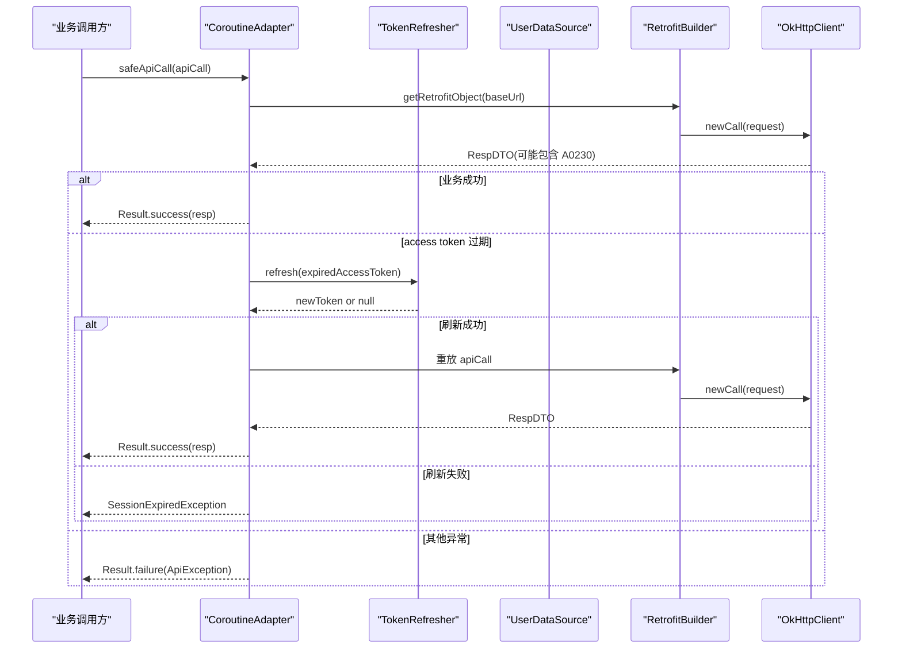
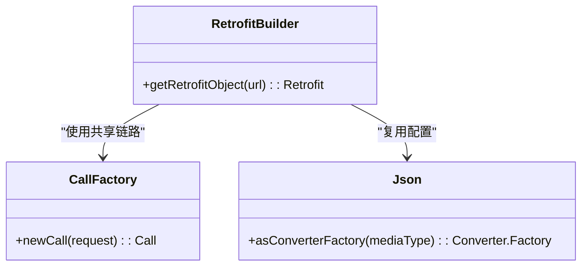
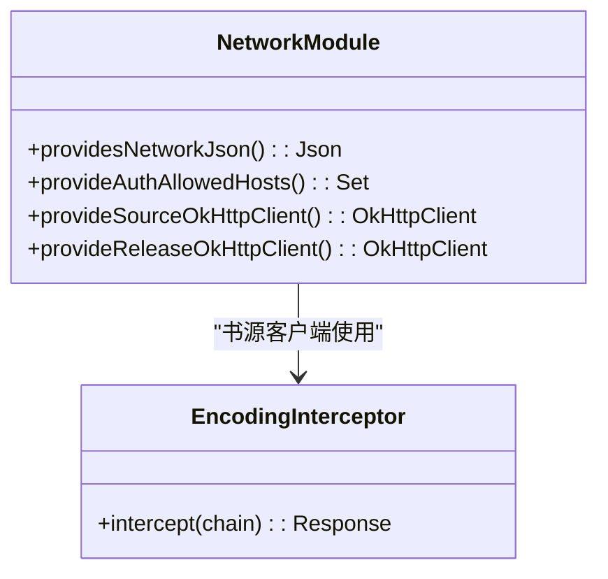
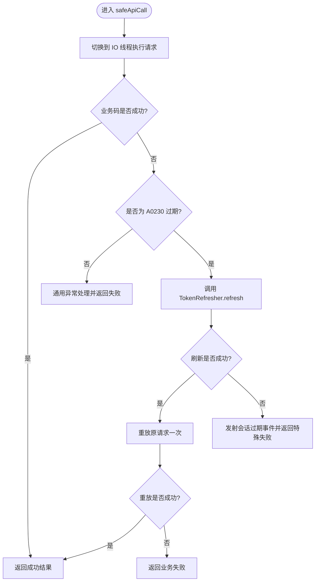
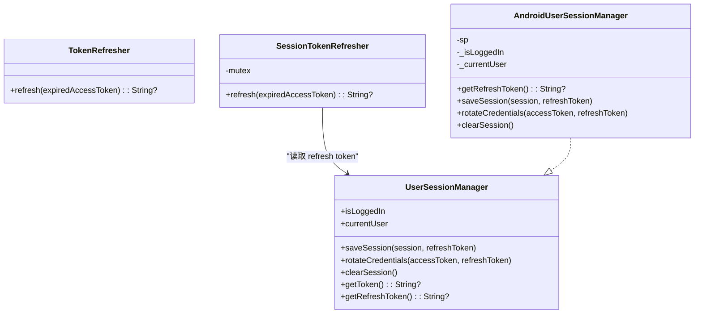
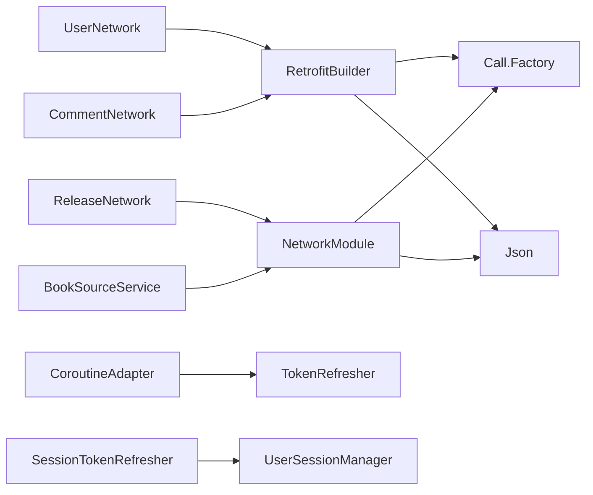

# 网络层配置

<cite>
**本文引用的文件**   
- [RetrofitBuilder.kt](file://lib_ebook_api/src/main/java/com/ebook/api/RetrofitBuilder.kt)
- [NetworkModule.kt](file://lib_ebook_api/src/main/java/com/ebook/api/utils/NetworkModule.kt)
- [CoroutineAdapter.kt](file://lib_ebook_api/src/main/java/com/ebook/api/utils/CoroutineAdapter.kt)
- [TokenRefresher.kt](file://lib_ebook_api/src/main/java/com/ebook/api/auth/TokenRefresher.kt)
- [EncodingInterceptor.kt](file://lib_ebook_api/src/main/java/com/ebook/encoding/intercepter/EncodingInterceptor.kt)
- [SessionModule.kt](file://lib_book_common/src/main/java/com/ebook/common/di/SessionModule.kt)
- [SessionTokenRefresher.kt](file://lib_book_common/src/main/java/com/ebook/common/domain/SessionTokenRefresher.kt)
- [UserSessionManager.kt](file://lib_book_common/src/main/java/com/ebook/common/domain/UserSessionManager.kt)
- [AndroidUserSessionManager.kt](file://lib_book_common/src/main/java/com/ebook/common/domain/AndroidUserSessionManager.kt)
- [LoginInterceptor.kt](file://lib_book_common/src/main/java/com/ebook/common/interceptor/LoginInterceptor.kt)
- [UserNetwork.kt](file://lib_ebook_api/src/main/java/com/ebook/api/service/user/UserNetwork.kt)
- [CommentNetwork.kt](file://lib_ebook_api/src/main/java/com/ebook/api/service/comment/CommentNetwork.kt)
- [ReleaseNetwork.kt](file://lib_ebook_api/src/main/java/com/ebook/api/service/release/ReleaseNetwork.kt)
- [BookSourceService.kt](file://lib_ebook_api/src/main/java/com/ebook/api/service/source/BookSourceService.kt)
- [network_security_config.xml](file://lib_ebook_api/src/main/res/xml/network_security_config.xml)
</cite>

## 目录
1. [简介](#简介)
2. [项目结构](#项目结构)
3. [核心组件](#核心组件)
4. [架构总览](#架构总览)
5. [详细组件分析](#详细组件分析)
6. [依赖关系分析](#依赖关系分析)
7. [性能与优化建议](#性能与优化建议)
8. [HTTPS、证书与网络安全](#https证书与网络安全)
9. [重试、熔断与错误处理](#重试熔断与错误处理)
10. [调试与常见问题排查](#调试与常见问题排查)
11. [多环境配置差异](#多环境配置差异)
12. [结论](#结论)

## 简介
本技术文档聚焦于项目的网络层配置，覆盖 Retrofit 构建器、OkHttp 客户端拆分、拦截器链、认证与令牌刷新、错误处理、HTTPS 与安全配置、性能优化建议以及调试方法。该项目采用分层模块结构：`lib_ebook_api` 暴露 API 契约与 Retrofit 适配层；`lib_book_common` 提供会话管理、拦截器和共享领域能力；业务模块通过 Hilt 注入具体实现。

关键设计原则包括：
- 使用 `RetrofitBuilder` 统一创建业务 Retrofit 实例，复用共享的 `Call.Factory`（由 ADR-0014 指定），避免在每个 Network 类中重复构造 OkHttp。
- JSON 解析统一通过 `kotlinx.serialization` 的 `Json`，并由 `NetworkModule` 提供可复用的配置。
- 认证与日志等横切逻辑集中在共享链路；书源抓取和发布检查使用独立 OkHttp 客户端，避免 token 泄漏到第三方站点。
- 访问令牌过期采用静默刷新机制，通过 `TokenRefresher` 接口解耦实现，保证并发安全且只刷新一次。

## 项目结构
网络相关代码主要分布在以下模块：
- `lib_ebook_api`：API 定义、Retrofit 构建器、网络适配器、公共 OkHttp 模块、编码拦截器、服务数据源。
- `lib_book_common`：会话管理、Hilt 绑定、登录路由拦截器、令牌刷新实现。
- 业务模块：调用各 Network 类发起请求，不直接操作 Retrofit。

图表来源
- [RetrofitBuilder.kt:1-45](file://lib_ebook_api/src/main/java/com/ebook/api/RetrofitBuilder.kt#L1-L45)
- [NetworkModule.kt:1-76](file://lib_ebook_api/src/main/java/com/ebook/api/utils/NetworkModule.kt#L1-L76)
- [CoroutineAdapter.kt:1-150](file://lib_ebook_api/src/main/java/com/ebook/api/utils/CoroutineAdapter.kt#L1-L150)
- [TokenRefresher.kt:1-27](file://lib_ebook_api/src/main/java/com/ebook/api/auth/TokenRefresher.kt#L1-L27)
- [EncodingInterceptor.kt:1-51](file://lib_ebook_api/src/main/java/com/ebook/encoding/intercepter/EncodingInterceptor.kt#L1-L51)
- [SessionModule.kt:1-37](file://lib_book_common/src/main/java/com/ebook/common/di/SessionModule.kt#L1-L37)
- [SessionTokenRefresher.kt:1-96](file://lib_book_common/src/main/java/com/ebook/common/domain/SessionTokenRefresher.kt#L1-L96)
- [UserSessionManager.kt:1-62](file://lib_book_common/src/main/java/com/ebook/common/domain/UserSessionManager.kt#L1-L62)
- [AndroidUserSessionManager.kt:1-162](file://lib_book_common/src/main/java/com/ebook/common/domain/AndroidUserSessionManager.kt#L1-L162)
- [UserNetwork.kt:1-67](file://lib_ebook_api/src/main/java/com/ebook/api/service/user/UserNetwork.kt#L1-L67)
- [CommentNetwork.kt:1-63](file://lib_ebook_api/src/main/java/com/ebook/api/service/comment/CommentNetwork.kt#L1-L63)
- [ReleaseNetwork.kt:1-50](file://lib_ebook_api/src/main/java/com/ebook/api/service/release/ReleaseNetwork.kt#L1-L50)
- [BookSourceService.kt:1-92](file://lib_ebook_api/src/main/java/com/ebook/api/service/source/BookSourceService.kt#L1-L92)

章节来源
- [RetrofitBuilder.kt:1-45](file://lib_ebook_api/src/main/java/com/ebook/api/RetrofitBuilder.kt#L1-L45)
- [NetworkModule.kt:1-76](file://lib_ebook_api/src/main/java/com/ebook/api/utils/NetworkModule.kt#L1-L76)
- [CoroutineAdapter.kt:1-150](file://lib_ebook_api/src/main/java/com/ebook/api/utils/CoroutineAdapter.kt#L1-L150)
- [SessionTokenRefresher.kt:1-96](file://lib_book_common/src/main/java/com/ebook/common/domain/SessionTokenRefresher.kt#L1-L96)

## 核心组件
- Retrofit 构建器：集中提供 `getRetrofitObject(url)`，注入 kotlinx 转换器、Scalars 转换器和共享 `Call.Factory`。
- OkHttp 模块：提供 `Json`、测试资源管理器、认证白名单集合、书源客户端和发布检查客户端。
- 请求适配器：统一 IO 调度、业务码翻译、A0230 会话过期处理、取消异常原样上抛。
- 令牌刷新接口与实现：定义刷新语义，实现使用互斥锁串行化刷新并轮换凭证。
- 会话管理：抽象出登录态、当前用户、保存会话、轮换凭证、清理会话等操作。
- 编码拦截器：将第三方书源响应的 Content-Type 强制为 RSS 类型并透传正文流。

章节来源
- [RetrofitBuilder.kt:1-45](file://lib_ebook_api/src/main/java/com/ebook/api/RetrofitBuilder.kt#L1-L45)
- [NetworkModule.kt:1-76](file://lib_ebook_api/src/main/java/com/ebook/api/utils/NetworkModule.kt#L1-L76)
- [CoroutineAdapter.kt:1-150](file://lib_ebook_api/src/main/java/com/ebook/api/utils/CoroutineAdapter.kt#L1-L150)
- [TokenRefresher.kt:1-27](file://lib_ebook_api/src/main/java/com/ebook/api/auth/TokenRefresher.kt#L1-L27)
- [SessionTokenRefresher.kt:1-96](file://lib_book_common/src/main/java/com/ebook/common/domain/SessionTokenRefresher.kt#L1-L96)
- [UserSessionManager.kt:1-62](file://lib_book_common/src/main/java/com/ebook/common/domain/UserSessionManager.kt#L1-L62)
- [AndroidUserSessionManager.kt:1-162](file://lib_book_common/src/main/java/com/ebook/common/domain/AndroidUserSessionManager.kt#L1-L162)
- [EncodingInterceptor.kt:1-51](file://lib_ebook_api/src/main/java/com/ebook/encoding/intercepter/EncodingInterceptor.kt#L1-L51)

## 架构总览
网络层按职责分为三层：
- 构建与配置层：`RetrofitBuilder` 负责 Retrofit 对象创建；`NetworkModule` 负责 OkHttp 与序列化配置。
- 横切处理层：`CoroutineAdapter` 统一封装请求、异常、会话过期；`TokenRefresher` 与 `SessionTokenRefresher` 负责刷新。
- 业务数据层：`UserNetwork`、`CommentNetwork`、`ReleaseNetwork`、`BookSourceService` 分别对接不同后端或第三方端点。

图表来源
- [CoroutineAdapter.kt:1-150](file://lib_ebook_api/src/main/java/com/ebook/api/utils/CoroutineAdapter.kt#L1-L150)
- [RetrofitBuilder.kt:1-45](file://lib_ebook_api/src/main/java/com/ebook/api/RetrofitBuilder.kt#L1-L45)
- [TokenRefresher.kt:1-27](file://lib_ebook_api/src/main/java/com/ebook/api/auth/TokenRefresher.kt#L1-L27)
- [SessionTokenRefresher.kt:1-96](file://lib_book_common/src/main/java/com/ebook/common/domain/SessionTokenRefresher.kt#L1-L96)

## 详细组件分析

### Retrofit 构建器
- 作用：根据基础 URL 构建 Retrofit，注册 kotlinx 转换器与 Scalars 转换器，并通过共享 `Call.Factory` 接入认证、白名单与日志。
- 关键点：
  - 不直接持有 OkHttpClient，避免重复配置。
  - JSON 转换器优先注册，Scalars 殿后处理字符串返回类型。
  - 复用 Hilt 注入的 `Json`，保持 mock 与真实链路一致。

图表来源
- [RetrofitBuilder.kt:1-45](file://lib_ebook_api/src/main/java/com/ebook/api/RetrofitBuilder.kt#L1-L45)

章节来源
- [RetrofitBuilder.kt:1-45](file://lib_ebook_api/src/main/java/com/ebook/api/RetrofitBuilder.kt#L1-L45)

### OkHttp 模块与客户端拆分
- 提供全局 `Json` 配置：美化输出、忽略未知字段。
- 提供认证白名单集合，用于限制允许携带认证头的域名。
- 提供两个纯净 OkHttp 客户端：
  - 书源客户端：10s 连接/读写超时，附加编码拦截器，不携带 token。
  - 发布检查客户端：公开 Releases API，不携带 token，也不带书源编码拦截器。

图表来源
- [NetworkModule.kt:1-76](file://lib_ebook_api/src/main/java/com/ebook/api/utils/NetworkModule.kt#L1-L76)
- [EncodingInterceptor.kt:1-51](file://lib_ebook_api/src/main/java/com/ebook/encoding/intercepter/EncodingInterceptor.kt#L1-L51)

章节来源
- [NetworkModule.kt:1-76](file://lib_ebook_api/src/main/java/com/ebook/api/utils/NetworkModule.kt#L1-L76)
- [EncodingInterceptor.kt:1-51](file://lib_ebook_api/src/main/java/com/ebook/encoding/intercepter/EncodingInterceptor.kt#L1-L51)

### 请求适配器与会话过期处理
- 作用：统一 IO 调度、业务码翻译、A0230 会话过期处理、取消异常原样上抛。
- 关键流程：
  - 成功：返回 `Result.success`。
  - A0230：触发 `TokenRefresher.refresh`，成功后重放一次原请求；失败则发射会话过期事件并返回特殊异常。
  - 其他异常：交给通用异常处理器，记录日志并返回失败。

图表来源
- [CoroutineAdapter.kt:1-150](file://lib_ebook_api/src/main/java/com/ebook/api/utils/CoroutineAdapter.kt#L1-L150)
- [TokenRefresher.kt:1-27](file://lib_ebook_api/src/main/java/com/ebook/api/auth/TokenRefresher.kt#L1-L27)

章节来源
- [CoroutineAdapter.kt:1-150](file://lib_ebook_api/src/main/java/com/ebook/api/utils/CoroutineAdapter.kt#L1-L150)

### 令牌刷新与会话管理
- `TokenRefresher`：定义刷新接口，传入过期 access token，返回新 token 或 null。
- `SessionTokenRefresher`：
  - 使用互斥锁串行化刷新，防止并发多次刷新。
  - 先比对当前 token 是否已变化，若已变化则复用。
  - 从会话管理器获取 refresh token，调用刷新接口，成功则轮换凭证。
  - 捕获取消异常原样上抛，其他异常降级为刷新失败。
- `UserSessionManager` 与 `AndroidUserSessionManager`：
  - 提供登录态、当前用户、保存会话、轮换凭证、清理会话等能力。
  - Android 实现中，access token 驻内存，refresh token 落盘；清理时会同步失效三处镜像状态。

图表来源
- [TokenRefresher.kt:1-27](file://lib_ebook_api/src/main/java/com/ebook/api/auth/TokenRefresher.kt#L1-L27)
- [SessionTokenRefresher.kt:1-96](file://lib_book_common/src/main/java/com/ebook/common/domain/SessionTokenRefresher.kt#L1-L96)
- [UserSessionManager.kt:1-62](file://lib_book_common/src/main/java/com/ebook/common/domain/UserSessionManager.kt#L1-L62)
- [AndroidUserSessionManager.kt:1-162](file://lib_book_common/src/main/java/com/ebook/common/domain/AndroidUserSessionManager.kt#L1-L162)

章节来源
- [SessionTokenRefresher.kt:1-96](file://lib_book_common/src/main/java/com/ebook/common/domain/SessionTokenRefresher.kt#L1-L96)
- [UserSessionManager.kt:1-62](file://lib_book_common/src/main/java/com/ebook/common/domain/UserSessionManager.kt#L1-L62)
- [AndroidUserSessionManager.kt:1-162](file://lib_book_common/src/main/java/com/ebook/common/domain/AndroidUserSessionManager.kt#L1-L162)

### 编码拦截器
- 作用：针对第三方书源响应，强制改写 Content-Type 为 RSS 类型并附带指定字符集，同时以流式方式透传正文，避免全量缓冲。
- 原理：使用 OkHttp 公开 API 包装原始 `BufferedSource`，构造新 `ResponseBody` 替换响应体，其余字段保持不变。
- 注意事项：contentLength 固定为 -1，下游必须按流式处理；旧版反射私有字段的方式已被废弃。

章节来源
- [EncodingInterceptor.kt:1-51](file://lib_ebook_api/src/main/java/com/ebook/encoding/intercepter/EncodingInterceptor.kt#L1-L51)

### 业务网络服务
- `UserNetwork`：通过 `RetrofitBuilder.getRetrofitObject` 构建用户服务 Retrofit，调用登录、注册、刷新、登出、修改密码、上传头像等接口。
- `CommentNetwork`：评论服务数据源，聚合 comment_keys 查询参数并截断上限。
- `ReleaseNetwork`：发布检查数据源，使用独立 OkHttp 客户端和裸 JSON 响应，不经过业务信封。
- `BookSourceService`：书源动态请求接口，支持动态 URL、HeaderMap、表单体、默认 UA 与编码处理。

章节来源
- [UserNetwork.kt:1-67](file://lib_ebook_api/src/main/java/com/ebook/api/service/user/UserNetwork.kt#L1-L67)
- [CommentNetwork.kt:1-63](file://lib_ebook_api/src/main/java/com/ebook/api/service/comment/CommentNetwork.kt#L1-L63)
- [ReleaseNetwork.kt:1-50](file://lib_ebook_api/src/main/java/com/ebook/api/service/release/ReleaseNetwork.kt#L1-L50)
- [BookSourceService.kt:1-92](file://lib_ebook_api/src/main/java/com/ebook/api/service/source/BookSourceService.kt#L1-L92)

## 依赖关系分析
- `RetrofitBuilder` 依赖共享 `Call.Factory` 与 `Json`，不直接依赖 OkHttp 构建细节。
- `NetworkModule` 提供 OkHttp 与 Json，供服务层按需注入。
- `CoroutineAdapter` 依赖 `TokenRefresher`、`SessionEventBus`、`TokenHolder`，不感知具体服务端协议。
- `SessionTokenRefresher` 依赖 `UserSessionManager`、`TokenHolder`、`UserDataSource`，位于 lib_book_common 以便同时访问会话持久化与 API 契约。
- 业务 Network 类依赖 `RetrofitBuilder` 或特定 OkHttp 客户端，遵循“认证业务走共享链路，第三方书源与发布检查走纯净链路”的原则。

图表来源
- [RetrofitBuilder.kt:1-45](file://lib_ebook_api/src/main/java/com/ebook/api/RetrofitBuilder.kt#L1-L45)
- [NetworkModule.kt:1-76](file://lib_ebook_api/src/main/java/com/ebook/api/utils/NetworkModule.kt#L1-L76)
- [CoroutineAdapter.kt:1-150](file://lib_ebook_api/src/main/java/com/ebook/api/utils/CoroutineAdapter.kt#L1-L150)
- [SessionTokenRefresher.kt:1-96](file://lib_book_common/src/main/java/com/ebook/common/domain/SessionTokenRefresher.kt#L1-L96)
- [UserNetwork.kt:1-67](file://lib_ebook_api/src/main/java/com/ebook/api/service/user/UserNetwork.kt#L1-L67)
- [CommentNetwork.kt:1-63](file://lib_ebook_api/src/main/java/com/ebook/api/service/comment/CommentNetwork.kt#L1-L63)
- [ReleaseNetwork.kt:1-50](file://lib_ebook_api/src/main/java/com/ebook/api/service/release/ReleaseNetwork.kt#L1-L50)
- [BookSourceService.kt:1-92](file://lib_ebook_api/src/main/java/com/ebook/api/service/source/BookSourceService.kt#L1-L92)

## 性能与优化建议
- 请求合并：
  - 在评论聚合查询中，对 comment_keys 去重并截断至服务端上限，减少无效请求与服务器拒绝风险。
- 缓存策略：
  - 当前代码未显式启用 OkHttp Cache；建议在稳定接口增加条件缓存（如 ETag/Last-Modified）并在 `NetworkModule` 中统一配置。
- 压缩传输：
  - 可在 OkHttp 添加 Gzip 拦截器，但需注意第三方书源响应可能已有自定义编码，应谨慎评估影响范围。
- 连接池与超时：
  - 书源客户端设置 10s 超时以降低第三方站点慢响应影响；可根据实际网络状况调整连接池大小与空闲时间。
- 序列化优化：
  - 复用 Hilt 注入的 `Json`，避免重复构建；在生产环境中可关闭 prettyPrint 以提升吞吐。

[本节为一般性指导，无需引用具体文件]

## HTTPS、证书与网络安全
- 当前应用清单启用 `networkSecurityConfig`，并允许明文流量（cleartextTrafficPermitted=true）。
- 该配置适用于开发/测试环境；生产环境应禁用明文传输，仅允许 HTTPS，并考虑引入证书固定（CertificatePinner）与严格主机名验证。
- 安全最佳实践：
  - 生产环境移除 `usesCleartextTraffic="true"`。
  - 为可信域名配置 CertificatePinner，避免中间人攻击。
  - 对敏感接口启用额外校验（签名、时间戳、nonce）。
  - 区分 debuggable 与 release 构建，确保调试配置不会泄露到生产包。

章节来源
- [network_security_config.xml:1-4](file://lib_ebook_api/src/main/res/xml/network_security_config.xml#L1-L4)

## 重试、熔断与错误处理
- 重试机制：
  - 当前代码未内置通用重试策略；仅在 A0230 场景下进行一次重放。
  - 如需指数退避或条件重试，可在 `CoroutineAdapter` 中扩展或使用 OkHttp 的 `RetryOnFailureInterceptor`。
- 熔断降级：
  - 未实现熔断；可在网关或服务层引入断路器模式，结合本地缓存与降级响应。
- 错误处理：
  - 业务码非成功时，除 A0230 外统一转为 `ApiException`。
  - 会话过期且刷新失败时，发射 `SessionExpired` 事件，由上层统一清会话并跳转登录页。
  - 取消异常原样上抛，避免误判为业务失败。

章节来源
- [CoroutineAdapter.kt:1-150](file://lib_ebook_api/src/main/java/com/ebook/api/utils/CoroutineAdapter.kt#L1-L150)

## 调试与常见问题排查
- 常见问题：
  - 书源中文乱码：确认 `EncodingInterceptor` 使用的编码与实际站点一致；检查响应体是否被下游全量缓冲导致性能问题。
  - 第三方站点请求缓慢：确认书源客户端超时配置合理；必要时隔离到独立线程池。
  - 会话过期无提示：检查 `SessionEventBus` 订阅是否正确；确认 `CoroutineAdapter` 未吞掉取消异常。
  - 发布检查失败：确认 ReleaseNetwork 使用的 OkHttp 客户端未携带 token，且 BaseUrl 占位符正确。
- 调试建议：
  - 在开发环境开启 HTTP 日志拦截器，注意脱敏敏感头与主体。
  - 使用 MockNetworkModule 替换真实后端，验证错误分支与刷新流程。
  - 关注 `LoginInterceptor` 的路由拦截行为，确保需要登录的页面正确跳转到登录页。

章节来源
- [EncodingInterceptor.kt:1-51](file://lib_ebook_api/src/main/java/com/ebook/encoding/intercepter/EncodingInterceptor.kt#L1-L51)
- [CoroutineAdapter.kt:1-150](file://lib_ebook_api/src/main/java/com/ebook/api/utils/CoroutineAdapter.kt#L1-L150)
- [LoginInterceptor.kt:1-42](file://lib_book_common/src/main/java/com/ebook/common/interceptor/LoginInterceptor.kt#L1-L42)

## 多环境配置差异
- 开发/测试环境：
  - 允许明文流量，便于抓包调试。
  - JSON 美化输出便于日志阅读。
  - 可使用 MockNetworkModule 与测试资源进行离线测试。
- 生产环境：
  - 禁用明文流量，启用 HTTPS 与证书固定。
  - 关闭 JSON 美化输出以减少体积。
  - 严格控制超时与连接池，提升稳定性。
- 管理方式：
  - 通过 Hilt 模块注入不同环境的 OkHttp 与 Json 配置。
  - 使用 buildConfigField 或 resValue 切换基础 URL、调试开关与安全策略。
  - 利用 `@Named("source")` 与 `@Named("release")` 区分不同用途的 OkHttp 客户端。

[本节为一般性指导，无需引用具体文件]

## 结论
本项目网络层通过 RetrofitBuilder 与 NetworkModule 实现构建与配置的解耦，使用共享 Call.Factory 统一管理认证、白名单与日志；通过 CoroutineAdapter 统一封装请求、异常与会话过期处理；通过 TokenRefresher 与 SessionTokenRefresher 实现并发安全的静默刷新；通过独立的 OkHttp 客户端隔离第三方书源与发布检查请求，避免 token 泄漏。编码拦截器解决第三方站点的字符集问题，配合合理的超时与连接池配置提升稳定性。未来可进一步引入缓存、压缩、重试与熔断机制，并在生产环境强化 HTTPS 与证书固定，以提升整体安全性与性能。