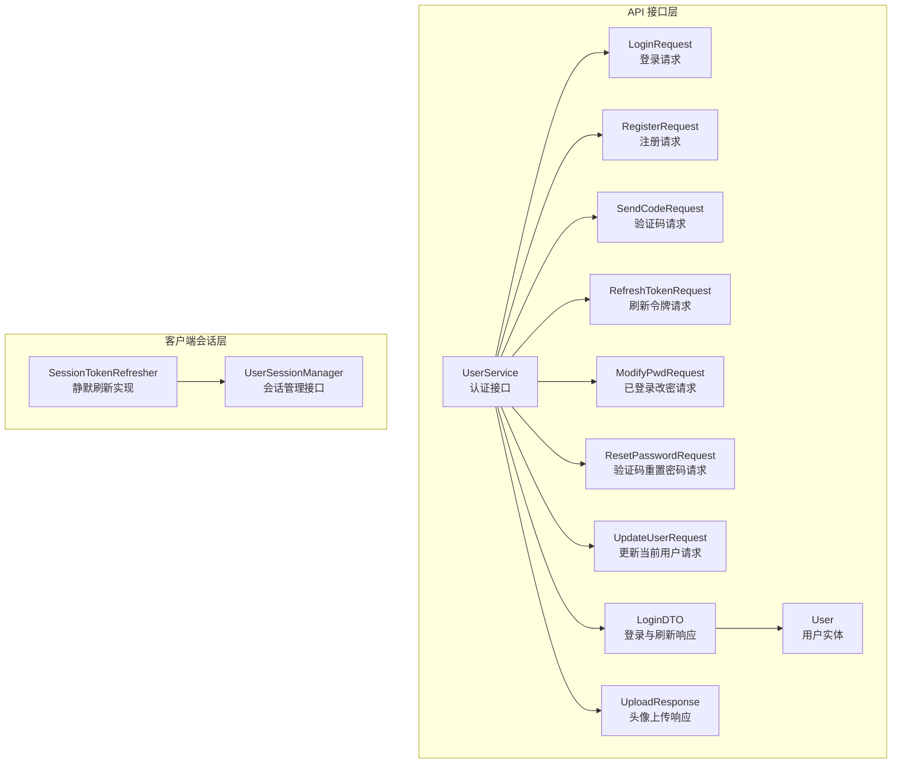
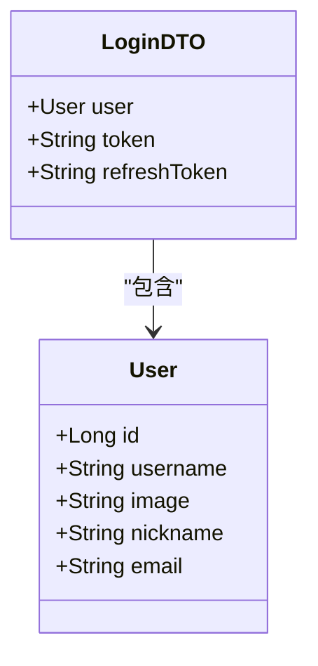
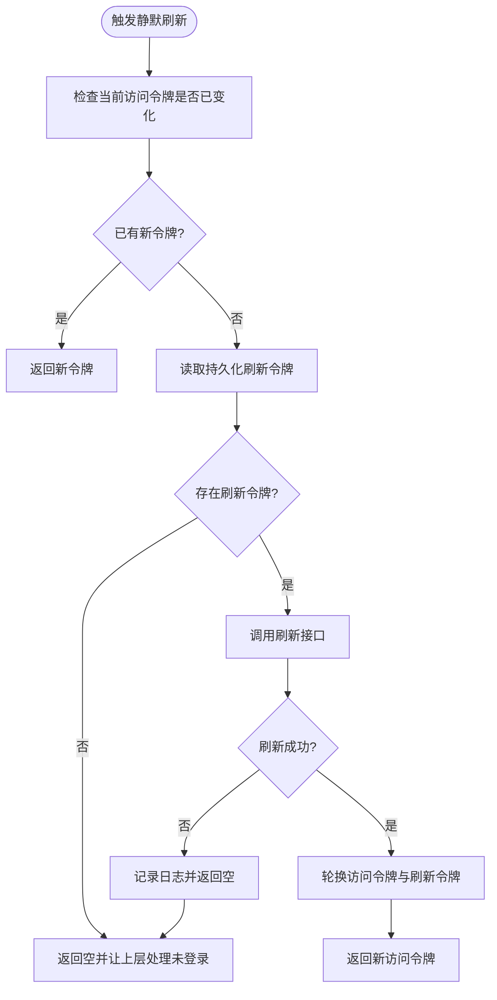
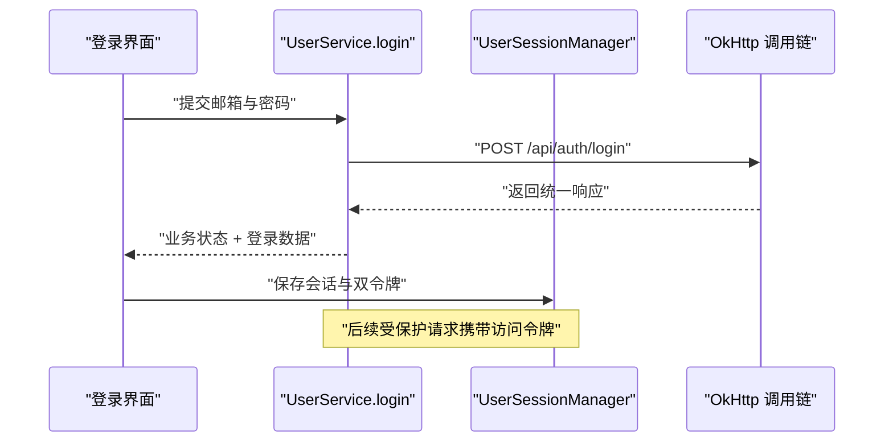
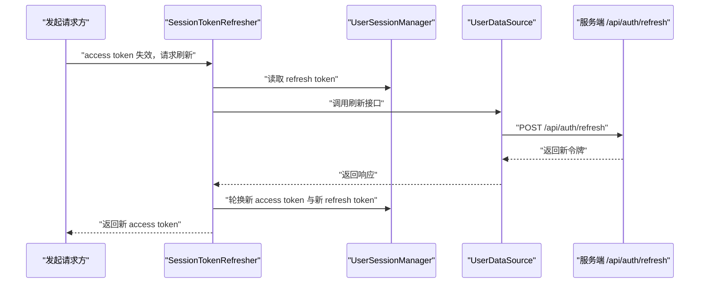
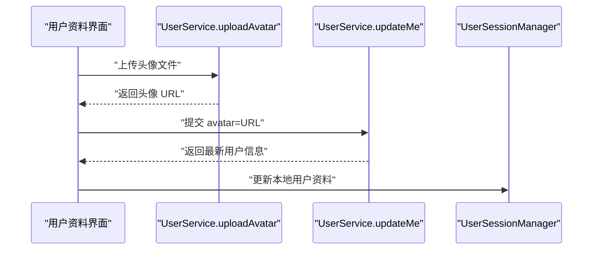

# 认证 API

<cite>
**本文引用的文件**   
- [UserService.kt](file://lib_ebook_api/src/main/java/com/ebook/api/service/user/UserService.kt)
- [LoginRequest.kt](file://lib_ebook_api/src/main/java/com/ebook/api/entity/LoginRequest.kt)
- [RegisterRequest.kt](file://lib_ebook_api/src/main/java/com/ebook/api/entity/RegisterRequest.kt)
- [SendCodeRequest.kt](file://lib_ebook_api/src/main/java/com/ebook/api/entity/SendCodeRequest.kt)
- [RefreshTokenRequest.kt](file://lib_ebook_api/src/main/java/com/ebook/api/entity/RefreshTokenRequest.kt)
- [ModifyPwdRequest.kt](file://lib_ebook_api/src/main/java/com/ebook/api/entity/ModifyPwdRequest.kt)
- [ResetPasswordRequest.kt](file://lib_ebook_api/src/main/java/com/ebook/api/entity/ResetPasswordRequest.kt)
- [UpdateUserRequest.kt](file://lib_ebook_api/src/main/java/com/ebook/api/entity/UpdateUserRequest.kt)
- [LoginDTO.kt](file://lib_ebook_api/src/main/java/com/ebook/api/entity/LoginDTO.kt)
- [User.kt](file://lib_ebook_api/src/main/java/com/ebook/api/entity/User.kt)
- [UploadResponse.kt](file://lib_ebook_api/src/main/java/com/ebook/api/entity/UploadResponse.kt)
- [user_login.json](file://lib_ebook_api/src/main/assets/user_login.json)
- [user_register.json](file://lib_ebook_api/src/main/assets/user_register.json)
- [user_refresh_token.json](file://lib_ebook_api/src/main/assets/user_refresh_token.json)
- [user_modify_pwd.json](file://lib_ebook_api/src/main/assets/user_modify_pwd.json)
- [user_send_code.json](file://lib_ebook_api/src/main/assets/user_send_code.json)
- [user_reset_password.json](file://lib_ebook_api/src/main/assets/user_reset_password.json)
- [user_logout.json](file://lib_ebook_api/src/main/assets/user_logout.json)
- [RetrofitBuilder.kt](file://lib_ebook_api/src/main/java/com/ebook/api/RetrofitBuilder.kt)
- [UserSessionManager.kt](file://lib_book_common/src/main/java/com/ebook/common/domain/UserSessionManager.kt)
- [SessionTokenRefresher.kt](file://lib_book_common/src/main/java/com/ebook/common/domain/SessionTokenRefresher.kt)
</cite>

## 目录
1. [简介](#简介)
2. [项目结构与认证边界](#项目结构与认证边界)
3. [统一响应格式与错误码](#统一响应格式与错误码)
4. [认证端点总览](#认证端点总览)
5. [详细接口说明](#详细接口说明)
6. [双令牌机制与会话管理](#双令牌机制与会话管理)
7. [请求头、权限与安全实践](#请求头权限与安全实践)
8. [网络重试、超时与错误处理](#网络重试超时与错误处理)
9. [典型调用序列](#典型调用序列)
10. [故障排查指南](#故障排查指南)
11. [结论](#结论)

## 简介
本文档面向客户端开发者，系统化记录本项目中所有用户认证相关的 HTTP 接口契约，以及客户端侧对双令牌（access token 与 refresh token）的会话管理实现。文档覆盖邮箱登录、注册、验证码发送、密码修改、忘记密码重置、刷新令牌、登出和当前用户信息更新等能力，并给出请求结构、响应结构、成功样例、常见错误语义、安全注意事项和异常处理建议。

本项目的认证服务定义集中在 `lib_ebook_api` 模块的 `UserService` 接口中；客户端会话状态、令牌轮换和静默刷新逻辑则位于 `lib_book_common` 模块。

## 项目结构与认证边界
认证相关代码按“接口定义 → 实体模型 → 资源样例 → 客户端会话管理”分层组织：

- 接口层：`UserService.kt` 使用 Retrofit 注解声明所有认证相关端点。
- 实体层：`LoginRequest`、`RegisterRequest`、`SendCodeRequest`、`RefreshTokenRequest`、`ModifyPwdRequest`、`ResetPasswordRequest`、`UpdateUserRequest`、`LoginDTO`、`User`、`UploadResponse` 描述请求体与响应体。
- 资源样例：`assets` 下的 `user_*.json` 提供服务端返回的成功 JSON 样例。
- 会话层：`UserSessionManager` 抽象会话保存、凭证轮换和清除；`SessionTokenRefresher` 实现双令牌静默刷新。

**图示来源**  
- [UserService.kt:1-72](file://lib_ebook_api/src/main/java/com/ebook/api/service/user/UserService.kt#L1-L72)
- [LoginRequest.kt:1-15](file://lib_ebook_api/src/main/java/com/ebook/api/entity/LoginRequest.kt#L1-L15)
- [RegisterRequest.kt:1-17](file://lib_ebook_api/src/main/java/com/ebook/api/entity/RegisterRequest.kt#L1-L17)
- [SendCodeRequest.kt:1-13](file://lib_ebook_api/src/main/java/com/ebook/api/entity/SendCodeRequest.kt#L1-L13)
- [RefreshTokenRequest.kt:1-15](file://lib_ebook_api/src/main/java/com/ebook/api/entity/RefreshTokenRequest.kt#L1-L15)
- [ModifyPwdRequest.kt:1-18](file://lib_ebook_api/src/main/java/com/ebook/api/entity/ModifyPwdRequest.kt#L1-L18)
- [ResetPasswordRequest.kt:1-19](file://lib_ebook_api/src/main/java/com/ebook/api/entity/ResetPasswordRequest.kt#L1-L19)
- [UpdateUserRequest.kt:1-22](file://lib_ebook_api/src/main/java/com/ebook/api/entity/UpdateUserRequest.kt#L1-L22)
- [LoginDTO.kt:1-16](file://lib_ebook_api/src/main/java/com/ebook/api/entity/LoginDTO.kt#L1-L16)
- [User.kt:1-29](file://lib_ebook_api/src/main/java/com/ebook/api/entity/User.kt#L1-L29)
- [UploadResponse.kt:1-13](file://lib_ebook_api/src/main/java/com/ebook/api/entity/UploadResponse.kt#L1-L13)
- [UserSessionManager.kt:1-62](file://lib_book_common/src/main/java/com/ebook/common/domain/UserSessionManager.kt#L1-L62)
- [SessionTokenRefresher.kt:1-96](file://lib_book_common/src/main/java/com/ebook/common/domain/SessionTokenRefresher.kt#L1-L96)

**章节来源**  
- [UserService.kt:1-72](file://lib_ebook_api/src/main/java/com/ebook/api/service/user/UserService.kt#L1-L72)
- [RetrofitBuilder.kt:1-45](file://lib_ebook_api/src/main/java/com/ebook/api/RetrofitBuilder.kt#L1-L45)

## 统一响应格式与错误码
除部分明确返回业务对象外，认证接口普遍返回统一的包装结构，包含业务状态码、错误信息和数据载荷。客户端在解析时应先判断外层业务状态码，再取 `data` 字段。

| 字段 | 类型 | 含义 |
|---|---|---|
| code | 字符串 | 业务状态码；成功样例中使用 `"00000"` |
| error | 字符串 | 错误描述；成功时为空字符串 |
| data | 任意或空 | 业务数据；登录/刷新返回令牌和用户信息，注册、验证码、登出等常为空 |

典型成功响应示例如下：

- 登录成功：`code` 为 `"00000"`，`error` 为空，`data` 包含 `token`、`refresh_token` 和 `user`。
- 注册成功：`code` 为 `"00000"`，`error` 为空，`data` 为 `null`。
- 刷新令牌成功：`code` 为 `"00000"`，`error` 为空，`data` 包含新的 `token` 和 `refresh_token`。
- 登出、发送验证码、修改密码、重置密码成功：`code` 为 `"00000"`，`error` 为空，`data` 为 `null`。

客户端应把 `code != "00000"` 视为业务失败，并根据 `error` 提示用户；对网络层异常（超时、断网、HTTP 非 2xx 等）应单独分类处理。

**章节来源**  
- [user_login.json:1-15](file://lib_ebook_api/src/main/assets/user_login.json#L1-L15)
- [user_register.json:1-5](file://lib_ebook_api/src/main/assets/user_register.json#L1-L5)
- [user_refresh_token.json:1-8](file://lib_ebook_api/src/main/assets/user_refresh_token.json#L1-L8)
- [user_send_code.json:1-5](file://lib_ebook_api/src/main/assets/user_send_code.json#L1-L5)
- [user_modify_pwd.json:1-5](file://lib_ebook_api/src/main/assets/user_modify_pwd.json#L1-L5)
- [user_reset_password.json:1-5](file://lib_ebook_api/src/main/assets/user_reset_password.json#L1-L5)
- [user_logout.json:1-5](file://lib_ebook_api/src/main/assets/user_logout.json#L1-L5)

## 认证端点总览
以下表格汇总认证相关端点、方法、路径、请求体和主要响应语义。

| 功能 | HTTP 方法 | URL 路径 | 请求体 | 需要登录 | 主要响应 |
|---|---:|---|---|---:|---|
| 邮箱登录 | POST | `/api/auth/login` | `LoginRequest` | 否 | `RespDTO<LoginDTO>` |
| 注册发送验证码 | POST | `/api/auth/send-code` | `SendCodeRequest` | 否 | `RespDTO<Unit>` |
| 邮箱注册 | POST | `/api/auth/register` | `RegisterRequest` | 否 | `RespDTO<Unit>` |
| 刷新令牌 | POST | `/api/auth/refresh` | `RefreshTokenRequest` | 否（依赖 refresh_token） | `RespDTO<LoginDTO>` |
| 登出 | POST | `/api/auth/logout` | 无 | 是 | `RespDTO<Unit>` |
| 已登录修改密码 | PUT | `/api/users/me/password` | `ModifyPwdRequest` | 是 | `RespDTO<Unit>` |
| 忘记密码发送验证码 | POST | `/api/auth/forgot-password/send-code` | `SendCodeRequest` | 否 | `RespDTO<Unit>` |
| 验证码重置密码 | POST | `/api/auth/forgot-password/reset` | `ResetPasswordRequest` | 否 | `RespDTO<Unit>` |
| 更新当前用户信息 | PUT | `/api/users/me` | `UpdateUserRequest` | 是 | `RespDTO<User>` |
| 上传头像 | POST | `/api/uploads/avatar` | multipart，字段名 `avatar` | 通常需登录 | `RespDTO<UploadResponse>` |

注意：
- 登录主标识是邮箱，不是用户名。
- 注册成功后不返回令牌，客户端应引导用户主动登录。
- 刷新令牌接口不要求携带 access token，而是依赖已保存的 refresh token。
- 已登录改密和更新用户信息属于受保护接口，通常需要有效访问令牌。

**章节来源**  
- [UserService.kt:19-72](file://lib_ebook_api/src/main/java/com/ebook/api/service/user/UserService.kt#L19-L72)

## 详细接口说明

### 邮箱登录
- **URL**：`POST /api/auth/login`
- **请求头**：`Content-Type: application/json;charset=UTF-8`
- **请求体字段**：
  - `email`：字符串，邮箱地址，作为登录主标识。
  - `password`：字符串，登录密码。
- **成功响应**：
  - `code`：`"00000"`
  - `error`：空字符串
  - `data`：`LoginDTO`，包含 `token`、`refresh_token` 和 `user`。
- **失败场景**：
  - 邮箱不存在或密码错误。
  - 网络异常、服务端不可用。
  - 业务码非成功状态。

客户端收到成功响应后，应同时保存：
1. 访问令牌 `token`。
2. 刷新令牌 `refresh_token`。
3. 用户信息 `user`，包括账号标识、昵称、头像和邮箱。

**章节来源**  
- [UserService.kt:22-28](file://lib_ebook_api/src/main/java/com/ebook/api/service/user/UserService.kt#L22-L28)
- [LoginRequest.kt:1-15](file://lib_ebook_api/src/main/java/com/ebook/api/entity/LoginRequest.kt#L1-L15)
- [LoginDTO.kt:1-16](file://lib_ebook_api/src/main/java/com/ebook/api/entity/LoginDTO.kt#L1-L16)
- [User.kt:1-29](file://lib_ebook_api/src/main/java/com/ebook/api/entity/User.kt#L1-L29)
- [user_login.json:1-15](file://lib_ebook_api/src/main/assets/user_login.json#L1-L15)

### 注册发送验证码
- **URL**：`POST /api/auth/send-code`
- **请求头**：`Content-Type: application/json;charset=UTF-8`
- **请求体字段**：
  - `email`：字符串，目标邮箱。
- **成功响应**：
  - `code`：`"00000"`
  - `error`：空字符串
  - `data`：`null`
- **失败场景**：
  - 邮箱格式无效。
  - 验证码发送频率限制。
  - 邮件服务异常。

该接口用于注册流程；忘记密码也复用相同请求体结构，但走不同 URL。

**章节来源**  
- [UserService.kt:30-34](file://lib_ebook_api/src/main/java/com/ebook/api/service/user/UserService.kt#L30-L34)
- [SendCodeRequest.kt:1-13](file://lib_ebook_api/src/main/java/com/ebook/api/entity/SendCodeRequest.kt#L1-L13)
- [user_send_code.json:1-5](file://lib_ebook_api/src/main/assets/user_send_code.json#L1-L5)

### 邮箱注册
- **URL**：`POST /api/auth/register`
- **请求头**：`Content-Type: application/json;charset=UTF-8`
- **请求体字段**：
  - `email`：字符串，邮箱。
  - `code`：字符串，6 位邮箱验证码。
  - `password`：字符串，登录密码。
- **成功响应**：
  - `code`：`"00000"`
  - `error`：空字符串
  - `data`：`null`
- **失败场景**：
  - 邮箱已注册。
  - 验证码错误或过期。
  - 密码不符合规则。

重要语义：**注册即激活，但不发放令牌**。客户端应在注册成功后跳转到登录页，引导用户使用邮箱和密码登录。

**章节来源**  
- [UserService.kt:36-40](file://lib_ebook_api/src/main/java/com/ebook/api/service/user/UserService.kt#L36-L40)
- [RegisterRequest.kt:1-17](file://lib_ebook_api/src/main/java/com/ebook/api/entity/RegisterRequest.kt#L1-L17)
- [user_register.json:1-5](file://lib_ebook_api/src/main/assets/user_register.json#L1-L5)

### 刷新令牌
- **URL**：`POST /api/auth/refresh`
- **请求头**：`Content-Type: application/json;charset=UTF-8`
- **请求体字段**：
  - `refresh_token`：字符串，服务端下发的刷新令牌。
- **成功响应**：
  - `code`：`"00000"`
  - `error`：空字符串
  - `data`：`LoginDTO`，包含新的 `token` 和 `refresh_token`。
- **失败场景**：
  - refresh token 缺失、过期或被撤销。
  - 服务端拒绝刷新。
  - 响应中缺少新 access token。

客户端侧的静默刷新由 `SessionTokenRefresher` 实现，核心策略见下一节。

**章节来源**  
- [UserService.kt:42-46](file://lib_ebook_api/src/main/java/com/ebook/api/service/user/UserService.kt#L42-L46)
- [RefreshTokenRequest.kt:1-15](file://lib_ebook_api/src/main/java/com/ebook/api/entity/RefreshTokenRequest.kt#L1-L15)
- [LoginDTO.kt:1-16](file://lib_ebook_api/src/main/java/com/ebook/api/entity/LoginDTO.kt#L1-L16)
- [user_refresh_token.json:1-8](file://lib_ebook_api/src/main/assets/user_refresh_token.json#L1-L8)

### 登出
- **URL**：`POST /api/auth/logout`
- **请求头**：`Content-Type: application/json;charset=UTF-8`
- **请求体**：无
- **成功响应**：
  - `code`：`"00000"`
  - `error`：空字符串
  - `data`：`null`
- **失败场景**：
  - 未登录或令牌失效。
  - 服务端登出失败。

登出成功后，客户端应清除本地会话、访问令牌和刷新令牌，并回到未登录态。

**章节来源**  
- [UserService.kt:48-51](file://lib_ebook_api/src/main/java/com/ebook/api/service/user/UserService.kt#L48-L51)
- [user_logout.json:1-5](file://lib_ebook_api/src/main/assets/user_logout.json#L1-L5)

### 已登录修改密码
- **URL**：`PUT /api/users/me/password`
- **请求头**：`Content-Type: application/json;charset=UTF-8`
- **请求体字段**：
  - `old_password`：字符串，旧密码。
  - `new_password`：字符串，新密码。
- **成功响应**：
  - `code`：`"00000"`
  - `error`：空字符串
  - `data`：`null`
- **失败场景**：
  - 旧密码错误。
  - 新密码不符合规则。
  - 访问令牌失效。

**章节来源**  
- [UserService.kt:53-56](file://lib_ebook_api/src/main/java/com/ebook/api/service/user/UserService.kt#L53-L56)
- [ModifyPwdRequest.kt:1-18](file://lib_ebook_api/src/main/java/com/ebook/api/entity/ModifyPwdRequest.kt#L1-L18)
- [user_modify_pwd.json:1-5](file://lib_ebook_api/src/main/assets/user_modify_pwd.json#L1-L5)

### 忘记密码发送验证码
- **URL**：`POST /api/auth/forgot-password/send-code`
- **请求头**：`Content-Type: application/json;charset=UTF-8`
- **请求体字段**：
  - `email`：字符串，目标邮箱。
- **成功响应**：
  - `code`：`"00000"`
  - `error`：空字符串
  - `data`：`null`
- **失败场景**：
  - 邮箱不存在或无法发送验证码。
  - 频率限制。

**章节来源**  
- [UserService.kt:58-61](file://lib_ebook_api/src/main/java/com/ebook/api/service/user/UserService.kt#L58-L61)
- [SendCodeRequest.kt:1-13](file://lib_ebook_api/src/main/java/com/ebook/api/entity/SendCodeRequest.kt#L1-L13)

### 验证码重置密码
- **URL**：`POST /api/auth/forgot-password/reset`
- **请求头**：`Content-Type: application/json;charset=UTF-8`
- **请求体字段**：
  - `email`：字符串，账号邮箱。
  - `code`：字符串，6 位邮箱验证码。
  - `new_password`：字符串，新密码。
- **成功响应**：
  - `code`：`"00000"`
  - `error`：空字符串
  - `data`：`null`
- **失败场景**：
  - 验证码错误或过期。
  - 邮箱不匹配。
  - 新密码不符合规则。

客户端不应做严格本地校验；验证码有效性由服务端在 reset 阶段判定。

**章节来源**  
- [UserService.kt:63-66](file://lib_ebook_api/src/main/java/com/ebook/api/service/user/UserService.kt#L63-L66)
- [ResetPasswordRequest.kt:1-19](file://lib_ebook_api/src/main/java/com/ebook/api/entity/ResetPasswordRequest.kt#L1-L19)
- [user_reset_password.json:1-5](file://lib_ebook_api/src/main/assets/user_reset_password.json#L1-L5)

### 更新当前用户信息
- **URL**：`PUT /api/users/me`
- **请求头**：`Content-Type: application/json;charset=UTF-8`
- **请求体字段**（全部可选，服务端按非空即更新）：
  - `avatar`：字符串，头像 URL。
  - `email`：字符串，邮箱。
  - `nickname`：字符串，昵称。
  - `username`：字符串，展示用用户名。
- **成功响应**：
  - `code`：`"00000"`
  - `error`：空字符串
  - `data`：`User`，返回最新用户信息。
- **失败场景**：
  - 未登录。
  - 访问令牌失效。
  - 字段值非法。

头像上传采用两步流程：先通过 `/api/uploads/avatar` 上传文件获取 URL，再提交到 `/api/users/me`。

**章节来源**  
- [UserService.kt:68-72](file://lib_ebook_api/src/main/java/com/ebook/api/service/user/UserService.kt#L68-L72)
- [UpdateUserRequest.kt:1-22](file://lib_ebook_api/src/main/java/com/ebook/api/entity/UpdateUserRequest.kt#L1-L22)
- [User.kt:1-29](file://lib_ebook_api/src/main/java/com/ebook/api/entity/User.kt#L1-L29)
- [UploadResponse.kt:1-13](file://lib_ebook_api/src/main/java/com/ebook/api/entity/UploadResponse.kt#L1-L13)

## 双令牌机制与会话管理

### 令牌模型
登录和刷新接口返回的 `LoginDTO` 表示服务端的双令牌模型：

| 字段 | 含义 |
|---|---|
| `token` | 访问令牌，用于鉴权当前业务请求 |
| `refresh_token` | 刷新令牌，用于换取新的访问令牌 |
| `user` | 用户身份信息（登录响应包含；刷新响应语义上不再返回用户） |

客户端侧的 `User` 实体将线上键 `uid` 映射为 `id`，将 `avatar` 映射为 `image`，以兼容历史 UI 和序列化边界。

**图示来源**  
- [LoginDTO.kt:1-16](file://lib_ebook_api/src/main/java/com/ebook/api/entity/LoginDTO.kt#L1-L16)
- [User.kt:1-29](file://lib_ebook_api/src/main/java/com/ebook/api/entity/User.kt#L1-L29)

### 生命周期管理
- **登录成功后**：客户端保存 `token`、`refresh_token` 和 `user`。
- **访问令牌失效时**：触发静默刷新。
- **刷新成功后**：
  - 更新内存中的访问令牌。
  - 持久化新的刷新令牌。
  - 不重建用户身份，避免覆盖昵称、头像、UID 等会话数据。
- **刷新失败或 refresh token 无效时**：清除会话，跳转登录页。
- **登出后**：清除会话、令牌和用户信息。

### 静默刷新策略
`SessionTokenRefresher` 实现了关键刷新策略：

1. **串行刷新**：使用互斥锁保证同一时刻只有一个刷新请求，防止并发重复刷新。
2. **令牌复用检测**：如果当前 access token 已变化且不为空，说明其他请求已完成刷新，直接复用。
3. **冷启动兼容**：即使没有历史 access token，只要存在 refresh token，仍尝试刷新。
4. **防死循环**：刷新调用直接走 `UserDataSource.refreshToken`，不经过通用安全调用封装，避免刷新失败再次触发刷新。
5. **凭证轮换**：
   - 新 access token 写入运行时令牌持有者。
   - 新 refresh token 持久化；若响应中缺失 refresh token，保留旧值而非写空串。
6. **取消异常透传**：协程取消不被当作刷新失败，避免误判为会话过期。

**图示来源**  
- [SessionTokenRefresher.kt:24-96](file://lib_book_common/src/main/java/com/ebook/common/domain/SessionTokenRefresher.kt#L24-L96)

**章节来源**  
- [LoginDTO.kt:1-16](file://lib_ebook_api/src/main/java/com/ebook/api/entity/LoginDTO.kt#L1-L16)
- [UserSessionManager.kt:12-62](file://lib_book_common/src/main/java/com/ebook/common/domain/UserSessionManager.kt#L12-L62)
- [SessionTokenRefresher.kt:1-96](file://lib_book_common/src/main/java/com/ebook/common/domain/SessionTokenRefresher.kt#L1-L96)

## 请求头、权限与安全实践

### 请求头
- 大多数 JSON 认证接口显式设置：
  - `Content-Type: application/json;charset=UTF-8`
- 头像上传接口使用 multipart/form-data，字段名为 `avatar`。
- 需要登录的接口（如登出、修改密码、更新用户信息、上传头像）应由客户端在更上层拦截器或网络配置中添加访问令牌。具体令牌注入位置由共享 `Call.Factory` 负责，`RetrofitBuilder` 复用该工厂而不重复实现。

### 权限控制
- 公开接口：登录、注册发码、注册、刷新令牌、忘记密码发码、验证码重置密码。
- 受保护接口：登出、已登录改密、更新用户信息、上传头像。
- 账号主标识是邮箱；用户名仅用于展示，不作为唯一身份。

### 安全最佳实践
1. 不要在日志中输出完整令牌。
2. 刷新令牌必须安全持久化，刷新失败后及时清理会话。
3. 不要缓存过期的 access token；应在请求失败或明确失效时触发刷新。
4. 头像上传文件大小建议遵循接口注释约定（例如不超过 5MB），并在客户端做基础校验。
5. 验证码只用于服务端校验，客户端不做强一致性本地验证。
6. 刷新响应可能不包含用户信息，客户端不应据此覆盖已有用户资料。

**章节来源**  
- [UserService.kt:22-72](file://lib_ebook_api/src/main/java/com/ebook/api/service/user/UserService.kt#L22-L72)
- [RetrofitBuilder.kt:12-45](file://lib_ebook_api/src/main/java/com/ebook/api/RetrofitBuilder.kt#L12-L45)

## 网络重试、超时与错误处理

### 网络构建与转换器
`RetrofitBuilder` 的核心职责是构建 Retrofit 实例，关键点包括：
- 复用共享 `Call.Factory`，由上层注入 OkHttp 配置，包含认证拦截器和调试脱敏日志。
- 优先注册 kotlinx.serialization 转换器，确保 `@Serializable` 响应可被正确解析。
- 追加 Scalars 转换器，支持 String 类型返回（例如书源 HTML）。

这意味着认证接口的网络行为、超时、重试、拦截器等能力主要由共享 OkHttp 配置决定，而不是在每个 Service 内单独配置。

### 错误分类建议
客户端应将错误分为三类：

| 类别 | 表现 | 处理建议 |
|---|---|---|
| 业务错误 | `code` 非成功状态 | 显示 `error` 描述，不视为网络异常 |
| 会话错误 | 刷新失败、refresh token 失效、访问令牌无效 | 清理会话，跳转登录 |
| 网络错误 | 超时、DNS 失败、SSL 错误、连接中断 | 提示网络异常，必要时重试或降级 |

### 刷新失败处理
当静默刷新失败时：
- 如果是协程取消，应继续上抛，不把它当成普通失败。
- 如果刷新返回空 access token，应记录日志并返回空结果。
- 最终上层应把刷新失败视为会话不可恢复，引导重新登录。

**章节来源**  
- [RetrofitBuilder.kt:12-45](file://lib_ebook_api/src/main/java/com/ebook/api/RetrofitBuilder.kt#L12-L45)
- [SessionTokenRefresher.kt:40-96](file://lib_book_common/src/main/java/com/ebook/common/domain/SessionTokenRefresher.kt#L40-L96)

## 典型调用序列

### 登录并建立会话

**图示来源**  
- [UserService.kt:22-28](file://lib_ebook_api/src/main/java/com/ebook/api/service/user/UserService.kt#L22-L28)
- [UserSessionManager.kt:24-33](file://lib_book_common/src/main/java/com/ebook/common/domain/UserSessionManager.kt#L24-L33)

### 静默刷新

**图示来源**  
- [SessionTokenRefresher.kt:24-96](file://lib_book_common/src/main/java/com/ebook/common/domain/SessionTokenRefresher.kt#L24-L96)
- [UserSessionManager.kt:35-62](file://lib_book_common/src/main/java/com/ebook/common/domain/UserSessionManager.kt#L35-L62)

### 头像更新

**图示来源**  
- [UserService.kt:68-72](file://lib_ebook_api/src/main/java/com/ebook/api/service/user/UserService.kt#L68-L72)
- [UploadResponse.kt:1-13](file://lib_ebook_api/src/main/java/com/ebook/api/entity/UploadResponse.kt#L1-L13)

## 故障排查指南

### 登录后仍然提示未登录
可能原因：
- 登录成功但未调用会话保存。
- 保存的是旧会话，未覆盖 `token`、`refresh_token` 和 `user`。
- 后续请求未携带访问令牌。

排查要点：
- 确认登录响应 `code` 是否为成功。
- 确认 `LoginDTO` 中 `token` 和 `refresh_token` 非空。
- 确认 `UserSessionManager.saveSession` 已被调用。

### 刷新令牌失败导致频繁跳登录
可能原因：
- refresh token 过期或被服务端撤销。
- 刷新响应缺少新 access token。
- 刷新过程中发生协程取消，被上层误判为会话过期。
- 刷新响应中缺失 `refresh_token`，客户端错误清空旧值。

排查要点：
- 查看 `SessionTokenRefresher` 日志。
- 检查刷新接口返回的 `code` 和 `data`。
- 确认刷新成功后调用了 `rotateCredentials` 而非 `saveSession`。

### 注册成功却无法自动登录
这是预期行为。注册接口设计为“注册即激活，不发 token”，客户端应在注册成功后跳转到登录页。

### 修改密码失败
可能原因：
- 旧密码错误。
- 新密码不符合服务端规则。
- 访问令牌失效。

排查要点：
- 确认接口路径是 `/api/users/me/password`。
- 确认请求体字段是 `old_password` 和 `new_password`。
- 确认请求已携带有效访问令牌。

**章节来源**  
- [SessionTokenRefresher.kt:24-96](file://lib_book_common/src/main/java/com/ebook/common/domain/SessionTokenRefresher.kt#L24-L96)
- [UserService.kt:22-72](file://lib_ebook_api/src/main/java/com/ebook/api/service/user/UserService.kt#L22-L72)
- [ModifyPwdRequest.kt:1-18](file://lib_ebook_api/src/main/java/com/ebook/api/entity/ModifyPwdRequest.kt#L1-L18)

## 结论
本项目的认证 API 围绕邮箱主标识、双令牌机制和清晰的会话边界展开。服务端契约由 `UserService` 暴露，客户端通过 `UserSessionManager` 和 `SessionTokenRefresher` 管理登录态、令牌轮换和静默刷新。

对集成方而言，最关键的原则是：
- 登录成功后保存访问令牌、刷新令牌和用户信息。
- 刷新失败视为会话失效，清理会话并跳转登录。
- 刷新只轮换凭证，不覆盖用户身份。
- 注册成功后不自动登录，需引导用户主动登录。
- 受保护接口必须由上层网络层添加访问令牌。
- 头像上传分两步：先上传拿 URL，再更新用户信息。