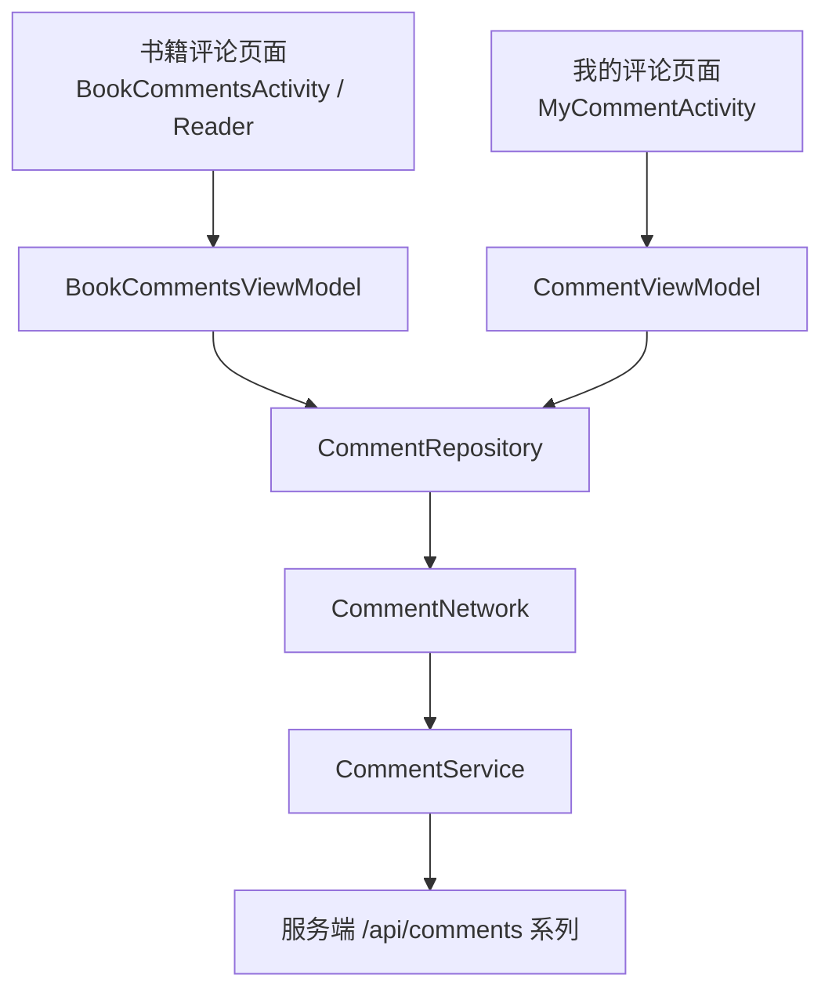
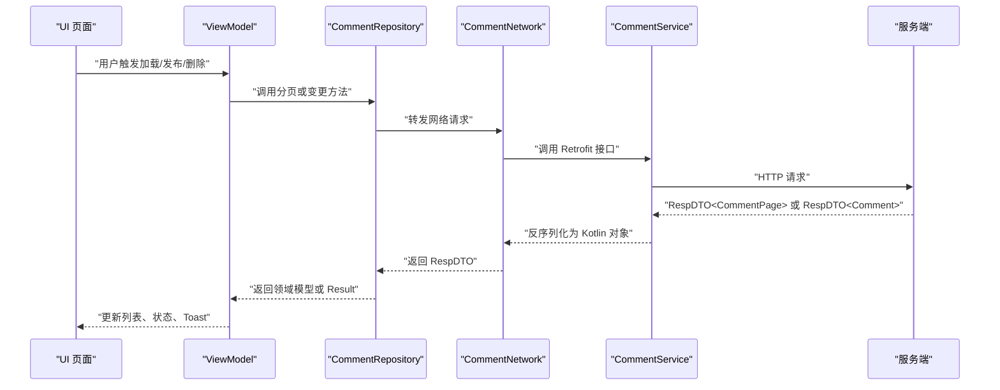
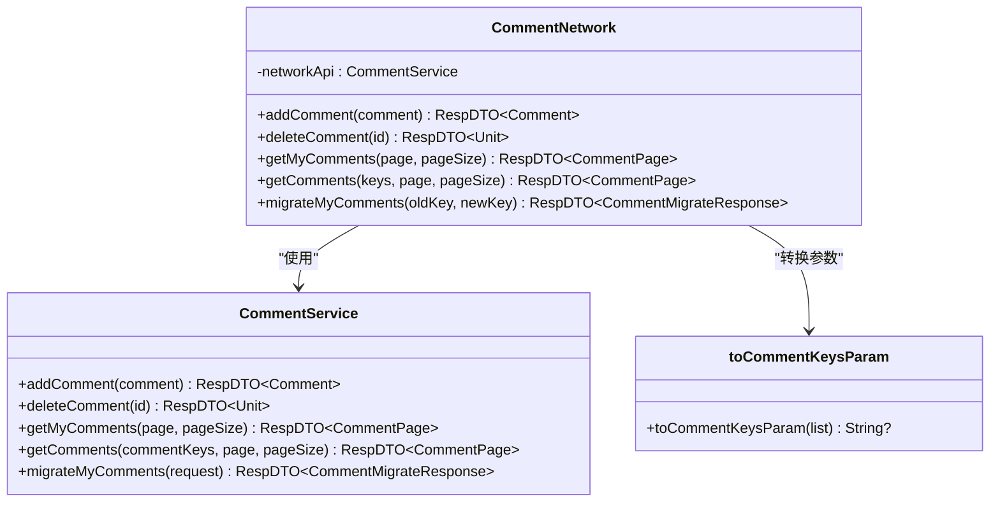
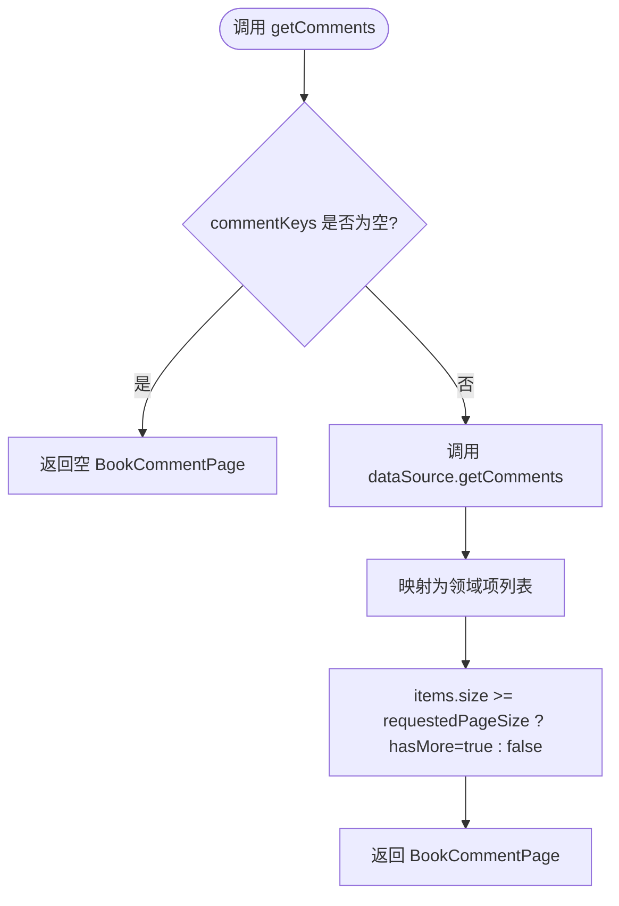
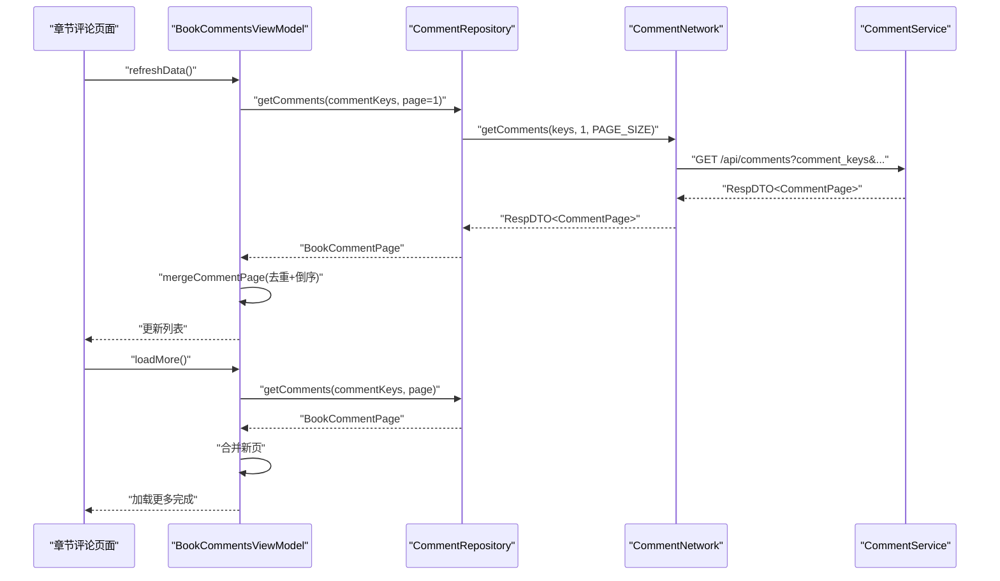
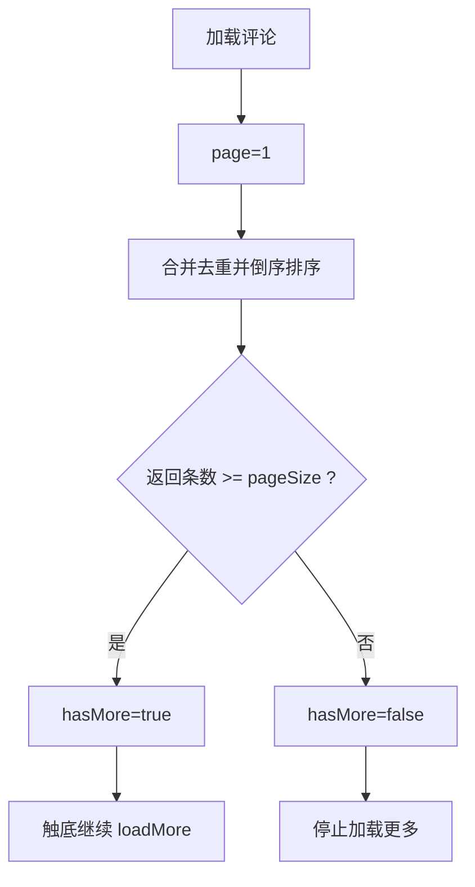

# 评论 API

<cite>
**本文引用的文件**   
- [CommentService.kt](file://lib_ebook_api/src/main/java/com/ebook/api/service/comment/CommentService.kt)
- [CommentNetwork.kt](file://lib_ebook_api/src/main/java/com/ebook/api/service/comment/CommentNetwork.kt)
- [Comment.kt](file://lib_ebook_api/src/main/java/com/ebook/api/entity/Comment.kt)
- [CommentPage.kt](file://lib_ebook_api/src/main/java/com/ebook/api/entity/CommentPage.kt)
- [CommentMigrate.kt](file://lib_ebook_api/src/main/java/com/ebook/api/entity/CommentMigrate.kt)
- [CommentRepository.kt](file://lib_book_common/src/main/java/com/ebook/common/repository/CommentRepository.kt)
- [BookComment.kt](file://lib_book_common/src/main/java/com/ebook/common/domain/BookComment.kt)
- [BookCommentPage.kt](file://lib_book_common/src/main/java/com/ebook/common/domain/BookCommentPage.kt)
- [CommentKey.kt](file://lib_book_common/src/main/java/com/ebook/common/domain/CommentKey.kt)
- [CommentTime.kt](file://lib_book_common/src/main/java/com/ebook/common/domain/CommentTime.kt)
- [BookCommentsViewModel.kt](file://module_book/src/main/java/com/ebook/book/mvvm/viewmodel/BookCommentsViewModel.kt)
- [CommentViewModel.kt](file://module_me/src/main/java/com/ebook/me/mvvm/viewmodel/CommentViewModel.kt)
- [0013-comment-and-profile-api-alignment.md](file://docs/adr/0013-comment-and-profile-api-alignment.md)
</cite>

## 目录
1. [简介](#简介)
2. [项目结构中的评论模块](#项目结构中的评论模块)
3. [核心组件](#核心组件)
4. [架构总览](#架构总览)
5. [详细组件分析](#详细组件分析)
6. [API 端点定义](#api-端点定义)
7. [数据模型](#数据模型)
8. [分页、排序与过滤](#分页排序与过滤)
9. [请求与响应示例](#请求与响应示例)
10. [实时更新机制](#实时更新机制)
11. [内容验证与安全](#内容验证与安全)
12. [性能优化与用户体验](#性能优化与用户体验)
13. [故障排查指南](#故障排查指南)
14. [结论](#结论)

## 简介
本文面向评论服务的客户端侧实现，记录章节评论和用户评论相关的 HTTP 接口契约、数据模型、分页加载、排序规则、过滤方式、安全策略以及性能优化方案。文档基于仓库中 `lib_ebook_api`（网络层）、`lib_book_common`（领域与仓库层）和 `module_book`、`module_me`（业务 ViewModel）的源码整理而成，并补充 ADR-0013 中对评论与服务端 RESTful 契约对齐的设计决策。

## 项目结构中的评论模块
评论能力横跨四层：
- 网络层：`lib_ebook_api` 中的 `CommentService`、`CommentNetwork` 及 `Comment`、`CommentPage`、`CommentMigrateRequest`、`CommentMigrateResponse` 等实体。
- 仓库层：`lib_book_common` 中的 `CommentRepository`，负责分页短路、`hasMore` 判定、领域模型映射、删除成功判据统一。
- 领域层：`lib_book_common` 中的 `BookComment`、`BookCommentPage`、`CommentKey`、`CommentTime`，承载评论语义、聚合键计算和时间口径。
- 表现层：`module_book` 的 `BookCommentsViewModel`（章节评论）与 `module_me` 的 `CommentViewModel`（我的评论）。

**图表来源** 
- [BookCommentsViewModel.kt:1-179](file://module_book/src/main/java/com/ebook/book/mvvm/viewmodel/BookCommentsViewModel.kt#L1-L179)
- [CommentViewModel.kt:1-71](file://module_me/src/main/java/com/ebook/me/mvvm/viewmodel/CommentViewModel.kt#L1-L71)
- [CommentRepository.kt:1-114](file://lib_book_common/src/main/java/com/ebook/common/repository/CommentRepository.kt#L1-L114)
- [CommentNetwork.kt:1-63](file://lib_ebook_api/src/main/java/com/ebook/api/service/comment/CommentNetwork.kt#L1-L63)
- [CommentService.kt:1-62](file://lib_ebook_api/src/main/java/com/ebook/api/service/comment/CommentService.kt#L1-L62)

**章节来源**
- [BookCommentsViewModel.kt:1-179](file://module_book/src/main/java/com/ebook/book/mvvm/viewmodel/BookCommentsViewModel.kt#L1-L179)
- [CommentViewModel.kt:1-71](file://module_me/src/main/java/com/ebook/me/mvvm/viewmodel/CommentViewModel.kt#L1-L71)
- [CommentRepository.kt:1-114](file://lib_book_common/src/main/java/com/ebook/common/repository/CommentRepository.kt#L1-L114)
- [CommentNetwork.kt:1-63](file://lib_ebook_api/src/main/java/com/ebook/api/service/comment/CommentNetwork.kt#L1-L63)
- [CommentService.kt:1-62](file://lib_ebook_api/src/main/java/com/ebook/api/service/comment/CommentService.kt#L1-L62)

## 核心组件
- `CommentService`：Retrofit 接口，声明评论创建、删除、查询“我的评论”、按聚合键列表查询、迁移旧键到新的端点。
- `CommentNetwork`：真实后端数据源，构造带评论服务主机与端口的 Retrofit 实例，并把聚合键列表转成逗号分隔查询参数。
- `CommentRepository`：仓库层门面，封装分页、合并、时间排序、删除成功判断、迁移条数解析。
- `BookComment` / `BookCommentPage`：领域模型，解耦传输层嵌套结构；`BookCommentPage` 用 `hasMore` 替代对 `total` 的信任。
- `CommentKey`：客户端派生的作品身份键，版本前缀 `ck1`，对书名、作者做归一化后 SHA-256，避免服务端解释书籍信息。
- `CommentTime`：评论时间的唯一口径，把服务器时间串转换为秒级排序键与分钟级展示文本。
- `BookCommentsViewModel`：章节评论分页、合并、去重、本人判定、新增与删除。
- `CommentViewModel`：我的评论一次性全量拉取、按时间倒序、删除后刷新。

**章节来源**
- [CommentService.kt:1-62](file://lib_ebook_api/src/main/java/com/ebook/api/service/comment/CommentService.kt#L1-L62)
- [CommentNetwork.kt:1-63](file://lib_ebook_api/src/main/java/com/ebook/api/service/comment/CommentNetwork.kt#L1-L63)
- [CommentRepository.kt:1-114](file://lib_book_common/src/main/java/com/ebook/common/repository/CommentRepository.kt#L1-L114)
- [BookComment.kt:1-18](file://lib_book_common/src/main/java/com/ebook/common/domain/BookComment.kt#L1-L18)
- [BookCommentPage.kt:1-17](file://lib_book_common/src/main/java/com/ebook/common/domain/BookCommentPage.kt#L1-L17)
- [CommentKey.kt:1-84](file://lib_book_common/src/main/java/com/ebook/common/domain/CommentKey.kt#L1-L84)
- [CommentTime.kt:1-29](file://lib_book_common/src/main/java/com/ebook/common/domain/CommentTime.kt#L1-L29)
- [BookCommentsViewModel.kt:1-179](file://module_book/src/main/java/com/ebook/book/mvvm/viewmodel/BookCommentsViewModel.kt#L1-L179)
- [CommentViewModel.kt:1-71](file://module_me/src/main/java/com/ebook/me/mvvm/viewmodel/CommentViewModel.kt#L1-L71)

## 架构总览
评论请求从 UI 层进入对应 ViewModel，再通过 `CommentRepository` 调用 `CommentDataSource`（由 `CommentNetwork` 实现），最终访问 `CommentService` 暴露的 `/api/comments` 系列 REST 端点。返回数据在仓库层映射为领域模型，再由 ViewModel 进行分页合并、去重和排序。

**图表来源**
- [BookCommentsViewModel.kt:1-179](file://module_book/src/main/java/com/ebook/book/mvvm/viewmodel/BookCommentsViewModel.kt#L1-L179)
- [CommentViewModel.kt:1-71](file://module_me/src/main/java/com/ebook/me/mvvm/viewmodel/CommentViewModel.kt#L1-L71)
- [CommentRepository.kt:1-114](file://lib_book_common/src/main/java/com/ebook/common/repository/CommentRepository.kt#L1-L114)
- [CommentNetwork.kt:1-63](file://lib_ebook_api/src/main/java/com/ebook/api/service/comment/CommentNetwork.kt#L1-L63)
- [CommentService.kt:1-62](file://lib_ebook_api/src/main/java/com/ebook/api/service/comment/CommentService.kt#L1-L62)

## 详细组件分析

### 评论服务接口与网络层
`CommentService` 将评论相关操作收敛到 `/api/comments` 系端点，包含：
- 创建评论：`POST /api/comments`
- 删除评论：`DELETE /api/comments/{id}`
- 我的评论：`GET /api/comments/my?page&page_size`
- 查询评论：`GET /api/comments?comment_keys&page&page_size`
- 迁移评论键：`POST /api/comments/migrate`

`CommentNetwork` 通过 `RetrofitBuilder` 构造评论服务专用 Base URL，并在查询时将聚合键列表去重、截断至上限后转为逗号分隔字符串；空列表转为 `null`，以命中服务端“全局最新列表”分支。

**图表来源**
- [CommentService.kt:1-62](file://lib_ebook_api/src/main/java/com/ebook/api/service/comment/CommentService.kt#L1-L62)
- [CommentNetwork.kt:1-63](file://lib_ebook_api/src/main/java/com/ebook/api/service/comment/CommentNetwork.kt#L1-L63)

**章节来源**
- [CommentService.kt:1-62](file://lib_ebook_api/src/main/java/com/ebook/api/service/comment/CommentService.kt#L1-L62)
- [CommentNetwork.kt:1-63](file://lib_ebook_api/src/main/java/com/ebook/api/service/comment/CommentNetwork.kt#L1-L63)

### 仓库层与领域模型
`CommentRepository` 提供统一的评论入口：
- 删除评论：以业务码 `00000` 为成功判据，不再依赖 `data` 非空。
- 获取我的评论：当前一次性拉取大页，后续若接入分页会并入通用页大小。
- 添加评论：将领域模型映射为 API 实体，成功后再映射回领域模型。
- 分页获取评论：空键列表直接返回空页，不发请求；否则调用网络层并按返回条数判定 `hasMore`。
- 迁移评论键：解析迁移响应中的迁移条数，供调用方提示。

领域模型方面：
- `BookComment` 扁平化存储评论字段，不包含嵌套 `User`。
- `BookCommentPage` 只保留 `items` 与 `hasMore`，避免上游直接使用传输层的 `CommentPage`。

**图表来源**
- [CommentRepository.kt:1-114](file://lib_book_common/src/main/java/com/ebook/common/repository/CommentRepository.kt#L1-L114)

**章节来源**
- [CommentRepository.kt:1-114](file://lib_book_common/src/main/java/com/ebook/common/repository/CommentRepository.kt#L1-L114)
- [BookComment.kt:1-18](file://lib_book_common/src/main/java/com/ebook/common/domain/BookComment.kt#L1-L18)
- [BookCommentPage.kt:1-17](file://lib_book_common/src/main/java/com/ebook/common/domain/BookCommentPage.kt#L1-L17)

### 章节评论与我的评论 ViewModel
`BookCommentsViewModel`：
- 维护当前会话用户 ID，用于“本人评论”判定。
- 维护 `commentKeys` 作为 M2 聚合键列表，支持跨源合并时一次查询多个键。
- 首屏刷新重置下一页为 2，并设置 `hasMoreData`。
- 加载更多存在在途闸门，防止滚动连续触发重复请求。
- 新增评论时校验内容非空，未登录时 userId 置 0，交由服务端按 token 拒绝。
- 删除评论成功后刷新列表。

`CommentViewModel`：
- “我的评论”一次性全量拉取，不做分页。
- 按 `CommentTime.sortMillis` 倒序显示。
- 删除成功后重新拉取全量列表。

**图表来源**
- [BookCommentsViewModel.kt:1-179](file://module_book/src/main/java/com/ebook/book/mvvm/viewmodel/BookCommentsViewModel.kt#L1-L179)
- [CommentRepository.kt:1-114](file://lib_book_common/src/main/java/com/ebook/common/repository/CommentRepository.kt#L1-L114)
- [CommentNetwork.kt:1-63](file://lib_ebook_api/src/main/java/com/ebook/api/service/comment/CommentNetwork.kt#L1-L63)
- [CommentService.kt:1-62](file://lib_ebook_api/src/main/java/com/ebook/api/service/comment/CommentService.kt#L1-L62)

**章节来源**
- [BookCommentsViewModel.kt:1-179](file://module_book/src/main/java/com/ebook/book/mvvm/viewmodel/BookCommentsViewModel.kt#L1-L179)
- [CommentViewModel.kt:1-71](file://module_me/src/main/java/com/ebook/me/mvvm/viewmodel/CommentViewModel.kt#L1-L71)

## API 端点定义

### 创建评论
- 方法：`POST`
- 路径：`/api/comments`
- 认证：需登录
- 请求体：`Comment`
- 必填字段：`content`、`comment_key`
- 可选字段：章节快照字段如 `chapter_url`、`chapter_name`、`book_name`
- 响应：`RespDTO<Comment>`

**章节来源**
- [CommentService.kt:15-24](file://lib_ebook_api/src/main/java/com/ebook/api/service/comment/CommentService.kt#L15-L24)
- [Comment.kt:1-39](file://lib_ebook_api/src/main/java/com/ebook/api/entity/Comment.kt#L1-L39)

### 删除评论
- 方法：`DELETE`
- 路径：`/api/comments/{id}`
- 认证：需登录，仅本人或管理员可删
- 路径参数：`id`
- 响应：`RespDTO<Unit>`，成功时 `data` 为 `null`，以业务码 `00000` 判断成功

**章节来源**
- [CommentService.kt:26-33](file://lib_ebook_api/src/main/java/com/ebook/api/service/comment/CommentService.kt#L26-L33)
- [CommentRepository.kt:18-27](file://lib_book_common/src/main/java/com/ebook/common/repository/CommentRepository.kt#L18-L27)

### 我的评论列表
- 方法：`GET`
- 路径：`/api/comments/my`
- 认证：需登录，身份取自 token
- 查询参数：`page`、`page_size`
- 响应：`RespDTO<CommentPage>`，返回该用户的评论分页结果

**章节来源**
- [CommentService.kt:35-43](file://lib_ebook_api/src/main/java/com/ebook/api/service/comment/CommentService.kt#L35-L43)
- [CommentViewModel.kt:1-71](file://module_me/src/main/java/com/ebook/me/mvvm/viewmodel/CommentViewModel.kt#L1-L71)

### 查询评论（章节评论）
- 方法：`GET`
- 路径：`/api/comments`
- 查询参数：
  - `comment_keys`：逗号分隔的聚合键列表
  - `page`：页码
  - `page_size`：每页条数
- 行为：返回这些聚合键匹配的评论并集，按页返回
- 限制：聚合键数量超过上限会返回错误码；客户端去重并截断至最大允许值
- 响应：`RespDTO<CommentPage>`

**章节来源**
- [CommentService.kt:45-53](file://lib_ebook_api/src/main/java/com/ebook/api/service/comment/CommentService.kt#L45-L53)
- [CommentNetwork.kt:35-63](file://lib_ebook_api/src/main/java/com/ebook/api/service/comment/CommentNetwork.kt#L35-L63)
- [CommentRepository.kt:56-75](file://lib_book_common/src/main/java/com/ebook/common/repository/CommentRepository.kt#L56-L75)

### 迁移我的评论
- 方法：`POST`
- 路径：`/api/comments/migrate`
- 认证：需登录
- 请求体：`CommentMigrateRequest{old_key, new_key}`
- 行为：服务端按当前登录用户过滤，只修改自己的评论
- 响应：`RespDTO<CommentMigrateResponse{migrated_count}>`

**章节来源**
- [CommentService.kt:55-62](file://lib_ebook_api/src/main/java/com/ebook/api/service/comment/CommentService.kt#L55-L62)
- [CommentMigrate.kt:1-26](file://lib_ebook_api/src/main/java/com/ebook/api/entity/CommentMigrate.kt#L1-L26)
- [CommentRepository.kt:77-88](file://lib_book_common/src/main/java/com/ebook/common/repository/CommentRepository.kt#L77-L88)

## 数据模型

### 评论实体（传输层）
`Comment` 是对齐服务端蛇形字段的 Kotlin 实体，同时承担创建请求体和响应项：
- `id`：评论标识
- `user`：复用 `User` 实体，包含 `uid`、`username`、`nickname`、`avatar`
- `comment_key`：评论聚合键，M2 新增，创建必填
- `chapter_url`：已废弃，保留兼容
- `chapter_name`：当前章节名称
- `book_name`：书籍名称
- `content`：评论内容，创建必填
- `add_time`：服务器时间串，格式为 `Asia/Shanghai` 的 `yyyy-MM-dd HH:mm:ss`

**章节来源**
- [Comment.kt:1-39](file://lib_ebook_api/src/main/java/com/ebook/api/entity/Comment.kt#L1-L39)

### 评论分页响应（传输层）
`CommentPage`：
- `items`：评论列表
- `total`：总数
- `page`：当前页
- `page_size`：每页大小

**章节来源**
- [CommentPage.kt:1-18](file://lib_ebook_api/src/main/java/com/ebook/api/entity/CommentPage.kt#L1-L18)

### 评论领域模型
`BookComment`：
- 扁平化字段，无嵌套 `User`
- 字段包括 `id`、`userId`、`username`、`avatar`、`commentKey`、`chapterUrl`、`chapterName`、`bookName`、`content`、`addTime`

**章节来源**
- [BookComment.kt:1-18](file://lib_book_common/src/main/java/com/ebook/common/domain/BookComment.kt#L1-L18)

### 评论领域分页
`BookCommentPage`：
- `items`：本页评论
- `hasMore`：是否可能还有下一页；判据为返回条数达到本次请求页大小，不信任服务端 `total`

**章节来源**
- [BookCommentPage.kt:1-17](file://lib_book_common/src/main/java/com/ebook/common/domain/BookCommentPage.kt#L1-L17)

### 评论聚合键
`CommentKey`：
- 算法版本前缀 `ck1`
- 输入：标题与作者
- 归一化：去除书名号装饰、全角转半角、小写、折叠空白
- 占位作者词（佚名、侠名、未知等）归一为空串，使同一本无作者书不会拆键
- 输出：`ck1:<SHA-256 十六进制摘要>`

**章节来源**
- [CommentKey.kt:1-84](file://lib_book_common/src/main/java/com/ebook/common/domain/CommentKey.kt#L1-L84)

### 评论时间口径
`CommentTime`：
- `sortMillis`：解析为秒级毫秒时间戳，不可解析为 0
- `displayText`：格式化到分钟，不可解析为空串

**章节来源**
- [CommentTime.kt:1-29](file://lib_book_common/src/main/java/com/ebook/common/domain/CommentTime.kt#L1-L29)

### 迁移请求与响应
`CommentMigrateRequest`：
- `old_key`：旧聚合键
- `new_key`：新聚合键

`CommentMigrateResponse`：
- `migrated_count`：迁移条数

**章节来源**
- [CommentMigrate.kt:1-26](file://lib_ebook_api/src/main/java/com/ebook/api/entity/CommentMigrate.kt#L1-L26)

## 分页、排序与过滤

### 分页机制
- 章节评论采用分页加载：首页 `page = 1`，加载更多推进 `page + 1`。
- 默认页大小为 20；“我的评论”当前一次性拉取 100 条。
- `hasMore` 由仓库层根据“返回条数达到本次请求页大小”判定，不依赖服务端 `total`。
- 空聚合键列表直接返回空页，不发网络请求。

**图表来源**
- [CommentRepository.kt:89-114](file://lib_book_common/src/main/java/com/ebook/common/repository/CommentRepository.kt#L89-L114)
- [BookCommentsViewModel.kt:57-130](file://module_book/src/main/java/com/ebook/book/mvvm/viewmodel/BookCommentsViewModel.kt#L57-L130)

**章节来源**
- [CommentRepository.kt:89-114](file://lib_book_common/src/main/java/com/ebook/common/repository/CommentRepository.kt#L89-L114)
- [BookCommentsViewModel.kt:57-130](file://module_book/src/main/java/com/ebook/book/mvvm/viewmodel/BookCommentsViewModel.kt#L57-L130)

### 排序方式
- 章节评论与“我的评论”都按 `addTime` 倒序显示。
- 排序键来自 `CommentTime.sortMillis`，精度到秒。
- 合并新页时先按 `id` 去重，再整体倒序，保证并发窗口下列表收敛一致。

**章节来源**
- [CommentTime.kt:1-29](file://lib_book_common/src/main/java/com/ebook/common/domain/CommentTime.kt#L1-L29)
- [BookCommentsViewModel.kt:132-179](file://module_book/src/main/java/com/ebook/book/mvvm/viewmodel/BookCommentsViewModel.kt#L132-L179)
- [CommentViewModel.kt:30-45](file://module_me/src/main/java/com/ebook/me/mvvm/viewmodel/CommentViewModel.kt#L30-L45)

### 过滤条件
- 章节评论通过 `comment_keys` 过滤：传入一个或多个聚合键，服务端返回并集。
- 聚合键由客户端派生，服务端不解释内容，只用作桶键。
- 聚合键列表去重、截断至最大允许值，空列表短路返回空页。

**章节来源**
- [CommentNetwork.kt:45-63](file://lib_ebook_api/src/main/java/com/ebook/api/service/comment/CommentNetwork.kt#L45-L63)
- [CommentRepository.kt:56-75](file://lib_book_common/src/main/java/com/ebook/common/repository/CommentRepository.kt#L56-L75)
- [CommentKey.kt:1-84](file://lib_book_common/src/main/java/com/ebook/common/domain/CommentKey.kt#L1-L84)

## 请求与响应示例

以下示例描述请求与响应的结构，不直接复制仓库源码内容；实际字段名与类型以注释和源码为准。

### 创建评论请求
- 方法：`POST`
- 路径：`/api/comments`
- 请求体字段：
  - `content`：评论内容，必填
  - `comment_key`：聚合键，必填
  - `chapter_url`：章节链接，可选
  - `chapter_name`：章节名称，可选
  - `book_name`：书籍名称，可选

### 创建评论响应
- 响应包裹：`RespDTO<Comment>`
- `data`：`Comment`
  - `id`：服务端返回的评论 ID
  - `user`：评论作者信息
  - `comment_key`：聚合键
  - `chapter_url`、`chapter_name`、`book_name`：章节快照
  - `content`：评论内容
  - `add_time`：服务器时间串

**章节来源**
- [CommentService.kt:15-24](file://lib_ebook_api/src/main/java/com/ebook/api/service/comment/CommentService.kt#L15-L24)
- [Comment.kt:1-39](file://lib_ebook_api/src/main/java/com/ebook/api/entity/Comment.kt#L1-L39)

### 查询评论请求
- 方法：`GET`
- 路径：`/api/comments`
- 查询参数：
  - `comment_keys`：例如 `ck1:hash1,ck1:hash2`
  - `page`：页码
  - `page_size`：每页条数

### 查询评论响应
- 响应包裹：`RespDTO<CommentPage>`
- `data`：`CommentPage`
  - `items`：评论数组
  - `total`：总数
  - `page`：当前页
  - `page_size`：每页大小

**章节来源**
- [CommentService.kt:45-53](file://lib_ebook_api/src/main/java/com/ebook/api/service/comment/CommentService.kt#L45-L53)
- [CommentPage.kt:1-18](file://lib_ebook_api/src/main/java/com/ebook/api/entity/CommentPage.kt#L1-L18)

### 删除评论响应
- 响应包裹：`RespDTO<Unit>`
- 成功时 `data` 为 `null`，以业务码 `00000` 判断成功

**章节来源**
- [CommentService.kt:26-33](file://lib_ebook_api/src/main/java/com/ebook/api/service/comment/CommentService.kt#L26-L33)
- [CommentRepository.kt:18-27](file://lib_book_common/src/main/java/com/ebook/common/repository/CommentRepository.kt#L18-L27)

### 迁移评论请求与响应
- 请求体：`CommentMigrateRequest{old_key, new_key}`
- 响应：`RespDTO<CommentMigrateResponse{migrated_count}>`

**章节来源**
- [CommentMigrate.kt:1-26](file://lib_ebook_api/src/main/java/com/ebook/api/entity/CommentMigrate.kt#L1-L26)
- [CommentService.kt:55-62](file://lib_ebook_api/src/main/java/com/ebook/api/service/comment/CommentService.kt#L55-L62)

### 嵌套评论结构说明
当前仓库中的评论模型采用扁平化的 `BookComment`，不直接表达“回复评论”的树形嵌套。`Comment` 中的 `user` 是与评论关联的作者视图，而非子评论。若未来需要嵌套评论，应在领域层新增 `children` 或类似结构，并在仓库层进行聚合与排序。

[本节为概念性说明，不直接分析具体代码文件]

## 实时更新机制
仓库与 ViewModel 中没有 WebSocket 连接或长轮询实现。评论数据的实时性主要通过以下方式体现：
- 章节评论：新增或删除评论后主动刷新列表。
- “我的评论”：删除评论后重新拉取全量列表。
- 合并逻辑：分页加载时对 `id` 去重，并按时间倒序重排，缓解并发窗口下的顺序抖动。

因此，当前实现属于“用户触发式更新”，而不是服务端推送驱动的实时更新。

**章节来源**
- [BookCommentsViewModel.kt:94-130](file://module_book/src/main/java/com/ebook/book/mvvm/viewmodel/BookCommentsViewModel.kt#L94-L130)
- [CommentViewModel.kt:52-71](file://module_me/src/main/java/com/ebook/me/mvvm/viewmodel/CommentViewModel.kt#L52-L71)
- [BookCommentsViewModel.kt:132-179](file://module_book/src/main/java/com/ebook/book/mvvm/viewmodel/BookCommentsViewModel.kt#L132-L179)

## 内容验证与安全

### 内容验证
- 章节评论新增时，ViewModel 检查评论内容非空；空内容不发送请求并提示用户。
- 创建评论的请求体要求 `content` 与 `comment_key` 必填。

**章节来源**
- [BookCommentsViewModel.kt:114-130](file://module_book/src/main/java/com/ebook/book/mvvm/viewmodel/BookCommentsViewModel.kt#L114-L130)
- [CommentService.kt:15-24](file://lib_ebook_api/src/main/java/com/ebook/api/service/comment/CommentService.kt#L15-L24)

### 敏感词过滤
仓库、网络层与 ViewModel 中没有显式的敏感词过滤逻辑。当前安全边界主要依赖服务端鉴权与可能的服务端内容审核。客户端侧未实现关键词拦截、替换或上报。

[本节为现状说明，未引用具体过滤实现]

### 安全管理措施
- 认证：创建、删除、“我的评论”、迁移均需登录，身份取自 token。
- 权限：删除仅本人或管理员可执行。
- 聚合键安全：`comment_key` 由客户端派生且不透明，服务端不解释书籍信息，避免泄露书名、作者等元数据。
- 头像上传与资料更新走独立两步流程，不在评论接口中直传头像文件。

**章节来源**
- [CommentService.kt:15-62](file://lib_ebook_api/src/main/java/com/ebook/api/service/comment/CommentService.kt#L15-L62)
- [CommentKey.kt:1-84](file://lib_book_common/src/main/java/com/ebook/common/domain/CommentKey.kt#L1-L84)
- [0013-comment-and-profile-api-alignment.md:1-32](file://docs/adr/0013-comment-and-profile-api-alignment.md#L1-L32)

## 性能优化与用户体验

### 分页与首屏体验
- 章节评论默认页大小为 20，评论条目轻，首屏加载快。
- “我的评论”当前一次性拉取 100 条，避免超出即静默截断的悬崖；后续接入分页时会并入通用页大小。
- 加载更多有在途闸门，防止滚动事件导致重复请求。

**章节来源**
- [CommentRepository.kt:96-114](file://lib_book_common/src/main/java/com/ebook/common/repository/CommentRepository.kt#L96-L114)
- [BookCommentsViewModel.kt:67-88](file://module_book/src/main/java/com/ebook/book/mvvm/viewmodel/BookCommentsViewModel.kt#L67-L88)

### 数据合并与一致性
- 合并新页时按 `id` 去重，避免刷新与加载更多并发导致重复条目。
- 按 `CommentTime.sortMillis` 整体倒序排序，保证不同窗口到达的页收敛为一致展示序。

**章节来源**
- [BookCommentsViewModel.kt:132-179](file://module_book/src/main/java/com/ebook/book/mvvm/viewmodel/BookCommentsViewModel.kt#L132-L179)

### 时间显示一致性
- 所有评论展示时间使用 `CommentTime.displayText`，统一到分钟级别，避免两个页面出现不同时间格式。
- 时间解析不进行时区换算，保持服务器墙钟时间原样显示。

**章节来源**
- [CommentTime.kt:1-29](file://lib_book_common/src/main/java/com/ebook/common/domain/CommentTime.kt#L1-L29)
- [CommentViewModel.kt:30-45](file://module_me/src/main/java/com/ebook/me/mvvm/viewmodel/CommentViewModel.kt#L30-L45)

### 用户体验改进建议
- 可增加本地乐观更新：新增评论后立即插入列表，失败时回滚。
- 可增加敏感词前端校验与提示，减少无效网络请求。
- 可为评论列表增加骨架屏与空态文案，提升加载反馈。
- 可将“我的评论”改为真正分页，降低单次载荷。

[本节为通用优化建议，不直接分析具体代码文件]

## 故障排查指南

### 删除评论始终失败
- 检查业务码是否为 `00000`；删除成功时 `data` 为 `null`，不能以 `data` 非空判断成功。
- 确认当前用户是否为评论作者或管理员。

**章节来源**
- [CommentRepository.kt:18-27](file://lib_book_common/src/main/java/com/ebook/common/repository/CommentRepository.kt#L18-L27)

### 章节评论为空
- 如果 `commentKeys` 为空，仓库层直接返回空页，不发请求；检查是否误传空列表。
- 如果传入过多聚合键，客户端会去重并截断至上限；超过上限可能导致部分键未参与查询。

**章节来源**
- [CommentRepository.kt:56-75](file://lib_book_common/src/main/java/com/ebook/common/repository/CommentRepository.kt#L56-L75)
- [CommentNetwork.kt:45-63](file://lib_ebook_api/src/main/java/com/ebook/api/service/comment/CommentNetwork.kt#L45-L63)

### 评论顺序不一致
- 检查是否使用 `CommentTime.sortMillis` 作为排序键。
- 检查是否在并发刷新与加载更多后执行了整体去重与倒序合并。

**章节来源**
- [CommentTime.kt:1-29](file://lib_book_common/src/main/java/com/ebook/common/domain/CommentTime.kt#L1-L29)
- [BookCommentsViewModel.kt:132-179](file://module_book/src/main/java/com/ebook/book/mvvm/viewmodel/BookCommentsViewModel.kt#L132-L179)

### 我的评论显示异常
- 当前实现一次性拉取 100 条；若数据量大，应考虑分页改造。
- 删除后需重新拉取全量列表，确保服务端为唯一数据源。

**章节来源**
- [CommentRepository.kt:29-43](file://lib_book_common/src/main/java/com/ebook/common/repository/CommentRepository.kt#L29-L43)
- [CommentViewModel.kt:1-71](file://module_me/src/main/java/com/ebook/me/mvvm/viewmodel/CommentViewModel.kt#L1-L71)

## 结论
评论 API 在当前仓库中以 RESTful 风格收口到 `/api/comments` 系列端点，并通过客户端派生的不透明 `comment_key` 解决跨源与本地书籍的评论聚合问题。网络层、仓库层与 ViewModel 分层清晰：网络层负责协议适配，仓库层负责分页、映射与成功判据，ViewModel 负责用户交互、分页状态和本人判定。分页采用“返回条数达到请求页大小即认为还有下一页”的策略，排序统一使用秒级时间戳倒序。当前没有 WebSocket 或长轮询，实时更新依赖用户操作触发刷新。安全方面依赖登录鉴权、本人/管理员删除限制以及不透明聚合键；敏感词过滤尚未在客户端实现。性能方面通过轻量页大小、去重合并和在途闸门保障体验，后续可进一步引入乐观更新、真实分页与前端内容校验。