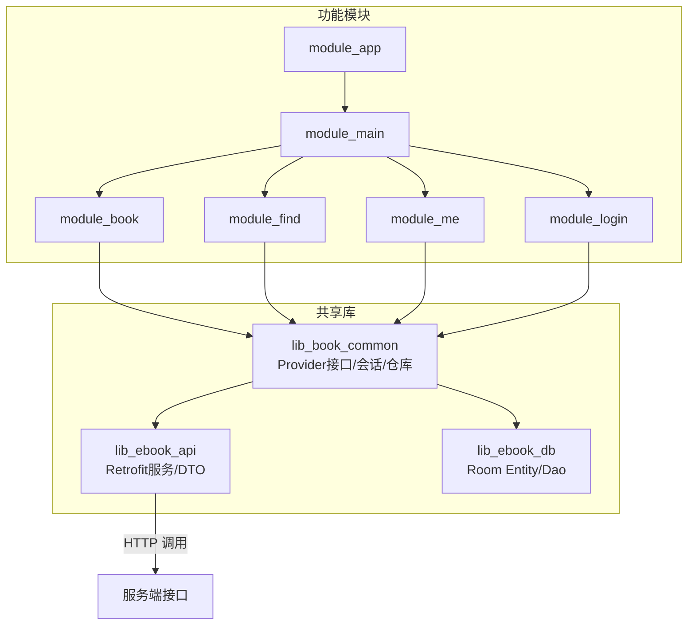
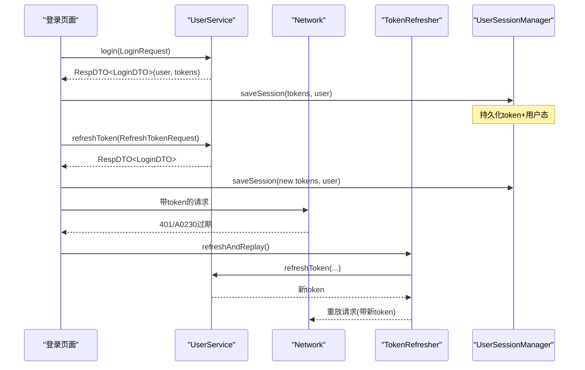
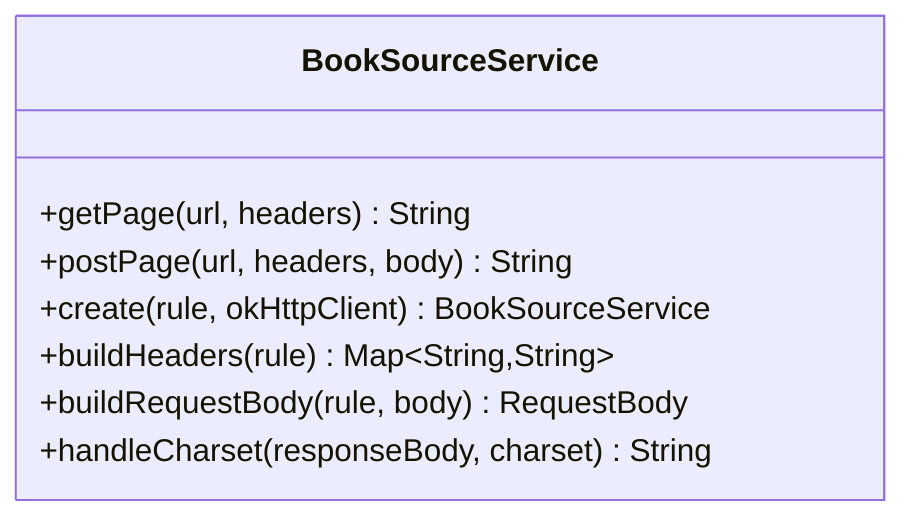
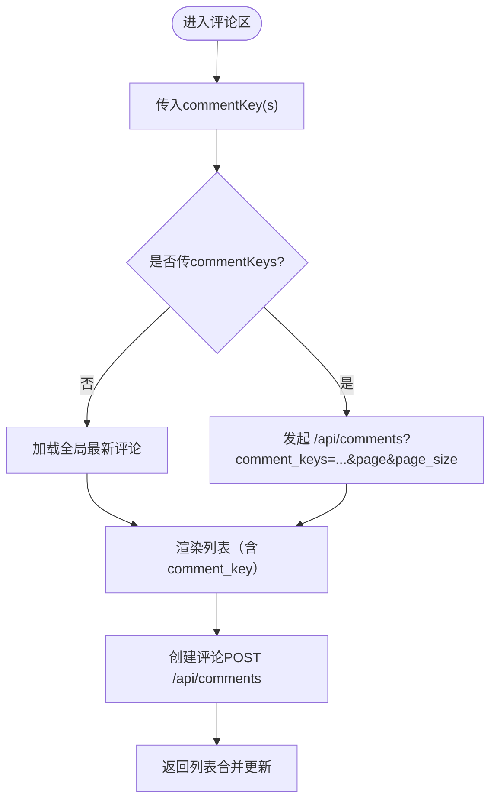
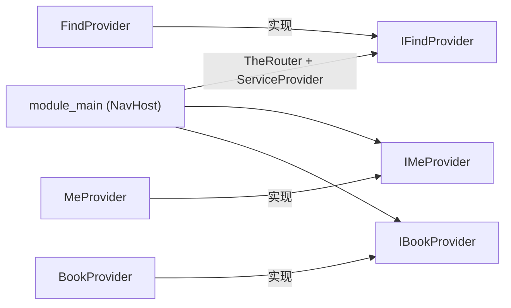
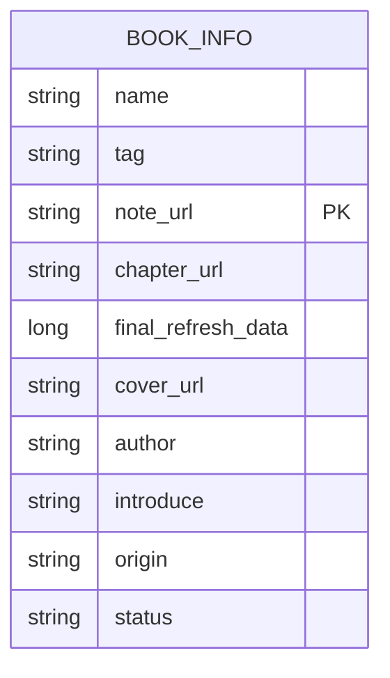

# API参考

<cite>
**本文引用的文件**
- [lib_ebook_api/src/main/java/com/ebook/api/service/user/UserService.kt](file://lib_ebook_api/src/main/java/com/ebook/api/service/user/UserService.kt)
- [lib_ebook_api/src/main/java/com/ebook/api/service/comment/CommentService.kt](file://lib_ebook_api/src/main/java/com/ebook/api/service/comment/CommentService.kt)
- [lib_ebook_api/src/main/java/com/ebook/api/service/source/BookSourceService.kt](file://lib_ebook_api/src/main/java/com/ebook/api/service/source/BookSourceService.kt)
- [lib_ebook_api/src/main/java/com/ebook/api/service/release/ReleaseService.kt](file://lib_ebook_api/src/main/java/com/ebook/api/service/release/ReleaseService.kt)
- [lib_ebook_api/src/main/java/com/ebook/api/entity/LoginDTO.kt](file://lib_ebook_api/src/main/java/com/ebook/api/entity/LoginDTO.kt)
- [lib_ebook_api/src/main/java/com/ebook/api/entity/User.kt](file://lib_ebook_api/src/main/java/com/ebook/api/entity/User.kt)
- [lib_ebook_api/src/main/java/com/ebook/api/entity/LoginRequest.kt](file://lib_ebook_api/src/main/java/com/ebook/api/entity/LoginRequest.kt)
- [lib_ebook_api/src/main/java/com/ebook/api/entity/RegisterRequest.kt](file://lib_ebook_api/src/main/java/com/ebook/api/entity/RegisterRequest.kt)
- [lib_ebook_api/src/main/java/com/ebook/api/entity/ModifyPwdRequest.kt](file://lib_ebook_api/src/main/java/com/ebook/api/entity/ModifyPwdRequest.kt)
- [lib_ebook_api/src/main/java/com/ebook/api/entity/RefreshTokenRequest.kt](file://lib_ebook_api/src/main/java/com/ebook/api/entity/RefreshTokenRequest.kt)
- [lib_ebook_api/src/main/java/com/ebook/api/entity/SendCodeRequest.kt](file://lib_ebook_api/src/main/java/com/ebook/api/entity/SendCodeRequest.kt)
- [lib_ebook_api/src/main/java/com/ebook/api/entity/ResetPasswordRequest.kt](file://lib_ebook_api/src/main/java/com/ebook/api/entity/ResetPasswordRequest.kt)
- [lib_ebook_api/src/main/java/com/ebook/api/entity/UpdateUserRequest.kt](file://lib_ebook_api/src/main/java/com/ebook/api/entity/UpdateUserRequest.kt)
- [lib_ebook_api/src/main/java/com/ebook/api/entity/UploadResponse.kt](file://lib_ebook_api/src/main/java/com/ebook/api/entity/UploadResponse.kt)
- [lib_ebook_api/src/main/java/com/ebook/api/entity/Comment.kt](file://lib_ebook_api/src/main/java/com/ebook/api/entity/Comment.kt)
- [lib_ebook_api/src/main/java/com/ebook/api/entity/CommentPage.kt](file://lib_ebook_api/src/main/java/com/ebook/api/entity/CommentPage.kt)
- [lib_ebook_api/src/main/java/com/ebook/api/entity/CommentMigrate.kt](file://lib_ebook_api/src/main/java/com/ebook/api/entity/CommentMigrate.kt)
- [lib_ebook_api/src/main/java/com/ebook/api/entity/ReleaseResponse.kt](file://lib_ebook_api/src/main/java/com/ebook/api/entity/ReleaseResponse.kt)
- [lib_book_common/src/main/java/com/ebook/common/provider/ILoginProvider.kt](file://lib_book_common/src/main/java/com/ebook/common/provider/ILoginProvider.kt)
- [module_login/src/main/java/com/ebook/login/provider/LoginProvider.kt](file://module_login/src/main/java/com/ebook/login/provider/LoginProvider.kt)
- [lib_book_common/src/main/java/com/ebook/common/provider/IBookProvider.kt](file://lib_book_common/src/main/java/com/ebook/common/provider/IBookProvider.kt)
- [lib_book_common/src/main/java/com/ebook/common/provider/IFindProvider.kt](file://lib_book_common/src/main/java/com/ebook/common/provider/IFindProvider.kt)
- [lib_book_common/src/main/java/com/ebook/common/provider/IMeProvider.kt](file://lib_book_common/src/main/java/com/ebook/common/provider/IMeProvider.kt)
- [module_find/src/main/java/com/ebook/find/provider/FindProvider.kt](file://module_find/src/main/java/com/ebook/find/provider/FindProvider.kt)
- [module_me/src/main/java/com/ebook/me/provider/MeProvider.kt](file://module_me/src/main/java/com/ebook/me/provider/MeProvider.kt)
- [lib_book_common/src/main/java/com/ebook/common/domain/UserSession.kt](file://lib_book_common/src/main/java/com/ebook/common/domain/UserSession.kt)
- [lib_ebook_db/src/main/java/com/ebook/db/dao/BookInfoDao.kt](file://lib_ebook_db/src/main/java/com/ebook/db/dao/BookInfoDao.kt)
- [lib_ebook_db/src/main/java/com/ebook/db/entity/BookInfoEntity.kt](file://lib_ebook_db/src/main/java/com/ebook/db/entity/BookInfoEntity.kt)
- [lib_ebook_db/src/main/java/com/ebook/db/entity/LocBookShelfEntity.kt](file://lib_ebook_db/src/main/java/com/ebook/db/entity/LocBookShelfEntity.kt)
- [lib_book_common/src/main/java/com/ebook/common/repository/ProfileRepository.kt](file://lib_book_common/src/main/java/com/ebook/common/repository/ProfileRepository.kt)
- [docs/superpowers/specs/2026-09-05-m2-comment-api-contract.md](file://docs/superpowers/specs/2026-09-05-m2-comment-api-contract.md)
</cite>

## 目录
1. [简介](#简介)
2. [项目结构与分层边界](#项目结构与分层边界)
3. [公共API端点总览](#公共api端点总览)
4. [认证与用户API](#认证与用户api)
5. [搜索与书源服务](#搜索与书源服务)
6. [评论管理API](#评论管理api)
7. [跨模块通信与Provider契约](#跨模块通信与provider契约)
8. [数据库实体与DAO契约](#数据库实体与dao契约)
9. [错误处理与响应契约](#错误处理与响应契约)
10. [DTO设计、序列化与校验约定](#dtodesign序列化与校验约定)
11. [版本演进与向后兼容](#版本演进与向后兼容)
12. [SDK使用最佳实践](#sdk使用最佳实践)
13. [性能与网络优化](#性能与网络优化)
14. [故障排查指南](#故障排查指南)
15. [结论](#结论)

## 简介
本参考文档面向客户端开发者，系统化梳理 Android 小说阅读器项目的对外与服务内聚的API：包括用户认证、个人资料、评论、版本检查与书源抓取接口；以及跨模块通过 Provider SPI暴露的页面级能力（TheRouter SPI），Room数据层实体契约，和统一的错误/返回封装。读者可据此快速理解HTTP端点、请求体字段、响应结构、Provider调用方式、数据库约束，并掌握客户端SDK集成、错误处理与性能调优建议。

## 项目结构与分层边界
- 业务模块（module_app/module_main/module_book/module_find/module_me/module_login）依赖共享库 lib_book_common
- 共享库 lib_book_common 提供跨模块 Provider 接口、会话与仓库能力，向上统一暴露业务域入口
- 网络层位于 lib_ebook_api：定义 Retrofit Service、OkHttp/编解码配置、服务端请求实体（请求/响应DTO）
- 持久化层位于 lib_ebook_db：基于 Room 的本地数据库定义（Entity/Dao/Migration）
- 路由与跨模块通信经 TheRouter + Hilt EntryPoint 桥接，避免模块间直接编译期依赖

**图表来源**
- [lib_ebook_api/src/main/java/com/ebook/api/service/user/UserService.kt:22-72](file://lib_ebook_api/src/main/java/com/ebook/api/service/user/UserService.kt#L22-L72)
- [lib_ebook_api/src/main/java/com/ebook/api/service/comment/CommentService.kt:24-62](file://lib_ebook_api/src/main/java/com/ebook/api/service/comment/CommentService.kt#L24-L62)
- [lib_book_common/src/main/java/com/ebook/common/provider/ILoginProvider.kt:12-19](file://lib_book_common/src/main/java/com/ebook/common/provider/ILoginProvider.kt#L12-L19)

**章节来源**
- [lib_ebook_api/src/main/java/com/ebook/api/service/user/UserService.kt:22-72](file://lib_ebook_api/src/main/java/com/ebook/api/service/user/UserService.kt#L22-L72)
- [lib_ebook_api/src/main/java/com/ebook/api/service/comment/CommentService.kt:24-62](file://lib_ebook_api/src/main/java/com/ebook/api/service/comment/CommentService.kt#L24-L62)
- [lib_book_common/src/main/java/com/ebook/common/provider/ILoginProvider.kt:12-19](file://lib_book_common/src/main/java/com/ebook/common/provider/ILoginProvider.kt#L12-L19)

## 公共API端点总览
以下列出核心 HTTP 端点、方法、URL模式、必要参数与响应语义，便于定位实现与联调。

- 认证与会话
  - POST /api/auth/login — 登录（邮箱+密码），返回 RespDTO<LoginDTO>
  - POST /api/auth/register — 注册（邮箱+验证码+密码），返回 RespDTO<Unit>
  - POST /api/auth/send-code — 注册发码（目标契约端点），返回 RespDTO<Unit>
  - POST /api/auth/forgot-password/send-code — 找回密码发码，返回 RespDTO<Unit>
  - POST /api/auth/forgot-password/reset — 验证码重置密码，返回 RespDTO<Unit>
  - POST /api/auth/logout — 登出（作废全部refresh token），返回 RespDTO<Unit>
  - POST /api/auth/refresh — 刷新token，返回 RespDTO<LoginDTO>
- 用户资料
  - PUT /api/users/me — 更新当前用户信息（部分更新：昵称/头像/邮箱等），返回 RespDTO<User>
  - PUT /api/users/me/password — 已登录改密，返回 RespDTO<Unit>
  - POST /api/uploads/avatar — 上传头像（multipart，avatar字段，≤5MB jpg/png/webp），返回 RespDTO<UploadResponse>
- 评论
  - POST /api/comments — 创建评论（需登录；content、comment_key必填），返回 RespDTO<Comment>
  - DELETE /api/comments/{id} — 删除评论（需登录，仅本人或管理员），返回 RespDTO<Unit>
  - GET /api/comments/my — 我的评论（分页），返回 RespDTO<CommentPage>
  - GET /api/comments — 查询评论（M2支持按 comment_keys 逗号分隔列表取并集），返回 RespDTO<CommentPage>
  - POST /api/comments/migrate — 迁移我的旧键到新键，返回 RespDTO<CommentMigrateResponse>
- 版本更新检查
  - GET <完整URL> — 拉取指定仓库 latest Release，返回 ReleaseResponse
- 书源抓取（第三方网站）
  - GET/POST 动态URL — getPage/postPage，以 Rule 驱动，返回HTML字符串供解析

**章节来源**
- [lib_ebook_api/src/main/java/com/ebook/api/service/user/UserService.kt:22-72](file://lib_ebook_api/src/main/java/com/ebook/api/service/user/UserService.kt#L22-L72)
- [lib_ebook_api/src/main/java/com/ebook/api/service/comment/CommentService.kt:24-62](file://lib_ebook_api/src/main/java/com/ebook/api/service/comment/CommentService.kt#L24-L62)
- [lib_ebook_api/src/main/java/com/ebook/api/service/source/BookSourceService.kt:19-31](file://lib_ebook_api/src/main/java/com/ebook/api/service/source/BookSourceService.kt#L19-L31)
- [lib_ebook_api/src/main/java/com/ebook/api/service/release/ReleaseService.kt:15-25](file://lib_ebook_api/src/main/java/com/ebook/api/service/release/ReleaseService.kt#L15-L25)

## 认证与用户API
本节详述用户认证与会话的生命周期与接口约定。

- 登录流程
  - 调用 POST /api/auth/login，Body为 LoginRequest(email, password)
  - 返回RespDTO<LoginDTO>，其中包含用户信息与双token（access_token, refresh_token，服务器端键名为refresh_token）
  - 客户端应将TokenHolder与UserSession同步更新；若后续请求遇到A0230过期，由TokenRefresher静默刷新并重放一次请求
- 注册与找回密码
  - 注册三步：sendRegisterCode（SendCodeRequest.email）→ register（RegisterRequest.email, code, password）
  - 找回：sendForgotPasswordCode → resetPassword（ResetPasswordRequest.email, code）
- 会话管理
  - logout：作废服务端会话（作废该用户全部refresh token）
  - refreshToken：用refresh token换取新的session载荷
  - updateMe：PUT /api/users/me，支持avatar/email/nickname部分更新；uploadAvatar用于头像上传（multipart，返回可访问URL）

**图表来源**
- [lib_ebook_api/src/main/java/com/ebook/api/service/user/UserService.kt:22-72](file://lib_ebook_api/src/main/java/com/ebook/api/service/user/UserService.kt#L22-L72)
- [lib_ebook_api/src/main/java/com/ebook/api/entity/LoginDTO.kt:1-16](file://lib_ebook_api/src/main/java/com/ebook/api/entity/LoginDTO.kt#L1-L16)
- [lib_ebook_api/src/main/java/com/ebook/api/entity/User.kt:1-29](file://lib_ebook_api/src/main/java/com/ebook/api/entity/User.kt#L1-L29)
- [lib_book_common/src/main/java/com/ebook/common/domain/UserSession.kt:1-17](file://lib_book_common/src/main/java/com/ebook/common/domain/UserSession.kt#L1-L17)

**章节来源**
- [lib_ebook_api/src/main/java/com/ebook/api/service/user/UserService.kt:22-72](file://lib_ebook_api/src/main/java/com/ebook/api/service/user/UserService.kt#L22-L72)
- [lib_ebook_api/src/main/java/com/ebook/api/entity/LoginDTO.kt:1-16](file://lib_ebook_api/src/main/java/com/ebook/api/entity/LoginDTO.kt#L1-L16)
- [lib_book_common/src/main/java/com/ebook/common/domain/UserSession.kt:1-17](file://lib_book_common/src/main/java/com/ebook/common/domain/UserSession.kt#L1-L17)

## 搜索与书源服务
本项目使用动态书源机制，通过 BookSourceService 获取任意书源的网页内容，再由解析器转化为统一数据结构。

- 动态抓取的要点
  - Page 接口：GET/POST，支持@Url与@HeaderMap、自定义RequestBody
  - 默认UA、Accept、Accept-Language、Cache-Control；规则头可由书源规则注入
  - 字符编码：根据规则charset转换；正文非UTF-8时进行转码
  - M2注释指出“多书源共存”是规划中的未来项，当前实现走默认书源parser
- 版本号与兼容性
  - 通过解析器规则决定请求模板与选择器；对后端无严格约束（抓取第三方站点）

**图表来源**
- [lib_ebook_api/src/main/java/com/ebook/api/service/source/BookSourceService.kt:19-91](file://lib_ebook_api/src/main/java/com/ebook/api/service/source/BookSourceService.kt#L19-L91)

**章节来源**
- [lib_ebook_api/src/main/java/com/ebook/api/service/source/BookSourceService.kt:19-91](file://lib_ebook_api/src/main/java/com/ebook/api/service/source/BookSourceService.kt#L19-L91)

## 评论管理API
评论接口在 M2阶段引入 comment_key，将聚合维度从chapter_url替换为不透明token，提高跨源聚合能力。

- 评论对象
  - Comment：包含id、用户信息、comment_key（M2）、章节快照（url/name/bookName）、content（必填）、addTime
  - CommentPage：分页结果，items为Comment列表
- 端点行为
  - 创建：POST /api/comments，Body为Comment(content, comment_key, chapter_name可选, book_name可选)
  - 删除：DELETE /api/comments/{id}，需要权限控制（A0303无权删除）
  - 我的评论：GET /api/comments/my?page&page_size
  - 查询评论：GET /api/comments?comment_keys={ck1,...}&page&page_size
  - 迁移：POST /api/comments/migrate，将旧key批量迁移至新key，返回migrated_count

**图表来源**
- [lib_ebook_api/src/main/java/com/ebook/api/service/comment/CommentService.kt:24-62](file://lib_ebook_api/src/main/java/com/ebook/api/service/comment/CommentService.kt#L24-L62)
- [lib_ebook_api/src/main/java/com/ebook/api/entity/Comment.kt:1-39](file://lib_ebook_api/src/main/java/com/ebook/api/entity/Comment.kt#L1-L39)
- [lib_ebook_api/src/main/java/com/ebook/api/entity/CommentPage.kt:11-18](file://lib_ebook_api/src/main/java/com/ebook/api/entity/CommentPage.kt#L11-L18)
- [docs/superpowers/specs/2026-09-05-m2-comment-api-contract.md:45-107](file://docs/superpowers/specs/2026-09-05-m2-comment-api-contract.md#L45-L107)

**章节来源**
- [lib_ebook_api/src/main/java/com/ebook/api/service/comment/CommentService.kt:24-62](file://lib_ebook_api/src/main/java/com/ebook/api/service/comment/CommentService.kt#L24-L62)
- [docs/superpowers/specs/2026-09-05-m2-comment-api-contract.md:15-107](file://docs/superpowers/specs/2026-09-05-m2-comment-api-contract.md#L15-L107)

## 跨模块通信与Provider契约
各模块通过TheRouter SPI暴露页面与服务，宿主通过接口按需组合，避免强耦合。

- 登录域：ILoginProvider（logout：作废服务端会话）
  - module_login提供具体实现，借助Hilt EntryPoint获取UserRepository
- 书架域：IBookProvider 暴露mainBookPage(@Composable () -> Unit)
- 书城域：IFindProvider 暴露mainFindPage，FindProvider实现返回BookstorePage
- 个人中心域：IMeProvider 暴露mainMePage，MeProvider实现返回MePage

**图表来源**
- [lib_book_common/src/main/java/com/ebook/common/provider/IFindProvider.kt:11-13](file://lib_book_common/src/main/java/com/ebook/common/provider/IFindProvider.kt#L11-L13)
- [module_find/src/main/java/com/ebook/find/provider/FindProvider.kt:14-18](file://module_find/src/main/java/com/ebook/find/provider/FindProvider.kt#L14-L18)
- [lib_book_common/src/main/java/com/ebook/common/provider/IMeProvider.kt:11-13](file://lib_book_common/src/main/java/com/ebook/common/provider/IMeProvider.kt#L11-L13)
- [module_me/src/main/java/com/ebook/me/provider/MeProvider.kt:15-18](file://module_me/src/main/java/com/ebook/me/provider/MeProvider.kt#L15-L18)

**章节来源**
- [lib_book_common/src/main/java/com/ebook/common/provider/ILoginProvider.kt:12-19](file://lib_book_common/src/main/java/com/ebook/common/provider/ILoginProvider.kt#L12-L19)
- [module_login/src/main/java/com/ebook/login/provider/LoginProvider.kt:21-34](file://module_login/src/main/java/com/ebook/login/provider/LoginProvider.kt#L21-L34)
- [lib_book_common/src/main/java/com/ebook/common/provider/IBookProvider.kt:11-13](file://lib_book_common/src/main/java/com/ebook/common/provider/IBookProvider.kt#L11-L13)
- [lib_book_common/src/main/java/com/ebook/common/provider/IFindProvider.kt:11-13](file://lib_book_common/src/main/java/com/ebook/common/provider/IFindProvider.kt#L11-L13)
- [module_find/src/main/java/com/ebook/find/provider/FindProvider.kt:14-18](file://module_find/src/main/java/com/ebook/find/provider/FindProvider.kt#L14-L18)
- [lib_book_common/src/main/java/com/ebook/common/provider/IMeProvider.kt:11-13](file://lib_book_common/src/main/java/com/ebook/common/provider/IMeProvider.kt#L11-L13)
- [module_me/src/main/java/com/ebook/me/provider/MeProvider.kt:15-18](file://module_me/src/main/java/com/ebook/me/provider/MeProvider.kt#L15-L18)

## 数据库实体与DAO契约
- book_info 表
  - 字段：name、tag、noteUrl（主键，自然键；网页书为根地址、本地书为文件MD5）、chapterUrl、finalRefreshData、coverUrl、author、introduce、origin、status
  - chapterList 注解忽略，不落库；章节列表通过ChapterListDao插入管理
  - DAO操作：getBookInfoByUrl、insert(REPLACE覆盖)、deleteByUrl（移除需显式清理）
- LocBookShelfEntity
  - 非数据库实体，仅为本地导入链路传递书架条目（含new标记），供内存流转与判断
- 自然键策略
  - note_url作为稳定标识，确保书架与元数据对齐，便于去重与upsert

**图表来源**
- [lib_ebook_db/src/main/java/com/ebook/db/entity/BookInfoEntity.kt:13-69](file://lib_ebook_db/src/main/java/com/ebook/db/entity/BookInfoEntity.kt#L13-L69)
- [lib_ebook_db/src/main/java/com/ebook/db/dao/BookInfoDao.kt:6-33](file://lib_ebook_db/src/main/java/com/ebook/db/dao/BookInfoDao.kt#L6-L33)

**章节来源**
- [lib_ebook_db/src/main/java/com/ebook/db/entity/BookInfoEntity.kt:13-69](file://lib_ebook_db/src/main/java/com/ebook/db/entity/BookInfoEntity.kt#L13-L69)
- [lib_ebook_db/src/main/java/com/ebook/db/dao/BookInfoDao.kt:6-33](file://lib_ebook_db/src/main/java/com/ebook/db/dao/BookInfoDao.kt#L6-L33)
- [lib_ebook_db/src/main/java/com/ebook/db/entity/LocBookShelfEntity.kt:1-16](file://lib_ebook_db/src/main/java/com/ebook/db/entity/LocBookShelfEntity.kt#L1-L16)

## 错误处理与响应契约
- 标准响应封装
  - 所有业务接口均返回RespDTO<T>（常见于Retrofit suspend函数），上层统一处理code/message/data
  - 失败路径可能抛出业务异常或返回错误code，调用方应依据code分支提示或重试
- 会话过期处理
  - A0230：由CoroutineAdapter收口，触发TokenRefresher静默刷新，成功后重放原请求一次
  - 刷新失败会分发SessionEventBus事件，由MainActivity订阅处置（清会话、提示、跳登录页）
- 重试机制
  - 对于幂等读接口可考虑指数退避；写接口谨慎重试，优先保证事务一致性
  - 网络抖动时结合OkHttp重试与服务器幂等策略

[本节为通用指导，不涉及特定代码片段]

## DTO设计、序列化与校验约定
- 命名规范
  - 服务端使用蛇形键（如refresh_token、old_password、chapter_url等），客户端保持Kotlin驼峰属性名，边界通过@SerialName映射
  - User/Comment等广泛使用的实体兼顾历史命名与线上键的兼容
- 空值处理
  - 服务端允许null的字段采用可空类型或具默认值（如Comment.addTime默认空串）；客户端侧尽量明确必填与非必填
- 校验规则
  - 登录：email+password必填
  - 评论：content+comment_key必填（M2）；章节快照可选
  - 头像上传：multipart avatar字段，jpg/png/webp且≤5MB
- 分页
  - 评论分页采用page/page_size；列表型响应包裹在RespDTO中

**章节来源**
- [lib_ebook_api/src/main/java/com/ebook/api/entity/User.kt:16-29](file://lib_ebook_api/src/main/java/com/ebook/api/entity/User.kt#L16-L29)
- [lib_ebook_api/src/main/java/com/ebook/api/entity/Comment.kt:21-39](file://lib_ebook_api/src/main/java/com/ebook/api/entity/Comment.kt#L21-L39)
- [lib_ebook_api/src/main/java/com/ebook/api/entity/LoginDTO.kt:9-16](file://lib_ebook_api/src/main/java/com/ebook/api/entity/LoginDTO.kt#L9-L16)
- [lib_ebook_api/src/main/java/com/ebook/api/entity/CommentPage.kt:11-18](file://lib_ebook_api/src/main/java/com/ebook/api/entity/CommentPage.kt#L11-L18)

## 版本演进与向后兼容
- M2评论迁移
  - 新增comment_key，并保留chapter_url以兼容旧客户端；查询可传入comment_keys并集
  - 提供migrate端点迁移旧键到新键，逐步淘汰旧字段
- 字段扩展
  - 通过@SerialName在不破坏旧JSON的情况下映射新键；禁止随意变更已有键名
- 端点升级
  - 保留旧端点一段时间，同时接入新端点；弃用端点通过ADR记录与发布说明通知

[本节为总体策略说明，不直接分析具体文件]

## SDK使用最佳实践
- 调用流程建议
  - 登录后保存UserSession与Token；之后每次请求自动携带token（受白名单限制）
  - 遇A0230自动刷新并重放；刷新失败请引导重新登录
  - Provider调用采用TheRouter SPI，解耦模块依赖；页面级Composable由宿主组合
- 错误处理模式
  - 基于RespDTO.code判断成功与否；异常捕获统一上抛到UI层展示友好消息
  - 对网络错误实施降级策略（缓存/离线态/重试）
- 性能优化建议
  - 减少重复请求（结合本地缓存与etag/if-none-match策略）
  - 图片使用 Coil，合理使用占位图与缓存策略
  - 书源抓取遵守User-Agent与编码约定，避免被封禁

[本节为通用SDK建议，不包含具体代码]

## 性能与网络优化
- Retrofit/OkHttp
  - 复用客户端实例；合理设置超时、连接池与重试次数
  - 日志拦截器开启调试模式，注意release关闭
- 列表与分页
  - 使用流式数据（Flow/StateFlow）驱动UI，避免阻塞主线程
  - 分页加载时先显示骨架屏，再增量更新
- 缓存
  - 对静态与低频更新数据启用磁盘/内存缓存；对实时性要求高的数据避免强缓存

[本节为通用性能建议]

## 故障排查指南
- “页面不闪退、数据永远加载不出来”
  - 可能是mock资产与返回结构不匹配导致的反序列化异常，需核对资产形态与泛型T
  - 检查Retrofit转换器是否正确配置，真实后端未挂转换器时会崩溃
- 权限问题
  - Android 17起本地网访问需权限；本项目采用adb reverse回环地址规避
- 会话状态不一致
  - 清会话只调用clearSession；避免手动分散清理SP或ProfileRepository

**章节来源**
- [lib_ebook_api/src/main/java/com/ebook/api/RetrofitBuilder.kt:21-23](file://lib_ebook_api/src/main/java/com/ebook/api/RetrofitBuilder.kt#L21-L23)
- [lib_book_common/src/main/java/com/ebook/common/repository/ProfileRepository.kt:40-53](file://lib_book_common/src/main/java/com/ebook/common/repository/ProfileRepository.kt#L40-L53)

## 结论
本项目通过清晰的HTTP API封装、稳健的Provider SPI、严格的Room实体约束与统一的错误处理，实现了模块化、可演进、易维护的电子书阅读解决方案。开发者可依据本文档快速对接认证、评论、版本检查与书源抓取等核心能力，并以统一的DTO和错误协议保障不同模块间的协同与稳定性。长期演进应坚持向后兼容与渐进式迁移策略，确保新旧客户端平滑过渡。