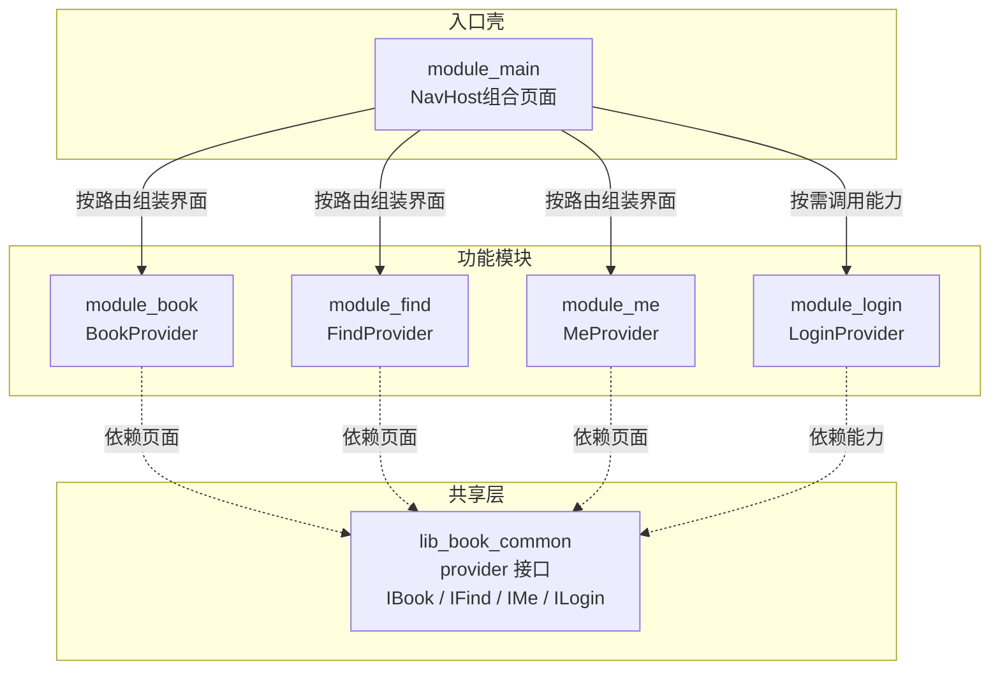
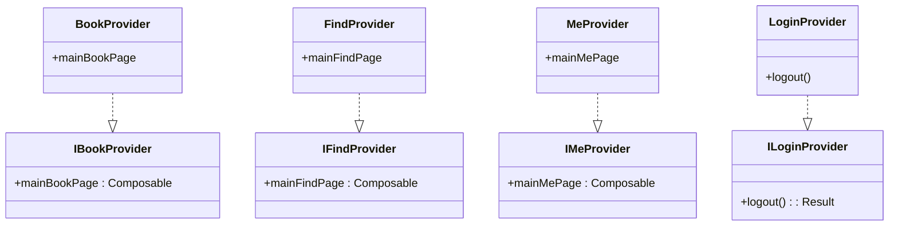
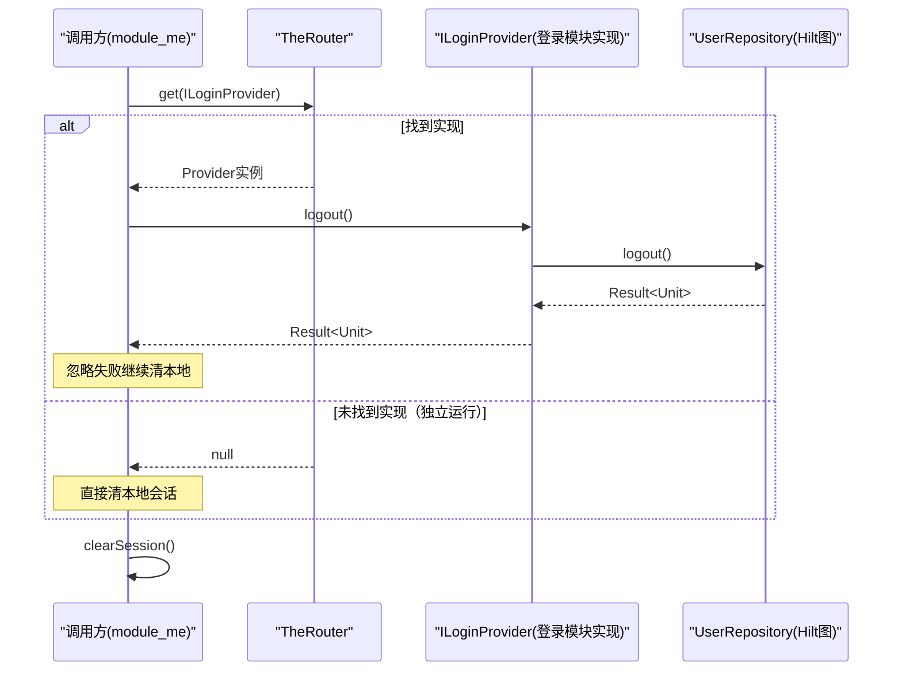
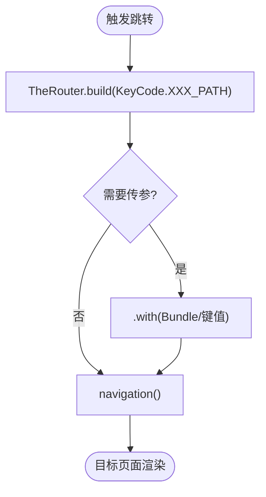
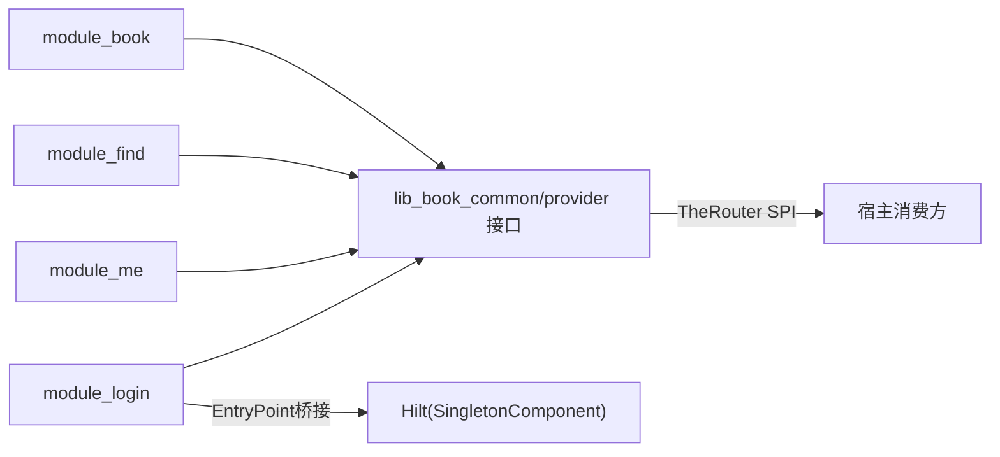

# Provider接口契约

<cite>
**本文件引用的源文件**
- [IBookProvider.kt](file://lib_book_common/src/main/java/com/ebook/common/provider/IBookProvider.kt)
- [IFindProvider.kt](file://lib_book_common/src/main/java/com/ebook/common/provider/IFindProvider.kt)
- [IMeProvider.kt](file://lib_book_common/src/main/java/com/ebook/common/provider/IMeProvider.kt)
- [ILoginProvider.kt](file://lib_book_common/src/main/java/com/ebook/common/provider/ILoginProvider.kt)
- [BookProvider.kt](file://module_book/src/main/java/com/ebook/book/provide/BookProvider.kt)
- [FindProvider.kt](file://module_find/src/main/java/com/ebook/find/provide/FindProvider.kt)
- [MeProvider.kt](file://module_me/src/main/java/com/ebook/me/provide/MeProvider.kt)
- [LoginProvider.kt](file://module_login/src/main/java/com/ebook/login/provide/LoginProvider.kt)
- [UserRepository.kt](file://module_login/src/main/java/com/ebook/login/repository/UserRepository.kt)
- [KeyCode.kt](file://lib_book_common/src/main/java/com/ebook/common/event/KeyCode.kt)
- [0019-logout-capability-ownership.md](file://docs/adr/0019-logout-capability-ownership.md)
- [AGENTS.md](file://AGENTS.md)
</cite>

## 目录
1. 引言
2. 项目结构
3. 核心组件
4. 架构总览
5. 详细组件分析
6. 依赖关系分析
7. 性能与可维护性
8. 故障排查
9. 结论

## 引言
本文档梳理跨模块通信的Provider服务契约，说明通过TheRouter SPI暴露的页面级与服务级能力：IBookProvider、IFindProvider、IMeProvider 暴露Compose页面；ILoginProvider暴露跨模块能力（登出）。文档同时解释Composable页返回机制、Hilt在Provider中的作用域与桥接方式、路由参数传递、错误处理与向后兼容策略，并提供落地参考路径。

## 项目结构
本项目采用多模块分层：业务模块仅依赖 lib_book_common，不直接相互依赖。各功能模块以独立ServiceProvider实现跨模块能力，通过TheRouter SPI注册并在宿主中消费，避免编译期强耦合。

图示来源
- [IBookProvider.kt:1-14](file://lib_book_common/src/main/java/com/ebook/common/provider/IBookProvider.kt#L1-L14)
- [IFindProvider.kt:1-14](file://lib_book_common/src/main/java/com/ebook/common/provider/IFindProvider.kt#L1-L14)
- [IMeProvider.kt:1-14](file://lib_book_common/src/main/java/com/ebook/common/provider/IMeProvider.kt#L1-L14)
- [ILoginProvider.kt:1-20](file://lib_book_common/src/main/java/com/ebook/common/provider/ILoginProvider.kt#L1-L20)
- [BookProvider.kt:1-15](file://module_book/src/main/java/com/ebook/book/provide/BookProvider.kt#L1-L15)
- [FindProvider.kt:1-19](file://module_find/src/main/java/com/ebook/find/provide/FindProvider.kt#L1-L19)
- [MeProvider.kt:1-20](file://module_me/src/main/java/com/ebook/me/provide/MeProvider.kt#L1-L20)
- [LoginProvider.kt:1-36](file://module_login/src/main/java/com/ebook/login/provide/LoginProvider.kt#L1-L36)

章节来源
- [AGENTS.md:1-200](file://AGENTS.md#L1-L200)

## 核心组件
本节定义并说明四条核心Provider契约及其设计约束。

- IBookProvider（书架页）
  - 职责：提供首页Tab对应的书架Compose页面。
  - 关键点：返回 @Composable () -> Unit，由宿主NavHost直接组合；页面ViewModel随hiltViewModel默认作用域绑定到调用处的NavBackStackEntry。
  - 文件位置：[IBookProvider.kt:1-14](file://lib_book_common/src/main/java/com/ebook/common/provider/IBookProvider.kt#L1-L14)

- IFindProvider（书城页）
  - 职责：提供书城主页面。
  - 同书架构一致，返回Compose函数，交由宿主组合。
  - 文件位置：[IFindProvider.kt:1-14](file://lib_book_common/src/main/java/com/ebook/common/provider/IFindProvider.kt#L1-L14)

- IMeProvider（我的页）
  - 职责：提供个人中心主页面。
  - 同书架构一致，返回Compose函数。
  - 文件位置：[IMeProvider.kt:1-14](file://lib_book_common/src/main/java/com/ebook/common/provider/IMeProvider.kt#L1-L14)

- ILoginProvider（登录域能力）
  - 职责：暴露服务端会话作废能力，跨模块解耦登录细节。
  - 关键点：只负责服务端侧登出；本地会话清理统一走 UserSessionManager.clearSession()；独立运行时Provider可能不可用，需容忍空结果。
  - 文件位置：[ILoginProvider.kt:1-20](file://lib_book_common/src/main/java/com/ebook/common/provider/ILoginProvider.kt#L1-L20)，规范依据：[0019-logout-capability-ownership.md:1-72](file://docs/adr/0019-logout-capability-ownership.md#L1-L72)

章节来源
- [IBookProvider.kt:1-14](file://lib_book_common/src/main/java/com/ebook/common/provider/IBookProvider.kt#L1-L14)
- [IFindProvider.kt:1-14](file://lib_book_common/src/main/java/com/ebook/common/provider/IFindProvider.kt#L1-L14)
- [IMeProvider.kt:1-14](file://lib_book_common/src/main/java/com/ebook/common/provider/IMeProvider.kt#L1-L14)
- [ILoginProvider.kt:1-20](file://lib_book_common/src/main/java/com/ebook/common/provider/ILoginProvider.kt#L1-L20)
- [0019-logout-capability-ownership.md:1-72](file://docs/adr/0019-logout-capability-ownership.md#L1-L72)

## 架构总览
Provider由TheRouter SPI创建，宿主根据类型注入并调用。页面Provider返回Composable以供NavHost组合，能力Provider（如ILoginProvider）用于无UI交互的业务能力。

图示来源
- [IBookProvider.kt:11-13](file://lib_book_common/src/main/java/com/ebook/common/provider/IBookProvider.kt#L11-L13)
- [IFindProvider.kt:11-13](file://lib_book_common/src/main/java/com/ebook/common/provider/IFindProvider.kt#L11-L13)
- [IMeProvider.kt:11-13](file://lib_book_common/src/main/java/com/ebook/common/provider/IMeProvider.kt#L11-L13)
- [ILoginProvider.kt:12-18](file://lib_book_common/src/main/java/com/ebook/common/provider/ILoginProvider.kt#L12-L18)
- [BookProvider.kt:8-15](file://module_book/src/main/java/com/ebook/book/provide/BookProvider.kt#L8-L15)
- [FindProvider.kt:14-18](file://module_find/src/main/java/com/ebook/find/provide/FindProvider.kt#L14-L18)
- [MeProvider.kt:15-19](file://module_me/src/main/java/com/ebook/me/provide/MeProvider.kt#L15-L19)
- [LoginProvider.kt:21-35](file://module_login/src/main/java/com/ebook/login/provide/LoginProvider.kt#L21-L35)

## 详细组件分析

### 页面级Provider：IBook / IFind / IMe
- 设计理念：返回@Composable而非Fragment，使宿主可直接在NavHost组合页面，简化生命周期管理；每组合一次即产生新页面实例，页面内状态自然隔离；配合hiltViewModel自动将VM绑定至当前Back栈条目，避免内存泄漏且天然支持返回栈协作。
- 注册与消费：
  - 各功能模块以@ServiceProvider声明实现类；
  - 宿主通过TheRouter按接口类型获取提供者并访问其Composable属性；
  - 推荐在宿主的顶层导航处组合这些页面作为三Tab或首屏容器。

章节来源
- [IBookProvider.kt:1-13](file://lib_book_common/src/main/java/com/ebook/common/provider/IBookProvider.kt#L1-L13)
- [IFindProvider.kt:1-13](file://lib_book_common/src/main/java/com/ebook/common/provider/IFindProvider.kt#L1-L13)
- [IMeProvider.kt:1-13](file://lib_book_common/src/main/java/com/ebook/common/provider/IMeProvider.kt#L1-L13)
- [BookProvider.kt:8-15](file://module_book/src/main/java/com/ebook/book/provide/BookProvider.kt#L8-L15)
- [FindProvider.kt:14-18](file://module_find/src/main/java/com/ebook/find/provide/FindProvider.kt#L14-L18)
- [MeProvider.kt:15-19](file://module_me/src/main/java/com/ebook/me/provide/MeProvider.kt#L15-L19)

### 能力型Provider：ILoginProvider
- 设计要点：
  - 仅提供“作废服务端会话”的能力；
  - 不重复承担本地会话清理（统一由UserSessionManager.clearSession）；
  - 独立运行（isModule=true）时模块未被包含，接口取不到实现，必须允许空返回值；
  - 使用@Singleton标注，跨多次调用复用单例；内部通过Hilt EntryPointAccessors桥接到登录模块的UserRepository。
- 调用约定（两行固定模式）：
  1) 尝试调用 provider.logout()，失败仅记录日志；
  2) 无条件执行用户会话清理。

图示来源
- [ILoginProvider.kt:12-18](file://lib_book_common/src/main/java/com/ebook/common/provider/ILoginProvider.kt#L12-L18)
- [LoginProvider.kt:21-35](file://module_login/src/main/java/com/ebook/login/provide/LoginProvider.kt#L21-L35)
- [UserRepository.kt:26-94](file://module_login/src/main/java/com/ebook/login/repository/UserRepository.kt#L26-L94)
- [0019-logout-capability-ownership.md:17-36](file://docs/adr/0019-logout-capability-ownership.md#L17-L36)

章节来源
- [ILoginProvider.kt:1-20](file://lib_book_common/src/main/java/com/ebook/common/provider/ILoginProvider.kt#L1-L20)
- [LoginProvider.kt:1-36](file://module_login/src/main/java/com/ebook/login/provide/LoginProvider.kt#L1-L36)
- [UserRepository.kt:1-94](file://module_login/src/main/java/com/ebook/login/repository/UserRepository.kt#L1-L94)
- [0019-logout-capability-ownership.md:1-72](file://docs/adr/0019-logout-capability-ownership.md#L1-L72)

### 路由与页面创建
- 路由常量集中定义于 KeyCode，供各Activity和跨模块跳转引用；
- 页面级Provider返回Compose函数，由宿主统一导航；跨页面跳转可通过TheRouter.build(path).navigation()进行参数传递（path见(KeyCode.*)_PATH常量）。

图示来源
- [KeyCode.kt:4-98](file://lib_book_common/src/main/java/com/ebook/common/event/KeyCode.kt#L4-L98)

章节来源
- [KeyCode.kt:4-98](file://lib_book_common/src/main/java/com/ebook/common/event/KeyCode.kt#L4-L98)

## 依赖关系分析
- 依赖方向严格单向：功能模块 → lib_book_common（接口层），功能模块之间互不依赖；
- Provider注册方式：每个功能模块各自实现接口并以@ServiceProvider标注，TheRouter在运行时构建SPI表；
- Hilt与TheRouter协作：页面级Provider不参与Hilt，返回Compose交给宿主；能力型Provider（如ILoginProvider）以Service形式存在，通过EntryPoint从Hilt图中拉取仓库能力。

图示来源
- [IBookProvider.kt:1-13](file://lib_book_common/src/main/java/com/ebook/common/provider/IBookProvider.kt#L1-L13)
- [FindProvider.kt:14-18](file://module_find/src/main/java/com/ebook/find/provide/FindProvider.kt#L14-L18)
- [MeProvider.kt:15-19](file://module_me/src/main/java/com/ebook/me/provide/MeProvider.kt#L15-L19)
- [LoginProvider.kt:21-35](file://module_login/src/main/java/com/ebook/login/provide/LoginProvider.kt#L21-L35)
- [UserRepository.kt:86-94](file://module_login/src/main/java/com/ebook/login/repository/UserRepository.kt#L86-L94)

章节来源
- [AGENTS.md:1-200](file://AGENTS.md#L1-L200)
- [0019-logout-capability-ownership.md:40-52](file://docs/adr/0019-logout-capability-ownership.md#L40-L52)

## 性能与可维护性
- 轻量API：每个Provider仅暴露极小能力，符合单一职责，易于扩展与维护；
- 低耦合：模块间不直接引用对方代码，避免升级时的级联改动；
- Compose优势：返回函数便于按需组合、热重载友好、减少状态同步成本；
- Hilt桥接最小化：仅在必要时通过EntryPoint拉取，降低Provider复杂度。

## 故障排查
- TheRouter返回null（能力不可用）：常见于独立模块调试（isModule=true）导致实现未被纳入，调用方需安全降级（如跳过服务端登出，只清本地会话）。
- 路由未匹配：独立模式缺失占位路由会静默失败，需在对应source set配置占位路由；确认已重新构建以刷新路由表。
- 登录流程异常：检查是否遵循“先尽力作废服务端会话、后清本地会话”的两行规则；确认网络错误不会阻断本地清理。
- 页面状态异常：确保每个页面通过hiltViewModel使用，避免手动创建导致的生命周期不一致。

章节来源
- [0019-logout-capability-ownership.md:27-36](file://docs/adr/0019-logout-capability-ownership.md#L27-L36)

## 结论
通过Provider契约与TheRouter SPI，项目实现了模块间的去耦合通信：页面级服务以Composable为最小单元暴露，能力型服务以Result语义传递结果并保持健壮性；配合Hilt桥接，在保证可测试性与可维护性的前提下，支撑了多模块并行开发与渐进式演进。建议新增接口时严格遵循当前范式，明确接口粒度、错误模型与兼容策略。