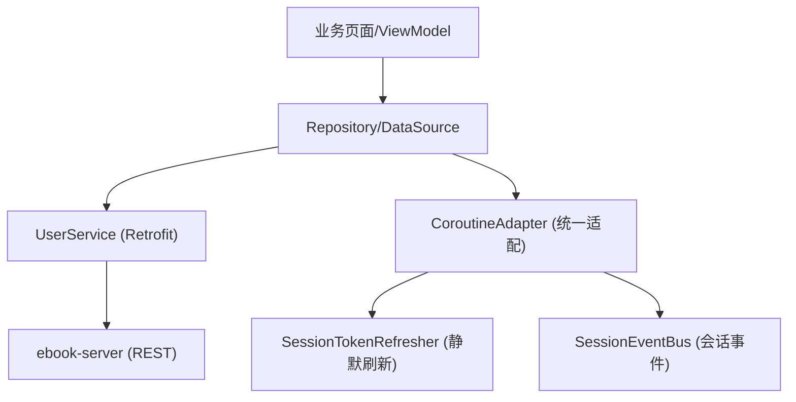
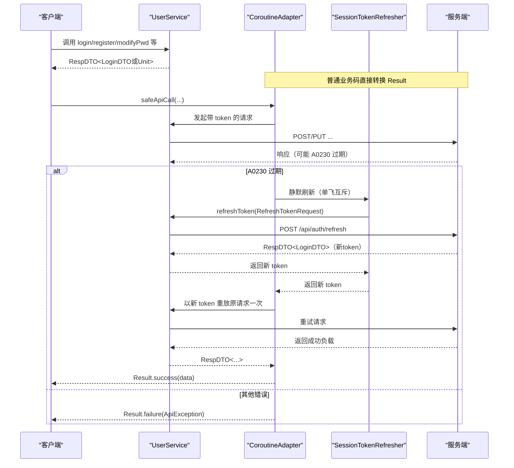
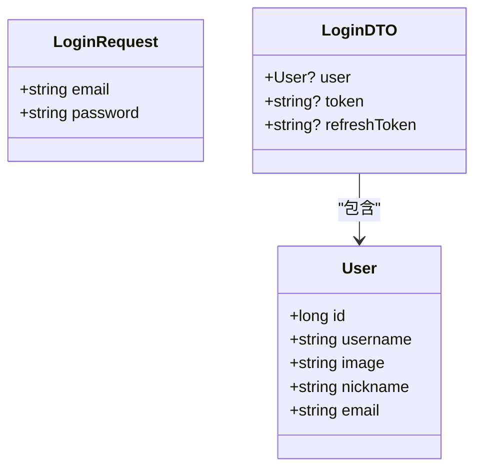
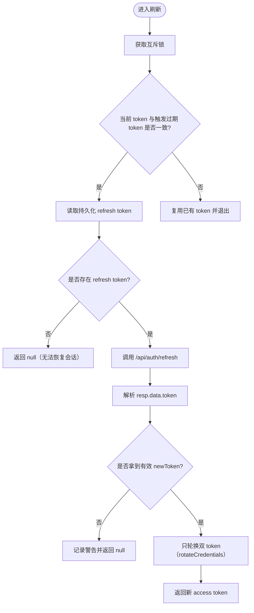
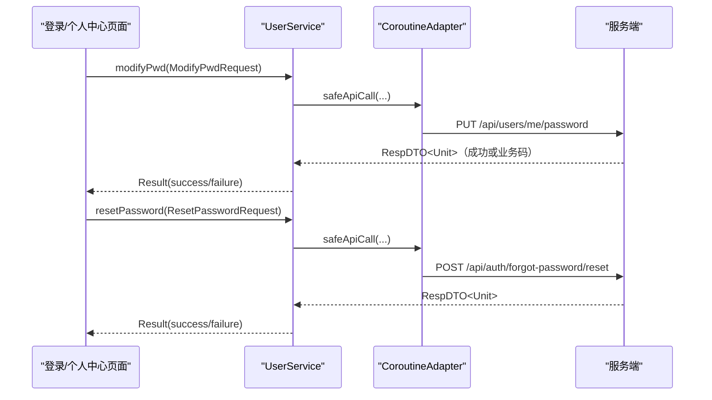
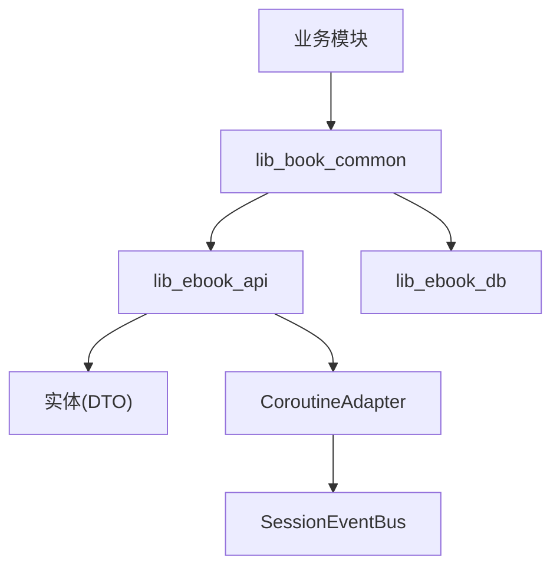

# 数据传输对象

<cite>
**本文引用的文件**
- [lib_ebook_api\src\main\java\com\ebook\api\entity\LoginDTO.kt](file://lib_ebook_api/src/main/java/com/ebook/api/entity/LoginDTO.kt)
- [lib_ebook_api\src\main\java\com\ebook\api\entity\RefreshTokenRequest.kt](file://lib_ebook_api/src/main/java/com/ebook/api/entity/RefreshTokenRequest.kt)
- [lib_ebook_api\src\main\java\com\ebook\api\entity\ModifyPwdRequest.kt](file://lib_ebook_api/src/main/java/com/ebook/api/entity/ModifyPwdRequest.kt)
- [lib_ebook_api\src\main\java\com\ebook\api\entity\User.kt](file://lib_ebook_api/src/main/java/com/ebook/api/entity/User.kt)
- [lib_ebook_api\src\main\java\com\ebook\api\entity\LoginRequest.kt](file://lib_ebook_api/src/main/java/com/ebook/api/entity/LoginRequest.kt)
- [lib_ebook_api\src\main\java\com\ebook\api\entity\RegisterRequest.kt](file://lib_ebook_api/src/main/java/com/ebook/api/entity/RegisterRequest.kt)
- [lib_ebook_api\src\main\java\com\ebook\api\entity\SendCodeRequest.kt](file://lib_ebook_api/src/main/java/com/ebook/api/entity/SendCodeRequest.kt)
- [lib_ebook_api\src\main\java\com\ebook\api\entity\ResetPasswordRequest.kt](file://lib_ebook_api/src/main/java/com/ebook/api/entity/ResetPasswordRequest.kt)
- [lib_ebook_api\src\main\java\com\ebook\api\entity\UpdateUserRequest.kt](file://lib_ebook_api/src/main/java/com/ebook/api/entity/UpdateUserRequest.kt)
- [lib_ebook_api\src\main\java\com\ebook\api\entity\UploadResponse.kt](file://lib_ebook_api/src/main/java/com/ebook/api/entity/UploadResponse.kt)
- [lib_ebook_api\src\main\java\com\ebook\api\service\user\UserService.kt](file://lib_ebook_api/src/main/java/com/ebook/api/service/user/UserService.kt)
- [lib_ebook_api\src\main\java\com\ebook\api\utils\CoroutineAdapter.kt](file://lib_ebook_api/src/main/java/com/ebook/api/utils/CoroutineAdapter.kt)
- [lib_book_common\src\main\java\com\ebook\common\domain\SessionTokenRefresher.kt](file://lib_book_common/src/main/java/com/ebook/common/domain(SessionTokenRefresher.kt)
</cite>

## 目录
1. [简介](#简介)
2. [项目结构](#项目结构)
3. [核心 DTO 概览](#核心-dto-概览)
4. [架构总览](#架构总览)
5. [详细组件分析](#详细组件分析)
6. [依赖与调用链分析](#依赖与调用链分析)
7. [性能与序列化考量](#性能与序列化考量)
8. [错误码与异常处理](#错误码与异常处理)
9. [客户端使用示例](#客户端使用示例)
10. [版本兼容与演进策略](#版本兼容与演进策略)
11. [安全考虑](#安全考虑)
12. [故障排查指南](#故障排查指南)
13. [结论](#结论)

## 简介
本文件聚焦于该项目在 RESTful 认证与用户会话场景中的数据传输对象（DTO）及其请求响应契约。重点说明以下主题：
- 核心 DTO 结构与字段语义，包括登录载荷、刷新 token 请求、改密请求等
- 空值处理策略与必填/可选字段的约定
- 数据校验规则与前端/服务端双重保障机制
- 命名规范：蛇形命名在服务端、Kotlin 属性保持驼峰并使用 @SerialName 进行边界映射
- 典型业务场景下的请求 JSON 示例
- 错误码定义与异常标准化处理流程
- API 向后兼容策略与演进原则
- 客户端构造请求、解析响应与异常处理的参考实践
- 安全考虑：敏感字段传输、防重放与单飞刷新机制

## 项目结构
本项目在网络层统一通过 Retrofit 服务接口声明端点，并通过 Kotlinx Serialization 描述实体 DTO。认证相关接口集中在 UserService 中，所有请求/响应均包裹为统一的 RespDTO 信封；实体类定义在 lib_ebook_api 的 entity 包下，便于模块复用。网络请求的统一封装由 CoroutineAdapter 完成，负责业务码转换、A0230 过期静默刷新与重放、以及会话事件上报。

**图示来源**
- [lib_ebook_api\src\main\java\com\ebook\api\service\user\UserService.kt:22-72](file://lib_ebook_api/src/main/java/com/ebook/api/service/user/UserService.kt#L22-L72)
- [lib_ebook_api\src\main\java\com\ebook\api\utils\CoroutineAdapter.kt:17-149](file://lib_ebook_api/src/main/java/com/ebook/api/utils/CoroutineAdapter.kt#L17-L149)
- [lib_book_common\src\main\java\com\ebook\common\domain\SessionTokenRefresher.kt:15-96](file://lib_book_common/src/main/java/com/ebook/common/domain(SessionTokenRefresher.kt#L15-L96)

**章节来源**
- [lib_ebook_api\src\main\java\com\ebook\api\service\user\UserService.kt:22-72](file://lib_ebook_api/src/main/java/com/ebook/api/service/user/UserService.kt#L22-L72)
- [lib_ebook_api\src\main\java\com\ebook\api\utils\CoroutineAdapter.kt:17-149](file://lib_ebook_api/src/main/java/com/ebook/api/utils/CoroutineAdapter.kt#L17-L149)
- [lib_book_common\src\main\java\com\ebook\common\domain\SessionTokenRefresher.kt:15-96](file://lib_book_common/src/main/java/com/ebook/common/domain(SessionTokenRefresher.kt#L15-L96)

## 核心 DTO 概览
本节汇总认证相关的关键 DTO，包含请求与响应载荷的字段语义、是否为空及命名映射策略。

- LoginRequest：登录请求
  - email：字符串，账号主标识（邮箱），必填
  - password：字符串，密码，必填
  - 用途：POST /api/auth/login
  - 参考路径：[LoginRequest 定义](file://lib_ebook_api/src/main/java/com/ebook/api/entity/LoginRequest.kt#L1-L15)

- LoginDTO：登录/刷新返回的双 Token + 用户信息
  - user：User?，可空；包含 uid、用户名、头像、昵称、邮箱等
  - token：String?，可空；access token
  - refreshToken：String?，可空；线上键 refresh_token，通过 @SerialName 映射
  - 参考路径：[LoginDTO 定义](file://lib_ebook_api/src/main/java/com/ebook/api/entity/LoginDTO.kt#L1-L16)，[User 定义](file://lib_ebook_api/src/main/java/com/ebook/api/entity/User.kt#L1-L29)

- RefreshTokenRequest：刷新 token 请求
  - refreshToken：String，线上键 refresh_token，必填
  - 参考路径：[RefreshTokenRequest 定义](file://lib_ebook_api/src/main/java/com/ebook/api/entity/RefreshTokenRequest.kt#L1-L15)

- ModifyPwdRequest：已登录改密请求
  - oldPassword：String，线上键 old_password，必填
  - newPassword：String，线上键 new_password，必填
  - 参考路径：[ModifyPwdRequest 定义](file://lib_ebook_api/src/main/java/com/ebook/api/entity/ModifyPwdRequest.kt#L1-L18)

- UpdateUserRequest：更新当前用户信息（部分更新）
  - avatar/email/nickname/username：均为 String?，可空；非空即更新的字段
  - 参考路径：[UpdateUserRequest 定义](file://lib_ebook_api/src/main/java/com/ebook/api/entity/UpdateUserRequest.kt#L1-L22)

- RegisterRequest：注册请求（发码后注册即激活，不发放 token）
  - email/code/password：邮箱、验证码、密码，全部必填
  - 参考路径：[RegisterRequest 定义](file://lib_ebook_api/src/main/java/com/ebook/api/entity/RegisterRequest.kt#L1-L17)

- SendCodeRequest：发送验证码请求
  - email：目标邮箱，必填
  - 参考路径：[SendCodeRequest 定义](file://lib_ebook_api/src/main/java/com/ebook/api/entity/SendCodeRequest.kt#L1-L13)

- ResetPasswordRequest：忘记密码重置密码请求
  - email/code/newPassword：邮箱、验证码、新密码，全部必填
  - 参考路径：[ResetPasswordRequest 定义](file://lib_ebook_api/src/main/java/com/ebook/api/entity/ResetPasswordRequest.kt#L1-L19)

- UploadResponse：头像上传响应
  - url：字符串；上传成功后返回的可访问图片 URL
  - 参考路径：[UploadResponse 定义](file://lib_ebook_api/src/main/java/com/ebook/api/entity/UploadResponse.kt#L1-L13)

以上 DTO 的命名策略为：服务端载荷采用蛇形命名（如 refresh_token、old_password），Kotlin 侧属性保持驼峰并通过 @SerialName 在序列化边界做映射，保证类型安全与可读性。

**章节来源**
- [lib_ebook_api\src\main\java\com\ebook\api\entity\LoginRequest.kt:1-15](file://lib_ebook_api/src/main/java/com/ebook/api/entity/LoginRequest.kt#L1-L15)
- [lib_ebook_api\src\main\java\com\ebook\api\entity\LoginDTO.kt:1-16](file://lib_ebook_api/src/main/java/com/ebook/api/entity/LoginDTO.kt#L1-L16)
- [lib_ebook_api\src\main\java\com\ebook\api\entity\User.kt:1-29](file://lib_ebook_api/src/main/java/com/ebook/api/entity/User.kt#L1-L29)
- [lib_ebook_api\src\main\java\com\ebook\api\entity\RefreshTokenRequest.kt:1-15](file://lib_ebook_api/src/main/java/com/ebook/api/entity/RefreshTokenRequest.kt#L1-L15)
- [lib_ebook_api\src\main\java\com/ebook\api\entity\ModifyPwdRequest.kt:1-18](file://lib_ebook_api/src/main/java/com/ebook/api/entity/ModifyPwdRequest.kt#L1-L18)
- [lib_ebook_api\src\main\java/com/ebook/api/entity/UpdateUserRequest.kt:1-22](file://lib_ebook_api/src/main/java/com/ebook/api/entity/UpdateUserRequest.kt#L1-L22)
- [lib_ebook_api\src\main\java/com/ebook/api/entity/RegisterRequest.kt:1-17](file://lib_ebook_api/src/main/java/com/ebook/api/entity/RegisterRequest.kt#L1-L17)
- [lib_ebook_api\src\main\java/com/ebook/api/entity/SendCodeRequest.kt:1-13](file://lib_ebook_api/src/main/java/com/ebook/api/entity/SendCodeRequest.kt#L1-L13)
- [lib_ebook_api\src\main\java/com/ebook/api/entity/ResetPasswordRequest.kt:1-19](file://lib_ebook_api/src/main/java/com/ebook/api/entity/ResetPasswordRequest.kt#L1-L19)
- [lib_ebook_api\src\main\java/com/ebook/api/entity/UploadResponse.kt:1-13](file://lib_ebook_api/src/main/java/com/ebook/api/entity/UploadResponse.kt#L1-L13)

## 架构总览
认证相关的数据传输遵循统一模式：
- 请求：以 JSON Body 提交，实体类由 @Serializable 标注，必要时用 @SerialName 将 Kotlin 驼峰属性映射到服务端蛇形键
- 响应：统一返回 RespDTO<T> 信封，其中 code=成功标识时 data 携带具体负载
- 网络适配：通过 CoroutineAdapter.safeApiCall 将业务码转为 Result；当 A0230 时触发单飞刷新，成功后重放原请求一次；刷新失败则发射 SessionExpired 事件，交由上层清会话并引导登录
- 刷新实现：SessionTokenRefresher 通过 UserDataSource.refreshToken(RefreshTokenRequest) 获取新 token，仅轮换双 token，避免重复重建会话，确保旧 refresh 立即失效且不会被复用

**图示来源**
- [lib_ebook_api\src\main\java\com\ebook\api\utils\CoroutineAdapter.kt:17-149](file://lib_ebook_api/src/main/java/com/ebook/api/utils/CoroutineAdapter.kt#L17-L149)
- [lib_book_common\src\main\java\com\ebook\common\domain\SessionTokenRefresher.kt:15-96](file://lib_book_common/src/main/java/com/ebook/common/domain(SessionTokenRefresher.kt#L15-L96)
- [lib_ebook_api\src\main\java\com\ebook\api\service\user\UserService.kt:22-72](file://lib_ebook_api/src/main/java/com/ebook/api/service/user/UserService.kt#L22-L72)

## 详细组件分析

### 登录与用户信息模型
- 登录请求与响应
  - 请求：LoginRequest（email、password）用于建立初始会话
  - 响应：RespDTO<LoginDTO>；LoginDTO 包含 user（User）、token（access token）、refreshToken（refresh token）
  - 后续业务：首次登录后客户端保存双 token；User 包含展示用身份信息（uid、avatar、nickname、email 等）

**图示来源**
- [lib_ebook_api\src\main\java\com\ebook\api\entity\LoginRequest.kt:1-15](file://lib_ebook_api/src/main/java/com/ebook/api/entity/LoginRequest.kt#L1-L15)
- [lib_ebook_api\src\main\java\com\ebook\api\entity\LoginDTO.kt:1-16](file://lib_ebook_api/src/main/java/com/ebook/api/entity/LoginDTO.kt#L1-L16)
- [lib_ebook_api\src\main\java\com\ebook\api\entity\User.kt:1-29](file://lib_ebook_api/src/main/java/com/ebook/api/entity/User.kt#L1-L29)

**章节来源**
- [lib_ebook_api\src\main\java\com\ebook\api\entity\LoginRequest.kt:1-15](file://lib_ebook_api/src/main/java/com/ebook/api/entity/LoginRequest.kt#L1-L15)
- [lib_ebook_api\src\main\java\com\ebook\api\entity\LoginDTO.kt:1-16](file://lib_ebook_api/src/main/java/com/ebook/api/entity/LoginDTO.kt#L1-L16)
- [lib_ebook_api\src\main\java\com\ebook\api\entity\User.kt:1-29](file://lib_ebook_api/src/main/java/com/ebook/api/entity/User.kt#L1-L29)

### 刷新令牌与并发安全
- 刷新请求
  - 请求：RefreshTokenRequest（refresh_token，必填）
  - 响应：RespDTO<LoginDTO>（新的双 token，不再返回用户资料）
- 并发与安全策略
  - 单飞互斥：使用 Mutex 串行化刷新，避免并发重复刷新造成 refresh token 多次被作废导致失败
  - 旧 refresh 失效：刷新成功后立即替换持久化的 refresh；若服务端未回传 refresh_token，则保留旧值，避免清空唯一恢复凭据导致误踢下线
  - 冷启动场景：即使内存无 access token，仍可进行刷新判断与复用；刷新器内部对空 token 场景做了兜底判定

**图示来源**
- [lib_book_common\src\main\java\com\ebook\common\domain\SessionTokenRefresher.kt:15-96](file://lib_book_common/src/main/java/com/ebook/common/domain(SessionTokenRefresher.kt#L15-L96)

**章节来源**
- [lib_ebook_api\src\main\java\com\ebook\api\entity\RefreshTokenRequest.kt:1-15](file://lib_ebook_api/src/main/java/com/ebook/api/entity/RefreshTokenRequest.kt#L1-L15)
- [lib_book_common\src\main\java\com\ebook\common\domain\SessionTokenRefresher.kt:15-96](file://lib_book_common/src/main/java/com/ebook/common/domain(SessionTokenRefresher.kt#L15-L96)

### 已登录改密与新密码重置
- 已登录改密
  - 请求：ModifyPwdRequest（old_password、new_password，均必填）
  - 校验：旧密码由服务端校验；错误码 A0210（旧密码错误）
- 忘记密码重置密码
  - 步骤1：SendCodeRequest 发送验证码到邮箱
  - 步骤2：ResetPasswordRequest（email、code、new_password）进行重置；服务端验证验证码并设置新密码

**图示来源**
- [lib_ebook_api\src\main\java\com\ebook\api\service\user\UserService.kt:22-72](file://lib_ebook_api/src/main/java/com/ebook/api/service/user/UserService.kt#L22-L72)
- [lib_ebook_api\src\main\java\com\ebook\api\utils\CoroutineAdapter.kt:17-149](file://lib_ebook_api/src/main/java/com/ebook/api/utils/CoroutineAdapter.kt#L17-L149)

**章节来源**
- [lib_ebook_api\src\main\java\com\ebook\api\entity\ModifyPwdRequest.kt:1-18](file://lib_ebook_api/src/main/java/com/ebook/api/entity/ModifyPwdRequest.kt#L1-L18)
- [lib_ebook_api\src\main\java\com\ebook\api\entity\ResetPasswordRequest.kt:1-19](file://lib_ebook_api/src/main/java/com/ebook/api/entity/ResetPasswordRequest.kt#L1-L19)
- [lib_ebook_api\src\main\java\com\ebook\api\entity\SendCodeRequest.kt:1-13](file://lib_ebook_api/src/main/java/com/ebook/api/entity/SendCodeRequest.kt#L1-L13)

## 依赖与调用链分析
- 依赖方向
  - 业务模块 → lib_book_common（业务通用组件与仓库层）→ lib_ebook_api（网络服务与实体）→ lib_ebook_db（本地数据库）
  - CoroutineAdapter 同时依赖 lib_ebook_api（UserService/Entity）与 SessionEventBus/TokenHolder，提供跨模块的网络异常与会话管理
- 组件耦合
  - 实体与接口位于同一模块（lib_ebook_api），减少边界转换成本
  - 刷新逻辑下沉至 lib_book_common，既需要服务层的刷新端点，又依赖会话持久化，形成自然交汇层

**章节来源**
- [lib_ebook_api\src\main\java\com\ebook\api\service\user\UserService.kt:22-72](file://lib_ebook_api/src/main/java/com/ebook/api/service/user/UserService.kt#L22-L72)
- [lib_ebook_api\src\main\java\com\ebook\api\utils\CoroutineAdapter.kt:17-149](file://lib_ebook_api/src/main/java/com/ebook/api/utils/CoroutineAdapter.kt#L17-L149)
- [lib_book_common\src\main\java\com\ebook\common\domain\SessionTokenRefresher.kt:15-96](file://lib_book_common/src/main/java/com/ebook/common/domain(SessionTokenRefresher.kt#L15-L96)

## 性能与序列化考量
- 序列化格式
  - 使用 Kotlinx Serialization 的 @Serializable，字段名通过 @SerialName 在服务端蛇形与 Kotlin 驼峰之间翻译
  - 忽略未知字段：全局 Json 配置关闭 coerceInputValues，允许未来增加字段而不影响旧版本解析
- 空值与默认值
  - DTO 字段根据契约设计为空或非空；例如 ReleaseResponse 的字段普遍可空，由取用方决定落盘/展示行为
  - 登录/刷新载荷中对可空字段（如 User.image）给予默认空串，避免显示崩溃
- 构建开销
  - 小体量 DTO 与少量反射零使用，编译期生成代码，序列化性能高，适合高频网络请求

[本节为一般性指导，不直接分析具体文件]

## 错误码与异常处理
- 错误码与统一信封
  - 所有接口返回 RespDTO<T>；code="00000"表示成功，其他为业务码
  - 常见业务码：
    - A0230：access token 过期，触发静默刷新并重放
    - A0210：旧密码错误（改密场景）
- 异常标准化
  - 通用适配器 CoroutineAdapter.safeApiCall 将业务码转换为 Result；失败时封装为 ApiException（message 为服务端原始消息，便于用户可见提示）
  - 会话过期且刷新失败：抛 SessionExpiredException，标记“已由全局处置”，调用方应跳过额外 Toast，避免重复提示
- 会话事件总线
  - SessionEventBus 使用 SharedFlow（缓冲容量为1）发射 SessionExpired 事件，上层订阅后清会话并跳转登录页；重复过期时丢弃多余事件，不阻塞请求线程

**章节来源**
- [lib_ebook_api\src\main\java\com\ebook\api\utils\CoroutineAdapter.kt:17-149](file://lib_ebook_api/src/main/java/com/ebook/api/utils/CoroutineAdapter.kt#L17-L149)
- [lib_ebook_api\src\main\java\com\ebook\api\auth\SessionEventBus.kt:9-44](file://lib_ebook_api/src/main/java/com/ebook/api/auth	SessionEventBus.kt#L9-L44)

## 客户端使用示例
以下为不同业务场景的请求 JSON 样例与服务端期望格式（基于 DTO 的 @SerialName 映射）。实际接入时请结合 RespDTO 信封与 code/data 结构解析。

- 登录（POST /api/auth/login）
  - 请求体 JSON
    - {
        "email": "user@example.com",
        "password": "your_password"
      }
  - 响应负载（data）：LoginDTO，包含 user、access token、refresh token

- 刷新 token（POST /api/auth/refresh）
  - 请求体 JSON
    - {
        "refresh_token": "eyJ..."
      }
  - 响应负载（data）：LoginDTO，仅包含新的双 token

- 已登录改密（PUT /api/users/me/password）
  - 请求体 JSON
    - {
        "old_password": "old_pass",
        "new_password": "new_pass"
      }

- 发送验证码（POST /api/auth/send-code 或 /api/auth/forgot-password/send-code）
  - 请求体 JSON
    - {
        "email": "user@example.com"
      }

- 重置密码（POST /api/auth/forgot-password/reset）
  - 请求体 JSON
    - {
        "email": "user@example.com",
        "code": "123456",
        "new_password": "new_pass"
      }

- 更新用户信息（PUT /api/users/me，部分更新）
  - 请求体 JSON
    - {
        "nickname": "新昵称",
        "avatar": "https://example.com/avatar.png",
        "email": "new@example.com",
        "username": "display_name"
      }

- 上传头像（POST /api/uploads/avatar，multipart）
  - 请求头：Content-Type: multipart/form-data
  - 字段名：avatar（图片文件，限 jpg/png/webp ≤5MB）
  - 响应负载（data）：UploadResponse，包含 url

**章节来源**
- [lib_ebook_api\src\main\java\com\ebook\api\service\user\UserService.kt:22-72](file://lib_ebook_api/src/main/java/com/ebook/api/service/user/UserService.kt#L22-L72)
- [lib_ebook_api\src\main\java\com\ebook\api\entity\LoginDTO.kt:1-16](file://lib_ebook_api/src/main/java/com/ebook/api/entity/LoginDTO.kt#L1-L16)
- [lib_ebook_api\src\main\java\com/ebook/api/entity/RefreshTokenRequest.kt:1-15](file://lib_ebook_api/src/main/java/com/ebook/api/entity/RefreshTokenRequest.kt#L1-L15)
- [lib_ebook_api\src\main\java/com/ebook/api/entity/ModifyPwdRequest.kt:1-18](file://lib_ebook_api/src/main/java/com/ebook/api/entity/ModifyPwdRequest.kt#L1-L18)
- [lib_ebook_api\src\main\java/com/ebook/api/entity/SendCodeRequest.kt:1-13](file://lib_ebook_api/src/main/java/com/ebook/api/entity/SendCodeRequest.kt#L1-L13)
- [lib_ebook_api\src\main\java/com/ebook/api/entity/ResetPasswordRequest.kt:1-19](file://lib_ebook_api/src/main/java/com/ebook/api/entity/ResetPasswordRequest.kt#L1-L19)
- [lib_ebook_api\src\main\java/com/ebook/api/entity/UpdateUserRequest.kt:1-22](file://lib_ebook_api/src/main/java/com/ebook/api/entity/UpdateUserRequest.kt#L1-L22)
- [lib_ebook_api\src\main\java/com/ebook/api/entity/UploadResponse.kt:1-13](file://lib_ebook_api/src/main/java/com/ebook/api/entity/UploadResponse.kt#L1-L13)

## 版本兼容与演进策略
- 新增字段
  - DTO 字段可按需扩展；服务端可引入蛇形字段并通过 @SerialName 在新版本启用；客户端保持 Kotlin 驼峰，避免破坏性变更
- 删除/废弃字段
  - 服务端优先采用“软废弃”（弃用但仍返回兼容字段）并在客户端通过注释或文档标记；长期计划内移除时需配合版本基线
- 响应结构稳定
  - 统一信封 RespDTO<T> 保持不变；T 的变化需遵循可空性与默认值约定，确保旧客户端不崩溃
- 向后兼容验证
  - Mock 资产需与真实 API 保持一致；当响应从列表改为分页包裹等形态变化时，必须同步更新 mock 的解析泛型，防止序列化异常被吞成未知错误

[本节为一般性指导，不直接分析具体文件]

## 安全考虑
- 传输安全
  - 鉴权相关请求经共享 OkHttpClient（附带 AuthInterceptor）发送；仅在白名单 host 上附加 token，避免泄露到第三方站点
- 防重放与单飞刷新
  - A0230 触发的刷新链路具备互斥机制，避免并发重复刷新导致 refresh token 被反复失效
  - 旧 refresh token 一旦成功刷新立即替换，防止被重用
- 敏感字段最小化
  - 刷新响应不再返回用户资料；仅需双 token，减小载荷体积与暴露面
- 会话状态一致性
  - 修改会话的入口收敛至会话管理器；TokenHolder（内存）、SP（持久化）与 ProfileRepository（UI State）三处镜像由统一方法更新，避免状态分裂

**章节来源**
- [lib_book_common\src\main\java\com\ebook\common\domain\SessionTokenRefresher.kt:15-96](file://lib_book_common/src/main/java/com/ebook/common/domain(SessionTokenRefresher.kt#L15-L96)
- [lib_ebook_api\src\main\java\com\ebook\api\utils\CoroutineAdapter.kt:17-149](file://lib_ebook_api/src/main/java/com/ebook/api/utils/CoroutineAdapter.kt#L17-L149)

## 故障排查指南
- 登录/刷新问题
  - 检查 Request 字段是否符合 DTO 定义（必填/空值）
  - 关注 RespDTO.code 与 message；业务码 A0230 表示 token 过期，自动刷新；A0210 为旧密码错误
- 刷新失败与会话不可恢复
  - 查看 SessionTokenRefresher 日志输出，确认 refresh token 是否存在以及服务端拒绝原因
  - 检查 SessionEventBus 是否发出 SessionExpired；上层是否清会话并跳转登录
- 更新用户信息与头像
  - 先上传头像拿 URL，再提交 Avatar；multipart 请求注意字段名和大小限制
- 解析异常
  - 关注网络层对未知字段的忽略策略；如出现序列化异常导致数据加载失败，需检查 mock 资产与响应的实际形态是否匹配

**章节来源**
- [lib_book_common\src\main\java\com\ebook\common\domain\SessionTokenRefresher.kt:15-96](file://lib_book_common/src/main/java/com/ebook/common/domain(SessionTokenRefresher.kt#L15-L96)
- [lib_ebook_api\src\main\java\com\ebook\api\utils\CoroutineAdapter.kt:17-149](file://lib_ebook_api/src/main/java/com/ebook/api/utils/CoroutineAdapter.kt#L17-L149)
- [lib_ebook_api\src\main\java\com\ebook\api\entity\UploadResponse.kt:1-13](file://lib_ebook_api/src/main/java/com/ebook/api/entity/UploadResponse.kt#L1-L13)

## 结论
本项目在认证与用户会话相关的数据传输对象设计上，遵循了清晰的字段语义、严格的空值与必填约定、以及蛇形命名与驼峰属性的边界映射策略。统一的网络适配层与会话管理提供了健壮的错误处理、防重放与单飞刷新能力，确保用户体验的连续性和系统的安全稳定。在实际使用中，客户端应严格遵守 DTO 结构、正确构造请求体、妥善处理 RespDTO 的信封和业务码，并按规范处理会话过期场景。API 演化时建议采用渐进式兼容与明确的废弃周期，以保证向前兼容与向后兼容性的平衡。