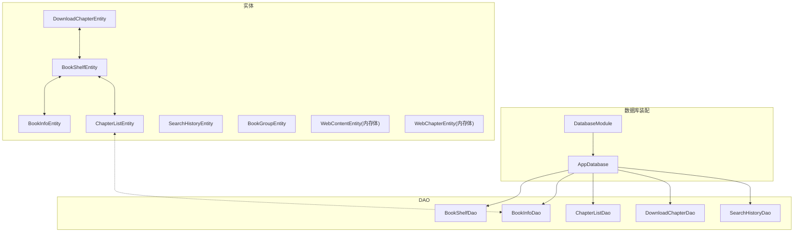
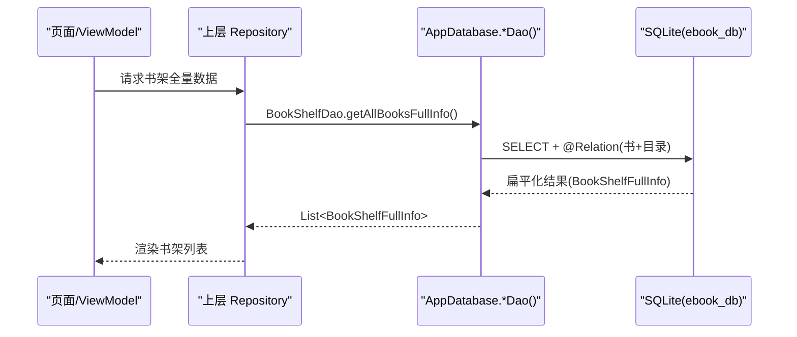
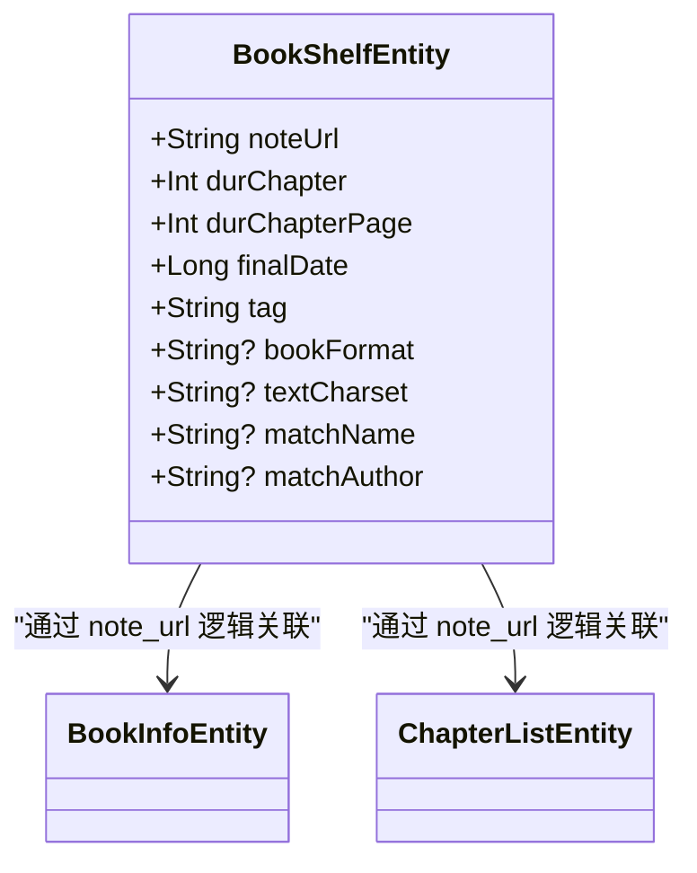
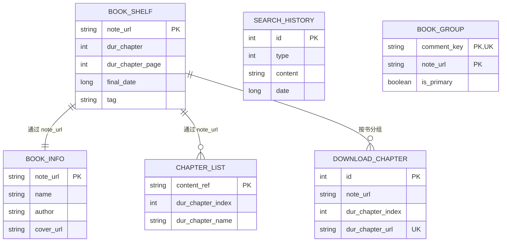

# 数据库实体模型

<cite>
**本文引用的文件**
- [AppDatabase.kt](file://lib_ebook_db/src/main/java/com/ebook/db/AppDatabase.kt)
- [BookInfoEntity.kt](file://lib_ebook_db/src/main/java/com/ebook/db/entity/BookInfoEntity.kt)
- [BookShelfEntity.kt](file://lib_ebook_db/src/main/java/com/ebook/db/entity/BookShelfEntity.kt)
- [ChapterListEntity.kt](file://lib_ebook_db/src/main/java/com/ebook/db/entity/ChapterListEntity.kt)
- [SearchHistoryEntity.kt](file://lib_ebook_db/src/main/java/com/ebook/db/entity/SearchHistoryEntity.kt)
- [DownloadChapterEntity.kt](file://lib_ebook_db/src/main/java/com/ebook/db/entity/DownloadChapterEntity.kt)
- [BookGroupEntity.kt](file://lib_ebook_db/src/main/java/com/ebook/db/entity/BookGroupEntity.kt)
- [WebChapterEntity.kt](file://lib_ebook_db/src/main/java/com/ebook/db/entity/WebChapterEntity.kt)
- [WebContentEntity.kt](file://lib_ebook_db/src/main/java/com/ebook/db/entity/WebContentEntity.kt)
- [BookInfoDao.kt](file://lib_ebook_db/src/main/java/com/ebook/db/dao/BookInfoDao.kt)
- [BookShelfDao.kt](file://lib_ebook_db/src/main/java/com/ebook/db/dao/BookShelfDao.kt)
- [ChapterListDao.kt](file://lib_ebook_db/src/main/java/com/ebook/db/dao/ChapterListDao.kt)
- [DownloadChapterDao.kt](file://lib_ebook_db/src/main/java/com/ebook/db/dao/DownloadChapterDao.kt)
- [SearchHistoryDao.kt](file://lib_ebook_db/src/main/java/com/ebook/db/dao/SearchHistoryDao.kt)
- [DatabaseModule.kt](file://lib_ebook_db/src/main/java/com/ebook/db/di/DatabaseModule.kt)
</cite>

## 目录
1. 引言
2. 项目结构
3. 核心组件
4. 架构总览
5. 详细组件分析
6. 依赖关系分析
7. 性能与索引优化
8. 数据迁移策略
9. 约束与数据完整性
10. DAO 接口与使用示例
11. 缓存与同步策略
12. 故障排查
13. 结论
14. 附录

## 引言
本文系统化梳理 Room ORM 的实体设计与映射方案，聚焦书架、书籍信息、章节目录、下载队列与搜索历史等关键表，解释自然键与自增键并存的主键策略，说明索引与查询优化设计，描述实体间“逻辑外键”的建模方式，并给出迁移策略、约束机制、DAO 访问方法以及常用 CRUD 示例。

## 项目结构
本仓库的持久化层位于 lib_ebook_db 模块，提供以 Room 为中心的数据库装配、实体定义与 DAO 接口：
- 数据库装配入口：AppDatabase（声明实体、版本与导出 schema）
- 核心实体：BookShelfEntity、BookInfoEntity、ChapterListEntity、SearchHistoryEntity、DownloadChapterEntity、BookGroupEntity
- 临时传输体：WebChapterEntity、WebContentEntity（不落库）
- DAO 访问器：BookShelfDao、BookInfoDao、ChapterListDao、DownloadChapterDao、SearchHistoryDao
- 依赖注入与迁移：DatabaseModule（Hilt 提供 AppDatabase 与各 DAO，集中维护 v1→v2、v2→v3、v3→v4 迁移）

图表来源
- [AppDatabase.kt:34-63](file://lib_ebook_db/src/main/java/com/ebook/db/AppDatabase.kt#L34-L63)
- [DatabaseModule.kt:23-124](file://lib_ebook_db/src/main/java/com/ebook/db/di/DatabaseModule.kt#L23-L124)

章节来源
- [AppDatabase.kt:1-63](file://lib_ebook_db/src/main/java/com/ebook/db/AppDatabase.kt#L1-L63)
- [DatabaseModule.kt:23-124](file://lib_ebook_db/src/main/java/com/ebook/db/di/DatabaseModule.kt#L23-L124)

## 核心组件
- 数据库版本与事实源
  - 数据库名：ebook_db
  - 版本：4
  - 导出 schema：开启（用于生成各版本 JSON）
  - 驱动：BundledSQLiteDriver（内嵌 SQLite 驱动）

- 六张业务表
  - book_shelf：书架与阅读进度
  - book_info：书籍元数据
  - chapter_list：章节目录
  - download_chapter：未完成任务队列
  - search_history：本地搜索历史
  - book_group：评论桶键与来源条目关联

- 非持久化传输体
  - WebChapterEntity、WebContentEntity：仅内存流转，不参与持久化

章节来源
- [AppDatabase.kt:8-63](file://lib_ebook_db/src/main/java/com/ebook/db/AppDatabase.kt#L8-L63)
- [WebChapterEntity.kt:1-11](file://lib_ebook_db/src/main/java/com/ebook/db/entity/WebChapterEntity.kt#L1-L11)
- [WebContentEntity.kt:1-15](file://lib_ebook_db/src/main/java/com/ebook/db/entity/WebContentEntity.kt#L1-L15)

## 架构总览
Room 在本项目中承担“离线可读”的数据底座：书架、书目信息、目录与下载队列入库，保证无网时也可浏览与管理；正文内容已迁移至应用私有目录的章文件（M1b），不再驻留数据库表。

图表来源
- [BookShelfDao.kt:20-46](file://lib_ebook_db/src/main/java/com/ebook/db/dao/BookShelfDao.kt#L20-L46)
- [AppDatabase.kt:47-58](file://lib_ebook_db/src/main/java/com/ebook/db/AppDatabase.kt#L47-L58)

## 详细组件分析

### BookShelfEntity（书架与进度）
- 表名：book_shelf
- 主键：note_url（自然键，对应 book_info.note_url）
- 关键字段
  - dur_chapter：当前章节索引（含番外）
  - dur_chapter_page：当前页码
  - final_date：最后阅读时间（排序与统计依据）
  - tag：书源归属标记
  - book_format/text_charset/match_name/match_author：本地导入重解析与匹配能力增强列
- 忽略字段：bookInfo、chapterList（@Ignore），不写入 DB，由上层拼装

图表来源
- [BookShelfEntity.kt:14-76](file://lib_ebook_db/src/main/java/com/ebook/db/entity/BookShelfEntity.kt#L14-L76)
- [BookInfoEntity.kt:13-69](file://lib_ebook_db/src/main/java/com/ebook/db/entity/BookInfoEntity.kt#L13-L69)
- [ChapterListEntity.kt:13-48](file://lib_ebook_db/src/main/java/com/ebook/db/entity/ChapterListEntity.kt#L13-L48)

章节来源
- [BookShelfEntity.kt:11-76](file://lib_ebook_db/src/main/java/com/ebook/db/entity/BookShelfEntity.kt#L11-L76)

### BookInfoEntity（书籍元信息）
- 表名：book_info
- 主键：note_url（自然键）
- 关键字段：name、tag、chapter_url、final_refresh_data、cover_url、author、introduce、origin、status
- 忽略字段：chapterList（@Ignore），需通过 ChapterListDao 插入

章节来源
- [BookInfoEntity.kt:10-69](file://lib_ebook_db/src/main/java/com/ebook/db/entity/BookInfoEntity.kt#L10-L69)
- [BookInfoDao.kt:6-33](file://lib_ebook_db/src/main/java/com/ebook/db/dao/BookInfoDao.kt#L6-L33)

### ChapterListEntity（章节目录）
- 表名：chapter_list
- 主键：content_ref（内容定位符，原名 dur_chapter_url；本地书=章文件相对路径，网络书=章节 URL）
- 普通索引：note_url（idx_chapter_list_note_url）
- 关键字段：dur_chapter_index、dur_chapter_name、tag
- 语义：一章一定位符，重复抓取天然去重；按书查目录稳定顺序靠 ORDER BY dur_chapter_index

章节来源
- [ChapterListEntity.kt:13-48](file://lib_ebook_db/src/main/java/com/ebook/db/entity/ChapterListEntity.kt#L13-L48)
- [ChapterListDao.kt:6-48](file://lib_ebook_db/src/main/java/com/ebook/db/dao/ChapterListDao.kt#L6-L48)

### SearchHistoryEntity（本地搜索历史）
- 表名：search_history
- 主键：id（自增）
- 字段：type（搜索类型隔离）、content（原文，唯一查重条件）、date（毫秒时间戳，排序键）
- 语义：流水型数据，去重责任上移至上层仓库（精确匹配 content 后覆盖 id 行更新）

章节来源
- [SearchHistoryEntity.kt:9-43](file://lib_ebook_db/src/main/java/com/ebook/db/entity/SearchHistoryEntity.kt#L9-L43)
- [SearchHistoryDao.kt:17-66](file://lib_ebook_db/src/main/java/com/ebook/db/dao/SearchHistoryDao.kt#L17-L66)

### DownloadChapterEntity（下载队列）
- 表名：download_chapter
- 主键：id（自增）
- 唯一索引：dur_chapter_url（同章只排一个任务）
- 普通索引：note_url（按书取队头/取消）
- 字段：note_url、dur_chapter_index、dur_chapter_url、dur_chapter_name、tag、book_name、cover_url、force_refresh
- 语义：只存未完成任务；行数=剩余待下载章节；失败耗尽必须出队

章节来源
- [DownloadChapterEntity.kt:10-86](file://lib_ebook_db/src/main/java/com/ebook/db/entity/DownloadChapterEntity.kt#L10-L86)
- [DownloadChapterDao.kt:21-127](file://lib_ebook_db/src/main/java/com/ebook/db/dao/DownloadChapterDao.kt#L21-L127)

### BookGroupEntity（作品分组与评论桶键关联）
- 表名：book_group
- 复合主键：comment_key + note_url
- 普通索引：note_url
- 字段：is_primary（写评论用）
- 语义：一个 note_url 可有多个 comment_key 行，但 is_primary=true 恰有一行（由调用方事务保障）

章节来源
- [BookGroupEntity.kt:10-37](file://lib_ebook_db/src/main/java/com/ebook/db/entity/BookGroupEntity.kt#L10-L37)

### 非持久化传输体
- WebChapterEntity<T>：承载解析结果的 data 与 next 是否继续分页
- WebContentEntity：书源解析返回的 URL 与文本，仅内存中转

章节来源
- [WebChapterEntity.kt:1-11](file://lib_ebook_db/src/main/java/com/ebook/db/entity/WebChapterEntity.kt#L1-L11)
- [WebContentEntity.kt:1-15](file://lib_ebook_db/src/main/java/com/ebook/db/entity/WebContentEntity.kt#L1-L15)

## 依赖关系分析
- 逻辑外键关系（无反向 FK 约束）：
  - book_shelf.note_url ↔ book_info.note_url（一对一）
  - book_shelf.note_url → chapter_list.note_url（一对多）
  - download_chapter.note_url → book_shelf.note_url（按书分组的队列表）
  - chapter_list.content_ref 作为“真实位置”，既对应本地章文件路径也对应网络章 URL
- 所有实体均未声明 foreignKeys，删除/清理由上层调用方显式控制，避免隐式级联风险

图表来源
- [BookShelfEntity.kt:14-76](file://lib_ebook_db/src/main/java/com/ebook/db/entity/BookShelfEntity.kt#L14-L76)
- [BookInfoEntity.kt:13-69](file://lib_ebook_db/src/main/java/com/ebook/db/entity/BookInfoEntity.kt#L13-L69)
- [ChapterListEntity.kt:13-48](file://lib_ebook_db/src/main/java/com/ebook/db/entity/ChapterListEntity.kt#L13-L48)
- [DownloadChapterEntity.kt:24-86](file://lib_ebook_db/src/main/java/com/ebook/db/entity/DownloadChapterEntity.kt#L24-L86)
- [SearchHistoryEntity.kt:19-43](file://lib_ebook_db/src/main/java/com/ebook/db/entity/SearchHistoryEntity.kt#L19-L43)
- [BookGroupEntity.kt:21-37](file://lib_ebook_db/src/main/java/com/ebook/db/entity/BookGroupEntity.kt#L21-L37)

章节来源
- [AppDatabase.kt:8-33](file://lib_ebook_db/src/main/java/com/ebook/db/AppDatabase.kt#L8-L33)

## 性能与索引优化
- 章节目录：对 note_url 建立索引 idx_chapter_list_note_url，加速按书查目录
- 下载队列：
  - 唯一索引 dur_chapter_url（UK）确保同章只入队一次，REPLACE 冲突时先删后插保持唯一性
  - 普通索引 note_url 支持按书取队头/队尾与批量管理
- 搜索结果：search_history 以 date 排序，配合类型过滤实现响应式历史面板
- 书架全量：BookShelfDao 的 Flow 版本利用 Room 失效追踪自动刷新，避免轮询
- 注意：chapter_list 默认排序只在单独查询时按 dur_chapter_index 生效，@Relation 关联不携带 ORDER BY，应由调用方或显式 SQL 控制顺序

章节来源
- [ChapterListDao.kt:14-22](file://lib_ebook_db/src/main/java/com/ebook/db/dao/ChapterListDao.kt#L14-L22)
- [DownloadChapterDao.kt:30-71](file://lib_ebook_db/src/main/java/com/ebook/db/dao/DownloadChapterDao.kt#L30-L71)
- [SearchHistoryDao.kt:24-36](file://lib_ebook_db/src/main/java/com/ebook/db/dao/SearchHistoryDao.kt#L24-L36)
- [BookShelfDao.kt:31-55](file://lib_ebook_db/src/main/java/com/ebook/db/dao/BookShelfDao.kt#L31-L55)

## 数据迁移策略
遵循 ADR 规范：每次变更需三件事——版本号 +1、追加紧邻 Migration、提交新 schema JSON，且禁用破坏性回退迁移。

已实现的迁移链（见 DatabaseModule）：
- v1 → v2：为 download_chapter 新增 force_refresh 列（ALTER TABLE 补默认值）
- v2 → v3：
  - 新建 book_group 表并加索引
  - 给 book_shelf 补充本地导入所需四列
  - 将 chapter_list 主键列 dur_chapter_url 改名 content_ref
  - 清除本地书相关旧缓存与目录（可再生数据直接丢弃）
- v3 → v4：
  - 删除 book_content 表（正文全部迁出到章文件）
  - 删除 chapter_list.has_cache 列（缓存存在性统一由章文件判定）

章节来源
- [DatabaseModule.kt:27-89](file://lib_ebook_db/src/main/java/com/ebook/db/di/DatabaseModule.kt#L27-L89)
- [AppDatabase.kt:34-45](file://lib_ebook_db/src/main/java/com/ebook/db/AppDatabase.kt#L34-L45)

## 约束与数据完整性
- 主键策略
  - 自然键：book_shelf.note_url、book_info.note_url、chapter_list.content_ref，天然去重、语义清晰
  - 复合自然键：book_group(comment_key, note_url)，满足“一行写评论”的事务约束由调用方在事务中保证
  - 自增键：search_history.id、download_chapter.id，适合流水型记录
- 索引与唯一性
  - chapter_list.note_url：普通索引
  - download_chapter.dur_chapter_url：唯一索引，防止同一章节重复入队
  - book_group.note_url：普通索引，便于按书聚合操作
- 删除一致性
  - 由于未声明外键，删除行为需调用方协调多表一致（例如从书架移除时必须分别清理 book_info/chapter_list 等）

章节来源
- [DownloadChapterEntity.kt:24-29](file://lib_ebook_db/src/main/java/com/ebook/db/entity/DownloadChapterEntity.kt#L24-L29)
- [ChapterListEntity.kt:14-18](file://lib_ebook_db/src/main/java/com/ebook/db/entity/ChapterListEntity.kt#L14-L18)
- [BookShelfDao.kt:69-104](file://lib_ebook_db/src/main/java/com/ebook/db/dao/BookShelfDao.kt#L69-L104)

## DAO 接口与使用示例
以下按常见场景给出使用方法指引（不贴源码）：

- 书籍元数据
  - 读取：按 note_url 获取 BookInfoEntity
  - 写入：INSERT REPLACE 按 URL upsert（再次抓取详情时覆盖）
  - 删除：按 URL 删除元数据
  - 参考路径
    - [BookInfoDao.kt:14-33](file://lib_ebook_db/src/main/java/com/ebook/db/dao/BookInfoDao.kt#L14-L33)

- 书架与进度
  - 全量书架：含书籍信息与章节目录的一次性查询（@Transaction 防中间态）
  - 流式书架：Flow 返回，供「我的」页统计等场景观察
  - 单书完整信息：getBookFullInfoByUrl
  - 批量在架判定：按 NoteUrl 列表查书架
  - 更新进度：insert/update 均按 note_url upsert
  - 删除：按 URL 删除书架行（需配套清理其他表）
  - 参考路径
    - [BookShelfDao.kt:20-109](file://lib_ebook_db/src/main/java/com/ebook/db/dao/BookShelfDao.kt#L20-L109)

- 章节目录
  - 某书完整目录：ORDER BY dur_chapter_index 升序
  - 按定位符查章节：content_ref
  - 批量 upsert 目录：REPLACE 确保同定位符去重
  - 删除某书目录：需要时清空
  - 参考路径
    - [ChapterListDao.kt:14-48](file://lib_ebook_db/src/main/java/com/ebook/db/dao/ChapterListDao.kt#L14-L48)

- 下载队列
  - 查重：按 dur_chapter_url 查询已有任务
  - 取队头/队尾：按 note_url + 章节序号排序 LIMIT 1
  - 全局队头：按最小章节序号取下一任务
  - 列出任务：按 note_url 分组展示（Kotlin 侧分组即可）
  - 出队：成功入库/命中且无需强制刷新/重试耗尽跳过时需 delete
  - 参考路径
    - [DownloadChapterDao.kt:21-127](file://lib_ebook_db/src/main/java/com/ebook/db/dao/DownloadChapterDao.kt#L21-L127)

- 搜索历史
  - 按类型获取历史：用于面板全量展示
  - Upsert 查重：exact match content，带上旧 id 更新
  - 清理：按类型或清空全部
  - 参考路径
    - [SearchHistoryDao.kt:17-66](file://lib_ebook_db/src/main/java/com/ebook/db/dao/SearchHistoryDao.kt#L17-L66)

章节来源
- [BookInfoDao.kt:6-33](file://lib_ebook_db/src/main/java/com/ebook/db/dao/BookInfoDao.kt#L6-L33)
- [BookShelfDao.kt:20-109](file://lib_ebook_db/src/main/java/com/ebook/db/dao/BookShelfDao.kt#L20-L109)
- [ChapterListDao.kt:6-48](file://lib_ebook_db/src/main/java/com/ebook/db/dao/ChapterListDao.kt#L6-L48)
- [DownloadChapterDao.kt:21-127](file://lib_ebook_db/src/main/java/com/ebook/db/dao/DownloadChapterDao.kt#L21-L127)
- [SearchHistoryDao.kt:17-66](file://lib_ebook_db/src/main/java/com/ebook/db/dao/SearchHistoryDao.kt#L17-L66)

## 缓存与同步策略
- 正文缓存已迁出 DB：v4 起 book_content 被删除，章节正文以章文件形式存储于应用私有目录；缓存存在性由文件系统判定
- 下载任务与目录协同：下载成功后落盘章文件并从 download_chapter 出队；若命中缓存且无需强制刷新则同样出队
- 书架与目录解耦：book_shelf 只负责「哪本书、读到哪」「何时读的」，book_info 与 chapter_list 分别负责元数据与目录，三者通过 note_url 逻辑对齐
- 响应式更新：BookShelfDao Flow、DownloadChapterDao observeRemainingCount 等借助 Room 失效追踪，减少手动刷新

章节来源
- [DatabaseModule.kt:78-89](file://lib_ebook_db/src/main/java/com/ebook/db/di/DatabaseModule.kt#L78-L89)
- [BookShelfDao.kt:35-46](file://lib_ebook_db/src/main/java/com/ebook/db/dao/BookShelfDao.kt#L35-L46)
- [DownloadChapterDao.kt:85-92](file://lib_ebook_db/src/main/java/com/ebook/db/dao/DownloadChapterDao.kt#L85-L92)

## 故障排查
- 删除不一致
  - 现象：书架删除后仍能看到书籍信息或目录
  - 原因：未声明外键级联，必须在调用侧依次清理多张表
  - 处理：遵循 BookRepository 的清理流程，逐一 deleteByUrl/bookInfo/clear chapters
  - 参考路径
    - [BookShelfDao.kt:85-104](file://lib_ebook_db/src/main/java/com/ebook/db/dao/BookShelfDao.kt#L85-L104)
    - [ChapterListDao.kt:40-47](file://lib_ebook_db/src/main/java/com/ebook/db/dao/ChapterListDao.kt#L40-L47)

- 下载无限重试
  - 现象：常驻通知不消失、下载服务不停止
  - 原因：失败章未从表中删除，导致 getFirstByNoteUrl 始终取出同一章
  - 处理：重试耗尽后 delete 出队；仅暂停打断不清除
  - 参考路径
    - [DownloadChapterDao.kt:34-39](file://lib_ebook_db/src/main/java/com/ebook/db/dao/DownloadChapterDao.kt#L34-L39)
    - [DownloadChapterDao.kt:108-113](file://lib_ebook_db/src/main/java/com/ebook/db/dao/DownloadChapterDao.kt#L108-L113)

- 搜索历史为空
  - 原因：曾误用 LIKE 导致空串匹配不到记录
  - 修正：历史记录面板改为按类型全量返回，upsert 时用精确匹配找到旧 id
  - 参考路径
    - [SearchHistoryDao.kt:27-45](file://lib_ebook_db/src/main/java/com/ebook/db/dao/SearchHistoryDao.kt#L27-L45)

## 结论
本项目以 Room 为核心构建了面向“离线可读”的数据层：通过自然键与自增键并存的 ID 策略，保证不同实体类型的最佳建模与去重语义；通过合理的索引与 Flow 响应式查询提升性能与体验；通过严格的迁移链确保版本演进的数据一致性。正文内容已迁出数据库，进一步降低数据冗余与维护成本。

## 附录
- BookShelfFullInfo：用于一次性组装书架行+书籍信息+章节目录的投影，非独立表
  - 参考路径
    - [BookShelfFullInfo.kt:1-32](file://lib_ebook_db/src/main/java/com/ebook/db/entity/BookShelfFullInfo.kt#L1-L32)