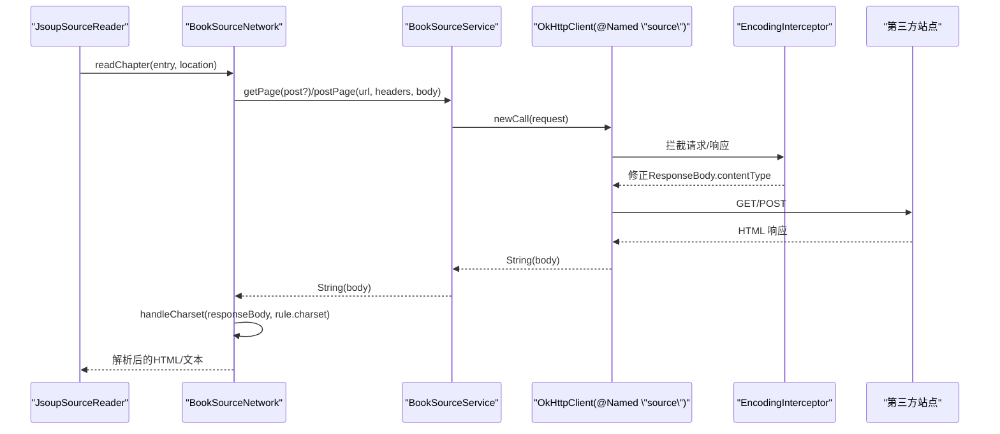
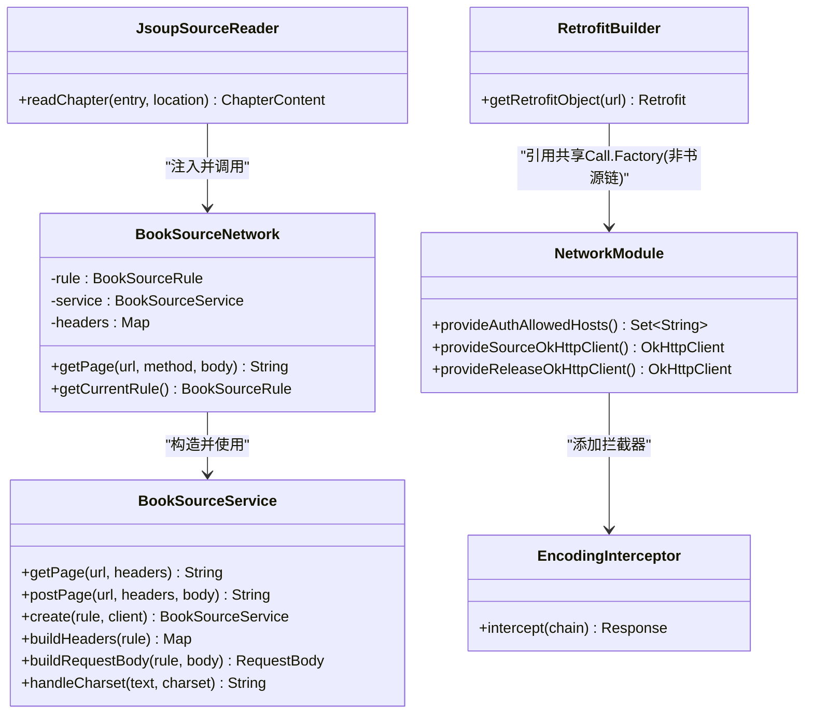

# 网络API接口

<cite>
**本文档引用的文件**
- [BookSourceService.kt](file://lib_ebook_api/src/main/java/com/ebook/api/service/source/BookSourceService.kt)
- [BookSourceNetwork.kt](file://lib_ebook_api/src/main/java/com/ebook/api/service/source/BookSourceNetwork.kt)
- [BookSourceRule.kt](file://lib_ebook_api/src/main/java/com/ebook/api/entity/BookSourceRule.kt)
- [NetworkModule.kt](file://lib_ebook_api/src/main/java/com/ebook/api/utils/NetworkModule.kt)
- [EncodingInterceptor.kt](file://lib_ebook_api/src/main/java/com/ebook/api/intercepter/EncodingInterceptor.kt)
- [JsoupSourceReader.kt](file://lib_book_common/src/main/java/com/ebook/common/analyze/source/JsoupSourceReader.kt)
- [RetrofitBuilder.kt](file://lib_ebook_api/src/main/java/com/ebook/api/RetrofitBuilder.kt)
</cite>

## 目录
1. [简介](#简介)
2. [项目结构](#项目结构)
3. [核心组件](#核心组件)
4. [架构总览](#架构总览)
5. [详细组件分析](#详细组件分析)
6. [依赖关系分析](#依赖关系分析)
7. [性能与可用性](#性能与可用性)
8. [故障排查指南](#故障排查指南)
9. [结论](#结论)
10. [附录：调用示例与最佳实践](#附录调用示例与最佳实践)

## 简介
本文档面向书源 HTTP 服务相关能力，系统性说明 BookSourceService 的 getPage/postPage 协议、请求头构建规则、动态 URL 机制、字符编码处理（含 ISO-8859-1 转 UTF-8）、User-Agent 默认值与自定义请求头合并策略；并解释认证拦截器的工作流程与 token 自动附加、白名单 host 匹配规则。同时覆盖错误处理模式、超时与重试策略、断网检测、OkHttp 客户端配置选项（连接池、缓存）以及与 Retrofit 和协程的集成方式，最后给出实际调用示例与最佳实践。

## 项目结构
本仓库的网络层以 lib_ebook_api 为核心，封装了 OkHttp + Retrofit，提供“认证业务客户端”和“书源纯净客户端”。书源服务在 lib_ebook_api 中定义 service 接口，并由上层 lib_book_common 通过 Jsoup 解析 HTML，组合章节正文读取逻辑。

```mermaid
graph TB
    A["应用功能模块"] --> B["lib_book_common<br/>JsoupSourceReader"]
    B --> C["BookSourceNetwork"]
    C --> D["BookSourceService(Retofit Service)<br/>getPage / postPage"]
    D --> E["Retrofit + OkHttp<br/>@Named(\"source\") 客户端"]
    E --> F["EncodingInterceptor<br/>响应编码修正"]
    E --> G["目标站点HTTP服务器"]
    subgraph "认证链(非书源)"
        H["RetrofitBuilder<br/>复用共享Call.Factory"] --> I["AuthInterceptor(来自lib_common)<br/>白名单host追加token"]
        H --> J["服务端: ebook-server"]
    end
```

图表来源
- [NetworkModule.kt:44-56](file://lib_ebook_api/src/main/java/com/ebook/api/utils/NetworkModule.kt#L44-L56)
- [EncodingInterceptor.kt:13-55](file://lib_ebook_api/src/main/java/com/ebook/api/intercepter/EncodingInterceptor.kt#L13-L55)
- [RetrofitBuilder.kt:24-44](file://lib_ebook_api/src/main/java/com/ebook/api/RetrofitBuilder.kt#L24-L44)
- [JsoupSourceReader.kt:34-39](file://lib_book_common/src/main/java/com/ebook/common/analyze/source/JsoupSourceReader.kt#L34-L39)
- [BookSourceNetwork.kt:10-33](file://lib_ebook_api/src/main/java/com/ebook/api/service/source/BookSourceNetwork.kt#L10-L33)
- [BookSourceService.kt:15-91](file://lib_ebook_api/src/main/java/com/ebook/api/service/source/BookSourceService.kt#L15-L91)

部分来源
- [BookSourceService.kt:15-91](file://lib_ebook_api/src/main/java/com/ebook/api/service/source/BookSourceService.kt#L15-L91)
- [BookSourceNetwork.kt:10-33](file://lib_ebook_api/src/main/java/com/ebook/api/service/source/BookSourceNetwork.kt#L10-L33)
- [NetworkModule.kt:44-56](file://lib_ebook_api/src/main/java/com/ebook/api/utils/NetworkModule.kt#L44-L56)
- [EncodingInterceptor.kt:13-55](file://lib_ebook_api/src/main/java/com/ebook/api/intercepter/EncodingInterceptor.kt#L13-L55)
- [JsoupSourceReader.kt:34-39](file://lib_book_common/src/main/java/com/ebook/common/analyze/source/JsoupSourceReader.kt#L34-L39)
- [RetrofitBuilder.kt:24-44](file://lib_ebook_api/src/main/java/com/ebook/api/RetrofitBuilder.kt#L24-L44)

## 核心组件
- BookSourceService：基于 Retrofit 的书源 Service 接口，暴露 suspend fun getPage/postPage，支持动态 URL 与扩展 HeaderMap。内部提供静态方法构建请求头、请求体、处理字符编码，以及统一的 User-Agent 默认值。
- BookSourceNetwork：将 Rule 中的 URL/method/body/charset 等参数适配为具体 HTTP 请求；拼接完整 URL，并委托 BookSourceService 发起 GET/POST 请求后按规则 charset 解码响应。
- NetworkModule：提供 @Named("source") 纯净 OkHttp 客户端（不带 token），设置连接/写/读超时 10s，挂 EncodingInterceptor；另提供 Release 专用客户端与允许附加 token 的白名单 host。
- RetrofitBuilder：用于业务后端服务的统一 Retrofit 构建，复用带 AuthInterceptor 的 Call.Factory；书源链路不经过此 Builder。
- EncodingInterceptor：针对无返回 charset 的情形修改响应体的 contentTypeString，使后续解码使用约定编码（书源用 UTF-8）。
- JsoupSourceReader：在业务侧抓取章节正文，遍历多页并按章节分页匹配策略拼接内容，最终写入本地存储。

部分来源
- [BookSourceService.kt:15-91](file://lib_ebook_api/src/main/java/com/ebook/api/service/source/BookSourceService.kt#L15-L91)
- [BookSourceNetwork.kt:10-33](file://lib_ebook_api/src/main/java/com/ebook/api/service/source/BookSourceNetwork.kt#L10-L33)
- [NetworkModule.kt:44-56](file://lib_ebook_api/src/main/java/com/ebook/api/utils/NetworkModule.kt#L44-L56)
- [EncodingInterceptor.kt:13-55](file://lib_ebook_api/src/main/java/com/ebook/api/intercepter/EncodingInterceptor.kt#L13-L55)
- [JsoupSourceReader.kt:34-39](file://lib_book_common/src/main/java/com/ebook/common/analyze/source/JsoupSourceReader.kt#L34-L39)
- [RetrofitBuilder.kt:24-44](file://lib_ebook_api/src/main/java/com/ebook/api/RetrofitBuilder.kt#L24-L44)

## 架构总览
下图展示从 UI/ViewModel 到远程站点的完整调用路径：JsoupSourceReader 通过 BookSourceNetwork 调用 BookSourceService 的两个 API，由 @Named("source") OkHttp 发出真实 HTTP(S) 请求；响应经 EncodingInterceptor 修正编码，再由 Service 内部按规则字符集转换。



图表来源
- [JsoupSourceReader.kt:34-39](file://lib_book_common/src/main/java/com/ebook/common/analyze/source/JsoupSourceReader.kt#L34-L39)
- [BookSourceNetwork.kt:10-33](file://lib_ebook_api/src/main/java/com/ebook/api/service/source/BookSourceNetwork.kt#L10-L33)
- [BookSourceService.kt:15-91](file://lib_ebook_api/src/main/java/com/ebook/api/service/source/BookSourceService.kt#L15-L91)
- [NetworkModule.kt:44-56](file://lib_ebook_api/src/main/java/com/ebook/api/utils/NetworkModule.kt#L44-L56)
- [EncodingInterceptor.kt:13-55](file://lib_ebook_api/src/main/java/com/ebook/api/intercepter/EncodingInterceptor.kt#L13-L55)

## 详细组件分析

### BookSourceService：getPage/postPage 方法与规则
- HTTP 协议
  - getPage：GET 请求，URL 动态传入（@Url），Headers 通过 Map 透传。
  - postPage：POST 请求，URL 动态传入，HeaderMap 透传，Body 为 okHttp RequestBody，媒体类型由 buildRequestBody 根据 BookSourceRule.charset 生成 application/x-www-form-urlencoded。
- 请求头构建
  - 默认头包含 Accept、Accept-Language、Cache-Control。
  - 逐个合并 BookSourceRule.headers（可覆盖）。
  - 若未显式指定 User-Agent，则插入内置默认 UA 字符串（桌面浏览器指纹）。
- 动态 URL 支持
  - 使用 Retrofit @Url，可在运行时任意地址访问（相对或绝对均可），BookSourceNetwork 负责把相对路径与前缀 rule.url 拼接为完整地址。
- 请求体构建
  - 表单提交，编码采用 BookSourceRule.charset 指定的字符集，媒体类型为 application/x-www-form-urlencoded;charset={charset}。
- 字符编码处理
  - 当规则 charset 非 utf-8 时，先将 Response 原始字节以 ISO-8859-1 解码再转为目标 charset 的字符串，以兼容服务端未声明正确字符集的场景。
- Retrofit 集成
  - 由 create(rule, okHttpClient) 创建实例，baseUrl 取自 rule.url，注册 ScalarsConverterFactory 以直接返回 String。

部分来源
- [BookSourceService.kt:15-91](file://lib_ebook_api/src/main/java/com/ebook/api/service/source/BookSourceService.kt#L15-L91)

### BookSourceNetwork：协议适配与路由
- URL 拼接：当入参 url 不是 http(s) 开头时，会自动与 rule.url 拼接形成完整 URL。
- 方法选择：优先使用传入 method，否则取 rule.method；当为 POST 且存在 requestBody 时才发 POST，否则走 GET。
- 响应解码：调用 BookSourceService.handleCharset 按规则字符集转换，确保后续解析稳定。
- 数据流转：仅做适配与转换，不包含具体解析细节；解析由上层 JsoupSourceReader 完成。

部分来源
- [BookSourceNetwork.kt:10-33](file://lib_ebook_api/src/main/java/com/ebook/api/service/source/BookSourceNetwork.kt#L10-L33)

### 字符编码处理策略：ISO-8859-1 到 UTF-8
- 服务端若未返回正确的字符集信息，会导致读取乱码。为此：
  - EncodingInterceptor 通过反射设置 ResponseBody.contentTypeString 为一个明确的 charset（书源客户端统一为 UTF-8），让上层按 UTF-8 正常读取。
  - 当 BookSourceRule.charset 明确设置为非 utf-8 时，Service 内部将已读的 String 先用 ISO-8859-1 还原字节流，再按 rule.charset 解析，从而兼容遗留站点。
- 典型路径
  - OkHttp -> EncodingInterceptor（修正 contentType）-> Retrofit 读取 String -> BookSourceService.handleCharset（非 utf-8 时二次转换）。

部分来源
- [EncodingInterceptor.kt:13-55](file://lib_ebook_api/src/main/java/com/ebook/api/intercepter/EncodingInterceptor.kt#L13-L55)
- [BookSourceService.kt:80-91](file://lib_ebook_api/src/main/java/com/ebook/api/service/source/BookSourceService.kt#L80-L91)
- [NetworkModule.kt:48-56](file://lib_ebook_api/src/main/java/com/ebook/api/utils/NetworkModule.kt#L48-L56)

### 认证拦截器与 Token 自动附加
- 书源请求必须使用 @Named("source") 纯净客户端，不得携带 Authorization 令牌，避免泄露给第三方站点。
- 认证相关请求（业务后端）使用 RetrofitBuilder 构建的 Retrofit，内部复用 lib_common 的共享 Call.Factory，该工厂链中包含：
  - AuthInterceptor：只在白名单 host（@AuthAllowedHosts，如 BuildConfig.EBOOK_SERVER_HOST）上自动追加 token。
  - 脱敏日志与超时。
- Token 生命周期：登录成功后保存到内存 TokenHolder，启动恢复时回填 TokenHolder；刷新失败则由统一适配层发送会话过期事件，由上层清理跳转。

部分来源
- [NetworkModule.kt:35-42](file://lib_ebook_api/src/main/java/com/ebook/api/utils/NetworkModule.kt#L35-L42)
- [RetrofitBuilder.kt:13-44](file://lib_ebook_api/src/main/java/com/ebook/api/RetrofitBuilder.kt#L13-L44)

### OkHttp 客户端配置（连接池、缓存、超时）
- 书源客户端 @Named("source")
  - 超时：connectTimeout/readTimeout/writeTimeout 均设置为 10s。
  - 拦截器：仅包含 EncodingInterceptor（UTF-8 兜底），无 token、无鉴权头。
  - 连接池/缓存：使用 OkHttpClient 默认行为（未额外启用磁盘缓存等），适用于短时高并发抓取；可按需扩展启用二级缓存或限制连接池大小。
- 发布检查客户端 @Named("release")
  - 无 EncodingInterceptor，专为公开 ASCII JSON 端点设计；同样不含 token。
- 认证客户端
  - 不在本仓库自行构建，交由 lib_common 提供统一 Call.Factory（带 AuthInterceptor、白名单、超时 30s），通过 RetrofitBuilder 接入。

部分来源
- [NetworkModule.kt:48-71](file://lib_ebook_api/src/main/java/com/ebook/api/utils/NetworkModule.kt#L48-L71)
- [RetrofitBuilder.kt:13-44](file://lib_ebook_api/src/main/java/com/ebook/api/RetrofitBuilder.kt#L13-L44)

### 网络请求的错误处理模式
- 业务后端：统一通过 CoroutineAdapter 包装 suspend 调用，捕获 A0230 进行单次静默刷新并重放；失败时发出 SessionEvent 会话过期事件，由主界面处理清会话与提示跳转。
- 书源网络：BookSourceNetwork 不做重试，超时/连接异常会向上抛出；JsoupSourceReader 对单章抓取的异常记录错误 URL（便于重排重试）并抛出 IllegalStateException 让调用方感知失败。
- 空结果防护：当章节内容为空时不写盘，避免“已下载但空白”的假成功；调用方可据此决定是否重试或提示。

部分来源
- [JsoupSourceReader.kt:80-177](file://lib_book_common/src/main/java/com/ebook/common/analyze/source/JsoupSourceReader.kt#L80-L177)
- [BookSourceNetwork.kt:18-31](file://lib_ebook_api/src/main/java/com/ebook/api/service/source/BookSourceNetwork.kt#L18-L31)

### 超时与重试策略、断网检测
- 超时：书源客户端统一 10s 超时，保证快速失败；业务后端由共享客户端提供更高超时，并结合协程超时控制。
- 重试：当前未内置通用重试，建议在调用层实现指数退避（例如最多 3 次、间隔递增）以应对瞬时错误；对“空正文”的情况，结合章节状态机触发重试。
- 断网：连接失败、域名解析失败等网络异常会在超时内被捕获，应结合上层 UI 显示重试按钮或提示。

部分来源
- [NetworkModule.kt:48-56](file://lib_ebook_api/src/main/java/com/ebook/api/utils/NetworkModule.kt#L48-L56)
- [JsoupSourceReader.kt:157-176](file://lib_book_common/src/main/java/com/ebook/common/analyze/source/JsoupSourceReader.kt#L157-L176)

### 类结构与依赖关系图


图表来源
- [BookSourceService.kt:15-91](file://lib_ebook_api/src/main/java/com/ebook/api/service/source/BookSourceService.kt#L15-L91)
- [BookSourceNetwork.kt:10-33](file://lib_ebook_api/src/main/java/com/ebook/api/service/source/BookSourceNetwork.kt#L10-L33)
- [NetworkModule.kt:44-71](file://lib_ebook_api/src/main/java/com/ebook/api/utils/NetworkModule.kt#L44-L71)
- [EncodingInterceptor.kt:13-55](file://lib_ebook_api/src/main/java/com/ebook/api/intercepter/EncodingInterceptor.kt#L13-L55)
- [JsoupSourceReader.kt:34-39](file://lib_book_common/src/main/java/com/ebook/common/analyze/source/JsoupSourceReader.kt#L34-L39)
- [RetrofitBuilder.kt:13-44](file://lib_ebook_api/src/main/java/com/ebook/api/RetrofitBuilder.kt#L13-L44)

## 依赖关系分析
- 模块边界
  - lib_ebook_api：定义书源 API（BookSourceService）、规则实体（BookSourceRule）、网络客户端装配（NetworkModule）、编码拦截器（EncodingInterceptor）。
  - lib_book_common：基于 BookSourceNetwork 实现网络书章节抓取（JsoupSourceReader）。
- 外部依赖
  - Retrofit/OkHttp：作为底层传输，BookSourceService 使用 @GET/@POST 与 @Url/@HeaderMap 支撑动态路由与头部扩展。
  - 共享库：lib_common 提供认证拦截器和调试日志，仅供业务后端链路使用，书源链路刻意隔离。
- 循环与耦合
  - BookSourceService 仅依赖 Rule 与 OkHttp/Retrofit，低耦合。
  - BookSourceNetwork 仅封装协议适配，解耦解析逻辑于上层。
  - JsoupSourceReader 依赖 bookSourceManager 获取解析器规则，并通过 @Named("source") 注入纯净客户端，避免认证污染。

部分来源
- [BookSourceService.kt:15-91](file://lib_ebook_api/src/main/java/com/ebook/api/service/source/BookSourceService.kt#L15-L91)
- [NetworkModule.kt:35-71](file://lib_ebook_api/src/main/java/com/ebook/api/utils/NetworkModule.kt#L35-L71)
- [JsoupSourceReader.kt:34-39](file://lib_book_common/src/main/java/com/ebook/common/analyze/source/JsoupSourceReader.kt#L34-L39)

## 性能与可用性
- 性能
  - 短连接、短超时（10s）有利于快速失败，减少卡死；如需高频抓取可考虑开启连接复用、限制最大连接数与保持活跃时间（按场景评估）。
  - 避免重复请求：JsoupSourceReader 通过 visited set 防止翻页死循环与单章过度抓取（上限 50 页）。
- 可用性
  - 编码兜底（EncodingInterceptor）+ 规则级字符集转换（handleCharset）降低乱码概率。
  - 空响应不落盘，提升重试成功率与用户可见一致性。
- 可观测性
  - 异常堆栈记录至错误管理器，配合调试日志快速定位问题。

## 故障排查指南
- 出现乱码
  - 检查 BookSourceRule.charset 是否与站点一致，确认 EncodingInterceptor 生效（仅对书源链路挂载 UTF-8 兜底）。
  - 若站点确为非 UTF-8，保留规则级 convert（handleCharset）分支。
- 请求 403/401
  - 确认未误用认证客户端；书源必须使用 @Named("source")。
  - 核对规则中 headers 是否必要，必要时补充必要的 UA/Cookie/Referer。
- 频繁超时
  - 检查网络质量与站点响应；可在调用层增加重试与退避策略，避免同步阻塞。
- 空白章节
  - 正文选择器失配会返回空；调用方应判空并提示重试或反馈错误 URL。
- 无法加载
  - 断网/权限导致网络不可用时，应在 UI 层提示并支持重试。

部分来源
- [EncodingInterceptor.kt:13-55](file://lib_ebook_api/src/main/java/com/ebook/api/intercepter/EncodingInterceptor.kt#L13-L55)
- [BookSourceService.kt:80-91](file://lib_ebook_api/src/main/java/com/ebook/api/service/source/BookSourceService.kt#L80-L91)
- [JsoupSourceReader.kt:157-176](file://lib_book_common/src/main/java/com/ebook/common/analyze/source/JsoupSourceReader.kt#L157-L176)

## 结论
本项目以 Retrofit + OkHttp 构建了清晰的“书源网络”与“认证业务网络”双通道：书源链路纯净、轻量、快速失败；认证链路集中治理 token、白名单与会话失效。通过 Rule 驱动、动态 URL、编码兜底与合理的超时/失败路径，能稳健对接第三方站点；上层 JsoupSourceReader 聚焦解析与缓存，职责清晰。建议结合业务需要进一步引入请求级重试与监控上报，完善长任务降级体验。

## 附录：调用示例与最佳实践

- 构建并获取服务实例
  - 使用 BookSourceService.create(rule, okHttpClient) 创建实例；okHttpClient 使用 @Named("source") 注入。
  - 参考：[BookSourceService.kt:41-48](file://lib_ebook_api/src/main/java/com/ebook/api/service/source/BookSourceService.kt#L41-L48)

- GET 请求
  - 动态 URL：支持绝对或相对 URL（相对将由 BookSourceNetwork 拼接 rule.url）。
  - 请求头：通过 BookSourceService.buildHeaders(rule) 构造，必要时扩展 Map。
  - 编码：返回 String；如规则为非 UTF-8，Service 内部会按规则二次转换。
  - 参考：[BookSourceService.kt:20-31](file://lib_ebook_api/src/main/java/com/ebook/api/service/source/BookSourceService.kt#L20-L31)、[BookSourceService.kt:53-78](file://lib_ebook_api/src/main/java/com/ebook/api/service/source/BookSourceService.kt#L53-L78)、[BookSourceService.kt:80-91](file://lib_ebook_api/src/main/java/com/ebook/api/service/source/BookSourceService.kt#L80-L91)

- POST 请求
  - 使用 BookSourceService.buildRequestBody(rule, body) 构建表单 Body，媒体类型按规则 charset。
  - 参考：[BookSourceService.kt:74-78](file://lib_ebook_api/src/main/java/com/ebook/api/service/source/BookSourceService.kt#L74-L78)

- URL 拼装与方法选择
  - BookSourceNetwork 自动判断 absolute/relative URL，并在 GET/POST 间切换；POST 仅在存在 body 时生效。
  - 参考：[BookSourceNetwork.kt:18-31](file://lib_ebook_api/src/main/java/com/ebook/api/service/source/BookSourceNetwork.kt#L18-L31)

- 正则分页抓取章节正文
  - JsoupSourceReader 按 rule.ruleContent.content 选择容器，支持 nextPage 跟随，限制最大页数（防止无限循环）。
  - 正文为空不落盘，失败时记录错误 URL 并抛错，便于上层重试或提示。
  - 参考：[JsoupSourceReader.kt:92-176](file://lib_book_common/src/main/java/com/ebook/common/analyze/source/JsoupSourceReader.kt#L92-L176)

- 认证与白名单
  - 业务后端使用 RetrofitBuilder 创建的 Retrofit，借助共享 Call.Factory 附带 AuthInterceptor，仅对 @AuthAllowedHosts（如 BuildConfig.EBOOK_SERVER_HOST）附加 token。
  - 参考：[RetrofitBuilder.kt:24-44](file://lib_ebook_api/src/main/java/com/ebook/api/RetrofitBuilder.kt#L24-L44)、[NetworkModule.kt:35-42](file://lib_ebook_api/src/main/java/com/ebook/api/utils/NetworkModule.kt#L35-L42)

- 常见最佳实践
  - 始终为书源规则提供正确的 charset，避免多次转换带来的损耗与误差。
  - 合理设置规则 headers（UA、Referer、Cookie），减少封禁风险。
  - 结合上层重试与退避，保证弱网环境下的鲁棒性。
  - 对空响应进行判空并给出明确的用户提示或重试入口。