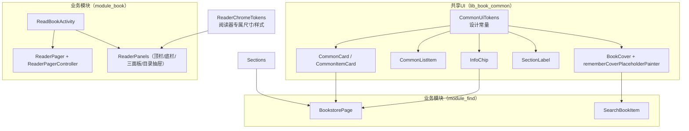
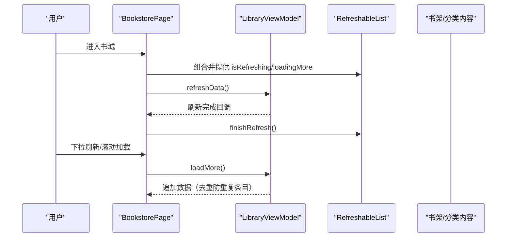
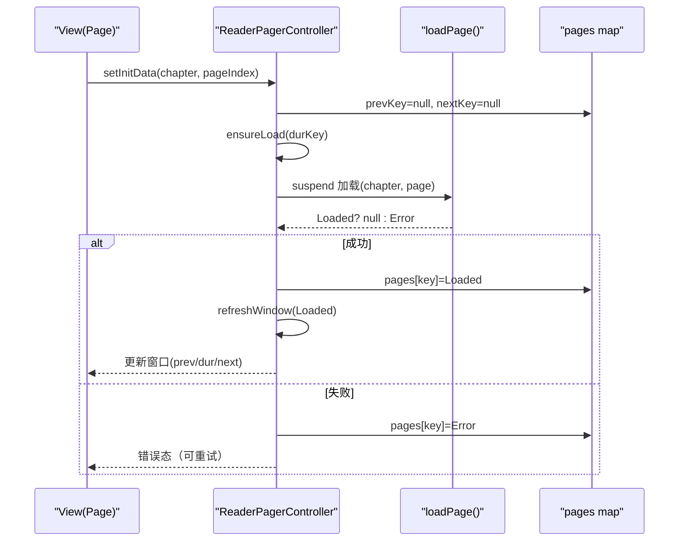
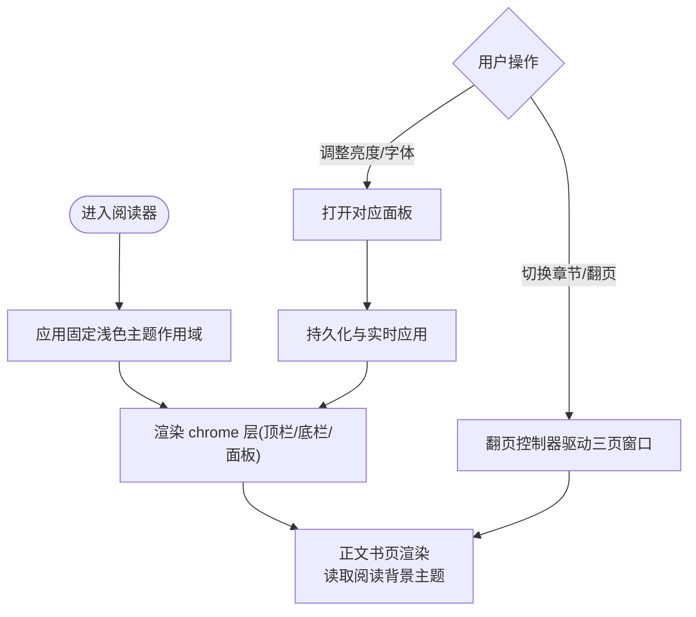
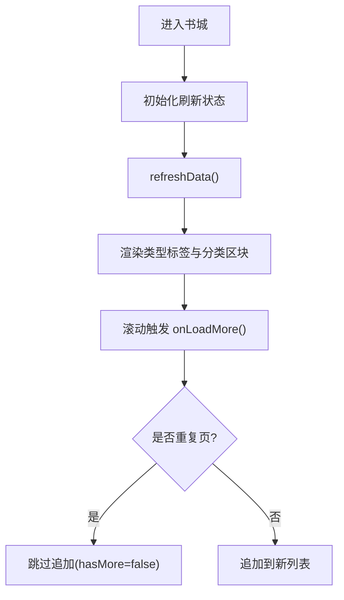
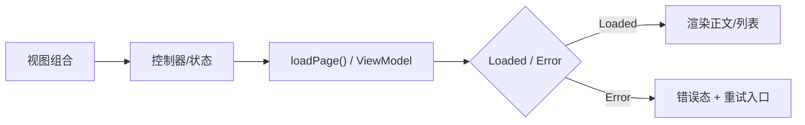

# UI组件系统

<cite>
**本文引用的文件 **
- [CommonUiComponents.kt](file://lib_book_common/src/main/java/com/ebook/common/ui/CommonUiComponents.kt)
- [BookCover.kt](file://lib_book_common/src/main/java/com/ebook/common/ui/BookCover.kt)
- [CommonPainters.kt](file://lib_book_common/src/main/java/com/ebook/common/ui/CommonPainters.kt)
- [ReaderPager.kt](file://module_book/src/main/java/com/ebook/book/reader/ReaderPager.kt)
- [ReaderPanels.kt](file://module_book/src/main/java/com/ebook/book/reader/ReaderPanels.kt)
- [ReadBookActivity.kt](file://module_book/src/main/java/com/ebook/book/ReadBookActivity.kt)
- [BookstorePage.kt](file://module_find/src/main/java/com/ebook/find/page/BookstorePage.kt)
- [SearchBookItem.kt](file://module_find/src/main/java/com/ebook/find/view/SearchBookItem.kt)
</cite>

## 目录
1. [简介](#简介)
2. [项目结构与范围](#项目结构与范围)
3. [核心共享UI组件](#核心共享ui组件)
4. [架构总览](#架构总览)
5. [详细组件解析](#详细组件解析)
6. [依赖关系与数据流](#依赖关系与数据流)
7. [性能与可维护性](#性能与可维护性)
8. [问题排查指南](#问题排查指南)
9. [结论](#结论)

## 简介
本文件面向基于 Jetpack Compose 的 Android 电子书阅读器的 UI 组件体系，围绕“跨模块共享设计语言”的目标，系统化梳理 lib_book_common 中 com.ebook.common.ui 的共享组件、阅读器页面的翻页与主题交互、书城浏览页的布局与滚动机制、响应式与主题管理、以及可访问性与国际化要点。内容基于源码与仓库 ADR 文档，便于非技术读者理解并指导实际使用与扩展。

## 项目结构与范围
- 共享UI层集中在 lib_book_common：以 CommonUiTokens 定义圆角/间距等设计常量；以 CommonCard、CommonItemCard、CommonListItem、SectionLabel、InfoChip、BookCover 等组件统一视觉语言。
- 阅读器由 module_book 的 reader 子包实现（翻页、面板、类型设置与缓存）。
- 书城由 module_find 实现（类型标签流式展示、分类书籍列表与刷新）。

图表来源
- [CommonUiComponents.kt:47-77](file://lib_book_common/src/main/java/com/ebook/common/ui/CommonUiComponents.kt#L47-L77)
- [BookstorePage.kt:120-193](file://module_find/src/main/java/com/ebook/find/page/BookstorePage.kt#L120-L193)
- [ReaderPanels.kt:131-178](file://module_book/src/main/java/com/ebook/book/reader/ReaderPanels.kt#L131-L178)
- [ReadBookActivity.kt:81-128](file://module_book/src/main/java/com/ebook/book/ReadBookActivity.kt#L81-L128)

小节来源
- [CommonUiComponents.kt:33-77](file://lib_book_common/src/main/java/com/ebook/common/ui/CommonUiComponents.kt#L33-L77)
- [BookstorePage.kt:116-193](file://module_find/src/main/java/com/ebook/find/page/BookstorePage.kt#L116-L193)
- [ReaderPanels.kt:123-178](file://module_book/src/main/java/com/ebook/book/reader/ReaderPanels.kt#L123-L178)
- [ReadBookActivity.kt:81-128](file://module_book/src/main/java/com/ebook/book/ReadBookActivity.kt#L81-L128)

## 核心共享UI组件
共享UI旨在收敛视觉规范，通过语义色、Material排版与统一间距/圆角建立一致体验。

- 设计常量（CommonUiTokens）：集中卡片圆角、条目圆角、chip 圆角、封面圆角、页面边距、分区间距、列表间距与分割线缩进，避免散落魔法值。
- 通用容器（CommonCard、CommonItemCard）：分组卡（16dp）和条目卡（12dp）双层层次；Surface 语义色 + 轻阴影；点击区随圆角裁剪。
- 菜单项（CommonListItem）：36dp图标容器+标题+尾部值或自定义尾随内容+箭头；适用于设置/工具列表。
- 分组标题（SectionLabel）：各区块标题，用于层级划分与信息组织。
- 信息标签（InfoChip）：默认小标签与可调胶囊形态（传圆形 shape），承载状态/分类/字数等短信息。
- 书籍封面（BookCover）：Coil AsyncImage + 统一占位图 + Crop 缩放；失败/空态回退到占位图。占位 painter 支持 fallback color。

小节来源
- [CommonUiComponents.kt:47-77](file://lib_book_common/src/main/java/com/ebook/common/ui/CommonUiComponents.kt#L47-L77)
- [CommonUiComponents.kt:79-146](file://lib_book_common/src/main/java/com/ebook/common/ui/CommonUiComponents.kt#L79-L146)
- [CommonUiComponents.kt:148-232](file://lib_book_common/src/main/java/com/ebook/common/ui/CommonUiComponents.kt#L148-L232)
- [CommonUiComponents.kt:239-350](file://lib_book_common/src/main/java/com/ebook/common/ui/CommonUiComponents.kt#L239-L350)
- [BookCover.kt:11-41](file://lib_book_common/src/main/java/com/ebook/common/ui/BookCover.kt#L11-L41)
- [CommonPainters.kt:13-38](file://lib_book_common/src/main/java/com/ebook/common/ui/CommonPainters.kt#L13-L38)

## 架构总览
- 分层边界清晰：业务模块 → lib_book_common 的共享UI/领域能力；组件复用不侵入业务逻辑。
- 阅读器在 ReadBookActivity 内封装 PageContent：在固定浅色作用域下渲染 chrome 层（顶/底栏与面板），正文配色独立控制。
- 书城页通过 RefreshableList 提供下拉刷新/上拉加载骨架与刷新信号绑定。

图表来源
- [BookstorePage.kt:72-114](file://module_find/src/main/java/com/ebook/find/page/BookstorePage.kt#L72-L114)
- [BookstorePage.kt:116-193](file://module_find/src/main/java/com/ebook/find/page/BookstorePage.kt#L116-L193)

## 详细组件解析

### 共享组件：CommonCard / CommonItemCard / CommonListItem
- 用途：作为分组容器（16dp）、条目容器（12dp）以及带图标行的列表项。
- 可定制点：
  - CommonItemCard：可配置点击/长按、enabled、阴影、内部边距；纯展示时不提供点击面。
  - CommonListItem：可配置尾随文本或自定义尾随组件，箭头显示开关。
- 设计要点：语义色 surfaceContainer 营造轻质感；ripple按圆角裁剪；保持 Material typography。

小节来源
- [CommonUiComponents.kt:79-146](file://lib_book_common/src/main/java/com/ebook/common/ui/CommonUiComponents.kt#L79-L146)
- [CommonUiComponents.kt:148-232](file://lib_book_common/src/main/java/com/ebook/common/ui/CommonUiComponents.kt#L148-L232)

### 共享组件：SectionLabel / InfoChip
- SectionLabel：区块级标题，提升结构可读性。
- InfoChip：默认小标签形态（surfaceVariant + onSurfaceVariant）；可传入 RoundedCornerShape(50) 呈现胶囊，承载状态/分类/字数等信息。
- 使用示例与定制选项见书城书类型胶囊、搜索历史、下载“已缓存”徽章等位置。

小节来源
- [CommonUiComponents.kt:239-350](file://lib_book_common/src/main/java/com/ebook/common/ui/CommonUiComponents.kt#L239-L350)
- [BookstorePage.kt:196-212](file://module_find/src/main/java/com/ebook/find/page/BookstorePage.kt#L196-L212)
- [SearchBookItem.kt:95-104](file://module_find/src/main/java/com/ebook/find/view/SearchBookItem.kt#L95-L104)

### 共享组件：BookCover 与占位图
- BookCover：网络封面统一包装，使用 Coil AsyncImage、默认采用 ContentScale.Crop，避免拉伸变形；失败时回退到占位图。
- 占位图：使用 rememberCoverPlaceholderPainter，优先 NinePatch 解码为 BitmapPainter，失败时回落到表面变体色，保证无闪烁。
- 形状：默认封面圆角来自设计常量，可覆盖。

小节来源
- [BookCover.kt:11-41](file://lib_book_common/src/main/java/com/ebook/common/ui/BookCover.kt#L11-L41)
- [CommonPainters.kt:13-38](file://lib_book_common/src/main/java/com/ebook/common/ui/CommonPainters.kt#L13-L38)
- [CommonUiComponents.kt:47-77](file://lib_book_common/src/main/java/com/ebook/common/ui/CommonUiComponents.kt#L47-L77)

### 阅读器翻页：ReaderPager 与控制器
- 核心模型：ReaderPageKey 表示章节与页码索引；ReaderPageUi 描述 Loading/Error/Loaded 三种状态。
- 控制器（ReaderPagerController）：实现三页窗口状态机（prev/dur/next），拖拽位移 animatable、成功阈值与动画期手势锁，去重在途 job 与已就绪 Loaded 页，避免重复请求；提交后未完成的任务归属新窗口。
- 安全约束：三键互不重叠；双方向不会同时为空；快速回翻时不会将已加载来路页打回 Loading。
- 职责分离：控制器仅负责窗口/加载/进度回调；渲染委托给页面侧的 ReaderPageCard/类型设置。

图表来源
- [ReaderPager.kt:64-119](file://module_book/src/main/java/com/ebook/book/reader/ReaderPager.kt#L64-L119)
- [ReaderPager.kt:154-200](file://module_book/src/main/java/com/ebook/book/reader/ReaderPager.kt#L154-L200)

小节来源
- [ReaderPager.kt:64-119](file://module_book/src/main/java/com/ebook/book/reader/ReaderPager.kt#L64-L119)
- [ReaderPager.kt:154-200](file://module_book/src/main/java/com/ebook/book/reader/ReaderPager.kt#L154-L200)

### 阅读器主题与亮度/字体/夜间
- 阅读器整片豁免系统深色：在 ReadBookActivity.PageContent 中以固定浅色 Theme 包裹 chrome 层，使顶/底栏与面板跟随固定浅色；正文配色由阅读背景主题独立控制。
- 面板体系：ReaderPanels 包含顶栏（title居中、副标题）、底栏（四入口、当前选中高亮）、三面板（亮度/字体/更多设置）、目录抽屉（右侧滑入、快速滚动条常显轨道+滑块）。
- 主题与语义：面板与顶部底部使用 Material 语义色；尺寸/样式收口到 ReaderChromeTokens；避免硬编码颜色。

图表来源
- [ReadBookActivity.kt:81-134](file://module_book/src/main/java/com/ebook/book/ReadBookActivity.kt#L81-L134)
- [ReaderPanels.kt:123-178](file://module_book/src/main/java/com/ebook/book/reader/ReaderPanels.kt#L123-L178)

小节来源
- [ReadBookActivity.kt:81-134](file://module_book/src/main/java/com/ebook/book/ReadBookActivity.kt#L81-L134)
- [ReaderPanels.kt:123-178](file://module_book/src/main/java/com/ebook/book/reader/ReaderPanels.kt#L123-L178)

### 书城界面：网格、瀑布流、加载更多
- 类型标签使用 InfoChip 胶囊形态（50圆角 + primaryContainer），FlowRow 流式排列，避免长名称被截断。
- 分类书籍列表以 LazyColumn 垂直排列区块，顶部提供 TopAppBar；刷新由 RefreshableList 统一管理。
- “加载更多”机制：通过 ViewModel 暴露数据流，页面结合 isRefreshing/loadingMore 控制列表行为；合并分页时以 noteUrl 去重防止重复条目。

图表来源
- [BookstorePage.kt:72-114](file://module_find/src/main/java/com/ebook/find/page/BookstorePage.kt#L72-L114)
- [BookstorePage.kt:116-193](file://module_find/src/main/java/com/ebook/find/page/BookstorePage.kt#L116-L193)

小节来源
- [BookstorePage.kt:72-114](file://module_find/src/main/java/com/ebook/find/page/BookstorePage.kt#L72-L114)
- [BookstorePage.kt:116-193](file://module_find/src/main/java/com/ebook/find/page/BookstorePage.kt#L116-L193)

### 响应式设计与适配
- 列表/流式：FlowRow 与 LazyColumn 结合屏幕宽度自适应；胶囊标签在窄屏自动换行。
- edge-to-edge 处理：阅读器关闭 fitsSystemWindows，顶栏与抽屉自行避让系统栏；背景延伸至系统栏之后，内容偏移保证可读。
- 密度与字体：使用 MaterialTypography、dip 单位与 LocalDensity；阅读页字号通过字体面板等选择，正文根据 ReaderTypesetter 计算。

小节来源
- [BookstorePage.kt:120-193](file://module_find/src/main/java/com/ebook/find/page/BookstorePage.kt#L120-L193)
- [ReaderPanels.kt:181-197](file://module_book/src/main/java/com/ebook/book/reader/ReaderPanels.kt#L181-L197)
- [ReadBookActivity.kt:126-134](file://module_book/src/main/java/com/ebook/book/ReadBookActivity.kt#L126-L134)

### Material Design 主题系统
- 全局遵循 Material3 语义色：surface/surfaceContainer/primaryContainer/onSurfaceVariant 等。
- 统一 Typography：使用 MaterialTheme.typography（bodyLarge、labelLarge、bodyMedium 等），避免硬编码字号。
- 组件一致性：所有模块共享 CommonUiTokens 与共享组件，确保圆角、间距、色调一致；业务仅在局部必要时覆盖（如胶囊形态）。

小节来源
- [CommonUiComponents.kt:33-77](file://lib_book_common/src/main/java/com/ebook/common/ui/CommonUiComponents.kt#L33-L77)
- [BookstorePage.kt:141-188](file://module_find/src/main/java/com/ebook/find/page/BookstorePage.kt#L141-L188)

### 可访问性支持与国际化
- 可访问性：BookCover 接受 contentDescription；阅读器滑条等控件使用 semantics 描述进度；避免纯装饰 Icon 影响读屏路径。
- 国际化：文本走 stringResource 而非硬编码，便于多语言与本地化；面板文案与提示也资源化管理。

小节来源
- [BookCover.kt:26-41](file://lib_book_common/src/main/java/com/ebook/common/ui/BookCover.kt#L26-L41)
- [ReaderPanels.kt:181-210](file://module_book/src/main/java/com/ebook/book/reader/ReaderPanels.kt#L181-L210)
- [BookstorePage.kt:95-100](file://module_find/src/main/java/com/ebook/find/page/BookstorePage.kt#L95-L100)

## 依赖关系与数据流
- 共享UI被多处消费：书城、搜索、个人中心等模块统一引用，避免各实现分裂。
- 阅读器数据流：ReaderPagerController -> loadPage -> 返回 Loaded/Error -> 页面根据状态渲染；进度回调驱动顶栏与滑条。
- 书城数据流：ViewModel list Flow -> collectAsState -> 列表渲染；刷新与加载更多解耦于 UI。

图表来源
- [ReaderPager.kt:154-200](file://module_book/src/main/java/com/ebook/book/reader/ReaderPager.kt#L154-L200)
- [BookstorePage.kt:72-114](file://module_find/src/main/java/com/ebook/find/page/BookstorePage.kt#L72-L114)

小节来源
- [ReaderPager.kt:154-200](file://module_book/src/main/java/com/ebook/book/reader/ReaderPager.kt#L154-L200)
- [BookstorePage.kt:72-114](file://module_find/src/main/java/com/ebook/find/page/BookstorePage.kt#L72-L114)

## 性能与可维护性
- 列表与图片：LazyColumn/FlowRow 按需组合；BookCover 统一占位与失败处理，避免白屏或崩溃。
- 翻页性能：ReaderPagerController 对已加载页记忆、在途 Job 去重、完成即刷新窗口，减少重排与多余IO。
- 主题与排版：固定浅色作用域限制 chrom 层变化范围，避免全树重建；字号/主题变更通过集中重排点生效。
- 可维护性：所有间距/圆角集中至 CommonUiTokens，新增样式一律从常量出发，避免散乱魔法值。

小节来源
- [CommonUiComponents.kt:47-77](file://lib_book_common/src/main/java/com/ebook/common/ui/CommonUiComponents.kt#L47-L77)
- [ReaderPager.kt:154-200](file://module_book/src/main/java/com/ebook/book/reader/ReaderPager.kt#L154-L200)
- [BookstorePage.kt:116-193](file://module_find/src/main/java/com/ebook/find/page/BookstorePage.kt#L116-L193)

## 问题排查指南
- 封面空白/报错：检查 BookCover 的 url 是否为空串或非法地址；确认 rememberCoverPlaceholderPainter 能取到占位图。
- 列表重复项：分页数据应以 noteUrl 去重；当返回首页软404时停止追加 hasMore=false。
- 阅读器菜单深色不一致：确认 ReadBookActivity.PageContent 使用固定浅色作用域，正文配色不受影响。
- 无法下拉刷新：检查 RefreshableList 的 isRefreshing 是否与 ViewModel 刷新完成同步。
- 面板点击无效：核对 CommonListItem/CommonItemCard 的 onClick/onLongClick 是否正确接入。

小节来源
- [CommonPainters.kt:13-38](file://lib_book_common/src/main/java/com/ebook/common/ui/CommonPainters.kt#L13-L38)
- [BookstorePage.kt:72-114](file://module_find/src/main/java/com/ebook/find/page/BookstorePage.kt#L72-L114)
- [ReadBookActivity.kt:81-134](file://module_book/src/main/java/com/ebook/book/ReadBookActivity.kt#L81-L134)

## 结论
本项目通过 lib_book_common 统一了阅读器的阅读界面、书城的浏览体验与个人中心等场景的视觉语言，形成了高内聚、低耦合、易扩展的 UI 组件体系。共享设计常量与语义化组件降低了重复实现成本；阅读器采用独立的主题作用域与稳健的翻页控制器，保障复杂交互下的稳定性与性能；书城则借助 RefreshableList 与 FlowRow 实现了流畅的浏览与加载体验。建议后续继续使用 CommonUiTokens 与共享组件约束新增页面风格，并通过语义色与 Material Typography 保持一致的可访问性与国际化基础。