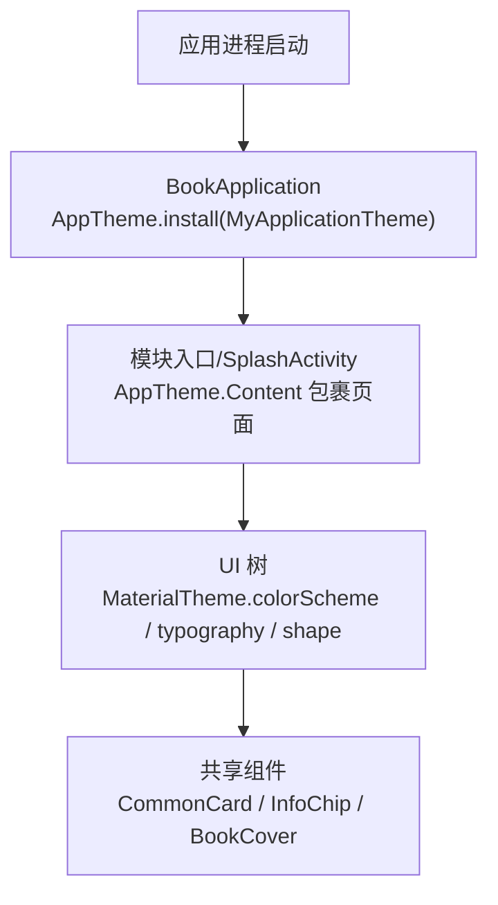
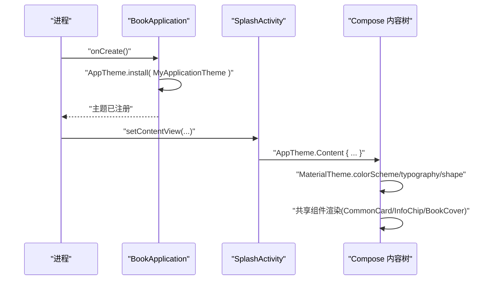
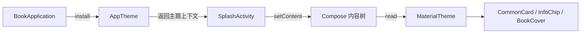

# 主题系统架构

<cite>
**本文档引用的文件**
- [BookApplication.kt](file://lib_book_common/src/main/java/com/ebook/common/BookApplication.kt)
- [SplashActivity.kt](file://module_main/src/main/java/com/ebook/main/SplashActivity.kt)
- [theme.xml](file://module_main/src/main/res/values/theme.xml)
- [theme.xml](file://module_main/src/main/res/values-night/theme.xml)
- [CommonUiComponents.kt](file://lib_book_common/src/main/java/com/ebook/common/ui/CommonUiComponents.kt)
- [CommonPainters.kt](file://lib_book_common/src/main/java/com/ebook/common/ui/CommonPainters.kt)
- [BookCover.kt](file://lib_book_common/src/main/java/com/ebook/common/ui/BookCover.kt)
- [MePage.kt](file://module_me/src/main/java/com/ebook/me/page/MePage.kt)
</cite>

## 目录
1. [引言](#引言)
2. [项目结构](#项目结构)
3. [核心组件](#核心组件)
4. [架构总览](#架构总览)
5. [详细组件分析](#详细组件分析)
6. [依赖关系分析](#依赖关系分析)
7. [性能与兼容性](#性能与兼容性)
8. [故障排查指南](#故障排查指南)
9. [结论](#结论)

## 引言
本仓库以 Jetpack Compose + Material Design 3 作为统一 UI 框架。主题配置不在本项目内自定义，而是通过依赖的共享库（lib_common）提供的装配点 AppTheme.install() 注入 MyApplicationTheme，从而集中管理颜色语义、排版与形状，并提供深浅色与 Android 12+ 动态取色能力。业务模块遵循“仅消费语义”的原则，通过 MaterialTheme.colorScheme / typography / shape 取值，禁止硬编码颜色常量；所有共享基础 UI 组件集中在 lib_book_common 的 ui 包，确保一致性的同时支持局部覆盖。

## 项目结构
主题相关的关键位置与职责：
- 应用启动层（module_main）：SplashTheme 用于启动画面背景与过渡主题，确保 Splash 与主应用主题一致性；SplashActivity 通过 AppTheme.Content 使用全局主题源。
- 应用初始化（lib_book_common）：BookApplication 注册主题装配点，将 MyApplicationTheme 注入到整个应用进程。
- 共享 UI 组件（lib_book_common）：CommonUiTokens、CommonCard、InfoChip、BookCover 等组件通过 MaterialTheme 语义色与形状构建，形成统一的视觉基线。
- 页面级深色感知（各功能模块）：例如 MePage 根据 isSystemInDarkTheme() 调整渐变与前景色，体现语义色在复杂视觉场景中的灵活复用。

图表来源
- [BookApplication.kt:7-15](file://lib_book_common/src/main/java/com/ebook/common/BookApplication.kt#L7-L15)
- [SplashActivity.kt:109-116](file://module_main/src/main/java/com/ebook/main/SplashActivity.kt#L109-L116)

章节来源
- [BookApplication.kt:7-15](file://lib_book_common/src/main/java/com/ebook/common/BookApplication.kt#L7-L15)
- [SplashActivity.kt:65-67](file://module_main/src/main/java/com/ebook/main/SplashActivity.kt#L65-L67)
- [theme.xml:3-12](file://module_main/src/main/res/values/theme.xml#L3-L12)
- [theme.xml:3-12](file://module_main/src/main/res/values-night/theme.xml#L3-L12)

## 核心组件
- 主题装配点（AppTheme.install）：在 Application 生命周期内一次性安装，使全应用可消费同一套 colorScheme / typography / shape 与深浅色模式，切换品牌策略时无需改动业务页。
- 页面入口装配（AppTheme.Content）：在 Activity setContent 内以作用域方式包裹页面树，保证该 Activity 子树统一使用全局主题。
- 启动屏主题（SplashTheme）：定义闪屏背景、动画图标以及 postSplashScreenTheme 为目标主题；日间/夜间两套资源分别指向不同背景色与同一通用目标主题，避免顶部标题栏残留与状态栏适配问题。
- 共享设计令牌（CommonUiTokens）：集中存放圆角（卡片、封面、标签等）、分割线缩进等设计常量，保证跨组件样式一致。
- 共享 UI 组件：以 Surface / Divider 等基础控件组合语义化容器，颜色取自 material 语义通道，圆角来自 CommonUiTokens，文案样式来自 MaterialTheme.typography。

章节来源
- [BookApplication.kt:10-14](file://lib_book_common/src/main/java/com/ebook/common/BookApplication.kt#L10-L14)
- [SplashActivity.kt:109-116](file://module_main/src/main/java/com/ebook/main/SplashActivity.kt#L109-L116)
- [CommonUiComponents.kt:53-62](file://lib_book_common/src/main/java/com/ebook/common/ui/CommonUiComponents.kt#L53-L62)
- [CommonUiComponents.kt:90-96](file://lib_book_common/src/main/java/com/ebook/common/ui/CommonUiComponents.kt#L90-L96)
- [CommonUiComponents.kt:136-142](file://lib_book_common/src/main/java/com/ebook/common/ui/CommonUiComponents.kt#L136-L142)

## 架构总览
主题系统在“装配点 → 内容树 → 组件消费”三层协同工作：
- 装配阶段：BookApplication 调用 AppTheme.install { MyApplicationTheme(...) }，将主题源注册为全局可用。
- 内容阶段：各 Activity 或页面在 setContent 时通过 AppTheme.Content { ... } 暴露一个 MaterialTheme 作用域。
- 消费阶段：页面与共享组件读取 colorScheme（如 surfaceContainer、onSurfaceVariant、inverseOnSurface）、typography（titleLarge/bodyMedium/labelSmall 等）、shape（RoundedCornerShape）完成渲染。

图表来源
- [BookApplication.kt:10-14](file://lib_book_common/src/main/java/com/ebook/common/BookApplication.kt#L10-L14)
- [SplashActivity.kt:109-116](file://module_main/src/main/java/com/ebook/main/SplashActivity.kt#L109-L116)

## 详细组件分析

### 主题装配与应用范围
- Application 中通过 AppTheme.install 注册主题源；业务组件无需知道具体实现细节，只需消费。
- 部分 Activity（如 SplashActivity）直接通过 AppTheme.Content 包裹其 Compose 页面，避免主题分裂；注释明确要求不要裸用 MaterialTheme，否则与全局动态取色/深色模式不一致。

章节来源
- [BookApplication.kt:10-14](file://lib_book_common/src/main/java/com/ebook/common/BookApplication.kt#L10-L14)
- [SplashActivity.kt:65-67](file://module_main/src/main/java/com/ebook/main/SplashActivity.kt#L65-L67)
- [SplashActivity.kt:109-116](file://module_main/src/main/java/com/ebook/main/SplashActivity.kt#L109-L116)

### 启动页主题与透明沉浸
- values/theme.xml 中定义 SplashTheme，设置 windowSplashScreenBackground、windowSplashScreenAnimatedIcon 与 postSplashScreenTheme 为目标 Theme.Common；显式关闭 ActionBar/Title 以避免叠加标题栏。
- values-night/theme.xml 同构但使用深色背景资源，保证深浅模式下一致的启动体验。

章节来源
- [theme.xml:3-12](file://module_main/src/main/res/values/theme.xml#L3-L12)
- [theme.xml:3-12](file://module_main/src/main/res/values-night/theme.xml#L3-L12)

### 颜色语义化与映射
- 颜色统一走 MaterialTheme.colorScheme 语义字段，避免硬编码 Color。常见用法包括：
  - 容器与内容：surfaceContainer + onSurfaceVariant
  - 反色信息（浮动条/进度轨道）：inverseOnSurface、inverseSurface
  - 列表分隔与边框提示：outlineVariant
  - 功能强调色：primary、primaryContainer、error、tertiary 与其 on* 变体
- 错误回退路径：图片解码失败时使用 colorScheme.surfaceVariant 作占位，保障暗/亮模式下均有可读性。

章节来源
- [CommonUiComponents.kt:92-94](file://lib_book_common/src/main/java/com/ebook/common/ui/CommonUiComponents.kt#L92-L94)
- [CommonUiComponents.kt:138-140](file://lib_book_common/src/main/java/com/ebook/common/ui/CommonUiComponents.kt#L138-L140)
- [CommonUiComponents.kt:228-230](file://lib_book_common/src/main/java/com/ebook/common/ui/CommonUiComponents.kt#L228-L230)
- [SplashActivity.kt:214-231](file://module_main/src/main/java/com/ebook/main/SplashActivity.kt#L214-L231)
- [CommonPainters.kt:29-33](file://lib_book_common/src/main/java/com/ebook/common/ui/CommonPainters.kt#L29-L33)

### Typography 排版规范
- 文本样式全部采用 MaterialTheme.typography 的标准阶梯：display/title/body/label 系列（如 titleMedium、bodyLarge、labelSmall），避免手写 sp/dp 字号。
- 共享组件内部对段落信息使用 bodyLarge/bodyMedium，标签文字使用 labelMedium/labelSmall，保持信息层级清晰。

章节来源
- [CommonUiComponents.kt:195-197](file://lib_book_common/src/main/java/com/ebook/common/ui/CommonUiComponents.kt#L195-L197)
- [CommonUiComponents.kt:205-207](file://lib_book_common/src/main/java/com/ebook/common/ui/CommonUiComponents.kt#L205-L207)
- [CommonUiComponents.kt:242-245](file://lib_book_common/src/main/java/com/ebook/common/ui/CommonUiComponents.kt#L242-L245)
- [CommonUiComponents.kt:271-275](file://lib_book_common/src/main/java/com/ebook/common/ui/CommonUiComponents.kt#L271-L275)
- [MePage.kt:390-393](file://module_me/src/main/java/com/ebook/me/page/MePage.kt#L390-L393)

### Shape 系统与组件圆角
- 共享组件通过 RoundedCornerShape 配合 CommonUiTokens 定义圆角：分组容器 16dp、列表条目 12dp、胶囊标签 4dp，书籍封面默认值由组件参数提供且受 CommonUiTokens.coverCorner 约束。
- 点击态 Ripple 随圆角裁剪，确保交互区域与视觉边界一致。

章节来源
- [CommonUiComponents.kt:53-62](file://lib_book_common/src/main/java/com/ebook/common/ui/CommonUiComponents.kt#L53-L62)
- [CommonUiComponents.kt:90-96](file://lib_book_common/src/main/java/com/ebook/common/ui/CommonUiComponents.kt#L90-L96)
- [CommonUiComponents.kt:136-142](file://lib_book_common/src/main/java/com/ebook/common/ui/CommonUiComponents.kt#L136-L142)
- [BookCover.kt:24-32](file://lib_book_common/src/main/java/com/ebook/common/ui/BookCover.kt#L24-L32)

### 深色模式与渐变头部
- MePage 中使用 isSystemInDarkTheme() 获取当前深色上下文，并据此选择 primaryContainer/onPrimaryContainer 或 tertiaryContainer/onTertiaryContainer 作为渐变起止色与前景色，保证在不同系统主题下对比度与层级一致。
- 整体仍依靠 MaterialTheme.colorScheme 的语义字段，不引入额外配色方案。

章节来源
- [MePage.kt:157-165](file://module_me/src/main/java/com/ebook/me/page/MePage.kt#L157-L165)

### 主题持久化与恢复
- 本项目将主题配置集中在依赖库（lib_common），本仓库以装配点接入；若需用户手动选择浅色/深色或固定品牌色，应扩展至 lib_common 并在 BookApplication.install 处切换策略，从而使业务模块零修改。
- 启动时由 AppTheme.install 注入主题源，后续 Activity 均继承该上下文，因此无需在页面侧重复初始化或记忆主题状态。

章节来源
- [BookApplication.kt:10-14](file://lib_book_common/src/main/java/com/ebook/common/BookApplication.kt#L10-L14)

### 主题扩展接口
- 新增模块或页面的主题覆盖建议：
  - 容器与文本：优先通过 MaterialTheme.colorScheme 与 typography 组合；必要时以 CommonCard/CommonListItem 等封装容器统一外观。
  - 形状与间距：引用 CommonUiTokens，必要时在组件参数允许覆盖（如 BookCover 的 shape）。
  - 特殊场景：仅在阅读器这类豁免场景下做作用域固定主题，其余地方一律使用全局语义主题。
- 业务模块不应直接持有主题源码，如需变更品牌色或动态取色开关，应在 BookApplication.install 中调整（或将可选逻辑上移至 lib_common）。

章节来源
- [BookCover.kt:24-32](file://lib_book_common/src/main/java/com/ebook/common/ui/BookCover.kt#L24-L32)
- [AGENTS.md:169-177](file://AGENTS.md#L169-L177)

## 依赖关系分析
- 装配链：BookApplication → AppTheme.install → MyApplicationTheme
- 消费链：Activity.setContent(AppTheme.Content{...}) → 组件树 → MaterialTheme.* → 共享组件
- 资源依赖：values/values-night 下的 theme.xml 控制 Splash 主题；主题运行时颜色与类型来自 Material 与 lib_common，不再在项目内自建 Theme。

图表来源
- [BookApplication.kt:10-14](file://lib_book_common/src/main/java/com/ebook/common/BookApplication.kt#L10-L14)
- [SplashActivity.kt:109-116](file://module_main/src/main/java/com/ebook/main/SplashActivity.kt#L109-L116)

## 性能与兼容性
- 运行期性能：主题通过 MaterialTheme 作用域传递，读写语义字段开销极低；共享组件集中封装减少重复计算。
- 兼容性：Android 12+ 启用动态取色（由 lib_common 的 MyApplicationTheme 处理）；低于该版本则按内置深浅色生效；SplashTheme 区分 values 与 values-night 确保系统主题切换时欢迎图无闪烁。
- 无障碍与对比度：使用语义色彩（如 inverseOnSurface、onSurfaceVariant）提升明暗场景下的对比度与可读性。

## 故障排查指南
- 现象：欢迎图显示异常或与主应用主题不一致
  - 检查 SplashTheme 的 windowSplashScreenBackground 与 postSplashScreenTheme 是否配置正确
  - 确认 module_main 的 values 与 values-night 两套 theme.xml 保持一致的主题指向
- 现象：页面颜色与全局主题割裂
  - 排查是否在 setContent 内裸写 MaterialTheme；改为通过 AppTheme.Content 获取
- 现象：列表项阴影与圆角不一致
  - 统一使用 CommonCard/CommonListItem，并引用 CommonUiTokens 中的圆角常量
- 现象：深色模式下关键内容不可读
  - 使用 colorScheme 对应的高对比语义字段（如 inverseOnSurface、onSurfaceVariant），避免硬编码浅色/深色色值
- 现象：图片加载失败导致背景突兀
  - 使用 colorScheme.surfaceVariant 作为降级填充色

章节来源
- [theme.xml:3-12](file://module_main/src/main/res/values/theme.xml#L3-L12)
- [theme.xml:3-12](file://module_main/src/main/res/values-night/theme.xml#L3-L12)
- [SplashActivity.kt:109-116](file://module_main/src/main/java/com/ebook/main/SplashActivity.kt#L109-L116)
- [CommonUiComponents.kt:90-96](file://lib_book_common/src/main/java/com/ebook/common/ui/CommonUiComponents.kt#L90-L96)
- [CommonPainters.kt:29-33](file://lib_book_common/src/main/java/com/ebook/common/ui/CommonPainters.kt#L29-L33)

## 结论
本项目的主题体系围绕“单一来源、语义消费、组件化复用”的核心原则构建：应用通过 AppTheme.install 注册主题源，页面通过 AppTheme.Content 包裹内容树，所有 UI 组件仅依赖 MaterialTheme 的语义接口与 shared 设计令牌。这样做的好处是：
- 可维护性强：品牌色/深浅色/动态取色的策略变更集中在装配点
- 一致性高：共享组件收敛了圆角、行高、层次等设计语言
- 扩展性好：业务模块仅需消费语义，不影响主题源；特殊需求可在作用域内轻量覆盖
- 兼容稳健：深浅色资源分离与系统主题联动，兼顾多端与无障碍要求