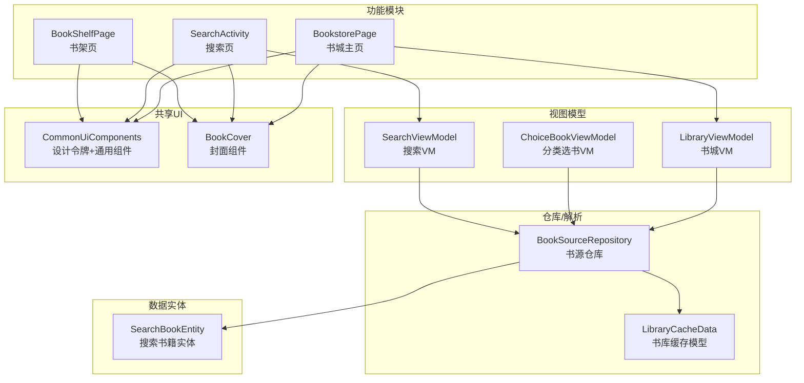
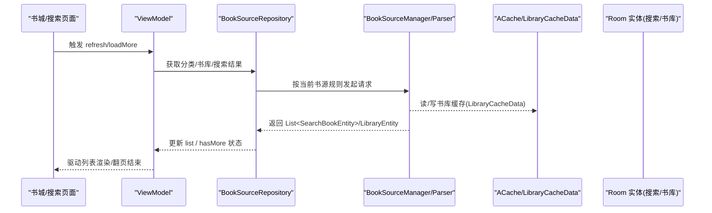
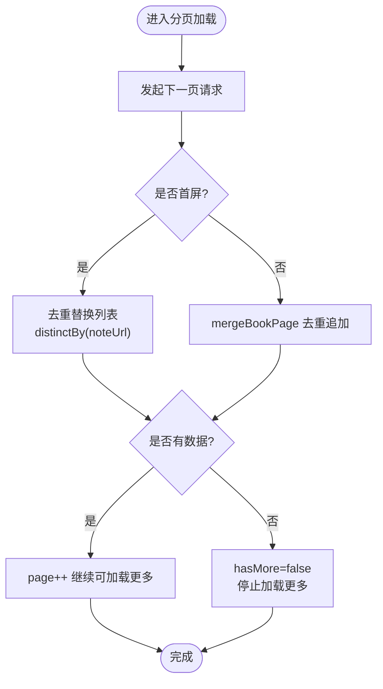
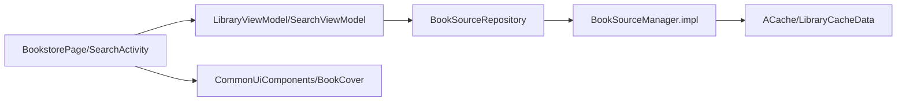

# 书城界面实现

<cite>
**本文引用的文件**
- [module_find/src/main/java/com/ebook/find/page/BookstorePage.kt](file://module_find/src/main/java/com/ebook/find/page/BookstorePage.kt)
- [module_find/src/main/java/com/ebook/find/mvvm/viewmodel/LibraryViewModel.kt](file://module_find/src/main/java/com/ebook/find/mvvm/viewmodel/LibraryViewModel.kt)
- [module_find/src/main/java/com/ebook/find/repository/BookSourceRepository.kt](file://module_find/src/main/java/com/ebook/find/repository/BookSourceRepository.kt)
- [module_find/src/main/java/com/ebook/find/entity/BookType.kt](file://module_find/src/main/java/com/ebook/find/entity/BookType.kt)
- [module_find/src/main/java/com/ebook/find/mvvm/viewmodel/SearchViewModel.kt](file://module_find/src/main/java/com/ebook/find/mvvm/viewmodel/SearchViewModel.kt)
- [module_find/src/main/java/com/ebook/find/SearchActivity.kt](file://module_find/src/main/java/com/ebook/find/SearchActivity.kt)
- [module_find/src/main/java/com/ebook/find/view/SearchBookItem.kt](file://module_find/src/main/java/com/ebook/find/view/SearchBookItem.kt)
- [module_book/src/main/java/com/ebook/book/page/BookShelfPage.kt](file://module_book/src/main/java/com/ebook/book/page/BookShelfPage.kt)
- [lib_book_common/src/main/java/com/ebook/common/ui/CommonUiComponents.kt](file://lib_book_common/src/main/java/com/ebook/common/ui/CommonUiComponents.kt)
- [lib_book_common/src/main/java/com/ebook/common/ui/BookCover.kt](file://lib_book_common/src/main/java/com/ebook/common/ui/BookCover.kt)
- [module_find/src/main/java/com/ebook/find/mvvm/viewmodel/BookPageMerge.kt](file://module_find/src/main/java/com/ebook/find/mvvm/viewmodel/BookPageMerge.kt)
- [lib_book_common/src/main/java/com/ebook/common/analyze/source/LibraryCacheData.kt](file://lib_book_common/src/main/java/com/ebook/common/analyze/source/LibraryCacheData.kt)
</cite>

## 目录
1. 引言
2. 项目结构
3. 核心组件
4. 架构总览
5. 组件详细分析
6. 依赖关系分析
7. 性能考虑
8. 故障排查指南
9. 结论
10. 附录

## 引言
本文档聚焦基于 Jetpack Compose 的“书城”模块，系统说明书城主页、搜索与书库浏览界面的布局、交互、数据流与分页机制，并给出无限滚动、响应式适配、加载/错误态处理等体验优化点。内容覆盖：
- 书城主页推荐区域、分类导航与热门榜单网格
- 关键词搜索、搜索历史管理、搜索结果展示
- 书库瀑布/卡片列表的下拉刷新与上拉加载更多
- 书籍卡片设计（封面、书名、作者、评分/字数、加入书架）
- 分页去重与内存管理、网络请求策略
- 不同屏幕下的自适应排版与可访问性

## 项目结构
书城界面集中在 find 模块，配合 lib_book_common 共享 UI 与设计常量，以及数据库实体层在 lib_ebook_db 中提供传输模型。

图示来源
- [module_find/src/main/java/com/ebook/find/page/BookstorePage.kt:70-113](file://module_find/src/main/java/com/ebook/find/page/BookstorePage.kt#L70-L113)
- [module_find/src/main/java/com/ebook/find/mvvm/viewmodel/LibraryViewModel.kt](file://module_find/src/main/java/com/ebook/find/mvvm/viewmodel/LibraryViewModel.kt)
- [module_find/src/main/java/com/ebook/find/repository/BookSourceRepository.kt:21-51](file://module_find/src/main/java/com/ebook/find/repository/BookSourceRepository.kt#L21-L51)
- [lib_book_common/src/main/java/com/ebook/common/ui/CommonUiComponents.kt:33-77](file://lib_book_common/src/main/java/com/ebook/common/ui/CommonUiComponents.kt#L33-L77)
- [lib_book_common/src/main/java/com/ebook/common/ui/BookCover.kt:11-41](file://lib_book_common/src/main/java/com/ebook/common/ui/BookCover.kt#L11-L41)

章节来源
- [module_find/src/main/java/com/ebook/find/page/BookstorePage.kt:70-113](file://module_find/src/main/java/com/ebook/find/page/BookstorePage.kt#L70-L113)
- [lib_book_common/src/main/java/com/ebook/common/ui/CommonUiComponents.kt:33-77](file://lib_book_common/src/main/java/com/ebook/common/ui/CommonUiComponents.kt#L33-L77)
- [module_book/src/main/java/com/ebook/book/page/BookShelfPage.kt:76-181](file://module_book/src/main/java/com/ebook/book/page/BookShelfPage.kt#L76-L181)

## 核心组件
- 书城主页（Compose）：使用 RefreshableList 作为下拉刷新容器；顶部 TopAppBar 标题；“书籍类型”胶囊分组 + 搜索入口 + 分类书籍区块。
- 搜索页：以 BaseMvvmRefreshActivity 壳承载自定义 HomePage，包含顶部搜索栏 + 结果列表 + 历史面板覆盖层；键盘弹起自动揭示历史，收起且未搜索则回退。
- 书架页：Scaffold + TopAppBar + RefreshableList；支持导入本地书与下载队列入口；条目点击跳转阅读、长按打开详情。

章节来源
- [module_find/src/main/java/com/ebook/find/page/BookstorePage.kt:70-113](file://module_find/src/main/java/com/ebook/find/page/BookstorePage.kt#L70-L113)
- [module_find/src/main/java/com/ebook/find/SearchActivity.kt:125-193](file://module_find/src/main/java/com/ebook/find/SearchActivity.kt#L125-L193)
- [module_book/src/main/java/com/ebook/book/page/BookShelfPage.kt:76-181](file://module_book/src/main/java/com/ebook/book/page/BookShelfPage.kt#L76-L181)

## 架构总览
书城采用 MVVM 分层：
- View：BookstorePage、SearchActivity（Composable 或 Activity 包装）、SearchBookItem、BookShelfPage。
- ViewModel：LibraryViewModel（书城）、SearchViewModel（搜索）、ChoiceBookViewModel（分类选书）。
- Repository：BookSourceRepository（统一书源读写）、SearchHistoryRepository（搜索历史）。
- 解析与缓存：JsoupBookParser 通过 BookSourceManager 提供书库/搜索/分类能力，LibraryCacheData 负责序列化到磁盘缓存。

图示来源
- [module_find/src/main/java/com/ebook/find/repository/BookSourceRepository.kt:21-51](file://module_find/src/main/java/com/ebook/find/repository/BookSourceRepository.kt#L21-L51)
- [lib_book_common/src/main/java/com/ebook/common/analyze/source/LibraryCacheData.kt:8-35](file://lib_book_common/src/main/java/com/ebook/common/analyze/source/LibraryCacheData.kt#L8-L35)
- [module_find/src/main/java/com/ebook/find/mvvm/viewmodel/ChoiceBookViewModel.kt:80-108](file://module_find/src/main/java/com/ebook/find/mvvm/viewmodel/ChoiceBookViewModel.kt#L80-L108)
- [module_find/src/main/java/com/ebook/find/mvvm/viewmodel/SearchViewModel.kt:129-166](file://module_find/src/main/java/com/ebook/find/mvvm/viewmodel/SearchViewModel.kt#L129-L166)

## 组件详细分析

### 书城主页（推荐/分类/搜索）
- 顶部工具栏：Material3 TopAppBar，颜色来自 surface 语义色。
- “书籍类型”分组标题 + 胶囊流式标签区：使用 FlowRow 将 BookType 列表转为 InfoChip 胶囊，点击通过 TheRouter 路由至分类选书页（携带 url/title 参数）。
- 搜索胶囊：全屏宽圆角条，点击跳转到搜索页。
- 分类书籍区块：LazyColumn 逐块渲染 LibraryKindBookListEntity，每块为分类名称 + 书籍列表项。
- 下拉刷新：封装于 RefreshableList；首次进入组合时 LaunchedEffect 触发刷新，经 MvvmBinder 映射到 VM 刷新信号。

布局要点
- 边距和间距取自 CommonUiTokens：pagePadding、sectionSpacing、cardCorner 等，保障一致的视觉节奏。
- 卡片与标题复用 CommonCard/SectionLabel，保持层级一致。

章节来源
- [module_find/src/main/java/com/ebook/find/page/BookstorePage.kt:70-113](file://module_find/src/main/java/com/ebook/find/page/BookstorePage.kt#L70-L113)
- [module_find/src/main/java/com/ebook/find/page/BookstorePage.kt:123-193](file://module_find/src/main/java/com/ebook/find/page/BookstorePage.kt#L123-L193)
- [module_find/src/main/java/com/ebook/find/entity/BookType.kt:3-17](file://module_find/src/main/java/com/ebook/find/entity/BookType.kt#L3-L17)
- [lib_book_common/src/main/java/com/ebook/common/ui/CommonUiComponents.kt:53-77](file://lib_book_common/src/main/java/com/ebook/common/ui/CommonUiComponents.kt#L53-L77)

### 分类选书与书库列表（下拉刷新、无限滚动）
- ChoiceBookViewModel：从 SavedStateHandle 读取分类 URL，初始化书架快照后自动刷新；首屏替换列表并按 noteUrl 去重；后续 page>1 合并新结果；没有新条目则置无更多。
- 书架页 BookShelfPage：同样以 RefreshableList 管理列表与刷新信号；条目项使用 CommonItemCard + BookCover 统一样式。

无限滚动机制
- 分页从 1 开始递增，仅在“本页有数据”时前进；mergeBookPage 用 noteUrl 去重，避免重复 key 导致 LazyColumn 异常；软 404（HTTP 200 但返回首页书目）场景下，仅靠空页无法判断到底，故需去重为空时才停止加载。
- 列表项使用 Stable Key（noteUrl），保证滚动动画稳定与正确识别 item。

章节来源
- [module_find/src/main/java/com/ebook/find/mvvm/viewmodel/ChoiceBookViewModel.kt:28-142](file://module_find/src/main/java/com/ebook/find/mvvm/viewmodel/ChoiceBookViewModel.kt#L28-L142)
- [module_find/src/main/java/com/ebook/find/mvvm/viewmodel/BookPageMerge.kt:5-23](file://module_find/src/main/java/com/ebook/find/mvvm/viewmodel/BookPageMerge.kt#L5-L23)
- [module_book/src/main/java/com/ebook/book/page/BookShelfPage.kt:106-181](file://module_book/src/main/java/com/ebook/book/page/BookShelfPage.kt#L106-L181)

### 搜索功能（关键词、历史、结果展示）
- SearchActivity：自定义 HomePage，包含搜索行、历史面板覆盖层、结果列表；键盘弹起自动显示历史，收起未搜索则退出；进入页面即加载历史并聚焦输入框，带“无键盘环境兜底”。
- SearchViewModel：维护书架快照与事件同步；发起搜索调用书源；first page 替换去重列表；后续合并；记录 durSearchKey 用于 loadMore；成功后关闭加载浮层并停止加载更多。
- 搜索历史：SearchHistoryRepository 提供 upsert、清理、查询；ViewModel 插入历史后自动刷新历史集合。

交互细节
- 清空历史：清理 BOOK 类型全部历史并向 successEvent 发射空集合，供 UI 刷新历史面板。
- 加入书架：调用 BookShelfManager.addFromSearch，失败走 toast，成功即时更新列表中“已加入”状态。

章节来源
- [module_find/src/main/java/com/ebook/find/SearchActivity.kt:97-193](file://module_find/src/main/java/com/ebook/find/SearchActivity.kt#L97-L193)
- [module_find/src/main/java/com/ebook/find/mvvm/viewmodel/SearchViewModel.kt:24-199](file://module_find/src/main/java/com/ebook/find/mvvm/viewmodel/SearchViewModel.kt#L24-L199)
- [module_find/src/main/java/com/ebook/find/repository/SearchHistoryRepository.kt:11-42](file://module_find/src/main/java/com/ebook/find/repository/SearchHistoryRepository.kt#L11-L42)

### 书籍卡片与封面
- SearchBookItem：条目卡使用 CommonItemCard，内含 BookCover（小圆角）、书名（titleSmall）、作者与来源标签（onSurfaceVariant）、InfoChip 的状态/分类/字数标签、最新章节或简介；右侧按钮“加入书架”，禁用态时文字切换。
- BookCover：统一封面加载组件， Coil AsyncImage，固定 ContentScale.Crop 防止变形，默认圆角 CommonUiTokens.coverCorner，自带占位与错误图。

章节来源
- [module_find/src/main/java/com/ebook/find/view/SearchBookItem.kt:33-156](file://module_find/src/main/java/com/ebook/find/view/SearchBookItem.kt#L33-L156)
- [lib_book_common/src/main/java/com/ebook/common/ui/BookCover.kt:11-41](file://lib_book_common/src/main/java/com/ebook/common/ui/BookCover.kt#L11-L41)

### 分页与去重算法

图示来源
- [module_find/src/main/java/com/ebook/find/mvvm/viewmodel/BookPageMerge.kt:5-23](file://module_find/src/main/java/com/ebook/find/mvvm/viewmodel/BookPageMerge.kt#L5-L23)
- [module_find/src/main/java/com/ebook/find/mvvm/viewmodel/ChoiceBookViewModel.kt:80-108](file://module_find/src/main/java/com/ebook/find/mvvm/viewmodel/ChoiceBookViewModel.kt#L80-L108)
- [module_find/src/main/java/com/ebook/find/mvvm/viewmodel/SearchViewModel.kt:138-166](file://module_find/src/main/java/com/ebook/find/mvvm/viewmodel/SearchViewModel.kt#L138-L166)

## 依赖关系分析
- 页面 -> ViewModel：Hilt 注入 viewModel（如 hiltViewModel()）。
- ViewModel -> Repository：通过构造函数注入，执行 IO 线程工作。
- Repository -> 书源解析器：BookSourceManager.requireParser()，内部根据当前书源规则抓取数据，并读写 ACache 中的 LibraryCacheData 进行书库缓存。
- 页面 -> 共享 UI：复用 CommonUiComponents 的设计常量与通用卡片组件，确保跨模块一致性。

图示来源
- [module_find/src/main/java/com/ebook/find/page/BookstorePage.kt:70-113](file://module_find/src/main/java/com/ebook/find/page/BookstorePage.kt#L70-L113)
- [module_find/src/main/java/com/ebook/find/mvvm/viewmodel/SearchViewModel.kt:31-36](file://module_find/src/main/java/com/ebook/find/mvvm/viewmodel/SearchViewModel.kt#L31-L36)
- [module_find/src/main/java/com/ebook/find/repository/BookSourceRepository.kt:21-51](file://module_find/src/main/java/com/ebook/find/repository/BookSourceRepository.kt#L21-L51)
- [lib_book_common/src/main/java/com/ebook/common/analyze/source/LibraryCacheData.kt:8-35](file://lib_book_common/src/main/java/com/ebook/common/analyze/source/LibraryCacheData.kt#L8-L35)

章节来源
- [module_find/src/main/java/com/ebook/find/repository/BookSourceRepository.kt:21-51](file://module_find/src/main/java/com/ebook/find/repository/BookSourceRepository.kt#L21-L51)

## 性能考虑
- 列表渲染优化
  - 使用 LazyColumn/LazyRow 延迟渲染可见项，降低首屏压力。
  - 以 noteUrl 作为稳定 key，减少重组与滚动抖动。
- 分页与内存
  - 仅在成功拉取到数据时递增页码，避免越页导致无效请求。
  - mergeBookPage 基于 noteUrl 去重，避免重复键抛异常与冗余渲染。
- 图片加载
  - BookCover 固定 Crop 缩放模式避免拉伸，内置占位与错误图减少空白闪烁。
- 缓存
  - 书库数据通过 LibraryCacheData 与 ACache 缓存，减轻重复请求开销。
- 网络
  - 分类/搜索请求经 BookSourceRepository 统一调度；失败路径关闭加载态并重置加载更多状态。

[本节不直接分析具体代码段]

## 故障排查指南
- 列表永远加载不出：检查网络配置、接口契约是否与 mock 资产一致；确认 page 起始值与模板是否包含 {{page}}；若站点出现软 404，确认去重逻辑生效。
- 重复条目异常：LazyColumn 的 item key（noteUrl）必须唯一，注意分页去重 mergeBookPage 与首屏 distinctBy 是否被跳过。
- 历史记录不刷新：确认 Insert/Clean 之后是否触发了 querySearchHistory，或 successEvent 是否能被 UI 订阅。
- 书架状态不一致：检查 BookShelfManager.markShelfStatus 是否在请求完成后调用；书架事件 BookShelfEvent 是否能在 VM 中及时 update 列表项 add 标记。
- 主题/尺寸异常：所有圆角与间距应引用 CommonUiTokens；封面尺寸由调用方决定但建议遵守条目内默认尺寸约定，避免溢出。

章节来源
- [module_find/src/main/java/com/ebook/find/mvvm/viewmodel/SearchViewModel.kt:81-118](file://module_find/src/main/java/com/ebook/find/mvvm/viewmodel/SearchViewModel.kt#L81-L118)
- [module_find/src/main/java/com/ebook/find/view/SearchBookItem.kt:44-138](file://module_find/src/main/java/com/ebook/find/view/SearchBookItem.kt#L44-L138)
- [lib_book_common/src/main/java/com/ebook/common/ui/CommonUiComponents.kt:53-77](file://lib_book_common/src/main/java/com/ebook/common/ui/CommonUiComponents.kt#L53-L77)

## 结论
书城界面以 Compose 为核心，结合 Hilt 与 MVVM 组织清晰的分层。书城主页提供类型分组与搜索入口；分类页与搜索页共用分页合并逻辑保障稳定的无限滚动体验；统一的设计令牌与通用组件保障跨模块的一致性。通过笔记地址去重、缓存与协程 Flow，系统在多端与大列表场景下兼顾了性能与可靠性。

[本节不直接分析具体代码段]

## 附录

### 关键类与方法一览
- 页面
  - BookstorePage：书城主页组合函数（顶部 AppBar、分类胶囊、搜索条、分类区块）
  - SearchActivity：搜索页宿主与历史面板（键盘联动、历史开合）
  - BookShelfPage：书架页与入口行为
- 视图模型
  - LibraryViewModel：书城列表刷新与加载
  - ChoiceBookViewModel：分类选书页的分页加载
  - SearchViewModel：搜索、历史、书架同步
- 仓库与解析
  - BookSourceRepository：分类、书库、搜索数据的 IO 封装
  - LibraryCacheData：书库数据的序列化/反序列化
- 共享 UI
  - CommonUiComponents：卡片、分割线、标签等通用组件与设计常量
  - BookCover：统一的封面加载组件

章节来源
- [module_find/src/main/java/com/ebook/find/page/BookstorePage.kt:70-193](file://module_find/src/main/java/com/ebook/find/page/BookstorePage.kt#L70-L193)
- [module_find/src/main/java/com/ebook/find/SearchActivity.kt:125-193](file://module_find/src/main/java/com/ebook/find/SearchActivity.kt#L125-L193)
- [module_book/src/main/java/com/ebook/book/page/BookShelfPage.kt:76-181](file://module_book/src/main/java/com/ebook/book/page/BookShelfPage.kt#L76-L181)
- [module_find/src/main/java/com/ebook/find/mvvm/viewmodel/SearchViewModel.kt:24-199](file://module_find/src/main/java/com/ebook/find/mvvm/viewmodel/SearchViewModel.kt#L24-L199)
- [module_find/src/main/java/com/ebook/find/mvvm/viewmodel/ChoiceBookViewModel.kt:28-142](file://module_find/src/main/java/com/ebook/find/mvvm/viewmodel/ChoiceBookViewModel.kt#L28-L142)
- [module_find/src/main/java/com/ebook/find/repository/BookSourceRepository.kt:21-51](file://module_find/src/main/java/com/ebook/find/repository/BookSourceRepository.kt#L21-L51)
- [lib_book_common/src/main/java/com/ebook/common/analyze/source/LibraryCacheData.kt:8-35](file://lib_book_common/src/main/java/com/ebook/common/analyze/source/LibraryCacheData.kt#L8-L35)
- [lib_book_common/src/main/java/com/ebook/common/ui/CommonUiComponents.kt:33-77](file://lib_book_common/src/main/java/com/ebook/common/ui/CommonUiComponents.kt#L33-L77)
- [lib_book_common/src/main/java/com/ebook/common/ui/BookCover.kt:11-41](file://lib_book_common/src/main/java/com/ebook/common/ui/BookCover.kt#L11-L41)