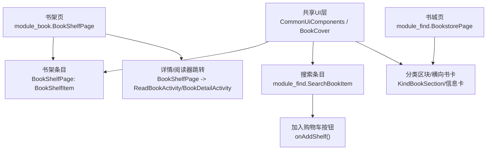
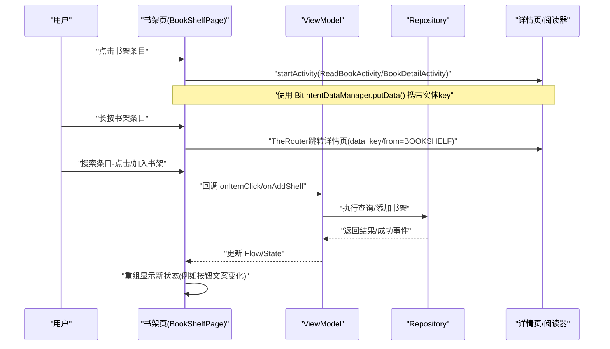
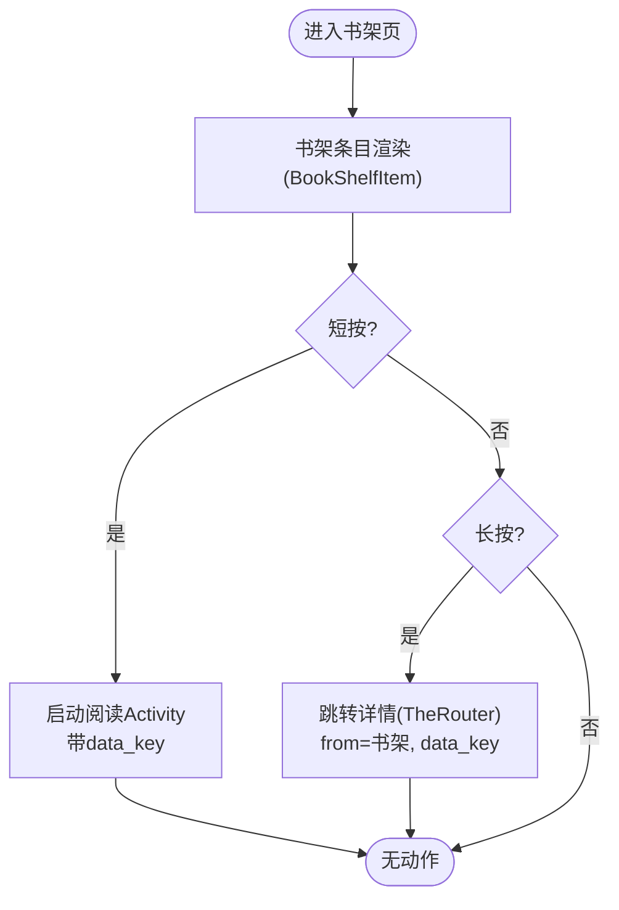
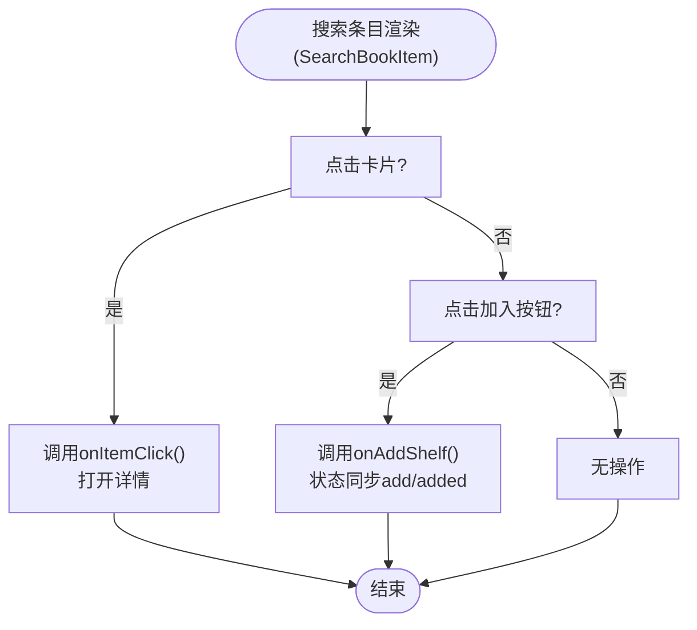
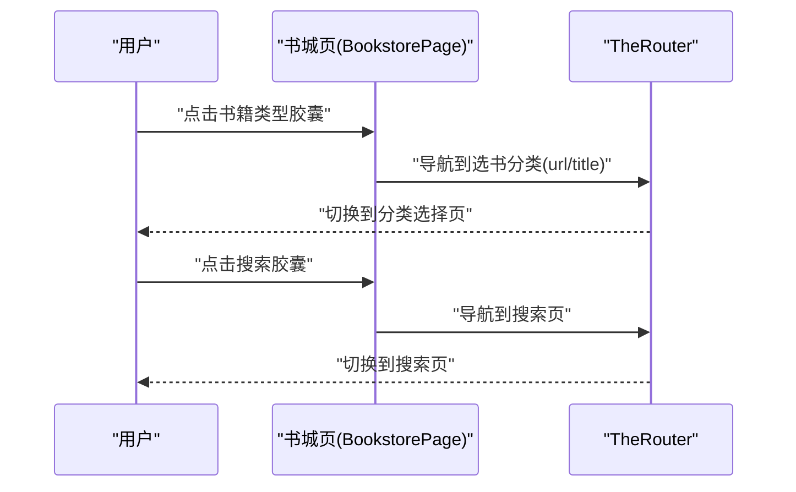

# 书籍卡片交互

<cite>
**本文引用的文件**
- [BookShelfPage.kt](file://module_book/src/main/java/com/ebook/book/page/BookShelfPage.kt)
- [CommonUiComponents.kt](file://lib_book_common/src/main/java/com/ebook/common/ui/CommonUiComponents.kt)
- [SearchBookItem.kt](file://module_find/src/main/java/com/ebook/find/view/SearchBookItem.kt)
- [BookstorePage.kt](file://module_find/src/main/java/com/ebook/find/page/BookstorePage.kt)
- [BookCover.kt](file://lib_book_common/src/main/java/com/ebook/common/ui/BookCover.kt)
- [BookDetailActivity.kt](file://module_book/src/main/java/com/ebook/book/BookDetailActivity.kt)
</cite>

## 目录
1. [简介](#简介)
2. [项目结构与范围](#项目结构与范围)
3. [核心组件概览](#核心组件概览)
4. [架构与数据流总览](#架构与数据流总览)
5. [详细组件分析](#详细组件分析)
   - [书架条目：点击与长按](#书架条目点击与长按)
   - [搜索结果条目：点击与快速操作](#搜索结果条目点击与快速操作)
   - [书城页面横向书卡：点击导航](#书城页面横向书卡点击导航)
6. [收藏（书架）交互与状态](#收藏书架交互与状态)
7. [手势与滑动手势现状](#手势与滑动手势现状)
8. [视觉反馈机制](#视觉反馈机制)
9. [多场景适配说明](#多场景适配说明)
10. [可定制与扩展点](#可定制与扩展点)
11. [无障碍与触摸友好性](#无障碍与触摸友好性)
12. [性能考量](#性能考量)
13. [故障排查](#故障排查)
14. [结论](#结论)

## 简介
本文件聚焦书城与书架场景中的“书籍卡片”交互模式，结合当前代码实现，给出以下内容的系统化说明：
- 点击行为：详情页跳转、快速预览、列表内一键操作
- 收藏（加入书架/移除书架）的交互与状态反馈
- 滑动手势现状与后续可扩展方向
- 视觉反馈：涟漪、禁用态、阴影与圆角一致化设计语言
- 多视图适配：列表、网格/流式标签、横向大图的差异实现
- 可定制性与扩展方式：通过共享组件参数与回调注入扩展
- 无障碍与触摸友好性实践

## 项目结构与范围
本项目基于 Compose 统一 UI 体系，卡片相关逻辑主要位于：
- 共享 UI 组件（形状、颜色、点击面、涟漪、阴影等）：lib_book_common/ui
- 书架列表与条目：module_book 的 BookShelfPage
- 搜索列表与结果条目：module_find 的 SearchBookItem
- 书城内容容器与分类区块：module_find 的 BookstorePage



图示来源
- [BookShelfPage.kt:150-180](file://module_book/src/main/java/com/ebook/book/page/BookShelfPage.kt#L150-L180)
- [SearchBookItem.kt:45-139](file://module_find/src/main/java/com/ebook/find/view/SearchBookItem.kt#L45-L139)
- [BookstorePage.kt:123-194](file://module_find/src/main/java/com/ebook/find/page/BookstorePage.kt#L123-L194)
- [CommonUiComponents.kt:85-146](file://lib_book_common/src/main/java/com/ebook/common/ui/CommonUiComponents.kt#L85-L146)
- [BookCover.kt:26-41](file://lib_book_common/src/main/java/com/ebook/common/ui/BookCover.kt#L26-L41)

章节来源
- [BookShelfPage.kt:67-180](file://module_book/src/main/java/com/ebook/book/page/BookShelfPage.kt#L67-L180)
- [SearchBookItem.kt:33-139](file://module_find/src/main/java/com/ebook/find/view/SearchBookItem.kt#L33-L139)
- [BookstorePage.kt:62-194](file://module_find/src/main/java/com/ebook/find/page/BookstorePage.kt#L62-L194)
- [CommonUiComponents.kt:47-146](file://lib_book_common/src/main/java/com/ebook/common/ui/CommonUiComponents.kt#L47-L146)
- [BookCover.kt:11-41](file://lib_book_common/src/main/java/com/ebook/common/ui/BookCover.kt#L11-L41)

## 核心组件概览
- CommonItemCard：统一的条目容器，负责 12dp 圆角、surfaceContainer 语义色、轻阴影以及点击面（ripple）。支持点击与长按共存。用于书架条目和搜索条目。
- CommonCard：分组级容器，16dp 圆角 + surfaceContainer + 轻阴影，用于将一组条目或区块包裹起来。
- BookCover：封面展示统一封装，使用 Coil 加载封面图并自动处理占位图与错误图，默认固定 ContentScale.Crop 避免拉伸变形。
- InfoChip：信息小标签，用于“类型/字数/来源”等元信息，胶囊形态由调用方控制圆角。
- SectionLabel / CommonListItem：用于模块内部的菜单或设置项，不在本书卡片主流程中，但复用同一套设计词法。

章节来源
- [CommonUiComponents.kt:85-146](file://lib_book_common/src/main/java/com/ebook/common/ui/CommonUiComponents.kt#L85-L146)
- [BookCover.kt:11-41](file://lib_book_common/src/main/java/com/ebook/common/ui/BookCover.kt#L11-L41)

## 架构与数据流总览
书架与搜索列表的交互遵循 MVVM + StateFlow 驱动：
- ViewModel 暴露 Flow/List<State>，页面以 collectAsState 订阅数据变化。
- 点击事件在页面层触发路由或 Repository 调用，再由 ViewModel 更新状态，界面重组显示新结果。
- 详情入口通过 TheRouter 传递 data_key，并在详情页根据来源区分是否拉取网络数据。



图示来源
- [BookShelfPage.kt:160-176](file://module_book/src/main/java/com/ebook/book/page/BookShelfPage.kt#L160-L176)
- [BookDetailActivity.kt:71-91](file://module_book/src/main/java/com/ebook/book/BookDetailActivity.kt#L71-L91)
- [SearchBookItem.kt:45-139](file://module_find/src/main/java/com/ebook/find/view/SearchBookItem.kt#L45-L139)

章节来源
- [BookShelfPage.kt:160-176](file://module_book/src/main/java/com/ebook/book/page/BookShelfPage.kt#L160-L176)
- [BookDetailActivity.kt:53-122](file://module_book/src/main/java/com/ebook/book/BookDetailActivity.kt#L53-L122)
- [SearchBookItem.kt:45-139](file://module_find/src/main/java/com/ebook/find/view/SearchBookItem.kt#L45-L139)

## 详细组件分析

### 书架条目：点击与长按
- 单击：打开阅读器，通过 Intent 携带 data_key。
- 长按：跳转到详情页，并通过 TheRouter 携带 from=书架来源与 data_key。
- 卡片容器：CommonItemCard 同时承载点击与长按；启用 combinedClickable 以保证长按手势不被吞掉。
- 列表组织：LazyColumn 按 key={it.noteUrl} 稳定渲染，避免重复导致异常。



图示来源
- [BookShelfPage.kt:164-176](file://module_book/src/main/java/com/ebook/book/page/BookShelfPage.kt#L164-L176)
- [BookShelfPage.kt:211-217](file://module_book/src/main/java/com/ebook/book/page/BookShelfPage.kt#L211-L217)
- [CommonUiComponents.kt:114-146](file://lib_book_common/src/main/java/com/ebook/common/ui/CommonUiComponents.kt#L114-L146)

章节来源
- [BookShelfPage.kt:189-317](file://module_book/src/main/java/com/ebook/book/page/BookShelfPage.kt#L189-L317)
- [CommonUiComponents.kt:100-146](file://lib_book_common/src/main/java/com/ebook/common/ui/CommonUiComponents.kt#L100-L146)

### 搜索结果条目：点击与快速操作
- 点击条目：传入 onItemClick（上层通常打开书籍详情）。
- 右上角“加入/已加入”按钮：立即执行 onAddShelf，状态受 searchBook.add 控制，按钮文本在“加入/已加入”间切换。
- 卡片结构：左侧封面（小圆角）、中部信息（书名、作者、来源）、标签行（状态/分类/字数），底部为最新章节或简介。
- 容器行为：通过 CommonItemCard 提供点击与涟漪效果，所有元素处于同一卡片命中区域，便于整体点击导航。



图示来源
- [SearchBookItem.kt:45-139](file://module_find/src/main/java/com/ebook/find/view/SearchBookItem.kt#L45-L139)

章节来源
- [SearchBookItem.kt:33-139](file://module_find/src/main/java/com/ebook/find/view/SearchBookItem.kt#L33-L139)

### 书城页面横向书卡：点击导航
- 书城采用分类+块状布局，顶部有“书籍类型”流式标签胶囊。
- 分类点击后通过 TheRouter 传 url/title 到选择书库页。
- 块内的分类卡片使用 CommonCard + FlowRow 排列 InfoChip 胶囊形态。
- 搜索快捷入口以胶囊条形式出现，点击跳转到搜索页。



图示来源
- [BookstorePage.kt:123-194](file://module_find/src/main/java/com/ebook/find/page/BookstorePage.kt#L123-L194)
- [BookstorePage.kt:156-165](file://module_find/src/main/java/com/ebook/find/page/BookstorePage.kt#L156-L165)

章节来源
- [BookstorePage.kt:62-194](file://module_find/src/main/java/com/ebook/find/page/BookstorePage.kt#L62-L194)

## 收藏（书架）交互与状态
- 书架点击：直接进入阅读器；长按进入详情页。
- 详情中“加入书架”：当不在书架时调用 addToBookShelf；若在书架则调用 removeFromBookShelf，完成收藏状态切换。
- 搜索条目按钮：searchBook.add 为 true 时按钮禁用并显示“已加入”，否则启用并显示“加入”。

```mermaid
stateDiagram-v2
  [*] --> 未收藏
  未收藏 --> 已收藏 : "点击'加入书架'"
  已收藏 --> 未收藏 : "点击'从书架移除'"
  未收藏 -.-> 未收藏 : "重复点击加入"
  已收藏 -.-> 已收藏 : "重复点击移除"
```

图示来源
- [BookDetailActivity.kt:107-113](file://module_book/src/main/java/com/ebook/book/BookDetailActivity.kt#L107-L113)
- [SearchBookItem.kt:118-139](file://module_find/src/main/java/com/ebook/find/view/SearchBookItem.kt#L118-L139)

章节来源
- [BookDetailActivity.kt:93-122](file://module_book/src/main/java/com/ebook/book/BookDetailActivity.kt#L93-L122)
- [SearchBookItem.kt:118-139](file://module_find/src/main/java/com/ebook/find/view/SearchBookItem.kt#L118-L139)

## 手势与滑动手势现状
- 目前源码中未发现滑动删除（SwipeToDelete）、侧滑菜单（Drawer/Swipeable）等通用滑动手势用于书架条目或搜索条目。
- 书架/搜索条目主要依赖：
  - 单击：跳转阅读器/详情或执行快速操作
  - 长按：进入详情页
- 未来扩展建议：
  - 如需“滑出编辑菜单”，可在条目外层叠加 swipeable 容器，配合 SideEffect 管理状态与动画。
  - “滑动删除”可与现有长按删除路径合并：先确认再异步执行删除，随后刷新列表。
  - 为避免与页面滚动冲突，建议在条目级别捕获横向滑动阈值后再拦截，纵向仍交由 LazyColumn 处理。

本节为概念性讨论，不直接映射到具体文件。

## 视觉反馈机制
- 涟漪效果：所有可点击区域均通过 CommonItemCard.clickable/combinedClickable 挂载，涟漪随圆角裁剪，确保卡片边缘也产生一致反馈。
- 圆角层级：分组卡 16dp，条目卡 12dp，芯片/封面分别为 4dp/10dp，形成统一设计层次。
- 阴影层级：CommonCard/CommonItemCard 默认 1dp 阴影，下拉密集列表中可调整为 0dp 减少视觉堆叠感（已在解析占位条目中体现 shadowElevation = 0）。
- 文本与信息层级：标题使用 typography.titleMedium/Small，副信息与 Chip 弱化颜色，保证可读性与层次感。
- 封面缩放：BookCover 强制 Crop，避免非 3:4 比例封面拉伸变形。

章节来源
- [CommonUiComponents.kt:85-146](file://lib_book_common/src/main/java/com/ebook/common/ui/CommonUiComponents.kt#L85-L146)
- [CommonUiComponents.kt:47-77](file://lib_book_common/src/main/java/com/ebook/common/ui/CommonUiComponents.kt#L47-L77)
- [BookCover.kt:11-41](file://lib_book_common/src/main/java/com/ebook/common/ui/BookCover.kt#L11-L41)

## 多场景适配说明
- 列表视图：书架使用 LazyColumn，搜索列表也在各自页面采用垂直列表（搜索页以卡片条目呈现）。
- 网格/流式：书城“书籍类型”以 FlowRow 流式排布胶囊标签，替代旧的硬编码网格，防止长文本被截断。
- 大图/横幅：书架条目封面尺寸 72x105，搜索结果 60x90，均通过 BookCover 统一裁剪；封面始终居中裁切填充，保持观感稳定。
- 响应空间：页面内边距与间距统一引用 CommonUiTokens.pagePadding/listSpacing/sectionSpacing，保证横竖屏一致性。

章节来源
- [BookstorePage.kt:148-168](file://module_find/src/main/java/com/ebook/find/page/BookstorePage.kt#L148-L168)
- [SearchBookItem.kt:51-59](file://module_find/src/main/java/com/ebook/find/view/SearchBookItem.kt#L51-L59)
- [BookShelfPage.kt:211-217](file://module_book/src/main/java/com/ebook/book/page/BookShelfPage.kt#L211-L217)

## 可定制与扩展点
- 卡片容器：CommonItemCard 支持自定义 onClick/onLongClick/enabled/shadowElevation/contentPadding，满足不同列表密度与层级需求。
- 图标/色彩：InfoChip 可组合多种元信息标签；如需强调某类信息，可在调用方为其设置背景色或权重。
- 导航路由：通过 TheRouter 传递关键字段，跨模块导航不耦合具体页面实现。
- 数据绑定：页面对接 ViewModel/Flow，易于接入批量操作、筛选、排序等新能力。
- 图片处理：BookCover 的 shape 可调整圆角；需要边框时可由调用方用 Surface/Card 包一层。

章节来源
- [CommonUiComponents.kt:114-146](file://lib_book_common/src/main/java/com/ebook/common/ui/CommonUiComponents.kt#L114-L146)
- [BookCover.kt:26-41](file://lib_book_common/src/main/java/com/ebook/common/ui/BookCover.kt#L26-L41)
- [BookShelfPage.kt:164-176](file://module_book/src/main/java/com/ebook/book/page/BookShelfPage.kt#L164-L176)

## 无障碍与触摸友好性
- 点击命中区：整个卡片为可点击区域，提高触摸命中率。
- contentDescription：封面组件传入有意义的描述文本，辅助读屏识别。
- 字体与对比度：统一 Material typography，语义色保障明暗模式下的可读性。
- 键盘/焦点：Compose 默认会生成合适的焦点规则；如需特殊交互（如列表焦点顺序），可在调用方补充焦点顺序配置。

章节来源
- [BookCover.kt:26-41](file://lib_book_common/src/main/java/com/ebook/common/ui/BookCover.kt#L26-L41)
- [SearchBookItem.kt:51-59](file://module_find/src/main/java/com/ebook/find/view/SearchBookItem.kt#L51-L59)

## 性能考量
- 列表键值稳定：列表以 noteUrl/id 作为 item key，避免重渲染与异常。
- 图片加载优化：BookCover 使用 Coil，失败时使用占位图，避免空白闪烁。
- 格式化对象复用：搜索列表对字数字符串格式化使用顶层单例 DecimalFormat，避免在每次组合中频繁创建高成本对象（在主线程内使用）。
- 按需组装：卡片内容仅在数据变化时重组，降低无效绘制。

章节来源
- [SearchBookItem.kt:141-156](file://module_find/src/main/java/com/ebook/find/view/SearchBookItem.kt#L141-L156)
- [BookShelfPage.kt:211-217](file://module_book/src/main/java/com/ebook/book/page/BookShelfPage.kt#L211-L217)
- [BookCover.kt:26-41](file://lib_book_common/src/main/java/com/ebook/common/ui/BookCover.kt#L26-L41)

## 故障排查
- 详情页空白/无法阅读：检查从列表传入的 data_key 是否在详情页正确解码，确保 BitIntentDataManager 存取正常且数据未提前清理。
- 加入书架无反应：确认按钮 enabled 状态是否与 add 字段同步；观察 onAddShelf 回调是否被正确调用。
- 封面显示异常：校验 url 是否为空或不合法；必要时使用占位图兜底，并确保 image model 为空时的降级处理生效。
- 点击无效：确认条目未处于 disabled 状态，且 clickable/combinedClickable 未被父容器覆盖。

章节来源
- [BookShelfPage.kt:164-176](file://module_book/src/main/java/com/ebook/book/page/BookShelfPage.kt#L164-L176)
- [SearchBookItem.kt:118-139](file://module_find/src/main/java/com/ebook/find/view/SearchBookItem.kt#L118-L139)
- [BookCover.kt:26-41](file://lib_book_common/src/main/java/com/ebook/common/ui/BookCover.kt#L26-L41)

## 结论
当前项目的书籍卡片交互遵循统一的共享组件与 MVVM 状态驱动模式：
- 交互主轴：点击→跳转（阅读器/详情/快速操作），长按→详情
- 收藏链路：详情内切换“加入书架/移除书架”，搜索条目支持一键加入
- 视觉层：一致的圆角、阴影、语义色与涟漪反馈，封面稳定裁剪
- 滑动手势：暂未实现，可作为后续扩展方向（侧滑菜单/滑动删除）
- 扩展性：通过 CommonItemCard 回调、BookCover 样式与路由参数即可低成本定制