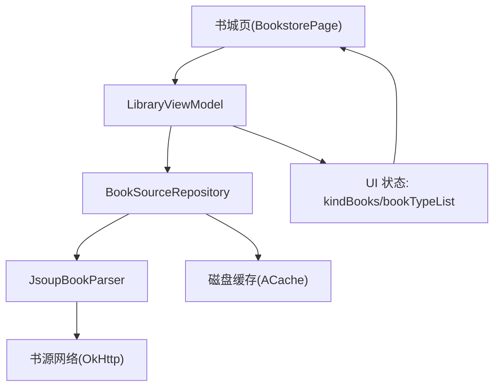
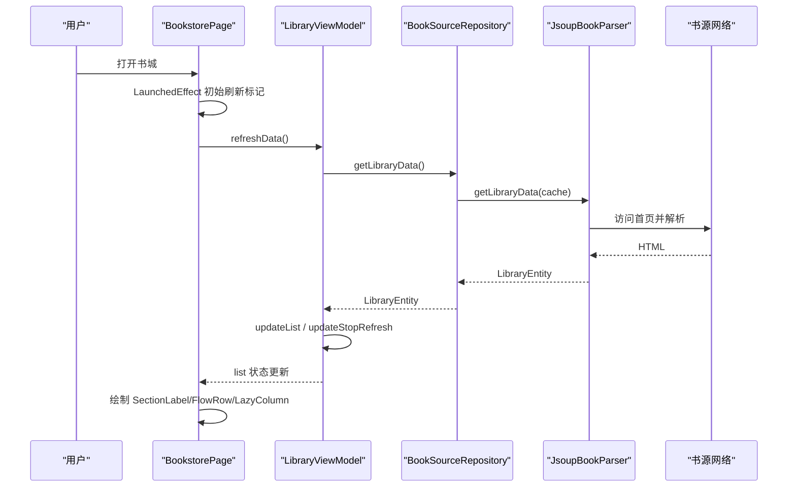
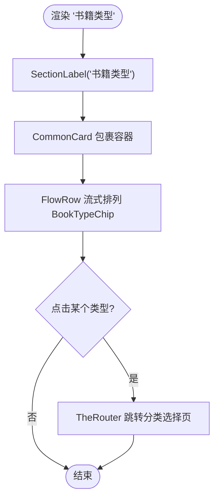
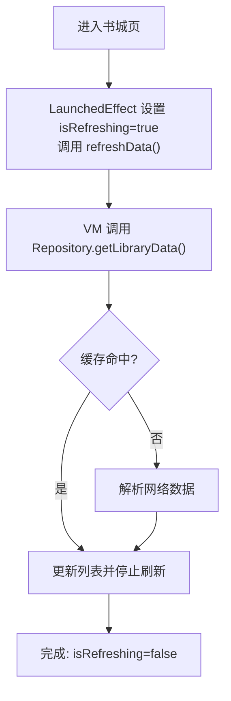
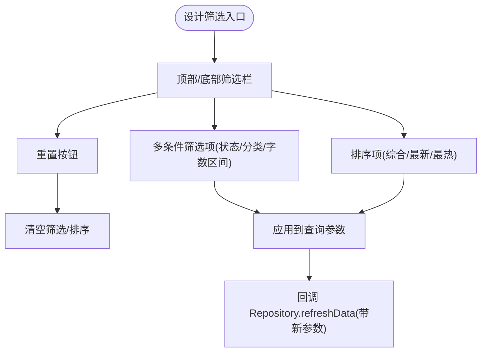
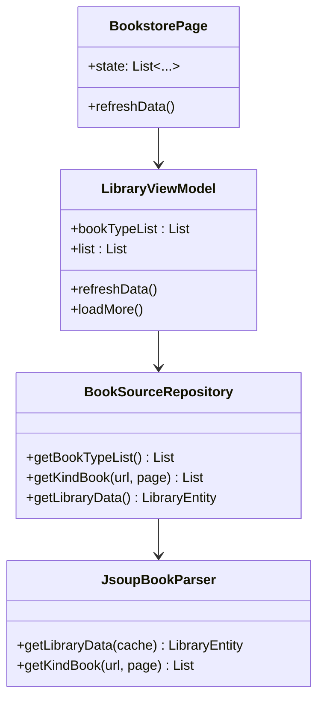
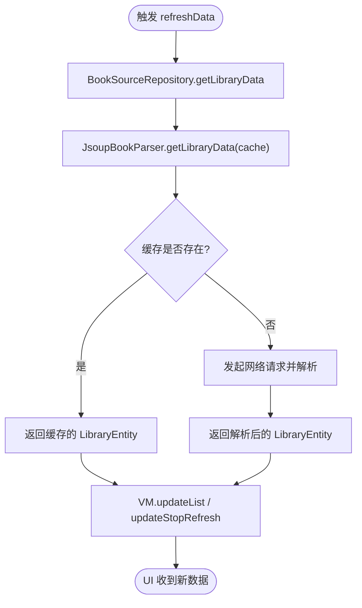
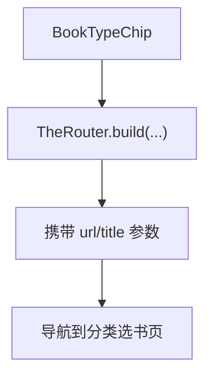
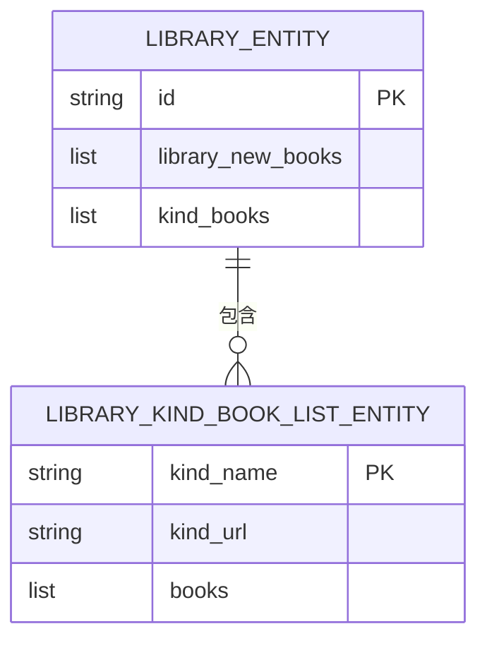

# 分类界面实现

<cite>
**本文引用的文件列表**
- [BookstorePage.kt](file://module_find/src/main/java/com/ebook/find/page/BookstorePage.kt)
- [LibraryViewModel.kt](file://module_find/src/main/java/com/ebook/find/mvvm/viewmodel/LibraryViewModel.kt)
- [BookSourceRepository.kt](file://module_find/src/main/java/com/ebook/find/repository/BookSourceRepository.kt)
- [JsoupBookParser.kt](file://lib_book_common/src/main/java/com/ebook/common/analyze/source/JsoupBookParser.kt)
- [CommonUiComponents.kt](file://lib_book_common/src/main/java/com/ebook/common/ui/CommonUiComponents.kt)
- [LibraryEntity.kt](file://lib_ebook_db/src/main/java/com/ebook/db/entity/LibraryEntity.kt)
- [LibraryKindBookListEntity.kt](file://lib_ebook_db/src/main/java/com/ebook/db/entity/LibraryKindBookListEntity.kt)
- [SearchBookItem.kt](file://module_find/src/main/java/com/ebook/find/view/SearchBookItem.kt)
</cite>

## 目录
1. [简介](#简介)
2. [项目结构](#项目结构)
3. [核心组件](#核心组件)
4. [架构总览](#架构总览)
5. [详细组件分析](#详细组件分析)
6. [依赖关系分析](#依赖关系分析)
7. [性能与体验优化](#性能与体验优化)
8. [常见问题排查](#常见问题排查)
9. [结论](#结论)
10. [附录：关键流程图](#附录：关键流程图)

## 简介
本文件聚焦“书城分类界面”的实现，覆盖分类导航展示、卡片流布局、分页刷新反馈与筛选排序的设计思路。基于当前代码库，该页面由 Compose + MVVM 实现，顶层为 FlowRow+LazyColumn 的混合排版，数据通过 BookSourceRepository → JsoupBookParser 拉取并解析后进入 UI；复用 lib_book_common 的共享设计语言（Card/Chip/SectionLabel/BookCover）保证视觉一致性。

## 项目结构
- 模块归属：find 模块负责书城/搜索相关入口与数据拼装，lib_book_common 提供通用 UI 与书源解析能力，lib_ebook_db 提供内存传输模型。
- 分层职责：
  - UI（Compose）：顶部应用栏、类型胶囊流、分类书籍区块
  - 状态与交互：LibraryViewModel 管理刷新与“加载更多”等基础状态
  - 数据仓库：BookSourceRepository 封装书源请求与缓存
  - 解析器：JsoupBookParser 根据 JSON 规则从网页抓取书库与分类图书

图表来源
- [BookstorePage.kt:71-113](file://module_find/src/main/java/com/ebook/find/page/BookstorePage.kt#L71-L113)
- [LibraryViewModel.kt:18-49](file://module_find/src/main/java/com/ebook/find/mvvm/viewmodel/LibraryViewModel.kt#L18-L49)
- [BookSourceRepository.kt:21-50](file://module_find/src/main/java/com/ebook/find/repository/BookSourceRepository.kt#L21-L50)
- [JsoupBookParser.kt:196-215](file://lib_book_common/src/main/java/com/ebook/common/analyze/source/JsoupBookParser.kt#L196-L215)

章节来源
- [BookstorePage.kt:62-194](file://module_find/src/main/java/com/ebook/find/page/BookstorePage.kt#L62-L194)
- [LibraryViewModel.kt:1-49](file://module_find/src/main/java/com/ebook/find/mvvm/viewmodel/LibraryViewModel.kt#L1-L49)
- [BookSourceRepository.kt:16-50](file://module_find/src/main/java/com/ebook/find/repository/BookSourceRepository.kt#L16-L50)

## 核心组件
- 书城页面（BookstorePage）：使用 RefreshableList 容器包裹 LazyColumn，首屏自动刷新，提供下拉刷新信号，暂时不启用“加载更多”。
- ViewModel（LibraryViewModel）：承载分类入口 bookTypeList 与书库 list，刷新逻辑调用 Repository 获取 LibraryEntity。
- 数据仓库（BookSourceRepository）：从 BookSourceManager 获取解析器，统一返回分类/书库数据，处理 IO 线程与 ACache 缓存。
- 解析器（JsoupBookParser）：以 JSON 规则驱动，解析首页书库与分类书列表，内置缓存读取与失效策略。
- 共享组件（CommonUiComponents）：SectionLabel、CommonCard、InfoChip、BookCover、CommonItemCard 等统一设计与尺寸常量。

章节来源
- [BookstorePage.kt:71-194](file://module_find/src/main/java/com/ebook/find/page/BookstorePage.kt#L71-L194)
- [LibraryViewModel.kt:18-49](file://module_find/src/main/java/com/ebook/find/mvvm/viewmodel/LibraryViewModel.kt#L18-L49)
- [BookSourceRepository.kt:21-50](file://module_find/src/main/java/com/ebook/find/repository/BookSourceRepository.kt#L21-L50)
- [JsoupBookParser.kt:196-215](file://lib_book_common/src/main/java/com/ebook/common/analyze/source/JsoupBookParser.kt#L196-L215)
- [CommonUiComponents.kt:53-77](file://lib_book_common/src/main/java/com/ebook/common/ui/CommonUiComponents.kt#L53-L77)

## 架构总览
书城分类界面的关键流程：进入页面 → 首次自动刷新 → ViewModel 发起请求 → Repository 调用解析器 → 解析器拉取网络并返回 LibraryEntity → VM 更新 list → UI 用 SectionLabel + CommonCard + FlowRow + LazyColumn 渲染分类与条目。

图表来源
- [BookstorePage.kt:87-112](file://module_find/src/main/java/com/ebook/find/page/BookstorePage.kt#L87-L112)
- [LibraryViewModel.kt:25-43](file://module_find/src/main/java/com/ebook/find/mvvm/viewmodel/LibraryViewModel.kt#L25-L43)
- [BookSourceRepository.kt:47-50](file://module_find/src/main/java/com/ebook/find/repository/BookSourceRepository.kt#L47-L50)
- [JsoupBookParser.kt:196-215](file://lib_book_common/src/main/java/com/ebook/common/analyze/source/JsoupBookParser.kt#L196-L215)

## 详细组件分析

### 1. 分类导航与分类树展示
- “书籍类型”分组标题使用共享 SectionLabel，配合 CommonCard 将类型胶囊放在卡片容器中，避免硬边距与重阴影。
- 类型胶囊使用 FlowRow 流式排布，长文本自动换行，消除旧版固定网格导致的文字截断。
- 点击类型胶囊通过 TheRouter 携带 url/title 跳转到“分类选书”页面。

图表来源
- [BookstorePage.kt:141-167](file://module_find/src/main/java/com/ebook/find/page/BookstorePage.kt#L141-L167)
- [BookstorePage.kt:196-209](file://module_find/src/main/java/com/ebook/find/page/BookstorePage.kt#L196-L209)

说明
- 该方案并非传统意义上的“折叠树”，而是扁平化的分类入口条。若需层级展开，可在 Future 扩展中引入树节点 + 折叠状态机，当前仅支持一层分类跳转。

章节来源
- [BookstorePage.kt:141-209](file://module_find/src/main/java/com/ebook/find/page/BookstorePage.kt#L141-L209)

### 2. 瀑布流/卡片布局与技术选型
- 主列表采用 LazyColumn，分类下的书籍使用横向滚动卡片组合（封面+书名+作者），并通过 BookCover 统一加载与圆角样式。
- 未发现 RecyclerView/StaggeredGrid 的使用痕迹；如需瀑布流高度不一致的列式布局，建议在 future 中引入 StaggeredVerticalGrid 或自定义高斯流布局，但当前版本不强制要求。

图表来源
- [BookstorePage.kt:189-194](file://module_find/src/main/java/com/ebook/find/page/BookstorePage.kt#L189-L194)
- [SearchBookItem.kt:25-105](file://module_find/src/main/java/com/ebook/find/view/SearchBookItem.kt#L25-L105)

说明
- 图片异步加载与高度自适应通过 BookCover 内部实现；外层卡片无需关心具体高度计算。

章节来源
- [SearchBookItem.kt:25-105](file://module_find/src/main/java/com/ebook/find/view/SearchBookItem.kt#L25-L105)

### 3. 分页加载与 UI 反馈
- 页面使用 RefreshableList 容器：支持下拉刷新；当前 enableLoadMore=false，未启用“加载更多”手势。
- 首次进入触发自动刷新，刷新完成后停止刷新指示。
- 空态与错误提示遵循 BaseRefreshView/MvvmBinder 约定，由基类层在 VM 侧控制，当前页面未直接渲染空状态文案。

图表来源
- [BookstorePage.kt:87-112](file://module_find/src/main/java/com/ebook/find/page/BookstorePage.kt#L87-L112)
- [LibraryViewModel.kt:25-43](file://module_find/src/main/java/com/ebook/find/mvvm/viewmodel/LibraryViewModel.kt#L25-L43)

说明
- 若后续需要“无限滚动加载更多”，建议保留 mergeBookPage 去重与 hasMore 判定规则，并在 Repository/VM 对接 loadMore 钩子。

章节来源
- [BookstorePage.kt:101-113](file://module_find/src/main/java/com/ebook/find/page/BookstorePage.kt#L101-L113)
- [LibraryViewModel.kt:46-48](file://module_find/src/main/java/com/ebook/find/mvvm/viewmodel/LibraryViewModel.kt#L46-L48)

### 4. 筛选排序功能的界面设计
- 当前实现未包含“筛选条件面板/排序选项/重置按钮”的具体 UI。可在此基础上扩展：
  - 在 FlowRow 下方增加筛选条，使用 InfoChip 作为筛选标签（已具备胶囊形态）。
  - 添加“综合/销量/评分/字数/状态”等排序维度，使用可切换 Chip 表达当前选中态。
  - 提供重置按钮，清除所有筛选与排序条件，重新触发 refreshData。
- 数据侧可与 SearchViewModel 的过滤/排序理念对齐（如按 name/state/words 字段排序、按 state 过滤）。

说明
- 该图为未来可扩展方案示意，当前代码尚未包含筛选与排序 UI 与逻辑，可直接复用现有 InfoChip/FlowRow/CommonCard 完成原型搭建。

[本小节为概念性扩展，不直接引用具体源码]

### 5. 响应式适配与布局要点
- 使用 Material3 语义色与 typography，避免硬编码颜色与字号。
- FlowRow 自动换行，适配不同屏幕宽度；SectionSpacing、pagePadding 来自 CommonUiTokens，保持一致间距体系。
- LazyColumn 使用 contentPadding，避免内容被 TopAppBar 与 insets 遮挡。

章节来源
- [BookstorePage.kt:131-147](file://module_find/src/main/java/com/ebook/find/page/BookstorePage.kt#L131-L147)
- [CommonUiComponents.kt:53-77](file://lib_book_common/src/main/java/com/ebook/common/ui/CommonUiComponents.kt#L53-L77)

## 依赖关系分析
- UI 层依赖 ViewModel 暴露的 StateFlow/List，以及 ViewModel 提供的刷新方法。
- ViewModel 依赖 BookSourceRepository 提供的同步/挂起 API。
- Repository 依赖 BookSourceManager 的 currentSource 与解析器；同时持有 ACache 作为本地缓存。
- 解析器依赖 OkHttp 与 JSON 规则，负责网络请求、HTML 解析、实体装配。

图表来源
- [BookstorePage.kt:71-113](file://module_find/src/main/java/com/ebook/find/page/BookstorePage.kt#L71-L113)
- [LibraryViewModel.kt:18-49](file://module_find/src/main/java/com/ebook/find/mvvm/viewmodel/LibraryViewModel.kt#L18-L49)
- [BookSourceRepository.kt:21-50](file://module_find/src/main/java/com/ebook/find/repository/BookSourceRepository.kt#L21-L50)
- [JsoupBookParser.kt:196-215](file://lib_book_common/src/main/java/com/ebook/common/analyze/source/JsoupBookParser.kt#L196-L215)

## 性能与体验优化
- 虚拟滚动：LazyColumn 天然虚拟化，减少大量节点渲染带来的开销。
- 图片懒加载：封面图通过 BookCover 加载，默认具备占位、错误态与圆角裁剪，避免阻塞首屏。
- 列表 key 稳定性：分类区块以 kindName 作为 item key，减少重组抖动。
- 并发与 I/O：Repository/解析器均将网络 IO 置于 IO 线程；首页缓存命中则跳过网络请求。
- 设计语言集中化：间距/圆角/卡片/标签等集中在 CommonUiTokens 与组件中，避免重复计算与样式漂移。
- 内存与重建：Composable 中的 remember/mutableStateOf 用于局部 UI 状态，降低不必要重组范围。

[本节为通用性能指导，未直接引用特定代码片段]

## 常见问题排查
- 页面不刷新：检查 LaunchedEffect 是否触发 refreshData 且 VM 的 channel 是否被 MvvmBinder 正确消费。
- 无数据显示：确认书源规则 ruleFind 是否存在、首页是否为空；若为空则按成功处理但不刷新列表。
- 图片加载失败：检查 BookCover 的 URL 是否有效；网络错误会回落占位图，必要时加重试机制。
- 分类卡片溢出：确保 FlowRow 容器内有足够 Padding，类别名称过短时可能挤在一起，可按需调整间距。

章节来源
- [BookstorePage.kt:87-113](file://module_find/src/main/java/com/ebook/find/page/BookstorePage.kt#L87-L113)
- [LibraryViewModel.kt:25-43](file://module_find/src/main/java/com/ebook/find/mvvm/viewmodel/LibraryViewModel.kt#L25-L43)

## 结论
当前书城分类界面以 FlowRow + LazyColumn 为主骨架，配合共享组件和 MVVM 实现了清晰的“分类入口—分类书目”双层结构。分页刷新已就绪，“加载更多”待启用的情况下适合做快速迭代；后续可平滑接入筛选与排序功能（基于 InfoChip 的可视化与状态切换）。整体具备良好的可维护性与可拓展性。

[本节为总结，未直接引用具体文件]

## 附录：关键流程图

### 书库数据获取流程（含缓存命中）

图表来源
- [BookSourceRepository.kt:47-50](file://module_find/src/main/java/com/ebook/find/repository/BookSourceRepository.kt#L47-L50)
- [JsoupBookParser.kt:196-215](file://lib_book_common/src/main/java/com/ebook/common/analyze/source/JsoupBookParser.kt#L196-L215)
- [LibraryViewModel.kt:25-43](file://module_find/src/main/java/com/ebook/find/mvvm/viewmodel/LibraryViewModel.kt#L25-L43)

### 分类卡片点击导航流程

图表来源
- [BookstorePage.kt:156-164](file://module_find/src/main/java/com/ebook/find/page/BookstorePage.kt#L156-L164)

### 数据模型关系（内存传输）

图表来源
- [LibraryEntity.kt:12-21](file://lib_ebook_db/src/main/java/com/ebook/db/entity/LibraryEntity.kt#L12-L21)
- [LibraryKindBookListEntity.kt:11-16](file://lib_ebook_db/src/main/java/com/ebook/db/entity/LibraryKindBookListEntity.kt#L11-L16)