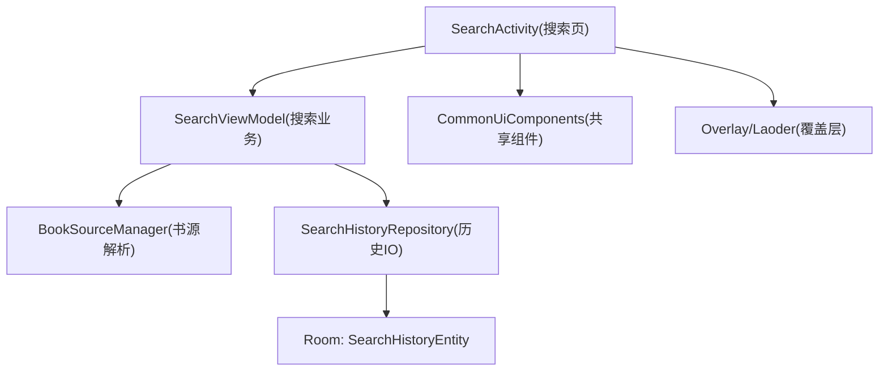
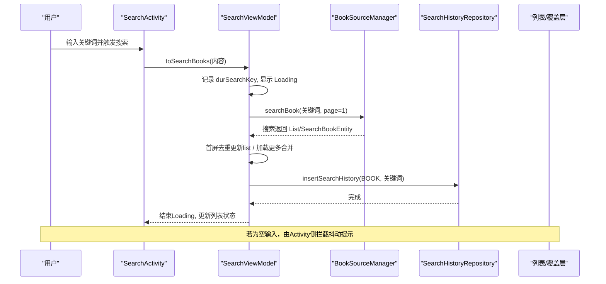
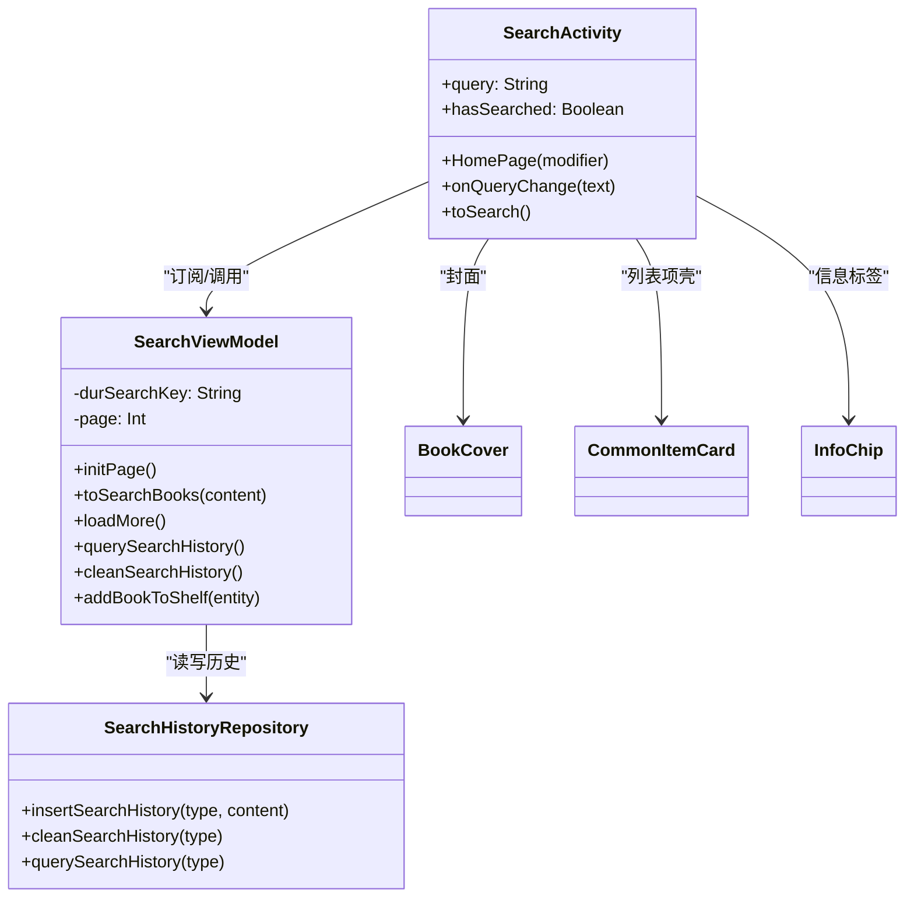

# 搜索UI组件

<cite>
**本文引用的文件**
- [SearchActivity.kt](file://module_find/src/main/java/com/ebook/find/SearchActivity.kt)
- [SearchViewModel.kt](file://module_find/src/main/java/com/ebook/find/mvvm/viewmodel/SearchViewModel.kt)
- [SearchHistoryRepository.kt](file://module_find/src/main/java/com/ebook/find/repository/SearchHistoryRepository.kt)
- [SearchBookItem.kt](file://module_find/src/main/java/com/ebook/find/view/SearchBookItem.kt)
- [CommonUiComponents.kt](file://lib_book_common/src/main/java/com/ebook/common/ui/CommonUiComponents.kt)
- [BookCover.kt](file://lib_book_common/src/main/java/com/ebook/common/ui/BookCover.kt)
- [BookstorePage.kt](file://module_find/src/main/java/com/ebook/find/page/BookstorePage.kt)
- [strings.xml](file://module_find/src/main/res/values/strings.xml)
- [SearchHistoryEntity.kt](file://lib_ebook_db/src/main/java/com/ebook/db/entity/SearchHistoryEntity.kt)
</cite>

## 目录
1. [简介](#简介)
2. [项目结构](#项目结构)
3. [核心组件](#核心组件)
4. [架构总览](#架构总览)
5. [详细组件分析](#详细组件分析)
6. [依赖关系分析](#依赖关系分析)
7. [性能考虑](#性能考虑)
8. [故障排查指南](#故障排查指南)
9. [结论](#结论)

## 简介
本文聚焦书城搜索界面的 UI 组件与交互实现，围绕以下目标进行技术说明：
- 搜索输入框的交互设计（提示文案、字符计数、清除行为、键盘适配）
- 搜索建议面板（实时推荐/历史建议/热门入口）展示逻辑
- 搜索结果列表（结果项布局、加载状态、错误处理）
- 操作的视觉反馈（搜索动画、进度指示、操作确认）
- 组件的可定制性（主题、尺寸、样式）
- 无障碍访问与多语言显示

本页面以 Compose 为主构建，遵循模块间“共享设计语言 + MVVM”的统一约定，保证视觉一致性与可维护性。

## 项目结构
搜索功能集中在 module_find 中的搜索页 Activity 与其 ViewModel，结合 lib_book_common 的共享 UI 组件与 lib_ebook_db 的数据实体，构成“视图层—业务层—数据层”完整链路：
- 视图层：SearchActivity（Composable 搜索页、输入栏、历史面板、覆盖层、圆形揭示动画）
- 业务层：SearchViewModel（分页搜索、书架同步、历史读写封装）
- 数据层：SearchHistoryRepository（本地历史 IO）、Room 实体 SearchHistoryEntity
- 共享 UI：CommonUiTokens、InfoChip、CommonItemCard、BookCover 等

图表来源
- [SearchActivity.kt:125-199](file://module_find/src/main/java/com/ebook/find/SearchActivity.kt#L125-L199)
- [SearchViewModel.kt:30-168](file://module_find/src/main/java/com/ebook/find/mvvm/viewmodel/SearchViewModel.kt#L30-L168)
- [SearchHistoryRepository.kt:11-41](file://module_find/src/main/java/com/ebook/find/repository/SearchHistoryRepository.kt#L11-L41)
- [CommonUiComponents.kt:47-77](file://lib_book_common/src/main/java/com/ebook/common/ui/CommonUiComponents.kt#L47-L77)
- [SearchHistoryEntity.kt:9-43](file://lib_ebook_db/src/main/java/com/ebook/db/entity/SearchHistoryEntity.kt#L9-L43)

小节来源
- [SearchActivity.kt:109-199](file://module_find/src/main/java/com/ebook/find/SearchActivity.kt#L109-L199)
- [SearchViewModel.kt:1-168](file://module_find/src/main/java/com/ebook/find/mvvm/viewmodel/SearchViewModel.kt#L1-L168)
- [SearchHistoryRepository.kt:11-41](file://module_find/src/main/java/com/ebook/find/repository/SearchHistoryRepository.kt#L11-L41)
- [CommonUiComponents.kt:47-77](file://lib_book_common/src/main/java/com/ebook/common/ui/CommonUiComponents.kt#L47-L77)

## 核心组件
- SearchActivity：承载搜索主界面，包含搜索行、历史面板、结果列表及覆盖层，控制软键盘显示与历史面板呈现时机，并提供搜索触发与返回逻辑。
- SearchViewModel：负责搜索请求（含分页）、历史记录写入/查询/清空、书架快照管理与事件同步（是否已加书架）。
- SearchBookItem：搜索结果条目卡片，统一封面、信息标签与“加入书架”按钮渲染。
- CommonUiComponents 与 BookCover：提供统一的圆角、间距、语义色与封面组件，确保全应用一致的视觉语言。
- SearchHistoryRepository：对本地 search_history 表的 upsert、清理、查询。

小节来源
- [SearchActivity.kt:125-199](file://module_find/src/main/java/com/ebook/find/SearchActivity.kt#L125-L199)
- [SearchViewModel.kt:24-168](file://module_find/src/main/java/com/ebook/find/mvvm/viewmodel/SearchViewModel.kt#L24-L168)
- [SearchBookItem.kt:44-156](file://module_find/src/main/java/com/ebook/find/view/SearchBookItem.kt#L44-L156)
- [CommonUiComponents.kt:47-77](file://lib_book_common/src/main/java/com/ebook/common/ui/CommonUiComponents.kt#L47-L77)
- [BookCover.kt:11-41](file://lib_book_common/src/main/java/com/ebook/common/ui/BookCover.kt#L11-L41)
- [SearchHistoryRepository.kt:11-41](file://module_find/src/main/java/com/ebook/find/repository/SearchHistoryRepository.kt#L11-L41)

## 架构总览
搜索流程采用 MVVM：Activity 组合 UI 并接收用户操作；ViewModel 聚合搜索与历史能力，调用 BookSourceManager 完成跨站点的书籍搜索，同时与 SearchHistoryRepository 协作管理历史；UI 通过覆盖层与列表状态给出进度与空态反馈；书架事件在 VM 内聚合，保证搜索结果项的“已添加”状态即时刷新。

图表来源
- [SearchViewModel.kt:120-168](file://module_find/src/main/java/com/ebook/find/mvvm/viewmodel/SearchViewModel.kt#L120-L168)
- [SearchActivity.kt:195-216](file://module_find/src/main/java/com/ebook/find/SearchActivity.kt#L195-L216)
- [SearchHistoryRepository.kt:22-29](file://module_find/src/main/java/com/ebook/find/repository/SearchHistoryRepository.kt#L22-L29)

## 详细组件分析

### 搜索输入框组件
- 输入提示：使用字符串资源（如“搜书名、作者”），并通过 Compose BasicTextField 绑定 query 状态，支持 IME Action 配置与类型设置。
- 清除行为：当输入非空时提供清除回调，重置文本并聚焦，避免进入空白搜索。
- 字符计数：可在尾部区域渲染当前字数（可通过扩展 InputField 后缀位实现，便于在 Material 文本框外显示统计）。
- 键盘适配：通过监听系统 ime 可见性自动切换历史面板展示；首次进入主动请求焦点并尝试拉起输入法；当无键盘可用时启用宽限期兜底直接展示历史面板。
- 联动行为：执行搜索前先收起键盘并等待一定时长，对齐旧实现的动画时序；未搜索过的情况下收起键盘会触发返回过渡动画。

小节来源
- [SearchActivity.kt:164-201](file://module_find/src/main/java/com/ebook/find/SearchActivity.kt#L164-L201)
- [SearchActivity.kt:171-189](file://module_find/src/main/java/com/ebook/find/SearchActivity.kt#L171-L189)

### 搜索建议组件
- 实时推荐：代码仓库未发现独立“实时推荐”下拉词或服务端热词接口调用；页面以“搜索历史”作为建议数据来源。
- 历史建议：进入页面即拉取全部历史并显示在历史面板中；点击词条触发搜索；支持一键清空该类型全部历史。
- 热门入口：未见“热门搜索”专用组件；书城首页提供通用“搜索胶囊”入口跳转至搜索页，引导用户发起搜索。

小节来源
- [SearchActivity.kt:181-190](file://module_find/src/main/java/com/ebook/find/SearchActivity.kt#L181-L190)
- [SearchActivity.kt:195-216](file://module_find/src/main/java/com/ebook/find/SearchActivity.kt#L195-L216)
- [SearchViewModel.kt:81-118](file://module_find/src/main/java/com/ebook/find/mvvm/viewmodel/SearchViewModel.kt#L81-L118)
- [SearchHistoryRepository.kt:31-41](file://module_find/src/main/java/com/ebook/find/repository/SearchHistoryRepository.kt#L31-L41)
- [BookstorePage.kt:169-188](file://module_find/src/main/java/com/ebook/find/page/BookstorePage.kt#L169-L188)

### 搜索结果列表
- 结果项布局：卡片容器（12dp 圆角 + surfaceContainer 色 + 轻阴影），内含封面、书名、作者+来源、状态/分类/字数标签、最新章节或简介、以及“加入书架”按钮。
- 加载状态：搜索开始时显示覆盖层（Loading），完成后隐藏；列表基类提供触底加载更多，且仅在有效页返回新数据才追加与递增页码。
- 错误处理：网络异常时停止“没有更多”，关闭覆盖层；加入书架失败时弹出 toast 提示。
- 去重策略：首屏按 noteUrl 去重；加载更多走 merge 函数避免重复项与无效页继续推进。

小节来源
- [SearchBookItem.kt:44-156](file://module_find/src/main/java/com/ebook/find/view/SearchBookItem.kt#L44-L156)
- [SearchViewModel.kt:125-168](file://module_find/src/main/java/com/ebook/find/mvvm/viewmodel/SearchViewModel.kt#L125-L168)
- [SearchViewModel.kt:169-194](file://module_find/src/main/java/com/ebook/find/mvvm/viewmodel/SearchViewModel.kt#L169-L194)

### 搜索操作的视觉反馈
- 搜索前遮罩：进入搜索时立即显示覆盖层，提升加载感知。
- 历史面板动画：使用自定义缓动与圆形裁剪形状，打开/收起历史面板时播放动画，保持与旧版一致的时长曲线。
- 键盘收起后再搜索：为确保输入法动画平滑，等待一定时间再发起搜索。
- 操作确认：加入书架失败时通过 toast 提示；成功则通过书架事件更新列表项“已添加”。

小节来源
- [SearchViewModel.kt:125-168](file://module_find/src/main/java/com/ebook/find/mvvm/viewmodel/SearchViewModel.kt#L125-L168)
- [SearchActivity.kt:93-123](file://module_find/src/main/java/com/ebook/find/SearchActivity.kt#L93-L123)
- [SearchActivity.kt:164-201](file://module_find/src/main/java/com/ebook/find/SearchActivity.kt#L164-L201)

### 组件定制化选项
- 主题适配：所有颜色、字号均引用 Material Theme 语义色与排版，配合 CommonUiTokens 的常量，支持深浅色模式无缝切换。
- 尺寸调整：封面尺寸、组件内边距、卡片圆角等均集中到共享设计常量或调用处修饰符，可按需扩展。
- 样式自定义：InfoChip、CommonItemCard、BookCover 等均可在不同场景复用，减少重复实现，保持一致风格。

小节来源
- [CommonUiComponents.kt:47-77](file://lib_book_common/src/main/java/com/ebook/common/ui/CommonUiComponents.kt#L47-L77)
- [SearchBookItem.kt:44-156](file://module_find/src/main/java/com/ebook/find/view/SearchBookItem.kt#L44-L156)
- [BookCover.kt:11-41](file://lib_book_common/src/main/java/com/ebook/common/ui/BookCover.kt#L11-L41)

### 无障碍访问与多语言显示
- 无障碍：封面组件接受 contentDescription，用于读屏器描述；按钮与列表项可使用可访问的组合修饰符增强操作可达性（如需进一步丰富可在调用处扩展）。
- 多语言：文本一律来自 strings.xml，包括搜索提示、历史标题、操作文案（如“已添加”“+添加”“来源”格式等），便于切换语言时无侵入修改。

小节来源
- [SearchBookItem.kt:52-58](file://module_find/src/main/java/com/ebook/find/view/SearchBookItem.kt#L52-L58)
- [BookCover.kt:21-24](file://lib_book_common/src/main/java/com/ebook/common/ui/BookCover.kt#L21-L24)
- [strings.xml:5-17](file://module_find/src/main/res/values/strings.xml#L5-L17)

## 依赖关系分析

图表来源
- [SearchActivity.kt:125-199](file://module_find/src/main/java/com/ebook/find/SearchActivity.kt#L125-L199)
- [SearchViewModel.kt:24-168](file://module_find/src/main/java/com/ebook/find/mvvm/viewmodel/SearchViewModel.kt#L24-L168)
- [SearchHistoryRepository.kt:11-41](file://module_find/src/main/java/com/ebook/find/repository/SearchHistoryRepository.kt#L11-L41)
- [CommonUiComponents.kt:85-146](file://lib_book_common/src/main/java/com/ebook/common/ui/CommonUiComponents.kt#L85-L146)
- [BookCover.kt:11-41](file://lib_book_common/src/main/java/com/ebook/common/ui/BookCover.kt#L11-L41)

小节来源
- [SearchActivity.kt:125-199](file://module_find/src/main/java/com/ebook/find/SearchActivity.kt#L125-L199)
- [SearchViewModel.kt:24-194](file://module_find/src/main/java/com/ebook/find/mvvm/viewmodel/SearchViewModel.kt#L24-L194)
- [SearchHistoryRepository.kt:11-41](file://module_find/src/main/java/com/ebook/find/repository/SearchHistoryRepository.kt#L11-L41)

## 性能考虑
- 列表项对象复用：格式化“字数”为全局对象缓存，避免每次组合创建 DecimalFormat。
- 异步与线程：历史 IO 切到 IO 调度器；搜索协程在 viewModelScope 中运行，避免阻塞 UI。
- 分页与去重：首屏与加载更多都进行去重，避免重复项导致列表异常与冗余请求。
- 图片加载：封面统一使用 Coil，带占位与裁切缩放，避免变形与闪烁。

小节来源
- [SearchBookItem.kt:141-156](file://module_find/src/main/java/com/ebook/find/view/SearchBookItem.kt#L141-L156)
- [SearchViewModel.kt:125-168](file://module_find/src/main/java/com/ebook/find/mvvm/viewmodel/SearchViewModel.kt#L125-L168)
- [SearchHistoryRepository.kt:11-41](file://module_find/src/main/java/com/ebook/find/repository/SearchHistoryRepository.kt#L11-L41)
- [BookCover.kt:11-41](file://lib_book_common/src/main/java/com/ebook/common/ui/BookCover.kt#L11-L41)

## 故障排查指南
- 搜索无结果或一直加载：
  - 检查网络与服务器可达性，观察覆盖层是否始终存在。
  - 查看 ViewModel 日志与“停止加载更多”的状态是否正确恢复。
- 搜索结果重复：
  - 确认首屏按 noteUrl 去重与加载更多 merge 逻辑是否生效。
- 历史面板不显示：
  - 确认 isImeVisible 与宽限期兜底逻辑；无键盘环境会强制打开面板。
- “加入书架”失败：
  - 失败时会 toast，检查网络超时或服务端返回；成功后列表应更新为“已添加”。
- 输入提示/文案显示乱码或语种不对：
  - 检查 strings.xml 文案是否齐全，是否与当前 locale 匹配。

小节来源
- [SearchViewModel.kt:125-168](file://module_find/src/main/java/com/ebook/find/mvvm/viewmodel/SearchViewModel.kt#L125-L168)
- [SearchViewModel.kt:169-194](file://module_find/src/main/java/com/ebook/find/mvvm/viewmodel/SearchViewModel.kt#L169-L194)
- [SearchActivity.kt:171-189](file://module_find/src/main/java/com/ebook/find/SearchActivity.kt#L171-L189)
- [strings.xml:5-17](file://module_find/src/main/res/values/strings.xml#L5-L17)

## 结论
搜索 UI 以 Compose 实现，结合共享设计语言与 MVVM 架构，提供了良好的体验一致性、可维护性与可扩展性：
- 输入与历史建议集中于 SearchActivity 和 SearchViewModel；
- 列表与卡片样式收敛至公共组件，降低重复实现；
- 加载状态与错误反馈清晰稳定；
- 具备无障碍和多语言基础支持；
- 可根据需要拓展实时推荐与热门标签等能力。

[无需来源说明]