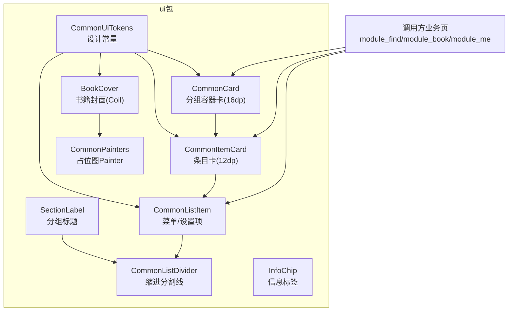
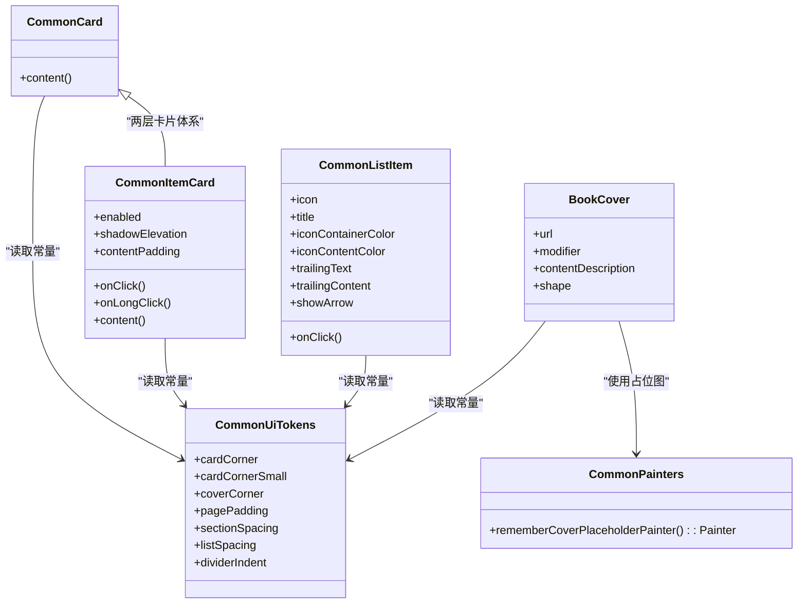
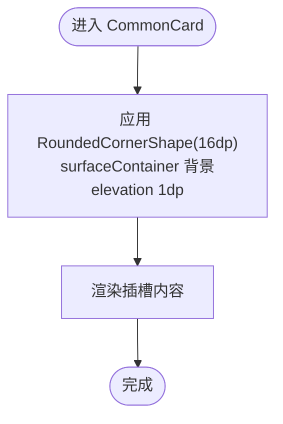
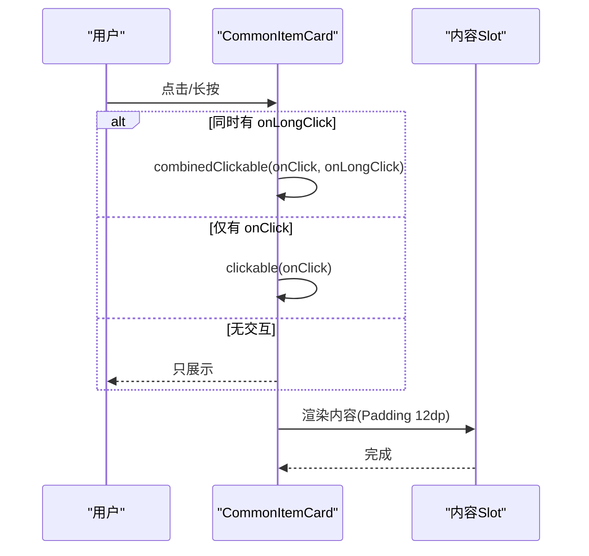
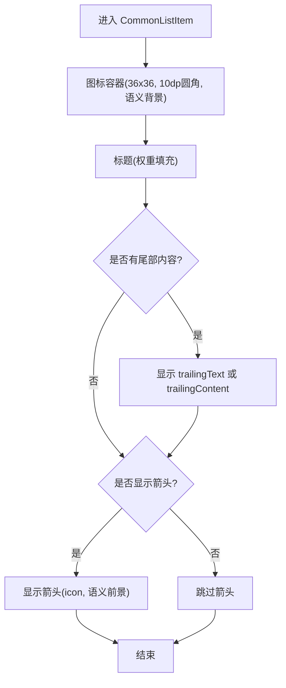
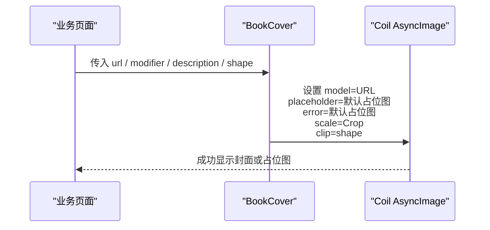
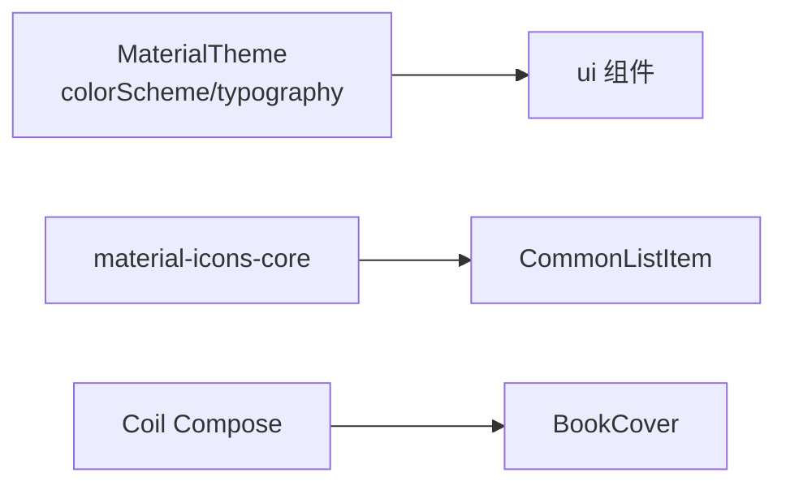

# 共享UI组件库

<cite>
**本文引用的文件**
- [CommonUiComponents.kt](file://lib_book_common/src/main/java/com/ebook/common/ui/CommonUiComponents.kt)
- [BookCover.kt](file://lib_book_common/src/main/java/com/ebook/common/ui/BookCover.kt)
- [CommonPainters.kt](file://lib_book_common/src/main/java/com/ebook/common/ui/CommonPainters.kt)
- [0006-shared-ui-components-in-lib-book-common.md](file://docs/adr/0006-shared-ui-components-in-lib-book-common.md)
</cite>

## 目录
1. [简介](#简介)
2. [项目结构](#项目结构)
3. [核心组件](#核心组件)
4. [架构总览](#架构总览)
5. [详细组件分析](#详细组件分析)
6. [依赖分析](#依赖分析)
7. [性能考量](#性能考量)
8. [故障排查指南](#故障排查指南)
9. [结论](#结论)
10. [附录](#附录)

## 简介
本章节介绍 com.ebook.common.ui 共享 UI 组件库的设计目标与使用边界：通过统一设计常量（圆角、间距、语义色）与可复用 Compose 组件，保障书城、书架、个人中心等多模块的视觉一致性与可维护性。组件聚焦“轻卡片 + 语义色 + Material typography”的视觉语言，并以最小依赖暴露能力。

## 项目结构
com.ebook.common.ui 提供三类核心资产：
- 设计令牌：CommonUiTokens（圆角与间距的唯一事实来源）
- 通用容器与列表项：CommonCard、CommonItemCard、CommonListItem、CommonListDivider、SectionLabel、InfoChip
- 封面展示与绘制器：BookCover、rememberCoverPlaceholderPainter 等自定义 Painter

图表来源
- [CommonUiComponents.kt:33-77](file://lib_book_common/src/main/java/com/ebook/common/ui/CommonUiComponents.kt#L33-L77)
- [CommonUiComponents.kt:85-275](file://lib_book_common/src/main/java/com/ebook/common/ui/CommonUiComponents.kt#L85-L275)
- [BookCover.kt:11-41](file://lib_book_common/src/main/java/com/ebook/common/ui/BookCover.kt#L11-L41)
- [CommonPainters.kt:13-38](file://lib_book_common/src/main/java/com/ebook/common/ui/CommonPainters.kt#L13-L38)

章节来源
- [CommonUiComponents.kt:33-77](file://lib_book_common/src/main/java/com/ebook/common/ui/CommonUiComponents.kt#L33-L77)
- [0006-shared-ui-components-in-lib-book-common.md:1-24](file://docs/adr/0006-shared-ui-components-in-lib-book-common.md#L1-L24)

## 核心组件
- CommonUiTokens：集中定义圆角、间距与页面边距等设计规范，避免各模块出现魔法值导致视觉漂移。
- CommonCard：统一 16dp 圆角的分组容器，搭配 surfaceContainer 与轻量阴影，形成两级卡片中的“容器层”。
- CommonItemCard：统一 12dp 圆角的条目容器，封装点击/长按交互、内边距、阴影层级；与 CommonCard 配合构成“容器-条目”层次。
- CommonListItem：带彩色图标容器、标题文本、可选尾部内容与右侧箭头的菜单/设置项，强调语义色与布局留白。
- CommonListDivider / SectionLabel：为分组头部与分隔线提供统一缩进与排版，保持列表分组节奏一致。
- InfoChip：展示型小标签，可通过 shape 等参数覆盖胶囊形态，承载语义色与文本样式。
- BookCover：基于 Coil 的异步图片加载，内置默认占位图、错误态回退，强制 Crop 缩放以杜绝封面拉伸变形，统一圆角裁剪。

章节来源
- [CommonUiComponents.kt:53-77](file://lib_book_common/src/main/java/com/ebook/common/ui/CommonUiComponents.kt#L53-L77)
- [CommonUiComponents.kt:85-146](file://lib_book_common/src/main/java/com/ebook/common/ui/CommonUiComponents.kt#L85-L146)
- [CommonUiComponents.kt:160-225](file://lib_book_common/src/main/java/com/ebook/common/ui/CommonUiComponents.kt#L160-L225)
- [CommonUiComponents.kt:226-275](file://lib_book_common/src/main/java/com/ebook/common/ui/CommonUiComponents.kt#L226-L275)
- [BookCover.kt:11-41](file://lib_book_common/src/main/java/com/ebook/common/ui/BookCover.kt#L11-L41)

## 架构总览
组件围绕“设计令牌 → 组件容器 → 业务页面”分层：
- 所有尺寸与视觉参数来源于 CommonUiTokens，确保跨模块一致性。
- CommonCard/CommonItemCard 作为基础容器承载内容；CommonListItem 在条目内部编排图标、标题与尾部元素。
- BookCover 将 Coil 加载、占位图、裁剪与无障碍描述封装，供书城、书架、搜索等多处复用。
- 主题系统集成：全部颜色与排版均引用 MaterialTheme.colorScheme/typography，确保跟随系统主题与深色模式。

图表来源
- [CommonUiComponents.kt:53-77](file://lib_book_common/src/main/java/com/ebook/common/ui/CommonUiComponents.kt#L53-L77)
- [CommonUiComponents.kt:85-146](file://lib_book_common/src/main/java/com/ebook/common/ui/CommonUiComponents.kt#L85-L146)
- [CommonUiComponents.kt:160-225](file://lib_book_common/src/main/java/com/ebook/common/ui/CommonUiComponents.kt#L160-L225)
- [BookCover.kt:11-41](file://lib_book_common/src/main/java/com/ebook/common/ui/BookCover.kt#L11-L41)
- [CommonPainters.kt:13-38](file://lib_book_common/src/main/java/com/ebook/common/ui/CommonPainters.kt#L13-L38)

## 详细组件分析

### CommonUiTokens 设计常量
- 作用：集中圆角（16dp/12dp/10dp/4dp）、间距（页面、区块、列表）与分割线缩进，作为全 App 的“单一事实来源”。
- 设计意图：防止各模块手写重复或漂移的参数，保证“容器-条目”的卡片层级清晰、列表密度一致。
- 主题集成：颜色类常量未硬编码，组件侧统一从 MaterialTheme.colorScheme 引用。

章节来源
- [CommonUiComponents.kt:47-77](file://lib_book_common/src/main/java/com/ebook/common/ui/CommonUiComponents.kt#L47-L77)

### CommonCard 通用卡片
- 行为：提供表面阴影 elevation=1.dp 与 surfaceContainer 背景，形状采用 16dp 圆角。
- 用途：用作分组容器的外层壳，将相关条目包裹在一起，形成统一的视觉区域与轻微的层次感。
- 适配：支持外部传入 Modifier 与 slot 内容，不关心内部布局细节，仅约束外观与语义色。

图表来源
- [CommonUiComponents.kt:85-98](file://lib_book_common/src/main/java/com/ebook/common/ui/CommonUiComponents.kt#L85-L98)

章节来源
- [CommonUiComponents.kt:85-98](file://lib_book_common/src/main/java/com/ebook/common/ui/CommonUiComponents.kt#L85-L98)

### CommonItemCard 列表条目卡
- 行为与交互：
  - 同时提供 onClick/onLongClick；当两者都存在时走 combinedClickable，保证长按手势不被吞掉。
  - enabled=false 时不可响应但保持可见。
  - ripple 随圆角裁剪，命中区覆盖整张卡片。
- 视觉：
  - 12dp 圆角，surfaceContainer 背景，默认阴影 elevation=1dp，可由调用方传入调整。
  - 内边距默认 PaddingValues(12.dp)，可在调用处依据业务调整并备注原因。
- 使用建议：列表密集排布时可将 shadowElevation 设为 0.dp 降低层级感；纯展示条目可不传 onClick/onLongClick。

图表来源
- [CommonUiComponents.kt:100-146](file://lib_book_common/src/main/java/com/ebook/common/ui/CommonUiComponents.kt#L100-L146)

章节来源
- [CommonUiComponents.kt:100-146](file://lib_book_common/src/main/java/com/ebook/common/ui/CommonUiComponents.kt#L100-L146)

### CommonListItem 菜单项
- 布局与交互：
  - 左侧 36dp 彩色图标容器，圆角 10dp，内部 20dp 图标，颜色来源于语义色，提升可读性与品牌感。
  - 中间标题使用 bodyLarge，右侧尾部分支支持 trailingText 或任意 trailingContent。
  - 可选显示右侧箭头 icon，纯展示项（如版本号）可隐藏。
  - 整行可点击，点击范围覆盖行高与水平方向全部宽度。
- 主题集成：
  - 字体与颜色均来自 MaterialTheme，保证随深浅主题切换一致。

图表来源
- [CommonUiComponents.kt:148-225](file://lib_book_common/src/main/java/com/ebook/common/ui/CommonUiComponents.kt#L148-L225)

章节来源
- [CommonUiComponents.kt:148-225](file://lib_book_common/src/main/java/com/ebook/common/ui/CommonUiComponents.kt#L148-L225)

### BookCover 书籍封面
- 网络加载：通过 Coil AsyncImage 异步拉取封面 URL；空串与加载失败会自动回退到默认占位图。
- 占位策略：使用 rememberCoverPlaceholderPainter()，优先返回 NinePatch 资源转 Bitmap 的 Painter，失败则退回 colorScheme.surfaceVariant 颜色。
- 缩放与裁剪：固定 ContentScale.Crop，避免非标准比例的封面被拉伸；必要时由调用方在外层包裹 Card/Surface 添加阴影或描边。
- 圆角裁剪：默认 coverCorner（10dp），可通过 shape 参数定制（如在紧凑列表中缩小）。
- 无障碍：支持 contentDescription，便于读屏识别。

图表来源
- [BookCover.kt:11-41](file://lib_book_common/src/main/java/com/ebook/common/ui/BookCover.kt#L11-L41)
- [CommonPainters.kt:13-38](file://lib_book_common/src/main/java/com/ebook/common/ui/CommonPainters.kt#L13-L38)

章节来源
- [BookCover.kt:11-41](file://lib_book_common/src/main/java/com/ebook/common/ui/BookCover.kt#L11-L41)
- [CommonPainters.kt:13-38](file://lib_book_common/src/main/java/com/ebook/common/ui/CommonPainters.kt#L13-L38)

### CommonListDivider、SectionLabel、InfoChip
- CommonListDivider：提供标准分割线与 indent，使列表具有清晰的分节感。
- SectionLabel：分组标题，遵循 labelMedium 与 onSurfaceVariant 语义色，保证可读性和轻量化。
- InfoChip：展示型标签容器，默认小圆角，可传入圆形/胶囊形 shape；支持自定义背景色、文字色与 TextStyle，满足轻量标记与信息提示。

章节来源
- [CommonUiComponents.kt:226-275](file://lib_book_common/src/main/java/com/ebook/common/ui/CommonUiComponents.kt#L226-L275)

### 可访问性
- BookCover 支持 contentDescription 用于屏幕阅读器描述。
- 其他组件在语义上以 Surface 容器承载，颜色与对比度遵循 Material Theme，保证浅色/深色模式下的一致可读性。

章节来源
- [BookCover.kt:11-41](file://lib_book_common/src/main/java/com/ebook/common/ui/BookCover.kt#L11-L41)

## 依赖分析
- 主题依赖：全部组件依赖 Material3 的 colorScheme 与 typography，从而自动适配深浅色、动态色与平台主题。
- 图标约束：本包仅使用 material-icons-core 的核心集图标，避免扩展图标带来的体积增长；需要更多图标时由各业务模块自行引入 iconsExtended。
- 图片加载：BookCover 引入 Coil Compose 进行图片加载；与其他业务页直接使用 Coil 的行为保持一致。
- 绘制器：rememberCoverPlaceholderPainter 基于 LocalContext 获取资源，构建期不引入额外运行时开销。

图表来源
- [CommonUiComponents.kt:160-225](file://lib_book_common/src/main/java/com/ebook/common/ui/CommonUiComponents.kt#L160-L225)
- [BookCover.kt:11-41](file://lib_book_common/src/main/java/com/ebook/common/ui/BookCover.kt#L11-L41)
- [0006-shared-ui-components-in-lib-book-common.md:11-14](file://docs/adr/0006-shared-ui-components-in-lib-book-common.md#L11-L14)

章节来源
- [0006-shared-ui-components-in-lib-book-common.md:11-14](file://docs/adr/0006-shared-ui-components-in-lib-book-common.md#L11-L14)

## 性能考量
- 阴影与层级：CommonItemCard 的 shadowElevation 默认为 1dp；密集列表场景可降低至 0dp 以减少绘制开销。
- 图片加载：BookCover 使用 Crop 缩放避免多余重绘与图像拉伸；默认占位图经 remember 缓存，减少重复解码。
- 资源类型限制：占位图为 NinePatch 时无法用 painterResource，需通过 Context 获取后转为 Bitmap，以避免运行时异常。

[本节提供通用指导，不直接分析具体文件]

## 故障排查指南
- 封面显示黑块或变形
  - 检查 BookCover 的 contentScale 是否为 Crop（默认已固定），确保非 3:4 比例不拉伸。
  - 若自定义 shape，请确认与封面容器尺寸匹配。
  - 查看 rememberCoverPlaceholderPainter 是否正确回退到 surfaceVariant 颜色。
- 点击无响应
  - 确保 CommonItemCard 传入了 onClick 或 onLongClick，且 enabled=true。
  - 注意 combinedClickable 的使用方式：当二者都存在时不会退化到普通 clickable。
- 列表拥挤或缺乏层次
  - 合理搭配 CommonCard（容器）与 CommonItemCard（条目）使用；必要时降低条目阴影层级。
- 图标显示异常
  - 确认 Icon 来自 material-icons-core；不要在本包内引入 iconsExtended。

章节来源
- [BookCover.kt:11-41](file://lib_book_common/src/main/java/com/ebook/common/ui/BookCover.kt#L11-L41)
- [CommonUiComponents.kt:100-146](file://lib_book_common/src/main/java/com/ebook/common/ui/CommonUiComponents.kt#L100-L146)
- [CommonPainters.kt:13-38](file://lib_book_common/src/main/java/com/ebook/common/ui/CommonPainters.kt#L13-L38)

## 结论
本共享 UI 组件库以 CommonUiTokens 为核心，通过 CommonCard/CommonItemCard/CommonListItem 等容器与列表项构件，以及 BookCover 等专用组件，为全应用提供一致的视觉语言与高质量交互体验。结合 Material3 主题系统与无障碍支持，能够在不同主题、深浅模式下保持一致的观感。按需继承“容器-条目”两层卡片结构，即可快速搭建符合规范的业务界面。

[本节总结性内容，不直接分析具体文件]

## 附录
- 设计理念参考
  - ADR-0006 对组件迁移动机、权衡与下游影响的详细说明
- 典型用法清单
  - 分组容器：CommonCard
  - 条目卡片：CommonItemCard
  - 菜单项：CommonListItem
  - 分割/标题/标签：CommonListDivider、SectionLabel、InfoChip
  - 封面展示：BookCover（配合 rememberCoverPlaceholderPainter）

章节来源
- [0006-shared-ui-components-in-lib-book-common.md:1-24](file://docs/adr/0006-shared-ui-components-in-lib-book-common.md#L1-L24)