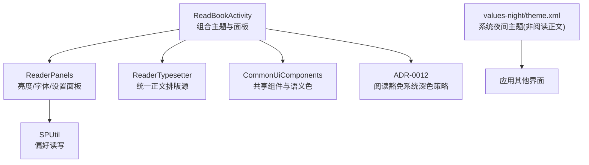
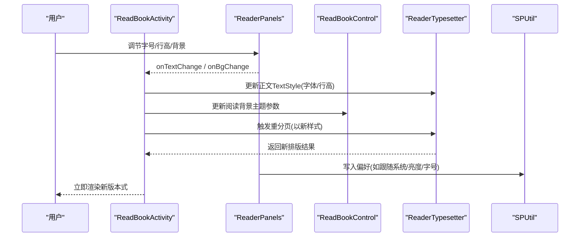
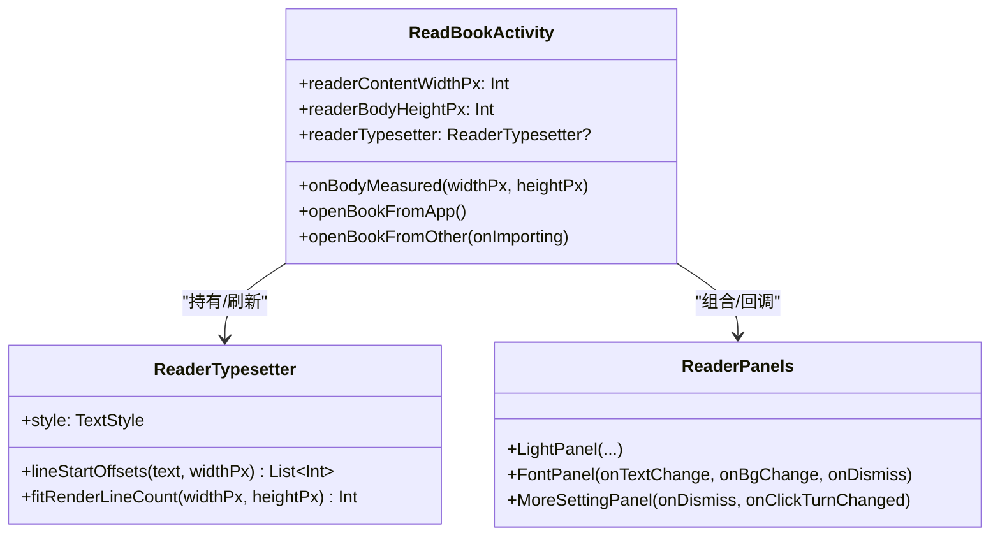
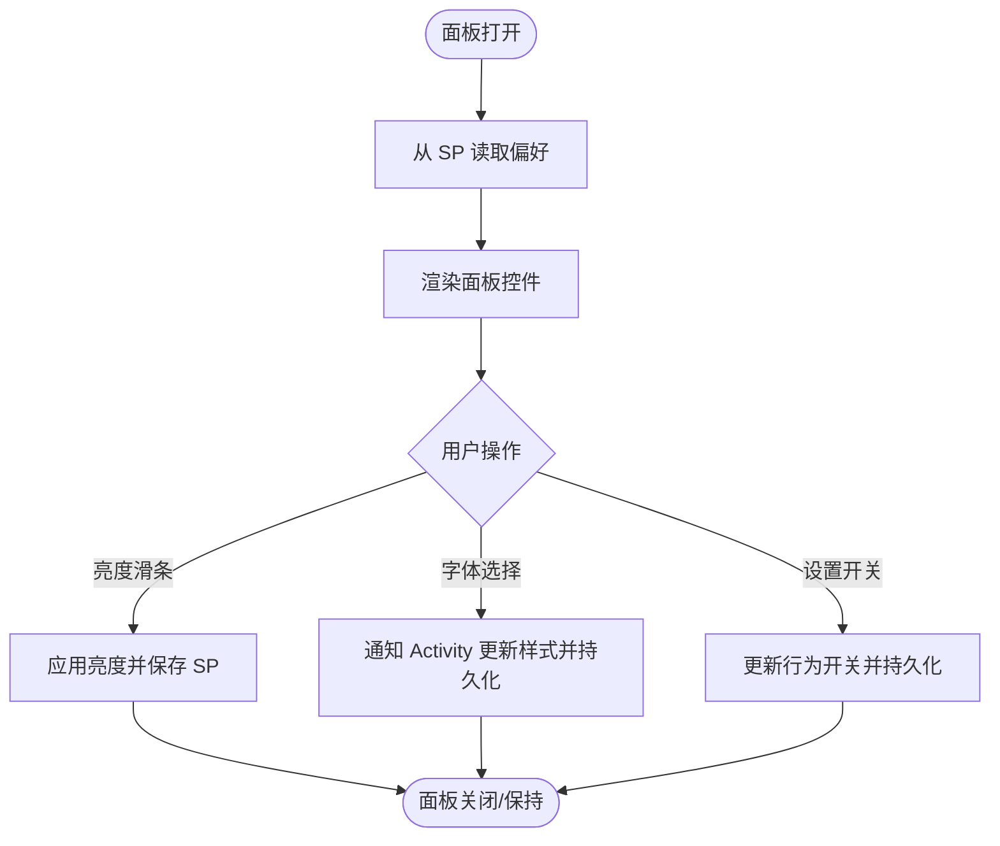
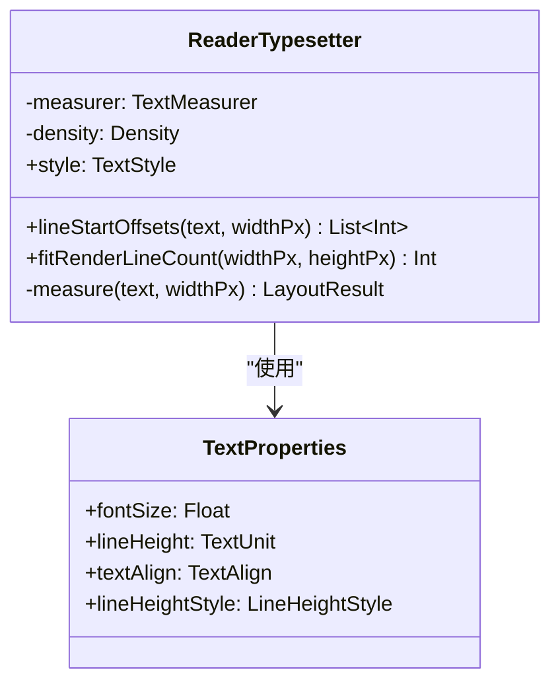
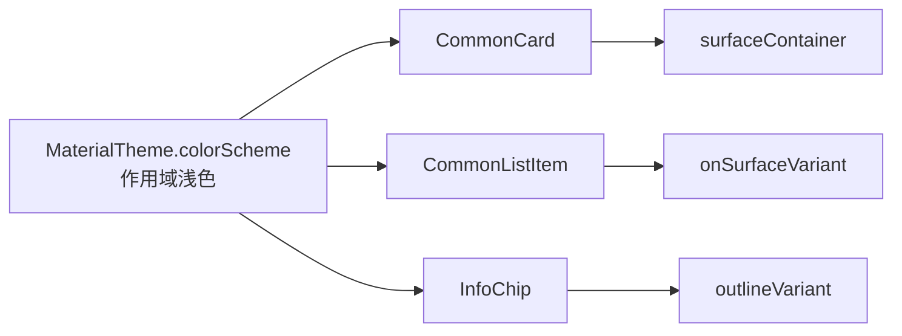
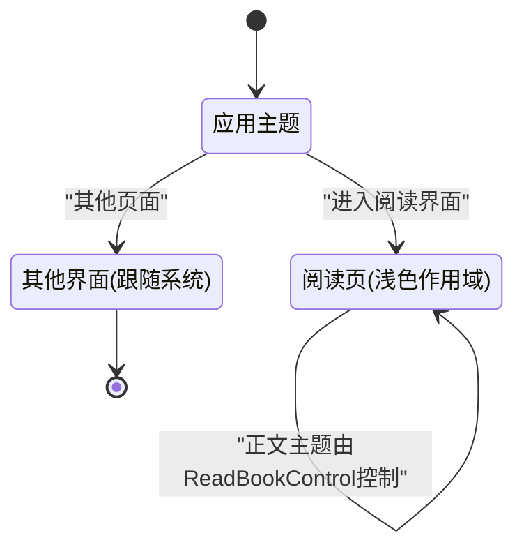
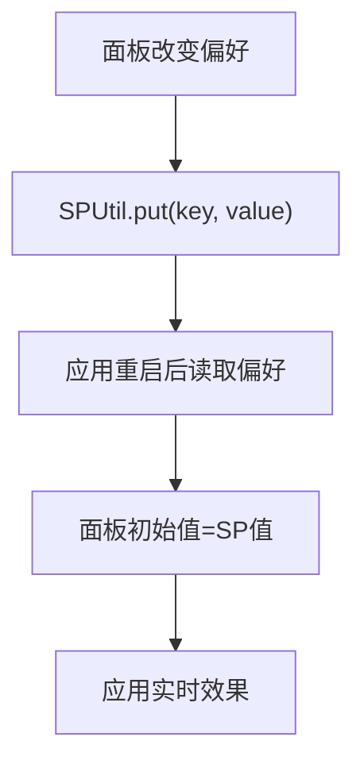
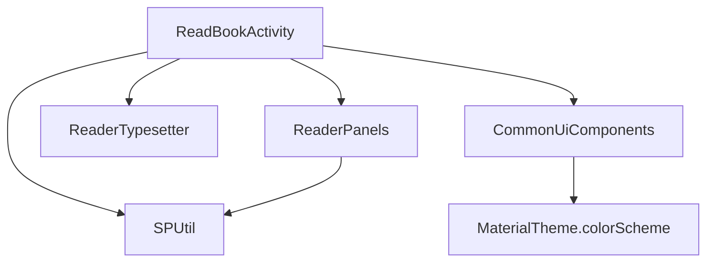

# 主题系统设计

<cite>
**本文引用的文件列表**
- [ReadBookActivity.kt](file://module_book/src/main/java/com/ebook/book/ReadBookActivity.kt)
- [ReaderPanels.kt](file://module_book/src/main/java/com/ebook/book/reader/ReaderPanels.kt)
- [ReaderTypesetter.kt](file://module_book/src/main/java/com/ebook/book/reader/ReaderTypesetter.kt)
- [CommonUiComponents.kt](file://lib_book_common/src/main/java/com/ebook/common/ui/CommonUiComponents.kt)
- [0012-reader-full-light-theme-and-catalog-fast-scroll.md](file://docs/adr/0012-reader-full-light-theme-and-catalog-fast-scroll.md)
- [SPUtil.kt](file://lib_book_common/src/main/java/com/ebook/common/util/SPUtil.kt)
- [theme.xml（夜间模式）](file://module_main/src/main/res/values-night/theme.xml)
</cite>

## 目录
1. [简介](#简介)
2. [项目结构（与主题系统相关）](#项目结构与主题系统相关)
3. [核心组件](#核心组件)
4. [架构总览](#架构总览)
5. [详细组件分析](#详细组件分析)
6. [依赖关系分析](#依赖关系分析)
7. [性能考量](#性能考量)
8. [故障排查指南](#故障排查指南)
9. [结论](#结论)
10. [附录](#附录)

## 简介
本设计文档聚焦于电子书阅读器的主题系统，涵盖：
- 主题数据模型（颜色、字体、背景等主题参数的定义与使用）
- 主题切换机制（日间/夜间/自定义主题的动态切换与用户偏好保存）
- 颜色系统（语义色映射、对比度与可访问性建议、色盲友好设计原则）
- 字体系统（字号调节、行距调整与页面排版）
- 主题持久化方案（SharedPreferences 存储、同步策略与迁移兼容）
- 主题扩展接口（如何添加自定义主题与定制选项）

整体设计遵循 Material3 语义配色，并通过作用域主题控制阅读器的 Chrome 层与阅读正文的独立主题。阅读器正文明确豁免系统深色模式，Chrome 层采用固定浅色作用域，以确保菜单、工具栏、面板等与正文解耦呈现。

## 项目结构（与主题系统相关）
- 业务模块 module_book 中的 ReadBookActivity 负责阅读界面整体装配、主题作用域注入与状态管理；同时挂载各类设置面板（亮度、字体、更多设置）。
- ReaderPanels 提供阅读器 chrome 层的 UI 控件，如亮度面板、字体面板、更多设置面板等。
- ReaderTypesetter 为阅读正文的统一排版来源，基于 Compose TextMeasurer 实现稳定分页与渲染。
- lib_book_common 的 CommonUiComponents 提供跨模块共享的 Compose 组件与设计令牌（圆角、间距、阴影、语义色），所有通用组件通过 MaterialTheme.colorScheme 获取配色。
- ADR-0012 明确了阅读页整片豁免系统深色的决策：在 ReadBookActivity 的作用域内固定浅色主题，chrome 层统一按该作用域解析语义色。
- SPUtil 作为 SharedPreferences 封装工具，为各偏好（如亮度、跟随系统等）提供集中存取能力，配合阅读器面板实现偏好写入。
- 系统级主题资源通过 values-night 资源目录支持系统深色外观（用于启动屏等场景），而阅读界面通过作用域主题覆盖。

[本节未直接分析具体代码行]

## 核心组件
- ReadBookActivity：承载阅读活动的主题作用域、布局组装、状态桥接；在组合时以固定浅色 MaterialTheme(colorScheme = ReaderLightColorScheme) 限定 chrome 层配色上下文，正文则通过 ReadBookControl 管理阅读背景主题。同时处理面板显隐、偏好联动、正文类型器刷新等。
- ReaderPanels：实现亮度面板、字体面板、更多设置面板等。面板内的开关、滑条、选择项与 ReadBookControl、SPUtil 协作完成即时反馈和偏好保存。
- ReaderTypesetter：定义阅读正文字体样式、测量与分页逻辑，确保“分页与渲染同源”，避免因两套排版导致翻页错位问题。
- CommonUiComponents：提供统一的卡片、条目、分割线、标签等组件，全部走 Material3 语义色与排版约定，保证主题一致性与可维护性。
- 持久化工具 SPUtil：提供轻量且 Kotlin 风格的 SharedPreferences 读写封装，供面板写入并持久化配置。
- 系统资源 theme.xml（夜间模式）：仅在非阅读场景下影响系统级外观；阅读界面通过作用域主题覆盖。

**Section sources**
- [ReadBookActivity.kt:17-35](file://module_book/src/main/java/com/ebook/book/ReadBookActivity.kt#L17-L35)
- [ReadBookActivity.kt:137-141](file://module_book/src/main/java/com/ebook/book/ReadBookActivity.kt#L137-L141)
- [ReaderPanels.kt:123-178](file://module_book/src/main/java/com/ebook/book/reader/ReaderPanels.kt#L123-L178)
- [ReaderTypesetter.kt:17-31](file://module_book/src/main/java/com/ebook/book/reader/ReaderTypesetter.kt#L17-L31)
- [CommonUiComponents.kt:33-77](file://lib_book_common/src/main/java/com/ebook/common/ui/CommonUiComponents.kt#L33-L77)
- [SPUtil.kt:1-93](file://lib_book_common/src/main/java/com/ebook/common/util/SPUtil.kt#L1-L93)
- [0012-reader-full-light-theme-and-catalog-fast-scroll.md](file://docs/adr/0012-reader-full-light-theme-and-catalog-fast-scroll.md)
- [theme.xml（夜间模式）:1-12](file://module_main/src/main/res/values-night/theme.xml#L1-L12)

## 架构总览
阅读器的主题架构分为两层：
- 主体主题（阅读背景主题）：由 ReadBookControl 管理，决定正文背景、正文色以及对比关系，不受系统深色切换影响。
- Chrome 层主题：由 ReadBookActivity 的作用域 MaterialTheme 固定浅色，菜单、工具栏、面板、抽屉等统一取色自该作用域下的 colorScheme。

交互链路如下：
- 用户在面板中调节字体/背景或亮度，立即回写至 ReadBookControl/系统亮度，并触发正文重新分页与渲染。
- 偏好变更持久化到 SharedPreferences；应用重启后恢复。
- 全局 UI 组件（CommonCard、CommonListItem 等）始终从 MaterialTheme.colorScheme 读取语义色，从而随作用域变化自动适配。

**Diagram sources**
- [ReadBookActivity.kt:745-762](file://module_book/src/main/java/com/ebook/book/ReadBookActivity.kt#L745-L762)
- [ReaderTypesetter.kt:106-135](file://module_book/src/main/java/com/ebook/book/reader/ReaderTypesetter.kt#L106-L135)
- [SPUtil.kt:33-76](file://lib_book_common/src/main/java/com/ebook/common/util/SPUtil.kt#L33-L76)
- [ReaderPanels.kt:1281-1288](file://module_book/src/main/java/com/ebook/book/reader/ReaderPanels.kt#L1281-L1288)

**Section sources**
- [ReadBookActivity.kt:745-762](file://module_book/src/main/java/com/ebook/book/ReadBookActivity.kt#L745-L762)
- [0012-reader-full-light-theme-and-catalog-fast-scroll.md](file://docs/adr/0012-reader-full-light-theme-and-catalog-fast-scroll.md)

## 详细组件分析

### 阅读活动与主题作用域（ReadBookActivity）
- 在阅读页以固定浅色 MaterialTheme(colorScheme = ...) 包裹 chrome 层，使顶/底栏、面板、目录等与系统深色隔离，符合 ADR-0012。
- 正文背景主题通过 ReadBookControl 单独管理，避免与 chrome 主题互相干扰。
- 将 readerTypesetter 引用挂在 Activity 级别，以便在重组时统一刷新；对正文尺寸测量回调做收敛，驱动正确行数测算与分页。
- 面板回调统一收口：字体变更触发版本号递增（驱动重组）、背景变更触发正文主题更新。

**Diagram sources**
- [ReadBookActivity.kt:109-124](file://module_book/src/main/java/com/ebook/book/ReadBookActivity.kt#L109-L124)
- [ReadBookActivity.kt:745-762](file://module_book/src/main/java/com/ebook/book/ReadBookActivity.kt#L745-L762)
- [ReaderTypesetter.kt:17-31](file://module_book/src/main/java/com/ebook/book/reader/ReaderTypesetter.kt#L17-L31)
- [ReaderPanels.kt:123-178](file://module_book/src/main/java/com/ebook/book/reader/ReaderPanels.kt#L123-L178)

**Section sources**
- [ReadBookActivity.kt:17-35](file://module_book/src/main/java/com/ebook/book/ReadBookActivity.kt#L17-L35)
- [ReadBookActivity.kt:109-124](file://module_book/src/main/java/com/ebook/book/ReadBookActivity.kt#L109-L124)
- [ReadBookActivity.kt:745-762](file://module_book/src/main/java/com/ebook/book/ReadBookActivity.kt#L745-L762)
- [0012-reader-full-light-theme-and-catalog-fast-scroll.md](file://docs/adr/0012-reader-full-light-theme-and-catalog-fast-scroll.md)

### 面板系统与偏好持久化（ReaderPanels + SPUtil）
- 亮度面板：支持“跟随系统/手动亮度”、当前百分比显示，滑条值与 SP 单一事实源对齐；进入阅读器时恢复上次持久化亮度。
- 字体面板：字号以离散步长调节，背景以色卡选择；触发 onTextChange/onBgChange 回到 Activity，进而刷新排版。
- 更多设置面板：开关音量键点击/区域翻页等行为。
- SPUtil 提供多 SP 文件的统一封装，方便在面板写入偏好并持久化（例如 KEY_LIGHT、KEY_FOLLOW_SYS 等）。

**Diagram sources**
- [ReaderPanels.kt:1111-1115](file://module_book/src/main/java/com/ebook/book/reader/ReaderPanels.kt#L1111-L1115)
- [ReaderPanels.kt:1281-1288](file://module_book/src/main/java/com/ebook/book/reader/ReaderPanels.kt#L1281-L1288)
- [ReaderPanels.kt:1464-1469](file://module_book/src/main/java/com/ebook/book/reader/ReaderPanels.kt#L1464-L1469)
- [SPUtil.kt:33-76](file://lib_book_common/src/main/java/com/ebook/common/util/SPUtil.kt#L33-L76)

**Section sources**
- [ReaderPanels.kt:1111-1115](file://module_book/src/main/java/com/ebook/book/reader/ReaderPanels.kt#L1111-L1115)
- [ReaderPanels.kt:1281-1288](file://module_book/src/main/java/com/ebook/book/reader/ReaderPanels.kt#L1281-L1288)
- [ReaderPanels.kt:1464-1469](file://module_book/src/main/java/com/ebook/book/reader/ReaderPanels.kt#L1464-L1469)
- [SPUtil.kt:33-76](file://lib_book_common/src/main/java/com/ebook/common/util/SPUtil.kt#L33-L76)

### 正文排版与字体系统（ReaderTypesetter）
- 统一正文排版源：TextStyle 含 fontSize、lineHeight、textAlign 以及固定的 lineHeightStyle，以避免测量与渲染两端不一致导致的折行与丢行问题。
- lineStartOffsets：返回原文中每一行的起始偏移，供分页精确切片，保留段落分隔符，保障章节首尾拼接一致。
- fitRenderLineCount：依据渲染引擎实测底部位置计算可视行数，替代不稳定的数学估算公式。
- rememberReaderTypesetter：组合期创建，携带密度与样式信息，确保字体/行高变更及时重建。

**Diagram sources**
- [ReaderTypesetter.kt:17-31](file://module_book/src/main/java/com/ebook/book/reader/ReaderTypesetter.kt#L17-L31)
- [ReaderTypesetter.kt:52-74](file://module_book/src/main/java/com/ebook/book/reader/ReaderTypesetter.kt#L52-L74)
- [ReaderTypesetter.kt:106-135](file://module_book/src/main/java/com/ebook/book/reader/ReaderTypesetter.kt#L106-L135)

**Section sources**
- [ReaderTypesetter.kt:17-31](file://module_book/src/main/java/com/ebook/book/reader/ReaderTypesetter.kt#L17-L31)
- [ReaderTypesetter.kt:52-74](file://module_book/src/main/java/com/ebook/book/reader/ReaderTypesetter.kt#L52-L74)
- [ReaderTypesetter.kt:106-135](file://module_book/src/main/java/com/ebook/book/reader/ReaderTypesetter.kt#L106-L135)

### 颜色系统与通用 UI 主题（CommonUiComponents）
- 共享组件统一从 MaterialTheme.colorScheme 取值，如 surfaceContainer、onSurfaceVariant、outlineVariant 等，从而跟随作用域主题自动适配。
- CommonUiTokens 集中管理设计常量（圆角、间距、卡片层级、分割线缩进），保证跨模块视觉一致性。
- 在 ReadBookActivity 的阅读页作用域内固定浅色，因此组件在该作用域内一律解析为该浅色方案的语义色。

**Diagram sources**
- [CommonUiComponents.kt:80-146](file://lib_book_common/src/main/java/com/ebook/common/ui/CommonUiComponents.kt#L80-L146)
- [CommonUiComponents.kt:148-229](file://lib_book_common/src/main/java/com/ebook/common/ui/CommonUiComponents.kt#L148-L229)

**Section sources**
- [CommonUiComponents.kt:80-146](file://lib_book_common/src/main/java/com/ebook/common/ui/CommonUiComponents.kt#L80-L146)
- [CommonUiComponents.kt:148-229](file://lib_book_common/src/main/java/com/ebook/common/ui/CommonUiComponents.kt#L148-L229)

### 主题切换与系统深色策略
- ADR-0012 规定：阅读界面整片豁免系统深色，chrome 层固定在浅色作用域内，正文则由 ReadBookControl 管理其背景主题。这样能确保阅读体验与系统深色无关，保持菜单区与正文的一致预期。
- 其他界面可使用 values-night 主题（SplashTheme 等）适配系统深色场景。

**Diagram sources**
- [0012-reader-full-light-theme-and-catalog-fast-scroll.md](file://docs/adr/0012-reader-full-light-theme-and-catalog-fast-scroll.md)
- [theme.xml（夜间模式）:1-12](file://module_main/src/main/res/values-night/theme.xml#L1-L12)

**Section sources**
- [0012-reader-full-theme-and-catalog-fast-scroll.md](file://docs/adr/0012-reader-full-light-theme-and-catalog-fast-scroll.md)
- [theme.xml（夜间模式）:1-12](file://module_main/src/main/res/values-night/theme.xml#L1-L12)

### 主题持久化方案
- 亮度与跟随系统偏好由 ReaderPanels 读写 SP（单例工厂 SPUtil），避免多处散落逻辑。
- 进入阅读器即恢复已持久化的手动亮度，保证体验连贯。
- 未来如需新增主题字段（如默认背景、字体档位、行距），建议在 SP 中以统一 key 集管理，并在面板/Activity 初始化处加载。

**Diagram sources**
- [ReaderPanels.kt:1111-1115](file://module_book/src/main/java/com/ebook/book/reader/ReaderPanels.kt#L1111-L1115)
- [SPUtil.kt:33-76](file://lib_book_common/src/main/java/com/ebook/common/util/SPUtil.kt#L33-L76)

**Section sources**
- [ReaderPanels.kt:1111-1115](file://module_book/src/main/java/com/ebook/book/reader/ReaderPanels.kt#L1111-L1115)
- [SPUtil.kt:33-76](file://lib_book_common/src/main/java/com/ebook/common/util/SPUtil.kt#L33-L76)

## 依赖关系分析
- ReadBookActivity 依赖 ReaderPanels（面板 UI）、ReaderTypesetter（排版）、CommonUiComponents（共享组件）、SPUtil（持久化）。
- ReaderTypesetter 依赖 Compose TextMeasurer/Density/TextStyle。
- 所有共享组件统一依赖 MaterialTheme.colorScheme，以主题作用域驱动。

**Diagram sources**
- [ReadBookActivity.kt:745-762](file://module_book/src/main/java/com/ebook/book/ReadBookActivity.kt#L745-L762)
- [CommonUiComponents.kt:80-146](file://lib_book_common/src/main/java/com/ebook/common/ui/CommonUiComponents.kt#L80-L146)
- [SPUtil.kt:33-76](file://lib_book_common/src/main/java/com/ebook/common/util/SPUtil.kt#L33-L76)
- [ReaderTypesetter.kt:106-135](file://module_book/src/main/java/com/ebook/book/reader/ReaderTypesetter.kt#L106-L135)

**Section sources**
- [ReadBookActivity.kt:745-762](file://module_book/src/main/java/com/ebook/book/ReadBookActivity.kt#L745-L762)
- [CommonUiComponents.kt:80-146](file://lib_book_common/src/main/java/com/ebook/common/ui/CommonUiComponents.kt#L80-L146)
- [SPUtil.kt:33-76](file://lib_book_common/src/main/java/com/ebook/common/util/SPUtil.kt#L33-L76)
- [ReaderTypesetter.kt:106-135](file://module_book/src/main/java/com/ebook/book/reader/ReaderTypesetter.kt#L106-L135)

## 性能考量
- ReaderTypesetter 的 lineStartOffsets 会整章测量 O(N)，同章多次翻页可能重复测量，已有缓存思路（ChapterLayoutCache）提示可用；若未来遇到超长章的性能问题，应考虑按“章节+字号”粒度缓存偏移。
- FontPanel 选择字号触发全文重组与重分页，故采用离散步进而非滑条拖动，避免频繁回调造成卡顿。
- 面板 UI 控件尽量使用状态就地更新，减少不必要重组；持久化使用 SPUtil 异步写入，避免阻塞 UI。
- 使用 Material3 语义色可减少硬编码带来的资源开销与维护成本。

**Section sources**
- [ReaderTypesetter.kt:35-56](file://module_book/src/main/java/com/ebook/book/reader/ReaderTypesetter.kt#L35-L56)
- [ReaderPanels.kt:1281-1288](file://module_book/src/main/java/com/ebook/book/reader/ReaderPanels.kt#L1281-L1288)
- [CommonUiComponents.kt:80-146](file://lib_book_common/src/main/java/com/ebook/common/ui/CommonUiComponents.kt#L80-L146)

## 故障排查指南
- 如果阅读页 chrome 层仍跟随系统深色：确认是否在 ReadBookActivity 作用域内设置了固定浅色 MaterialTheme(colorScheme = …)，并检查是否存在嵌套 MaterialTheme 覆盖行为。
- 如果字体调整后出现丢行或翻页错位：检查是否保持了“分页与渲染同源”原则（同一 ReaderTypesetter），并确认 lineStartOffsets 与 fitRenderLineCount 的使用无误。
- 如果面板设置无效或丢失：确认 SPUtil 是否正确写入键名，并检查面板初始值读取路径与 Activity 初始化时的恢复逻辑。
- 如果系统深色影响到非阅读界面：检查各页面是否受 system dark theme 影响，或误用了阅读页作用域外的主题覆盖。

**Section sources**
- [0012-reader-full-light-theme-and-catalog-fast-scroll.md](file://docs/adr/0012-reader-full-light-theme-and-catalog-fast-scroll.md)
- [ReaderTypesetter.kt:115-135](file://module_book/src/main/java/com/ebook/book/reader/ReaderTypesetter.kt#L115-L135)
- [ReaderPanels.kt:1111-1115](file://module_book/src/main/java/com/ebook/book/reader/ReaderPanels.kt#L1111-L1115)

## 结论
本项目阅读器主题系统通过以下关键手段达成清晰可扩展的设计：
- 双层主题解耦：正文独立背景主题 + chrome 固定浅色作用域，避免系统深色干扰菜单与面板。
- 统一排版源：ReaderTypesetter 确保分页与渲染一致，避免历史遗留的断行偏差。
- 语义配色与共享组件：借助 Material3 与 CommonUiComponents，跨模块保持一致视觉语言，降低维护成本。
- 可持久化与可扩展：面板与 SPUtil 配合，形成便捷的用户偏好保存通道；后续可在该通道上扩展主题/字体/行距等新配置。

建议的未来方向：
- 明确的主题数据模型：定义 ThemeConfig（包含背景、字体、行距、对比度/无障碍参数等）并集中存储到 SP，便于管理与迁移。
- 增强对比度与可访问性：引入明暗对比检查与色弱友好调色板，提升可读性与包容性。
- 平滑主题过渡：对阅读背景和 chrome 层提供主题过渡动画（淡入淡出/渐变）以提升体验。
- 扩展自定义主题：允许开发者注册预设主题或导入自定义主题（颜色、字体、行距）并在面板中选择。

[本节为总结性内容，不直接引用具体文件]

## 附录
- ADR-0012 提供了阅读界面豁免系统深色的权威依据，并明确了 chrome 层固定浅色的实践方式。
- CommonUiComponents 中的设计令牌与设计规范可作为新增主题/字体的参考基线。
- 通过 ReaderPanels 的行为钩子，可以轻松接入新的主题项（如纸质纹理背景、对比度滑块等）。

[本节未直接分析具体代码行]