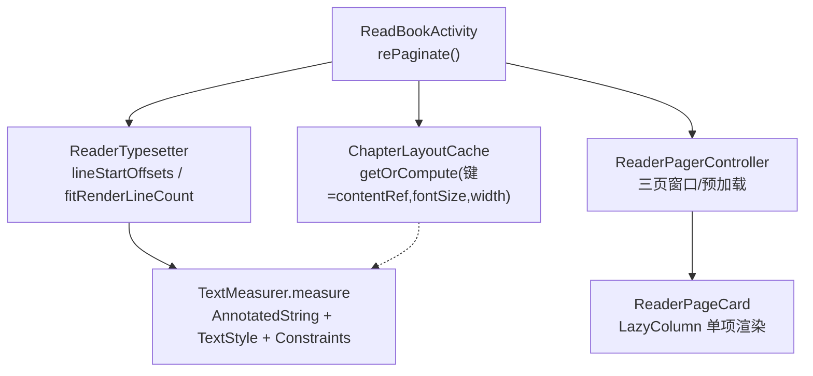
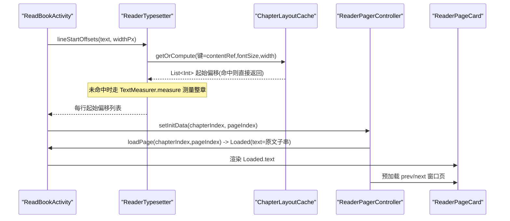
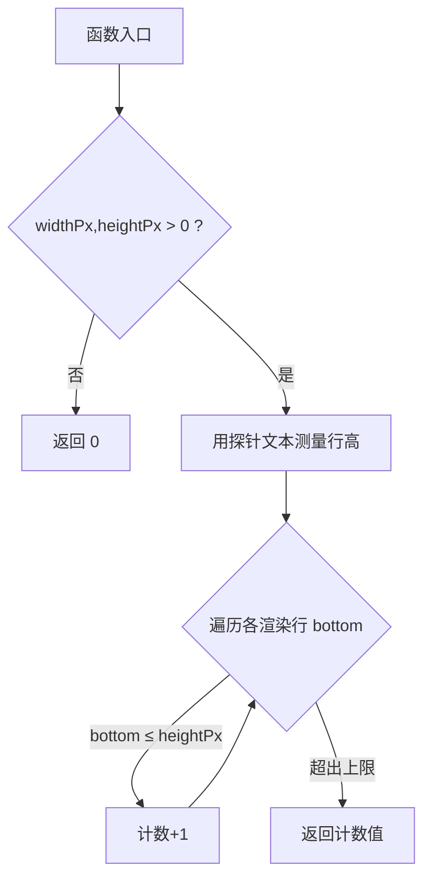
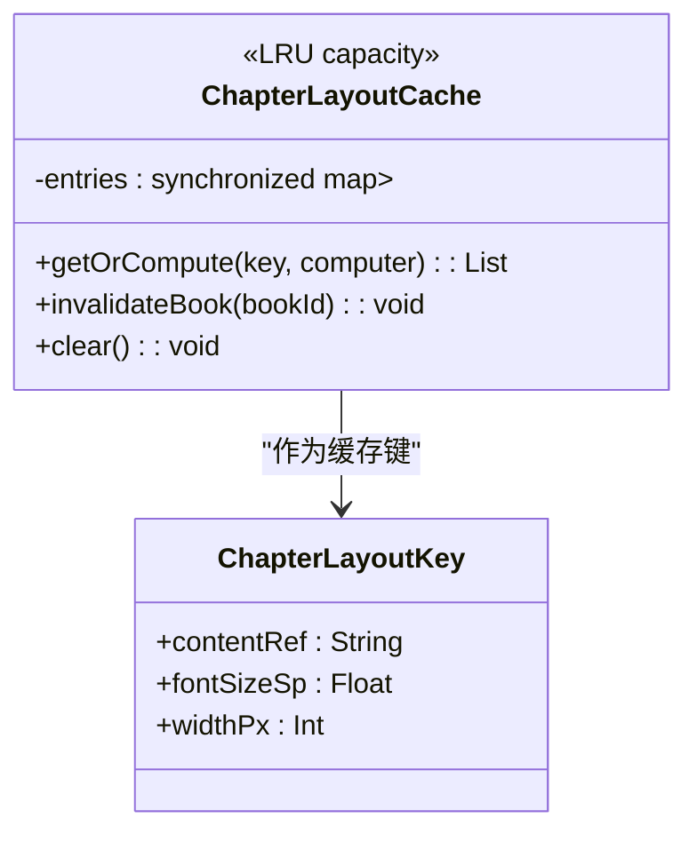
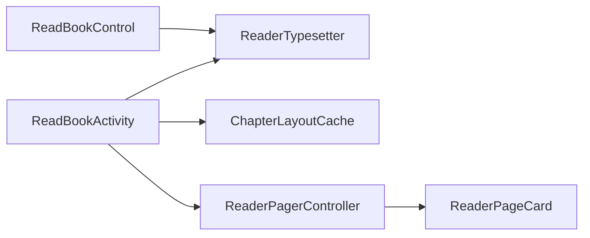

# 文本渲染优化

<cite>
**本文引用的文件**
- [ReaderTypesetter.kt](file://module_book/src/main/java/com/ebook/book/reader/ReaderTypesetter.kt)
- [ChapterLayoutCache.kt](file://module_book/src/main/java/com/ebook/book/reader/ChapterLayoutCache.kt)
- [ChapterLayoutCacheTest.kt](file://module_book/src/test/java/com/ebook/book/reader/ChapterLayoutCacheTest.kt)
- [ReadBookControl.kt](file://module_book/src/main/java/com/ebook/book/view/ReadBookControl.kt)
- [ReadBookActivity.kt](file://module_book/src/main/java/com/ebook/book/ReadBookActivity.kt)
- [ReaderPager.kt](file://module_book/src/main/java/com/ebook/book/reader/ReaderPager.kt)
</cite>

## 目录
1. [引言](#引言)
2. [项目结构](#项目结构)
3. [核心组件](#核心组件)
4. [架构总览](#架构总览)
5. [详细组件分析](#详细组件分析)
6. [依赖关系分析](#依赖关系分析)
7. [性能考量](#性能考量)
8. [故障排查指南](#故障排查指南)
9. [结论](#结论)
10. [附录：配置与样式](#附录配置与样式)

## 引言
本文面向小说阅读器中文本显示的核心技术，聚焦以下目标：
- 统一的排版引擎设计：以 ReaderTypesetter 为唯一分页、测量与断行的事实源，确保“分页与渲染同源”，避免上一行在分页时被切出但渲染时被裁剪导致的掉字。
- 文本分割与断行策略：基于 Compose TextMeasurer 的实际测量，返回每行在原文中的起始偏移；按此偏移将整章拆分为连续、可拼接的页内容片段。
- 自适应字体缩放：通过只读配置的字号档位与行高参数，动态重建排版样式并触发重排。
- 段落格式化处理：统一处理段落分隔符与行间距，保证不同来源的内容（包括换行）在分页与渲染时行为一致。
- 渲染性能优化：使用线程安全的 ChapterLayoutCache 缓存整章排版结果，配合 LazyColumn 虚拟化和页面状态机降低重复计算与重绘。
- 多语言支持与富文本扩展点：通过 AnnotatedString 接入标记信息，便于后续实现下划线、链接、图片等富文本；Unicode 字符交由平台排版管线处理。
- 自定义文本样式配置：从 ReadBookControl 提供用户可调节的字级、段距、配色，驱动排版样式变更。

## 项目结构
围绕文本渲染的关键代码集中在阅读模块 reader 包与阅读器 Activity：
- 排版与测量：ReaderTypesetter（测量、分页、行起始偏移、容纳行数判定）。
- 缓存层：ChapterLayoutCache（章节+字号+宽度维度的内存缓存，线程安全）。
- UI 层：ReaderPager（三页窗口状态机、LazyColumn 列表、ReaderPageCard 单页渲染容器）。
- 控制面：ReadBookControl（字号/段距/背景主题持久化）、ReadBookActivity（重算分页入口 rePaginate）。

图示来源
- [ReaderTypesetter.kt:28-135](file://module_book/src/main/java/com/ebook/book/reader/ReaderTypesetter.kt#L28-L135)
- [ChapterLayoutCache.kt:21-49](file://module_book/src/main/java/com/ebook/book/reader/ChapterLayoutCache.kt#L21-L49)
- [ReadBookActivity.kt:246-300](file://module_book/src/main/java/com/ebook/book/ReadBookActivity.kt#L246-L300)
- [ReaderPager.kt:112-219](file://module_book/src/main/java/com/ebook/book/reader/ReaderPager.kt#L112-L219)
- [ReaderPager.kt:530-545](file://module_book/src/main/java/com/ebook/book/reader/ReaderPager.kt#L530-L545)

节内来源
- [ReadBookActivity.kt:246-300](file://module_book/src/main/java/com/ebook/book/ReadBookActivity.kt#L246-L300)
- [ReaderPager.kt:112-219](file://module_book/src/main/java/com/ebook/book/reader/ReaderPager.kt#L112-L219)

## 核心组件
- ReaderTypesetter：单一排版入口，负责断行偏移、容纳行数测算、组合期记住 TextMeasurer/Density/TextStyle。
- ChapterLayoutCache：对“整章排版偏移”做容量可控的内存缓存，按键淘汰与并发安全。
- ReadBookControl：提供用户可见的字级与段距预设、保存至 SharedPreferences 并在运行期生效。
- ReaderPagerController：维持 prev/dur/next 三页窗口状态，协调加载与动画翻页。
- ReaderPageCard：单页容器，承载标题、正文子串与页码占位，确保三态高度恒定。

节内来源
- [ReaderTypesetter.kt:28-135](file://module_book/src/main/java/com/ebook/book/reader/ReaderTypesetter.kt#L28-L135)
- [ChapterLayoutCache.kt:21-49](file://module_book/src/main/java/com/ebook/book/reader/ChapterLayoutCache.kt#L21-L49)
- [ReadBookControl.kt:13-121](file://module_book/src/main/java/com/ebook/book/view/ReadBookControl.kt#L13-L121)
- [ReaderPager.kt:112-219](file://module_book/src/main/java/com/ebook/book/reader/ReaderPager.kt#L112-L219)
- [ReaderPager.kt:530-545](file://module_book/src/main/java/com/ebook/book/reader/ReaderPager.kt#L530-L545)

## 架构总览
文本渲染以“单一起源的排版引擎”为核心，所有分页决策都经由同一测量器与样式进行，从而避免“切行与渲染不一致”的经典问题。整体流程如下：

图示来源
- [ReaderTypesetter.kt:28-135](file://module_book/src/main/java/com/ebook/book/reader/ReaderTypesetter.kt#L28-L135)
- [ChapterLayoutCache.kt:21-49](file://module_book/src/main/java/com/ebook/book/reader/ChapterLayoutCache.kt#L21-L49)
- [ReaderPager.kt:112-219](file://module_book/src/main/java/com/ebook/book/reader/ReaderPager.kt#L112-L219)
- [ReadBookActivity.kt:246-300](file://module_book/src/main/java/com/ebook/book/ReadBookActivity.kt#L246-L300)

## 详细组件分析

### ReaderTypesetter：单一起源排版引擎
- 设计动机
  - “分页与渲染必须同源”。过去静态布局与渲染管线不一致，导致分页切出的行数与 Compose 重排行数不一致，出现“被裁掉的行上下页都不可见”的问题。现统一到 TextMeasurer 上。
- 关键能力
  - lineStartOffsets：返回每渲染行在原文中的起始偏移，供外层精确取子串；不缓存，调用方按需缓存。
  - fitRenderLineCount：用探针行文本探测最大能容下的渲染行数，避免公式估算误差引发错位。
  - rememberReaderTypesetter：组合期内记住 TextMeasurer、Density、TextStyle（包含 fontSize、lineHeight、对齐与 lineHeightStyle），保证测量与渲染一致性。
- 复杂度
  - 单次调用为 O(章长)，每页都会重跑，因此引入 ChapterLayoutCache 缓存整章偏移。
- 注意事项
  - Compose 对段落分隔符的处理会吞掉部分换行字符；采用“只回偏移”的设计避免丢失段落分隔符，由调用侧在原文切片时原样保留。
- 代码路径参考
  - [lineStartOffsets / fitRenderLineCount](file://module_book/src/main/java/com/ebook/book/reader/ReaderTypesetter.kt#L52-L74)
  - [rememberReaderTypesetter 组合装配](file://module_book/src/main/java/com/ebook/book/reader/ReaderTypesetter.kt#L106-L113)
  - [readerBodyTextStyle 唯一样式构造](file://module_book/src/main/java/com/ebook/book/reader/ReaderTypesetter.kt#L127-L135)

节内来源
- [ReaderTypesetter.kt:28-135](file://module_book/src/main/java/com/ebook/book/reader/ReaderTypesetter.kt#L28-L135)

#### 流程图：fitRenderLineCount

图示来源
- [ReaderTypesetter.kt:65-74](file://module_book/src/main/java/com/ebook/book/reader/ReaderTypesetter.kt#L65-L74)

### ChapterLayoutCache：线程安全排版偏移缓存
- 缓存键语义
  - 同章 + 同字号 + 同宽度，视为同一切片维度。漏掉任一字段会导致字号或宽度变更后仍命中旧缓存，产生“页数与折行错乱”。
- 并发与失效
  - 使用 Collections.synchronizedMap 保护底层 LinkedHashMap，并提供带锁范围的 getOrCompute，防止“先查后写”带来的重复计算。
  - 支持按 bookId 清理对应章节的缓存条目，关联到 BookStore 的文件命名约定。
- 容量策略
  - 默认容量约覆盖当前章及前后两章，LRU 淘汰最久未使用项。
- 测试验证
  - 相同键只计算一次；字号变更产生新键；按 bookId 的失效可清空该书本全部章节。
- 代码路径参考
  - [getOrCompute 并发安全获取](file://module_book/src/main/java/com/ebook/book/reader/ChapterLayoutCache.kt#L30-L36)
  - [按书失效接口](file://module_book/src/main/java/com/ebook/book/reader/ChapterLayoutCache.kt#L38-L42)
  - [单元测试断言逻辑](file://module_book/src/test/java/com/ebook/book/reader/ChapterLayoutCacheTest.kt#L12-L46)

图示来源
- [ChapterLayoutCache.kt:6-49](file://module_book/src/main/java/com/ebook/book/reader/ChapterLayoutCache.kt#L6-L49)

节内来源
- [ChapterLayoutCache.kt:6-49](file://module_book/src/main/java/com/ebook/book/reader/ChapterLayoutCache.kt#L6-L49)
- [ChapterLayoutCacheTest.kt:12-46](file://module_book/src/test/java/com/ebook/book/reader/ChapterLayoutCacheTest.kt#L12-L46)

### 分页与渲染链路：ReadBookActivity 与 ReaderPager
- 重算入口
  - rePaginate(typesetter, startFromCurrent)：在宽度和样式变化时重新计算分页，保持页面与排版一致。
- 三页窗口模型
  - dur/prev/next 三页键互异，且不会同时为空；完成回调时刷新 window，自动预加载相邻页。
- 加载与重试
  - ensureLoad 去重进行中任务与已就绪状态；失败可 reload 重试，避免重复拉库或网络。
- 滑动与提交
  - settle 依据阈值决定是否翻页；turnPrev/turnNext 程序化翻页，保持动画与手势期间的一致性。
- 渲染容器
  - ReaderPageCard 三态高度恒定，保证正文区测量可靠；Loaded.text 来自整章原文的连续子串，由 Typesetter 偏移切出。

节内来源
- [ReadBookActivity.kt:246-300](file://module_book/src/main/java/com/ebook/book/ReadBookActivity.kt#L246-L300)
- [ReaderPager.kt:112-219](file://module_book/src/main/java/com/ebook/book/reader/ReaderPager.kt#L112-L219)
- [ReaderPager.kt:530-545](file://module_book/src/main/java/com/ebook/book/reader/ReaderPager.kt#L530-L545)

### 自适应字体缩放与段落格式
- 字号与段距
  - ReadBookControl 维护多档字号与段距（textSize/textExtra）以及配色方案，落盘 SP，并在阅读器运行时生效。
- 样式同步
  - rememberReaderTypesetter 接收 textSizeSp 与 lineHeight（单行字高+段距）构造 TextStyle；当用户切换字级时，上层应触发 rePaginate 使分页与渲染再次对齐。
- 段落处理
  - Typesetter 通过偏移切分原文，保证段落分隔符不被丢字；渲染端按同一宽度重排，获得一致折行。

节内来源
- [ReadBookControl.kt:13-121](file://module_book/src/main/java/com/ebook/book/view/ReadBookControl.kt#L13-L121)
- [ReaderTypesetter.kt:106-135](file://module_book/src/main/java/com/ebook/book/reader/ReaderTypesetter.kt#L106-L135)
- [ReaderTypesetter.kt:52-74](file://module_book/src/main/java/com/ebook/book/reader/ReaderTypesetter.kt#L52-L74)

### 渲染性能与虚拟化
- 计算开销收敛
  - 通过 ChapterLayoutCache 减少同章翻页时的重复测量，仅在 key（章节/字号/宽度）变化时重算。
- UI 虚拟化
  - 列表展示使用 LazyColumn（章节列表、下载管理等场景），按需创建项并保持滚动高效。
- 页面状态机
  - ReaderPagerController 以三页窗口限制常驻 UI，避免一次性构建过多项；在途 Job 管理与窗口收敛保证动画与加载无冲突。
- 重绘规避
  - ReaderPageCard 三态固定高度，防止测量抖动导致不必要的重排；Loading/Error/Loaded 三者共用稳定布局边界。

节内来源
- [ChapterLayoutCache.kt:21-49](file://module_book/src/main/java/com/ebook/book/reader/ChapterLayoutCache.kt#L21-L49)
- [ReaderPager.kt:112-219](file://module_book/src/main/java/com/ebook/book/reader/ReaderPager.kt#L112-L219)
- [ReaderPager.kt:530-545](file://module_book/src/main/java/com/ebook/book/reader/ReaderPager.kt#L530-L545)

### 多语言与富文本支持
- Unicode 支持
  - AnnotatedString 交由 Compose 的排版系统处理字形与宽度，涵盖复杂脚本的基础需求。
- RTL 适配
  - 默认 TextAlign.Start；对于 RTL 内容可按需调整对齐或注入方向性标记，具体扩展点可在 AnnotatedString 中携带方向/范围标记。
- 富文本渲染
  - 现有渲染读取普通字符串并以 AnnotatedString 传入 TextMeasurer；未来如需插入下划线、链接或图片，可通过 AnnotatedString 添加标记与范围，再由渲染处解析呈现。

节内来源
- [ReaderTypesetter.kt:76-81](file://module_book/src/main/java/com/ebook/book/reader/ReaderTypesetter.kt#L76-L81)
- [ReaderTypesetter.kt:127-135](file://module_book/src/main/java/com/ebook/book/reader/ReaderTypesetter.kt#L127-L135)

## 依赖关系分析

图示来源
- [ReadBookControl.kt:13-121](file://module_book/src/main/java/com/ebook/book/view/ReadBookControl.kt#L13-L121)
- [ReaderTypesetter.kt:28-135](file://module_book/src/main/java/com/ebook/book/reader/ReaderTypesetter.kt#L28-L135)
- [ChapterLayoutCache.kt:21-49](file://module_book/src/main/java/com/ebook/book/reader/ChapterLayoutCache.kt#L21-L49)
- [ReadBookActivity.kt:246-300](file://module_book/src/main/java/com/ebook/book/ReadBookActivity.kt#L246-L300)
- [ReaderPager.kt:112-219](file://module_book/src/main/java/com/ebook/book/reader/ReaderPager.kt#L112-L219)
- [ReaderPager.kt:530-545](file://module_book/src/main/java/com/ebook/book/reader/ReaderPager.kt#L530-L545)

节内来源
- [ReadBookActivity.kt:246-300](file://module_book/src/main/java/com/ebook/book/ReadBookActivity.kt#L246-L300)

## 性能考量
- 主要瓶颈
  - lineStartOffsets 整章测量 O(章长)，每页调用会在大章上放大 CPU 开销。
- 优化要点
  - 通过 ChapterLayoutCache 以（章节, 字号, 宽度）为键缓存偏移列表，显著降低翻页期间的重复测量。
  - 使用 fitRenderLineCount 探针替代公式估算，减少因测量误差导致的反复重排。
  - 三页窗口模型与 LazyColumn 虚拟化限制常驻 UI 节点数量，提升滚动稳定性。
- 潜在进一步优化
  - 对超长章节可在“章节+字号”维度进一步细化缓存粒度。
  - 将字体家族、字母间距等更多样式纳入缓存键，避免样式变更后的多次全量重排。

[本节为通用性能讨论，不直接引用特定文件]

## 故障排查指南
- “翻页内容接不上/少了一段”
  - 原因：分页与渲染两套样式/算法导致折行不一致。检查是否统一使用 ReaderTypesetter 提供的偏移进行切片与渲染。
  - 验证：确认 rememberReaderTypesetter 生成的 TextStyle 与渲染处一致；字号/行高变化后调用了 rePaginate。
  - 代码路径参考：
    - [ReaderTypesetter 唯一样式](file://module_book/src/main/java/com/ebook/book/reader/ReaderTypesetter.kt#L127-L135)
    - [ReadBookActivity rePaginate](file://module_book/src/main/java/com/ebook/book/ReadBookActivity.kt#L246-L300)
- “用户改字号后页面无响应或错乱”
  - 原因：缓存键未包含字号变化。核查 ChapterLayoutCache 的键组成与失效时机。
  - 代码路径参考：
    - [ChapterLayoutCache 键定义](file://module_book/src/main/java/com/ebook/book/reader/ChapterLayoutCache.kt#L6-L8)
    - [ChapterLayoutCache 并发保护](file://module_book/src/main/java/com/ebook/book/reader/ChapterLayoutCache.kt#L30-L36)
- “章节太长时明显卡顿”
  - 原因：每次翻页重排整章。核查是否命中 ChapterLayoutCache。
  - 建议：扩大合理容量或增加“章节+字号”维度缓存。
- “加载中/错误页高度不一致导致跳动”
  - 原因：ReaderPageCard 三态高度不恒定。确认其占位高度与 Loaded 文本区域一致。
  - 代码路径参考：
    - [ReaderPageCard 三态](file://module_book/src/main/java/com/ebook/book/reader/ReaderPager.kt#L530-L545)

节内来源
- [ReaderTypesetter.kt:127-135](file://module_book/src/main/java/com/ebook/book/reader/ReaderTypesetter.kt#L127-L135)
- [ReadBookActivity.kt:246-300](file://module_book/src/main/java/com/ebook/book/ReadBookActivity.kt#L246-L300)
- [ChapterLayoutCache.kt:6-36](file://module_book/src/main/java/com/ebook/book/reader/ChapterLayoutCache.kt#L6-L36)
- [ReaderPager.kt:530-545](file://module_book/src/main/java/com/ebook/book/reader/ReaderPager.kt#L530-L545)

## 结论
本项目通过 ReaderTypesetter 确立“单一起源”的排版引擎，结合 ChapterLayoutCache 的线程安全缓存与 ReaderPager 的三页窗口状态机，实现了高性能、稳定的文本分页与渲染体系。以统一的 TextStyle 与 TextMeasurer 测量保障分页和视觉一致；以 LRU 缓存与惰性加载避免不必要的 CPU 与 GPU 压力；以 ReadBookControl 的用户配置支撑自适应字号与段落间距，满足阅读体验的可定制性。在多语言与富文本层面保留了可扩展空间，便于后续增强功能。

## 附录：配置与样式
- 文本样式来源
  - readerBodyTextStyle 封装 fontSize、lineHeight、对齐与 lineHeightStyle，保证测量与渲染一致。
- 用户可配置项
  - 字号档位与段距：ReadBookControl.TextKind 提供多档，选择后实时生效并通过 SP 持久化。
  - 配色主题：可切换背景/文字颜色，便于夜间/护眼模式。
- 样式更新联动
  - 任何影响折行与行高的样式变化，都应触发 rePaginate 重新分页，保证正文连续。

节内来源
- [ReaderTypesetter.kt:127-135](file://module_book/src/main/java/com/ebook/book/reader/ReaderTypesetter.kt#L127-L135)
- [ReadBookControl.kt:13-121](file://module_book/src/main/java/com/ebook/book/view/ReadBookControl.kt#L13-L121)
- [ReadBookActivity.kt:246-300](file://module_book/src/main/java/com/ebook/book/ReadBookActivity.kt#L246-L300)