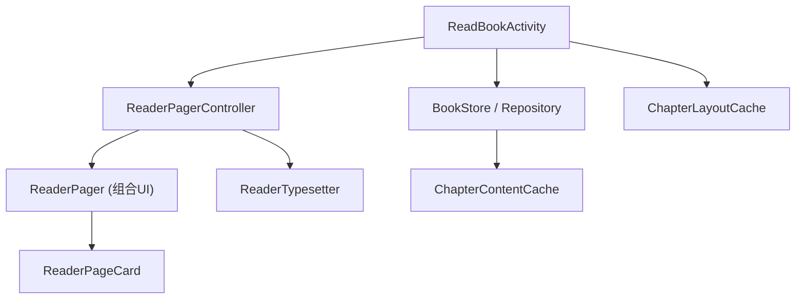
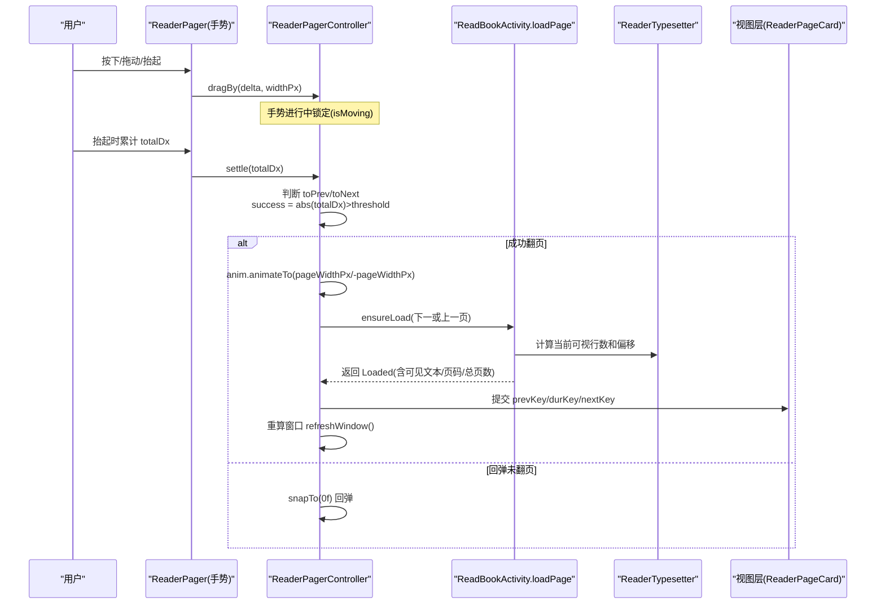
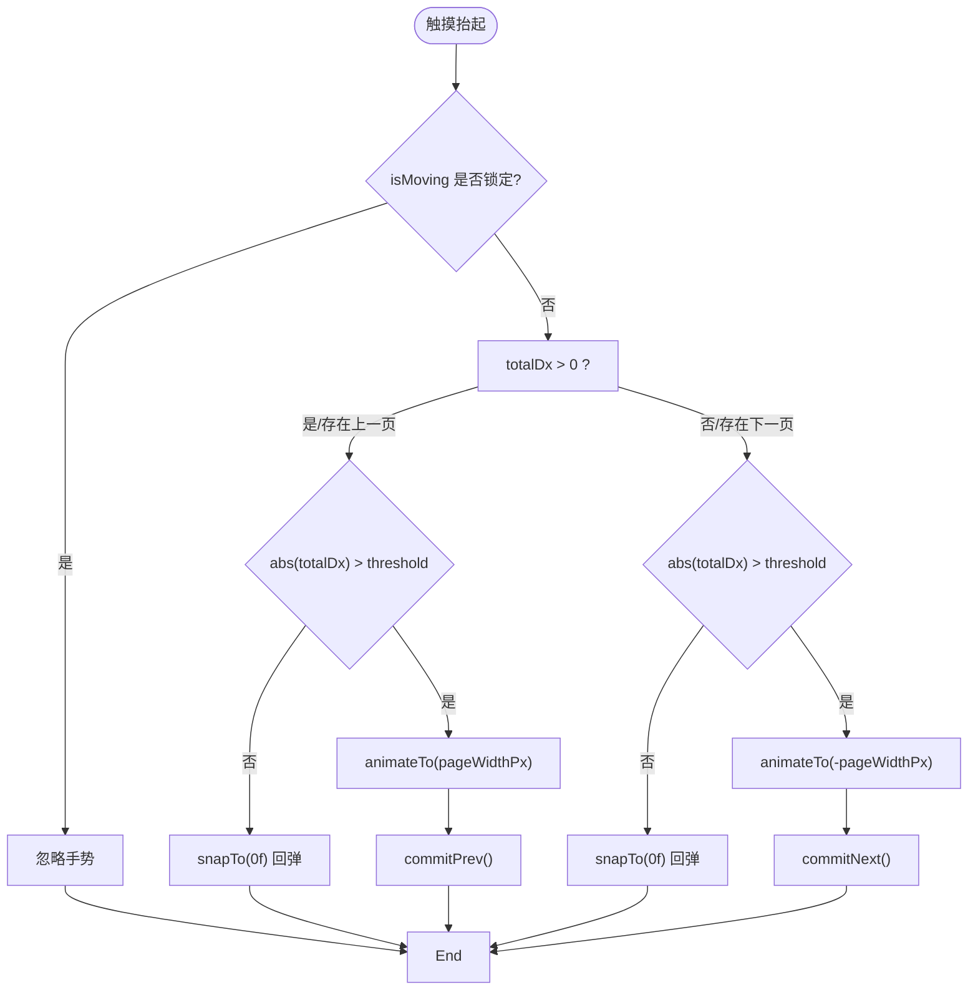
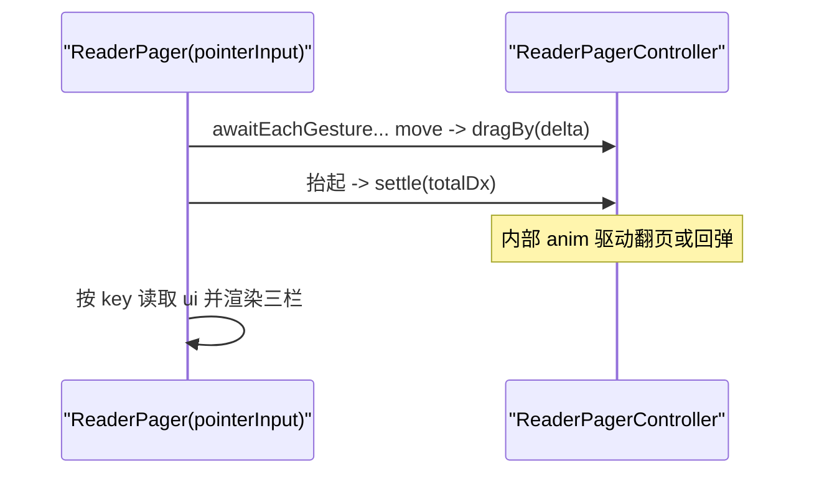
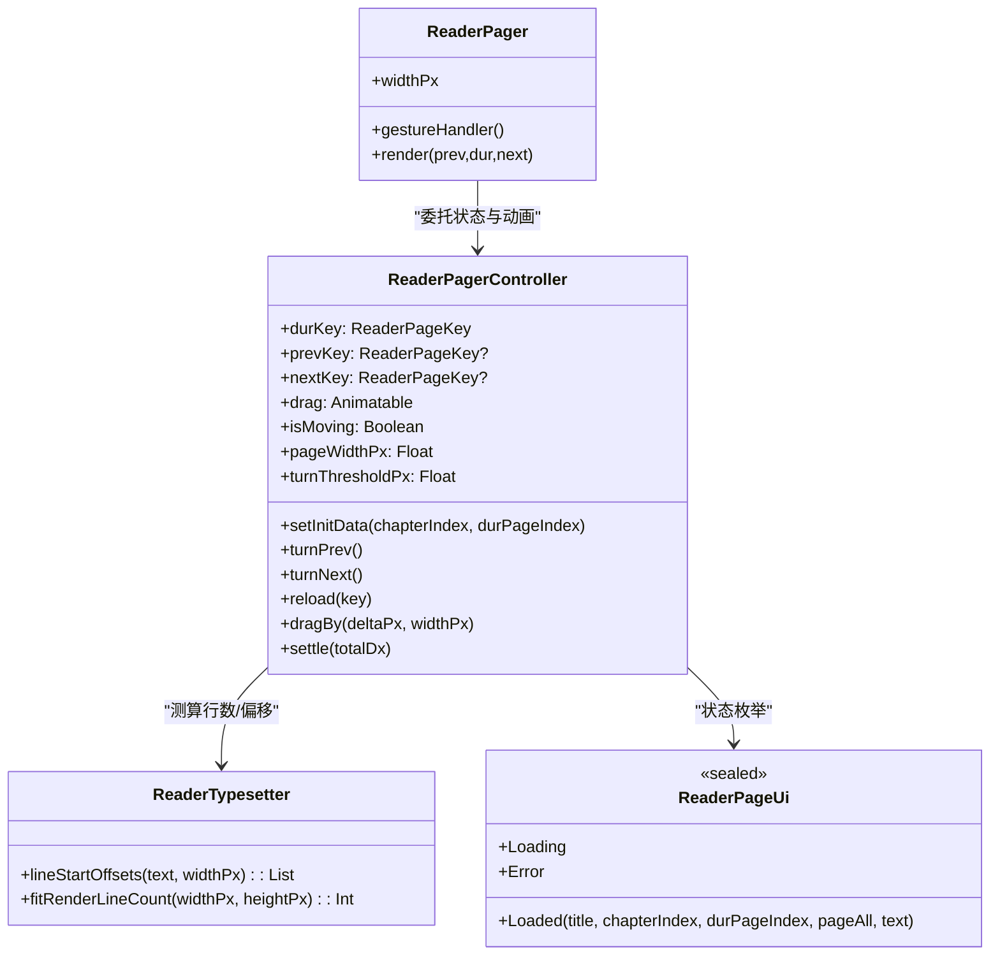
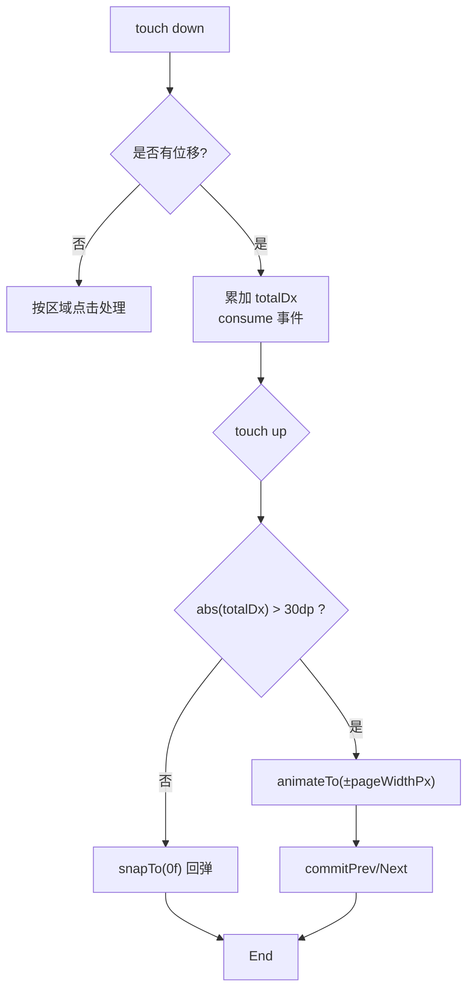
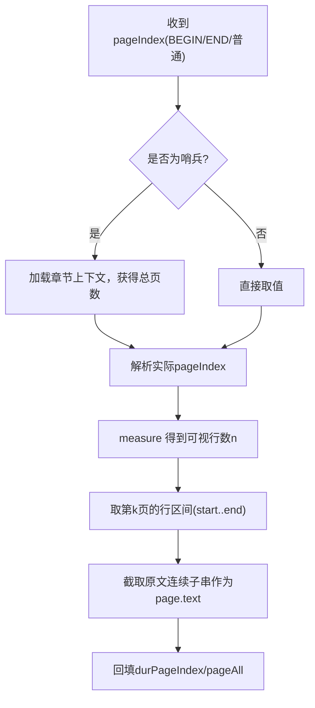
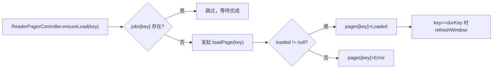

# 翻页效果实现

<cite>
**本文引用的文件**
- [module_book/src/main/java/com/ebook/book/reader/ReaderPager.kt](file://module_book/src/main/java/com/ebook/book/reader/ReaderPager.kt)
- [module_book/src/test/java/com/ebook/book/reader/ReaderPagerControllerTest.kt](file://module_book/src/test/java/com/ebook/book/reader/ReaderPagerControllerTest.kt)
- [module_book/src/main/java/com/ebook/book/reader/ChapterLayoutCache.kt](file://module_book/src/main/java/com/ebook/book/reader/ChapterLayoutCache.kt)
- [lib_book_common/src/main/java/com/ebook/common/store/ChapterContentCache.kt](file://lib_book_common/src/main/java/com/ebook/common/store/ChapterContentCache.kt)
- [module_book/src/main/java/com/ebook/book/ReadBookActivity.kt](file://module_book/src/main/java/com/ebook/book/ReadBookActivity.kt)
- [module_book/src/main/java/com/ebook/book/reader/ReaderTypesetter.kt](file://module_book/src/main/java/com/ebook/book/reader/ReaderTypesetter.kt)
- [module_book/src/main/java/com/ebook/book/reader/ReaderPanels.kt](file://module_book/src/main/java/com/ebook/book/reader/ReaderPanels.kt)
</cite>

## 目录
1. [引言](#引言)
2. [项目结构与职责划分](#项目结构与职责划分)
3. [核心组件总览](#核心组件总览)
4. [架构概览](#架构概览)
5. [详细组件分析](#详细组件分析)
6. [依赖关系与数据流](#依赖关系与数据流)
7. [手势识别与动画实现](#手势识别与动画实现)
8. [分页算法与排版契约](#分页算法与排版契约)
9. [性能优化：预加载、复用与回收](#性能优化预加载复用与回收)
10. [配置项与扩展接口](#配置项与扩展接口)
11. [故障排查指南](#故障排查指南)
12. [结论](#结论)

## 引言
本文聚焦阅读器的翻页效果实现，围绕 ReaderPager 及其控制器 ReaderPagerController 的“三页窗口状态机”展开，系统阐述页面滑动切换的动画机制（惯性/阻尼/边界反弹）、手势识别与区分（点击/滑动/长按）、页面状态管理（当前页码/总页数/加载态的数据流转），以及分页算法、章节分割和缓存策略。最后给出自定义动画配置的说明与扩展建议。

## 项目结构与职责划分
- 翻页交互与动画：由 ReaderPager（组合式 UI 容器）与 ReaderPagerController（状态机与调度）协作完成。
- 页面渲染：ReaderPageCard（加载中/失败/已加载）统一展示页内容；文本断行与排版由 ReaderTypesetter 提供。
- 数据获取：ReadBookActivity.loadPage 将正文→排版偏移→分页切片→返回单页可见文本给控制器。
- 缓存与资源：ChapterContentCache（正文内存缓存）+ ChapterLayoutCache（整章排版偏移缓存）。

**图表来源**
- [module_book/src/main/java/com/ebook/book/ReadBookActivity.kt:266-332](file://module_book/src/main/java/com/ebook/book/ReadBookActivity.kt#L266-L332)
- [module_book/src/main/java/com/ebook/book/reader/ReaderPager.kt:112-344](file://module_book/src/main/java/com/ebook/book/reader/ReaderPager.kt#L112-L344)
- [module_book/src/main/java/com/ebook/book/reader/ReaderTypesetter.kt:28-94](file://module_book/src/main/java/com/ebook/book/reader/ReaderTypesetter.kt#L28-L94)

**本节来源**
- [module_book/src/main/java/com/ebook/book/ReadBookActivity.kt:266-332](file://module_book/src/main/java/com/ebook/book/ReadBookActivity.kt#L266-L332)
- [module_book/src/main/java/com/ebook/book/reader/ReaderPager.kt:64-146](file://module_book/src/main/java/com/ebook/book/reader/ReaderPager.kt#L64-L146)
- [module_book/src/main/java/com/ebook/book/reader/ReaderTypesetter.kt:17-56](file://module_book/src/main/java/com/ebook/book/reader/ReaderTypesetter.kt#L17-L56)

## 核心组件总览
- ReaderPagerController：维护 durKey/prevKey/nextKey 三键窗口、拖拽位移 Animatable.drag、翻页锁 isMoving、页面状态 map pages 与在途任务 jobs。对外暴露 setInitData/turnPrev/turnNext/reload/dragBy/settle。
- ReaderPager：测量容器宽度、设置阈值 pageWidthPx/turnThresholdPx，通过 Compose 手势管道把 touch 事件转为 dragBy + settle，按窗口 key 渲染对应页。
- ReaderPageUi 与 ReaderPageCard：封装 Loading/Error/Laoded，Loaded 内含标题/章节索引/持久化页码/总页数/页可见文本。
- ReaderTypesetter：唯一排版事实源（字号/行高/对齐），提供 lineStartOffsets（断行起始偏移）和 fitRenderLineCount（正文区可容纳行数）。

**本节来源**
- [module_book/src/main/java/com/ebook/book/reader/ReaderPager.kt:71-149](file://module_book/src/main/java/com/ebook/book/reader/ReaderPager.kt#L71-L149)
- [module_book/src/main/java/com/ebook/book/reader/ReaderTypesetter.kt:52-74](file://module_book/src/main/java/com/ebook/book/reader/ReaderTypesetter.kt#L52-L74)

## 架构概览
下图展示了从用户操作到页面翻页、再到数据加载与渲染的完整时序。

**图表来源**
- [module_book/src/main/java/com/ebook/book/reader/ReaderPager.kt:220-299](file://module_book/src/main/java/com/ebook/book/reader/ReaderPager.kt#L220-L299)
- [module_book/src/main/java/com/ebook/book/reader/ReaderPager.kt:377-409](file://module_book/src/main/java/com/ebook/book/reader/ReaderPager.kt#L377-L409)
- [module_book/src/main/java/com/ebook/book/ReadBookActivity.kt:266-332](file://module_book/src/main/java/com/ebook/book/ReadBookActivity.kt#L266-L332)
- [module_book/src/main/java/com/ebook/book/reader/ReaderTypesetter.kt:65-74](file://module_book/src/main/java/com/ebook/book/reader/ReaderTypesetter.kt#L65-L74)

## 详细组件分析

### ReaderPagerController：三页窗口状态机
- 窗口语义
  - durKey：当前页
  - prevKey：上一页（无则为 null）
  - nextKey：下一页（无则为 null）
  - 布局模型：当前页居中显示；下一页绘制在底层（向前翻时当前页左移露出）；上一页绘制在上层（向后翻时从左侧滑入覆盖）。
- 关键状态与字段
  - drag：Animatable<Float>，横向位移 px。
  - isMoving：保护动画期手势与程序翻页互斥。
  - pageWidthPx/turnThresholdPx：容器宽与 30dp 转像素的成功阈值。
  - pages/jobs：页面去重与在途任务控制。
- 核心流程
  - setInitData(chapterIndex, durPageIndex)：清空在途任务与缓存，定位到哨兵页码并立即回调进度，驱动菜单标题与章节滑条更新。
  - ensureLoad(key)：若 jobs 不含该键则登记新协程，调用 loadPage，成功后写入 pages[key]=Loaded，并仅在 key==durKey 时刷新窗口；失败写入 Error。
  - commitNext()/commitPrev()：提交翻页后清理窗格外任务与状态，确保 prevKey/nextKey 不 self-reference；未知方向收敛为 null，保持窗口连通性。
  - reload(key)：取消旧 job 并重新 ensureLoad，用于错误页重试。
  - dragBy/drag：在 isMoving=false 时根据 prevKey/nextKey 的可访问性允许左右拖动；settle(totalDx) 依据阈值判断是否翻页，否则回弹。

**图表来源**
- [module_book/src/main/java/com/ebook/book/reader/ReaderPager.kt:220-337](file://module_book/src/main/java/com/ebook/book/reader/ReaderPager.kt#L220-L337)

**本节来源**
- [module_book/src/main/java/com/ebook/book/reader/ReaderPager.kt:92-149](file://module_book/src/main/java/com/ebook/book/reader/ReaderPager.kt#L92-L149)
- [module_book/src/main/java/com/ebook/book/reader/ReaderPager.kt:155-337](file://module_book/src/main/java/com/ebook/book/reader/ReaderPager.kt#L155-L337)

### ReadBookActivity.loadPage：数据与分页
- 作用：读取正文 → 调用 typesetter 获取每行起始偏移 → 基于可视高度切出当前页可见文本子串 → 填充 ReaderPageUi.Loaded（标题/章节索引/持久化页码/总页数/正文片段）。
- 关键点
  - 以 ReaderTypesetter 为唯一样式源，保证测算行与渲染一致，避免“上下页接不上”。
  - 支持哨兵页码（DUR_PAGE_INDEX_BEGIN/DUR_PAGE_INDEX_END），最终被解析为真实页码并钳制到末页范围。
  - 异常返回 null，控制器置 Error 态。

**本节来源**
- [module_book/src/main/java/com/ebook/book/ReadBookActivity.kt:266-332](file://module_book/src/main/java/com/ebook/book/ReadBookActivity.kt#L266-L332)

### ReaderTypesetter：排版与分页度量
- 提供 lineStartOffsets(text, widthPx) 得到每一行的起始位置，配合原文截取，避免段落分隔符丢失导致重排错乱。
- fitRenderLineCount(widthPx, heightPx) 用“探针”实测正文字体几何，精确得出可视区域能放多少行。
- readerBodyTextStyle 固定字体样式与行高策略，确保“测量端=渲染端”。

**本节来源**
- [module_book/src/main/java/com/ebook/book/reader/ReaderTypesetter.kt:17-56](file://module_book/src/main/java/com/ebook/book/reader/ReaderTypesetter.kt#L17-L56)
- [module_book/src/main/java/com/ebook/book/reader/ReaderTypesetter.kt:65-74](file://module_book/src/main/java/com/ebook/book/reader/ReaderTypesetter.kt#L65-L74)

### ReaderPager 组合层：手势与渲染绑定
- 尺寸接入：onSizeChanged 或 LaunchedEffect 传入 widthPx，设置 controller.pageWidthPx/turnThresholdPx=30dp。
- 手势处理：awaitEachGesture/awaitFirstDown 追踪 start/move/end，累计 deltaX；moved 消费事件并调用 controller.dragBy；抬起调用 settle。
- 页面展示：按 controller.uiOf(prevKey/durKey/nextKey) 渲染三个卡片，使用 offset 进行层叠。
- 点击区域：三分区判定（左/中/右）决定是否触发翻页或显示菜单（受开关控制）。

**图表来源**
- [module_book/src/main/java/com/ebook/book/reader/ReaderPager.kt:377-409](file://module_book/src/main/java/com/ebook/book/reader/ReaderPager.kt#L377-L409)
- [module_book/src/main/java/com/ebook/book/reader/ReaderPager.kt:491-515](file://module_book/src/main/java/com/ebook/book/reader/ReaderPager.kt#L491-L515)

**本节来源**
- [module_book/src/main/java/com/ebook/book/reader/ReaderPager.kt:377-515](file://module_book/src/main/java/com/ebook/book/reader/ReaderPager.kt#L377-L515)

## 依赖关系与数据流
- 控制器依赖：CoroutineScope（调度协程）、Context（提示/资源）、chapterSize/title（章节元数据）、loadPage（IO/排版）、onProgress（回调进度）。
- 渲染链路：ReaderPageUi.Loaded.text 是章节连续子串，由 ReaderTypesetter 切分而来，保证段与段之间的原样拼接。
- 进度同步：setInitData、turnPrev/turnNext 后均会 onProgress(chapterIndex, pageIndex)，用于顶栏标题与章节滑条更新。

**图表来源**
- [module_book/src/main/java/com/ebook/book/reader/ReaderPager.kt:112-149](file://module_book/src/main/java/com/ebook/book/reader/ReaderPager.kt#L112-L149)
- [module_book/src/main/java/com/ebook/book/reader/ReaderTypesetter.kt:28-56](file://module_book/src/main/java/com/ebook/book/reader/ReaderTypesetter.kt#L28-L56)
- [module_book/src/main/java/com/ebook/book/reader/ReaderPager.kt:71-90](file://module_book/src/main/java/com/ebook/book/reader/ReaderPager.kt#L71-L90)

**本节来源**
- [module_book/src/main/java/com/ebook/book/reader/ReaderPager.kt:112-149](file://module_book/src/main/java/com/ebook/book/reader/ReaderPager.kt#L112-L149)

## 手势识别与动画实现
- 手势识别
  - 基于 awaitEachGesture/awaitFirstDown 捕获 down/move/up，累计 delta 并在 moved=true 时消费事件以避免冲突。
  - 点击检测：在未发生移动的情况下，按屏幕左/中/右区域命中决定是否翻页（受“点击翻页”开关约束）与是否唤出菜单。
- 动画与物理效果
  - 拖拽阶段：直接根据滚动增量更新 drag，无速度积分惯性；达到阈值即进入动画过渡。
  - 阻尼/回弹：未达阈值的滑动将执行 snapTo(0f) 回弹，形成“边界阻尼”感。
  - 翻页动画：AnimateTo 至 +/- pageWidthPx，随后 commit 并 reset drag。
  - 锁保护：isMoving 阻止并发动画/手势，保证稳定收敛。

**图表来源**
- [module_book/src/main/java/com/ebook/book/reader/ReaderPager.kt:387-409](file://module_book/src/main/java/com/ebook/book/reader/ReaderPager.kt#L387-L409)
- [module_book/src/main/java/com/ebook/book/reader/ReaderPager.kt:237-299](file://module_book/src/main/java/com/ebook/book/reader/ReaderPager.kt#L237-L299)

**本节来源**
- [module_book/src/main/java/com/ebook/book/reader/ReaderPager.kt:384-409](file://module_book/src/main/java/com/ebook/book/reader/ReaderPager.kt#L384-L409)
- [module_book/src/main/java/com/ebook/book/reader/ReaderPager.kt:237-299](file://module_book/src/main/java/com/ebook/book/reader/ReaderPager.kt#L237-L299)

## 分页算法与排版契约
- 章节分割与页码
  - 入口可能是“章节首页/末页”的哨兵页码（BEGIN/END），在分页完成后被解析为具体页码；越界页码会被钳到末页。
- 行数测算
  - 以正文区实测高度与样式一致的 TextMeasurer 输出，逐行扫描得到最大可容纳行数（fitRenderLineCount），避免估算公式误差导致的溢出与丢失。
- 页切片
  - 用 lineStartOffsets 拿到每行在原文中的起始偏移，基于当前页起止行数截取出连续子串作为 ReaderPageUi.Loaded.text；相邻页首尾相接且段落分隔符保留。
- 窗口与相邻页
  - 翻页前尝试加载 prev/dur/next 三页，当目标页仍在加载中或失败时，采用“未知方向收敛为 null”的保守收敛，防止自指导致空转或死页。

**图表来源**
- [module_book/src/main/java/com/ebook/book/ReadBookActivity.kt:266-332](file://module_book/src/main/java/com/ebook/book/ReadBookActivity.kt#L266-L332)
- [module_book/src/main/java/com/ebook/book/reader/ReaderTypesetter.kt:52-74](file://module_book/src/main/java/com/ebook/book/reader/ReaderTypesetter.kt#L52-L74)

**本节来源**
- [module_book/src/main/java/com/ebook/book/ReadBookActivity.kt:266-332](file://module_book/src/main/java/com/ebook/book/ReadBookActivity.kt#L266-L332)
- [module_book/src/main/java/com/ebook/book/reader/ReaderTypesetter.kt:52-74](file://module_book/src/main/java/com/ebook/book/reader/ReaderTypesetter.kt#L52-L74)

## 性能优化：预加载、复用与回收
- 章节正文缓存：ChapterContentCache 以 content_ref 为键缓存整章原文，容量默认覆盖“当前章 + 前后各一章”，减少重复 IO；同一书的失效通过 BookStore.cacheMarker 片段匹配清理。
- 排版偏移缓存：ChapterLayoutCache 保存同章在同一字号与宽度下的整章偏移表，容量默认约“当前章 + 前后各两章”；避免同章多页翻页时反复 O(章长) 重排。
- 窗口裁剪：ReaderPager 只维护 prev/dur/next 三个页的 UI 状态与 in-flight job，超出窗口外的自动 prune，降低内存占用。
- 去重请求：jobs 以 ReaderPageKey 为键保证同一时刻一个 key 仅一个在途任务；Loaded 结果直接复用不会因窗口刷新重复抓数据。

**图表来源**
- [module_book/src/main/java/com/ebook/book/reader/ReaderPager.kt:176-199](file://module_book/src/main/java/com/ebook/book/reader/ReaderPager.kt#L176-L199)
- [lib_book_common/src/main/java/com/ebook/common/store/ChapterContentCache.kt:21-49](file://lib_book_common/src/main/java/com/ebook/common/store/ChapterContentCache.kt#L21-L49)
- [module_book/src/main/java/com/ebook/book/reader/ChapterLayoutCache.kt:21-44](file://module_book/src/main/java/com/ebook/book/reader/ChapterLayoutCache.kt#L21-L44)

**本节来源**
- [module_book/src/main/java/com/ebook/book/reader/ReaderPager.kt:176-199](file://module_book/src/main/java/com/ebook/book/reader/ReaderPager.kt#L176-L199)
- [lib_book_common/src/main/java/com/ebook/common/store/ChapterContentCache.kt:21-49](file://lib_book_common/src/main/java/com/ebook/common/store/ChapterContentCache.kt#L21-L49)
- [module_book/src/main/java/com/ebook/book/reader/ChapterLayoutCache.kt:21-44](file://module_book/src/main/java/com/ebook/book/reader/ChapterLayoutCache.kt#L21-L44)

## 配置项与扩展接口
- 阅读器容器配置
  - 翻页成功阈值：turnThresholdPx（30dp），由 ReaderPager 写入，可直接替换为其他常量或配置。
  - 页面宽度：pageWidthPx，由测量值注入，影响动画与手势阈值判定比例。
- 外观与排版
  - ReaderPageTokens.pageNumberRowHeight 固定页码行高，保障 Loading/Error/Loaded 三态占位一致，确保每页行数稳定。
  - ReaderTypesetter.readerBodyTextStyle 固定正文样式（字号、行高、对齐与行高裁剪），保证测算与渲染一致。
- 行为扩展
  - 点击区域与菜单：ReaderPager 中“左右三分之一”点击策略可在组合层调整以适配不同交互习惯。
  - 音量/键盘翻页：通过外部桥接到 turnPrev/turnNext 即可复用现有逻辑。
- 数据源与分页契约
  - loadPage(chapterIndex, pageIndex) 的签名与返回值必须满足：返回 ReaderPageUi.Loaded?；失败返回 null；包含持久化页码与总页数；哨兵页码最终需解析为真实页码。
  - onProgress 的回调参数为章节索引与持久化页码，用于更新 UI（章节滑条/标题等）。

**本节来源**
- [module_book/src/main/java/com/ebook/book/reader/ReaderPager.kt:139-143](file://module_book/src/main/java/com/ebook/book/reader/ReaderPager.kt#L139-L143)
- [module_book/src/main/java/com/ebook/book/reader/ReaderPager.kt:508-515](file://module_book/src/main/java/com/ebook/book/reader/ReaderPager.kt#L508-L515)
- [module_book/src/main/java/com/ebook/book/reader/ReaderTypesetter.kt:116-135](file://module_book/src/main/java/com/ebook/book/reader/ReaderTypesetter.kt#L116-L135)

## 故障排查指南
- 问题：向后翻无响应或停留在同一页
  - 现象：次一页 key=self-reference，产生空转。
  - 原因：commitNext 或 refreshWindow 时未发现有效下一页，或窗口收敛策略出错。
  - 解决：检查 commitNext/commitPrev 的收敛规则（未知方向应收敛为 null），并确保来路页保留为相邻方向。
- 问题：失败页成为“死页”无法后退
  - 现象：翻向失败页后 prevKey 被误清空。
  - 原因：窗口重算未保留来路页。
  - 解决：确保失败页仍保留上一页/下一页之一，使得用户可以退回再重试。
- 问题：页面加载缓慢、CPU 飙升
  - 可能原因：未启用排版偏移缓存或章节正文缓存；超长章节多次整章重排。
  - 解决：确保 ChapterLayoutCache/ChapterContentCache 生效；必要时扩容容量。
- 问题：上下页内容接不上
  - 可能原因：测算与渲染使用不同样式（TextMeasurer vs Compose Text），造成折行不一致。
  - 解决：统一使用 ReaderTypesetter 提供的样式与测量方法。

**本节来源**
- [module_book/src/test/java/com/ebook/book/reader/ReaderPagerControllerTest.kt:65-112](file://module_book/src/test/java/com/ebook/book/reader/ReaderPagerControllerTest.kt#L65-L112)
- [module_book/src/test/java/com/ebook/book/reader/ReaderPagerControllerTest.kt:133-175](file://module_book/src/test/java/com/ebook/book/reader/ReaderPagerControllerTest.kt#L133-L175)
- [module_book/src/main/java/com/ebook/book/reader/ReaderTypesetter.kt:116-135](file://module_book/src/main/java/com/ebook/book/reader/ReaderTypesetter.kt#L116-L135)

## 结论
ReaderPager 基于 Compose 手势与 Animatable 实现稳定的三页窗口翻页体验：手势拖动实时反馈，抬起超过阈值则进入过渡动画，不足则弹性回弹。控制器维持 durable/previous/next 三键窗口与在途任务去重，配合 ReaderTypesetter 的统一排版语义，确保分页切片与渲染一致。两层缓存（正文与排版偏移）显著降低 IO 与 CPU 开销，避免超大章节的多页重排成本。通过配置阈值、样式与输入钩子，可灵活定制阅读体验并向下兼容既有业务契约。