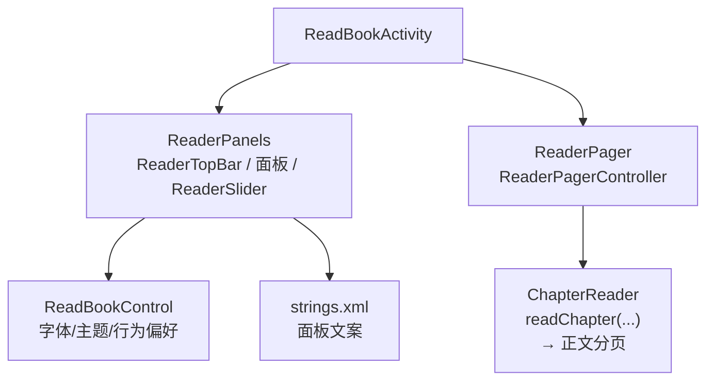
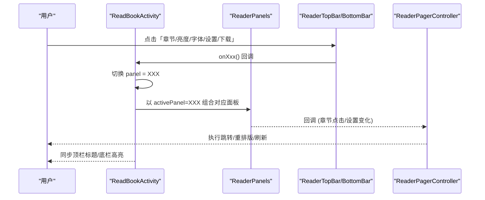
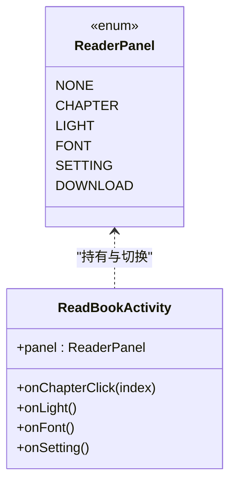
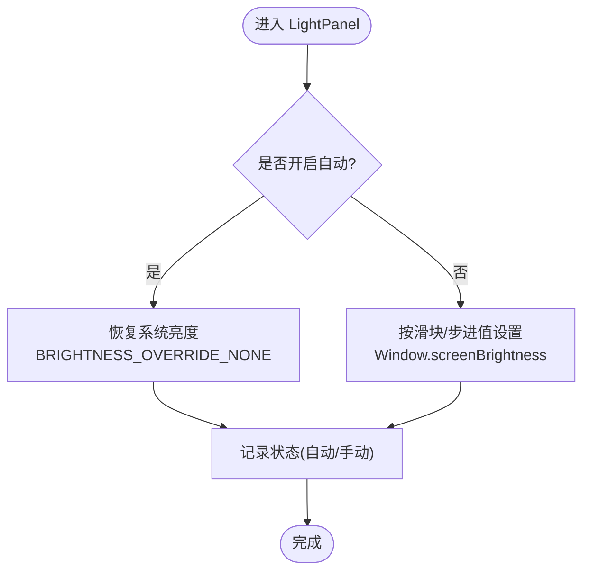
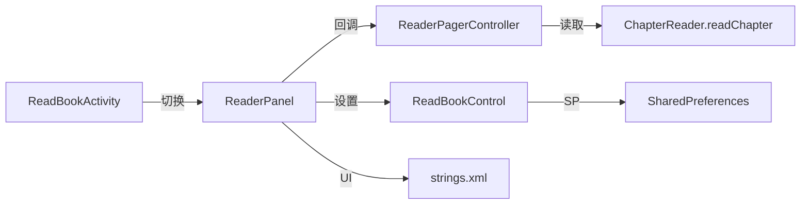

# 阅读器控制面板

<cite>
**本文引用的文件**
- [ReaderPanels.kt](file://module_book/src/main/java/com/ebook/book/reader/ReaderPanels.kt)
- [ReadBookActivity.kt](file://module_book/src/main/java/com/ebook/book/ReadBookActivity.kt)
- [ReaderPager.kt](file://module_book/src/main/java/com/ebook/book/reader/ReaderPager.kt)
- [ReadBookControl.kt](file://module_book/src/main/java/com/ebook/book/view/ReadBookControl.kt)
- [strings.xml](file://module_book/src/main/res/values/strings.xml)
- [ChapterReader.kt](file://lib_book_common/src/main/java/com/ebook/common/analyze/local/ChapterReader.kt)
</cite>

## 目录
1. [简介](#简介)
2. [项目结构](#项目结构)
3. [核心组件](#核心组件)
4. [架构总览](#架构总览)
5. [详细组件分析](#详细组件分析)
6. [依赖关系分析](#依赖关系分析)
7. [性能考量](#性能考量)
8. [故障排查指南](#故障排查指南)
9. [结论](#结论)
10. [附录](#附录)

## 简介
本节文档聚焦阅读器的“chrome”交互层，系统阐述顶栏设计、章节/亮度/字体/设置/下载等面板的实现与协作、自定义滑条 ReaderSlider、状态管理（ReaderPanel 枚举）以及动画与布局规范。目标是帮助读者快速理解并扩展阅读器的交互能力。

## 项目结构
- 控制层主入口：ReadBookActivity
  - 持有当前面板状态 ReaderPanel，组合各面板的 Composable（LightPanel、FontPanel、MoreSettingPanel、Download sheet），并提供与顶部/底部栏的回调对接。
- 面板与动画集中定义：ReaderPanels.kt
  - 定义 ReaderPanel 枚举、ReaderChromeTokens、ReaderTopBar、各类面板与 ReaderSlider。
- 翻页与渲染：ReaderPager.kt
  - 负责三页窗口状态机、加载、重试与进度回传；与面板通过回调交互（如章节点击跳转）。
- 阅读设置持久化：ReadBookControl.kt
  - 管理字体样式、背景主题、点击与按键翻页开关等的内存缓存与 SP 持久化，为面板读写提供统一数据源。
- 内容读取与分页链路：ChapterReader.kt
  - 统一“读一章”的最小接口；ReaderPagerController.loadPage 在内部使用，将正文拉取为段落数据后交由渲染引擎进行分页。
- 文案资源：strings.xml
  - 阅读器面板相关文案来源。

图表来源
- [ReadBookActivity.kt:81-135](file://module_book/src/main/java/com/ebook/book/ReadBookActivity.kt#L81-L135)
- [ReaderPanels.kt:123-197](file://module_book/src/main/java/com/ebook/book/reader/ReaderPanels.kt#L123-L197)
- [ReaderPager.kt:112-168](file://module_book/src/main/java/com/ebook/book/reader/ReaderPager.kt#L112-L168)
- [ChapterReader.kt:1-19](file://lib_book_common/src/main/java/com/ebook/common/analyze/local/ChapterReader.kt#L1-L19)
- [ReadBookControl.kt:13-121](file://module_book/src/main/java/com/ebook/book/view/ReadBookControl.kt#L13-L121)
- [strings.xml:70-76](file://module_book/src/main/res/values/strings.xml#L70-L76)

章节来源
- [ReadBookActivity.kt:81-135](file://module_book/src/main/java/com/ebook/book/ReadBookActivity.kt#L81-L135)
- [ReaderPanels.kt:123-197](file://module_book/src/main/java/com/ebook/book/reader/ReaderPanels.kt#L123-L197)
- [ReaderPager.kt:112-168](file://module_book/src/main/java/com/ebook/book/reader/ReaderPager.kt#L112-L168)

## 核心组件
- ReaderPanel 枚举：统一管理 NONE、CHAPTER、LIGHT、FONT、SETTING、DOWNLOAD 六种面板状态，供底栏高亮与面板显隐切换。
- ReaderChromeTokens：阅读器 chrome 层的专用视觉常量（高度、圆角、间距、滑块尺寸等），用于保证顶栏、底栏与面板风格一致。
- ReaderTopBar：顶栏包含返回按钮、标题与更多入口，支持 edge-to-edge 避让。
- LightPanel/FontPanel/MoreSettingPanel/Download Sheet：分别实现亮度调节、字体设置、更多设置与下载进度。
- ReaderSlider：自绘水平滑条，复用章节跳转与亮度调节手势逻辑，具备触达反馈和数值映射。
- 动画体系：基于 AnimatedVisibility + slideInHorizontally/slideOutHorizontally/fadeIn/fadeOut，配合 animateFloatAsState/animateDpAsState 提供丝滑过渡。

章节来源
- [ReaderPanels.kt:123-178](file://module_book/src/main/java/com/ebook/book/reader/ReaderPanels.kt#L123-L178)
- [ReaderPanels.kt:180-197](file://module_book/src/main/java/com/ebook/book/reader/ReaderPanels.kt#L180-L197)

## 架构总览
阅读器 chrome 层由 Activity 聚合，页面级状态集中在 ReadBookActivity 的 panel 变量；面板本身通过回调向上通知变更（如章节点击、亮度/字体更新、进入/退出面板）。ReaderPager 专注翻页加载，不关心面板细节，从而形成“上层菜单/chrome + 中间渲染 + 下层读取”的清晰分层。

图表来源
- [ReadBookActivity.kt:700-774](file://module_book/src/main/java/com/ebook/book/ReadBookActivity.kt#L700-L774)
- [ReaderPanels.kt:349-450](file://module_book/src/main/java/com/ebook/book/reader/ReaderPanels.kt#L349-L450)

## 详细组件分析

### ReaderPanel 状态管理与协调
- 枚举 ReaderPanel 集中了所有面板类型，并由 ReadBookActivity 维护单一实例；面板之间互斥显示，点击已打开面板或点击遮罩时回到 NONE。
- 各面板通过匿名 lambda 回调 to parent（例如 onDismiss/onChapterClick/onSettingChange），确保状态变更单向流动。

图表来源
- [ReaderPanels.kt:123-129](file://module_book/src/main/java/com/ebook/book/reader/ReaderPanels.kt#L123-L129)
- [ReadBookActivity.kt:540-774](file://module_book/src/main/java/com/ebook/book/ReadBookActivity.kt#L540-L774)

章节来源
- [ReaderPanels.kt:123-129](file://module_book/src/main/java/com/ebook/book/reader/ReaderPanels.kt#L123-L129)
- [ReadBookActivity.kt:700-774](file://module_book/src/main/java/com/ebook/book/ReadBookActivity.kt#L700-L774)

### 顶栏 ReaderTopBar
- 元素：返回按钮、居中的章节标题（作为一级）、副标题（书名常驻），“更多”入口在不适用场景下隐藏。
- 视觉：surfaceContainer 底色与投影营造“浮层”层次；edge-to-edge 下通过 statusBarsPadding 避让系统栏。
- 事件：返回关闭当前面板或返回上一页；更多按钮触发对应子面板。

章节来源
- [ReaderPanels.kt:180-197](file://module_book/src/main/java/com/ebook/book/reader/ReaderPanels.kt#L180-L197)

### 章节目录面板
- 作用：列表展示章节，当前项高亮；点击跳转到对应章节，并驱动 ReaderPagerController 重新计算窗口。
- 交互：列表滚动到当前项可见，适配长列表；选中条目携带章节索引以便定位。

章节来源
- [ReaderPanels.kt:719-822](file://module_book/src/main/java/com/ebook/book/reader/ReaderPanels.kt#L719-L822)
- [ReaderPager.kt:158-168](file://module_book/src/main/java/com/ebook/book/reader/ReaderPager.kt#L158-L168)

### 亮度调节面板（LightPanel）
- 功能：手动亮度（百分比或自动跟随系统），支持快速步进按钮、拖动滑杆与开关切换“自动”。
- 机制：通过窗口亮度与系统亮度常量切换；进入时恢复上次的“手动亮度”，离开时重置或保持策略。
- 文案：当前亮度、自动模式说明来自 strings.xml。

图表来源
- [ReaderPanels.kt:1102-1208](file://module_book/src/main/java/com/ebook/book/reader/ReaderPanels.kt#L1102-L1208)
- [ReaderPanels.kt:1225-1259](file://module_book/src/main/java/com/ebook/book/reader/ReaderPanels.kt#L1225-L1259)
- [strings.xml:70-76](file://module_book/src/main/res/values/strings.xml#L70-L76)

章节来源
- [ReaderPanels.kt:1102-1208](file://module_book/src/main/java/com/ebook/book/reader/ReaderPanels.kt#L1102-L1208)
- [strings.xml:70-76](file://module_book/src/main/res/values/strings.xml#L70-L76)

### 字体设置面板（FontPanel）
- 功能：预设字体字号选择与色卡选择，立即生效并持久化到 SP；支持点击/键盘翻页开关设置。
- 数据来源：ReadBookControl 提供默认与可用选项列表及读写接口；SP 避免频繁 I/O。

章节来源
- [ReaderPanels.kt:1327-1438](file://module_book/src/main/java/com/ebook/book/reader/ReaderPanels.kt#L1327-L1438)
- [ReadBookControl.kt:13-121](file://module_book/src/main/java/com/ebook/book/view/ReadBookControl.kt#L13-L121)

### 更多设置面板（MoreSettingPanel）
- 内容：可配置阅读行为的集合入口（如字体/主题/开关等），通常聚合若干设置项。
- 交互：各项操作通过回调更新全局设置或触发重排版。

章节来源
- [ReadBookActivity.kt:757-774](file://module_book/src/main/java/com/ebook/book/ReadBookActivity.kt#L757-L774)

### 下载进度面板（ChapterDownloadSheet）
- 作用：在当前阅读页面附近弹出面板，展示下载任务的进度列表与状态，支持一键进入或暂停。
- 入口：仅在非本地书时显示（更多入口可见条件）。

章节来源
- [ReadBookActivity.kt:555-582](file://module_book/src/main/java/com/ebook/book/ReadBookActivity.kt#L555-L582)
- [ReadBookActivity.kt:762-774](file://module_book/src/main/java/com/ebook/book/ReadBookActivity.kt#L762-L774)

### 自定义滑条 ReaderSlider
- 能力：统一章节跳转与亮度调节场景的滑条体验；支持触控反馈、按下放大光晕、精确到像素的位移与数值映射。
- 设计：轨道厚度、旋钮大小、触摸留白等常量集中于 ReaderChromeTokens，便于整体调优。
- 状态：使用 animatable/state 驱动按压态与光晕半径变化，保证跟手与流畅度。

章节来源
- [ReaderPanels.kt:164-178](file://module_book/src/main/java/com/ebook/book/reader/ReaderPanels.kt#L164-L178)
- [ReaderPanels.kt:1115-1208](file://module_book/src/main/java/com/ebook/book/reader/ReaderPanels.kt#L1115-L1208)

### 动画效果
- 淡入淡出：fadeIn/fadeOut 用于面板出现与消失的整体透明度过渡。
- 水平滑动：slideInHorizontally/slideOutHorizontally 用于侧滑面板进出。
- 参数联动：animateFloatAsState/animateDpAsState 用于滑条光晕与拖拽过程的平滑插值。

章节来源
- [ReaderPanels.kt:7-13](file://module_book/src/main/java/com/ebook/book/reader/ReaderPanels.kt#L7-L13)

### 面板布局与规范
- 顶/底栏与面板共用 ReaderChromeTokens：确保行高、图标容器尺寸、缩进、分割线对齐一致。
- 触摸区域：控件最小点击目标参考 44dp 圆形按钮与 32dp 触摸留白；滑条轨道 4dp 但整体触摸面积更大。
- 边距节奏：面板内上下留白分别为 sheetTopPadding/sheetBottomPadding，文本行距与卡片内边距协同。
- 响应式：通过 density/padding/dimensions 组合适配不同屏幕宽度与密度，文字与滑块数值动态缩放。
- edge-to-edge：顶栏底色延伸至系统状态栏后，内容通过 padding 避让，保证不被遮挡。

章节来源
- [ReaderPanels.kt:137-168](file://module_book/src/main/java/com/ebook/book/reader/ReaderPanels.kt#L137-L168)
- [ReaderPanels.kt:180-197](file://module_book/src/main/java/com/ebook/book/reader/ReaderPanels.kt#L180-L197)

## 依赖关系分析
- ReadBookActivity 作为容器，持有 ReaderPanel 状态并分发到具体面板。
- 各面板通过回调对上层状态或 ReaderPagerController 发起动作（章节跳转、设置修改）。
- 设置持久化由 ReadBookControl 承担，避免重复 I/O。
- 正文解析与分页封装在 ReaderPagerController 中，向下调用 ChapterReader.readChapter 获取规范化段落。

图表来源
- [ReadBookActivity.kt:700-774](file://module_book/src/main/java/com/ebook/book/ReadBookActivity.kt#L700-L774)
- [ReaderPager.kt:112-168](file://module_book/src/main/java/com/ebook/book/reader/ReaderPager.kt#L112-L168)
- [ChapterReader.kt:1-19](file://lib_book_common/src/main/java/com/ebook/common/analyze/local/ChapterReader.kt#L1-L19)
- [ReadBookControl.kt:13-121](file://module_book/src/main/java/com/ebook/book/view/ReadBookControl.kt#L13-L121)
- [strings.xml:70-76](file://module_book/src/main/res/values/strings.xml#L70-L76)

## 性能考量
- 面板切换通过单一 state（panel）驱动，减少多状态耦合带来的抖动。
- ReaderPagerController 对同 key 的加载中任务去重，避免并发抓包与重复排版。
- 阅读设置缓存于内存，写盘仅做增量更新，降低 I/O 频次。
- 滑条与动画使用 animatable/AnimatedVisibility 等 GPU 友好方式，提升帧率。

[本节为通用指导，无需引用特定源码]

## 故障排查指南
- 面板无法关闭：检查是否有阻塞的协程或动画，确认 onDismiss 已被调用并设置 panel = NONE。
- 亮度设置无效：确认处于手动模式且未开启自动；检查 WindowManager.LayoutParams.BRIGHTNESS_OVERRIDE_* 的设置路径。
- 章节跳转无效：确认 chapters 数据已加载，回调 onChapterClick 正确传入索引；ReaderPagerController.setInitData 成功重置窗口。
- 字体设置不生效：检查 ReadBookControl.updateTextKindIndex/updateTextDrawableIndex 是否被调用，SP 写入是否成功。
- 动画卡顿：检查是否在 UI 线程执行了耗时计算，滑条数值映射应提前计算并复用常量。

章节来源
- [ReaderPanels.kt:1102-1208](file://module_book/src/main/java/com/ebook/book/reader/ReaderPanels.kt#L1102-L1208)
- [ReaderPager.kt:158-168](file://module_book/src/main/java/com/ebook/book/reader/ReaderPager.kt#L158-L168)
- [ReadBookControl.kt:86-121](file://module_book/src/main/java/com/ebook/book/view/ReadBookControl.kt#L86-L121)

## 结论
阅读器控制面板以 ReaderPanel 为中心统一管理 UI 显隐，ReaderTopBar/ReaderPanels 负责呈现与交互，ReaderPagerController 专注渲染流程，ReadBookControl 收敛设置与持久化。通过统一的常量与动画约定，保证了跨面板的一致性与顺滑的用户体验。未来扩展可在 ReaderPanel 增加新类型并按此模式接入。

[本节为总结性内容，无需引用特定源码]

## 附录
- 设计令牌 ReaderChromeTokens：建议将其视为阅读器 chrome 层的“设计词表”，新增控件时优先从该对象取值，保持一致的节奏与密度。
- 文案管理：面板涉及的所有文案必须走 strings.xml，避免硬编码。
- 事件总线与回调：面板与上层页面之间建议使用回调（而非广播）以保持单向数据流。

[本节为补充信息，无需引用特定源码]