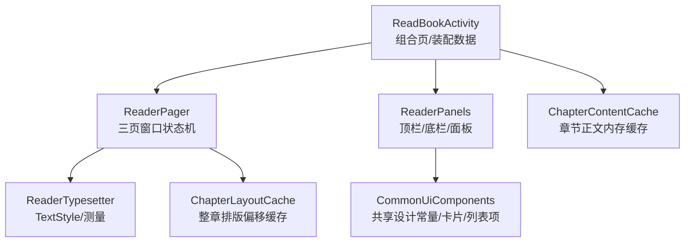
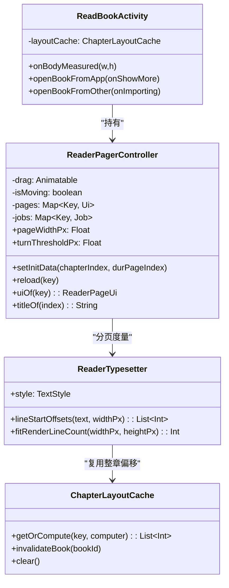
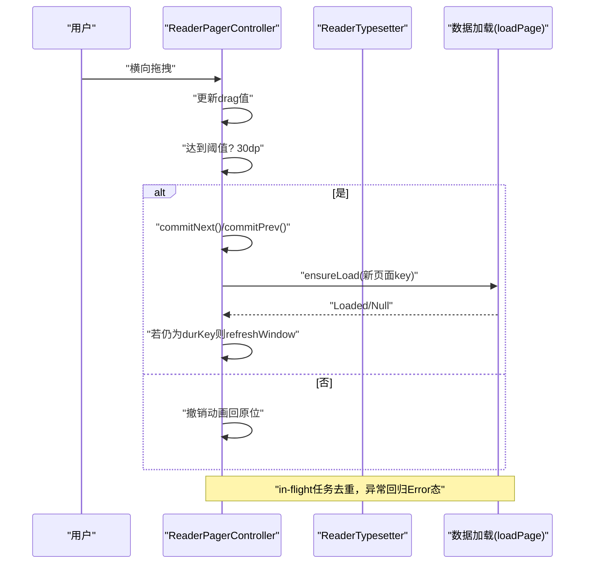
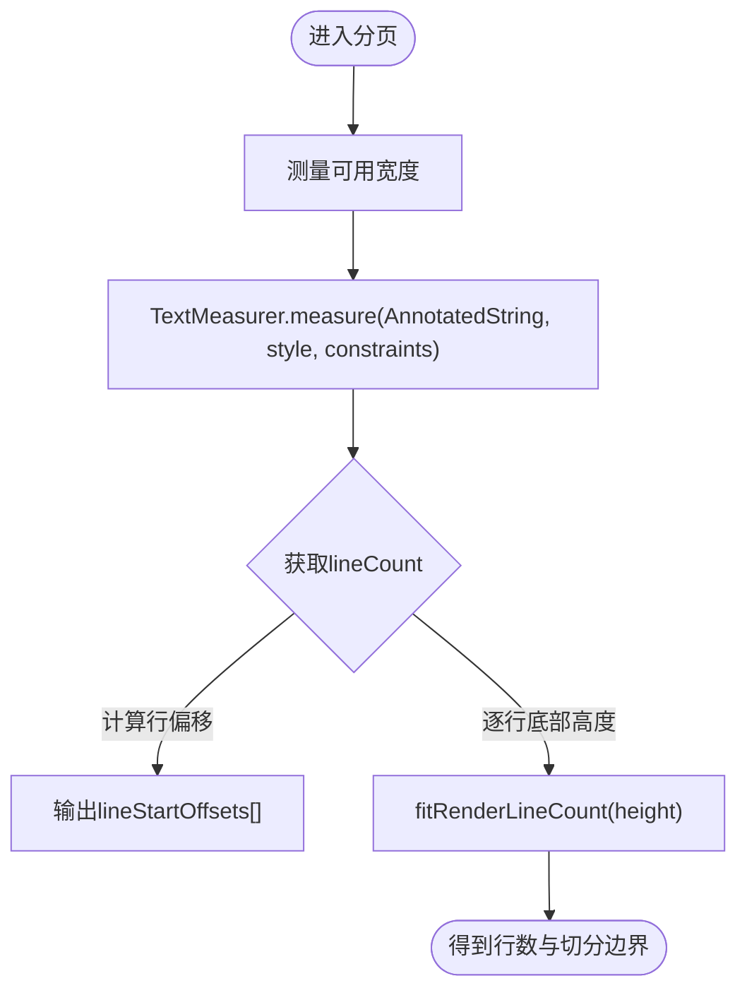
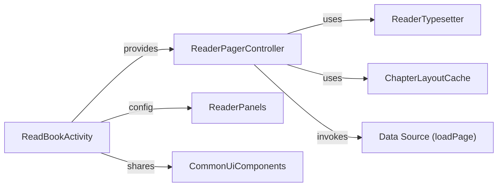

# 阅读器界面实现

<cite>
**本文引用的文件**
- [ReaderPager.kt](file://module_book/src/main/java/com/ebook/book/reader/ReaderPager.kt)
- [ChapterLayoutCacheTest.kt](file://module_book/src/test/java/com/ebook/book/reader/ChapterLayoutCacheTest.kt)
- [ReaderTypesetter.kt](file://module_book/src/main/java/com/ebook/book/reader/ReaderTypesetter.kt)
- [ChapterLayoutCache.kt](file://module_book/src/main/java/com/ebook/book/reader/ChapterLayoutCache.kt)
- [ReaderPanels.kt](file://module_book/src/main/java/com/ebook/book/reader/ReaderPanels.kt)
- [ReadBookActivity.kt](file://module_book/src/main/java/com/ebook/book/ReadBookActivity.kt)
- [ReadBookControl.kt](file://module_book/src/main/java/com/ebook/book/view/ReadBookControl.kt)
- [CommonUiComponents.kt](file://lib_book_common/src/main/java/com/ebook/common/ui/CommonUiComponents.kt)
- [ChapterContentCache.kt](file://lib_book_common/src/main/java/com/ebook/common/store/ChapterContentCache.kt)
</cite>

## 目录
1. [引言](#引言)
2. [项目结构](#项目结构)
3. [核心组件](#核心组件)
4. [架构总览](#架构总览)
5. [详细组件分析](#详细组件分析)
6. [依赖分析](#依赖分析)
7. [性能考虑](#性能考虑)
8. [故障排查指南](#故障排查指南)
9. [结论](#结论)
10. [附录](#附录)

## 引言
本文件聚焦基于 Jetpack Compose 的小说阅读器界面实现，围绕 ReaderPager 翻页效果、布局与排版、主题与个性化设置、文本渲染优化、性能调优以及无障碍与国际化进行系统性梳理。文档以代码事实为依据，通过图示与章节化说明，帮助不同背景的读者快速理解并定位关键实现点。

## 项目结构
- 阅读 UI 位于 module_book 的 reader 包下：ReaderPager（翻页状态机）、ReaderTypesetter（分页度量与样式）、ChapterLayoutCache（排版偏移缓存）。
- 页面装配在 ReadBookActivity：持有 ViewModel、编排 ReaderPager、注入数据加载回调、应用亮度与持久化配置。
- 面板与 chrome（顶栏/底栏/菜单）在 ReaderPanels 中统一提供。
- 通用 UI 组件与设计令牌集中到 lib_book_common.ui 公共库。
- 正文内容与缓存抽象为 ChapterContentCache 等共享存储能力。

**图表来源**
- [ReadBookActivity.kt:81-L230](file://module_book/src/main/java/com/ebook/book/ReadBookActivity.kt#L81-L230)
- [ReaderPager.kt:112-L220](file://module_book/src/main/java/com/ebook/book/reader/ReaderPager.kt#L112-L220)
- [ReaderTypesetter.kt:17-L95](file://module_book/src/main/java/com/ebook/book/reader/ReaderTypesetter.kt#L17-L95)
- [ChapterLayoutCache.kt:1-L50](file://module_book/src/main/java/com/ebook/book/reader/ChapterLayoutCache.kt#L1-L50)
- [ChapterContentCache.kt:1-L59](file://lib_book_common/src/main/java/com/ebook/common/store/ChapterContentCache.kt#L1-L59)
- [CommonUiComponents.kt:33-L77](file://lib_book_common/src/main/java/com/ebook/common/ui/CommonUiComponents.kt#L33-L77)

**部分来源**
- [ReadBookActivity.kt:81-L230](file://module_book/src/main/java/com/ebook/book/ReadBookActivity.kt#L81-L230)

## 核心组件
- ReaderPagerController：维护 dur/prev/next 三页窗口、拖拽动画、手势锁与去重加载；支持跳转（setInitData）、重试（reload）、滚动阈值判断。
- ReaderTypesetter：使用 Compose TextMeasurer 产出“每行起始偏移”，并用探针法测算可视行数，确保分页与渲染同源。
- ChapterLayoutCache：按“章节+字号+宽度”对整章偏移做 LRU 缓存，避免同章多页重复整章测量。
- ReadBookControl：字体样式与背景主题的内存+SP 持久化，供字体面板与主题切换读取。
- ReaderPanels：顶栏/底栏与亮度/字体/章节/下载面板的统一 UI。
- ChapterContentCache：章节正文内存缓存，覆盖当前章与上下章节预览预取。

**部分来源**
- [ReaderPager.kt:64-L220](file://module_book/src/main/java/com/ebook/book/reader/ReaderPager.kt#L64-L220)
- [ReaderTypesetter.kt:17-L135](file://module_book/src/main/java/com/ebook/book/reader/ReaderTypesetter.kt#L17-L135)
- [ChapterLayoutCache.kt:1-L50](file://module_book/src/main/java/com/ebook/book/reader/ChapterLayoutCache.kt#L1-L50)
- [ReadBookControl.kt:1-L121](file://module_book/src/main/java/com/ebook/book/view/ReadBookControl.kt#L1-L121)
- [ReaderPanels.kt:1-L220](file://module_book/src/main/java/com/ebook/book/reader/ReaderPanels.kt#L1-L220)
- [ChapterContentCache.kt:1-L59](file://lib_book_common/src/main/java/com/ebook/common/store/ChapterContentCache.kt#L1-L59)

## 架构总览
阅读器界面采用 MVVM + Compose：Activity 负责组装与生命周期，ViewModel 管理业务状态，UI 层由多个 Composable 构成，核心为 ReaderPager 控件及与其配套的排版引擎 ReaderTypesetter。

**图表来源**
- [ReaderPager.kt:112-L220](file://module_book/src/main/java/com/ebook/book/reader/ReaderPager.kt#L112-L220)
- [ReaderTypesetter.kt:17-L135](file://module_book/src/main/java/com/ebook/book/reader/ReaderTypesetter.kt#L17-L135)
- [ChapterLayoutCache.kt:1-L50](file://module_book/src/main/java/com/ebook/book/reader/ChapterLayoutCache.kt#L1-L50)
- [ReadBookActivity.kt:120-L141](file://module_book/src/main/java/com/ebook/book/ReadBookActivity.kt#L120-L141)

**部分来源**
- [ReadBookActivity.kt:92-L141](file://module_book/src/main/java/com/ebook/book/ReadBookActivity.kt#L92-L141)

## 详细组件分析

### ReaderPager 翻页机制（页面切换动画、手势识别、页面状态管理）
- 三页窗口模型：dur 显示在前，prev 在上一层滑入覆盖，next 在下一层露出；drag 控制横移位移，超过阈值（30dp）即提交翻页；动画进行中 isMoving 锁定手势和程序化翻页。
- 页面加载去重：同一 ReaderPageKey 同时只能存在一个 in-flight job，完成后再根据是否仍为 durKey 触发窗口刷新；跳转（setInitData）会清空 jobs 与 pages 并重置窗口。
- 错误态与重试：页面可能处于 Loading/Error/Locked Loaded，错误通过 UI 提供的重试入口调用 reload。
- 手势交互：基于 awaitEachGesture/awaitFirstDown 的组合识别横向拖拽，配合 setAnimationDuration / threshold 形成平滑滑动与吸附。
- 进度与标题：loadPage 回调 onProgress 同步菜单标题与章节滑条；加载中的页面可提前显示章节标题以便用户感知。

**图表来源**
- [ReaderPager.kt:112-L220](file://module_book/src/main/java/com/ebook/book/reader/ReaderPager.kt#L112-L220)

**部分来源**
- [ReaderPager.kt:64-L220](file://module_book/src/main/java/com/ebook/book/reader/ReaderPager.kt#L64-L220)

### 文本排版与分页（换行算法、段落间距控制、字符缩放）
- 统一排版源：ReaderTypesetter 使用固定 TextStyle 与 Density 测量文本；lineStartOffsets 返回每行起始偏移，fitRenderLineCount 通过探针法求取可放下的渲染行数，保证分页与渲染一致。
- 段落分隔符处理：以原始换行作为分段标记，避免丢失段落；按相同宽度重排可得与分页一致的折行结果。
- 字符缩放：fontSizeSp 通过 rememberReaderTypesetter 传入，配合 lineHeight 影响行高；样式改变会触发 rePaginate 重新计算行列数。
- 段落间距：lineHeight = 单行字高 + 段距，作为正文行高的唯一来源，避免估算带来的累积误差。

**图表来源**
- [ReaderTypesetter.kt:17-L95](file://module_book/src/main/java/com/ebook/book/reader/ReaderTypesetter.kt#L17-L95)

**部分来源**
- [ReaderTypesetter.kt:17-L135](file://module_book/src/main/java/com/ebook/book/reader/ReaderTypesetter.kt#L17-L135)

### 布局设计与屏幕适配（横竖排列、自适应）
- 阅读器主体通过 Activity.onBodyMeasured 收集正文区宽高，交由 ReaderTypesetter 测量用于分页，保证跨尺寸设备一致性。
- 面板层级（顶栏/底栏/抽屉/弹出面板）以 CommonUiTokens 定义一致圆角、间距与阴影层次，使不同方向屏幕均有统一呼吸感。
- 章节列表与面板条目通过懒加载列表（LazyColumn/Row）承载，避免一次性构建大量节点。

**部分来源**
- [ReadBookActivity.kt:137-L141](file://module_book/src/main/java/com/ebook/book/ReadBookActivity.kt#L137-L141)
- [ReaderPanels.kt:123-L179](file://module_book/src/main/java/com/ebook/book/reader/ReaderPanels.kt#L123-L179)

### 主题系统（日间/夜间模式、字体大小、行距、背景色、文字色、持久化）
- ReadBookControl 提供字体样式预设与背景主题预设（白/黄/绿/黑），并提供文本颜色与背景色的读取；变更时写入 SP（本地偏好）持久化，启动时自动恢复。
- 字体大小与行距来自 TextKind，行距=字高+段距，保证阅读舒适；切换后通过 rememberReaderTypesetter 重组类型器以生效。
- 顶部/底部面板内提供开关项切换主题/字体等（见 ReaderPanels），并将结果通过回调下发至阅读器。

**部分来源**
- [ReadBookControl.kt:1-L121](file://module_book/src/main/java/com/ebook/book/view/ReadBookControl.kt#L1-L121)
- [ReaderTypesetter.kt:97-L135](file://module_book/src/main/java/com/ebook/book/reader/ReaderTypesetter.kt#L97-L135)
- [ReaderPanels.kt:1-L220](file://module_book/src/main/java/com/ebook/book/reader/ReaderPanels.kt#L1-L220)

### 内容存储与缓存（章节正文与排版偏移）
- 章节正文内存缓存 ChapterContentCache：容量为“当前章+前后各一章”，避免频繁打开文件解码；失效策略按 bookId 片段清理。
- 排版偏移缓存 ChapterLayoutCache：以 contentRef/fontSizeSp/widthPx 为键缓存 lineStartOffsets，解决同章翻页 N 次整章测量的性能问题；并发安全用 synchronizedMap。

**部分来源**
- [ChapterContentCache.kt:1-L59](file://lib_book_common/src/main/java/com/ebook/common/store/ChapterContentCache.kt#L1-L59)
- [ChapterLayoutCache.kt:1-L50](file://module_book/src/main/java/com/ebook/book/reader/ChapterLayoutCache.kt#L1-L50)

### 手势与键盘事件
- 翻页通过 Compose pointerInput 识别手势并驱动 animatable；音量键等系统输入由 Activity.onKeyUp 转发给 pagerController。
- 点击/长按、侧边手势可通过 ReaderPanels 中的按钮与监听处理。

**部分来源**
- [ReadBookActivity.kt:102-L104](file://module_book/src/main/java/com/ebook/book/ReadBookActivity.kt#L102-L104)
- [ReaderPager.kt:1-L63](file://module_book/src/main/java/com/ebook/book/reader/ReaderPager.kt#L1-L63)

## 依赖分析
- ReaderPagerController 依赖：
  - ReaderTypesetter：提供 TextStyle、密度与测量器
  - ChapterLayoutCache：复用整章偏移
  - Data Source（loadPage）：由外部注入，完成 DB 缓存→网络拉取→存库→重分行的流程
- ReadBookActivity 依赖：
  - BookRepository 与 BookImportRepository：章节加载与本地书导入
  - ReaderPanels：面板集合
  - CommonUiComponents：共用 UI 元素与设计令牌

**图表来源**
- [ReaderPager.kt:112-L220](file://module_book/src/main/java/com/ebook/book/reader/ReaderPager.kt#L112-L220)
- [ReadBookActivity.kt:81-L141](file://module_book/src/main/java/com/ebook/book/ReadBookActivity.kt#L81-L141)

**部分来源**
- [ReaderTypesetter.kt:17-L95](file://module_book/src/main/java/com/ebook/book/reader/ReaderTypesetter.kt#L17-L95)
- [ChapterLayoutCache.kt:1-L50](file://module_book/src/main/java/com/ebook/book/reader/ChapterLayoutCache.kt#L1-L50)
- [ReadBookActivity.kt:81-L141](file://module_book/src/main/java/com/ebook/book/ReadBookActivity.kt#L81-L141)

## 性能考虑
- 分页与渲染同源：ReaderTypesetter 将断行与可见行数测算统一到 TextMeasurer，避免两套算法导致丢行或页数错乱。
- 排版偏移缓存：ChapterLayoutCache 对整章 lineStartOffsets 做 LRU 缓存，同章翻页仅一次整章测量；容量约为“当前章+前后两章”。
- 正文内存缓存：ChapterContentCache 维护当前章与相邻章节的正文，减少 IO 放大；按 bookId 失效避免脏数据。
- 并发保护：排版缓存读-写在同一把锁中串行；正文缓存通过 Mutex 避免竞争。
- 动画与手势锁：翻页动画期间 isMoving=true 阻止并发手势和多次提交，防止竞态与抖动。

[本节为一般性能讨论，不直接分析具体文件]

## 故障排查指南
- 翻页卡住或不翻：检查 isMoving 是否被误置位、drag 阈值与 pageWidthPx 是否正确；确认 ensureLoad 未被 setInitData 取消且仍在 jobs。
- 正文少段落或多换行：确认 lineStartOffsets 与渲染宽度一致；排查 fontSizeSp/lineHeight 变化是否触发 rePaginate。
- 翻页后内容接不上：验证 chapter cache 键包含 contentRef/textSize/widthPx，避免混用旧偏移。
- 主题/字体变更后无效果：检查 ReadBookControl.updateXxx 是否成功写入 SP，并确保 rememberReaderTypesetter 的参数发生变化触发重组。
- 长章节卡顿：确认 ChapterLayoutCache 命中情况；避免频繁重建 Typesetter；评估是否需要增加缓存容量或异步重排。

**部分来源**
- [ChapterLayoutCacheTest.kt:1-L200](file://module_book/src/test/java/com/ebook/book/reader/ChapterLayoutCacheTest.kt#L1-L200)
- [ReaderPager.kt:154-L220](file://module_book/src/main/java/com/ebook/book/reader/ReaderPager.kt#L154-L220)
- [ReaderTypesetter.kt:34-L74](file://module_book/src/main/java/com/ebook/book/reader/ReaderTypesetter.kt#L34-L74)

## 结论
该阅读器以 Compose 为 UI 框架，通过 ReaderPager 实现三页窗口与手势驱动的翻页体验；ReaderTypesetter 统一了分页测量与渲染样式，保障折行一致性；ChapterLayoutCache 与 ChapterContentCache 提供了关键的缓存加速，降低整章重排与文件 IO 成本。配合 ReadBookControl 的主题与字体配置与 ReaderPanels 的面板体系，形成了完整可用的阅读界面闭环。

[本节为总结性内容，不直接分析具体文件]

## 附录
- 主题与配置
  - 背景/字体选择与持久化：ReadBookControl（SP 存储）
  - 正文样式与测量：ReaderTypesetter（TextStyle、Density）
  - 面板展示：ReaderPanels（顶/底栏、亮度、字体、章节、下载面板）
- 数据与缓存
  - 正文缓存：ChapterContentCache
  - 排版偏移缓存：ChapterLayoutCache
- 通用 UI
  - 共享组件：CommonUiComponents（卡片、列表项、图标容器、设计令牌）

[本节为概念性说明，不直接分析具体文件]