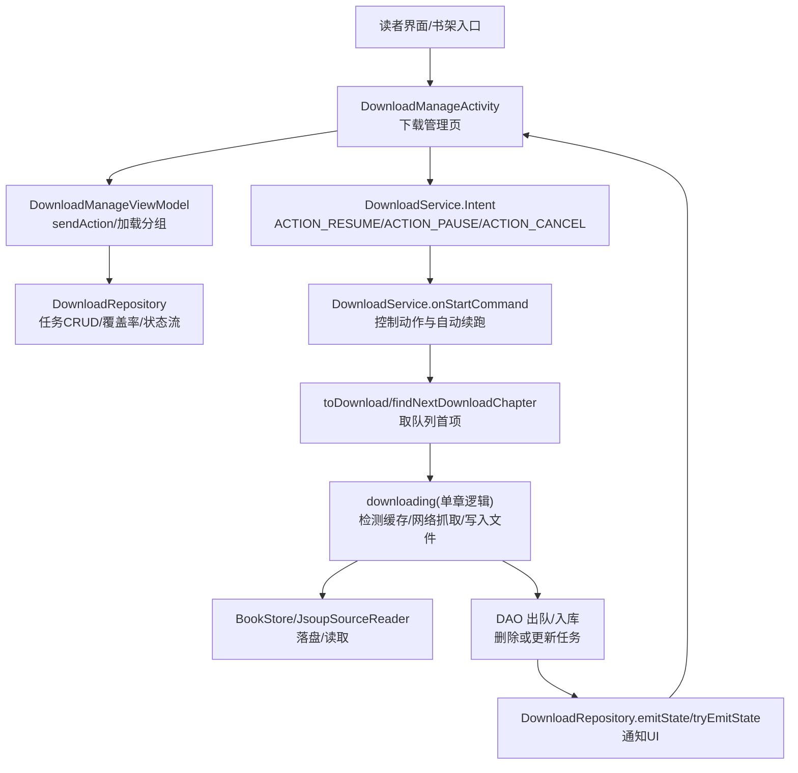
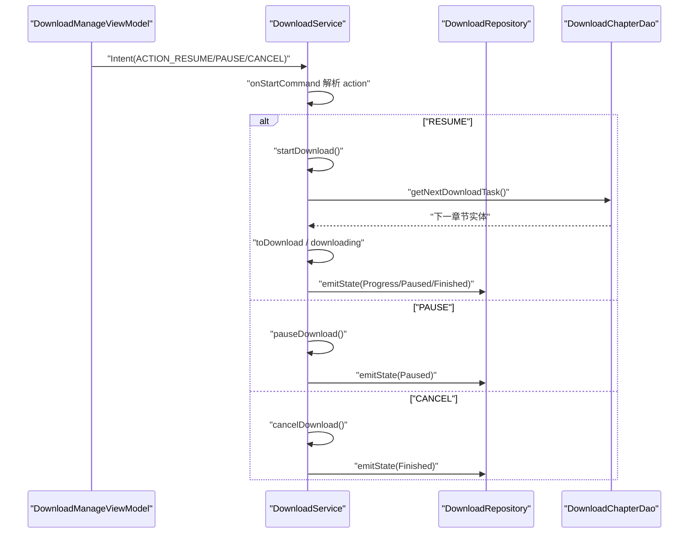
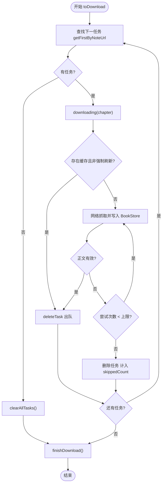
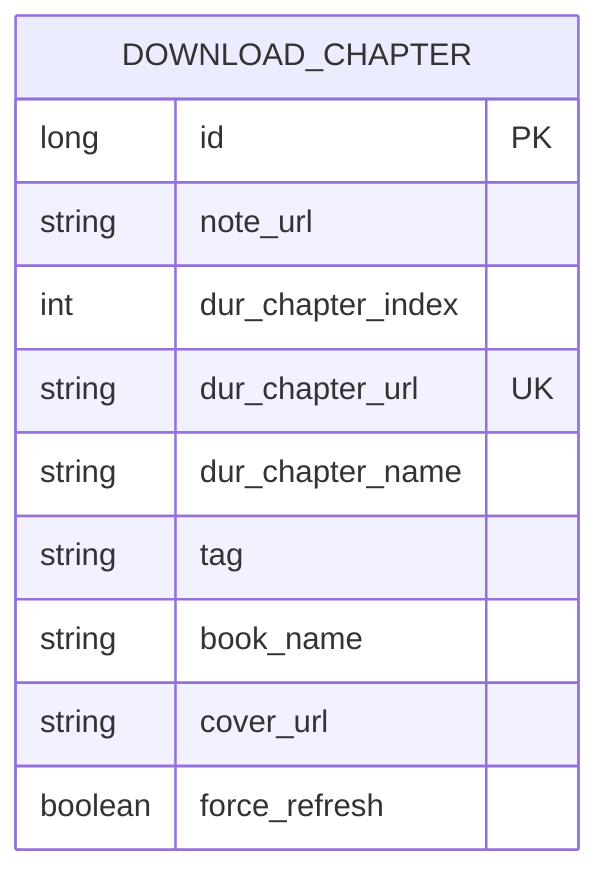
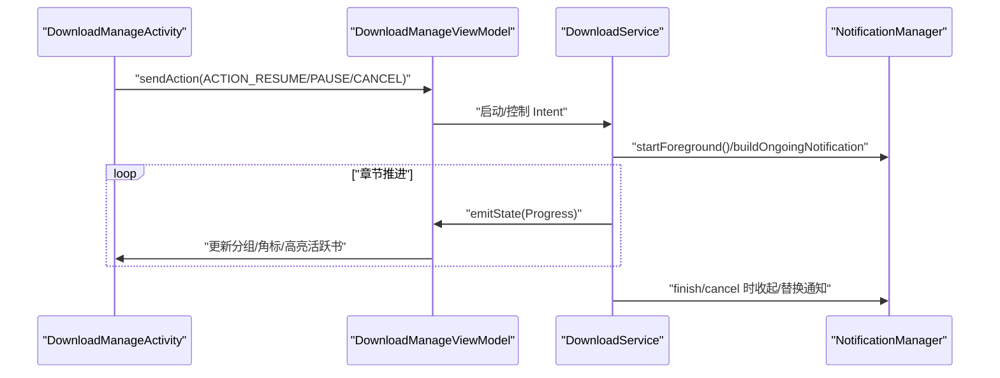
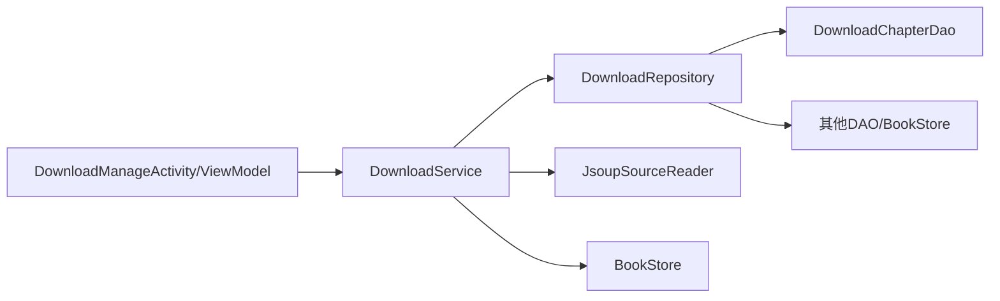

# 下载服务

<cite>
**本文引用的文件列表**
- [DownloadService.kt](file://module_book/src/main/java/com/ebook/book/service/DownloadService.kt)
- [AndroidManifest.xml](file://module_book/src/main/AndroidManifest.xml)
- [DownloadRepository.kt](file://module_book/src/main/java/com/ebook/book/repository/DownloadRepository.kt)
- [DownloadManageActivity.kt](file://module_book/src/main/java/com/ebook/book/DownloadManageActivity.kt)
- [DownloadManageViewModel.kt](file://module_book/src/main/java/com/ebook/book/mvvm/viewmodel/DownloadManageViewModel.kt)
- [DownloadChapterEntity.kt](file://lib_ebook_db/src/main/java/com/ebook/db/entity/DownloadChapterEntity.kt)
- [DownloadChapterDao.kt](file://lib_ebook_db/src/main/java/com/ebook/db/dao/DownloadChapterDao.kt)
- [AppDatabase.kt](file://lib_ebook_db/src/main/java/com/ebook/db/AppDatabase.kt)
- [0018-download-foreground-service-data-sync-quota.md](file://docs/adr/0018-download-foreground-service-data-sync-quota.md)
</cite>

## 目录
1. [简介](#简介)
2. [项目结构与职责划分](#项目结构与职责划分)
3. [核心组件总览](#核心组件总览)
4. [架构与流程概览](#架构与流程概览)
5. [详细组件解析](#详细组件解析)
   - [前台服务：声明、启动与生命周期控制](#前台服务声明启动与生命周期控制)
   - [任务调度队列与并发控制](#任务调度队列与并发控制)
   - [断点续传与进度持久化](#断点续传与进度持久化)
   - [数据库模型与查询优化](#数据库模型与查询优化)
   - [通知管理与用户交互](#通知管理与用户交互)
   - [配额限制与系统回调处理](#配额限制与系统回调处理)
6. [依赖关系分析](#依赖关系分析)
7. [性能优化方案](#性能优化方案)
8. [异常与故障排查](#异常与故障排查)
9. [结论](#结论)

## 简介
本章节专门说明 Android 小说阅读器的离线下载与后台服务实现，覆盖前台服务声明与使用、下载队列调度、失败重试、断点续传、任务状态持久化、通知管理、配额限制应对以及性能与异常处理策略。该能力以 module_book 的 DownloadService 为核心，结合 lib_ebook_db 的任务表与 DAO，以及 module_book 中的 DownloadRepository/页面/ViewModel，形成“任务排队—逐章抓取—落盘存储—UI 展示—恢复续跑”的完整链路。

## 项目结构与职责划分
- service 层（前台服务）
  - DownloadService：声明前台 dataSync 服务、解析 Intent 命令、维护下载循环、管理通知、处理 onTimeout 等系统约束。
- repository 层
  - DownloadRepository：统一下载任务 CRUD、队列剩余计数观察、全书缓存覆盖率计算、与服务共享的下载状态事件流。
- UI 层
  - DownloadManageActivity/DownloadManageViewModel：按书分组展示待下载任务、订阅服务状态、发送开始/暂停/取消动作。
- 数据层
  - DownloadChapterEntity + DownloadChapterDao + AppDatabase：定义下载队列表结构、索引与查询方法、数据库装配版本。
- 配置/契约
  - AndroidManifest.xml：声明 DownloadService 及其 foregroundServiceType="dataSync" 与权限。
  - ADR 文档：0018 明确了 dataSync 配额与启动限制的落地策略。

**Section sources**
- [DownloadService.kt:39-50](file://module_book/src/main/java/com/ebook/book/service/DownloadService.kt#L39-L50)
- [DownloadRepository.kt:21-34](file://module_book/src/main/java/com/ebook/book/repository/DownloadRepository.kt#L21-L34)
- [DownloadManageActivity.kt:50-65](file://module_book/src/main/java/com/ebook/book/DownloadManageActivity.kt#L50-L65)
- [DownloadChapterEntity.kt:10-22](file://lib_ebook_db/src/main/java/com/ebook/db/entity/DownloadChapterEntity.kt#L10-L22)
- [DownloadChapterDao.kt:7-20](file://lib_ebook_db/src/main/java/com/ebook/db/dao/DownloadChapterDao.kt#L7-L20)
- [AppDatabase.kt:8-24](file://lib_ebook_db/src/main/java/com/ebook/db/AppDatabase.kt#L8-L24)
- [AndroidManifest.xml:27-42](file://module_book/src/main/AndroidManifest.xml#L27-L42)

## 核心组件总览
- DownloadService
  - 通过 Intent 契约对外提供“带任务启动、控制（暂停/继续/取消）、常驻通知”。
  - 实现 Android 15+ 前台超时回调 onTimeout，合规退出并保持任务可续跑。
- DownloadRepository
  - 提供任务入队去重、按书取下一项、队列数量观测、覆盖率计算、状态流发射。
- DAO/Entity
  - 以“仅保存未完成任务”为不变式；通过唯一索引避免重复排队，普通索引支撑按书取队头与按书取消。
- UI
  - 下载管理页聚合展示“剩余章数”和“已缓存覆盖率”，支持批量开始/暂停/取消。

**Section sources**
- [DownloadService.kt:39-50](file://module_book/src/main/java/com/ebook/book/service/DownloadService.kt#L39-L50)
- [DownloadRepository.kt:42-123](file://module_book/src/main/java/com/ebook/book/repository/DownloadRepository.kt#L42-L123)
- [DownloadChapterDao.kt:21-127](file://lib_ebook_db/src/main/java/com/ebook/db/dao/DownloadChapterDao.kt#L21-L127)
- [DownloadManageActivity.kt:85-140](file://module_book/src/main/java/com/ebook/book/DownloadManageActivity.kt#L85-L140)

## 架构与流程概览

**Diagram sources**
- [DownloadManageActivity.kt:85-140](file://module_book/src/main/java/com/ebook/book/DownloadManageActivity.kt#L85-L140)
- [DownloadManageViewModel.kt:119-148](file://module_book/src/main/java/com/ebook/book/mvvm/viewmodel/DownloadManageViewModel.kt#L119-L148)
- [DownloadRepository.kt:54-172](file://module_book/src/main/java/com/ebook/book/repository/DownloadRepository.kt#L54-L172)
- [DownloadService.kt:117-243](file://module_book/src/main/java/com/ebook/book/service/DownloadService.kt#L117-L243)

## 详细组件解析

### 前台服务：声明、启动与生命周期控制
- 清单声明
  - service 类型指定 foregroundServiceType="dataSync"，并持有 FOREGROUND_SERVICE_DATA_SYNC 权限，合法启用长耗时数据同步前台服务。
- 前台初始化
  - onStartCommand 中创建通知渠道并通过 startForeground 交出常驻通知；若设备环境导致无法前台化（如包归属错乱），记录 fgUnavailable 并放弃自动续跑，防止空转反复拉服务。
- Intent 契约
  - 通过 ACTION_RESUME/ACTION_PAUSE/ACTION_CANCEL 三操作直达服务；无 binder，解耦 UI 与 Service 生命周期。
- 超时回调
  - onTimeout 在 system 摘除前台态后回调，数秒内完成收尾：停循环、清回调、写状态（tryEmitState）、发关注通知、stopSelf()。

**Diagram sources**
- [DownloadManageViewModel.kt:119-148](file://module_book/src/main/java/com/ebook/book/mvvm/viewmodel/DownloadManageViewModel.kt#L119-L148)
- [DownloadService.kt:117-243](file://module_book/src/main/java/com/ebook/book/service/DownloadService.kt#L117-L243)
- [DownloadRepository.kt:158-172](file://module_book/src/main/java/com/ebook/book/repository/DownloadRepository.kt#L158-L172)
- [DownloadChapterDao.kt:54-61](file://lib_ebook_db/src/main/java/com/ebook/db/dao/DownloadChapterDao.kt#L54-L61)

**Section sources**
- [AndroidManifest.xml:27-42](file://module_book/src/main/AndroidManifest.xml#L27-L42)
- [DownloadService.kt:117-200](file://module_book/src/main/java/com/ebook/book/service/DownloadService.kt#L117-L200)

### 任务调度队列与并发控制
- 入队与去重
  - addTasks 根据 durChapterUrl 查重回填 id，再以 REPLACE 策略入队，避免同一章节被多次排队。
- 取任务策略
  - 按书架遍历每本书的第一条待下载项（按 dur_chapter_index ASC 排序），保证顺序即目录顺序。
- 并发限制
  - isDownloading 标志保证当前只执行一个章节抓取；每个章节内部为串行重试。
- 失败重试
  - downloading 中对单章最多重试 RETRY_TIMES 次；命中已有且非强制刷新时直接出队视为完成；强制刷新时先删旧章再抓。
- 队列清理
  - 成功/跳过则 deleteTask；队列全清空后 clearAll；最终 finishDownload/cancelDownload 会清零 skippedCount 并通知 UI。

**Diagram sources**
- [DownloadService.kt:222-313](file://module_book/src/main/java/com/ebook/book/service/DownloadService.kt#L222-L313)
- [DownloadRepository.kt:81-118](file://module_book/src/main/java/com/ebook/book/repository/DownloadRepository.kt#L81-L118)
- [DownloadChapterDao.kt:33-42](file://lib_ebook_db/src/main/java/com/ebook/db/dao/DownloadChapterDao.kt#L33-L42)

**Section sources**
- [DownloadService.kt:208-313](file://module_book/src/main/java/com/ebook/book/service/DownloadService.kt#L208-L313)
- [DownloadRepository.kt:81-118](file://module_book/src/main/java/com/ebook/book/repository/DownloadRepository.kt#L81-L118)
- [DownloadChapterDao.kt:33-42](file://lib_ebook_db/src/main/java/com/ebook/db/dao/DownloadChapterDao.kt#L33-L42)

### 断点续传与进度持久化
- 断点依据
  - 章节正文是否已落盘以 BookStore.hasChapter 判定；命中即跳过，未命中则抓回并写入。
- 强制刷新
  - forceRefresh=true 时先删除该章旧文件，确保重抓生效。
- 进度记录
  - 每次推进推送 DownloadState.Progress，UI 据此高亮活跃书、更新分组卡片与角标。
- 中断与恢复
  - 暂停不删除任务，恢复后可从头重试；配额用尽 onTimeout 同样保留任务，回到前台后再从管理页“继续”。

**Section sources**
- [DownloadService.kt:266-313](file://module_book/src/main/java/com/ebook/book/service/DownloadService.kt#L266-L313)
- [DownloadRepository.kt:142-156](file://module_book/src/main/java/com/ebook/book/repository/DownloadRepository.kt#L142-L156)
- [DownloadRepository.kt:158-172](file://module_book/src/main/java/com/ebook/book/repository/DownloadRepository.kt#L158-L172)

### 数据库模型与查询优化
- 实体设计
  - DownloadChapterEntity 包含 note_url/dur_chapter_index/dur_chapter_url/dur_chapter_name/tag/book_name/cover_url/force_refresh。主键自增 id；dur_chapter_url 建唯一索引防重复；note_url 建普通索引便于按书取队头。
- DAO 关键点
  - getFirstByNoteUrl: 按序取最小章；失败必须出队否则阻塞后续章节。
  - getAllTasks/observeRemainingCount: 提供按书分组和剩余总数响应式数据。
  - insertAll/getChapterByUrl: 入队前查重回填 id，避免行号变化。
- 版本管理
  - AppDatabase version=4，导入所有表与 DAO，遵循迁移链规范。

**Diagram sources**
- [DownloadChapterEntity.kt:23-86](file://lib_ebook_db/src/main/java/com/ebook/db/entity/DownloadChapterEntity.kt#L23-L86)
- [DownloadChapterDao.kt:21-127](file://lib_ebook_db/src/main/java/com/ebook/db/dao/DownloadChapterDao.kt#L21-L127)
- [AppDatabase.kt:34-58](file://lib_ebook_db/src/main/java/com/ebook/db/AppDatabase.kt#L34-L58)

**Section sources**
- [DownloadChapterEntity.kt:10-86](file://lib_ebook_db/src/main/java/com/ebook/db/entity/DownloadChapterEntity.kt#L10-L86)
- [DownloadChapterDao.kt:21-127](file://lib_ebook_db/src/main/java/com/ebook/db/dao/DownloadChapterDao.kt#L21-L127)
- [AppDatabase.kt:8-58](file://lib_ebook_db/src/main/java/com/ebook/db/AppDatabase.kt#L8-L58)

### 通知管理与用户交互
- 常驻通知
  - createNotificationChannels 创建 channel，startForeground 携带“准备中”提示；运行期 buildOngoingNotification 覆盖文案并显示剩余数量与暂停/继续/取消按钮。
- 状态广播
  - emitState 在 Progress/Paused/Finished 时触发；收尾路径采用 tryEmitState 确保即便服务即将销毁也能落入 replay 缓冲。
- UI 联动
  - DownloadManageActivity 收集状态事件、重新加载分组；提供“全部开始/暂停/取消”“取消本书”等操作对话框与行为。

**Diagram sources**
- [DownloadService.kt:440-457](file://module_book/src/main/java/com/ebook/book/service/DownloadService.kt#L440-L457)
- [DownloadService.kt:612-672](file://module_book/src/main/java/com/ebook/book/service/DownloadService.kt#L612-L672)
- [DownloadManageActivity.kt:85-140](file://module_book/src/main/java/com/ebook/book/DownloadManageActivity.kt#L85-L140)
- [DownloadRepository.kt:158-172](file://module_book/src/main/java/com/ebook/book/repository/DownloadRepository.kt#L158-L172)

**Section sources**
- [DownloadService.kt:440-457](file://module_book/src/main/java/com/ebook/book/service/DownloadService.kt#L440-L457)
- [DownloadService.kt:612-672](file://module_book/src/main/java/com/ebook/book/service/DownloadService.kt#L612-L672)
- [DownloadManageActivity.kt:85-140](file://module_book/src/main/java/com/ebook/book/DownloadManageActivity.kt#L85-L140)

### 配额限制与系统回调处理
- 限制背景
  - targetSdk 35+ 的 dataSync 前台服务在任意 24 小时内累计运行不得超过 6 小时；到点系统先移除前台态并回调 onTimeout。
- 服务侧收口
  - onTimeout 只执行“数秒内必定完成”的收尾：停止下载标记、清 Handler 回调、tryEmitState(Paused)、通知用户、stopSelf()。
  - onStartCommand 检测到前台态不可用时，自动续跑分支直接收尾并返回 START_NOT_NOT_STICKY，防止无限重启空服务。
- 调用方约束
  - 拉起下载走统一的 DownloadService.start()，捕获启动被拒异常并向用户提示；发起下载前先写入 download_chapter，保证任务持久化。

**Section sources**
- [0018-download-foreground-service-data-sync-quota.md:1-63](file://docs/adr/0018-download-foreground-service-data-sync-quota.md#L1-L63)
- [DownloadService.kt:87-115](file://module_book/src/main/java/com/ebook/book/service/DownloadService.kt#L87-L115)
- [DownloadService.kt:171-199](file://module_book/src/main/java/com/ebook/book/service/DownloadService.kt#L171-L199)

## 依赖关系分析
- 模块间依赖
  - DownloadService 依赖 DownloadRepository、JsoupSourceReader、BookStore 以及 DAO。
  - DownloadRepository 依赖多个 DAO 与 BookStore，承担跨组件的下载状态桥接。
  - UI 层通过 DownloadService 的 Intent 契约操作服务，避免状态丢失。
- 关键耦合点
  - “队列不变式”（只存未完成任务）由 DAO 注释明确；任何新增任务/出队路径必须遵守。
  - 任务重试与出队位置必须在 downLoading 内部，以避免队头死锁。

**Diagram sources**
- [DownloadService.kt:53-56](file://module_book/src/main/java/com/ebook/book/service/DownloadService.kt#L53-L56)
- [DownloadRepository.kt:35-41](file://module_book/src/main/java/com/ebook/book/repository/DownloadRepository.kt#L35-L41)
- [DownloadChapterDao.kt:21-127](file://lib_ebook_db/src/main/java/com/ebook/db/dao/DownloadChapterDao.kt#L21-L127)

**Section sources**
- [DownloadService.kt:53-56](file://module_book/src/main/java/com/ebook/book/service/DownloadService.kt#L53-L56)
- [DownloadRepository.kt:35-41](file://module_book/src/main/java/com/ebook/book/repository/DownloadRepository.kt#L35-L41)
- [DownloadChapterDao.kt:21-127](file://lib_ebook_db/src/main/java/com/ebook/db/dao/DownloadChapterDao.kt#L21-L127)

## 性能优化方案
- 内存管理
  - 单章节抓取成功后立即释放引用，避免堆积大图/大文本；Handler 于 onDestroy 清理回调，协程作用域 cancel。
- 网络请求优化
  - 通过 BookStore.hasChapter 命中即跳；强制刷新时对单章而非整书做清理；利用 JsoupSourceReader 内部缓存与重试，减少冗余 IO。
- 存储 I/O 优化
  - 章节按 contentRef 定位写入，合并/追加段落时尽量顺序写入；避免整书删除导致的随机 I/O 放大。
- UI 渲染优化
  - observeRemainingCount 仅在书架可见时维持；progress 仅改变活跃章节 URL，减少重组频率。

**Section sources**
- [DownloadService.kt:80-85](file://module_book/src/main/java/com/ebook/book/service/DownloadService.kt#L80-L85)
- [DownloadService.kt:266-313](file://module_book/src/main/java/com/ebook/book/service/DownloadService.kt#L266-L313)
- [DownloadRepository.kt:116-123](file://module_book/src/main/java/com/ebook/book/repository/DownloadRepository.kt#L116-L123)
- [DownloadManageViewModel.kt:69-76](file://module_book/src/main/java/com/ebook/book/mvvm/viewmodel/DownloadManageViewModel.kt#L69-L76)

## 异常与故障排查
- 网络异常
  - 抓取失败进入重试；超过上限将跳过该章并出队；可通过日志确认具体错误原因。
- 存储异常
  - 写入章节失败时抛出异常，按网络失败处理进入重试；必要时手动清理章节缓存重试。
- 系统异常
  - 前台服务启动被拒：走 DownloadService.start() 捕获异常并 Toast 提示；配额用尽 onTimeout 触发，保持任务可续跑。
  - 通知/前台化异常：记录日志并设置 fgUnavailable，停止自动续跑；用户需回到前台再次尝试。
- 队列卡死防护
  - 失败章必须出队；若发现某章长期无法下载，检查其是否在队列首位被持续重试，必要时手动取消该书的任务。

**Section sources**
- [DownloadService.kt:266-313](file://module_book/src/main/java/com/ebook/book/service/DownloadService.kt#L266-L313)
- [DownloadService.kt:87-115](file://module_book/src/main/java/com/ebook/book/service/DownloadService.kt#L87-L115)
- [0018-download-foreground-service-data-sync-quota.md:1-63](file://docs/adr/0018-download-foreground-service-data-sync-quota.md#L1-L63)

## 结论
本项目通过“Intent 直达 + 前台 dataSync + 队列不变式 + 失败重试 + 状态流回传”的组合，构建了稳定可靠的离线下载能力。核心在于：
- 严格的数据不变式与唯一索引保障任务正确性与幂等性。
- onTimeout 的合规收尾与启动受限的兜底提示，使系统限制不影响用户任务。
- 清晰的层级拆分（Service/Repository/DAO/UI）与最小耦合交互，确保扩展与维护便利。
建议在大规模批量下载场景下继续监控 dataSync 配额使用情况，并在未来评估 WorkManager 作为长任务替代方案的可行性。