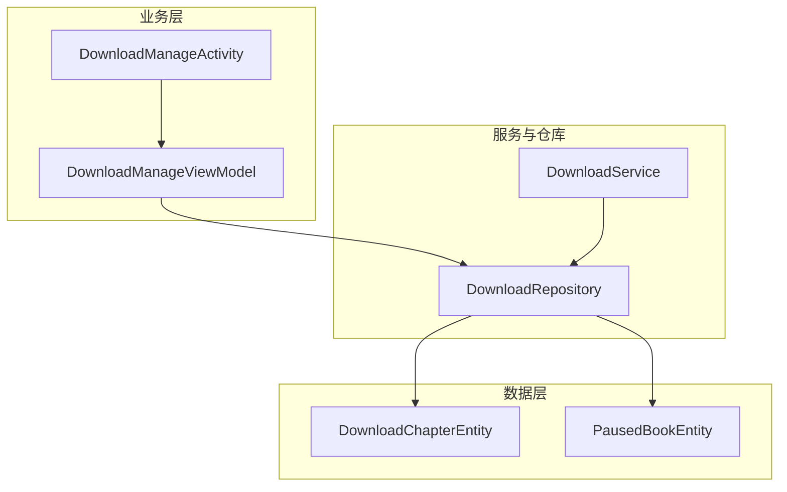
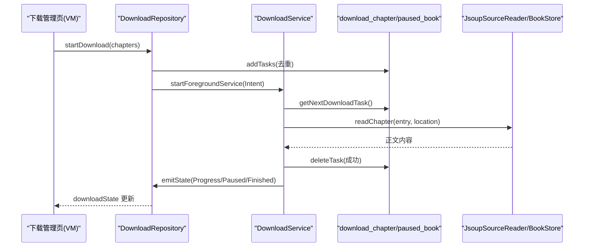
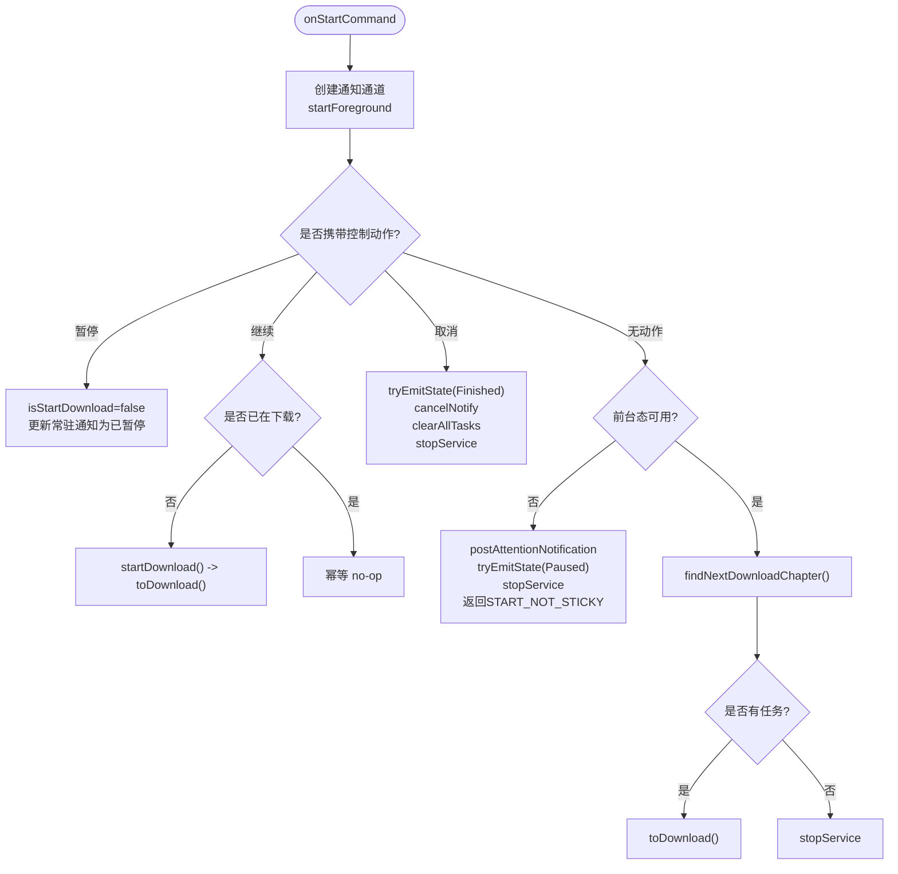
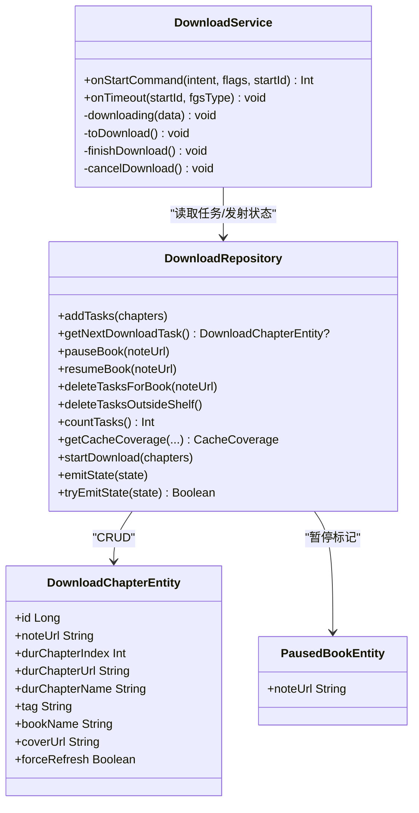
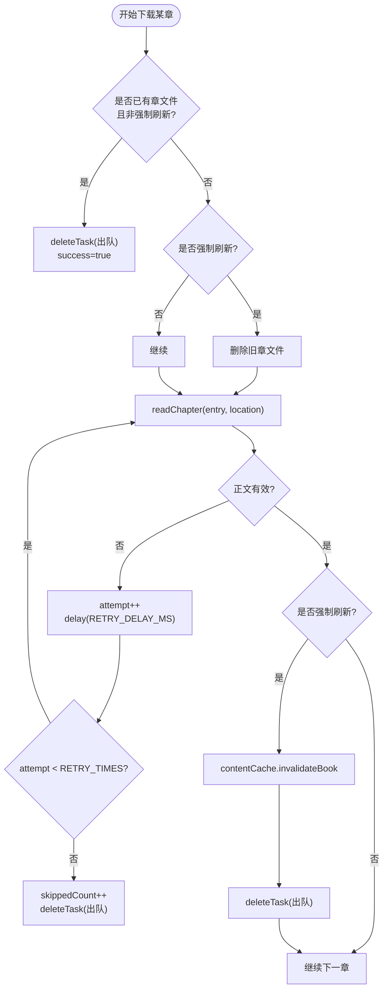
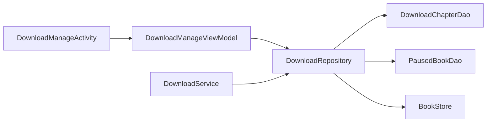

# 下载服务

<cite>
**本文引用的文件**
- [DownloadService.kt](file://module_book/src/main/java/com/ebook/book/service/DownloadService.kt)
- [DownloadRepository.kt](file://module_book/src/main/java/com/ebook/book/repository/DownloadRepository.kt)
- [DownloadChapterEntity.kt](file://lib_ebook_db/src/main/java/com/ebook/db/entity/DownloadChapterEntity.kt)
- [PausedBookEntity.kt](file://lib_ebook_db/src/main/java/com/ebook/db/entity/PausedBookEntity.kt)
- [DownloadManageActivity.kt](file://module_book/src/main/java/com/ebook/book/DownloadManageActivity.kt)
- [DownloadManageViewModel.kt](file://module_book/src/main/java/com/ebook/book/mvvm/viewmodel/DownloadManageViewModel.kt)
- [0018-download-foreground-service-data-sync-quota.md](file://docs/adr/0018-download-foreground-service-data-sync-quota.md)
</cite>

## 目录
1. [简介](#简介)
2. [项目结构](#项目结构)
3. [核心组件](#核心组件)
4. [架构总览](#架构总览)
5. [详细组件分析](#详细组件分析)
6. [依赖关系分析](#依赖关系分析)
7. [性能考量](#性能考量)
8. [故障排查指南](#故障排查指南)
9. [结论](#结论)
10. [附录](#附录)

## 简介
本文件面向下载服务的完整技术说明，覆盖前台服务生命周期、通知与用户交互、任务队列与调度、断点续传、网络优化、存储管理以及配置与调优。目标是帮助开发者快速理解并安全扩展下载能力，同时提供可操作的排障与性能优化建议。

## 项目结构
下载相关代码主要分布在以下模块与包：
- module_book：下载服务、下载管理与视图模型
- lib_ebook_db：下载任务实体与暂停标记实体
- docs/adr：前台服务配额与启动限制的设计决策记录

图表来源
- [DownloadService.kt:1-750](file://module_book/src/main/java/com/ebook/book/service/DownloadService.kt#L1-L750)
- [DownloadRepository.kt:1-312](file://module_book/src/main/java/com/ebook/book/repository/DownloadRepository.kt#L1-L312)
- [DownloadChapterEntity.kt:1-88](file://lib_ebook_db/src/main/java/com/ebook/db/entity/DownloadChapterEntity.kt#L1-L88)
- [PausedBookEntity.kt:1-31](file://lib_ebook_db/src/main/java/com/ebook/db/entity/PausedBookEntity.kt#L1-L31)

章节来源
- [DownloadService.kt:1-750](file://module_book/src/main/java/com/ebook/book/service/DownloadService.kt#L1-L750)
- [DownloadRepository.kt:1-312](file://module_book/src/main/java/com/ebook/book/repository/DownloadRepository.kt#L1-L312)
- [DownloadChapterEntity.kt:1-88](file://lib_ebook_db/src/main/java/com/ebook/db/entity/DownloadChapterEntity.kt#L1-L88)
- [PausedBookEntity.kt:1-31](file://lib_ebook_db/src/main/java/com/ebook/db/entity/PausedBookEntity.kt#L1-L31)

## 核心组件
- 下载前台服务 DownloadService：负责前台运行、通知展示、用户交互（暂停/继续/取消）、按章抓取、重试与出队、配额超时处理。
- 下载仓库 DownloadRepository：统一管理下载任务的增删改查、状态事件流、取篇策略（跳过暂停书）、覆盖率统计。
- 数据库实体：
  - DownloadChapterEntity：单章下载任务行，包含章节定位、归属源、书名封面、强制刷新标志等。
  - PausedBookEntity：按书暂停标记，实现“保留任务但跳过取篇”的队列策略。
- UI 层：DownloadManageActivity 与 DownloadManageViewModel 负责下载中心两级页面与状态聚合。

章节来源
- [DownloadService.kt:40-750](file://module_book/src/main/java/com/ebook/book/service/DownloadService.kt#L40-L750)
- [DownloadRepository.kt:30-312](file://module_book/src/main/java/com/ebook/book/repository/DownloadRepository.kt#L30-L312)
- [DownloadChapterEntity.kt:10-88](file://lib_ebook_db/src/main/java/com/ebook/db/entity/DownloadChapterEntity.kt#L10-L88)
- [PausedBookEntity.kt:9-31](file://lib_ebook_db/src/main/java/com/ebook/db/entity/PausedBookEntity.kt#L9-L31)
- [DownloadManageActivity.kt:59-139](file://module_book/src/main/java/com/ebook/book/DownloadManageActivity.kt#L59-L139)
- [DownloadManageViewModel.kt:29-430](file://module_book/src/main/java/com/ebook/book/mvvm/viewmodel/DownloadManageViewModel.kt#L29-L430)

## 架构总览
下载系统以“服务 + 仓库 + 数据库”为核心，UI 通过 ViewModel 订阅服务状态事件并进行操作。关键路径包括：
- 发起下载：先入库任务，再启动前台服务；服务从库中取篇逐章抓取。
- 任务调度：按书架顺序取篇，跳过本地书与暂停书。
- 进度回传：服务通过共享流推送 Progress/Paused/Finished 状态。
- 通知交互：常驻通知提供暂停/继续/取消动作，点击跳转应用主页。
- 配额与启动限制：Android 15+ dataSync 配额与后台启动限制在服务侧统一收口。

图表来源
- [DownloadRepository.kt:257-289](file://module_book/src/main/java/com/ebook/book/repository/DownloadRepository.kt#L257-L289)
- [DownloadService.kt:126-206](file://module_book/src/main/java/com/ebook/book/service/DownloadService.kt#L126-L206)
- [DownloadService.kt:274-378](file://module_book/src/main/java/com/ebook/book/service/DownloadService.kt#L274-L378)

章节来源
- [DownloadRepository.kt:257-289](file://module_book/src/main/java/com/ebook/book/repository/DownloadRepository.kt#L257-L289)
- [DownloadService.kt:126-206](file://module_book/src/main/java/com/ebook/book/service/DownloadService.kt#L126-L206)
- [DownloadService.kt:274-378](file://module_book/src/main/java/com/ebook/book/service/DownloadService.kt#L274-L378)

## 详细组件分析

### 前台服务设计架构（生命周期、通知、交互）
- 生命周期管理
  - onStartCommand：初始化通知通道与常驻通知；分发控制动作（暂停/继续/取消）；空载信号时读库取篇自动续跑。
  - onTimeout：dataSync 配额用尽时的收尾（置停止标记、清空回调、同步发射状态、发提示通知、立即 stopSelf）。
  - onDestroy：清理回调与作用域。
- 通知展示
  - 两条通道：进行中/已暂停（LOW，不弹横幅），完成（DEFAULT，允许弹一次横幅）。
  - 常驻通知不可被划走（setOngoing(true)），避免用户误关导致看不到进度。
  - 完成通知使用独立 id，服务销毁后仍可见。
- 用户交互
  - 通知按钮通过 PendingIntent.getForegroundService 直达服务 action，即使服务被回收也能先拉起再执行。
  - 下载管理页可通过 sendAction 发送相同动作，保持与通知一致的语义。

图表来源
- [DownloadService.kt:126-206](file://module_book/src/main/java/com/ebook/book/service/DownloadService.kt#L126-L206)
- [DownloadService.kt:380-420](file://module_book/src/main/java/com/ebook/book/service/DownloadService.kt#L380-L420)
- [DownloadService.kt:466-600](file://module_book/src/main/java/com/ebook/book/service/DownloadService.kt#L466-L600)

章节来源
- [DownloadService.kt:62-124](file://module_book/src/main/java/com/ebook/book/service/DownloadService.kt#L62-L124)
- [DownloadService.kt:126-206](file://module_book/src/main/java/com/ebook/book/service/DownloadService.kt#L126-L206)
- [DownloadService.kt:466-600](file://module_book/src/main/java/com/ebook/book/service/DownloadService.kt#L466-L600)
- [0018-download-foreground-service-data-sync-quota.md:1-59](file://docs/adr/0018-download-foreground-service-data-sync-quota.md#L1-L59)

### 任务队列管理机制（调度、优先级、并发）
- 任务入队：DownloadRepository.addTasks 按 durChapterUrl 去重后批量插入；支持 forceRefresh 标志用于强制重抓。
- 取篇策略：getNextDownloadTask 遍历书架，排除本地书与暂停书，按书架顺序取每本书的第一条任务。
- 暂停机制：paused_book 表记录暂停书；取篇时跳过该书，任务仍保留在队列中，继续时删除标记。
- 并发控制：服务内使用 Handler.postDelayed 与协程串行推进章节，单章失败重试最多 RETRY_TIMES 次，重试前延迟避开瞬时限流。
- 完成与清理：队列跑空或仅剩暂停任务时，分别进入 finishDownload 或静默停服；孤儿任务（书不在架）由 deleteTasksOutsideShelf 清理。

图表来源
- [DownloadRepository.kt:73-289](file://module_book/src/main/java/com/ebook/book/repository/DownloadRepository.kt#L73-L289)
- [DownloadService.kt:274-420](file://module_book/src/main/java/com/ebook/book/service/DownloadService.kt#L274-L420)
- [DownloadChapterEntity.kt:24-88](file://lib_ebook_db/src/main/java/com/ebook/db/entity/DownloadChapterEntity.kt#L24-L88)
- [PausedBookEntity.kt:23-31](file://lib_ebook_db/src/main/java/com/ebook/db/entity/PausedBookEntity.kt#L23-L31)

章节来源
- [DownloadRepository.kt:73-205](file://module_book/src/main/java/com/ebook/book/repository/DownloadRepository.kt#L73-L205)
- [DownloadService.kt:274-420](file://module_book/src/main/java/com/ebook/book/service/DownloadService.kt#L274-L420)
- [DownloadChapterEntity.kt:24-88](file://lib_ebook_db/src/main/java/com/ebook/db/entity/DownloadChapterEntity.kt#L24-L88)
- [PausedBookEntity.kt:23-31](file://lib_ebook_db/src/main/java/com/ebook/db/entity/PausedBookEntity.kt#L23-L31)

### 断点续传原理（分片、进度记录、恢复）
- 分片粒度：以“章”为单位进行下载与持久化，每个任务对应一章。
- 进度记录：download_chapter 表中仅保存未完成的任务；成功下载后删除该行，因此“剩余行数 = 剩余章数”。
- 恢复机制：服务冷启动或 START_STICKY 重启时，从库中取下一任务继续；若命中已有章文件且非强制刷新，直接视为完成并出队。
- 强制刷新：forceRefresh=true 会先删除旧章文件再重新抓取，随后失效进程级缓存，确保阅读器读到最新正文。

图表来源
- [DownloadService.kt:274-378](file://module_book/src/main/java/com/ebook/book/service/DownloadService.kt#L274-L378)

章节来源
- [DownloadService.kt:274-378](file://module_book/src/main/java/com/ebook/book/service/DownloadService.kt#L274-L378)
- [DownloadChapterEntity.kt:70-88](file://lib_ebook_db/src/main/java/com/ebook/db/entity/DownloadChapterEntity.kt#L70-L88)

### 网络请求优化（连接池、重试、错误处理）
- 连接复用：JsoupSourceReader 作为正文抓取后端，内部负责请求与写入；服务侧通过章节间隔与重试策略降低瞬时压力。
- 重试机制：单章最多 RETRY_TIMES=3 次，每次重试前延迟 RETRY_DELAY_MS=1000ms，规避瞬时限流与抖动。
- 错误处理：空正文视为解析失败抛出异常；重试耗尽后出队并计入 skippedCount；服务销毁/作用域取消时放行 CancellationException，避免无效循环。
- 配额与启动限制：Android 15+ dataSync 配额用尽时 onTimeout 快速收尾；启动被拒时由 DownloadService.start 捕获并返回 false，调用方提示用户。

章节来源
- [DownloadService.kt:274-378](file://module_book/src/main/java/com/ebook/book/service/DownloadService.kt#L274-L378)
- [DownloadService.kt:711-730](file://module_book/src/main/java/com/ebook/book/service/DownloadService.kt#L711-L730)
- [0018-download-foreground-service-data-sync-quota.md:20-39](file://docs/adr/0018-download-foreground-service-data-sync-quota.md#L20-L39)

### 存储管理（磁盘空间、缓存清理、完整性检查）
- 任务持久化：download_chapter 表只存未完成任务，成功即删除；主键自增，唯一索引保证同章不重复排队。
- 暂停标记：paused_book 表记录暂停书；取消本书或清空队列时连带清理。
- 缓存与覆盖率：
  - BookStore.hasChapter 判定章文件存在性，作为缓存事实源。
  - getCacheCoverage 计算全书覆盖率（已缓存/总章节），用于进度条展示。
- 孤儿清理：deleteTasksOutsideShelf 清理不在书架的书的任务，避免残留阻塞。
- 内存缓存失效：强制刷新成功后调用 contentCache.invalidateBook，确保阅读器读到新正文。

章节来源
- [DownloadRepository.kt:121-205](file://module_book/src/main/java/com/ebook/book/repository/DownloadRepository.kt#L121-L205)
- [DownloadRepository.kt:207-254](file://module_book/src/main/java/com/ebook/book/repository/DownloadRepository.kt#L207-L254)
- [DownloadService.kt:295-340](file://module_book/src/main/java/com/ebook/book/service/DownloadService.kt#L295-L340)

### 下载配置选项与性能调优指南
- 可调参数（服务内常量）：
  - RETRY_TIMES：单章最大重试次数，默认 3。
  - RETRY_DELAY_MS：重试前等待时间，默认 1000ms。
  - CHAPTER_INTERVAL_MS：章间间隔，默认 800ms，降低对书源站点压力。
- 性能建议：
  - 合理设置章节间隔与重试延迟，平衡速度与稳定性。
  - 使用 forceRefresh 谨慎刷新缓存，避免频繁失效影响阅读体验。
  - 监控 dataSync 配额，避免长时间下载触发 onTimeout。
- 常见问题诊断：
  - 通知权限未授予：通知静默丢弃但下载不受影响；如需提示可在 UI 层申请 POST_NOTIFICATIONS。
  - 启动被拒：dataSync 配额用尽或后台限制，调用 DownloadService.start 返回 false，需提示用户稍后再试。
  - 任务卡住：检查 paused_book 与 download_chapter 表，确认取篇逻辑是否跳过该书或存在孤儿任务。

章节来源
- [DownloadService.kt:668-677](file://module_book/src/main/java/com/ebook/book/service/DownloadService.kt#L668-L677)
- [DownloadService.kt:711-730](file://module_book/src/main/java/com/ebook/book/service/DownloadService.kt#L711-L730)
- [DownloadManageActivity.kt:127-139](file://module_book/src/main/java/com/ebook/book/DownloadManageActivity.kt#L127-L139)

## 依赖关系分析
- 服务依赖仓库进行任务存取与状态发射；仓库依赖 DAO 与 BookStore 进行数据访问与缓存判定。
- UI 层通过 ViewModel 订阅仓库的状态流并驱动页面渲染。
- 数据库实体提供任务与暂停标记的数据模型，遵循自然键与自增键组合策略。

图表来源
- [DownloadManageViewModel.kt:121-430](file://module_book/src/main/java/com/ebook/book/mvvm/viewmodel/DownloadManageViewModel.kt#L121-L430)
- [DownloadRepository.kt:45-289](file://module_book/src/main/java/com/ebook/book/repository/DownloadRepository.kt#L45-L289)
- [DownloadService.kt:56-670](file://module_book/src/main/java/com/ebook/book/service/DownloadService.kt#L56-L670)

章节来源
- [DownloadManageViewModel.kt:121-430](file://module_book/src/main/java/com/ebook/book/mvvm/viewmodel/DownloadManageViewModel.kt#L121-L430)
- [DownloadRepository.kt:45-289](file://module_book/src/main/java/com/ebook/book/repository/DownloadRepository.kt#L45-L289)
- [DownloadService.kt:56-670](file://module_book/src/main/java/com/ebook/book/service/DownloadService.kt#L56-L670)

## 性能考量
- 任务调度串行化：服务内通过 Handler.postDelayed 与协程串行推进章节，避免并发抓取导致的资源争用与限流。
- 重试退避：重试前固定延迟，减少瞬时失败对书源的压力。
- 通知更新异步化：通知更新封装在协程中并整体兜底，避免通知异常中断下载流水线。
- 配额感知：onTimeout 快速收尾，防止长期占用前台服务导致系统异常终止。

[本节为通用性能讨论，不直接分析具体文件]

## 故障排查指南
- 前台服务无法启动
  - 现象：点击“全部开始”无响应或闪退。
  - 原因：dataSync 配额用尽或后台启动限制。
  - 处理：查看 DownloadService.start 返回值，提示用户稍后再试；任务已在库中，待配额重置或回到前台后重试。
- 下载通知不可见
  - 现象：下载在进行但通知栏无进度。
  - 原因：POST_NOTIFICATIONS 未授权或通知被关闭。
  - 处理：在 UI 层申请权限；注意通知不可用不影响下载流程。
- 任务卡住或无限重试
  - 现象：常驻通知不消失，某章反复重试。
  - 原因：书源失效或正文解析失败；重试耗尽应出队。
  - 处理：检查 skippedCount 与日志；确认 downl oad_chapter 表是否仍有该章任务；必要时手动取消本书或清空队列。
- 配额用尽
  - 现象：下载中途停止，收到提示通知。
  - 原因：dataSync 24 小时内累计 6 小时上限。
  - 处理：等待配额重置或回到前台；服务会在 onTimeout 中快速收尾。

章节来源
- [DownloadService.kt:711-730](file://module_book/src/main/java/com/ebook/book/service/DownloadService.kt#L711-L730)
- [DownloadManageActivity.kt:127-139](file://module_book/src/main/java/com/ebook/book/DownloadManageActivity.kt#L127-L139)
- [DownloadService.kt:115-124](file://module_book/src/main/java/com/ebook/book/service/DownloadService.kt#L115-L124)

## 结论
下载服务通过前台服务、仓库与数据库的协作，实现了可靠的离线下载能力。其设计充分考虑了 Android 平台的前台服务配额与启动限制，采用任务持久化、暂停策略、重试退避与通知交互，确保了用户体验与系统稳定性。通过合理的配置与调优，可在不同场景下取得良好的性能与可靠性。

[本节为总结，不直接分析具体文件]

## 附录
- ADR 参考：前台服务配额与启动限制的设计决策，详见文档 0018。
- 实体定义：下载任务与暂停标记的字段与约束，详见实体文件注释。
- 界面行为：下载中心的两级页面与状态聚合，详见 Activity 与 ViewModel。

章节来源
- [0018-download-foreground-service-data-sync-quota.md:1-59](file://docs/adr/0018-download-foreground-service-data-sync-quota.md#L1-L59)
- [DownloadChapterEntity.kt:10-88](file://lib_ebook_db/src/main/java/com/ebook/db/entity/DownloadChapterEntity.kt#L10-L88)
- [PausedBookEntity.kt:9-31](file://lib_ebook_db/src/main/java/com/ebook/db/entity/PausedBookEntity.kt#L9-L31)
- [DownloadManageActivity.kt:59-139](file://module_book/src/main/java/com/ebook/book/DownloadManageActivity.kt#L59-L139)
- [DownloadManageViewModel.kt:29-430](file://module_book/src/main/java/com/ebook/book/mvvm/viewmodel/DownloadManageViewModel.kt#L29-L430)