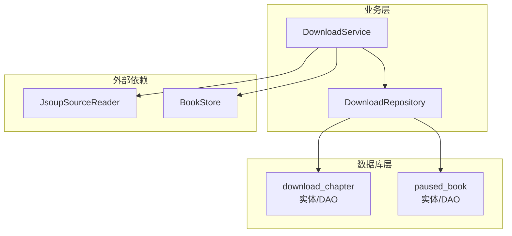
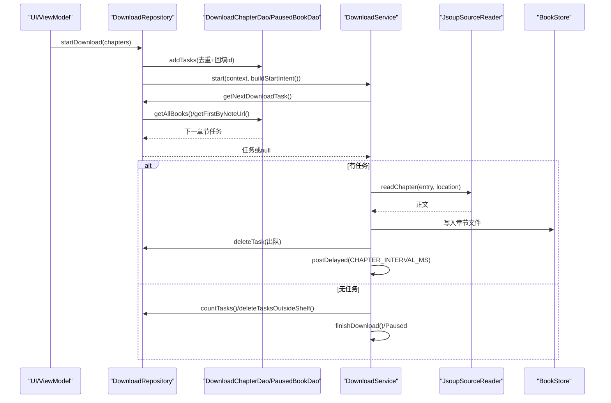
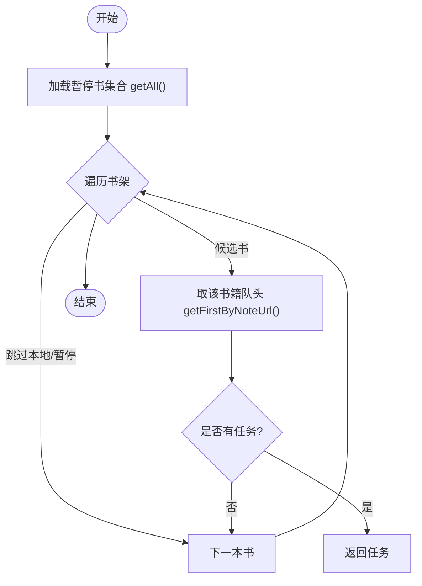
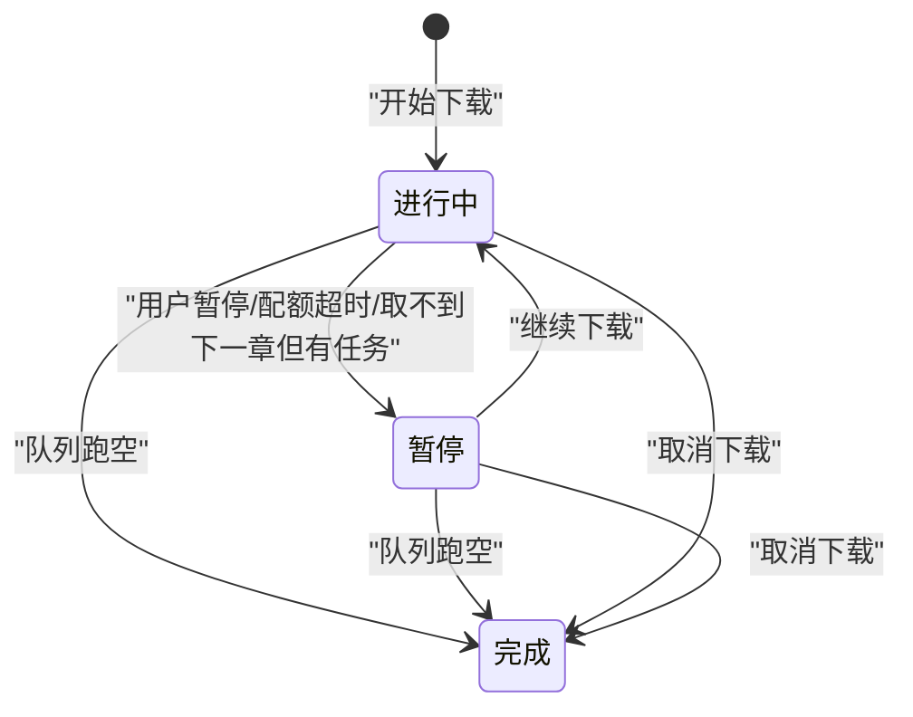
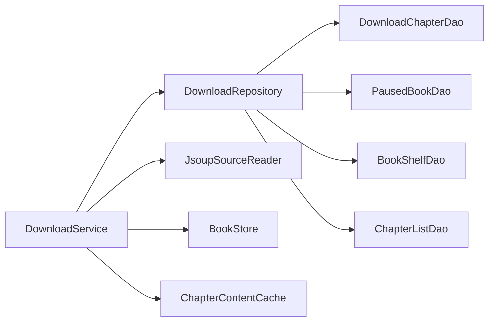

# 任务队列管理

<cite>
**本文引用的文件**
- [DownloadChapterEntity.kt](file://lib_ebook_db/src/main/java/com/ebook/db/entity/DownloadChapterEntity.kt)
- [PausedBookEntity.kt](file://lib_ebook_db/src/main/java/com/ebook/db/entity/PausedBookEntity.kt)
- [DownloadChapterDao.kt](file://lib_ebook_db/src/main/java/com/ebook/db/dao/DownloadChapterDao.kt)
- [PausedBookDao.kt](file://lib_ebook_db/src/main/java/com/ebook/db/dao/PausedBookDao.kt)
- [DownloadRepository.kt](file://module_book/src/main/java/com/ebook/book/repository/DownloadRepository.kt)
- [DownloadService.kt](file://module_book/src/main/java/com/ebook/book/service/DownloadService.kt)
- [0036-download-pause-per-book.md](file://docs/adr/0036-download-pause-per-book.md)
- [0018-download-foreground-service-data-sync-quota.md](file://docs/adr/0018-download-foreground-service-data-sync-quota.md)
</cite>

## 目录
1. [简介](#简介)
2. [项目结构](#项目结构)
3. [核心组件](#核心组件)
4. [架构总览](#架构总览)
5. [详细组件分析](#详细组件分析)
6. [依赖关系分析](#依赖关系分析)
7. [性能与并发](#性能与并发)
8. [故障排查与恢复](#故障排查与恢复)
9. [结论](#结论)
10. [附录](#附录)

## 简介
本技术文档围绕下载任务队列管理展开，聚焦于 download_chapter 表的任务调度机制与 paused_book 的按书暂停策略。内容覆盖：
- getNextDownloadTask 的查询逻辑与优先级排序（书架顺序、dur_chapter_index）
- 任务的入队、出队、删除操作（addTasks、deleteTask、clearAllTasks）
- 暂停书处理策略（paused_book 表的作用与跳过逻辑）
- 任务状态机（进行中、暂停、完成、取消）及转换条件
- 并发控制（单任务串行执行、重试间隔配置）
- 队列监控与故障恢复操作指南

## 项目结构
下载相关代码分布在以下模块：
- lib_ebook_db：数据实体与 DAO（download_chapter、paused_book）
- module_book：下载服务 DownloadService 与仓库 DownloadRepository
- docs/adr：设计决策记录（按书暂停、前台服务配额等）

**图示来源**
- [DownloadChapterDao.kt:21-131](file://lib_ebook_db/src/main/java/com/ebook/db/dao/DownloadChapterDao.kt#L21-L131)
- [PausedBookDao.kt:19-36](file://lib_ebook_db/src/main/java/com/ebook/db/dao/PausedBookDao.kt#L19-L36)
- [DownloadRepository.kt:45-289](file://module_book/src/main/java/com/ebook/book/repository/DownloadRepository.kt#L45-L289)
- [DownloadService.kt:57-749](file://module_book/src/main/java/com/ebook/book/service/DownloadService.kt#L57-L749)

**章节来源**
- [DownloadChapterEntity.kt:10-88](file://lib_ebook_db/src/main/java/com/ebook/db/entity/DownloadChapterEntity.kt#L10-L88)
- [PausedBookEntity.kt:9-30](file://lib_ebook_db/src/main/java/com/ebook/db/entity/PausedBookEntity.kt#L9-L30)
- [DownloadChapterDao.kt:21-131](file://lib_ebook_db/src/main/java/com/ebook/db/dao/DownloadChapterDao.kt#L21-L131)
- [PausedBookDao.kt:19-36](file://lib_ebook_db/src/main/java/com/ebook/db/dao/PausedBookDao.kt#L19-L36)
- [DownloadRepository.kt:45-289](file://module_book/src/main/java/com/ebook/book/repository/DownloadRepository.kt#L45-L289)
- [DownloadService.kt:57-749](file://module_book/src/main/java/com/ebook/book/service/DownloadService.kt#L57-L749)

## 核心组件
- DownloadChapterEntity：表示未完成任务的一行（包含 note_url、dur_chapter_index/dur_chapter_url/dur_chapter_name、tag、book_name、cover_url、force_refresh）。唯一索引在 dur_chapter_url，普通索引在 note_url。
- PausedBookEntity：按书暂停标记（note_url 主键），存在即该书暂停。
- DownloadChapterDao：提供取队头/队尾、按书查询、全局队头、插入、删除、清空、计数等操作。
- PausedBookDao：提供插入/删除暂停标记、获取全部暂停书、清空所有标记。
- DownloadRepository：封装任务 CRUD、取下一章（跳过暂停书）、添加任务（去重回填 id）、清理孤儿任务、统计覆盖率等。
- DownloadService：前台服务，负责逐章抓取、重试、通知、超时处理、暂停/继续/取消等。

**章节来源**
- [DownloadChapterEntity.kt:10-88](file://lib_ebook_db/src/main/java/com/ebook/db/entity/DownloadChapterEntity.kt#L10-L88)
- [PausedBookEntity.kt:9-30](file://lib_ebook_db/src/main/java/com/ebook/db/entity/PausedBookEntity.kt#L9-L30)
- [DownloadChapterDao.kt:21-131](file://lib_ebook_db/src/main/java/com/ebook/db/dao/DownloadChapterDao.kt#L21-L131)
- [PausedBookDao.kt:19-36](file://lib_ebook_db/src/main/java/com/ebook/db/dao/PausedBookDao.kt#L19-L36)
- [DownloadRepository.kt:45-289](file://module_book/src/main/java/com/ebook/book/repository/DownloadRepository.kt#L45-L289)
- [DownloadService.kt:57-749](file://module_book/src/main/java/com/ebook/book/service/DownloadService.kt#L57-L749)

## 架构总览
下载流程由仓库与服务协作完成：调用方先入库任务，再启动前台服务；服务读库取篇，逐章抓取并写入本地文件，完成后出队；失败则重试，耗尽后出队并计入跳过数；支持按书暂停和全局暂停/继续/取消。

**图示来源**
- [DownloadRepository.kt:267-273](file://module_book/src/main/java/com/ebook/book/repository/DownloadRepository.kt#L267-L273)
- [DownloadRepository.kt:73-82](file://module_book/src/main/java/com/ebook/book/repository/DownloadRepository.kt#L73-L82)
- [DownloadService.kt:252-378](file://module_book/src/main/java/com/ebook/book/service/DownloadService.kt#L252-L378)
- [DownloadChapterDao.kt:33-56](file://lib_ebook_db/src/main/java/com/ebook/db/dao/DownloadChapterDao.kt#L33-L56)

## 详细组件分析

### download_chapter 表与任务模型
- 字段说明：note_url（按书分组/取消）、dur_chapter_index（章节序号）、dur_chapter_url（唯一索引，保证同章不重复排队）、dur_chapter_name、tag（书源归属）、book_name、cover_url、force_refresh（强制刷新标志）。
- 索引策略：dur_chapter_url 唯一索引防重复；note_url 普通索引支撑按书取队头与按书取消。
- 语义：表只存未完成任务，成功或重试耗尽被跳过即删除，因此行数等于剩余待下章节数。

**章节来源**
- [DownloadChapterEntity.kt:10-88](file://lib_ebook_db/src/main/java/com/ebook/db/entity/DownloadChapterEntity.kt#L10-L88)
- [DownloadChapterDao.kt:10-20](file://lib_ebook_db/src/main/java/com/ebook/db/dao/DownloadChapterDao.kt#L10-L20)

### 任务查询与优先级（getNextDownloadTask）
- 优先级规则：遍历书架（book_shelf），排除本地书（LOCAL_TAG）与已暂停书（paused_book），对每本书取 dur_chapter_index 最小的任务（getFirstByNoteUrl），命中即返回。
- 结果：按“书架顺序 + 每本书内部章节顺序”选择下一个任务，确保阅读/下载体验符合预期。
- 若全部书均暂停或无任务，返回 null。

**图示来源**
- [DownloadRepository.kt:73-82](file://module_book/src/main/java/com/ebook/book/repository/DownloadRepository.kt#L73-L82)
- [DownloadChapterDao.kt:33-42](file://lib_ebook_db/src/main/java/com/ebook/db/dao/DownloadChapterDao.kt#L33-L42)
- [PausedBookDao.kt:29-31](file://lib_ebook_db/src/main/java/com/ebook/db/dao/PausedBookDao.kt#L29-L31)

**章节来源**
- [DownloadRepository.kt:73-82](file://module_book/src/main/java/com/ebook/book/repository/DownloadRepository.kt#L73-L82)
- [DownloadChapterDao.kt:33-42](file://lib_ebook_db/src/main/java/com/ebook/db/dao/DownloadChapterDao.kt#L33-L42)
- [PausedBookDao.kt:29-31](file://lib_ebook_db/src/main/java/com/ebook/db/dao/PausedBookDao.kt#L29-L31)

### 任务入队（addTasks）
- 去重：按 dur_chapter_url 查已有任务，若有则回填其 id 再进行 REPLACE 插入，避免重复排队。
- 保留标记：透传 force_refresh 标记，以便下载时决定是否先删旧内容再重抓。
- 批量插入：insertAll 一次提交，提升效率。

**章节来源**
- [DownloadRepository.kt:121-139](file://module_book/src/main/java/com/ebook/book/repository/DownloadRepository.kt#L121-L139)
- [DownloadChapterDao.kt:98-110](file://lib_ebook_db/src/main/java/com/ebook/db/dao/DownloadChapterDao.kt#L98-L110)

### 任务出队与删除（deleteTask、clearAllTasks）
- 单任务出队：下载成功或命中缓存且非强制刷新时，删除该行以出队。
- 失败重试耗尽：同样删除该行出队，并计入 skippedCount。
- 清空全部：用于取消下载或收尾阶段，同时清掉 paused_book 标记（避免残留导致下次静默暂停）。

**章节来源**
- [DownloadService.kt:274-378](file://module_book/src/main/java/com/ebook/book/service/DownloadService.kt#L274-L378)
- [DownloadRepository.kt:141-150](file://module_book/src/main/java/com/ebook/book/repository/DownloadRepository.kt#L141-L150)
- [DownloadChapterDao.kt:112-131](file://lib_ebook_db/src/main/java/com/ebook/db/dao/DownloadChapterDao.kt#L112-L131)

### 暂停书策略（paused_book）
- 作用：按书暂停的持久化标记，存在即该书暂停；不影响其他书的任务推进。
- 跳过逻辑：getNextDownloadTask 与 findLatestDownloadTask 在遍历书架时，若某书在 paused_book 中则跳过。
- 行为：暂停期间任务仍保留在 download_chapter，继续（resumeBook）后轮到即下。
- 清理：取消本书或清空队列时，同步清理该书的暂停标记。

**章节来源**
- [PausedBookEntity.kt:9-30](file://lib_ebook_db/src/main/java/com/ebook/db/entity/PausedBookEntity.kt#L9-L30)
- [DownloadRepository.kt:84-119](file://module_book/src/main/java/com/ebook/book/repository/DownloadRepository.kt#L84-L119)
- [0036-download-pause-per-book.md:1-53](file://docs/adr/0036-download-pause-per-book.md#L1-L53)

### 任务状态机
- 进行中（Progress）：服务每章抓取前发射 Progress，更新常驻通知。
- 暂停（Paused）：全局暂停（ACTION_PAUSE）、前台配额超时（onTimeout）、或取不到下一章但仍有任务（全在暂停书）时进入。
- 完成（Finished）：队列跑空且无暂停任务时，发完成态与完成通知。
- 取消（Cancel）：ACTION_CANCEL 清空队列并结束，状态为 Finished。

**图示来源**
- [DownloadService.kt:155-172](file://module_book/src/main/java/com/ebook/book/service/DownloadService.kt#L155-L172)
- [DownloadService.kt:212-247](file://module_book/src/main/java/com/ebook/book/service/DownloadService.kt#L212-L247)
- [DownloadService.kt:422-442](file://module_book/src/main/java/com/ebook/book/service/DownloadService.kt#L422-L442)
- [DownloadService.kt:646-666](file://module_book/src/main/java/com/ebook/book/service/DownloadService.kt#L646-L666)

**章节来源**
- [DownloadService.kt:155-172](file://module_book/src/main/java/com/ebook/book/service/DownloadService.kt#L155-L172)
- [DownloadService.kt:212-247](file://module_book/src/main/java/com/ebook/book/service/DownloadService.kt#L212-L247)
- [DownloadService.kt:422-442](file://module_book/src/main/java/com/ebook/book/service/DownloadService.kt#L422-L442)
- [DownloadService.kt:646-666](file://module_book/src/main/java/com/ebook/book/service/DownloadService.kt#L646-L666)

### 并发控制与重试
- 单任务串行：服务维护 isDownloading 与 isStartDownload，通过 Handler.postDelayed 与 toDownload 循环推进，同一时刻仅一个章节在下载。
- 重试策略：每章最多重试 RETRY_TIMES=3 次，每次重试前等待 RETRY_DELAY_MS=1_000ms，避开瞬时限流/抖动。
- 章节间隔：每章之间延迟 CHAPTER_INTERVAL_MS=800ms，降低对书源站点的压力。
- 失败处理：重试耗尽后出队并计入 skippedCount，后续章节继续推进。

**章节来源**
- [DownloadService.kt:274-378](file://module_book/src/main/java/com/ebook/book/service/DownloadService.kt#L274-L378)
- [DownloadService.kt:668-676](file://module_book/src/main/java/com/ebook/book/service/DownloadService.kt#L668-L676)

## 依赖关系分析
- DownloadRepository 依赖 BookShelfDao、ChapterListDao、DownloadChapterDao、PausedBookDao、BookStore。
- DownloadService 依赖 DownloadRepository、JsoupSourceReader、BookStore、ChapterContentCache。
- 数据库实体与 DAO 提供持久化能力，服务通过仓库抽象访问。

**图示来源**
- [DownloadService.kt:57-66](file://module_book/src/main/java/com/ebook/book/service/DownloadService.kt#L57-L66)
- [DownloadRepository.kt:45-52](file://module_book/src/main/java/com/ebook/book/repository/DownloadRepository.kt#L45-L52)

**章节来源**
- [DownloadService.kt:57-66](file://module_book/src/main/java/com/ebook/book/service/DownloadService.kt#L57-L66)
- [DownloadRepository.kt:45-52](file://module_book/src/main/java/com/ebook/book/repository/DownloadRepository.kt#L45-L52)

## 性能与并发
- 队列规模小：download_chapter 只存未完成任务，一次性 getAllTasks 在 Kotlin 侧分组即可，无需复杂 SQL 聚合。
- 去重与幂等：入队前按 URL 查重，REPLACE 策略保证幂等。
- 重试与间隔：固定重试次数与延时，避免网络抖动与限流。
- 前台服务配额：dataSync 类型受 24h/6h 限制，服务内统一处理超时与启动被拒。

[本节为通用指导，不直接分析具体文件]

## 故障排查与恢复
- 常见问题
  - 队列一直卡住：检查是否存在失败任务未出队（downloading 中重试耗尽才会出队）。
  - 任务不推进：确认是否整批书处于暂停状态（paused_book），取不到下一章会进入 Paused。
  - 通知不可用：Android 13+ 未授权 POST_NOTIFICATIONS 时通知会被丢弃，但不影响下载流程。
  - 前台服务无法启动：dataSync 配额用尽或后台启动限制，start() 返回 false 提示用户。
- 恢复步骤
  - 暂停书继续：调用 resumeBook(noteUrl) 移除暂停标记，或通过下载管理页“继续下载”。
  - 取消任务：使用 cancelDownload 清空队列并停止服务。
  - 清理孤儿任务：deleteTasksOutsideShelf 清理不在书架的书对应的任务。
  - 强制刷新：设置 force_refresh=true，下载时会先删旧内容再重抓，并失效内存缓存。

**章节来源**
- [DownloadService.kt:386-420](file://module_book/src/main/java/com/ebook/book/service/DownloadService.kt#L386-L420)
- [DownloadRepository.kt:187-205](file://module_book/src/main/java/com/ebook/book/repository/DownloadRepository.kt#L187-L205)
- [0018-download-foreground-service-data-sync-quota.md:20-38](file://docs/adr/0018-download-foreground-service-data-sync-quota.md#L20-L38)

## 结论
下载任务队列通过 download_chapter 与 paused_book 协同实现：
- 任务按书架顺序与章节序号调度，支持按书暂停与全局暂停/继续/取消。
- 服务采用单任务串行与固定重试/间隔策略，保障稳定性与资源占用可控。
- 状态机清晰，结合通知与事件通道提供良好用户体验。
- 前台服务配额与启动限制在服务层收口，确保健壮性。

[本节总结不直接分析具体文件]

## 附录
- ADR-0036：按书暂停与下载中心操作面板的设计决策与实现要点。
- ADR-0018：前台服务 dataSync 配额与启动限制的约束与处理方案。

**章节来源**
- [0036-download-pause-per-book.md:1-53](file://docs/adr/0036-download-pause-per-book.md#L1-L53)
- [0018-download-foreground-service-data-sync-quota.md:1-59](file://docs/adr/0018-download-foreground-service-data-sync-quota.md#L1-L59)