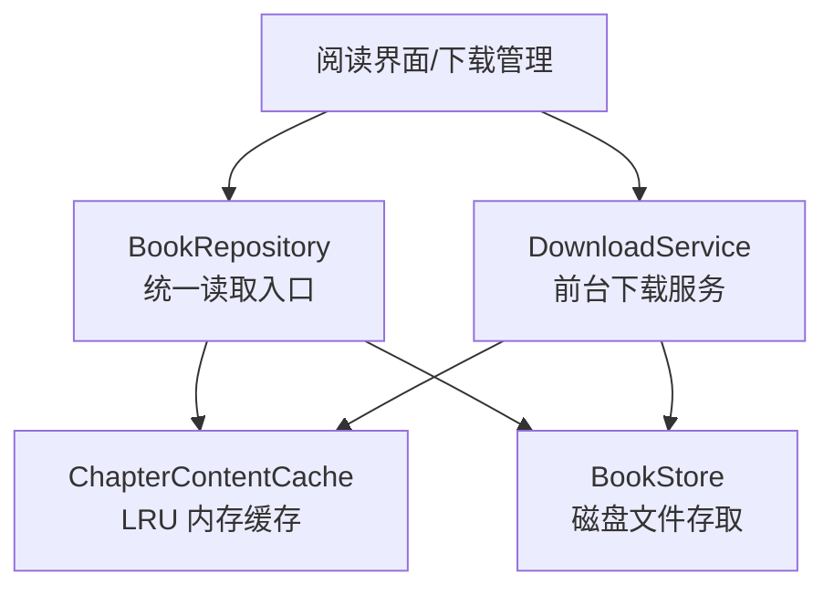
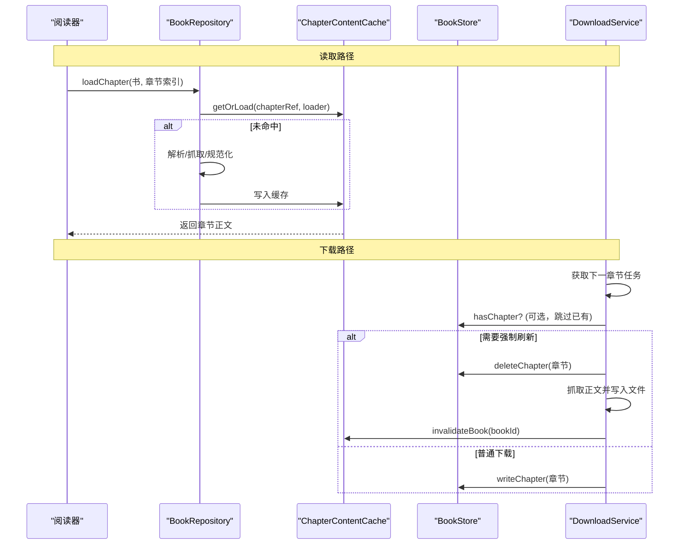
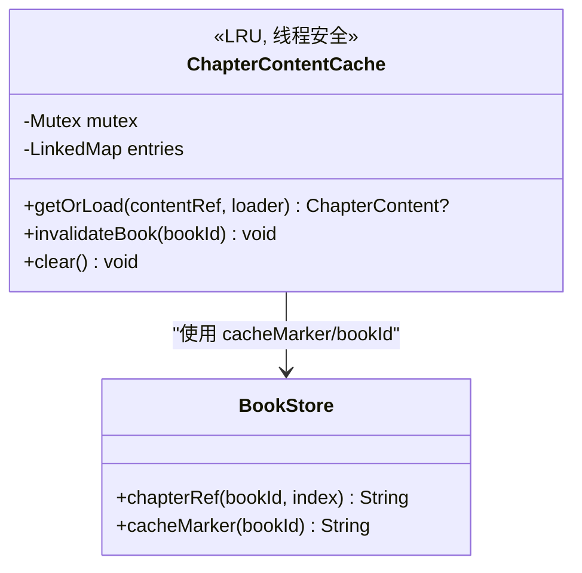
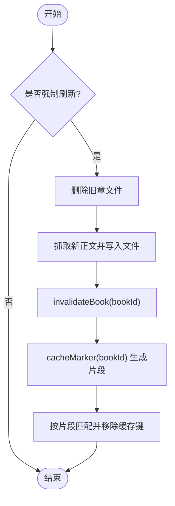
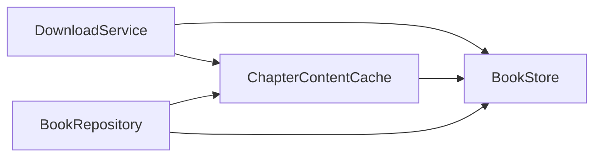

# 内容缓存集成

<cite>
**本文引用的文件**
- [ChapterContentCache.kt](file://lib_book_common/src/main/java/com/ebook/common/store/ChapterContentCache.kt)
- [BookStore.kt](file://lib_book_common/src/main/java/com/ebook/common/store/BookStore.kt)
- [DownloadService.kt](file://module_book/src/main/java/com/ebook/book/service/DownloadService.kt)
- [BookRepository.kt](file://lib_book_common/src/main/java/com/ebook/common/repository/BookRepository.kt)
- [ChapterContentCacheTest.kt](file://lib_book_common/src/test/java/com/ebook/common/store/ChapterContentCacheTest.kt)
</cite>

## 目录
1. [引言](#引言)
2. [项目结构](#项目结构)
3. [核心组件](#核心组件)
4. [架构总览](#架构总览)
5. [详细组件分析](#详细组件分析)
6. [依赖关系分析](#依赖关系分析)
7. [性能考量](#性能考量)
8. [故障排查指南](#故障排查指南)
9. [结论](#结论)

## 引言
本文聚焦下载服务与内容缓存的集成设计，重点解释章节正文内存缓存 ChapterContentCache 的设计原理、容量策略（默认 3）、键值设计（content_ref），以及强制刷新时的缓存失效机制、下载成功后的缓存与磁盘同步策略、缓存与磁盘文件的协调关系、多线程一致性保障，并给出性能优化与故障排查建议。

## 项目结构
围绕“下载—存储—缓存—读取”的关键路径，涉及以下模块与职责：
- 下载前台服务 DownloadService：负责逐章抓取、写入磁盘、控制队列与通知；在强制刷新重抓成功后触发内存缓存失效。
- 内容仓库 BookStore：负责章节文件的读写、存在性检查、删除单章、对账清理等。
- 内存缓存 ChapterContentCache：提供基于 LRU 的进程级章节正文缓存，通过 Mutex 保证并发安全。
- 数据访问层 BookRepository：统一章节读取入口，封装加载流程（解析→规范化→缓存），并在删除书/换源/补章时触发缓存失效。

图表来源
- [BookRepository.kt:455-475](file://lib_book_common/src/main/java/com/ebook/common/repository/BookRepository.kt#L455-L475)
- [ChapterContentCache.kt:25-63](file://lib_book_common/src/main/java/com/ebook/common/store/ChapterContentCache.kt#L25-L63)
- [BookStore.kt:37-216](file://lib_book_common/src/main/java/com/ebook/common/store/BookStore.kt#L37-L216)
- [DownloadService.kt:274-378](file://module_book/src/main/java/com/ebook/book/service/DownloadService.kt#L274-L378)

章节来源
- [BookRepository.kt:455-475](file://lib_book_common/src/main/java/com/ebook/common/repository/BookRepository.kt#L455-L475)
- [ChapterContentCache.kt:25-63](file://lib_book_common/src/main/java/com/ebook/common/store/ChapterContentCache.kt#L25-L63)
- [BookStore.kt:37-216](file://lib_book_common/src/main/java/com/ebook/common/store/BookStore.kt#L37-L216)
- [DownloadService.kt:274-378](file://module_book/src/main/java/com/ebook/book/service/DownloadService.kt#L274-L378)

## 核心组件
- ChapterContentCache：进程级章节正文内存缓存，采用 LinkedHashMap 按访问顺序维护，容量默认 3（当前章+前后各一）。通过 getOrLoad 实现“命中即返回，未命中执行 loader 并缓存”，loader 在锁外运行避免阻塞其他章节；invalidateBook 按 bookId 派生的片段标记批量剔除；clear 清空全部。
- BookStore：章节文件仓库，提供 chapterRef/chapterFile/hasChapter/writeChapter/readParagraphs/deleteChapter/storageUsage/reconcile 等方法；cacheMarker 用于按书维度构造缓存失效片段。
- DownloadService：前台下载服务，逐章抓取后写入磁盘；当 forceRefresh 为真且已存在旧章文件时先删除该章文件，重抓成功后调用 contentCache.invalidateBook 使内存缓存失效。
- BookRepository：统一 loadChapter 入口，将解析结果规范化后交给 ChapterContentCache；在移除书架条目、刷新单章、合并尾部章节等场景触发缓存失效或磁盘删除。

章节来源
- [ChapterContentCache.kt:25-63](file://lib_book_common/src/main/java/com/ebook/common/store/ChapterContentCache.kt#L25-L63)
- [BookStore.kt:37-216](file://lib_book_common/src/main/java/com/ebook/common/store/BookStore.kt#L37-L216)
- [DownloadService.kt:274-378](file://module_book/src/main/java/com/ebook/book/service/DownloadService.kt#L274-L378)
- [BookRepository.kt:193-201](file://lib_book_common/src/main/java/com/ebook/common/repository/BookRepository.kt#L193-L201)
- [BookRepository.kt:477-490](file://lib_book_common/src/main/java/com/ebook/common/repository/BookRepository.kt#L477-L490)
- [BookRepository.kt:775-779](file://lib_book_common/src/main/java/com/ebook/common/repository/BookRepository.kt#L775-L779)

## 架构总览
下载与读取两条主线共用同一份“章节文件 + 内存缓存”的双层存储：
- 读取路径：Reader → BookRepository.loadChapter → 计算 cacheKey（chapterRef）→ ChapterContentCache.getOrLoad → 若未命中则 reader 读取/网络抓取 → 规范化 → 回写缓存。
- 下载路径：DownloadService 取任务 → JsoupSourceReader.readChapter → 写入章文件 → 若 forceRefresh 且命中旧文件则删除旧文件 → 成功后 invalidateBook 失效内存缓存。

图表来源
- [BookRepository.kt:455-475](file://lib_book_common/src/main/java/com/ebook/common/repository/BookRepository.kt#L455-L475)
- [ChapterContentCache.kt:41-46](file://lib_book_common/src/main/java/com/ebook/common/store/ChapterContentCache.kt#L41-L46)
- [DownloadService.kt:274-378](file://module_book/src/main/java/com/ebook/book/service/DownloadService.kt#L274-L378)
- [BookStore.kt:48-53](file://lib_book_common/src/main/java/com/ebook/common/store/BookStore.kt#L48-L53)

## 详细组件分析

### ChapterContentCache：LRU 内存缓存
- 数据结构：LinkedHashMap(accessOrder=true) 维护访问顺序，头部为最久未使用；当 size > capacity 时 removeEldestEntry 自动淘汰。
- 容量配置：默认容量为 3，对应“当前章 + 上一页 + 下一页”的阅读窗口，减少重复 IO。
- 键值设计：键为 content_ref（形如 books/<书目录名>/cNNNNN.txt），由 BookStore.chapterRef 生成，包含书目录名以便按书失效。
- 并发控制：getOrLoad 内部用 Mutex.withLock 保护读/写；loader 在锁外执行，避免读盘/网络阻塞其他章节。
- 失效接口：
  - invalidateBook(bookId)：通过 BookStore.cacheMarker(bookId) 得到书中片段（如 /<目录名>/），过滤并删除所有匹配的键。
  - clear()：清空全部缓存。

图表来源
- [ChapterContentCache.kt:25-63](file://lib_book_common/src/main/java/com/ebook/common/store/ChapterContentCache.kt#L25-L63)
- [BookStore.kt:162-215](file://lib_book_common/src/main/java/com/ebook/common/store/BookStore.kt#L162-L215)

章节来源
- [ChapterContentCache.kt:25-63](file://lib_book_common/src/main/java/com/ebook/common/store/ChapterContentCache.kt#L25-L63)

### 强制刷新与缓存失效：invalidateBook 与 cacheMarker
- 触发时机：
  - 下载服务 DownloadService 在 forceRefresh 且命中旧文件时，先删除该章文件，再抓取新内容；成功后调用 contentCache.invalidateBook(noteUrl)。
  - BookRepository.refreshChapter 对网络书删除章节文件并失效内存缓存。
  - BookRepository.mergeTailChapters 完成后对旧条目失效内存缓存（避免读到补章前的旧页序）。
- 失效原理：BookStore.cacheMarker 根据 bookId 派生目录名并构造片中缀（如 /<目录名>/），ChapterContentCache 遍历键并移除包含该片段的条目，从而覆盖整本书的所有章节缓存。

图表来源
- [DownloadService.kt:295-339](file://module_book/src/main/java/com/ebook/book/service/DownloadService.kt#L295-L339)
- [BookStore.kt:201-215](file://lib_book_common/src/main/java/com/ebook/common/store/BookStore.kt#L201-L215)
- [ChapterContentCache.kt:48-53](file://lib_book_common/src/main/java/com/ebook/common/store/ChapterContentCache.kt#L48-L53)

章节来源
- [DownloadService.kt:295-339](file://module_book/src/main/java/com/ebook/book/service/DownloadService.kt#L295-L339)
- [BookStore.kt:201-215](file://lib_book_common/src/main/java/com/ebook/common/store/BookStore.kt#L201-L215)
- [ChapterContentCache.kt:48-53](file://lib_book_common/src/main/java/com/ebook/common/store/ChapterContentCache.kt#L48-L53)

### 下载成功后的缓存更新策略
- 磁盘写入：JsoupSourceReader 完成正文抓取后写入章节文件（UTF-8 规范文本）。
- 内存同步：forceRefresh 路径下，DownloadService 在成功写入后调用 contentCache.invalidateBook，确保后续读取不再命中旧正文。
- 非强制下载：若章节文件已存在且非强制刷新，DownloadService 直接出队视为完成，不触碰缓存；后续读取命中磁盘文件，同时可能命中内存缓存（取决于 LRU 状态）。

章节来源
- [DownloadService.kt:295-342](file://module_book/src/main/java/com/ebook/book/service/DownloadService.kt#L295-L342)

### 缓存与磁盘文件的协调关系
- 存在性判定：BookStore.hasChapter(location, index) 作为“已有缓存”的判断依据，避免重复抓取。
- 删除单章：BookStore.deleteChapter(location, index) 仅删除指定章节文件，配合 DownloadService.forceRefresh 精准失效目标章节。
- 整体清理：removeFromShelf 中删除整本书目录并失效内存缓存，保证书架移除后无残留文件与内存脏数据。
- 对账清理：BookStore.reconcile 回收 DB 中不存在书籍的目录、.tmp 暂存与散落文件。

章节来源
- [BookStore.kt:48-53](file://lib_book_common/src/main/java/com/ebook/common/store/BookStore.kt#L48-L53)
- [BookStore.kt:102-114](file://lib_book_common/src/main/java/com/ebook/common/store/BookStore.kt#L102-L114)
- [BookStore.kt:141-160](file://lib_book_common/src/main/java/com/ebook/common/store/BookStore.kt#L141-L160)
- [BookRepository.kt:193-201](file://lib_book_common/src/main/java/com/ebook/common/repository/BookRepository.kt#L193-L201)

### 多线程环境下的缓存一致性
- 互斥锁：ChapterContentCache 使用 kotlinx.coroutines.sync.Mutex，在读取与写入缓存时使用 withLock 保护，防止并发竞争导致的数据不一致。
- 加载器异步：getOrLoad 中的 loader 在锁外执行，避免 I/O 阻塞其他章节的访问，提升吞吐。
- 失效幂等：invalidateBook 与 clear 均为幂等操作，多次调用不会产生副作用。
- 测试验证：ChapterContentCacheTest 覆盖了“同一章只读盘一次”“超容量逐出 LRU”“按书失效”“clear 后重新加载”等关键场景。

章节来源
- [ChapterContentCache.kt:25-63](file://lib_book_common/src/main/java/com/ebook/common/store/ChapterContentCache.kt#L25-L63)
- [ChapterContentCacheTest.kt:18-65](file://lib_book_common/src/test/java/com/ebook/common/store/ChapterContentCacheTest.kt#L18-L65)

## 依赖关系分析
- 组件耦合：
  - DownloadService 依赖 BookStore（文件操作）与 ChapterContentCache（失效）。
  - BookRepository 依赖 ChapterContentCache（缓存）、BookStore（文件存在性与删除）、ChapterReader（解析）。
  - ChapterContentCache 依赖 BookStore.cacheMarker 进行按书失效。
- 外部依赖：
  - 协程与 Mutex：kotlinx.coroutines.sync 提供并发原语。
  - 文件系统：java.io.File 进行章节文件读写。
  - 网络解析：JsoupSourceReader（由 DownloadService 注入）负责抓取与落盘。

图表来源
- [DownloadService.kt:56-66](file://module_book/src/main/java/com/ebook/book/service/DownloadService.kt#L56-L66)
- [BookRepository.kt:51-74](file://lib_book_common/src/main/java/com/ebook/common/repository/BookRepository.kt#L51-L74)
- [ChapterContentCache.kt:25-63](file://lib_book_common/src/main/java/com/ebook/common/store/ChapterContentCache.kt#L25-L63)

章节来源
- [DownloadService.kt:56-66](file://module_book/src/main/java/com/ebook/book/service/DownloadService.kt#L56-L66)
- [BookRepository.kt:51-74](file://lib_book_common/src/main/java/com/ebook/common/repository/BookRepository.kt#L51-L74)
- [ChapterContentCache.kt:25-63](file://lib_book_common/src/main/java/com/ebook/common/store/ChapterContentCache.kt#L25-L63)

## 性能考量
- LRU 容量选择：默认 3 覆盖当前章及前后预读，兼顾内存占用与命中率；可通过构造函数 capacity 调整。
- 锁粒度与热点：getOrLoad 仅在访问/写入缓存时加锁，loader 在锁外执行，避免读盘/网络阻塞影响整体吞吐。
- 磁盘 IO 最小化：通过 hasChapter 判断避免重复抓取；删除单章而非整书，减少不必要 IO。
- 批处理与限流：DownloadService 在章节间设置间隔（降低站点压力），失败重试带退避，避免瞬时抖动。
- 监控指标建议：
  - 缓存命中率、平均加载耗时、LRU 淘汰率。
  - 下载成功率、重试次数、跳过章节数。
  - 磁盘占用与册数统计（storageUsage）。

[本节为通用指导，无需具体文件引用]

## 故障排查指南
- 症状：强制刷新后仍读到旧正文
  - 排查点：DownloadService 是否在 forceRefresh 且命中旧文件时调用了 deleteChapter 与 invalidateBook；BookStore.cacheMarker 是否正确派生片段。
  - 参考路径：[DownloadService.kt:295-339](file://module_book/src/main/java/com/ebook/book/service/DownloadService.kt#L295-L339)、[BookStore.kt:201-215](file://lib_book_common/src/main/java/com/ebook/common/store/BookStore.kt#L201-L215)
- 症状：删除书后仍有内存命中
  - 排查点：removeFromShelf 是否调用了 contentCache.invalidateBook；BookStore.deleteBook 是否执行。
  - 参考路径：[BookRepository.kt:193-201](file://lib_book_common/src/main/java/com/ebook/common/repository/BookRepository.kt#L193-L201)
- 症状：下载卡住或常驻通知不消失
  - 排查点：失败任务是否按重试耗尽后出队；skippedCount 计数与收尾提示；onTimeout 配额超时分支是否正确停服。
  - 参考路径：[DownloadService.kt:274-378](file://module_book/src/main/java/com/ebook/book/service/DownloadService.kt#L274-L378)、[DownloadService.kt:115-124](file://module_book/src/main/java/com/ebook/book/service/DownloadService.kt#L115-L124)
- 症状：缓存命中率低
  - 排查点：capacity 是否过小；是否频繁 invalidateBook；是否有大量短生命周期页面导致缓存被挤掉。
  - 参考路径：[ChapterContentCache.kt:25-63](file://lib_book_common/src/main/java/com/ebook/common/store/ChapterContentCache.kt#L25-L63)
- 症状：章节空白页
  - 排查点：空正文判失败逻辑；是否错误地将空正文写入缓存；JsoupSourceReader.fetchAndStore 行为。
  - 参考路径：[DownloadService.kt:317-323](file://module_book/src/main/java/com/ebook/book/service/DownloadService.kt#L317-L323)

章节来源
- [DownloadService.kt:274-378](file://module_book/src/main/java/com/ebook/book/service/DownloadService.kt#L274-L378)
- [BookRepository.kt:193-201](file://lib_book_common/src/main/java/com/ebook/common/repository/BookRepository.kt#L193-L201)
- [ChapterContentCache.kt:25-63](file://lib_book_common/src/main/java/com/ebook/common/store/ChapterContentCache.kt#L25-L63)
- [BookStore.kt:201-215](file://lib_book_common/src/main/java/com/ebook/common/store/BookStore.kt#L201-L215)

## 结论
本章从实现细节出发，系统阐述了下载服务与内容缓存集成的设计与实践：以 ChapterContentCache 为核心，结合 BookStore 的文件管理能力与 DownloadService 的任务调度，实现了“磁盘持久化 + 内存 LRU 加速”的高效章节读取方案。通过 cacheMarker 的按书失效、deleteChapter 的精确定位、以及 Mutex 的并发保护，确保了在多任务、多用户场景下的正确性与性能。建议在工程中持续监控缓存命中率与下载稳定性，并结合业务场景调整容量与重试策略。