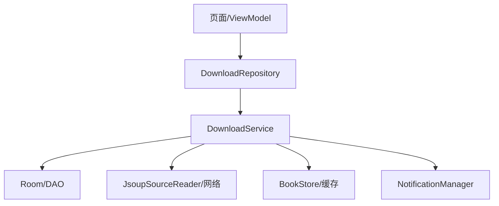
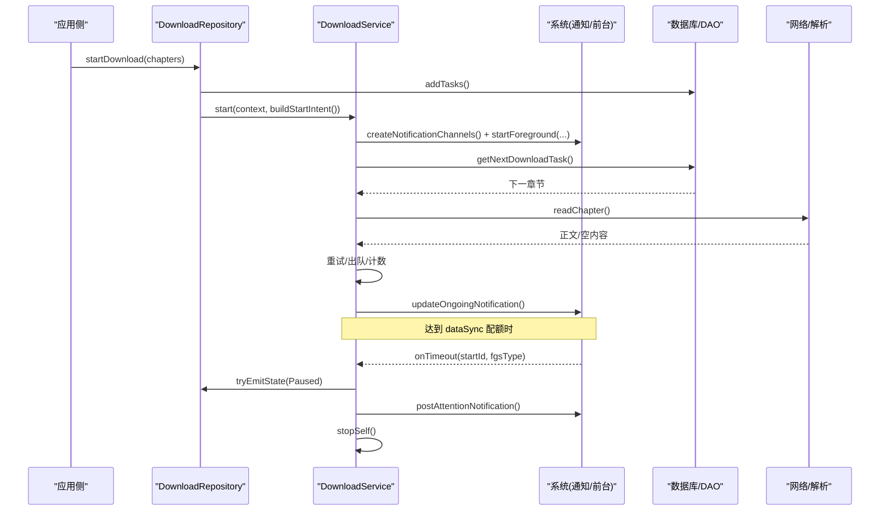
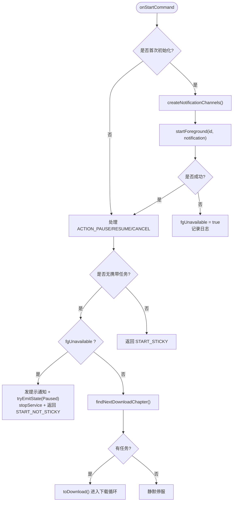
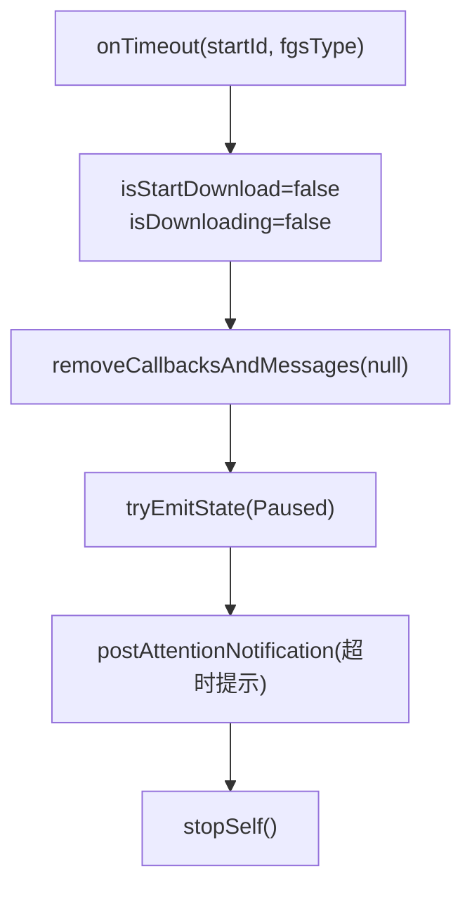
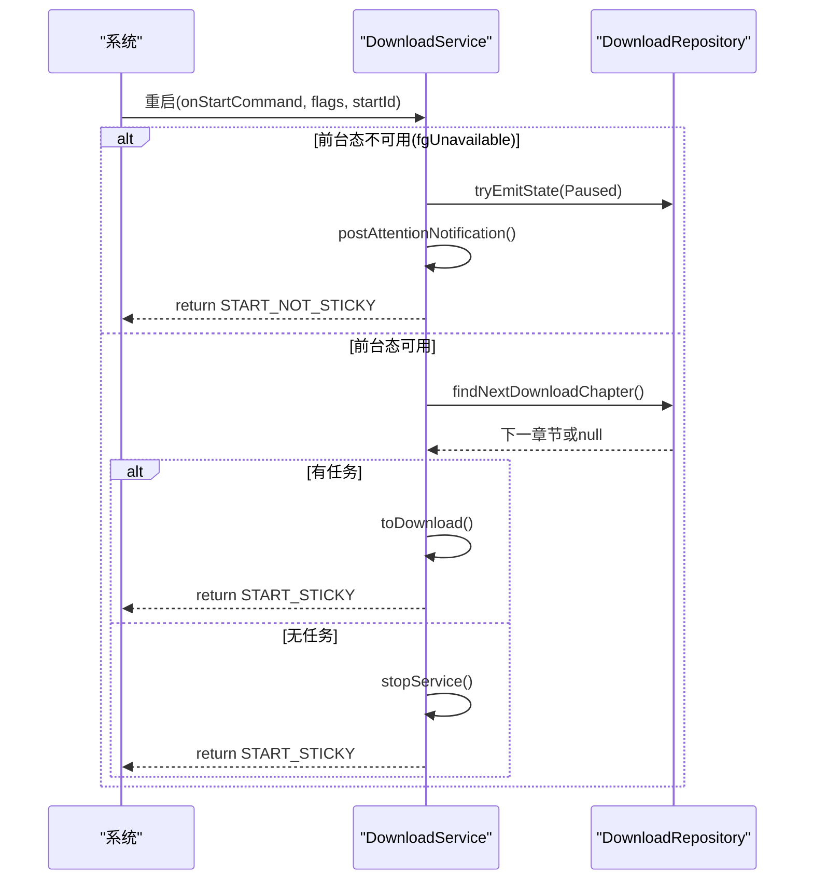
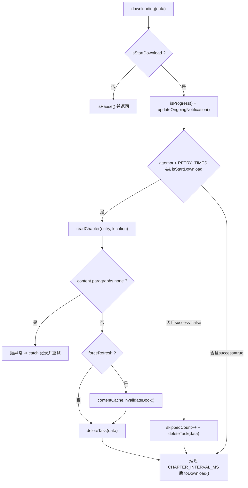
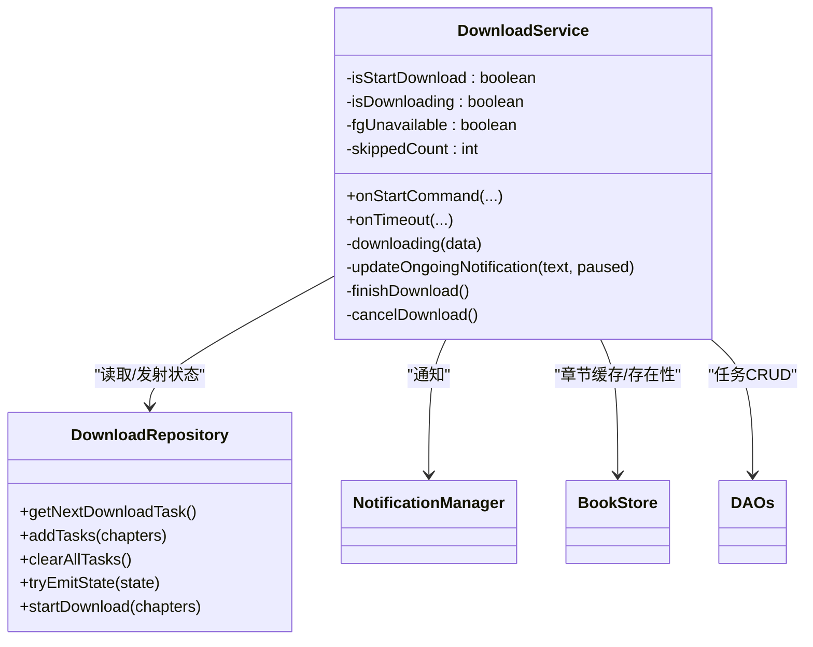

# 前台服务生命周期

<cite>
**本文引用的文件**
- [DownloadService.kt](file://module_book/src/main/java/com/ebook/book/service/DownloadService.kt)
- [DownloadRepository.kt](file://module_book/src/main/java/com/ebook/book/repository/DownloadRepository.kt)
- [AndroidManifest.xml（module_book）](file://module_book/src/main/AndroidManifest.xml)
- [0018-download-foreground-service-data-sync-quota.md](file://docs/adr/0018-download-foreground-service-data-sync-quota.md)
- [strings.xml](file://module_book/src/main/res/values/strings.xml)
</cite>

## 目录
1. [简介](#简介)
2. [项目结构定位](#项目结构定位)
3. [核心组件](#核心组件)
4. [架构总览](#架构总览)
5. [详细组件分析](#详细组件分析)
6. [依赖关系分析](#依赖关系分析)
7. [性能与配额约束](#性能与配额约束)
8. [故障排查指南](#故障排查指南)
9. [结论](#结论)
10. [附录](#附录)

## 简介
本文件聚焦下载服务 DownloadService 的前台生命周期，覆盖初始化流程、通知通道创建、startForeground 调用、异常兜底；详解 Android 15+ dataSync 类型前台服务的配额限制与 onTimeout 回调处理；说明 START_STICKY 启动模式下的冷启动与进程恢复续跑机制；阐述前台化失败时的降级路径与 fgUnavailable 标记的作用；并给出最佳实践与常见问题排查清单。

## 项目结构定位
- 下载服务实现位于 module_book 模块的 service 包中。
- 下载任务队列、状态流转由 DownloadRepository 管理。
- 清单声明了 DownloadService 为 dataSync 类型前台服务，并申请相应权限。
- ADR-0018 记录了 dataSync 配额、onTimeout、启动被拒等策略决策。

**图表来源**
- [DownloadService.kt:126-206](file://module_book/src/main/java/com/ebook/book/service/DownloadService.kt#L126-L206)
- [DownloadRepository.kt:257-273](file://module_book/src/main/java/com/ebook/book/repository/DownloadRepository.kt#L257-L273)
- [AndroidManifest.xml（module_book）:39-42](file://module_book/src/main/AndroidManifest.xml#L39-L42)

**章节来源**
- [AndroidManifest.xml（module_book）:39-42](file://module_book/src/main/AndroidManifest.xml#L39-L42)
- [DownloadService.kt:1-88](file://module_book/src/main/java/com/ebook/book/service/DownloadService.kt#L1-L88)

## 核心组件
- DownloadService：前台服务，负责逐章抓取、重试、进度与通知更新、配额超时收尾、控制动作响应。
- DownloadRepository：下载任务 CRUD、暂停书策略、状态流（replay=1）与 tryEmitState（非挂起），以及统一下发入口 startDownload。
- 清单配置：service 声明 foregroundServiceType="dataSync"，并持有 FOREGROUND_SERVICE_DATA_SYNC 权限。
- 字符串资源：通知文案、完成/跳过提示、限制提示等。

**章节来源**
- [DownloadService.kt:57-88](file://module_book/src/main/java/com/ebook/book/service/DownloadService.kt#L57-L88)
- [DownloadRepository.kt:44-62](file://module_book/src/main/java/com/ebook/book/repository/DownloadRepository.kt#L44-L62)
- [AndroidManifest.xml（module_book）:26-42](file://module_book/src/main/AndroidManifest.xml#L26-L42)
- [strings.xml:133-148](file://module_book/src/main/res/values/strings.xml#L133-L148)

## 架构总览
DownloadService 作为前台服务，通过 Intent 接收控制命令与启动信号，结合 DownloadRepository 从数据库取篇并执行下载循环。通知通道分为“进行中/已暂停”和“完成”两类，常驻通知用于展示当前章节与剩余数量，完成通知用于结果提示。Android 15+ 的 dataSync 配额在 onTimeout 回调中被严格处理，确保数秒内停止服务。

**图表来源**
- [DownloadRepository.kt:257-273](file://module_book/src/main/java/com/ebook/book/repository/DownloadRepository.kt#L257-L273)
- [DownloadService.kt:126-206](file://module_book/src/main/java/com/ebook/book/service/DownloadService.kt#L126-L206)
- [DownloadService.kt:274-378](file://module_book/src/main/java/com/ebook/book/service/DownloadService.kt#L274-L378)
- [DownloadService.kt:115-124](file://module_book/src/main/java/com/ebook/book/service/DownloadService.kt#L115-L124)

## 详细组件分析

### DownloadService 前台初始化流程
- 通知通道创建：构建 LOW 重要性的“进行中/已暂停”通道与 DEFAULT 重要性的“完成”通道，并删除历史通道避免冗余。
- 驻留通知构造：使用 setOngoing(true) 保持常驻，设置动作按钮（暂停/继续/取消），点击返回应用主页。
- startForeground 调用：在 onStartCommand 首次初始化时同步调用，首条通知文案为“准备中”，随后被进度通知覆盖。
- 异常兜底：若 startForeground 或通知相关 API 抛异常（例如包归属缓存错乱导致 SecurityException），捕获后记录 fgUnavailable=false 分支，避免阻断任务接入。

**图表来源**
- [DownloadService.kt:126-206](file://module_book/src/main/java/com/ebook/book/service/DownloadService.kt#L126-L206)
- [DownloadService.kt:476-494](file://module_book/src/main/java/com/ebook/book/service/DownloadService.kt#L476-L494)
- [DownloadService.kt:505-525](file://module_book/src/main/java/com/ebook/book/service/DownloadService.kt#L505-L525)

**章节来源**
- [DownloadService.kt:126-206](file://module_book/src/main/java/com/ebook/book/service/DownloadService.kt#L126-L206)
- [DownloadService.kt:476-494](file://module_book/src/main/java/com/ebook/book/service/DownloadService.kt#L476-L494)
- [DownloadService.kt:505-525](file://module_book/src/main/java/com/ebook/book/service/DownloadService.kt#L505-L525)

### Android 15+ dataSync 配额与 onTimeout 回调
- 配额规则：dataSync 类型前台服务在任意 24 小时内累计最多运行 6 小时。
- 触发时机：到点时系统先移除前台态再回调 onTimeout，仅留数秒让服务自行退出。
- 回调处理：立即置 isStartDownload=false、isDownloading=false，清空待执行回调；同步写入 DownloadState.Paused（tryEmitState）；发送可点回应用的提示通知；stopSelf()。禁止任何耗时操作。
- 后果：未及时 stopSelf 会记录 RemoteServiceException，表现为“下载跑到后段闪退”。

**图表来源**
- [DownloadService.kt:115-124](file://module_book/src/main/java/com/ebook/book/service/DownloadService.kt#L115-L124)
- [0018-download-foreground-service-data-sync-quota.md:20-32](file://docs/adr/0018-download-foreground-service-data-sync-quota.md#L20-L32)

**章节来源**
- [DownloadService.kt:115-124](file://module_book/src/main/java/com/ebook/book/service/DownloadService.kt#L115-L124)
- [0018-download-foreground-service-data-sync-quota.md:20-32](file://docs/adr/0018-download-foreground-service-data-sync-quota.md#L20-L32)

### START_STICKY 启动模式与续跑机制
- 行为：onStartCommand 对控制动作返回 START_STICKY，使系统在必要时重启服务以处理未完成的 Intent。
- 冷启动/进程恢复：当服务因配额用尽或后台启动被拒而终止后，START_STICKY 可能再次拉起；此时若无前台态（fgUnavailable=true），直接收尾并返回 START_NOT_STICKY，避免空转与重复异常。
- 任务续跑：启动 Intent 为空载信号，实际任务来源于 download_chapter 表；服务读取队列并逐章推进，保证幂等与一致性。

**图表来源**
- [DownloadService.kt:126-206](file://module_book/src/main/java/com/ebook/book/service/DownloadService.kt#L126-L206)
- [DownloadService.kt:380-420](file://module_book/src/main/java/com/ebook/book/service/DownloadService.kt#L380-L420)

**章节来源**
- [DownloadService.kt:126-206](file://module_book/src/main/java/com/ebook/book/service/DownloadService.kt#L126-L206)
- [DownloadService.kt:380-420](file://module_book/src/main/java/com/ebook/book/service/DownloadService.kt#L380-L420)

### 前台化失败降级路径与 fgUnavailable
- 触发条件：startForeground 或通知相关 API 抛异常（如包归属缓存错乱导致的 SecurityException）。
- 降级策略：设置 fgUnavailable=true，自动续跑分支据此直接收尾，并返回 START_NOT_STICKY；同时发送提示通知，避免用户感知不到问题。
- 注意：通知权限被拒不会导致 startForeground 失败，notify 会被静默丢弃但前台服务正常；因此 catch(Throwable) 仍保留兜底语义。

**章节来源**
- [DownloadService.kt:135-152](file://module_book/src/main/java/com/ebook/book/service/DownloadService.kt#L135-L152)
- [DownloadService.kt:174-189](file://module_book/src/main/java/com/ebook/book/service/DownloadService.kt#L174-L189)

### 单章下载与重试逻辑
- 重试次数与间隔：每章最多重试 RETRY_TIMES 次，每次重试前等待 RETRY_DELAY_MS 毫秒，避开瞬时限流/抖动。
- 失败处理：重试耗尽后将任务出队并计入 skippedCount，避免队头阻塞后续章节；暂停中断不出队，符合暂停语义。
- 强制刷新：重抓成功后失效对应书的内存缓存，确保阅读器不再读到旧正文。
- 空正文判失败：解析结果为空则抛出异常走重试通道，不写章文件，避免离线空白页。

**图表来源**
- [DownloadService.kt:274-378](file://module_book/src/main/java/com/ebook/book/service/DownloadService.kt#L274-L378)

**章节来源**
- [DownloadService.kt:274-378](file://module_book/src/main/java/com/ebook/book/service/DownloadService.kt#L274-L378)

### 通知与终态处理
- 常驻通知：LOW 重要性，setOnlyAlertOnce 避免每章重复响铃；动作按钮直达服务 onStartCommand。
- 完成通知：DEFAULT 重要性，独立 id，服务销毁后仍可见；根据 skippedCount 选择不同文案。
- 终态发射：finishDownload/cancelDownload/pause 均通过 tryEmitState 同步落 replay，确保紧随 stopService 前状态已送达。

**章节来源**
- [DownloadService.kt:452-464](file://module_book/src/main/java/com/ebook/book/service/DownloadService.kt#L452-L464)
- [DownloadService.kt:557-577](file://module_book/src/main/java/com/ebook/book/service/DownloadService.kt#L557-L577)
- [DownloadService.kt:646-666](file://module_book/src/main/java/com/ebook/book/service/DownloadService.kt#L646-L666)
- [DownloadRepository.kt:275-288](file://module_book/src/main/java/com/ebook/book/repository/DownloadRepository.kt#L275-L288)

## 依赖关系分析
- DownloadService 依赖 DownloadRepository 进行任务获取与状态发射。
- DownloadRepository 依赖 DAO（DownloadChapterDao、PausedBookDao、BookShelfDao、ChapterListDao）与 BookStore。
- 清单声明 dataSync 类型前台服务与相应权限。
- 字符串资源提供通知与提示文案。

**图表来源**
- [DownloadService.kt:57-88](file://module_book/src/main/java/com/ebook/book/service/DownloadService.kt#L57-L88)
- [DownloadRepository.kt:44-62](file://module_book/src/main/java/com/ebook/book/repository/DownloadRepository.kt#L44-L62)

**章节来源**
- [DownloadService.kt:57-88](file://module_book/src/main/java/com/ebook/book/service/DownloadService.kt#L57-L88)
- [DownloadRepository.kt:44-62](file://module_book/src/main/java/com/ebook/book/repository/DownloadRepository.kt#L44-L62)

## 性能与配额约束
- 数据同步配额：Android 15+ dataSync 前台服务 24 小时累计 6 小时上限，超限后 onTimeout 回调需快速收尾。
- 章节间隔：CHAPTER_INTERVAL_MS 降低站点请求压力，避免瞬时风暴。
- 重试策略：RETRY_TIMES 与 RETRY_DELAY_MS 平衡成功率与限流规避。
- 通知优化：setOnlyAlertOnce 减少重复提示；常驻通知与完成通知分离，避免服务销毁后丢失结果。

**章节来源**
- [DownloadService.kt:668-677](file://module_book/src/main/java/com/ebook/book/service/DownloadService.kt#L668-L677)
- [0018-download-foreground-service-data-sync-quota.md:20-32](file://docs/adr/0018-download-foreground-service-data-sync-quota.md#L20-L32)

## 故障排查指南
- 前台服务启动被拒：检查是否在后台受限场景下调用 startForegroundService；确认 targetSdk 与权限；优先通过 DownloadRepository.startDownload 发起，内部已做异常收口。
- dataSync 配额用尽：关注 onTimeout 回调；确认服务在回调中尽快 stopSelf；观察是否有超时提示通知。
- 通知不可见：确认 POST_NOTIFICATIONS 权限与用户设置；通知被拒时不影响前台服务，但需补提示。
- 任务不跑：检查 download_chapter 表是否有任务；确认 getNextDownloadTask 返回；查看暂停书标记是否误拦截。
- 章节一直失败：检查网络与书源可用性；确认重试耗尽后任务已出队；查看 skippedCount 与完成通知文案。
- 强制刷新无效：确认 forceRefresh 后 contentCache.invalidateBook 已被调用；避免旧正文命中。

**章节来源**
- [DownloadService.kt:115-124](file://module_book/src/main/java/com/ebook/book/service/DownloadService.kt#L115-L124)
- [DownloadService.kt:135-152](file://module_book/src/main/java/com/ebook/book/service/DownloadService.kt#L135-L152)
- [DownloadService.kt:274-378](file://module_book/src/main/java/com/ebook/book/service/DownloadService.kt#L274-L378)
- [DownloadRepository.kt:257-273](file://module_book/src/main/java/com/ebook/book/repository/DownloadRepository.kt#L257-L273)

## 结论
DownloadService 通过 dataSync 类型前台服务保障长耗时下载的稳定性，并在 Android 15+ 的配额限制下通过 onTimeout 回调快速收尾，确保用户体验与系统合规。START_STICKY 启动模式配合任务持久化，实现了冷启动与进程恢复后的续跑能力。前台化失败时通过 fgUnavailable 标记与降级路径避免空转与异常风暴。建议遵循统一下发入口、通知通道规范、重试与间隔策略，以提升可靠性与可维护性。

## 附录
- 最佳实践
  - 始终通过 DownloadRepository.startDownload 发起下载，避免直接调用 startForegroundService。
  - 在 onTimeout 中只做数秒可完成的收尾，禁止查库或网络 IO。
  - 使用 tryEmitState 同步落 replay，确保状态在 stopService 前送达。
  - 区分常驻通知与完成通知，避免服务销毁后结果丢失。
  - 合理设置章节间隔与重试次数，平衡成功率与站点压力。
- 常见错误
  - 误以为必须三参 startForeground：两参已足够，类型来自 manifest。
  - 将通知权限被拒等同于前台化失败：notify 被静默丢弃不影响前台服务。
  - 忽略 fgUnavailable：导致自动续跑反复失败，应返回 START_NOT_STICKY 并提示用户。

[无额外章节来源，因为本节为总结与建议]