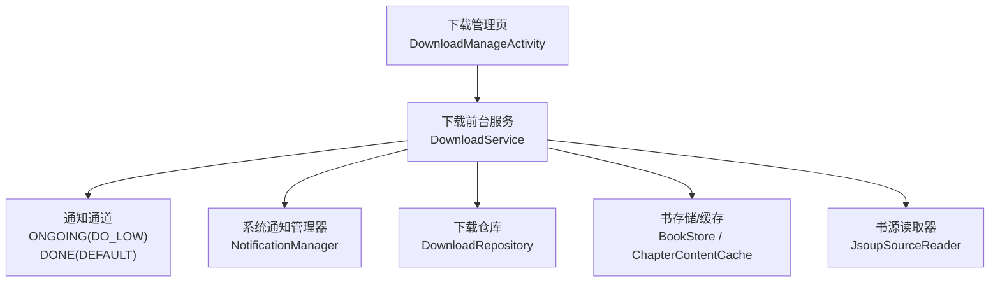
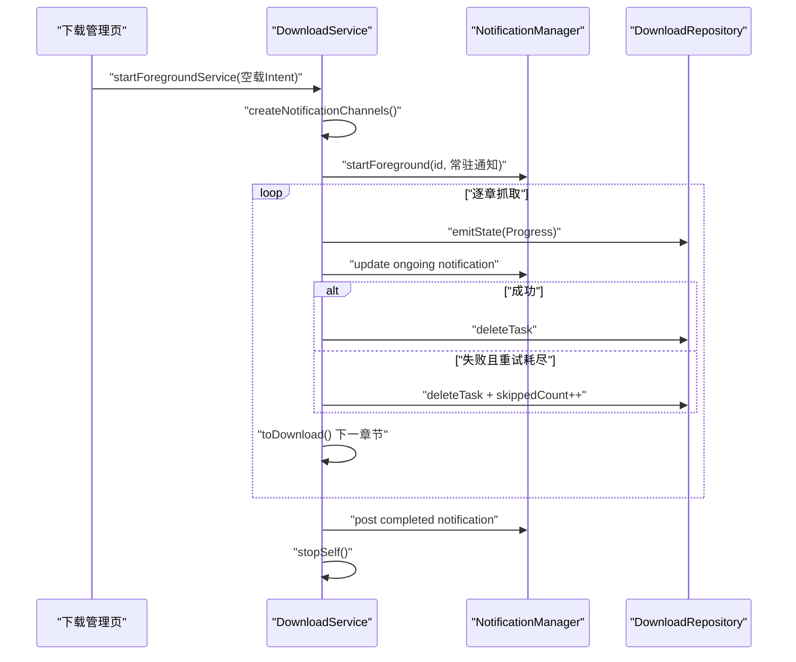
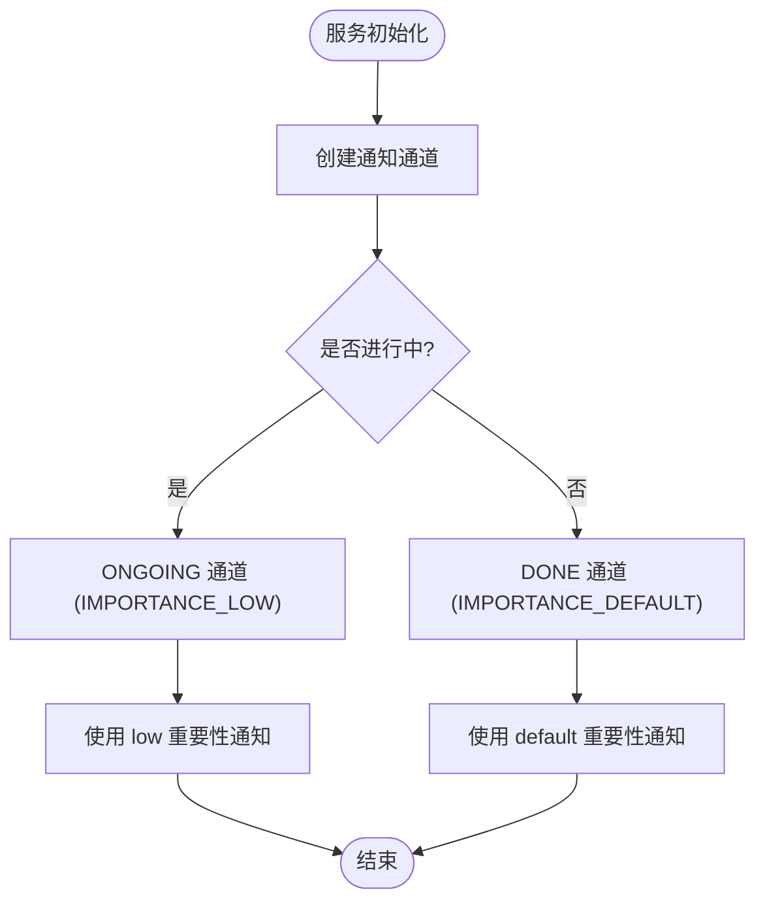
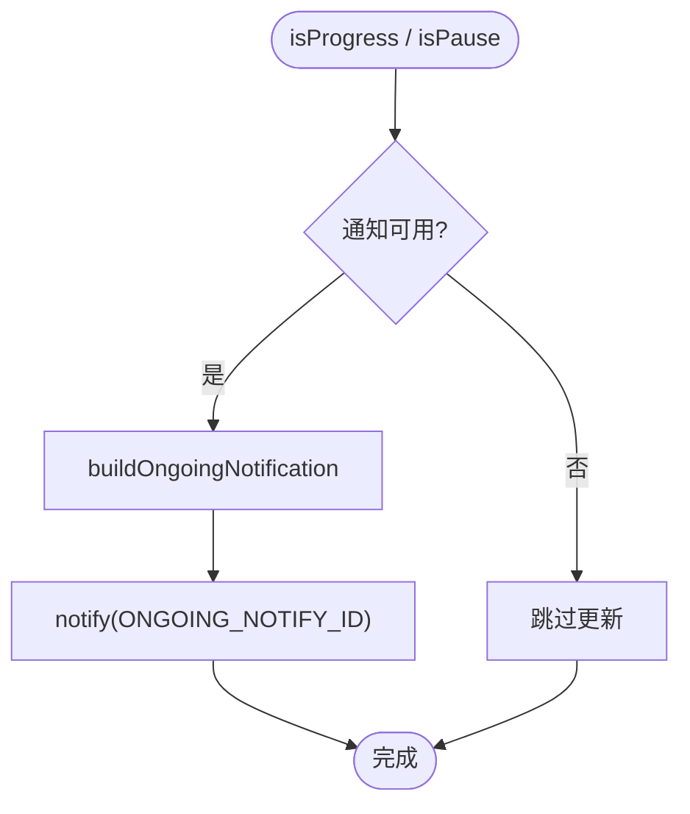
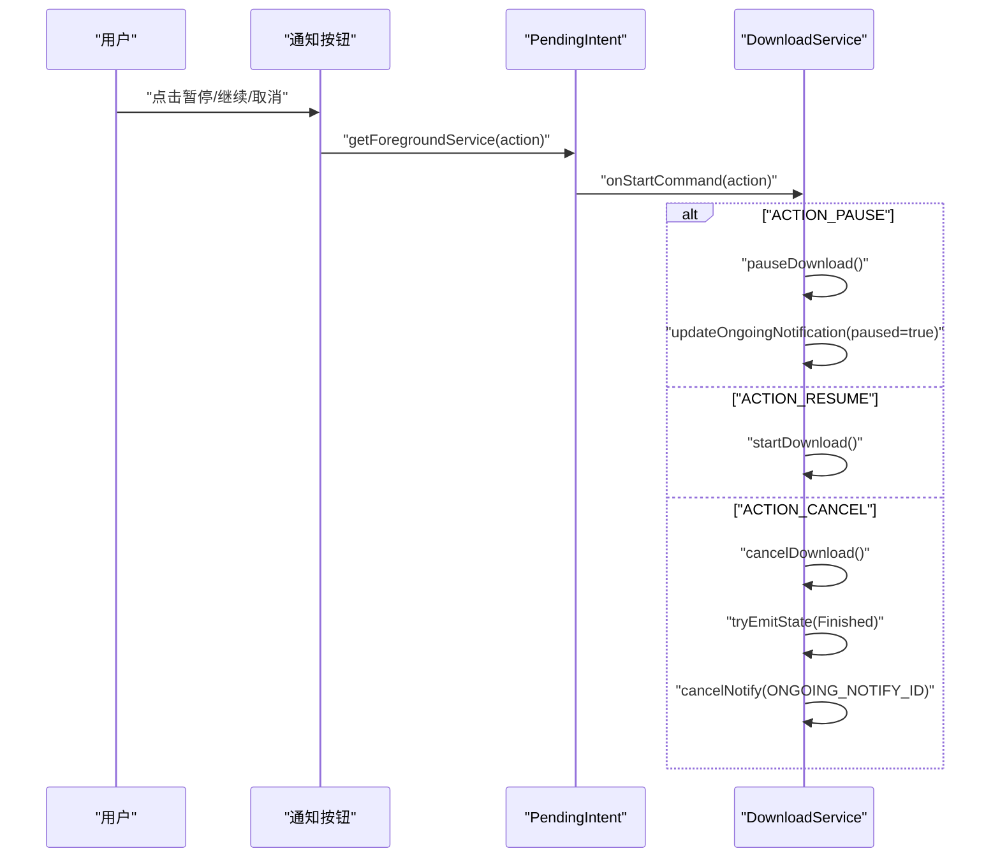
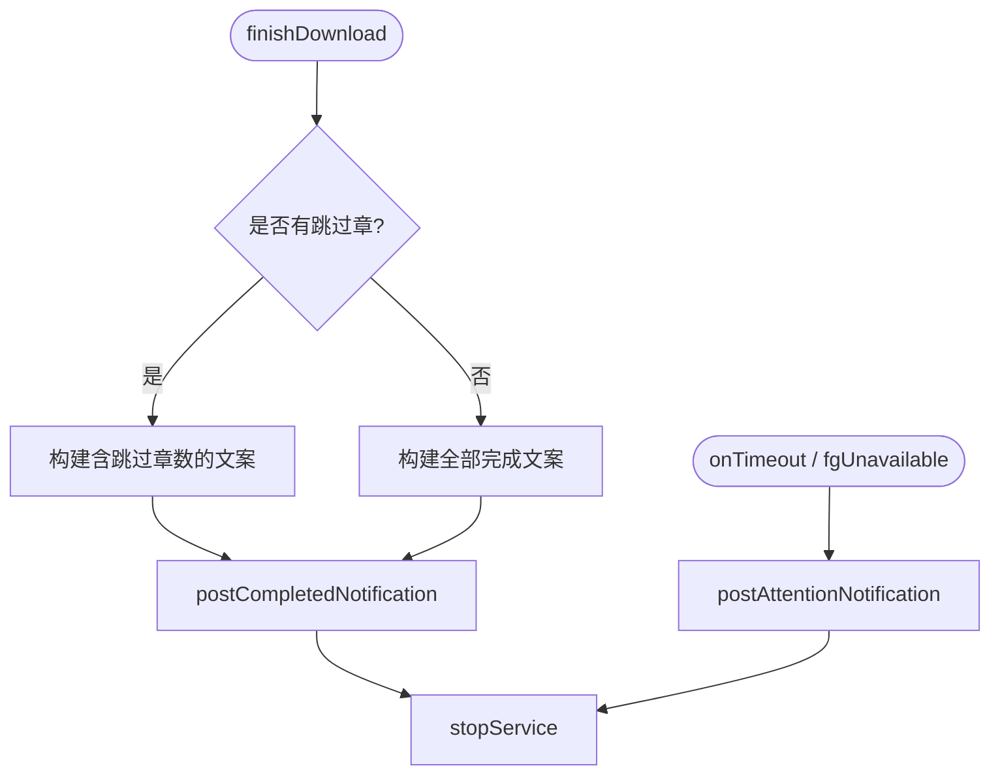
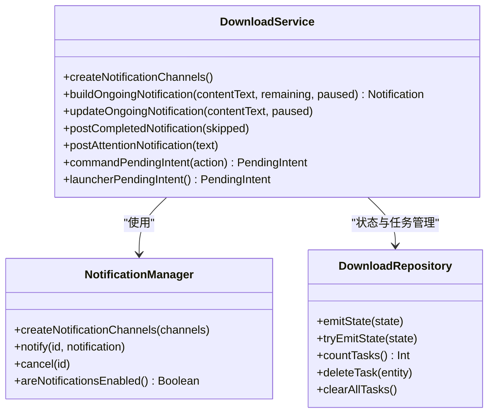
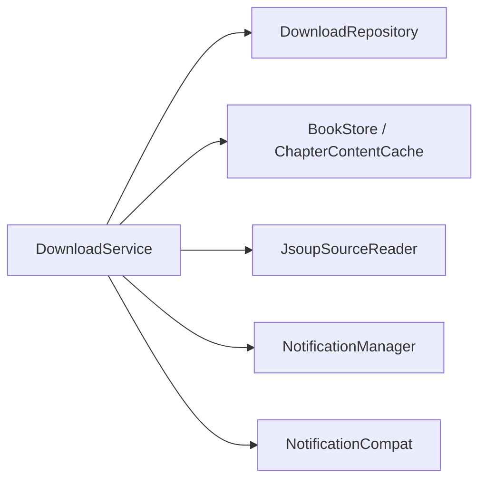

# 通知系统

<cite>
**本文引用的文件**   
- [DownloadService.kt](file://module_book/src/main/java/com/ebook/book/service/DownloadService.kt)
- [strings.xml](file://module_book/src/main/res/values/strings.xml)
- [0018-download-foreground-service-data-sync-quota.md](file://docs/adr/0018-download-foreground-service-data-sync-quota.md)
- [DownloadManageActivity.kt](file://module_book/src/main/java/com/ebook/book/DownloadManageActivity.kt)
</cite>

## 目录
1. [简介](#简介)
2. [项目结构](#项目结构)
3. [核心组件](#核心组件)
4. [架构总览](#架构总览)
5. [详细组件分析](#详细组件分析)
6. [依赖关系分析](#依赖关系分析)
7. [性能与可靠性](#性能与可靠性)
8. [故障排查指南](#故障排查指南)
9. [结论](#结论)
10. [附录](#附录)

## 简介
本技术文档聚焦下载通知系统，覆盖以下要点：
- 通知通道分类设计：ONGOING（LOW 重要性）与 DONE（DEFAULT 重要性）的职责与差异
- 常驻通知的构建与更新机制：buildOngoingNotification 参数、setOngoing(true) 的关键作用
- 通知按钮交互逻辑：暂停/继续/取消操作的 PendingIntent 构造与路由
- 通知权限处理：Android 13+ POST_NOTIFICATIONS 权限检查与降级策略
- 完成通知与超时提示通知的发送时机与内容定制
- 通知优化最佳实践与用户反馈改进建议

该系统的实现集中在离线下载前台服务中，通过两套通知通道区分“进行中/暂停”和“完成/提醒”，保证长时任务可感知、可控制、可恢复。

## 项目结构
与下载通知直接相关的代码位于书籍模块的服务层与资源层：
- 服务层：DownloadService 负责前台服务生命周期、通知通道创建、常驻通知构建与更新、动作按钮 PendingIntent 构造、完成与超时通知发送
- 资源层：strings.xml 提供所有通知文案、通道名称与说明
- 管理页：DownloadManageActivity 作为用户入口之一，触发下载并接收状态变化
- ADR：0018 记录前台服务 dataSync 配额与启动限制的设计决策与约束

**图示来源**
- [DownloadService.kt:476-549](file://module_book/src/main/java/com/ebook/book/service/DownloadService.kt#L476-L549)
- [DownloadManageActivity.kt:59-74](file://module_book/src/main/java/com/ebook/book/DownloadManageActivity.kt#L59-L74)

**章节来源**
- [DownloadService.kt:40-78](file://module_book/src/main/java/com/ebook/book/service/DownloadService.kt#L40-L78)
- [strings.xml:133-148](file://module_book/src/main/res/values/strings.xml#L133-L148)
- [0018-download-foreground-service-data-sync-quota.md:1-59](file://docs/adr/0018-download-foreground-service-data-sync-quota.md#L1-L59)

## 核心组件
- 通知通道
  - ONGOING（IMPORTANCE_LOW）：用于进行中/已暂停的常驻通知，不弹横幅、不打扰，适合长时任务
  - DONE（IMPORTANCE_DEFAULT）：用于完成与超时提示等需要弹一次横幅的通知
- 常驻通知构建与更新
  - buildOngoingNotification：设置标题、文本、剩余章数、动作按钮、点击跳转
  - setOngoing(true)：将通知标记为“常驻”，防止被用户滑动消除；必须与 startForeground 使用同一通知 id
  - updateOngoingNotification：每章抓取前推进度并刷新常驻通知，包含权限检测与异常兜底
- 通知按钮交互
  - 动作按钮通过 PendingIntent.getForegroundService 指向 DownloadService 的 ACTION_PAUSE/ACTION_RESUME/ACTION_CANCEL
  - onStartCommand 根据 action 分发到 pauseDownload/startDownload/cancelDownload
- 通知权限处理
  - Android 13+ 未授权 POST_NOTIFICATIONS 时，notify 被静默丢弃；服务侧通过 areNotificationsEnabled() 提前判断并跳过更新
  - 前台化失败时设置 fgUnavailable，避免无意义的自动续跑
- 完成通知与超时提示
  - postCompletedNotification：任务全部完成后发送，可划走，独立 id 确保服务停止后仍可见
  - postAttentionNotification：onTimeout 或前台不可用时发送，引导用户回到应用继续

**章节来源**
- [DownloadService.kt:476-549](file://module_book/src/main/java/com/ebook/book/service/DownloadService.kt#L476-L549)
- [DownloadService.kt:557-600](file://module_book/src/main/java/com/ebook/book/service/DownloadService.kt#L557-L600)
- [DownloadService.kt:618-638](file://module_book/src/main/java/com/ebook/book/service/DownloadService.kt#L618-L638)
- [strings.xml:133-148](file://module_book/src/main/res/values/strings.xml#L133-L148)

## 架构总览
下载通知系统围绕 DownloadService 展开，职责清晰、边界明确：
- 启动流程：页面调用统一入口启动前台服务，服务在 onStartCommand 初始化通知通道并建立常驻通知
- 运行流程：逐章抓取，每章开始前更新进度与常驻通知，失败重试耗尽则出队并计数
- 控制流程：通知按钮或管理页操作通过 Intent action 直达服务，幂等处理暂停/继续/取消
- 收尾流程：队列清空后发送完成通知并停服；若配额用尽或前台不可用，发送超时提示并保留任务

**图示来源**
- [DownloadService.kt:126-206](file://module_book/src/main/java/com/ebook/book/service/DownloadService.kt#L126-L206)
- [DownloadService.kt:212-247](file://module_book/src/main/java/com/ebook/book/service/DownloadService.kt#L212-L247)
- [DownloadService.kt:452-464](file://module_book/src/main/java/com/ebook/book/service/DownloadService.kt#L452-L464)
- [DownloadService.kt:646-666](file://module_book/src/main/java/com/ebook/book/service/DownloadService.kt#L646-L666)

## 详细组件分析

### 通知通道分类设计
- ONGOING 通道（IMPORTANCE_LOW）
  - 用途：进行中/已暂停的常驻通知
  - 行为：不弹横幅、不打扰，适合长时任务持续展示
  - 创建时机：服务首次启动时 createNotificationChannels
- DONE 通道（IMPORTANCE_DEFAULT）
  - 用途：完成通知与超时提示通知
  - 行为：允许弹一次横幅，吸引用户注意结果或需回应用的提醒
  - 创建时机：同 ONGOING，一并创建并删除历史通道

**图示来源**
- [DownloadService.kt:476-494](file://module_book/src/main/java/com/ebook/book/service/DownloadService.kt#L476-L494)
- [strings.xml:133-148](file://module_book/src/main/res/values/strings.xml#L133-L148)

**章节来源**
- [DownloadService.kt:476-494](file://module_book/src/main/java/com/ebook/book/service/DownloadService.kt#L476-L494)
- [strings.xml:133-148](file://module_book/src/main/res/values/strings.xml#L133-L148)

### 常驻通知构建与更新机制
- buildOngoingNotification
  - 参数：contentText（当前章节信息）、remaining（剩余章数）、paused（是否暂停）
  - 关键配置：
    - setSmallIcon、setContentTitle、setContentText：基础信息与文案
    - setOngoing(true)：标记为常驻通知，防止被滑动消除
    - setOnlyAlertOnce(true)：避免每次更新都发出提示音/震动
    - addAction：添加暂停/继续/取消按钮
    - setContentIntent：点击打开应用主页
- updateOngoingNotification
  - 权限检查：areNotificationsEnabled() 为 false 时跳过更新
  - 异常兜底：整体 try-catch，确保下载流程不因通知失败而中断
  - 并发安全：协程内执行，避免阻塞同步下载循环

**图示来源**
- [DownloadService.kt:505-549](file://module_book/src/main/java/com/ebook/book/service/DownloadService.kt#L505-L549)

**章节来源**
- [DownloadService.kt:505-549](file://module_book/src/main/java/com/ebook/book/service/DownloadService.kt#L505-L549)

### 通知按钮交互逻辑
- PendingIntent 构造
  - commandPendingIntent：使用 getForegroundService 构造动作按钮意图，支持服务回收后仍能拉起并执行动作
  - requestCode：按 action.hashCode() 区分，避免 PendingIntent 相互覆盖
  - flags：FLAG_UPDATE_CURRENT | FLAG_IMMUTABLE，保证更新与安全
- 动作路由
  - ACTION_PAUSE：暂停当前批次，更新常驻通知为“已暂停”
  - ACTION_RESUME：继续下载，若已在运行则不重复启动
  - ACTION_CANCEL：清空队列并收尾，发送完成态并移除常驻通知

**图示来源**
- [DownloadService.kt:155-172](file://module_book/src/main/java/com/ebook/book/service/DownloadService.kt#L155-L172)
- [DownloadService.kt:380-420](file://module_book/src/main/java/com/ebook/book/service/DownloadService.kt#L380-L420)
- [DownloadService.kt:618-638](file://module_book/src/main/java/com/ebook/book/service/DownloadService.kt#L618-L638)

**章节来源**
- [DownloadService.kt:155-172](file://module_book/src/main/java/com/ebook/book/service/DownloadService.kt#L155-L172)
- [DownloadService.kt:380-420](file://module_book/src/main/java/com/ebook/book/service/DownloadService.kt#L380-L420)
- [DownloadService.kt:618-638](file://module_book/src/main/java/com/ebook/book/service/DownloadService.kt#L618-L638)

### 通知权限处理与降级策略
- Android 13+ 权限检查
  - areNotificationsEnabled()：在更新常驻通知或发送完成/超时通知前检查
  - 未授权时：跳过通知更新或发送，不影响下载流程
- 前台化失败降级
  - startForeground 抛异常时设置 fgUnavailable
  - 自动续跑分支检测到 fgUnavailable 时直接收尾并返回 START_NOT_NOT_STICKY，避免无意义重启
- 兼容性与健壮性
  - 通知不可用不阻断服务生命周期
  - 异常统一 catch，记录日志但不抛出

**章节来源**
- [DownloadService.kt:126-153](file://module_book/src/main/java/com/ebook/book/service/DownloadService.kt#L126-L153)
- [DownloadService.kt:534-549](file://module_book/src/main/java/com/ebook/book/service/DownloadService.kt#L534-L549)
- [DownloadService.kt:557-600](file://module_book/src/main/java/com/ebook/book/service/DownloadService.kt#L557-L600)

### 完成通知与超时提示通知
- 完成通知（postCompletedNotification）
  - 发送时机：队列跑空 finishDownload
  - 内容定制：skipped > 0 时使用带跳过章数的文案，否则显示全部完成
  - 行为：setAutoCancel(true)，可划走，独立 id 确保服务停止后仍可见
- 超时提示通知（postAttentionNotification）
  - 发送时机：onTimeout 或前台不可用
  - 内容：提示下载时长已达系统上限，引导用户回到应用继续
  - 行为：setAutoCancel(true)，使用 DONE 通道允许弹横幅

**图示来源**
- [DownloadService.kt:557-600](file://module_book/src/main/java/com/ebook/book/service/DownloadService.kt#L557-L600)
- [DownloadService.kt:646-666](file://module_book/src/main/java/com/ebook/book/service/DownloadService.kt#L646-L666)

**章节来源**
- [DownloadService.kt:557-600](file://module_book/src/main/java/com/ebook/book/service/DownloadService.kt#L557-L600)
- [DownloadService.kt:646-666](file://module_book/src/main/java/com/ebook/book/service/DownloadService.kt#L646-L666)

### 类与关系图

**图示来源**
- [DownloadService.kt:476-638](file://module_book/src/main/java/com/ebook/book/service/DownloadService.kt#L476-L638)

**章节来源**
- [DownloadService.kt:476-638](file://module_book/src/main/java/com/ebook/book/service/DownloadService.kt#L476-L638)

## 依赖关系分析
- 内部依赖
  - DownloadService 依赖 DownloadRepository 进行状态发射与任务管理
  - 依赖 BookStore 与 ChapterContentCache 进行章节文件与缓存操作
  - 依赖 JsoupSourceReader 进行正文抓取
- 外部依赖
  - AndroidX NotificationCompat 构建通知
  - System NotificationManager 管理通知渠道与通知
  - Hilt 注入依赖项
- 解耦设计
  - 通知与下载逻辑分离，通知异常不影响下载流程
  - 动作按钮通过 Intent action 解耦 UI 与服务

**图示来源**
- [DownloadService.kt:58-66](file://module_book/src/main/java/com/ebook/book/service/DownloadService.kt#L58-L66)
- [DownloadService.kt:476-638](file://module_book/src/main/java/com/ebook/book/service/DownloadService.kt#L476-L638)

**章节来源**
- [DownloadService.kt:58-66](file://module_book/src/main/java/com/ebook/book/service/DownloadService.kt#L58-L66)
- [DownloadService.kt:476-638](file://module_book/src/main/java/com/ebook/book/service/DownloadService.kt#L476-L638)

## 性能与可靠性
- 性能优化
  - setOnlyAlertOnce(true)：避免频繁提示音/震动
  - 章间间隔 CHAPTER_INTERVAL_MS：降低对书源站点的请求压力
  - 重试前延迟 RETRY_DELAY_MS：避开瞬时限流/网络抖动
  - 内存缓存失效：强制刷新时及时失效 ChapterContentCache
- 可靠性保障
  - 前台服务配额超时 onTimeout：只做数秒内可完成的收尾
  - 启动被拒统一收口：DownloadService.start() 捕获异常并返回 false
  - 通知不可用降级：areNotificationsEnabled() 检查，异常兜底
  - 失败章出队：避免队头阻塞导致无限重试

**章节来源**
- [DownloadService.kt:668-738](file://module_book/src/main/java/com/ebook/book/service/DownloadService.kt#L668-L738)
- [0018-download-foreground-service-data-sync-quota.md:20-46](file://docs/adr/0018-download-foreground-service-data-sync-quota.md#L20-L46)

## 故障排查指南
- 通知不显示
  - 检查 Android 13+ 是否授予 POST_NOTIFICATIONS 权限
  - 查看 areNotificationsEnabled() 返回值
  - 确认通知渠道是否创建成功
- 常驻通知被滑动消失
  - 确认 setOngoing(true) 是否正确设置
  - 确认 startForeground 与 notify 使用相同 id
- 下载无法继续
  - 检查前台服务是否因配额用尽被终止
  - 查看 onTimeout 是否发送了超时提示通知
  - 确认 DownloadRepository 中任务是否保留
- 按钮无响应
  - 检查 PendingIntent 是否使用 getForegroundService
  - 确认 action hashCode 是否唯一
  - 查看 onStartCommand 是否正确分发 action

**章节来源**
- [DownloadService.kt:115-124](file://module_book/src/main/java/com/ebook/book/service/DownloadService.kt#L115-L124)
- [DownloadService.kt:534-549](file://module_book/src/main/java/com/ebook/book/service/DownloadService.kt#L534-L549)
- [DownloadService.kt:618-638](file://module_book/src/main/java/com/ebook/book/service/DownloadService.kt#L618-L638)

## 结论
下载通知系统通过清晰的通道分类、健壮的常驻通知机制、完善的权限处理与降级策略，实现了长时任务的可靠管理与用户友好反馈。设计遵循 Android 平台规范与产品交互需求，在保证性能的同时提升了用户体验。未来可考虑进一步优化通知内容与交互细节，以更好地满足用户需求。

## 附录
- 相关常量与文案
  - 通知通道 ID：ONGOING_NOTIFY_ID、DONE_NOTIFY_ID
  - Intent Action：ACTION_PAUSE、ACTION_RESUME、ACTION_CANCEL
  - 重试与间隔：RETRY_TIMES、RETRY_DELAY_MS、CHAPTER_INTERVAL_MS
- 最佳实践建议
  - 始终使用 setOngoing(true) 标记常驻通知
  - 通过 areNotificationsEnabled() 提前检查权限
  - 使用 getForegroundService 构造动作按钮 PendingIntent
  - 前台服务超时回调中只做轻量收尾操作
  - 失败任务及时出队，避免阻塞后续章节

**章节来源**
- [DownloadService.kt:668-738](file://module_book/src/main/java/com/ebook/book/service/DownloadService.kt#L668-L738)
- [strings.xml:133-148](file://module_book/src/main/res/values/strings.xml#L133-L148)