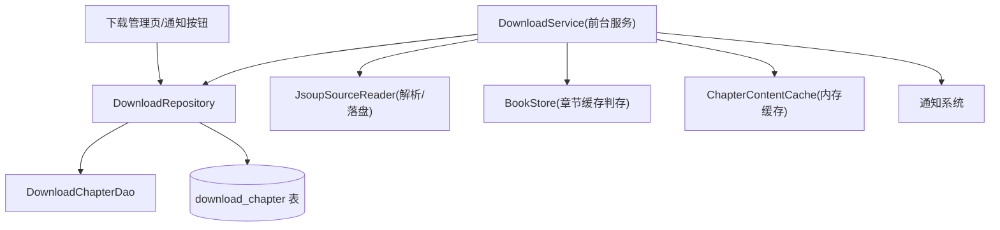
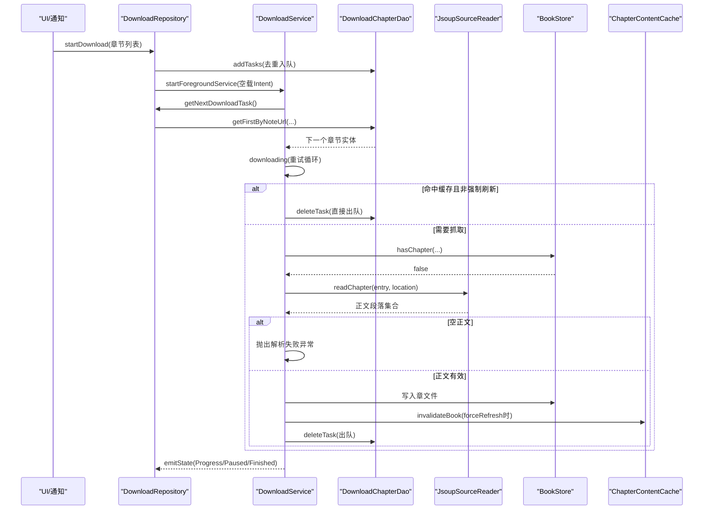
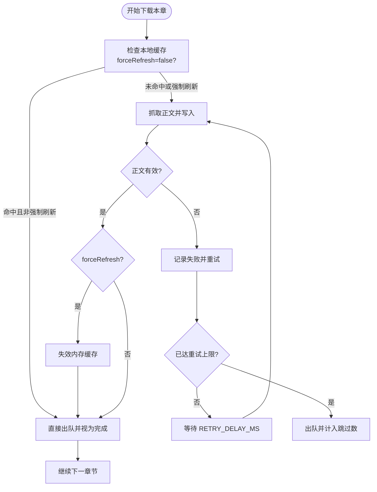
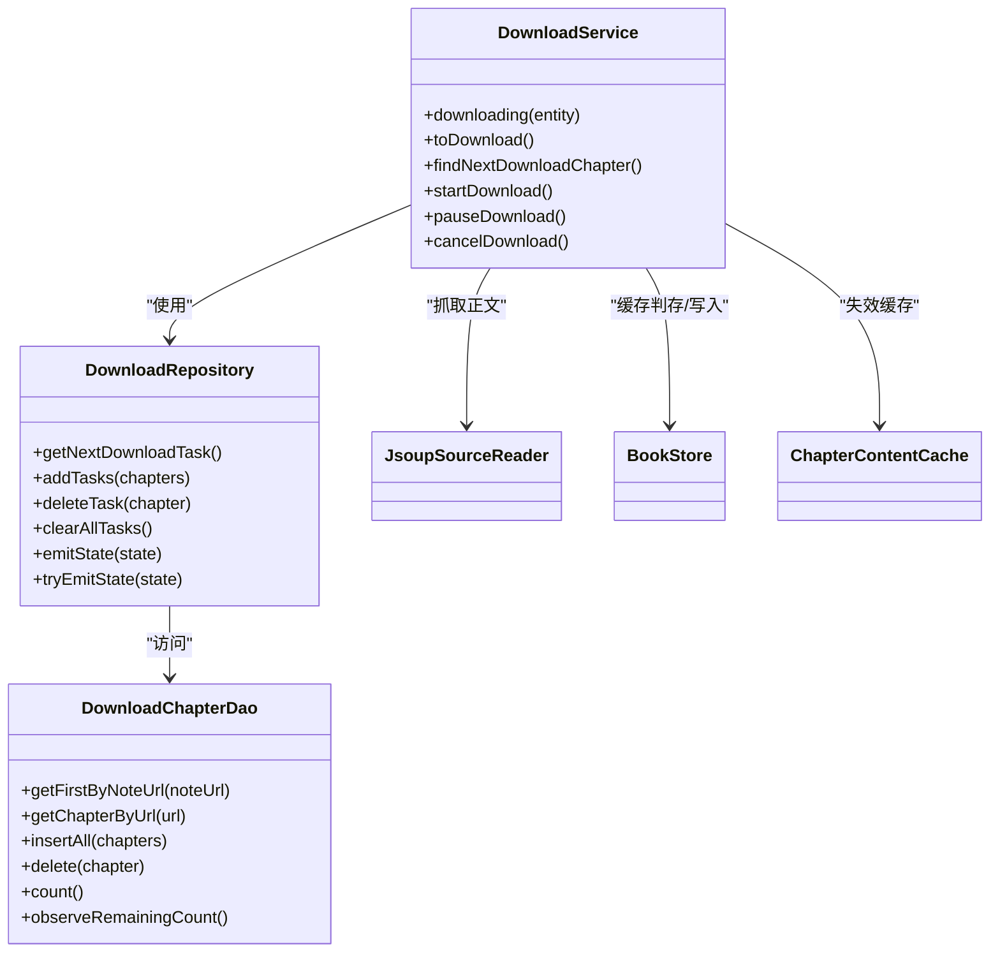

# 下载重试与容错机制

<cite>
**本文引用的文件**   
- [DownloadService.kt](file://module_book/src/main/java/com/ebook/book/service/DownloadService.kt)
- [DownloadRepository.kt](file://module_book/src/main/java/com/ebook/book/repository/DownloadRepository.kt)
- [DownloadChapterEntity.kt](file://lib_ebook_db/src/main/java/com/ebook/db/entity/DownloadChapterEntity.kt)
- [DownloadChapterDao.kt](file://lib_ebook_db/src/main/java/com/ebook/db/dao/DownloadChapterDao.kt)
</cite>

## 目录
1. [简介](#简介)
2. [项目结构与相关模块](#项目结构与相关模块)
3. [核心组件](#核心组件)
4. [架构总览](#架构总览)
5. [详细组件分析](#详细组件分析)
6. [依赖关系分析](#依赖关系分析)
7. [性能考量](#性能考量)
8. [故障诊断指南](#故障诊断指南)
9. [结论](#结论)
10. [附录](#附录)

## 简介
本文件聚焦“单章下载的重试策略、失败分类与处理、重试耗尽后的任务出队策略、强制刷新场景、取消操作的即时性保证”，以及“重试调优建议与故障诊断方法”。目标是让读者在不深入源码的情况下，也能理解并维护下载链路的可靠性。

## 项目结构与相关模块
- 前台服务层：负责逐章抓取、重试控制、通知与状态同步、超时与前台配额处理。
- 仓库层：负责任务持久化、队列取篇、状态事件通道（Service → UI）。
- 数据层：Room 表存储未完成任务；DAO 提供按书取队头、去重入队、删除出队等操作。
- 解析与缓存：JsoupSourceReader 读取正文并落盘；BookStore 判断章节是否已缓存；ChapterContentCache 进程级内存缓存，强制刷新时需失效。

图表来源
- [DownloadService.kt:212-378](file://module_book/src/main/java/com/ebook/book/service/DownloadService.kt#L212-L378)
- [DownloadRepository.kt:267-289](file://module_book/src/main/java/com/ebook/book/repository/DownloadRepository.kt#L267-L289)
- [DownloadChapterDao.kt:21-131](file://lib_ebook_db/src/main/java/com/ebook/db/dao/DownloadChapterDao.kt#L21-L131)

章节来源
- [DownloadService.kt:1-750](file://module_book/src/main/java/com/ebook/book/service/DownloadService.kt#L1-L750)
- [DownloadRepository.kt:1-312](file://module_book/src/main/java/com/ebook/book/repository/DownloadRepository.kt#L1-L312)
- [DownloadChapterDao.kt:1-131](file://lib_ebook_db/src/main/java/com/ebook/db/dao/DownloadChapterDao.kt#L1-L131)

## 核心组件
- DownloadService：前台服务，实现单章下载、重试循环、通知更新、暂停/继续/取消、超时处理与收尾。
- DownloadRepository：下载任务与状态的集中管理，提供取下一任务、入队/出队、状态事件流等能力。
- DownloadChapterDao/DownloadChapterEntity：下载队列的持久化模型与访问器，保证同章不重复排队、按书顺序消费。
- JsoupSourceReader/BookStore/ChapterContentCache：网络抓取、本地缓存与内存缓存协同，支撑“命中即完成”和“强制刷新重抓”。

章节来源
- [DownloadService.kt:57-87](file://module_book/src/main/java/com/ebook/book/service/DownloadService.kt#L57-L87)
- [DownloadRepository.kt:45-61](file://module_book/src/main/java/com/ebook/book/repository/DownloadRepository.kt#L45-L61)
- [DownloadChapterEntity.kt:10-88](file://lib_ebook_db/src/main/java/com/ebook/db/entity/DownloadChapterEntity.kt#L10-L88)
- [DownloadChapterDao.kt:21-131](file://lib_ebook_db/src/main/java/com/ebook/db/dao/DownloadChapterDao.kt#L21-L131)

## 架构总览
下载流程由服务驱动，仓库从数据库取下一任务，服务逐章抓取并写入文件，成功则出队；失败则进入重试循环；重试耗尽后仍须出队以避免阻塞后续章节。

图表来源
- [DownloadService.kt:212-378](file://module_book/src/main/java/com/ebook/book/service/DownloadService.kt#L212-L378)
- [DownloadRepository.kt:267-289](file://module_book/src/main/java/com/ebook/book/repository/DownloadRepository.kt#L267-L289)
- [DownloadChapterDao.kt:21-131](file://lib_ebook_db/src/main/java/com/ebook/db/dao/DownloadChapterDao.kt#L21-L131)

## 详细组件分析

### 单章下载重试策略
- 最大重试次数：RETRY_TIMES=3。
- 重试退避间隔：RETRY_DELAY_MS=1000ms，用于避开瞬时限流/网络抖动。
- 重试边界：仅在捕获到异常时进入下一次重试；若被暂停打断，不会出队，任务保留以便下次继续从头重试。
- 重试耗尽后的行为：必须出队并计入跳过计数，避免队头永久占用导致后续章节无法推进。

图表来源
- [DownloadService.kt:274-378](file://module_book/src/main/java/com/ebook/book/service/DownloadService.kt#L274-L378)
- [DownloadService.kt:668-676](file://module_book/src/main/java/com/ebook/book/service/DownloadService.kt#L668-L676)

章节来源
- [DownloadService.kt:274-378](file://module_book/src/main/java/com/ebook/book/service/DownloadService.kt#L274-L378)
- [DownloadService.kt:668-676](file://module_book/src/main/java/com/ebook/book/service/DownloadService.kt#L668-L676)

### 失败分类与处理逻辑
- 网络错误：如连接失败、超时等，进入重试循环；达到上限后出队并跳过。
- 解析失败：正文为空或选择器失配，抛出类型化异常进入重试；达到上限后出队并跳过。
- 源失效：当书源被删除或不可用时，解析器抛特定异常；此处不按“永久失败”特例处理，而是走既有失败通道——计入重试次数、耗尽后出队并跳过，用户重新导入书源后再发起下载即可续跑。
- 其他异常：统一 catch，记录日志；遇到取消异常会立即向上抛出，避免吞掉取消语义。

章节来源
- [DownloadService.kt:281-351](file://module_book/src/main/java/com/ebook/book/service/DownloadService.kt#L281-L351)

### 重试耗尽后的任务出队策略
- 为什么必须出队：如果失败任务留在表中，下一轮取篇会继续拿到同一章，外层无退避也无上限，将形成无限重试，常驻通知永不消失、前台服务不停止、持续耗电，同时该书后续章节被队头阻塞无法推进。
- 出队语义：失败章按“跳过”而非“永久失败”处理，只出队、不写正文；用户重新发起下载或直接阅读该章仍可重抓。
- 暂停中断不出队：暂停时跳出重试循环但不删除任务，点“继续”后从头重试，符合暂停语义。

章节来源
- [DownloadService.kt:249-273](file://module_book/src/main/java/com/ebook/book/service/DownloadService.kt#L249-L273)
- [DownloadService.kt:354-363](file://module_book/src/main/java/com/ebook/book/service/DownloadService.kt#L354-L363)
- [DownloadChapterDao.kt:33-42](file://lib_ebook_db/src/main/java/com/ebook/db/dao/DownloadChapterDao.kt#L33-L42)

### 强制刷新场景下的特殊处理
- 命中已有缓存且非强制刷新：直接视为完成并出队。
- 强制刷新：先删除旧章文件，再重新抓取；抓取成功后失效对应书的内存缓存，确保阅读器不再读到旧正文。
- 失效时机：必须在“出队前”失效，否则若删除任务异常，整段被 catch 回收，可能导致“新正文在磁盘但内存缓存仍是旧内容”的不一致。

章节来源
- [DownloadService.kt:295-340](file://module_book/src/main/java/com/ebook/book/service/DownloadService.kt#L295-L340)
- [DownloadChapterEntity.kt:77-87](file://lib_ebook_db/src/main/java/com/ebook/db/entity/DownloadChapterEntity.kt#L77-L87)

### 取消操作的即时性保证
- CancellationException 的正确处理：在重试循环中捕获到取消异常时必须立即向上抛出，否则会吞掉取消信号并在已取消的作用域内空转，造成“取消被误记为抓取失败被跳过”的问题。
- 协程作用域管理：服务持有独立的 CoroutineScope，停止/取消时会 cancel 所有子任务；清理回调与通知需同步发送，避免被销毁时的取消吞掉。
- 终止路径：ACTION_CANCEL 会清空队列、发送终态、撤销常驻通知并停服；清队失败不阻断停服，但会留痕便于排查。

章节来源
- [DownloadService.kt:343-347](file://module_book/src/main/java/com/ebook/book/service/DownloadService.kt#L343-L347)
- [DownloadService.kt:397-420](file://module_book/src/main/java/com/ebook/book/service/DownloadService.kt#L397-L420)
- [DownloadRepository.kt:275-289](file://module_book/src/main/java/com/ebook/book/repository/DownloadRepository.kt#L275-L289)

### 队列取篇与暂停策略
- 取篇规则：遍历书架，排除本地书与暂停书，取每本书的队头（按 dur_chapter_index 升序），确保按书顺序推进。
- 暂停语义：暂停书的任务保留在表中，继续后轮到即下；若只剩暂停书的任务，服务转入暂停态并静默停服，等待用户从下载管理页或通知触发继续。
- 孤儿任务清理：取篇为空时清理不在书架的任务行，避免残留任务阻塞后续批次。

章节来源
- [DownloadRepository.kt:65-101](file://module_book/src/main/java/com/ebook/book/repository/DownloadRepository.kt#L65-L101)
- [DownloadRepository.kt:187-205](file://module_book/src/main/java/com/ebook/book/repository/DownloadRepository.kt#L187-L205)
- [DownloadService.kt:212-247](file://module_book/src/main/java/com/ebook/book/service/DownloadService.kt#L212-L247)

## 依赖关系分析
- DownloadService 依赖 DownloadRepository 获取任务与推送状态，依赖 JsoupSourceReader 抓取正文，依赖 BookStore 判断/写入章节文件，依赖 ChapterContentCache 进行内存缓存失效。
- DownloadRepository 依赖 DAO 与 BookStore，提供取篇、入队/出队、状态事件流。
- DAO 通过 Room 管理 download_chapter 表，保证唯一索引去重、按书顺序取队头、计数与观察剩余数。

图表来源
- [DownloadService.kt:212-378](file://module_book/src/main/java/com/ebook/book/service/DownloadService.kt#L212-L378)
- [DownloadRepository.kt:65-101](file://module_book/src/main/java/com/ebook/book/repository/DownloadRepository.kt#L65-L101)
- [DownloadChapterDao.kt:21-131](file://lib_ebook_db/src/main/java/com/ebook/db/dao/DownloadChapterDao.kt#L21-L131)

## 性能考量
- 重试退避：RETRY_DELAY_MS=1000ms 降低瞬时抖动与限流风险。
- 章间间隔：CHAPTER_INTERVAL_MS=800ms 降低对书源站点的请求压力。
- 缓存命中：命中已有缓存且非强制刷新直接出队，减少网络与IO开销。
- 内存缓存失效：强制刷新时及时失效内存缓存，避免无效读旧正文。
- 通知与状态：终态与关键状态通过 tryEmitState 同步下发，避免服务销毁时被协程取消吞掉。

章节来源
- [DownloadService.kt:668-676](file://module_book/src/main/java/com/ebook/book/service/DownloadService.kt#L668-L676)
- [DownloadService.kt:646-666](file://module_book/src/main/java/com/ebook/book/service/DownloadService.kt#L646-L666)
- [DownloadRepository.kt:279-289](file://module_book/src/main/java/com/ebook/book/repository/DownloadRepository.kt#L279-L289)

## 故障诊断指南
- 现象：常驻通知不消失、服务不停止、某章反复重试。
  - 排查点：确认失败任务是否已出队；检查是否在暂停分支误出队；查看日志中的“重试 N 次仍失败，跳过本章并出队”。
  - 参考：[DownloadService.kt:354-363](file://module_book/src/main/java/com/ebook/book/service/DownloadService.kt#L354-L363)
- 现象：强制刷新后仍读到旧正文。
  - 排查点：确认 forceRefresh=true 时是否执行了内存缓存失效；确认失效发生在出队之前。
  - 参考：[DownloadService.kt:325-340](file://module_book/src/main/java/com/ebook/book/service/DownloadService.kt#L325-L340)
- 现象：取消后仍有任务复活。
  - 排查点：确认 ACTION_CANCEL 是否成功 clearAllTasks；清队失败是否留有日志；注意 stopService 与清队的先后顺序。
  - 参考：[DownloadService.kt:397-420](file://module_book/src/main/java/com/ebook/book/service/DownloadService.kt#L397-L420)
- 现象：暂停后点击“继续”无反应。
  - 排查点：确认 RESUME Intent 是否到达 onStartCommand；服务是否处于可前台化状态；任务是否仍在表中。
  - 参考：[DownloadService.kt:155-172](file://module_book/src/main/java/com/ebook/book/service/DownloadService.kt#L155-L172)

章节来源
- [DownloadService.kt:354-363](file://module_book/src/main/java/com/ebook/book/service/DownloadService.kt#L354-L363)
- [DownloadService.kt:325-340](file://module_book/src/main/java/com/ebook/book/service/DownloadService.kt#L325-L340)
- [DownloadService.kt:397-420](file://module_book/src/main/java/com/ebook/book/service/DownloadService.kt#L397-L420)
- [DownloadService.kt:155-172](file://module_book/src/main/java/com/ebook/book/service/DownloadService.kt#L155-L172)

## 结论
本项目的下载重试与容错机制以“失败必出队”为核心原则，结合明确的 RETRY_TIMES 与 RETRY_DELAY_MS 配置，既保证了短暂异常的自愈能力，又避免了因队头阻塞导致的无限重试与资源浪费。强制刷新通过“先删旧文件、再抓取、失效内存缓存”的流程保障一致性；取消操作通过正确的取消异常传播与协程作用域管理确保即时响应。配合通知与状态通道的可靠下发，整体链路具备高可用性与易诊断性。

## 附录
- 重试参数
  - RETRY_TIMES=3：单章最大重试次数。
  - RETRY_DELAY_MS=1000ms：重试前等待时间，规避瞬时抖动与限流。
- 队列与任务
  - 队列表仅保存未完成任务，行数即剩余章数。
  - 同章 URL 唯一索引保证去重；按 note_url 与 dur_chapter_index 排序保证按书顺序推进。
- 状态通道
  - Progress/Paused/Finished 三类状态；终态通过 tryEmitState 同步下发，避免服务销毁时序问题。

章节来源
- [DownloadService.kt:668-676](file://module_book/src/main/java/com/ebook/book/service/DownloadService.kt#L668-L676)
- [DownloadChapterDao.kt:21-131](file://lib_ebook_db/src/main/java/com/ebook/db/dao/DownloadChapterDao.kt#L21-L131)
- [DownloadRepository.kt:300-312](file://module_book/src/main/java/com/ebook/book/repository/DownloadRepository.kt#L300-L312)