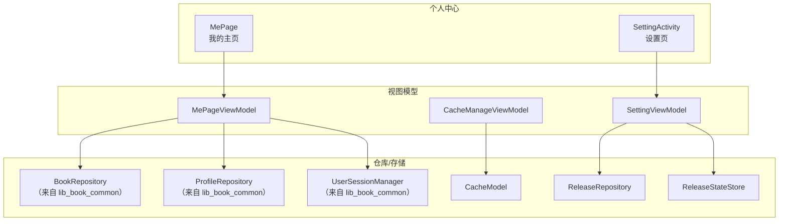
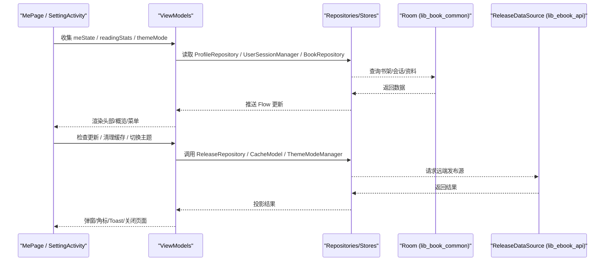
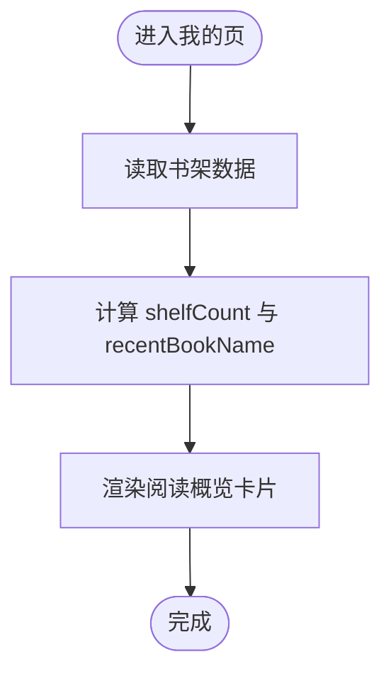
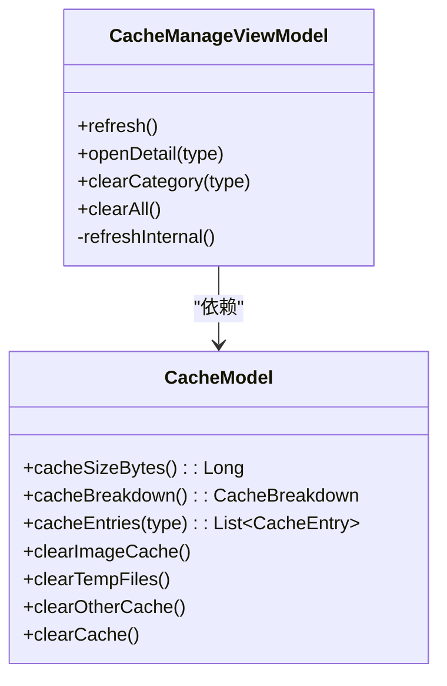
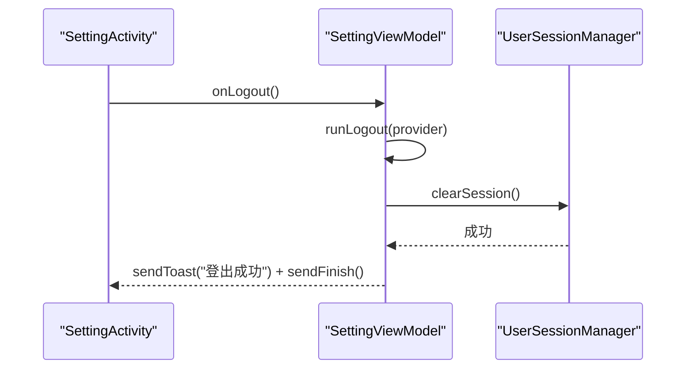
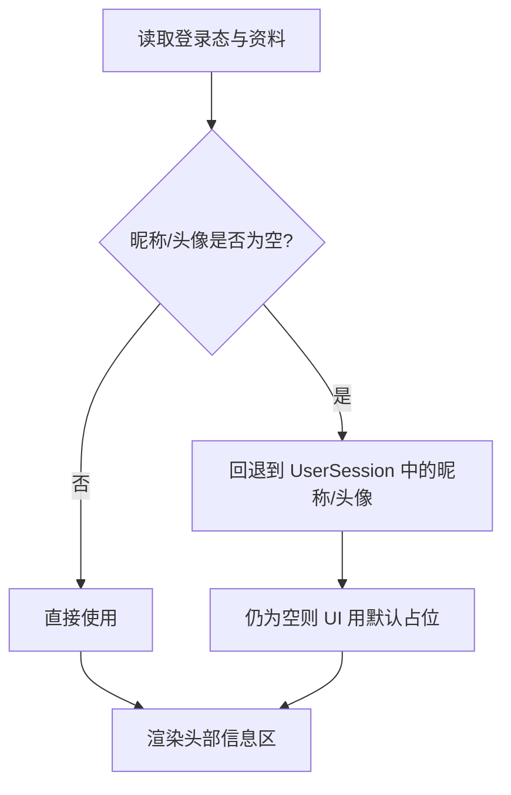
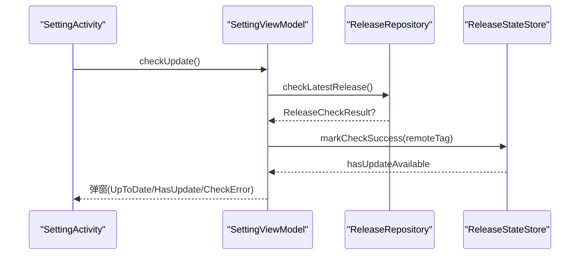
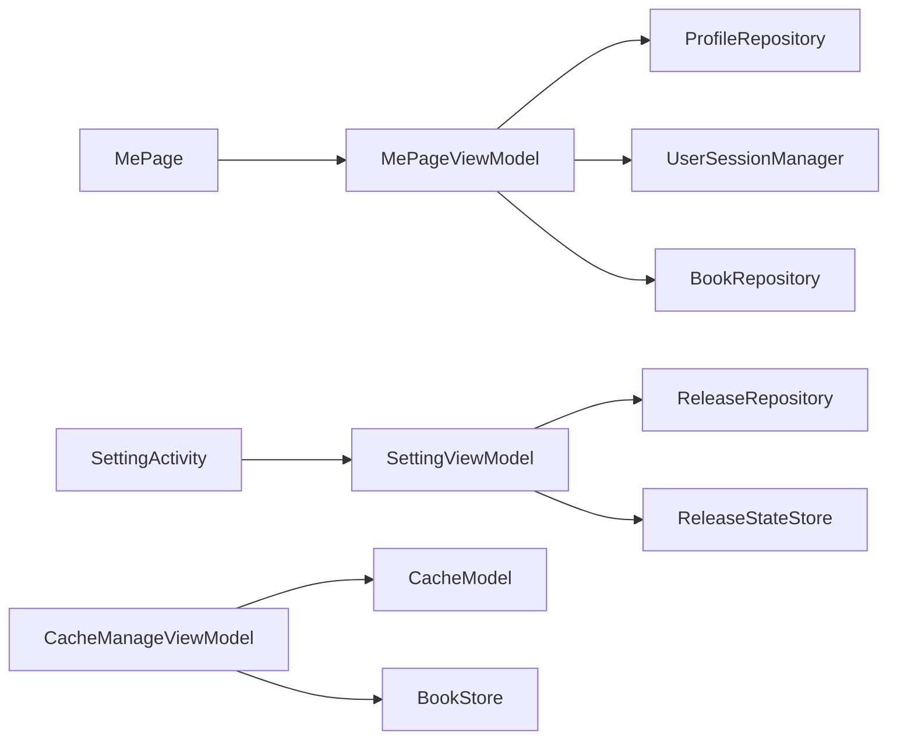

# 个人中心

<cite>
**本文引用的文件**   
- [MePage.kt](file://module_me/src/main/java/com/ebook/me/page/MePage.kt)
- [MePageViewModel.kt](file://module_me/src/main/java/com/ebook/me/mvvm/viewmodel/MePageViewModel.kt)
- [CacheManageViewModel.kt](file://module_me/src/main/java/com/ebook/me/mvvm/viewmodel/CacheManageViewModel.kt)
- [CacheModel.kt](file://module_me/src/main/java/com/ebook/me/repository/CacheModel.kt)
- [SettingViewModel.kt](file://module_me/src/main/java/com/ebook/me/mvvm/viewmodel/SettingViewModel.kt)
- [ReleaseRepository.kt](file://module_me/src/main/java/com/ebook/me/repository/ReleaseRepository.kt)
- [ReleaseStateStore.kt](file://module_me/src/main/java/com/ebook/me/repository/ReleaseStateStore.kt)
- [SettingActivity.kt](file://module_me/src/main/java/com/ebook/me/view/SettingActivity.kt)
</cite>

## 目录
1. [简介](#简介)
2. [项目结构](#项目结构)
3. [核心组件](#核心组件)
4. [架构总览](#架构总览)
5. [详细组件分析](#详细组件分析)
6. [依赖关系分析](#依赖关系分析)
7. [性能考量](#性能考量)
8. [故障排查指南](#故障排查指南)
9. [结论](#结论)
10. [附录](#附录)

## 简介
本技术文档聚焦“个人中心”模块，覆盖以下能力：
- 阅读概览：书架藏书数、最近在读书籍名等统计数据的来源与展示。
- 缓存管理：缓存分类、明细查看、清理策略与存储空间优化。
- 设置配置：应用主题模式、缓存入口、书源数量、退出登录等行为。
- 用户信息管理：登录态、头像/昵称回退、账号区块可见性控制。
- 版本更新检测：检查流程、结果弹窗、下载跳转、限频与角标派生。
- 个性化扩展接口与体验优化建议。

该模块采用 MVVM + Compose 架构，通过 Hilt 注入 ViewModel，页面通过 TheRouter 进行跨模块导航；数据流使用 StateFlow，异步任务在 viewModelScope 中执行。

## 项目结构
个人中心相关代码集中在 module_me 下，关键路径如下：
- 页面层：MePage（我的主页）、SettingActivity（设置页）
- 视图模型：MePageViewModel、CacheManageViewModel、SettingViewModel
- 仓库/存储：CacheModel、ReleaseRepository、ReleaseStateStore

图表来源
- [MePage.kt:77-94](file://module_me/src/main/java/com/ebook/me/page/MePage.kt#L77-L94)
- [MePageViewModel.kt:77-119](file://module_me/src/main/java/com/ebook/me/mvvm/viewmodel/MePageViewModel.kt#L77-L119)
- [CacheManageViewModel.kt:35-40](file://module_me/src/main/java/com/ebook/me/mvvm/viewmodel/CacheManageViewModel.kt#L35-L40)
- [SettingViewModel.kt:63-71](file://module_me/src/main/java/com/ebook/me/mvvm/viewmodel/SettingViewModel.kt#L63-L71)
- [ReleaseRepository.kt:35-38](file://module_me/src/main/java/com/ebook/me/repository/ReleaseRepository.kt#L35-L38)
- [ReleaseStateStore.kt:32-37](file://module_me/src/main/java/com/ebook/me/repository/ReleaseStateStore.kt#L32-L37)

章节来源
- [MePage.kt:61-94](file://module_me/src/main/java/com/ebook/me/page/MePage.kt#L61-L94)
- [SettingActivity.kt:79-143](file://module_me/src/main/java/com/ebook/me/view/SettingActivity.kt#L79-L143)

## 核心组件
- 我的主页（MePage）：渲染渐变头部、头像、昵称/账号副标题、阅读概览卡片与功能菜单卡片，并通过 TheRouter 导航到评论、设置、编辑资料或登录。
- 我的页 ViewModel（MePageViewModel）：合并登录态、个人资料与书架数据，提供 meState、readingStats、themeMode 三条 StateFlow。
- 缓存管理 ViewModel（CacheManageViewModel）：分类统计 cacheDir、明细 BottomSheet、清理单类/全部缓存，并展示书籍内容占用与册数（只读）。
- 设置页 ViewModel（SettingViewModel）：主题模式切换、缓存大小显示、版本更新检查（主动+静默）、退出登录编排、书源数量展示。
- 发布检查仓库（ReleaseRepository）：多发布源 failover、APK 附件过滤、结果投影。
- 版本状态存储（ReleaseStateStore）：持久化上次检查 tag 与成功时间，计算是否可自动刷新与是否有新版本。

章节来源
- [MePageViewModel.kt:19-68](file://module_me/src/main/java/com/ebook/me/mvvm/viewmodel/MePageViewModel.kt#L19-L68)
- [CacheManageViewModel.kt:23-34](file://module_me/src/main/java/com/ebook/me/mvvm/viewmodel/CacheManageViewModel.kt#L23-L34)
- [SettingViewModel.kt:34-61](file://module_me/src/main/java/com/ebook/me/mvvm/viewmodel/SettingViewModel.kt#L34-L61)
- [ReleaseRepository.kt:13-34](file://module_me/src/main/java/com/ebook/me/repository/ReleaseRepository.kt#L13-L34)
- [ReleaseStateStore.kt:12-31](file://module_me/src/main/java/com/ebook/me/repository/ReleaseStateStore.kt#L12-L31)

## 架构总览
个人中心以“页面 → ViewModel → Repository/Store”的分层组织。页面仅负责组合 UI 与事件转发；ViewModel 聚合多个仓库的响应式状态；Repository/Store 负责网络与本地存储的具体实现。

图表来源
- [MePageViewModel.kt:77-119](file://module_me/src/main/java/com/ebook/me/mvvm/viewmodel/MePageViewModel.kt#L77-L119)
- [SettingViewModel.kt:214-257](file://module_me/src/main/java/com/ebook/me/mvvm/viewmodel/SettingViewModel.kt#L214-L257)
- [ReleaseRepository.kt:46-70](file://module_me/src/main/java/com/ebook/me/repository/ReleaseRepository.kt#L46-L70)

## 详细组件分析

### 阅读概览实现
- 数据来源：书架数据由 BookRepository.observeBookShelf() 提供，按 finalDate 倒序，first 即为最近在读。
- 统计项：
  - 书架藏书数：books.size
  - 最近在读书名：books.firstOrNull()?.bookInfo?.name，为空时 UI 降级为占位文案
- 展示位置：MePage 的 ReadingStatsCard，两列布局（藏书数 | 最近在读），无登录要求，体现本地资产优先。

图表来源
- [MePageViewModel.kt:95-107](file://module_me/src/main/java/com/ebook/me/mvvm/viewmodel/MePageViewModel.kt#L95-L107)
- [MePage.kt:331-368](file://module_me/src/main/java/com/ebook/me/page/MePage.kt#L331-L368)

章节来源
- [MePageViewModel.kt:38-47](file://module_me/src/main/java/com/ebook/me/mvvm/viewmodel/MePageViewModel.kt#L38-L47)
- [MePageViewModel.kt:95-107](file://module_me/src/main/java/com/ebook/me/mvvm/viewmodel/MePageViewModel.kt#L95-L107)
- [MePage.kt:331-368](file://module_me/src/main/java/com/ebook/me/page/MePage.kt#L331-L368)

### 缓存管理功能
- 分类维度：IMAGE（图片缓存，含 Coil/Glide 遗留目录）、TEMP（cacheDir 根松散文件）、OTHER（除图片外的子目录）。
- 统计与明细：
  - cacheBreakdown()：一次遍历分档累加，totalBytes = image + temp + other，避免差值法负数问题。
  - cacheEntries(type)：按类型列出条目，IMAGE/OTHER 以目录粒度，TEMP 以文件粒度，按大小降序。
- 清理策略：
  - clearImageCache()/clearTempFiles()/clearOtherCache()：分别删除对应范围的文件/目录。
  - clearAll()：清空 cacheDir 全部内容（保留根目录）。
  - 防重复闸门：clearInProgress 保证同一时刻仅放行一笔清理。
- 书籍内容占用：通过 BookStore.storageUsage() 获取 filesDir/books 的占用与册数，不参与清理，仅展示并可点回书架。

图表来源
- [CacheModel.kt:57-144](file://module_me/src/main/java/com/ebook/me/repository/CacheModel.kt#L57-L144)
- [CacheManageViewModel.kt:35-40](file://module_me/src/main/java/com/ebook/me/mvvm/viewmodel/CacheManageViewModel.kt#L35-L40)
- [CacheManageViewModel.kt:131-167](file://module_me/src/main/java/com/ebook/me/mvvm/viewmodel/CacheManageViewModel.kt#L131-L167)

章节来源
- [CacheModel.kt:10-18](file://module_me/src/main/java/com/ebook/me/repository/CacheModel.kt#L10-L18)
- [CacheModel.kt:71-92](file://module_me/src/main/java/com/ebook/me/repository/CacheModel.kt#L71-L92)
- [CacheManageViewModel.kt:42-59](file://module_me/src/main/java/com/ebook/me/mvvm/viewmodel/CacheManageViewModel.kt#L42-L59)
- [CacheManageViewModel.kt:116-167](file://module_me/src/main/java/com/ebook/me/mvvm/viewmodel/CacheManageViewModel.kt#L116-L167)

### 设置配置系统
- 外观主题：ThemeMode（LIGHT/DARK/SYSTEM），通过 ThemeModeManager 设置并持久化，设置页与我的页共享同一实例，避免多源不一致。
- 缓存入口：设置页仅展示 cacheDir 总大小，实际清理在缓存管理页进行。
- 书源入口计数：sourcesCount 由 BookSourceManager.observeSources() 映射 size 得到，显示总数（含禁用）。
- 退出登录：runLogout(provider) 编排服务端作废 → 清本地会话（UserSessionManager.clearSession）→ 提示 + 关页，整条链在 viewModelScope 内完成。

图表来源
- [SettingViewModel.kt:292-343](file://module_me/src/main/java/com/ebook/me/mvvm/viewmodel/SettingViewModel.kt#L292-L343)
- [SettingActivity.kt:135-140](file://module_me/src/main/java/com/ebook/me/view/SettingActivity.kt#L135-L140)

章节来源
- [SettingViewModel.kt:163-172](file://module_me/src/main/java/com/ebook/me/mvvm/viewmodel/SettingViewModel.kt#L163-L172)
- [SettingViewModel.kt:141-161](file://module_me/src/main/java/com/ebook/me/mvvm/viewmodel/SettingViewModel.kt#L141-L161)
- [SettingViewModel.kt:292-343](file://module_me/src/main/java/com/ebook/me/mvvm/viewmodel/SettingViewModel.kt#L292-L343)
- [SettingActivity.kt:89-96](file://module_me/src/main/java/com/ebook/me/view/SettingActivity.kt#L89-L96)

### 用户信息管理
- 登录态与资料：
  - isLoggedIn、currentUser 来自 UserSessionManager。
  - nickname、pictureUrl 来自 ProfileRepository。
  - 回退规则：昵称优先 ProfileRepository，其次 currentUser.nickname；头像同理，空串则 UI 使用默认头像。
- 我的页头部：
  - 未登录显示“未登录”占位与“立即登录”按钮；已登录显示编辑资料按钮。
  - 状态栏图标深浅随头部渐变起始色自适应，避免浅色模式下深字压浅底不可见。

图表来源
- [MePageViewModel.kt:77-93](file://module_me/src/main/java/com/ebook/me/mvvm/viewmodel/MePageViewModel.kt#L77-L93)
- [MePage.kt:160-276](file://module_me/src/main/java/com/ebook/me/page/MePage.kt#L160-L276)

章节来源
- [MePageViewModel.kt:19-36](file://module_me/src/main/java/com/ebook/me/mvvm/viewmodel/MePageViewModel.kt#L19-L36)
- [MePageViewModel.kt:77-93](file://module_me/src/main/java/com/ebook/me/mvvm/viewmodel/MePageViewModel.kt#L77-L93)
- [MePage.kt:140-276](file://module_me/src/main/java/com/ebook/me/page/MePage.kt#L140-L276)

### 版本更新检测机制
- 触发方式：
  - 主动检查：用户点击“检查更新”，立即发起请求并弹窗反馈。
  - 静默检查：进入设置页且距上次成功检查 ≥ 7 天，仅更新角标不弹窗。
- 失败处理：远端 tag 解析失败或本地版本读不到，按 CheckError 处置且不写成功时间戳，避免错误结论占据限频窗口。
- 结果呈现：
  - Idle/Checking/UpToDate/HasUpdate/CheckError 五种状态驱动弹窗与加载指示。
  - HasUpdate 时若有 APK 下载链接，打开系统浏览器/下载器；若无则收起下载按钮并提示说明。
- 限频与角标：
  - ReleaseStateStore 记录 lastCheckedTag 与 lastSuccessCheckTime。
  - hasUpdateAvailable 每次现场比较（当前装机版本 vs lastCheckedTag），升级后重进即自动纠正。

图表来源
- [SettingViewModel.kt:203-257](file://module_me/src/main/java/com/ebook/me/mvvm/viewmodel/SettingViewModel.kt#L203-L257)
- [ReleaseRepository.kt:46-70](file://module_me/src/main/java/com/ebook/me/repository/ReleaseRepository.kt#L46-L70)
- [ReleaseStateStore.kt:89-101](file://module_me/src/main/java/com/ebook/me/repository/ReleaseStateStore.kt#L89-L101)

章节来源
- [SettingViewModel.kt:89-124](file://module_me/src/main/java/com/ebook/me/mvvm/viewmodel/SettingViewModel.kt#L89-L124)
- [SettingViewModel.kt:214-257](file://module_me/src/main/java/com/ebook/me/mvvm/viewmodel/SettingViewModel.kt#L214-L257)
- [ReleaseRepository.kt:13-34](file://module_me/src/main/java/com/ebook/me/repository/ReleaseRepository.kt#L13-L34)
- [ReleaseStateStore.kt:66-77](file://module_me/src/main/java/com/ebook/me/repository/ReleaseStateStore.kt#L66-L77)

## 依赖关系分析
- 页面依赖 ViewModel，ViewModel 通过 Hilt 注入仓库/管理器。
- 我的书架数据依赖 lib_book_common 的 BookRepository/ProfileRepository/UserSessionManager。
- 版本检查依赖 lib_ebook_api 的 ReleaseDataSource 与本项目 ReleaseRepository/ReleaseStateStore。
- 缓存管理依赖 CacheModel 与 BookStore（用于只读展示书籍内容占用）。

图表来源
- [MePageViewModel.kt:70-75](file://module_me/src/main/java/com/ebook/me/mvvm/viewmodel/MePageViewModel.kt#L70-L75)
- [SettingViewModel.kt:63-71](file://module_me/src/main/java/com/ebook/me/mvvm/viewmodel/SettingViewModel.kt#L63-L71)
- [CacheManageViewModel.kt:35-40](file://module_me/src/main/java/com/ebook/me/mvvm/viewmodel/CacheManageViewModel.kt#L35-L40)

章节来源
- [MePageViewModel.kt:70-75](file://module_me/src/main/java/com/ebook/me/mvvm/viewmodel/MePageViewModel.kt#L70-L75)
- [SettingViewModel.kt:63-71](file://module_me/src/main/java/com/ebook/me/mvvm/viewmodel/SettingViewModel.kt#L63-L71)
- [CacheManageViewModel.kt:35-40](file://module_me/src/main/java/com/ebook/me/mvvm/viewmodel/CacheManageViewModel.kt#L35-L40)

## 性能考量
- 书架观察流 WhileSubscribed(5s)：切走 Tab 停止合并，切回立即用缓存值，省电且即时刷新。
- 缓存明细 IO 在 IO 线程执行，避免阻塞主线程；清理期间挂 Loading 覆盖层提升感知。
- 版本检查单飞：同一时刻最多一个请求，避免并发与重复落盘；取消在途任务防止“关窗后再次弹窗”。
- 角标与版本号同源：统一从 ReleaseStateStore 派生与展示，避免漂移。

[本节为通用指导，不直接分析具体文件]

## 故障排查指南
- 检查更新失败：
  - 现象：弹窗显示“检查失败”，角标不变。
  - 原因：远端 tag 解析失败或本地版本读不到；不会写入成功时间戳，避免假结论占据限频窗口。
  - 处理：检查网络、重试；确认 ReleaseRepository 的两个端点可达。
- 缓存清理无效：
  - 现象：点击清理后大小未变化。
  - 原因：可能重复清理被闸门拦截；或分类识别不准确（如新目录未归类）。
  - 处理：等待 Loading 结束；重新进入详情页查看明细；确认分类逻辑。
- 退出登录后仍显示登录态：
  - 现象：界面仍显示昵称/头像。
  - 原因：未正确调用 UserSessionManager.clearSession()；或页面未刷新。
  - 处理：确保 runLogout 完整执行；在 SettingActivity.onResume 中刷新缓存大小与角标。

章节来源
- [SettingViewModel.kt:203-257](file://module_me/src/main/java/com/ebook/me/mvvm/viewmodel/SettingViewModel.kt#L203-L257)
- [ReleaseRepository.kt:46-70](file://module_me/src/main/java/com/ebook/me/repository/ReleaseRepository.kt#L46-L70)
- [CacheManageViewModel.kt:116-167](file://module_me/src/main/java/com/ebook/me/mvvm/viewmodel/CacheManageViewModel.kt#L116-L167)
- [SettingViewModel.kt:292-343](file://module_me/src/main/java/com/ebook/me/mvvm/viewmodel/SettingViewModel.kt#L292-L343)

## 结论
个人中心模块通过清晰的 MVVM 分层与响应式状态流，实现了阅读概览、缓存管理、设置配置、用户信息与版本更新的完整闭环。其设计强调：
- 数据源单一与回退策略明确（头像/昵称、版本角标）。
- 清理与检查操作具备防重复与容错机制。
- 本地优先（书架数据）与远程校验（版本检查）结合。
未来可扩展个性化配置接口（如自定义缓存策略、主题扩展）与更多用户体验优化（如离线缓存预取、更细粒度的统计指标）。

[本节为总结，不直接分析具体文件]

## 附录
- 术语：
  - 我的页：个人中心主页，展示头像、昵称、阅读概览与功能菜单。
  - 设置页：主题、缓存、版本、书源管理与退出登录。
  - 阅读概览：书架藏书数与最近在读书籍名。
  - 缓存管理：cacheDir 的分类统计与清理。
  - 版本更新：检查远端发布、弹窗提示与下载跳转。

[本节为补充说明，不直接分析具体文件]