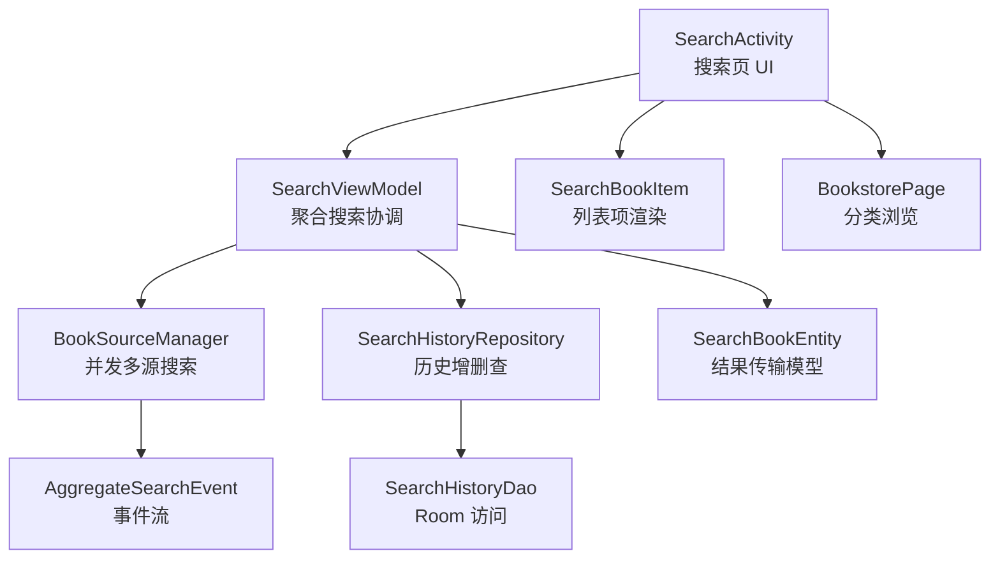
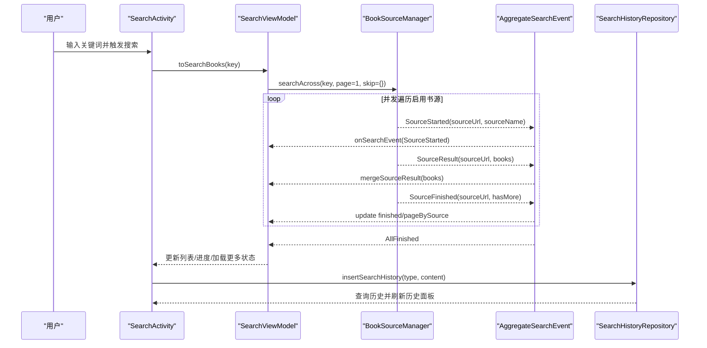
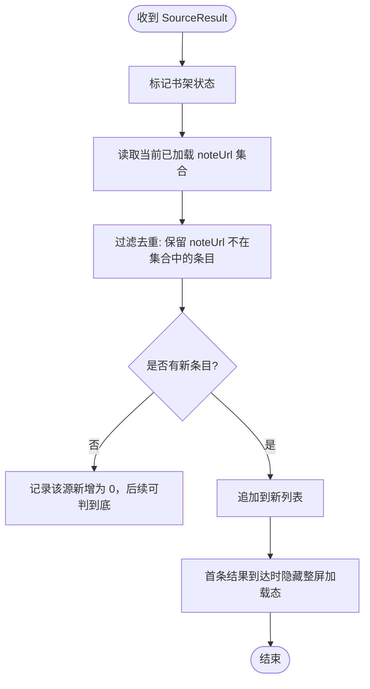
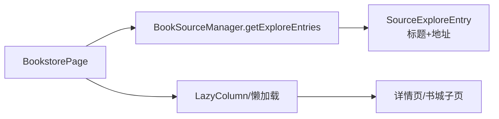
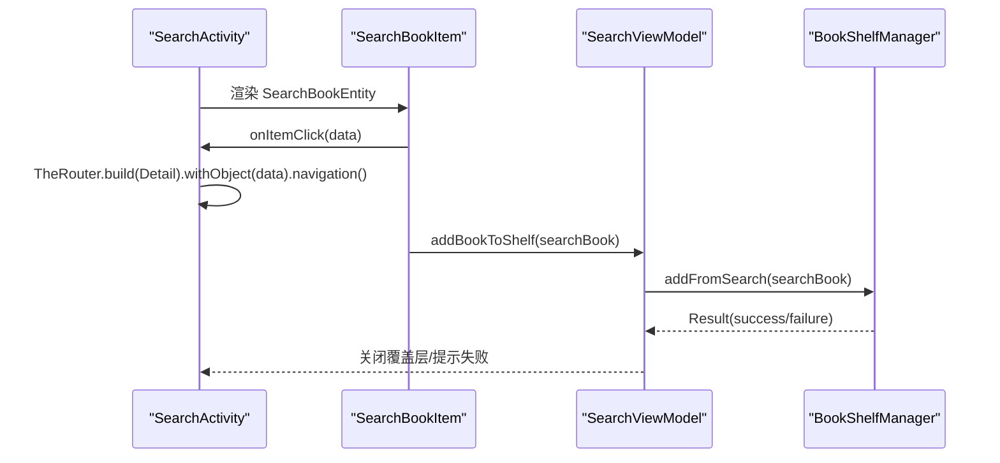
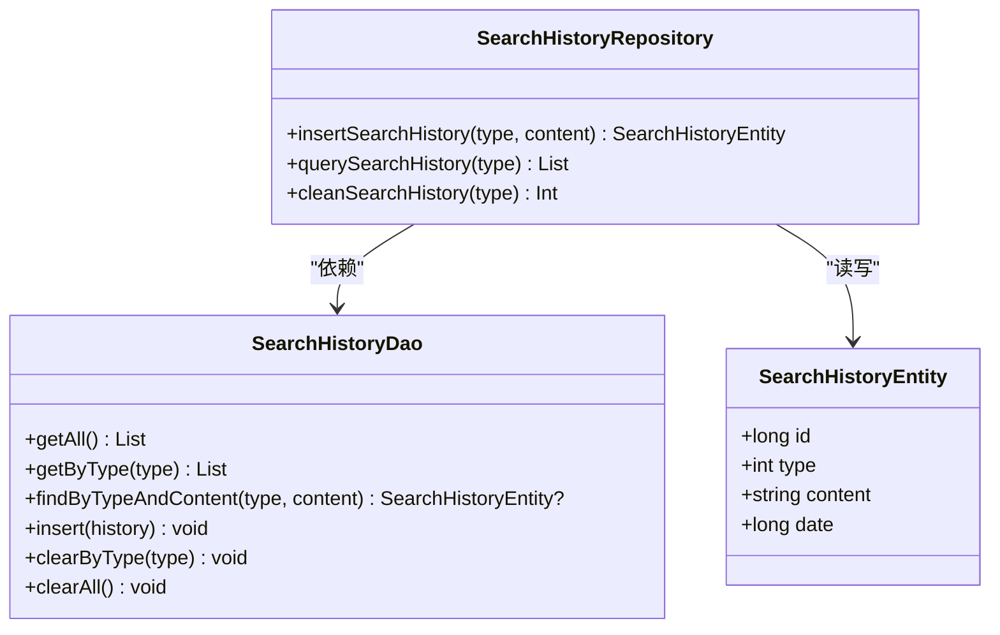
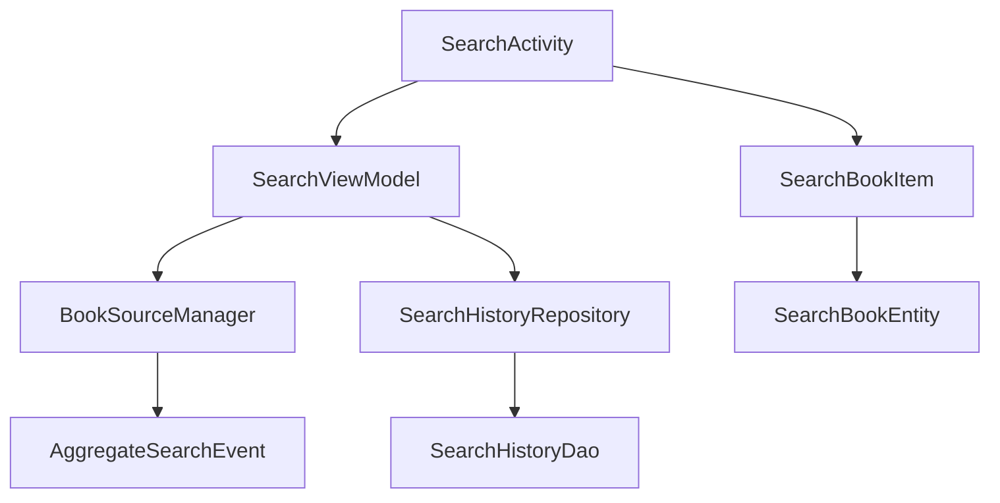

# 书城搜索

<cite>
**本文引用的文件**
- [SearchActivity.kt](file://module_find/src/main/java/com/ebook/find/SearchActivity.kt)
- [SearchViewModel.kt](file://module_find/src/main/java/com/ebook/find/mvvm/viewmodel/SearchViewModel.kt)
- [BookPageMerge.kt](file://module_find/src/main/java/com/ebook/find/mvvm/viewmodel/BookPageMerge.kt)
- [SearchHistoryRepository.kt](file://module_find/src/main/java/com/ebook/find/repository/SearchHistoryRepository.kt)
- [SearchHistoryDao.kt](file://lib_ebook_db/src/main/java/com/ebook/db/dao/SearchHistoryDao.kt)
- [SearchHistoryEntity.kt](file://lib_ebook_db/src/main/java/com/ebook/db/entity/SearchHistoryEntity.kt)
- [SearchBookEntity.kt](file://lib_ebook_db/src/main/java/com/ebook/db/entity/SearchBookEntity.kt)
- [AggregateSearchEvent.kt](file://lib_book_source/src/main/java/com/ebook/source/analyze/AggregateSearchEvent.kt)
- [BookSourceManager.kt](file://lib_book_common/src/main/java/com/ebook/common/analyze/source/BookSourceManager.kt)
- [BookstorePage.kt](file://module_find/src/main/java/com/ebook/find/page/BookstorePage.kt)
- [SearchBookItem.kt](file://module_find/src/main/java/com/ebook/find/view/SearchBookItem.kt)
</cite>

## 目录
1. [简介](#简介)
2. [项目结构](#项目结构)
3. [核心组件](#核心组件)
4. [架构总览](#架构总览)
5. [详细组件分析](#详细组件分析)
6. [依赖关系分析](#依赖关系分析)
7. [性能与优化](#性能与优化)
8. [故障排查](#故障排查)
9. [结论](#结论)
10. [附录：API 使用与扩展指南](#附录api-使用与扩展指南)

## 简介
本技术文档围绕“书城搜索”功能，系统性说明多源聚合搜索、分类浏览、搜索结果展示与处理、搜索历史管理、以及性能优化与扩展方法。内容基于仓库中的实现代码与设计决策记录，确保与实际代码一致。

## 项目结构
搜索功能涉及多个模块协作：
- 页面层（module_find）：搜索入口 SearchActivity、搜索项渲染 SearchBookItem、书城分类 BookstorePage。
- 业务逻辑（module_find + lib_book_common）：聚合搜索协调 SearchViewModel、书源管理器 BookSourceManager。
- 数据持久化（lib_ebook_db）：搜索历史实体与 DAO、搜索结果传输模型。
- 解析与事件（lib_book_source）：聚合搜索事件流 AggregateSearchEvent。

**图示来源**
- [SearchActivity.kt:129-380](file://module_find/src/main/java/com/ebook/find/SearchActivity.kt#L129-L380)
- [SearchViewModel.kt:29-127](file://module_find/src/main/java/com/ebook/find/mvvm/viewmodel/SearchViewModel.kt#L29-L127)
- [BookSourceManager.kt:114-155](file://lib_book_common/src/main/java/com/ebook/common/analyze/source/BookSourceManager.kt#L114-L155)
- [AggregateSearchEvent.kt:21-75](file://lib_book_source/src/main/java/com/ebook/source/analyze/AggregateSearchEvent.kt#L21-L75)

**章节来源**
- [SearchActivity.kt:129-380](file://module_find/src/main/java/com/ebook/find/SearchActivity.kt#L129-L380)
- [SearchViewModel.kt:29-127](file://module_find/src/main/java/com/ebook/find/mvvm/viewmodel/SearchViewModel.kt#L29-L127)
- [BookSourceManager.kt:114-155](file://lib_book_common/src/main/java/com/ebook/common/analyze/source/BookSourceManager.kt#L114-L155)
- [AggregateSearchEvent.kt:21-75](file://lib_book_source/src/main/java/com/ebook/source/analyze/AggregateSearchEvent.kt#L21-L75)

## 核心组件
- 搜索页面 SearchActivity：Compose UI，承载搜索栏、历史面板、结果列表与进度条；控制键盘交互与历史面板揭示动画。
- 搜索视图模型 SearchViewModel：聚合搜索编排、结果合并与去重、分页游标管理、书架状态同步、历史操作。
- 书源管理器 BookSourceManager：并发调用各启用书源进行检索，按事件流增量返回结果。
- 聚合搜索事件 AggregateSearchEvent：定义 SourceStarted/Result/Failed/Finished 与 AllFinished 的语义契约。
- 搜索历史 SearchHistoryRepository/DAO/Entity：本地存储查询词、支持 upsert 与按类型全量展示/清除。
- 搜索结果模型 SearchBookEntity：跨层传输搜索结果，携带归属书源 tag/origin 等元信息。
- 列表项 SearchBookItem：书籍信息展示、详情跳转、收藏（加入书架）。
- 分类浏览 BookstorePage：书城分类入口，懒加载分类条目。

**章节来源**
- [SearchActivity.kt:129-380](file://module_find/src/main/java/com/ebook/find/SearchActivity.kt#L129-L380)
- [SearchViewModel.kt:29-127](file://module_find/src/main/java/com/ebook/find/mvvm/viewmodel/SearchViewModel.kt#L29-L127)
- [SearchHistoryRepository.kt:11-42](file://module_find/src/main/java/com/ebook/find/repository/SearchHistoryRepository.kt#L11-L42)
- [SearchHistoryDao.kt:6-66](file://lib_ebook_db/src/main/java/com/ebook/db/dao/SearchHistoryDao.kt#L6-L66)
- [SearchHistoryEntity.kt:9-43](file://lib_ebook_db/src/main/java/com/ebook/db/entity/SearchHistoryEntity.kt#L9-L43)
- [SearchBookEntity.kt:6-25](file://lib_ebook_db/src/main/java/com/ebook/db/entity/SearchBookEntity.kt#L6-L25)
- [AggregateSearchEvent.kt:21-75](file://lib_book_source/src/main/java/com/ebook/source/analyze/AggregateSearchEvent.kt#L21-L75)
- [BookSourceManager.kt:114-155](file://lib_book_common/src/main/java/com/ebook/common/analyze/source/BookSourceManager.kt#L114-L155)

## 架构总览
搜索采用 MVVM + Coroutines Flow 的响应式架构：
- View（SearchActivity）仅持有纯 UI 状态（输入框文本、是否已搜索），通过 ViewModel 暴露的 StateFlow/SharedFlow 驱动界面更新。
- ViewModel（SearchViewModel）负责：
  - 发起多源聚合搜索（searchAcross），订阅事件流并增量更新列表；
  - 维护每源分页游标与结束集合，计算下一页与跳过集；
  - 对结果按 noteUrl 全局去重并追加；
  - 同步书架快照与事件，更新“是否已加书架”标记；
  - 提供搜索历史的插入、查询、清理。
- 数据层（Repository/DAO/Entity）提供本地历史存取；解析层（BookSourceManager）提供网络解析与事件流。

**图示来源**
- [SearchActivity.kt:365-380](file://module_find/src/main/java/com/ebook/find/SearchActivity.kt#L365-L380)
- [SearchViewModel.kt:212-226](file://module_find/src/main/java/com/ebook/find/mvvm/viewmodel/SearchViewModel.kt#L212-L226)
- [BookSourceManager.kt:114-155](file://lib_book_common/src/main/java/com/ebook/common/analyze/source/BookSourceManager.kt#L114-L155)
- [AggregateSearchEvent.kt:21-75](file://lib_book_source/src/main/java/com/ebook/source/analyze/AggregateSearchEvent.kt#L21-L75)
- [SearchHistoryRepository.kt:22-29](file://module_find/src/main/java/com/ebook/find/repository/SearchHistoryRepository.kt#L22-L29)

## 详细组件分析

### 多源聚合搜索与结果合并、去重、排序
- 并发聚合：BookSourceManager.searchAcross 对每条启用源并发解析当前页，上限为 5，避免对第三方站点造成过大压力。
- 事件驱动：AggregateSearchEvent 将每个源的开始、结果、失败、结束与全部完成事件推送到下游；调用方边收边渲染，不阻塞等待最慢源。
- 分页游标与翻页：
  - SearchViewModel 维护 AggregationBookkeeping.pageBySource（每源下一次请求页码）与 finishedSources（已结束源集合）；
  - loadMore 仅对未结束的源继续翻下一页，并将已结束源加入 skipSourceUrls；
  - roundPage() 取活动源的最小页码作为本轮统一页码，保证同源同页推进。
- 结果合并与去重：
  - mergeSourceResult 先将该批结果标记书架状态，再按 noteUrl 全局去重并 distinctBy(noteUrl)，最后追加到列表；
  - 去重后若某源无新增条目（软 404 重复首页），则将该源标记为结束，不再翻页。
- 相关性排序：当前实现未包含按相关性打分排序的逻辑；列表按事件到达顺序追加。如需引入排序，可在合并阶段按规则（如匹配度、评分、字数等）对 fresh 列表排序后再追加。

**图示来源**
- [SearchViewModel.kt:323-342](file://module_find/src/main/java/com/ebook/find/mvvm/viewmodel/SearchViewModel.kt#L323-L342)

**章节来源**
- [SearchViewModel.kt:39-54](file://module_find/src/main/java/com/ebook/find/mvvm/viewmodel/SearchViewModel.kt#L39-L54)
- [SearchViewModel.kt:130-167](file://module_find/src/main/java/com/ebook/find/mvvm/viewmodel/SearchViewModel.kt#L130-L167)
- [SearchViewModel.kt:261-284](file://module_find/src/main/java/com/ebook/find/mvvm/viewmodel/SearchViewModel.kt#L261-L284)
- [SearchViewModel.kt:289-320](file://module_find/src/main/java/com/ebook/find/mvvm/viewmodel/SearchViewModel.kt#L289-L320)
- [SearchViewModel.kt:323-342](file://module_find/src/main/java/com/ebook/find/mvvm/viewmodel/SearchViewModel.kt#L323-L342)
- [BookSourceManager.kt:114-155](file://lib_book_common/src/main/java/com/ebook/common/analyze/source/BookSourceManager.kt#L114-L155)
- [AggregateSearchEvent.kt:21-75](file://lib_book_source/src/main/java/com/ebook/source/analyze/AggregateSearchEvent.kt#L21-L75)

### 分类浏览功能
- 分类数据来源：BookstorePage 通过 BookSourceManager.getExploreEntries 获取分类条目（原生 kinds 或脚本 exploreUrl 条目）。
- 懒加载优化：分类胶囊按需加载，避免首屏一次性拉取大量分类数据；结合 Room 缓存策略（见仓库约定）减少重复网络请求。
- 导航实现：点击分类后进入对应书城子页，复用统一的列表与加载机制，保持与搜索一致的体验。

**图示来源**
- [BookSourceManager.kt:192-203](file://lib_book_common/src/main/java/com/ebook/common/analyze/source/BookSourceManager.kt#L192-L203)

**章节来源**
- [BookstorePage.kt](file://module_find/src/main/java/com/ebook/find/page/BookstorePage.kt)
- [BookSourceManager.kt:192-203](file://lib_book_common/src/main/java/com/ebook/common/analyze/source/BookSourceManager.kt#L192-L203)

### 搜索结果展示与处理
- 书籍信息展示：SearchBookItem 渲染封面、书名、作者、字数、状态、最新章节等字段（来自 SearchBookEntity）。
- 详情跳转：点击条目通过 TheRouter 跳转到详情页，携带 from=FROM_SEARCH 与 data=SearchBookEntity。
- 收藏操作：点击“加入书架”调用 SearchViewModel.addBookToShelf，内部经 bookShelfManager.addFromSearch 添加；失败统一走 reportAddBookFailure 上报。

**图示来源**
- [SearchActivity.kt:270-281](file://module_find/src/main/java/com/ebook/find/SearchActivity.kt#L270-L281)
- [SearchViewModel.kt:228-244](file://module_find/src/main/java/com/ebook/find/mvvm/viewmodel/SearchViewModel.kt#L228-L244)

**章节来源**
- [SearchActivity.kt:270-281](file://module_find/src/main/java/com/ebook/find/SearchActivity.kt#L270-L281)
- [SearchBookItem.kt](file://module_find/src/main/java/com/ebook/find/view/SearchBookItem.kt)
- [SearchViewModel.kt:228-244](file://module_find/src/main/java/com/ebook/find/mvvm/viewmodel/SearchViewModel.kt#L228-L244)

### 搜索历史记录与管理
- 数据结构：SearchHistoryEntity 以自增主键 id、type、content、date 表示一条搜索词记录；type 用于隔离不同入口（当前书籍搜索类型为常量 BOOK）。
- 历史操作：
  - 插入：insertSearchHistory(type, content) 先按 type+content 精确查找，存在则更新时间戳，不存在则新建；
  - 查询：querySearchHistory(type) 返回按 date DESC 的全量历史；
  - 清理：cleanSearchHistory(type) 删除该类型全部历史，成功后发射空列表刷新 UI。
- 界面交互：SearchActivity 进入页面即加载历史，键盘弹出显示历史面板；点击词条回填输入并触发搜索；清除按钮带粒子爆炸动画。

**图示来源**
- [SearchHistoryEntity.kt:9-43](file://lib_ebook_db/src/main/java/com/ebook/db/entity/SearchHistoryEntity.kt#L9-L43)
- [SearchHistoryDao.kt:6-66](file://lib_ebook_db/src/main/java/com/ebook/db/dao/SearchHistoryDao.kt#L6-L66)
- [SearchHistoryRepository.kt:11-42](file://module_find/src/main/java/com/ebook/find/repository/SearchHistoryRepository.kt#L11-L42)

**章节来源**
- [SearchHistoryEntity.kt:9-43](file://lib_ebook_db/src/main/java/com/ebook/db/entity/SearchHistoryEntity.kt#L9-L43)
- [SearchHistoryDao.kt:6-66](file://lib_ebook_db/src/main/java/com/ebook/db/dao/SearchHistoryDao.kt#L6-L66)
- [SearchHistoryRepository.kt:11-42](file://module_find/src/main/java/com/ebook/find/repository/SearchHistoryRepository.kt#L11-L42)
- [SearchActivity.kt:185-194](file://module_find/src/main/java/com/ebook/find/SearchActivity.kt#L185-L194)
- [SearchActivity.kt:354-380](file://module_find/src/main/java/com/ebook/find/SearchActivity.kt#L354-L380)

### 搜索性能优化
- 并发控制：BookSourceManager 限制并发上限为 5，平衡用户体验与第三方站点礼貌度。
- 增量更新：AggregateSearchEvent 事件流允许边收边渲染，避免整批等待。
- 去重与分页优化：按 noteUrl 去重并结合软 404 检测（零新条目即判到底），减少无效翻页请求。
- 内存管理：
  - 列表 key 稳定（noteUrl），避免 Compose LazyColumn 因重复 key 崩溃；
  - VM 内维护书架快照与事件同步，减少 UI 侧重复收集；
  - 取消旧轮聚合任务（aggregateJob.cancel）防止旧结果污染新列表。
- 缓存策略：分类与书城缓存由 BookSourceRepository 管理（TTL 与 SWR），解析器不直接碰缓存，避免下拉刷新被缓存命中吞掉。

**章节来源**
- [BookSourceManager.kt:114-155](file://lib_book_common/src/main/java/com/ebook/common/analyze/source/BookSourceManager.kt#L114-L155)
- [SearchViewModel.kt:79-87](file://module_find/src/main/java/com/ebook/find/mvvm/viewmodel/SearchViewModel.kt#L79-L87)
- [SearchViewModel.kt:212-226](file://module_find/src/main/java/com/ebook/find/mvvm/viewmodel/SearchViewModel.kt#L212-L226)
- [SearchViewModel.kt:323-342](file://module_find/src/main/java/com/ebook/find/mvvm/viewmodel/SearchViewModel.kt#L323-L342)
- [SearchActivity.kt:270-281](file://module_find/src/main/java/com/ebook/find/SearchActivity.kt#L270-L281)

## 依赖关系分析
- SearchActivity 依赖 SearchViewModel 提供状态与命令；
- SearchViewModel 依赖 BookSourceManager 进行聚合搜索，依赖 SearchHistoryRepository 进行历史管理；
- BookSourceManager 依赖底层解析器（Jsoup/Script）与网络层，产出 AggregateSearchEvent；
- 历史模块依赖 Room DAO 与 Entity；
- 列表项 SearchBookItem 消费 SearchBookEntity 进行展示与交互。

**图示来源**
- [SearchActivity.kt:129-380](file://module_find/src/main/java/com/ebook/find/SearchActivity.kt#L129-L380)
- [SearchViewModel.kt:29-127](file://module_find/src/main/java/com/ebook/find/mvvm/viewmodel/SearchViewModel.kt#L29-L127)
- [SearchHistoryRepository.kt:11-42](file://module_find/src/main/java/com/ebook/find/repository/SearchHistoryRepository.kt#L11-L42)
- [SearchHistoryDao.kt:6-66](file://lib_ebook_db/src/main/java/com/ebook/db/dao/SearchHistoryDao.kt#L6-L66)
- [AggregateSearchEvent.kt:21-75](file://lib_book_source/src/main/java/com/ebook/source/analyze/AggregateSearchEvent.kt#L21-L75)
- [SearchBookEntity.kt:6-25](file://lib_ebook_db/src/main/java/com/ebook/db/entity/SearchBookEntity.kt#L6-L25)

**章节来源**
- [SearchActivity.kt:129-380](file://module_find/src/main/java/com/ebook/find/SearchActivity.kt#L129-L380)
- [SearchViewModel.kt:29-127](file://module_find/src/main/java/com/ebook/find/mvvm/viewmodel/SearchViewModel.kt#L29-L127)
- [SearchHistoryRepository.kt:11-42](file://module_find/src/main/java/com/ebook/find/repository/SearchHistoryRepository.kt#L11-L42)
- [SearchHistoryDao.kt:6-66](file://lib_ebook_db/src/main/java/com/ebook/db/dao/SearchHistoryDao.kt#L6-L66)
- [AggregateSearchEvent.kt:21-75](file://lib_book_source/src/main/java/com/ebook/source/analyze/AggregateSearchEvent.kt#L21-L75)
- [SearchBookEntity.kt:6-25](file://lib_ebook_db/src/main/java/com/ebook/db/entity/SearchBookEntity.kt#L6-L25)

## 性能与优化
- 并发上限 5：避免对第三方站点造成过大压力，提升稳定性；
- 事件流增量渲染：边收边显，提升首屏速度；
- 去重与软 404 检测：减少无效翻页，降低网络开销；
- 稳定 key：避免 Compose 列表异常与锚点偏移；
- 取消旧轮：防止旧结果污染新列表，保证一致性；
- 缓存策略：分类与书城缓存 TTL/SWR，解析器不直接触碰缓存，保证刷新语义正确。

[本节为通用指导，无需特定文件引用]

## 故障排查
- 所有源失败：finishRound 检测到全部源失败时显示网络错误覆盖层，并报告失败原因；
- 部分失败：已有结果照常展示，进度行仍会显示已完成数；
- 取消协程：CancellationException 原样上抛，确保旧轮终止干净；
- 历史面板：键盘状态驱动显示/隐藏，宽限期兜底在无键盘环境打开历史面板；
- 列表崩溃：确保 item key 唯一（noteUrl），避免重复 key 导致异常。

**章节来源**
- [SearchViewModel.kt:344-375](file://module_find/src/main/java/com/ebook/find/mvvm/viewmodel/SearchViewModel.kt#L344-L375)
- [SearchActivity.kt:175-194](file://module_find/src/main/java/com/ebook/find/SearchActivity.kt#L175-L194)
- [SearchActivity.kt:270-281](file://module_find/src/main/java/com/ebook/find/SearchActivity.kt#L270-L281)

## 结论
书城搜索功能通过多源聚合、事件流驱动、严格去重与分页管理，实现了高效、稳定且可扩展的搜索体验。配合搜索历史管理与分类浏览，形成了完整的书城发现链路。性能方面通过并发控制、增量渲染与缓存策略优化了用户体验。未来可在相关性排序、智能推荐等方面进一步扩展。

[本节为总结性内容，无需特定文件引用]

## 附录：API 使用与扩展指南
- 聚合搜索 API：
  - 调用 BookSourceManager.searchAcross(keyword, page, skipSourceUrls) 获取 Flow<AggregateSearchEvent>；
  - 订阅事件流，处理 SourceStarted/Result/Failed/Finished/AllFinished；
  - 维护每源页码与结束集合，计算下一页与跳过集。
- 搜索结果处理：
  - 按 noteUrl 去重后追加列表；
  - 首条结果到达时隐藏整屏加载态；
  - 支持详情页跳转与加入书架。
- 搜索历史 API：
  - 插入：SearchHistoryRepository.insertSearchHistory(type, content)；
  - 查询：SearchHistoryRepository.querySearchHistory(type)；
  - 清理：SearchHistoryRepository.cleanSearchHistory(type)。
- 扩展开发：
  - 新增排序规则：在 mergeSourceResult 中对 fresh 列表排序；
  - 新增缓存策略：在 BookSourceRepository 中调整 TTL 与 SWR；
  - 新增书源：导入 JSON 规则，确保默认源与启用状态正确。

**章节来源**
- [BookSourceManager.kt:114-155](file://lib_book_common/src/main/java/com/ebook/common/analyze/source/BookSourceManager.kt#L114-L155)
- [SearchViewModel.kt:323-342](file://module_find/src/main/java/com/ebook/find/mvvm/viewmodel/SearchViewModel.kt#L323-L342)
- [SearchHistoryRepository.kt:22-42](file://module_find/src/main/java/com/ebook/find/repository/SearchHistoryRepository.kt#L22-L42)