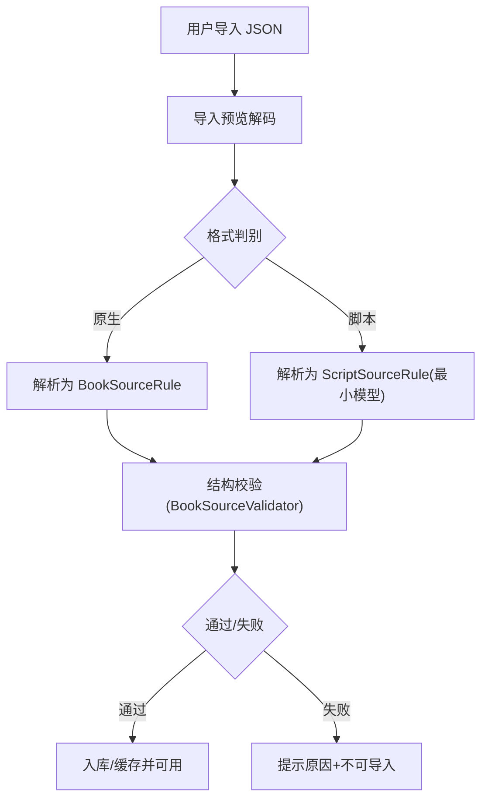
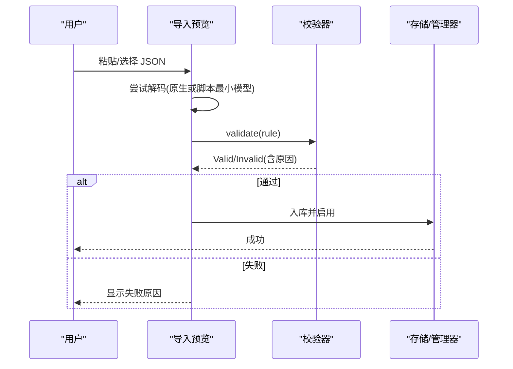
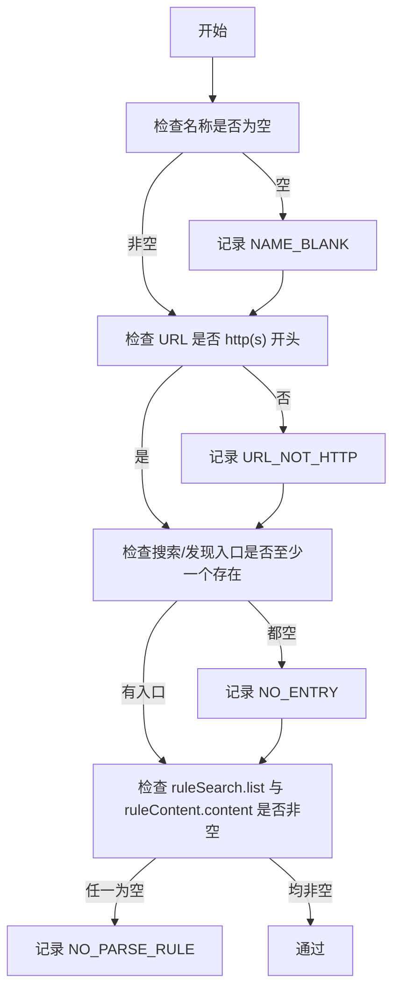
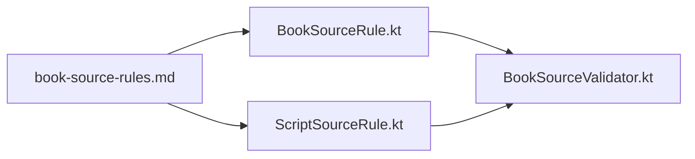

# JSON 规则格式

<cite>
**本文引用的文件**
- [BookSourceRule.kt](file://lib_ebook_api/src/main/java/com/ebook/api/entity/BookSourceRule.kt)
- [ScriptSourceRule.kt](file://lib_ebook_api/src/main/java/com/ebook/api/entity/ScriptSourceRule.kt)
- [book-source-rules.md](file://docs/book-source-rules.md)
- [BookSourceValidator.kt](file://module_me/src/main/java/com/ebook/me/domain/BookSourceValidator.kt)
- [BookSourceValidatorTest.kt](file://module_me/src/test/java/com/ebook/me/domain/BookSourceValidatorTest.kt)
- [SourceStorageJsonTest.kt](file://lib_book_common/src/test/java/com/ebook/common/analyze/source/SourceStorageJsonTest.kt)
</cite>

## 目录
1. [简介](#简介)
2. [项目结构](#项目结构)
3. [核心组件](#核心组件)
4. [架构总览](#架构总览)
5. [详细组件分析](#详细组件分析)
6. [依赖关系分析](#依赖关系分析)
7. [性能与行为特性](#性能与行为特性)
8. [故障排查指南](#故障排查指南)
9. [结论](#结论)
10. [附录：字段规范与示例路径](#附录字段规范与示例路径)

## 简介
本文件面向“原生书源 JSON 规则”的完整技术说明，覆盖以下要点：
- 原生书源 JSON 的数据模型、字段定义、数据类型、默认值与约束
- 六大规则对象（ruleSearch、ruleExplore、ruleBookInfo、ruleToc、ruleContent、ruleReview）的语法与解析逻辑
- URL 模板语法、变量插值机制与分页处理规则
- 导入校验流程与导出格式化逻辑
- 错误场景与处理方式（字段缺失、类型不匹配、非法值）
- 完整的 JSON 示例位置与参考路径

注意：当前仓库中的“六大规则”以搜索、详情、目录、正文、发现为主；其中 ruleExplore 在代码中以 ruleFind 表示。ruleReview 在当前实现中未作为独立规则对象出现。

## 项目结构
与 JSON 规则相关的核心位置：
- 数据模型定义：lib_ebook_api/entity
- 导入校验与警示：module_me/domain
- 用户文档与示例：docs/book-source-rules.md
- 脚本源最小模型（用于对比与导入判别）：lib_ebook_api/entity/ScriptSourceRule.kt

图表来源
- [BookSourceRule.kt:1-210](file://lib_ebook_api/src/main/java/com/ebook/api/entity/BookSourceRule.kt#L1-L210)
- [ScriptSourceRule.kt:1-29](file://lib_ebook_api/src/main/java/com/ebook/api/entity/ScriptSourceRule.kt#L1-L29)
- [BookSourceValidator.kt:27-104](file://module_me/src/main/java/com/ebook/me/domain/BookSourceValidator.kt#L27-L104)
- [book-source-rules.md:31-56](file://docs/book-source-rules.md#L31-L56)

章节来源
- [BookSourceRule.kt:1-210](file://lib_ebook_api/src/main/java/com/ebook/api/entity/BookSourceRule.kt#L1-L210)
- [book-source-rules.md:31-56](file://docs/book-source-rules.md#L31-L56)

## 核心组件
- 原生书源数据模型：BookSourceRule 及其子规则（PageRule、SearchRule、BookInfoRule、TocRule、ContentRule、ReplaceRule、FindRule、KindItem）
- 导入校验器：BookSourceValidator，提供四条基本结构校验（名称、地址、入口、解析规则），并收集所有失败原因
- 脚本源最小模型：ScriptSourceRule，仅包含导入所需顶层键，忽略未知键，便于兼容社区格式
- 用户文档：book-source-rules.md，给出完整 JSON 示例与字段说明

章节来源
- [BookSourceRule.kt:1-210](file://lib_ebook_api/src/main/java/com/ebook/api/entity/BookSourceRule.kt#L1-L210)
- [BookSourceValidator.kt:27-104](file://module_me/src/main/java/com/ebook/me/domain/BookSourceValidator.kt#L27-L104)
- [ScriptSourceRule.kt:1-29](file://lib_ebook_api/src/main/java/com/ebook/api/entity/ScriptSourceRule.kt#L1-L29)
- [book-source-rules.md:59-243](file://docs/book-source-rules.md#L59-L243)

## 架构总览
原生规则由 JSON 驱动，运行时按“搜索→详情→目录→正文→发现”五段式工作流进行解析；URL 模板使用 {{}} 占位符，页码渲染遵循特定首页裁剪策略；导入时执行最小可用判定，失败则阻止导入并报告原因。

图表来源
- [BookSourceValidator.kt:37-53](file://module_me/src/main/java/com/ebook/me/domain/BookSourceValidator.kt#L37-L53)
- [book-source-rules.md:41-56](file://docs/book-source-rules.md#L41-L56)

章节来源
- [BookSourceValidator.kt:37-53](file://module_me/src/main/java/com/ebook/me/domain/BookSourceValidator.kt#L37-L53)
- [book-source-rules.md:41-56](file://docs/book-source-rules.md#L41-L56)

## 详细组件分析

### 数据模型与字段语义
- 顶层字段（BookSourceRule）
  - name、url、enabled、group、weight、charset、headers、method、body
  - searchUrl、searchMethod、searchBody、searchPage、ruleSearch
  - ruleBookInfo、ruleToc、ruleContent、ruleFind
- 分页规则（PageRule）
  - param、start、step
- 搜索规则（SearchRule）
  - list、name、author、kind、lastChapter、coverUrl、bookUrl、intro
- 书籍详情规则（BookInfoRule）
  - name、author、coverUrl、intro、kind、lastChapter、tocUrl、authorPrefix、introPrefix、reverseToc
- 目录规则（TocRule）
  - list、name、url、pageUrl、nextPage、reverse
- 正文规则（ContentRule）
  - content、nextPage、replaceRules、image
- 清理规则（ReplaceRule）
  - pattern、replacement、enabled
- 发现/分类规则（FindRule）
  - url、kinds、ruleSearch
- 分类项（KindItem）
  - title、url、children

章节来源
- [BookSourceRule.kt:11-210](file://lib_ebook_api/src/main/java/com/ebook/api/entity/BookSourceRule.kt#L11-L210)

### URL 模板与变量插值
- 支持 {{keyword}}、{{page}}、{{kind}} 等占位符
- 当模板以 /{{page}} 结尾时，首页会裁掉该段（适配某些站点首页裸路径）
- 关键词自动进行 URL 编码
- 相对路径按所在页面上下文解析；绝对 http(s) 原样使用

章节来源
- [BookSourceRule.kt:31-46](file://lib_ebook_api/src/main/java/com/ebook/api/entity/BookSourceRule.kt#L31-L46)
- [BookSourceRule.kt:135-149](file://lib_ebook_api/src/main/java/com/ebook/api/entity/BookSourceRule.kt#L135-L149)
- [book-source-rules.md:161-171](file://docs/book-source-rules.md#L161-L171)

### 分页处理规则
- PageRule 控制分页参数名、起始页与步长
- TocRule 支持两种分页模式：
  - nextPage：从页面提取下一页链接（优先）
  - pageUrl：基于 URL 模板生成下一页（无链接时回退）
- FindRule.url 必须包含 {{page}}，否则“加载更多”会重复请求同一首页

章节来源
- [BookSourceRule.kt:64-72](file://lib_ebook_api/src/main/java/com/ebook/api/entity/BookSourceRule.kt#L64-L72)
- [BookSourceRule.kt:127-149](file://lib_ebook_api/src/main/java/com/ebook/api/entity/BookSourceRule.kt#L127-L149)
- [BookSourceRule.kt:182-196](file://lib_ebook_api/src/main/java/com/ebook/api/entity/BookSourceRule.kt#L182-L196)
- [book-source-rules.md:187-200](file://docs/book-source-rules.md#L187-L200)
- [book-source-rules.md:219-225](file://docs/book-source-rules.md#L219-L225)

### CSS 选择器与取值语法
- 使用 Jsoup CSS 选择器
- 常用：类选择器、ID、标签、后代/直接子、@attr 取属性、.0 取第一个、|| 多选择器
- 在封面/链接处常配合 @src/@href

章节来源
- [book-source-rules.md:227-242](file://docs/book-source-rules.md#L227-L242)

### 导入校验流程
- 原生规则四条基础校验：
  - 名称非空
  - 地址为 http(s) 开头
  - 搜索地址与发现地址至少其一非空
  - 搜索结果列表选择器与正文容器选择器均非空
- 校验失败收集全部原因，不会短路
- 脚本书源沿用两条有效性（名称、地址），另出三项警示（可执行代码、依赖登录、非文本源），但不影响导入

图表来源
- [BookSourceValidator.kt:37-53](file://module_me/src/main/java/com/ebook/me/domain/BookSourceValidator.kt#L37-L53)

章节来源
- [BookSourceValidator.kt:37-53](file://module_me/src/main/java/com/ebook/me/domain/BookSourceValidator.kt#L37-L53)
- [BookSourceValidatorTest.kt:53-134](file://module_me/src/test/java/com/ebook/me/domain/BookSourceValidatorTest.kt#L53-L134)

### 导出格式化逻辑
- 原生规则导出为对应 BookSourceRule 的 JSON 结构（字段与默认值由数据模型决定）
- 脚本源保持原始 JSON 原文入库，不做翻译转换；导出时通常还原原始内容
- 导入时若为数组，逐条处理并报告结果

章节来源
- [book-source-rules.md:59-130](file://docs/book-source-rules.md#L59-L130)
- [book-source-rules.md:245-262](file://docs/book-source-rules.md#L245-L262)

### 错误场景与处理方式
- 字段缺失
  - 名称为空 → 报错（NAME_BLANK）
  - 地址非 http(s) → 报错（URL_NOT_HTTP）
  - 搜索与发现入口均为空 → 报错（NO_ENTRY）
  - 搜索结果列表或正文容器为空 → 报错（NO_PARSE_RULE）
- 类型不匹配
  - 脚本源最小模型顶层键为非数值（如 bookSourceType 为字符串非数字）→ 整条解不出，无法导入
  - 显式 null → 解不出（未开启 coerceInputValues）
- 非法值
  - URL 模板未包含 {{page}}（发现页）→ “加载更多”无效（应视为配置错误）
  - 非 http(s) 的地址会导致后续请求起点错误

章节来源
- [BookSourceValidator.kt:37-53](file://module_me/src/main/java/com/ebook/me/domain/BookSourceValidator.kt#L37-L53)
- [SourceStorageJsonTest.kt:53-100](file://lib_book_common/src/test/java/com/ebook/common/analyze/source/SourceStorageJsonTest.kt#L53-L100)
- [book-source-rules.md:219-225](file://docs/book-source-rules.md#L219-L225)

## 依赖关系分析
- 数据模型集中在 lib_ebook_api/entity
- 校验逻辑位于 module_me/domain
- 用户文档位于 docs
- 脚本源最小模型用于兼容社区 JSON，并与原生模型并存于同一层

图表来源
- [BookSourceRule.kt:1-210](file://lib_ebook_api/src/main/java/com/ebook/api/entity/BookSourceRule.kt#L1-L210)
- [ScriptSourceRule.kt:1-29](file://lib_ebook_api/src/main/java/com/ebook/api/entity/ScriptSourceRule.kt#L1-L29)
- [BookSourceValidator.kt:27-104](file://module_me/src/main/java/com/ebook/me/domain/BookSourceValidator.kt#L27-L104)
- [book-source-rules.md:59-243](file://docs/book-source-rules.md#L59-L243)

章节来源
- [BookSourceRule.kt:1-210](file://lib_ebook_api/src/main/java/com/ebook/api/entity/BookSourceRule.kt#L1-L210)
- [ScriptSourceRule.kt:1-29](file://lib_ebook_api/src/main/java/com/ebook/api/entity/ScriptSourceRule.kt#L1-L29)
- [BookSourceValidator.kt:27-104](file://module_me/src/main/java/com/ebook/me/domain/BookSourceValidator.kt#L27-L104)
- [book-source-rules.md:59-243](file://docs/book-source-rules.md#L59-L243)

## 性能与行为特性
- 导入校验为纯函数，无网络 IO，快速反馈
- 校验失败全量收集，避免反复导入
- URL 模板首页裁剪在解析层处理，减少不必要的请求
- 分页判据结合 next 链接与 URL 模板，降低冗余请求

[本节为通用说明，无需具体文件引用]

## 故障排查指南
- 导入后书城无内容
  - 确认已启用并设为默认源
  - 检查 ruleSearch.list 与 ruleContent.content 是否填写
  - 检查 URL 模板是否包含必要占位符（如 {{page}}）
- 搜索无结果
  - 确认至少有一个启用的书源
  - 单个源失败不影响其他源
- 规则不生效
  - 检查 CSS 选择器是否正确
  - 检查 charset 是否与站点一致
  - 检查 URL 是否为 http(s) 开头
  - 若为脚本源，检查 JS 语法与能力限制

章节来源
- [book-source-rules.md:349-401](file://docs/book-source-rules.md#L349-L401)
- [BookSourceValidator.kt:37-53](file://module_me/src/main/java/com/ebook/me/domain/BookSourceValidator.kt#L37-L53)

## 结论
原生书源 JSON 规则以声明式方式描述网站抓取过程，具备清晰的字段结构与严格的导入校验。URL 模板与分页规则提供了灵活的站点适配能力。通过集中化的数据模型与校验器，确保了导入体验的一致性与可诊断性。对于复杂站点，可在规则中组合多种选择器与清理策略；对社区脚本源，采用最小模型与警示机制平衡兼容性与安全性。

[本节为总结，无需具体文件引用]

## 附录：字段规范与示例路径
- 完整 JSON 示例与字段说明路径
  - [原生规则示例](file://docs/book-source-rules.md#L59-L130)
- 字段定义（数据模型）
  - [BookSourceRule 及子规则](file://lib_ebook_api/src/main/java/com/ebook/api/entity/BookSourceRule.kt#L11-L210)
- 导入校验与错误处理
  - [校验逻辑](file://module_me/src/main/java/com/ebook/me/domain/BookSourceValidator.kt#L27-104)
  - [单元测试断言](file://module_me/src/test/java/com/ebook/me/domain/BookSourceValidatorTest.kt#L53-134)
- 脚本源最小模型与接受集
  - [ScriptSourceRule](file://lib_ebook_api/src/main/java/com/ebook/api/entity/ScriptSourceRule.kt#L1-29)
  - [解码测试](file://lib_book_common/src/test/java/com/ebook/common/analyze/source/SourceStorageJsonTest.kt#L21-100)