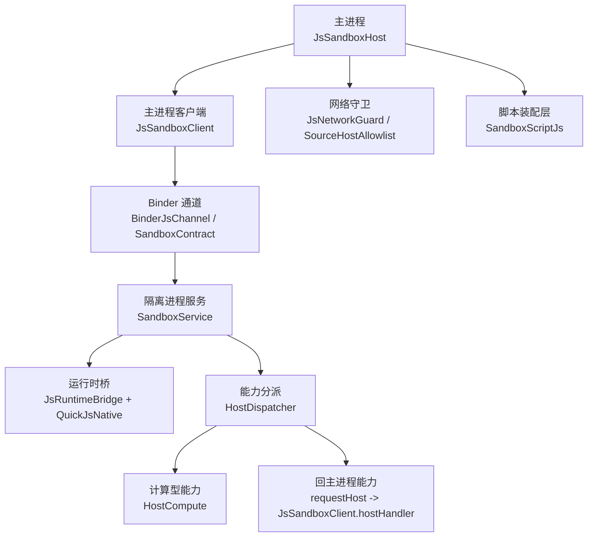
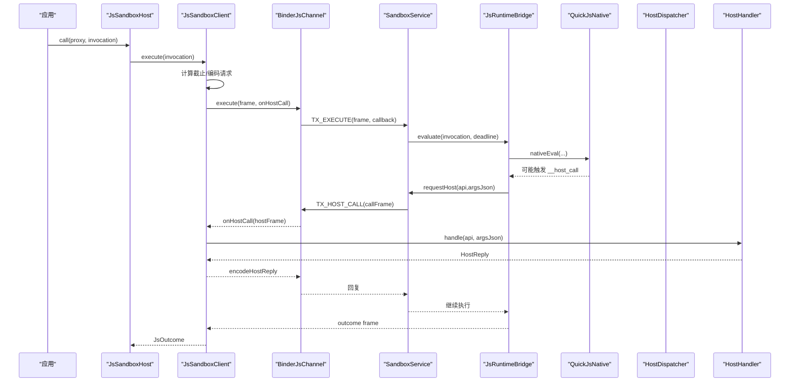
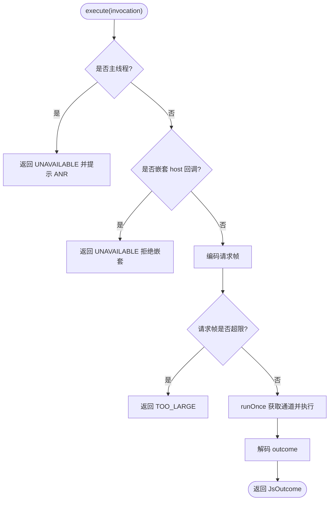
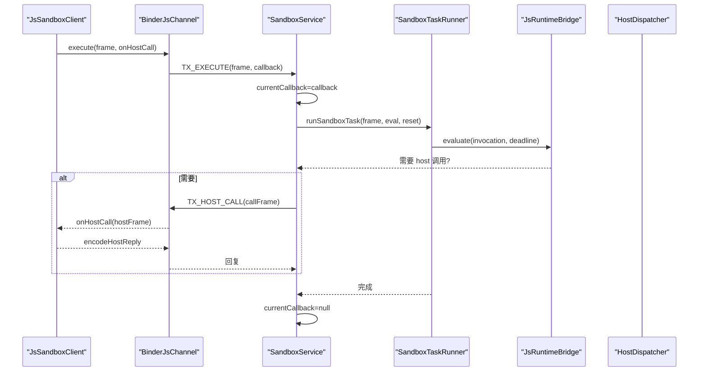
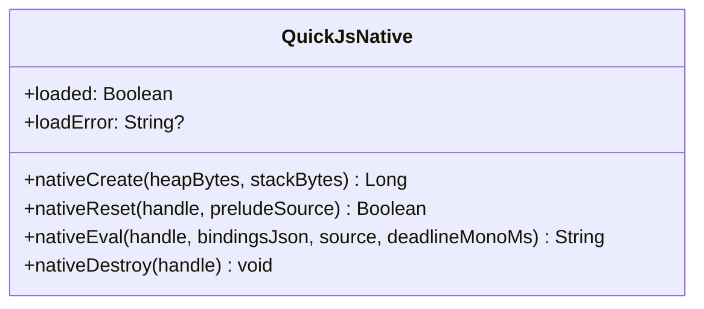
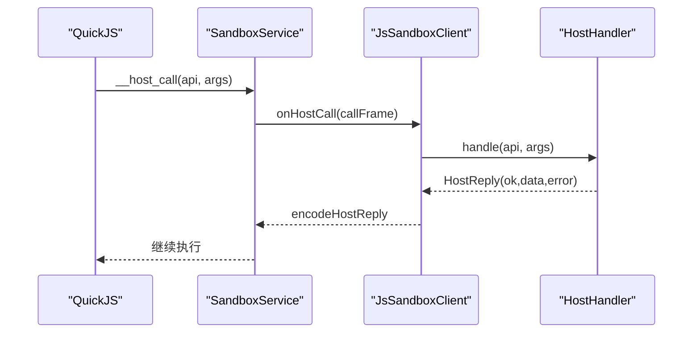
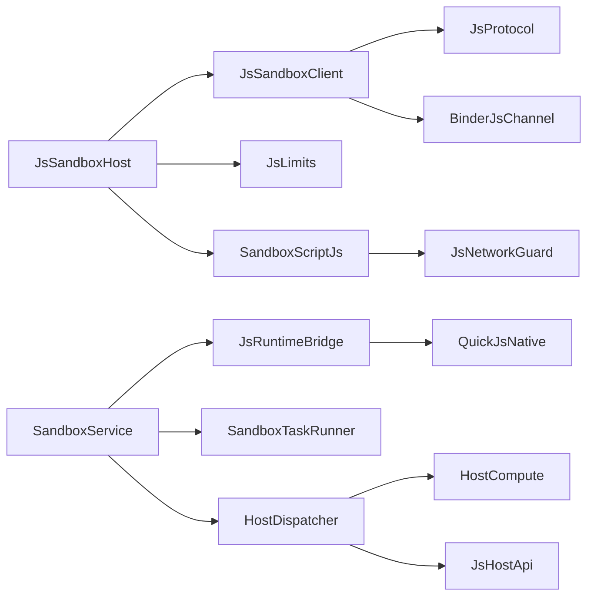

# JavaScript 沙箱执行器

<cite>
**本文引用的文件**   
- [JsSandboxHost.kt](file://lib_book_source/src/main/java/com/ebook/source/sandbox/JsSandboxHost.kt)
- [JsSandboxClient.kt](file://lib_book_source/src/main/java/com/ebook/source/sandbox/JsSandboxClient.kt)
- [QuickJsNative.kt](file://lib_book_source/src/main/java/com/ebook/source/sandbox/QuickJsNative.kt)
- [SandboxProcess.kt](file://lib_book_source/src/main/java/com/ebook/source/sandbox/SandboxProcess.kt)
- [JsLimits.kt](file://lib_book_source/src/main/java/com/ebook/source/sandbox/JsLimits.kt)
- [HostDispatcher.kt](file://lib_book_source/src/main/java/com/ebook/source/sandbox/HostDispatcher.kt)
- [SandboxService.kt](file://lib_book_source/src/main/java/com/ebook/source/sandbox/SandboxService.kt)
- [BinderJsChannel.kt](file://lib_book_source/src/main/java/com/ebook/source/sandbox/BinderJsChannel.kt)
- [JsProtocol.kt](file://lib_book_source/src/main/java/com/ebook/source/sandbox/JsProtocol.kt)
- [JsNetworkGuard.kt](file://lib_book_source/src/main/java/com/ebook/source/sandbox/JsNetworkGuard.kt)
- [SourceHostAllowlist.kt](file://lib_book_source/src/main/java/com/ebook/source/sandbox/SourceHostAllowlist.kt)
- [JsCallbackProxy.kt](file://lib_book_source/src/main/java/com/ebook/source/sandbox/JsCallbackProxy.kt)
- [SandboxContract.kt](file://lib_book_source/src/main/java/com/ebook/source/sandbox/SandboxContract.kt)
- [HostCompute.kt](file://lib_book_source/src/main/java/com/ebook/source/sandbox/HostCompute.kt)
- [SandboxTaskRunner.kt](file://lib_book_source/src/main/java/com/ebook/source/sandbox/SandboxTaskRunner.kt)
- [QuickJsPrelude.kt](file://lib_book_source/src/main/java/com/ebook/source/sandbox/QuickJsPrelude.kt)
- [SandboxScriptJs.kt](file://lib_book_source/src/main/java/com/ebook/source/script/SandboxScriptJs.kt)
- [JsHostApi.kt](file://lib_book_source/src/main/java/com/ebook/source/script/JsHostApi.kt)
- [0028-untrusted-js-sandbox.md](file://docs/adr/0028-untrusted-js-sandbox.md)
</cite>

## 目录
1. [简介](#简介)
2. [项目结构](#项目结构)
3. [核心组件](#核心组件)
4. [架构总览](#架构总览)
5. [详细组件分析](#详细组件分析)
6. [依赖关系分析](#依赖关系分析)
7. [性能与资源限制](#性能与资源限制)
8. [故障排查指南](#故障排查指南)
9. [结论](#结论)

## 简介
本模块实现“:js”沙箱执行器，用于在隔离进程中安全地运行用户提供的脚本以解析书源。整体采用主进程（应用）与隔离进程（`:js`）通过 Binder 通信的双端模型：主进程负责装配、调度、回调路由与宿主能力分发；隔离进程封装 QuickJS 内核、任务边界重置、白名单校验与资源限额控制。该设计将不可信脚本与主进程资源严格隔离，并通过白名单与配额机制降低攻击面。

## 项目结构
围绕沙箱的关键源码集中在 `lib_book_source` 的 `sandbox` 与 `script` 两个包中：
- sandbox：进程与通信抽象、协议编解码、生命周期与资源限制、主机能力桥接、网络守卫等
- script：规则求值上下文、脚本侧 JS 装配层、API 白名单、HTTP/JSON/正则等工具

**图示来源**
- [JsSandboxHost.kt:21-59](file://lib_book_source/src/main/java/com/ebook/source/sandbox/JsSandboxHost.kt#L21-L59)
- [JsSandboxClient.kt:35-185](file://lib_book_source/src/main/java/com/ebook/source/sandbox/JsSandboxClient.kt#L35-L185)
- [SandboxService.kt:27-210](file://lib_book_source/src/main/java/com/ebook/source/sandbox/SandboxService.kt#L27-L210)
- [HostDispatcher.kt:24-74](file://lib_book_source/src/main/java/com/ebook/source/sandbox/HostDispatcher.kt#L24-L74)
- [JsNetworkGuard.kt](file://lib_book_source/src/main/java/com/ebook/source/sandbox/JsNetworkGuard.kt)
- [SourceHostAllowlist.kt](file://lib_book_source/src/main/java/com/ebook/source/sandbox/SourceHostAllowlist.kt)
- [SandboxScriptJs.kt](file://lib_book_source/src/main/java/com/ebook/source/script/SandboxScriptJs.kt)

**章节来源**
- [JsSandboxHost.kt:21-59](file://lib_book_source/src/main/java/com/ebook/source/sandbox/JsSandboxHost.kt#L21-L59)
- [JsSandboxClient.kt:35-185](file://lib_book_source/src/main/java/com/ebook/source/sandbox/JsSandboxClient.kt#L35-L185)
- [SandboxService.kt:27-210](file://lib_book_source/src/main/java/com/ebook/source/sandbox/SandboxService.kt#L27-L210)
- [HostDispatcher.kt:24-74](file://lib_book_source/src/main/java/com/ebook/source/sandbox/HostDispatcher.kt#L24-L74)

## 核心组件
- JsSandboxHost：主进程装配面，统一持有客户端、限流配置与回调路由器，提供 call 与 bridgeFor 两个入口
- JsSandboxClient：主进程执行客户端，负责超时计算、串行化、重连重放、host 回调转发与自伤防护
- SandboxService：隔离进程唯一 Service，处理 execute/ping 事务，维护当前回调通道，协调 HostDispatcher 与运行时
- HostDispatcher：隔离进程能力入口，按白名单分发至计算型或回主进程能力
- QuickJsNative：C++ JNI 影子接口，创建/重置/评估/销毁 runtime
- SandboxTaskRunner：任务边界执行与重置编排
- JsProtocol：主/从进程帧格式编码解码
- JsLimits：集中管理内存、超时、并发与报文上限
- JsNetworkGuard/SourceHostAllowlist：网络访问白名单与私网拦截
- SandboxScriptJs：规则层到沙箱调用的装配层

**章节来源**
- [JsSandboxHost.kt:21-59](file://lib_book_source/src/main/java/com/ebook/source/sandbox/JsSandboxHost.kt#L21-L59)
- [JsSandboxClient.kt:35-185](file://lib_book_source/src/main/java/com/ebook/source/sandbox/JsSandboxClient.kt#L35-L185)
- [SandboxService.kt:27-210](file://lib_book_source/src/main/java/com/ebook/source/sandbox/SandboxService.kt#L27-L210)
- [HostDispatcher.kt:24-74](file://lib_book_source/src/main/java/com/ebook/source/sandbox/HostDispatcher.kt#L24-L74)
- [QuickJsNative.kt:15-59](file://lib_book_source/src/main/java/com/ebook/source/sandbox/QuickJsNative.kt#L15-L59)
- [SandboxTaskRunner.kt](file://lib_book_source/src/main/java/com/ebook/source/sandbox/SandboxTaskRunner.kt)
- [JsProtocol.kt](file://lib_book_source/src/main/java/com/ebook/source/sandbox/JsProtocol.kt)
- [JsLimits.kt:13-58](file://lib_book_source/src/main/java/com/ebook/source/sandbox/JsLimits.kt#L13-L58)
- [JsNetworkGuard.kt](file://lib_book_source/src/main/java/com/ebook/source/sandbox/JsNetworkGuard.kt)
- [SourceHostAllowlist.kt](file://lib_book_source/src/main/java/com/ebook/source/sandbox/SourceHostAllowlist.kt)
- [SandboxScriptJs.kt](file://lib_book_source/src/main/java/com/ebook/source/script/SandboxScriptJs.kt)

## 架构总览
主进程通过 JsSandboxHost 暴露 call/bridgeFor；call 内部用 HostCallbackRouter 绑定任务级代理并调用 JsSandboxClient.execute。客户端计算截止时间、序列化请求帧、串行执行并通过 Binder 发送；隔离进程的 SandboxService 接收请求，交给 JsRuntimeBridge 执行 QuickJS，遇到 host 调用则通过当前回调通道回主进程，由 Client 转交 HostHandler 处理并返回结果。

**图示来源**
- [JsSandboxHost.kt:21-59](file://lib_book_source/src/main/java/com/ebook/source/sandbox/JsSandboxHost.kt#L21-L59)
- [JsSandboxClient.kt:65-185](file://lib_book_source/src/main/java/com/ebook/source/sandbox/JsSandboxClient.kt#L65-L185)
- [SandboxService.kt:83-210](file://lib_book_source/src/main/java/com/ebook/source/sandbox/SandboxService.kt#L83-L210)
- [HostDispatcher.kt:47-74](file://lib_book_source/src/main/java/com/ebook/source/sandbox/HostDispatcher.kt#L47-L74)
- [QuickJsNative.kt:38-58](file://lib_book_source/src/main/java/com/ebook/source/sandbox/QuickJsNative.kt#L38-L58)

## 详细组件分析

### JsSandboxHost：主进程装配与任务路由
- 职责：对外暴露 call 与 bridgeFor；call 通过路由器绑定任务级 HostCallbackProxy，再委托给 JsSandboxClient.execute；bridgeFor 组装规则层可用的 ScriptJsBridge，注入 EvalContext、网络守卫、传输、静态绑定与 Cookie 罐
- 关键点：
  - 构造期不预建连接，首次调用才 bind，便于在无 .so 环境构造
  - baseClient 为纯净客户端，沙箱发起的请求由守门客户端后代发，避免携带用户 token
  - limits/router 作为可替换装配点，保证回调与客户端时序一致

**章节来源**
- [JsSandboxHost.kt:21-59](file://lib_book_source/src/main/java/com/ebook/source/sandbox/JsSandboxHost.kt#L21-L59)

### JsSandboxClient：执行入口、回调路由与自伤防护
- 职责：encode/decode 请求帧、计算单调时钟截止时间、串行化 execute、断连后重放、转发 host 回调、禁止主线程调用与嵌套执行
- 关键点：
  - 使用 inFlight 锁确保同一时刻仅一帧在飞，配合 maxRequestBytes/maxOutcomeBytes 保护 binder 缓冲
  - insideHostCall 用 ThreadLocal 防止嵌套导致死锁
  - afterDisconnect 根据本次是否已转发过 host 回调决定重放策略
  - relay 捕获异常并包装为 ok=false 的 HostReply，避免异常落入 .so 栈导致进程崩溃

**图示来源**
- [JsSandboxClient.kt:65-185](file://lib_book_source/src/main/java/com/ebook/source/sandbox/JsSandboxClient.kt#L65-L185)
- [JsLimits.kt:13-58](file://lib_book_source/src/main/java/com/ebook/source/sandbox/JsLimits.kt#L13-L58)

**章节来源**
- [JsSandboxClient.kt:65-185](file://lib_book_source/src/main/java/com/ebook/source/sandbox/JsSandboxClient.kt#L65-L185)
- [JsLimits.kt:13-58](file://lib_book_source/src/main/java/com/ebook/source/sandbox/JsLimits.kt#L13-L58)

### SandboxService：隔离进程事务与 host 回调中继
- 职责：onTransact 分诊 TX_EXECUTE/TX_PING；维护 currentCallback；编排 SandboxTaskRunner 与 JsRuntimeBridge；安装/清理 HostDispatcher.relay
- 关键点：
  - 先 enforceInterface 与版本检查，再读取数据，防止版本不合时误读字段
  - handleExecute 设置 currentCallback，调用 runSandboxTask 并在 finally 清空
  - requestHost 将 host 调用通过当前回调通道发回主进程，并对响应帧再次做字节上限校验

**图示来源**
- [SandboxService.kt:83-210](file://lib_book_source/src/main/java/com/ebook/source/sandbox/SandboxService.kt#L83-L210)
- [SandboxTaskRunner.kt](file://lib_book_source/src/main/java/com/ebook/source/sandbox/SandboxTaskRunner.kt)
- [JsProtocol.kt](file://lib_book_source/src/main/java/com/ebook/source/sandbox/JsProtocol.kt)

**章节来源**
- [SandboxService.kt:83-210](file://lib_book_source/src/main/java/com/ebook/source/sandbox/SandboxService.kt#L83-L210)

### QuickJsNative 与内核集成：JNI 桥、内存与生命周期
- 职责：声明 nativeCreate/nativeReset/nativeEval/nativeDestroy，封装 .so 加载状态
- 关键点：
  - loaded/loadError 只加载一次，失败时上层直接返回 UNAVAILABLE，不发出 external 调用
  - nativeCreate 设置堆/栈限制、可阻塞开关与中断器
  - nativeReset 每次任务重建 context 并注入 prelude，实现任务边界的强制隔离
  - nativeEval 传入含 BOOTSTRAP 前缀的完整源码、bindings JSON、绝对截止时间

**图示来源**
- [QuickJsNative.kt:15-59](file://lib_book_source/src/main/java/com/ebook/source/sandbox/QuickJsNative.kt#L15-L59)

**章节来源**
- [QuickJsNative.kt:15-59](file://lib_book_source/src/main/java/com/ebook/source/sandbox/QuickJsNative.kt#L15-L59)
- [QuickJsPrelude.kt](file://lib_book_source/src/main/java/com/ebook/source/sandbox/QuickJsPrelude.kt)

### 安全机制：网络限制、权限、白名单与配额
- 网络访问限制：
  - 脚本侧所有外呼必须走守门客户端（GuardedNetwork），由 JsNetworkGuard 与 SourceHostAllowlist 基于源规则导出白名单进行过滤
  - 禁止绕过白名单自建 OkHttpClient，否则将丢失私网拒绝与域名白名单保护
- 文件系统权限：
  - 沙箱进程通过 isIsolatedProcess 判据仅在隔离进程提供服务，非隔离进程拒绝绑定，避免脚本获得私有目录访问
- API 白名单：
  - HostDispatcher 按 JsHostApi.byJsName 匹配能力，未登记的能力一律拒绝；COMPUTE 类就地计算，HOST 类回主进程
- 资源配额：
  - JsLimits 集中定义 wallClockMs、heapBytes、stackBytes、maxRequestBytes、maxOutcomeBytes、maxHostReplyBytes、maxCallbackDepth、bindTimeoutMs、maxRequestsPerTask
  - 客户端与服务端均对请求/响应帧进行字节上限校验，binder 缓冲受限

**章节来源**
- [JsNetworkGuard.kt](file://lib_book_source/src/main/java/com/ebook/source/sandbox/JsNetworkGuard.kt)
- [SourceHostAllowlist.kt](file://lib_book_source/src/main/java/com/ebook/source/sandbox/SourceHostAllowlist.kt)
- [HostDispatcher.kt:24-74](file://lib_book_source/src/main/java/com/ebook/source/sandbox/HostDispatcher.kt#L24-L74)
- [JsLimits.kt:13-58](file://lib_book_source/src/main/java/com/ebook/source/sandbox/JsLimits.kt#L13-L58)
- [SandboxProcess.kt:23-28](file://lib_book_source/src/main/java/com/ebook/source/sandbox/SandboxProcess.kt#L23-L28)

### 宿主函数（HostHandler）模型：Java→JS、异步与错误恢复
- 调用路径：隔离进程通过 HostDispatcher 将 host 调用经回调通道送回主进程，JsSandboxClient.relay 解码后交由 HostHandler.handle 处理
- 异步处理：transport 为 suspend 函数，HostHandler 可在后台线程执行 IO/DB 等操作，完成后将结果编码为 HostReply 返回
- 错误恢复：
  - 任何未预期异常都被捕获并转换为 ok=false 的 HostReply，避免异常进入 .so 栈导致进程崩溃
  - 断连后根据是否已产生副作用决定是否重放，避免重复请求

**图示来源**
- [HostDispatcher.kt:47-74](file://lib_book_source/src/main/java/com/ebook/source/sandbox/HostDispatcher.kt#L47-L74)
- [JsSandboxClient.kt:161-185](file://lib_book_source/src/main/java/com/ebook/source/sandbox/JsSandboxClient.kt#L161-L185)
- [SandboxService.kt:165-209](file://lib_book_source/src/main/java/com/ebook/source/sandbox/SandboxService.kt#L165-L209)

**章节来源**
- [JsSandboxClient.kt:161-185](file://lib_book_source/src/main/java/com/ebook/source/sandbox/JsSandboxClient.kt#L161-L185)
- [HostDispatcher.kt:47-74](file://lib_book_source/src/main/java/com/ebook/source/sandbox/HostDispatcher.kt#L47-L74)
- [SandboxService.kt:165-209](file://lib_book_source/src/main/java/com/ebook/source/sandbox/SandboxService.kt#L165-L209)

### 任务调度与进程通信
- 任务调度：
  - 主进程串行化 execute（inFlight 锁），避免多源并发抢占单 runtime
  - 隔离进程按 binder 线程池并行，但每帧仍受限于客户端串行与报文上限
- 进程通信：
  - 协议由 JsProtocol 定义，包含 execute/ping/hostCall 三类帧
  - 契约通过 SandboxContract 约定 token 与协议版本，服务端先验真再消费
  - 心跳 ping 仅返回 ready 位，不创建 runtime

**章节来源**
- [JsSandboxClient.kt:65-185](file://lib_book_source/src/main/java/com/ebook/source/sandbox/JsSandboxClient.kt#L65-L185)
- [SandboxService.kt:50-115](file://lib_book_source/src/main/java/com/ebook/source/sandbox/SandboxService.kt#L50-L115)
- [SandboxContract.kt](file://lib_book_source/src/main/java/com/ebook/source/sandbox/SandboxContract.kt)
- [JsProtocol.kt](file://lib_book_source/src/main/java/com/ebook/source/sandbox/JsProtocol.kt)

### 配置选项与性能调优建议
- 内存限制：
  - heapBytes：QuickJS 堆上限，适合容纳正文与正则回溯空间
  - stackBytes：栈上限，结合线程剩余栈进行二次收紧，避免 SIGSEGV
  - maxRequestBytes/maxOutcomeBytes/maxHostReplyBytes：binder 缓冲保护，避免 TransactionTooLargeException
- 超时设置：
  - wallClockMs：单次执行挂钟上限，按单调时钟跨进程可比
  - bindTimeoutMs：连接隔离进程的上限，冷启动快速失败
- 并发控制：
  - maxCallbackDepth：防止嵌套回调过深
  - maxRequestsPerTask：单任务网络请求次数上限，防止 while(true) ajax()
- 调优建议：
  - 若频繁出现 TOO_LARGE，优先拆分规则或减少整页绑定体积
  - 若频繁 TIMEOUT，考虑优化规则复杂度或提高 wallClockMs（需权衡用户体验）
  - 在高并发场景下，保持客户端串行锁不变，必要时调整队列与重试策略

**章节来源**
- [JsLimits.kt:13-58](file://lib_book_source/src/main/java/com/ebook/source/sandbox/JsLimits.kt#L13-L58)
- [JsSandboxClient.kt:65-185](file://lib_book_source/src/main/java/com/ebook/source/sandbox/JsSandboxClient.kt#L65-L185)
- [SandboxService.kt:107-115](file://lib_book_source/src/main/java/com/ebook/source/sandbox/SandboxService.kt#L107-L115)

## 依赖关系分析
- 主进程依赖：
  - JsSandboxHost → JsSandboxClient、JsLimits、HostCallbackRouter
  - JsSandboxClient → JsProtocol、HostHandler、BinderJsChannel
  - SandboxScriptJs → JsSandboxHost、JsNetworkGuard、ScriptTransport
- 隔离进程依赖：
  - SandboxService → JsRuntimeBridge、HostDispatcher、SandboxTaskRunner
  - HostDispatcher → HostCompute、JsHostApi
  - QuickJsNative → 原生库 ebook_js

**图示来源**
- [JsSandboxHost.kt:21-59](file://lib_book_source/src/main/java/com/ebook/source/sandbox/JsSandboxHost.kt#L21-L59)
- [JsSandboxClient.kt:35-185](file://lib_book_source/src/main/java/com/ebook/source/sandbox/JsSandboxClient.kt#L35-L185)
- [SandboxService.kt:27-210](file://lib_book_source/src/main/java/com/ebook/source/sandbox/SandboxService.kt#L27-L210)
- [HostDispatcher.kt:24-74](file://lib_book_source/src/main/java/com/ebook/source/sandbox/HostDispatcher.kt#L24-L74)
- [QuickJsNative.kt:15-59](file://lib_book_source/src/main/java/com/ebook/source/sandbox/QuickJsNative.kt#L15-L59)

**章节来源**
- [JsSandboxHost.kt:21-59](file://lib_book_source/src/main/java/com/ebook/source/sandbox/JsSandboxHost.kt#L21-L59)
- [JsSandboxClient.kt:35-185](file://lib_book_source/src/main/java/com/ebook/source/sandbox/JsSandboxClient.kt#L35-L185)
- [SandboxService.kt:27-210](file://lib_book_source/src/main/java/com/ebook/source/sandbox/SandboxService.kt#L27-L210)
- [HostDispatcher.kt:24-74](file://lib_book_source/src/main/java/com/ebook/source/sandbox/HostDispatcher.kt#L24-L74)
- [QuickJsNative.kt:15-59](file://lib_book_source/src/main/java/com/ebook/source/sandbox/QuickJsNative.kt#L15-L59)

## 性能与资源限制
- 串行化与队列：客户端 inFlight 锁确保单 runtime，避免互抢；排队请求共享同一截止时间，超时清晰
- 报文大小：请求/响应/host 回复统一受 900KB 限制，防止 binder 溢出
- 时间基准：使用 SystemClock.elapsedRealtime() 保证跨进程单调可比，避免各进程随机起点导致的超时失效
- 回调深度：maxCallbackDepth 限制嵌套，防止深层递归与死循环
- 网络节流：maxRequestsPerTask 限制单任务请求数，抑制恶意脚本无限请求

[本节为通用指导，无需具体文件引用]

## 故障排查指南
- 常见症状与定位：
  - “主进程没有正在进行的脚本任务”：检查 HostCallbackRouter 装配顺序，确保路由器先于客户端建立
  - “沙箱执行器当前不可用”：查看 JsSandboxClient.unavailable 原因（主线程调用、嵌套执行、断连、通道异常）
  - “沙箱协议版本不合”：核对 SandboxContract.PROTOCOL_VERSION 两侧一致
  - “请求/响应超出字节上限”：检查规则中整页绑定与 host 回复大小
  - “断连且重连失败”：确认 :js 进程可用性与 Binder 通道健康
- 诊断步骤：
  - 检查 QuickJsNative.loaded 与 loadError，确认 .so 加载成功
  - 通过 SandboxService.ping 判断服务就绪
  - 观察日志中的 “host 回调失败/主进程回复解不出来” 等错误信息
  - 验证 SourceHostAllowlist 白名单是否放行目标 host

**章节来源**
- [JsSandboxClient.kt:65-185](file://lib_book_source/src/main/java/com/ebook/source/sandbox/JsSandboxClient.kt#L65-L185)
- [QuickJsNative.kt:15-59](file://lib_book_source/src/main/java/com/ebook/source/sandbox/QuickJsNative.kt#L15-L59)
- [SandboxService.kt:107-115](file://lib_book_source/src/main/java/com/ebook/source/sandbox/SandboxService.kt#L107-L115)
- [SandboxContract.kt](file://lib_book_source/src/main/java/com/ebook/source/sandbox/SandboxContract.kt)
- [SourceHostAllowlist.kt](file://lib_book_source/src/main/java/com/ebook/source/sandbox/SourceHostAllowlist.kt)

## 结论
该沙箱执行器通过主/隔离双进程、Binder 协议、QuickJS 内核与严格的白名单/配额机制，实现了在不信任脚本环境下的高安全性执行。JsSandboxHost 作为装配面统一了客户端、回调路由与规则装配；JsSandboxClient 保障执行安全与可靠性；SandboxService 与 HostDispatcher 完成隔离进程的任务编排与能力分发；QuickJsNative 提供轻量稳定的内核桥接。通过集中化的 JsLimits 与网络守卫，系统可在复杂场景中稳定运行，并提供清晰的故障定位手段与性能调优空间。

[本节为总结性内容，无需具体文件引用]