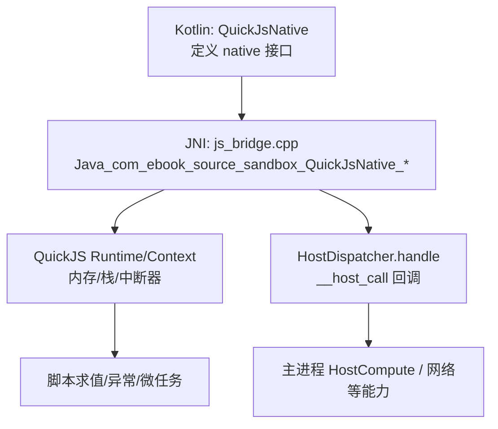
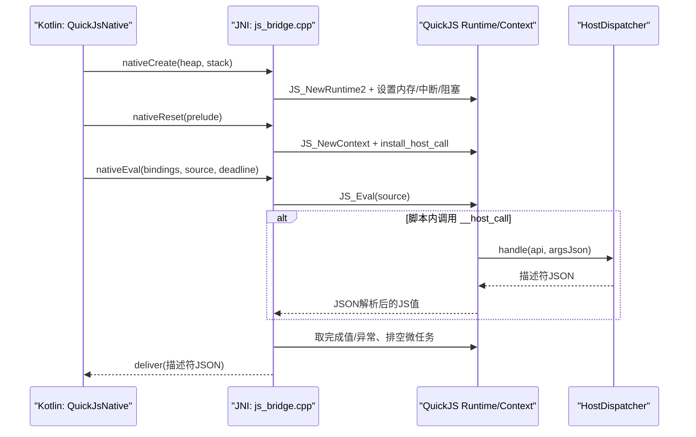
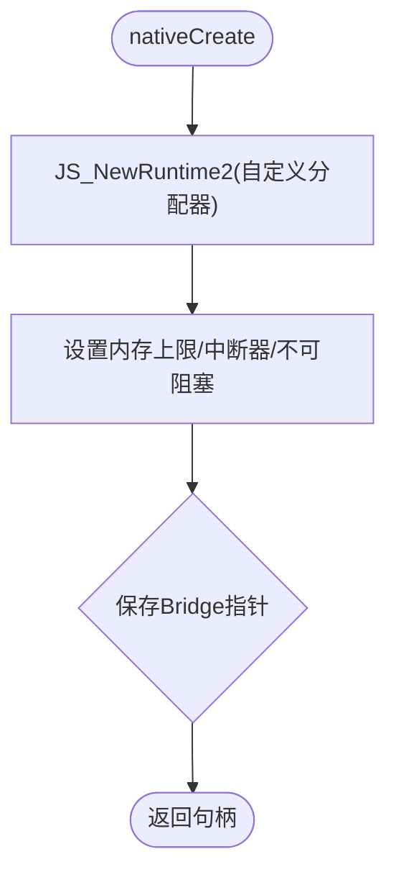
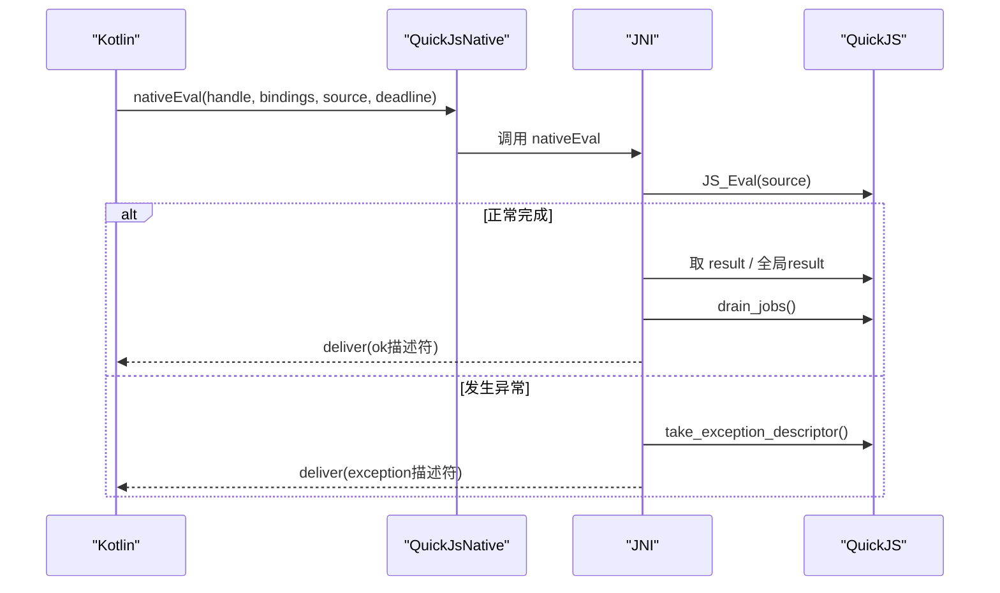
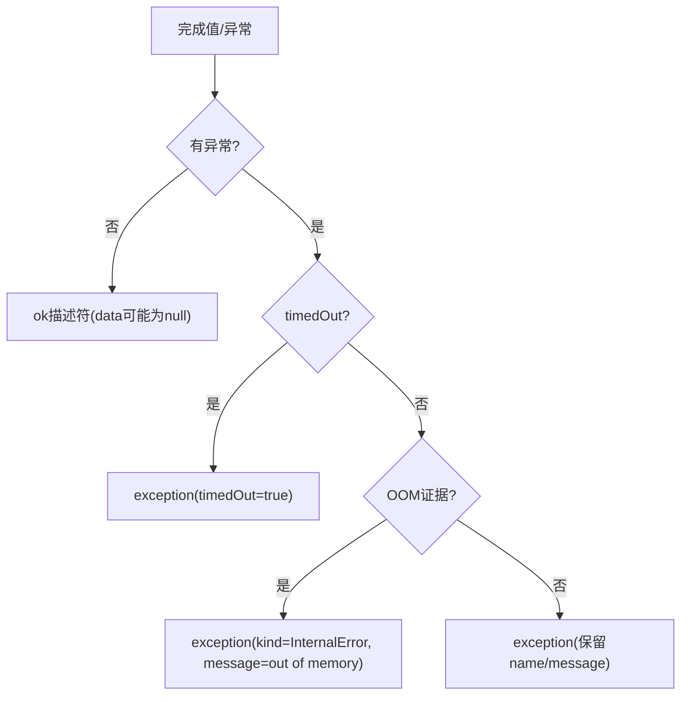
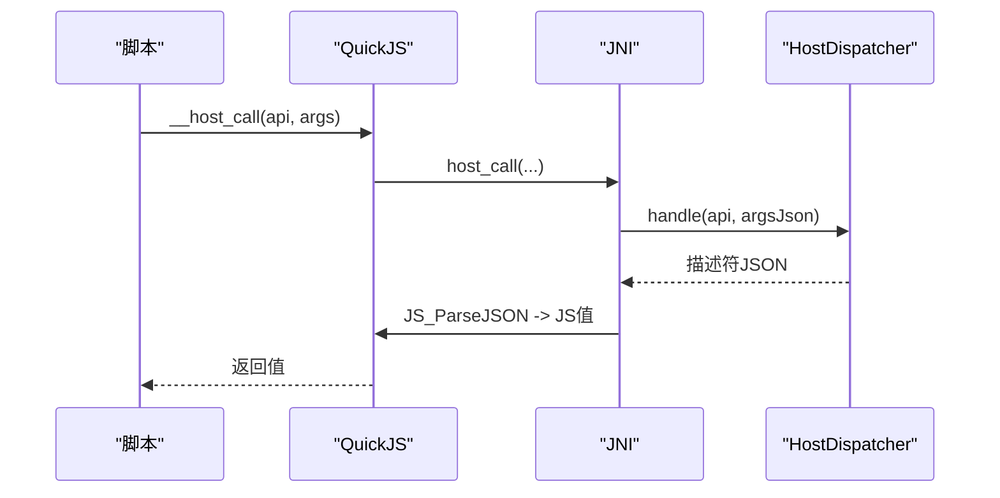
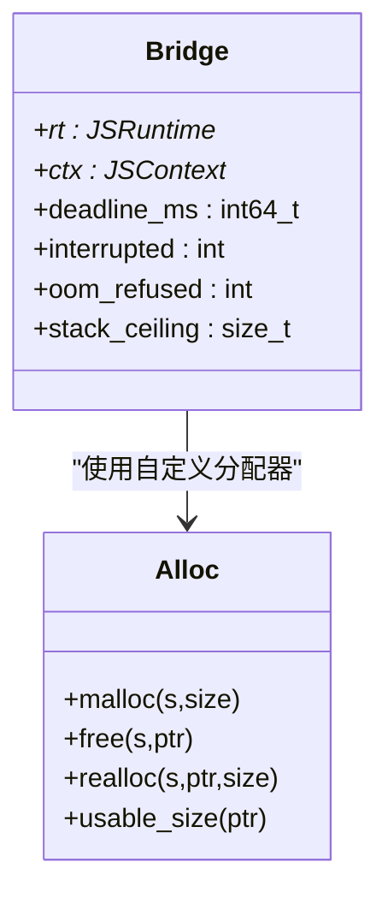
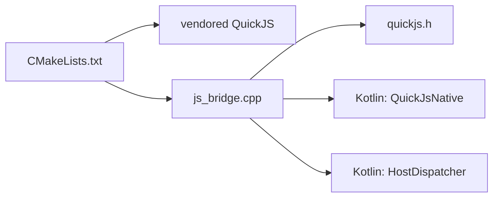

# 原生桥接层

<cite>
**本文引用的文件**
- [js_bridge.cpp](file://lib_book_source/src/main/cpp/bridge/js_bridge.cpp)
- [CMakeLists.txt](file://lib_book_source/src/main/cpp/CMakeLists.txt)
- [QuickJsNative.kt](file://lib_book_source/src/main/java/com/ebook/source/sandbox/QuickJsNative.kt)
- [HostDispatcher.kt](file://lib_book_source/src/main/java/com/ebook/source/sandbox/HostDispatcher.kt)
</cite>

## 目录
1. [简介](#简介)
2. [项目结构](#项目结构)
3. [核心组件](#核心组件)
4. [架构总览](#架构总览)
5. [详细组件分析](#详细组件分析)
6. [依赖关系分析](#依赖关系分析)
7. [性能考量](#性能考量)
8. [故障排查指南](#故障排查指南)
9. [结论](#结论)

## 简介
本章节聚焦“原生桥接层”：以 QuickJS 为脚本内核，通过 C++ JNI 在 Android 沙箱进程中提供受控执行环境。桥接层职责单一且边界清晰：创建并配置 runtime、注入宿主能力、按限制执行脚本、产出统一描述符返回给 Kotlin 层。它不感知白名单、Binder 或规则语法，所有策略与业务逻辑留在 Kotlin 侧，从而降低 .so 变更成本与风险。

## 项目结构
- 原生实现位于 lib_book_source 的 cpp 目录，桥接源为 js_bridge.cpp，构建目标为共享库 ebook_js。
- QuickJS 内核以 vendored 源码形式纳入 third_party/quickjs，由 CMake 静态编译进 ebook_js。
- Kotlin 侧通过 QuickJsNative 声明 native 方法，作为 JNI 契约；HostDispatcher 暴露 __host_call 的 Java 端处理入口。

图表来源
- [js_bridge.cpp:691-820](file://lib_book_source/src/main/cpp/bridge/js_bridge.cpp#L691-L820)
- [QuickJsNative.kt:15-59](file://lib_book_source/src/main/java/com/ebook/source/sandbox/QuickJsNative.kt#L15-L59)
- [HostDispatcher.kt:24-74](file://lib_book_source/src/main/java/com/ebook/source/sandbox/HostDispatcher.kt#L24-L74)

小节来源
- [CMakeLists.txt:1-39](file://lib_book_source/src/main/cpp/CMakeLists.txt#L1-L39)
- [js_bridge.cpp:691-820](file://lib_book_source/src/main/cpp/bridge/js_bridge.cpp#L691-L820)
- [QuickJsNative.kt:15-59](file://lib_book_source/src/main/java/com/ebook/source/sandbox/QuickJsNative.kt#L15-L59)
- [HostDispatcher.kt:24-74](file://lib_book_source/src/main/java/com/ebook/source/sandbox/HostDispatcher.kt#L24-L74)

## 核心组件
- Bridge（运行时上下文）：持有 JSRuntime、JSContext、死线 deadline_ms、中断标志 interrupted、堆限分配标记 oom_refused、线程栈上限 ceiling。
- 自定义分配器：拦截 malloc/realloc/free/usable_size，精确统计用量并在超限处拒绝分配，同时记录本次执行是否发生过被拒分配。
- 栈预算：按当前线程剩余栈动态计算可分配深度，避免 SIGSEGV。
- 中断器：基于单调时钟比较 deadline，阻止长时间运行。
- 值与字符串安全包装：ValueGuard、Utf8Slice、deliver 等确保资源释放与跨语言边界稳定。
- 结果描述符体系：ok/exception/unsupported 三类描述符统一序列化后回传 Kotlin。

小节来源
- [js_bridge.cpp:85-107](file://lib_book_source/src/main/cpp/bridge/js_bridge.cpp#L85-L107)
- [js_bridge.cpp:139-212](file://lib_book_source/src/main/cpp/bridge/js_bridge.cpp#L139-L212)
- [js_bridge.cpp:259-281](file://lib_book_source/src/main/cpp/bridge/js_bridge.cpp#L259-L281)
- [js_bridge.cpp:298-407](file://lib_book_source/src/main/cpp/bridge/js_bridge.cpp#L298-L407)
- [js_bridge.cpp:522-578](file://lib_book_source/src/main/cpp/bridge/js_bridge.cpp#L522-L578)

## 架构总览
从 Kotlin 到 QuickJS 再到 Kotlin 的完整调用链如下：

图表来源
- [js_bridge.cpp:691-820](file://lib_book_source/src/main/cpp/bridge/js_bridge.cpp#L691-L820)
- [HostDispatcher.kt:47-74](file://lib_book_source/src/main/java/com/ebook/source/sandbox/HostDispatcher.kt#L47-L74)

## 详细组件分析

### QuickJS 集成与生命周期管理
- 创建：nativeCreate 使用 JS_NewRuntime2 接入自定义分配器，设置内存上限、禁用阻塞原语、注册中断器与 opaque。
- 重置：nativeReset 销毁旧 context 并重建，安装 __host_call，执行预置垫片 prelude.js（全局冻结能力）。
- 销毁：nativeDestroy 按 context → runtime → Bridge 顺序释放，防止回调访问已释放对象。

图表来源
- [js_bridge.cpp:691-718](file://lib_book_source/src/main/cpp/bridge/js_bridge.cpp#L691-L718)

小节来源
- [js_bridge.cpp:691-718](file://lib_book_source/src/main/cpp/bridge/js_bridge.cpp#L691-L718)
- [js_bridge.cpp:720-751](file://lib_book_source/src/main/cpp/bridge/js_bridge.cpp#L720-L751)
- [js_bridge.cpp:753-762](file://lib_book_source/src/main/cpp/bridge/js_bridge.cpp#L753-L762)

### JNI 接口定义与调用流程
- Kotlin 侧 QuickJsNative 声明 external nativeCreate/nativeReset/nativeEval/nativeDestroy，仅一次 loadLibrary("ebook_js")。
- C++ 侧对应 Java_com_ebook_source_sandbox_QuickJsNative_* 实现。
- nativeEval 将 bindings 解析为 JSON 挂入全局 __bindings，执行 source，收集完成值或异常，排空微任务队列，最终输出描述符 JSON。

图表来源
- [js_bridge.cpp:764-820](file://lib_book_source/src/main/cpp/bridge/js_bridge.cpp#L764-L820)
- [QuickJsNative.kt:51-58](file://lib_book_source/src/main/java/com/ebook/source/sandbox/QuickJsNative.kt#L51-L58)

小节来源
- [QuickJsNative.kt:15-59](file://lib_book_source/src/main/java/com/ebook/source/sandbox/QuickJsNative.kt#L15-L59)
- [js_bridge.cpp:764-820](file://lib_book_source/src/main/cpp/bridge/js_bridge.cpp#L764-L820)

### 数据类型转换机制
- jstring 转 UTF-8：通过 String.getBytes("UTF-8") 获取字节数组，追加结尾 '\0' 供内核使用，避免修改版 UTF-8 导致的代理对乱码问题。
- JS 值转 JSON：使用 JS_JSONStringify，失败时清理异常并返回空串，交由 deliver 兜底。
- 属性读写：统一 put/put_str/read_string_prop 封装，正确处理异常与 cesu8/UTF-8 方向差异。

小节来源
- [js_bridge.cpp:333-383](file://lib_book_source/src/main/cpp/bridge/js_bridge.cpp#L333-L383)
- [js_bridge.cpp:385-464](file://lib_book_source/src/main/cpp/bridge/js_bridge.cpp#L385-L464)

### 错误信息与描述符体系
- 完成态 ok：kind="ok"，data 为 undefined/null 时显式落 null，避免 stringify 丢弃。
- 异常态 exception：kind="exception"，携带 timedOut、errorName、errorMessage。
- 不支持 unsupported：当脚本返回 Promise 或触发内部限制时，返回 unsupported 描述符。
- OOM 兜底：当分配器曾拒绝分配且异常无法表达更多信息时，强制输出 OOM 描述符。

图表来源
- [js_bridge.cpp:409-520](file://lib_book_source/src/main/cpp/bridge/js_bridge.cpp#L409-L520)

小节来源
- [js_bridge.cpp:409-520](file://lib_book_source/src/main/cpp/bridge/js_bridge.cpp#L409-L520)

### Native 方法调用流程（__host_call）
- 脚本侧通过 globalThis.__host_call 发起调用，传入 api 名与参数 JSON。
- C++ 层构造 jstring 参数，调用 HostDispatcher.handle，解析返回值 JSON 为 JS 值并返回。
- Kotlin 侧 HostDispatcher 进行第二次白名单校验，分发至 HostCompute 或回主进程能力。

图表来源
- [js_bridge.cpp:580-651](file://lib_book_source/src/main/cpp/bridge/js_bridge.cpp#L580-L651)
- [HostDispatcher.kt:47-74](file://lib_book_source/src/main/java/com/ebook/source/sandbox/HostDispatcher.kt#L47-L74)

小节来源
- [js_bridge.cpp:580-651](file://lib_book_source/src/main/cpp/bridge/js_bridge.cpp#L580-L651)
- [HostDispatcher.kt:24-74](file://lib_book_source/src/main/java/com/ebook/source/sandbox/HostDispatcher.kt#L24-L74)

### 内存管理机制
- 自定义分配器：bridge_malloc/bridge_free/bridge_realloc/bridge_malloc_usable_size 精确记账，超限即拒绝并标记 oom_refused。
- 栈预算：每次执行前按当前线程剩余栈计算预算，避免深递归导致 SIGSEGV。
- 资源守卫：ValueGuard 保证 JSValue 释放；deliver 缓存兜底字符串避免二次分配失败。
- 生命周期：context 每次任务重建，runtime 常驻；destroy 顺序严格。

图表来源
- [js_bridge.cpp:85-107](file://lib_book_source/src/main/cpp/bridge/js_bridge.cpp#L85-L107)
- [js_bridge.cpp:139-212](file://lib_book_source/src/main/cpp/bridge/js_bridge.cpp#L139-L212)
- [js_bridge.cpp:259-281](file://lib_book_source/src/main/cpp/bridge/js_bridge.cpp#L259-L281)

小节来源
- [js_bridge.cpp:139-212](file://lib_book_source/src/main/cpp/bridge/js_bridge.cpp#L139-L212)
- [js_bridge.cpp:259-281](file://lib_book_source/src/main/cpp/bridge/js_bridge.cpp#L259-L281)
- [js_bridge.cpp:298-313](file://lib_book_source/src/main/cpp/bridge/js_bridge.cpp#L298-L313)
- [js_bridge.cpp:553-578](file://lib_book_source/src/main/cpp/bridge/js_bridge.cpp#L553-L578)
- [js_bridge.cpp:753-762](file://lib_book_source/src/main/cpp/bridge/js_bridge.cpp#L753-L762)

### 复杂对象序列化与微任务处理
- 完成值序列化：to_json 使用 JS_JSONStringify，失败清理异常并回退兜底。
- 微任务队列：drain_jobs 循环执行 pending jobs，限制最大轮数，超过则返回 unsupported。
- thenable 检测：is_thenable 判断是否返回 Promise，拒绝异步等待。

小节来源
- [js_bridge.cpp:359-383](file://lib_book_source/src/main/cpp/bridge/js_bridge.cpp#L359-L383)
- [js_bridge.cpp:522-551](file://lib_book_source/src/main/cpp/bridge/js_bridge.cpp#L522-L551)
- [js_bridge.cpp:800-818](file://lib_book_source/src/main/cpp/bridge/js_bridge.cpp#L800-L818)

## 依赖关系分析
- 构建依赖：CMake 将 quickjs 静态库与桥接源一起编译成 ebook_js，链接 log/dl/m 等系统库。
- 运行时依赖：Android 平台符号（log、pthread 在 bionic 中）、QuickJS 头文件路径。
- Kotlin 依赖：QuickJsNative 声明外部函数，HostDispatcher 提供 __host_call 的 Java 端处理。

图表来源
- [CMakeLists.txt:1-39](file://lib_book_source/src/main/cpp/CMakeLists.txt#L1-L39)
- [js_bridge.cpp:41-47](file://lib_book_source/src/main/cpp/bridge/js_bridge.cpp#L41-L47)
- [QuickJsNative.kt:15-59](file://lib_book_source/src/main/java/com/ebook/source/sandbox/QuickJsNative.kt#L15-L59)
- [HostDispatcher.kt:24-74](file://lib_book_source/src/main/java/com/ebook/source/sandbox/HostDispatcher.kt#L24-L74)

小节来源
- [CMakeLists.txt:1-39](file://lib_book_source/src/main/cpp/CMakeLists.txt#L1-L39)

## 性能考量
- 内存池与分配器：自定义分配器精确记账，避免越界分配，减少无效请求。
- 对象复用：重复使用的全局引用（如 UTF-8 名称）避免频繁分配。
- 批量操作：通过一次 nativeEval 传递 bindings，减少 JNI 往返。
- 微任务限制：MAX_PENDING_JOBS 防止自驱动 Promise 循环耗尽资源。
- 栈预算：按线程实际剩余栈计算，避免崩溃。

[本节为通用性能建议，不直接分析具体文件]

## 故障排查指南
- JNI 崩溃
  - 现象：进程闪退或 NoClassDefFoundError。
  - 排查：确认 ensure_dispatcher 成功加载类与方法；检查 R8 混淆是否保留了 HostDispatcher.handle 签名。
  - 依据：FindClass 必须在应用类加载时刻进行，且方法名必须匹配。

- 内存溢出
  - 现象：脚本执行报 InternalError 或异常信息为空。
  - 排查：关注 oom_refused 标记；检查内存上限与堆分配；查看是否触发了 OOM 兜底描述符。
  - 依据：分配器拒绝分配后，take_exception_descriptor 会优先归类为 OOM。

- 类型不匹配
  - 现象：JSON 解析失败或中文/emoji 乱码。
  - 排查：确认 jstring_to_utf8 使用 "UTF-8" 编码；注意 to_json 与 read_string_prop 的方向差异（cesu8 vs UTF-8）。
  - 依据：修改版 UTF-8 与标准 UTF-8 的差异会导致代理对处理错误。

- 超时与中断
  - 现象：timedOut=true 的异常描述符。
  - 排查：检查 deadline_mono_ms 是否合理；确认 on_interrupt 是否正确比较单调时间。
  - 依据：中断器基于 CLOCK_BOOTTIME 与 deadline 判断。

小节来源
- [js_bridge.cpp:653-687](file://lib_book_source/src/main/cpp/bridge/js_bridge.cpp#L653-L687)
- [js_bridge.cpp:466-520](file://lib_book_source/src/main/cpp/bridge/js_bridge.cpp#L466-L520)
- [js_bridge.cpp:333-383](file://lib_book_source/src/main/cpp/bridge/js_bridge.cpp#L333-L383)
- [js_bridge.cpp:272-281](file://lib_book_source/src/main/cpp/bridge/js_bridge.cpp#L272-L281)

## 结论
原生桥接层以最小化职责、强边界约束的方式集成了 QuickJS，实现了安全的脚本执行环境。通过自定义分配器、栈预算、中断器和统一描述符体系，保障了稳定性与可观测性。Kotlin 侧负责策略与业务逻辑，C++ 侧专注资源控制与执行，两者通过清晰的 JNI 契约协作。建议在后续优化中继续强化内存监控、微任务限额与错误分类，以提升鲁棒性与可维护性。