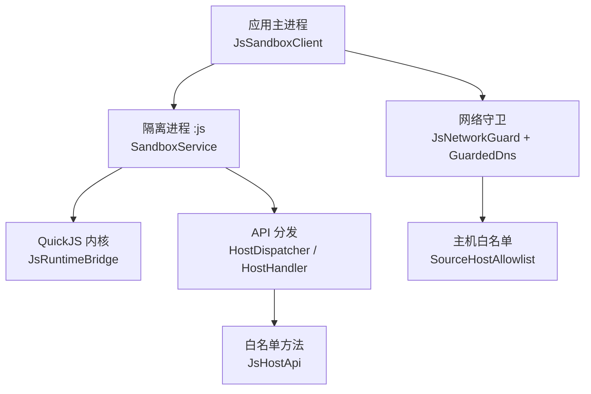
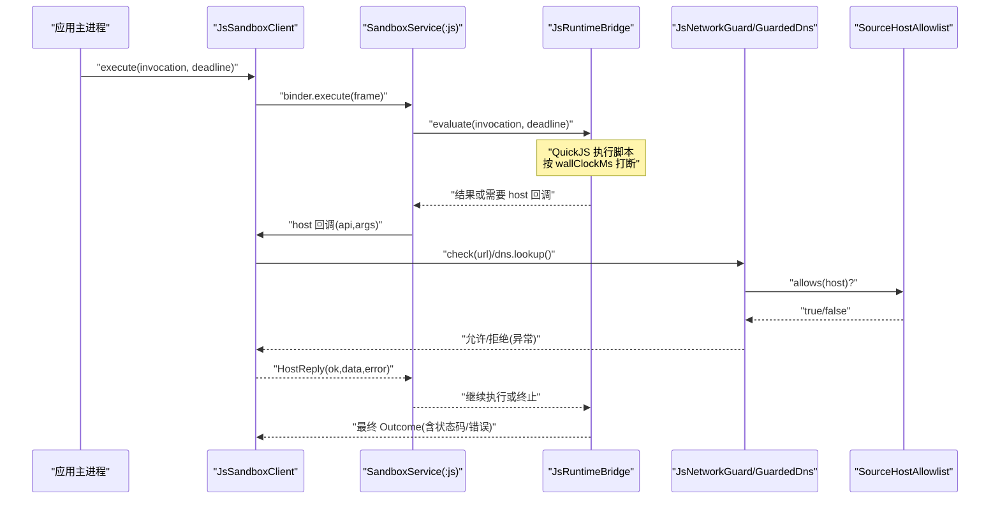
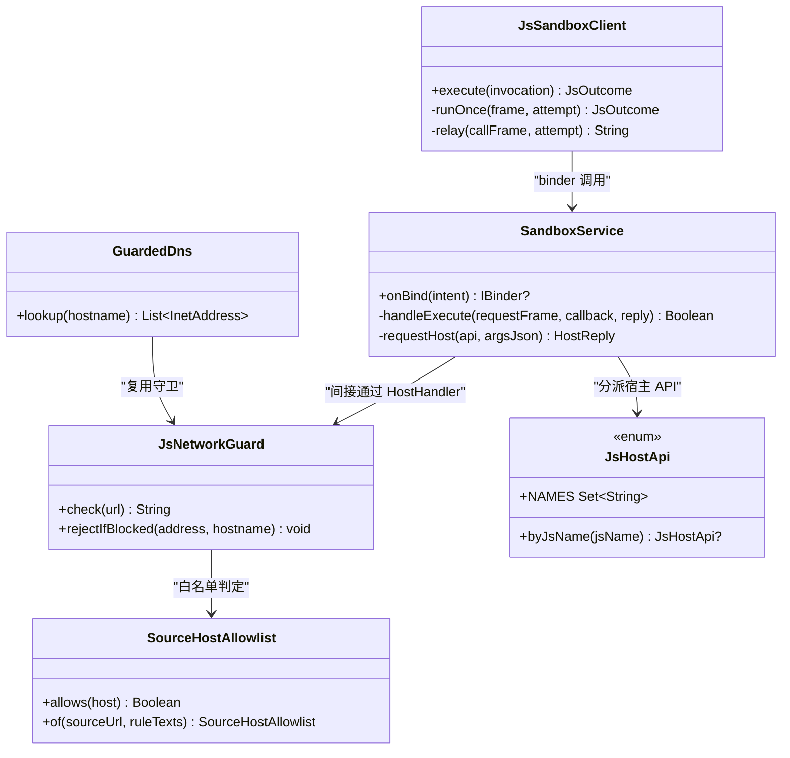

# 安全隔离机制

<cite>
**本文引用的文件**
- [JsLimits.kt](file://lib_book_source/src/main/java/com/ebook/source/sandbox/JsLimits.kt)
- [JsNetworkGuard.kt](file://lib_book_source/src/main/java/com/ebook/source/sandbox/JsNetworkGuard.kt)
- [SourceHostAllowlist.kt](file://lib_book_source/src/main/java/com/ebook/source/sandbox/SourceHostAllowlist.kt)
- [JsHostApi.kt](file://lib_book_source/src/main/java/com/ebook/source/script/JsHostApi.kt)
- [SandboxProcess.kt](file://lib_book_source/src/main/java/com/ebook/source/sandbox/SandboxProcess.kt)
- [SandboxService.kt](file://lib_book_source/src/main/java/com/ebook/source/sandbox/SandboxService.kt)
- [JsSandboxClient.kt](file://lib_book_source/src/main/java/com/ebook/source/sandbox/JsSandboxClient.kt)
- [JsNetworkGuardTest.kt](file://lib_book_source/src/test/java/com/ebook/source/sandbox/JsNetworkGuardTest.kt)
</cite>

## 目录
1. [简介](#简介)
2. [项目结构](#项目结构)
3. [核心组件](#核心组件)
4. [架构总览](#架构总览)
5. [详细组件分析](#详细组件分析)
6. [依赖关系分析](#依赖关系分析)
7. [性能与资源特性](#性能与资源特性)
8. [故障排查指南](#故障排查指南)
9. [结论](#结论)
10. [附录：配置调优与安全日志](#附录：配置调优与安全日志)

## 简介
本技术文档聚焦于“书源脚本”的安全执行环境。该环境通过进程级隔离、内存/栈限制、严格的网络准入控制与 API 白名单，将不受信任的脚本限制在最小可执行能力内。重点覆盖以下方面：
- 沙箱进程的隔离策略（进程级隔离、内存/栈限制、跨进程通信边界）
- JsLimits 的资源限制（CPU 时间、堆/栈、请求次数、报文大小等）
- GuardedNetwork / JsNetworkGuard 的网络安全控制（主机白名单、私网地址拒绝、DNS 重绑定防护）
- API 白名单（JsHostApi）与方法调用约束（参数校验、返回值过滤）
- 安全配置的调优建议与违规行为检测方法（资源耗尽检测、恶意脚本识别、安全日志记录）

## 项目结构
安全相关代码集中在 lib_book_source 模块的沙箱与脚本子包中：
- 沙箱执行器与宿主桥接：JsSandboxClient、SandboxService、SandboxProcess、JsLimits、JsNetworkGuard、SourceHostAllowlist
- 脚本 API 白名单与规则求值：JsHostApi 以及脚本侧工具链（不在本文展开）

图表来源
- [JsSandboxClient.kt:35-99](file://lib_book_source/src/main/java/com/ebook/source/sandbox/JsSandboxClient.kt#L35-L99)
- [SandboxService.kt:27-153](file://lib_book_source/src/main/java/com/ebook/source/sandbox/SandboxService.kt#L27-L153)
- [JsNetworkGuard.kt:25-99](file://lib_book_source/src/main/java/com/ebook/source/sandbox/JsNetworkGuard.kt#L25-L99)
- [SourceHostAllowlist.kt:20-74](file://lib_book_source/src/main/java/com/ebook/source/sandbox/SourceHostAllowlist.kt#L20-L74)
- [JsHostApi.kt:17-111](file://lib_book_source/src/main/java/com/ebook/source/script/JsHostApi.kt#L17-L111)

章节来源
- [JsSandboxClient.kt:35-99](file://lib_book_source/src/main/java/com/ebook/source/sandbox/JsSandboxClient.kt#L35-L99)
- [SandboxService.kt:27-153](file://lib_book_source/src/main/java/com/ebook/source/sandbox/SandboxService.kt#L27-L153)
- [JsNetworkGuard.kt:25-99](file://lib_book_source/src/main/java/com/ebook/source/sandbox/JsNetworkGuard.kt#L25-L99)
- [SourceHostAllowlist.kt:20-74](file://lib_book_source/src/main/java/com/ebook/source/sandbox/SourceHostAllowlist.kt#L20-L74)
- [JsHostApi.kt:17-111](file://lib_book_source/src/main/java/com/ebook/source/script/JsHostApi.kt#L17-L111)

## 核心组件
- 资源限制 JsLimits：集中定义 CPU 时间、堆/栈、请求次数、报文大小、绑定超时等上限，是沙箱限流的唯一事实源。
- 网络守卫 JsNetworkGuard 与 GuardedDns：负责 URL 字符串层校验与 DNS 解析后的地址判定，拒绝私网/保留地址，防止 DNS 重绑。
- 主机白名单 SourceHostAllowlist：从源规则文本与源自身 URL 导出可访问 host 集合，默认严格不放行子域。
- API 白名单 JsHostApi：枚举所有对脚本可见的方法名、目标类型与参数数量范围；表外方法不存在于全局对象。
- 进程隔离 SandboxProcess：判断当前是否处于隔离进程，确保沙箱服务只在不具备额外权限的进程中运行。
- 执行客户端与服务端 JsSandboxClient / SandboxService：封装跨进程执行、重放策略、回调中继与帧尺寸限制。

章节来源
- [JsLimits.kt:13-58](file://lib_book_source/src/main/java/com/ebook/source/sandbox/JsLimits.kt#L13-L58)
- [JsNetworkGuard.kt:25-99](file://lib_book_source/src/main/java/com/ebook/source/sandbox/JsNetworkGuard.kt#L25-L99)
- [SourceHostAllowlist.kt:20-74](file://lib_book_source/src/main/java/com/ebook/source/sandbox/SourceHostAllowlist.kt#L20-L74)
- [JsHostApi.kt:17-111](file://lib_book_source/src/main/java/com/ebook/source/script/JsHostApi.kt#L17-L111)
- [SandboxProcess.kt:23-28](file://lib_book_source/src/main/java/com/ebook/source/sandbox/SandboxProcess.kt#L23-L28)
- [JsSandboxClient.kt:35-99](file://lib_book_source/src/main/java/com/ebook/source/sandbox/JsSandboxClient.kt#L35-L99)
- [SandboxService.kt:27-153](file://lib_book_source/src/main/java/com/ebook/source/sandbox/SandboxService.kt#L27-L153)

## 架构总览
沙箱执行由主进程发起，经 binder 进入隔离进程 :js，由 QuickJS 内核执行脚本。脚本的网络与宿主能力全部经由受限通道与白名单方法，禁止直接访问系统 API。网络请求必须经过 JsNetworkGuard 的 URL 校验与 GuardedDns 的地址拦截。

图表来源
- [JsSandboxClient.kt:65-143](file://lib_book_source/src/main/java/com/ebook/source/sandbox/JsSandboxClient.kt#L65-L143)
- [SandboxService.kt:83-123](file://lib_book_source/src/main/java/com/ebook/source/sandbox/SandboxService.kt#L83-L123)
- [JsNetworkGuard.kt:35-99](file://lib_book_source/src/main/java/com/ebook/source/sandbox/JsNetworkGuard.kt#L35-L99)
- [SourceHostAllowlist.kt:46-74](file://lib_book_source/src/main/java/com/ebook/source/sandbox/SourceHostAllowlist.kt#L46-L74)

## 详细组件分析

### 进程级隔离与跨进程边界
- 隔离进程判定：仅当 manifest 声明 isolatedProcess 且运行时为隔离进程时，才提供 binder 通道；否则返回 null，使连接失败并降级为不可用。
- 服务端入口：SandboxService.onTransact 验证接口标识与协议版本，仅处理 execute/ping，其余不处理。
- 回调中继：脚本侧通过 HostDispatcher 将 host 调用转发到主进程；主进程 JsSandboxClient.relay 解码并路由到 HostHandler，再将结果编码回传。
- 线程模型：binder 线程池承载回调；客户端串行化 execute 保证同一时刻仅一帧在飞，避免 Binder 事务缓冲被并发撑爆。

章节来源
- [SandboxProcess.kt:23-28](file://lib_book_source/src/main/java/com/ebook/source/sandbox/SandboxProcess.kt#L23-L28)
- [SandboxService.kt:50-80](file://lib_book_source/src/main/java/com/ebook/source/sandbox/SandboxService.kt#L50-L80)
- [SandboxService.kt:147-153](file://lib_book_source/src/main/java/com/ebook/source/sandbox/SandboxService.kt#L147-L153)
- [JsSandboxClient.kt:161-181](file://lib_book_source/src/main/java/com/ebook/source/sandbox/JsSandboxClient.kt#L161-L181)

### 内存与栈限制（JsLimits）
- heapBytes：QuickJS 堆上限，防指数分配型攻击。
- stackBytes：JS 栈上限作为天花板；桥接层在执行前结合当前线程剩余栈进一步收紧，避免深递归导致 native 栈溢出。
- maxCallbackDepth：回调重入深度上限，防止规则套规则导致的栈爆炸。
- bindTimeoutMs：等待 :js 进程连接的上限，冷启动失败应尽快报不可用。

章节来源
- [JsLimits.kt:13-58](file://lib_book_source/src/main/java/com/ebook/source/sandbox/JsLimits.kt#L13-L58)

### CPU 时间限制（wallClockMs）
- 单次执行挂钟上限用于打断长期运行任务，避免死循环。
- 客户端计算截止日期并使用单调时钟 SystemClock.elapsedRealtime，跨进程可比；服务端使用相同时钟基准进行超时判断。

章节来源
- [JsSandboxClient.kt:21-24](file://lib_book_source/src/main/java/com/ebook/source/sandbox/JsSandboxClient.kt#L21-L24)
- [JsSandboxClient.kt:65-75](file://lib_book_source/src/main/java/com/ebook/source/sandbox/JsSandboxClient.kt#L65-L75)
- [JsLimits.kt:13-16](file://lib_book_source/src/main/java/com/ebook/source/sandbox/JsLimits.kt#L13-L16)

### 网络请求限制（maxRequestsPerTask）
- 单任务网络代理请求次数上限由持有 JsLimits.maxRequestsPerTask 的任务上下文计数；守门器不持计数器，避免重复计数。
- 超出阈值视为滥用（如 while(true) ajax），将被拒绝。

章节来源
- [JsLimits.kt:52-57](file://lib_book_source/src/main/java/com/ebook/source/sandbox/JsLimits.kt#L52-L57)

### 文件大小限制（maxRequestBytes、maxOutcomeBytes、maxHostReplyBytes）
- maxRequestBytes：请求帧（URL+请求头等）上限，受 Binder 事务缓冲约束；超限直接拒绝并上报 TOO_LARGE。
- maxOutcomeBytes：响应帧上限，避免整页 HTML 过大占用进程间缓冲。
- maxHostReplyBytes：host 回调回复（整页内容）上限，防止主进程回包过大。

章节来源
- [JsLimits.kt:27-42](file://lib_book_source/src/main/java/com/ebook/source/sandbox/JsLimits.kt#L27-L42)
- [JsSandboxClient.kt:75-79](file://lib_book_source/src/main/java/com/ebook/source/sandbox/JsSandboxClient.kt#L75-L79)
- [SandboxService.kt:165-205](file://lib_book_source/src/main/java/com/ebook/source/sandbox/SandboxService.kt#L165-L205)

### 网络安全控制（JsNetworkGuard 与 GuardedDns）
- URL 字符串层检查：
  - 长度限制，拒绝过长 URL。
  - 仅允许 http(s) 协议，拒绝 file/data/jar/gopher/javascript 等。
  - 禁止相对地址与缺协议地址。
  - 禁止在 URL 中内嵌凭证，拒绝空 host 与含非法字符的授权段。
  - host 归一化后与白名单比对，不在白名单则拒绝。
- DNS 解析后地址判定：
  - GuardedDns 挂载到 OkHttp 的 Dns 实现，每次 lookup 都重新判定，无缓存。
  - AddressPolicy 以字节级判据拒绝内网/保留/多播/广播/云元数据等地址族，兼容 IPv4/IPv6 及映射形态。
  - 多 A 记录中只要有一个被拒即整体拒绝，避免挑选到内网地址。
- DNS 重绑定防护：
  - 检查与使用同址，仅在真正连接时的解析结果上做判定，杜绝 TTL=0 的重绑绕过。

章节来源
- [JsNetworkGuard.kt:25-99](file://lib_book_source/src/main/java/com/ebook/source/sandbox/JsNetworkGuard.kt#L25-L99)
- [JsNetworkGuard.kt:101-167](file://lib_book_source/src/main/java/com/ebook/source/sandbox/JsNetworkGuard.kt#L101-L167)
- [JsNetworkGuardTest.kt:41-99](file://lib_book_source/src/test/java/com/ebook/source/sandbox/JsNetworkGuardTest.kt#L41-L99)
- [JsNetworkGuardTest.kt:102-179](file://lib_book_source/src/test/java/com/ebook/source/sandbox/JsNetworkGuardTest.kt#L102-L179)
- [JsNetworkGuardTest.kt:181-297](file://lib_book_source/src/test/java/com/ebook/source/sandbox/JsNetworkGuardTest.kt#L181-L297)
- [JsNetworkGuardTest.kt:299-341](file://lib_book_source/src/test/java/com/ebook/source/sandbox/JsNetworkGuardTest.kt#L299-L341)

### API 白名单机制（JsHostApi）
- deny-by-default：只有 JsHostApi 枚举中的名称对脚本可见；表外方法在全局对象上不存在。
- 参数校验：minArgs/maxArgs 由 JS 垫片就地校验，避免参数不匹配走入“看似正常失败”的路径。
- 目标分类：
  - COMPUTE：纯计算类（摘要、编码、加解密、时间、随机等），在沙箱进程本地计算，不经主进程。
  - HOST：需主进程协助的能力（ajax/post/load/responseCode/变量/页面改写/cookie/日志等）。
- 返回值过滤：主进程侧对 host 回复进行大小限制，超限直接拒绝并回退为失败。

章节来源
- [JsHostApi.kt:1-114](file://lib_book_source/src/main/java/com/ebook/source/script/JsHostApi.kt#L1-L114)
- [JsSandboxClient.kt:161-181](file://lib_book_source/src/main/java/com/ebook/source/sandbox/JsSandboxClient.kt#L161-L181)

### 主机白名单（SourceHostAllowlist）
- 白名单来源：从源自身 URL 与规则文本中提取绝对 URL 的授权段，归一化为小写、去端口、去尾点、剥离 IPv6 方括号与 zone id。
- 默认严格：不放行子域，减少域名后缀泛化的风险。
- 归一化失败或非法 host 一律拒绝。

章节来源
- [SourceHostAllowlist.kt:5-74](file://lib_book_source/src/main/java/com/ebook/source/sandbox/SourceHostAllowlist.kt#L5-L74)

## 依赖关系分析
- JsSandboxClient 依赖 JsLimits（资源上限）、JsProtocol（编解码）、HostHandler（主进程回调处理）。
- SandboxService 依赖 JsRuntimeBridge（执行器）、HostDispatcher（host 回调分发）、JsLimits（服务端侧上限）。
- JsNetworkGuard 依赖 SourceHostAllowlist（白名单）与 AddressPolicy（地址判定）。
- JsHostApi 作为白名单枚举被 HostDispatcher/HostHandler 消费。

图表来源
- [JsSandboxClient.kt:35-181](file://lib_book_source/src/main/java/com/ebook/source/sandbox/JsSandboxClient.kt#L35-L181)
- [SandboxService.kt:27-209](file://lib_book_source/src/main/java/com/ebook/source/sandbox/SandboxService.kt#L27-L209)
- [JsNetworkGuard.kt:25-99](file://lib_book_source/src/main/java/com/ebook/source/sandbox/JsNetworkGuard.kt#L25-L99)
- [SourceHostAllowlist.kt:20-74](file://lib_book_source/src/main/java/com/ebook/source/sandbox/SourceHostAllowlist.kt#L20-L74)
- [JsHostApi.kt:17-111](file://lib_book_source/src/main/java/com/ebook/source/script/JsHostApi.kt#L17-L111)

## 性能与资源特性
- 串行执行：JsSandboxClient.inFlight 锁保证同一时刻仅一帧在飞，避免 Binder 事务缓冲竞争；排队请求共享同一截止日期，超时即报 TIMEOUT。
- 单调时钟：使用 SystemClock.elapsedRealtime 做截止期，跨进程一致，避免 nanoTime 的进程差异。
- 栈保护：stackBytes 作为天花板，桥接层结合线程剩余栈动态收紧，降低 SIGSEGV 风险。
- 报文限制：maxRequestBytes/maxOutcomeBytes/maxHostReplyBytes 基于 Binder 事务缓冲约 1 MB 的现实，留出余量并提前拒绝超限帧。
- DNS 无缓存：GuardedDns 每次 lookup 均重判，避免 TTL=0 的重绑绕过。

章节来源
- [JsSandboxClient.kt:21-33](file://lib_book_source/src/main/java/com/ebook/source/sandbox/JsSandboxClient.kt#L21-L33)
- [JsLimits.kt:13-42](file://lib_book_source/src/main/java/com/ebook/source/sandbox/JsLimits.kt#L13-L42)
- [JsNetworkGuard.kt:73-99](file://lib_book_source/src/main/java/com/ebook/source/sandbox/JsNetworkGuard.kt#L73-L99)

## 故障排查指南
- 沙箱不可用：
  - 检查隔离进程绑定：SandboxService.onBind 在非隔离进程返回 null，导致连接失败。
  - 协议版本不合：SandboxService.handleContractCall 会返回 UNAVAILABLE。
  - 断连重放：JsSandboxClient.afterDisconnect 在未转发过 host 回调时可重放一次；若已转发副作用则停止重放。
- 网络被拒：
  - URL 字符串层：协议非 http(s)、相对地址、超长 URL、非法字符、内嵌凭证、host 为空或不在白名单。
  - DNS 解析后：地址属于内网/保留/多播/广播/云元数据；多 A 记录任一被拒则整体拒绝。
  - DNS 重绑：每次 lookup 均重新判定，无缓存；TTL=0 的第二解析出内网同样被拒。
- 资源超限：
  - 请求/响应帧过大：TOO_LARGE 或 host 回复超限。
  - 回调重入过深：超过 maxCallbackDepth 立即失败。
  - 单任务请求过多：超过 maxRequestsPerTask 视为滥用。

章节来源
- [SandboxService.kt:63-80](file://lib_book_source/src/main/java/com/ebook/source/sandbox/SandboxService.kt#L63-L80)
- [SandboxService.kt:147-153](file://lib_book_source/src/main/java/com/ebook/source/sandbox/SandboxService.kt#L147-L153)
- [JsSandboxClient.kt:116-135](file://lib_book_source/src/main/java/com/ebook/source/sandbox/JsSandboxClient.kt#L116-L135)
- [JsNetworkGuard.kt:35-99](file://lib_book_source/src/main/java/com/ebook/source/sandbox/JsNetworkGuard.kt#L35-L99)
- [JsNetworkGuard.kt:101-167](file://lib_book_source/src/main/java/com/ebook/source/sandbox/JsNetworkGuard.kt#L101-L167)
- [JsLimits.kt:27-57](file://lib_book_source/src/main/java/com/ebook/source/sandbox/JsLimits.kt#L27-L57)

## 结论
本项目的安全隔离机制通过多层防线保障不受信任脚本的安全执行：进程级隔离确保最小权限；JsLimits 提供 CPU/内存/网络/报文等维度的硬上限；JsNetworkGuard 与 GuardedDns 以字符串与地址双重校验阻断私网访问与 DNS 重绑；JsHostApi 白名单将脚本能力收敛到可控集合。配合严格的测试用例，这些边界可在开发与集成阶段被充分验证。

## 附录：配置调优与安全日志
- 配置调优建议
  - 根据真实源的失败率调整 JsLimits 各项上限：正文页 HTML 较大时应优先关注 maxRequestBytes/maxOutcomeBytes；正则回溯复杂时需关注 heapBytes/stackBytes。
  - 合理设置 maxRequestsPerTask：聚合搜索场景可能较多，但明显高于语料分布的数值往往对应恶意脚本。
  - 谨慎放宽白名单：默认严格不放行子域；新增 host 需评估风险并记录原因。
- 违规检测与告警
  - 资源耗尽检测：关注 TOO_LARGE、UNAVAILABLE、TIMEOUT 等状态码与错误信息；统计各任务的请求次数与回调深度。
  - 恶意脚本识别：频繁触发 URL 长度超限、协议拒绝、host 不在白名单、多次 DNS 重绑尝试等行为，可作为高风险信号。
  - 安全日志记录：所有拒绝与异常均应包含关键上下文（URL 前缀、host、地址、错误码），便于审计与调校。

章节来源
- [JsLimits.kt:13-58](file://lib_book_source/src/main/java/com/ebook/source/sandbox/JsLimits.kt#L13-L58)
- [JsNetworkGuard.kt:35-69](file://lib_book_source/src/main/java/com/ebook/source/sandbox/JsNetworkGuard.kt#L35-L69)
- [JsSandboxClient.kt:75-79](file://lib_book_source/src/main/java/com/ebook/source/sandbox/JsSandboxClient.kt#L75-L79)
- [SandboxService.kt:165-205](file://lib_book_source/src/main/java/com/ebook/source/sandbox/SandboxService.kt#L165-L205)
- [JsNetworkGuardTest.kt:41-99](file://lib_book_source/src/test/java/com/ebook/source/sandbox/JsNetworkGuardTest.kt#L41-L99)