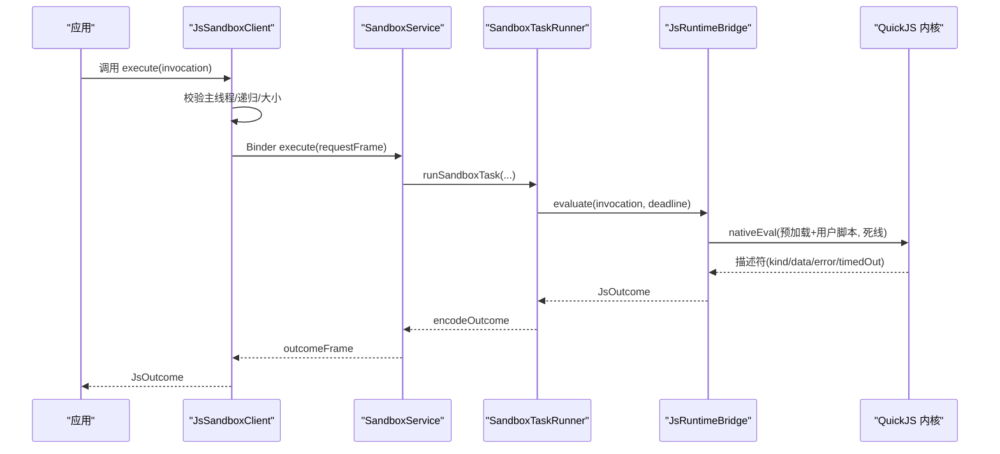
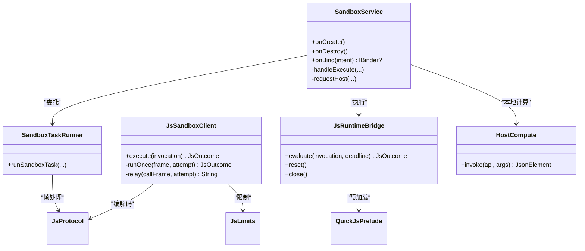

# 脚本执行环境

<cite>
**本文引用的文件**
- [QuickJsPrelude.kt](file://lib_book_source/src/main/java/com/ebook/source/sandbox/QuickJsPrelude.kt)
- [SandboxProcess.kt](file://lib_book_source/src/main/java/com/ebook/source/sandbox/SandboxProcess.kt)
- [SandboxService.kt](file://lib_book_source/src/main/java/com/ebook/source/sandbox/SandboxService.kt)
- [SandboxTaskRunner.kt](file://lib_book_source/src/main/java/com/ebook/source/sandbox/SandboxTaskRunner.kt)
- [HostCompute.kt](file://lib_book_source/src/main/java/com/ebook/source/sandbox/HostCompute.kt)
- [JsLimits.kt](file://lib_book_source/src/main/java/com/ebook/source/sandbox/JsLimits.kt)
- [JsProtocol.kt](file://lib_book_source/src/main/java/com/ebook/source/sandbox/JsProtocol.kt)
- [JsRuntimeBridge.kt](file://lib_book_source/src/main/java/com/ebook/source/sandbox/JsRuntimeBridge.kt)
- [JsSandboxClient.kt](file://lib_book_source/src/main/java/com/ebook/source/sandbox/JsSandboxClient.kt)
</cite>

## 目录
1. [简介](#简介)
2. [项目结构](#项目结构)
3. [核心组件](#核心组件)
4. [架构总览](#架构总览)
5. [详细组件分析](#详细组件分析)
6. [依赖关系分析](#依赖关系分析)
7. [性能考量](#性能考量)
8. [故障排查指南](#故障排查指南)
9. [结论](#结论)
10. [附录：配置与监控](#附录：配置与监控)

## 简介
本文件面向“脚本执行环境”的技术文档，聚焦于以 QuickJS 为核心的沙箱执行器实现。内容覆盖：
- QuickJS 执行环境初始化：预加载脚本、全局对象注入、宿主函数绑定
- SandboxProcess 进程隔离管理：隔离进程启动、生命周期、资源清理
- SandboxTaskRunner 任务调度：任务队列、并发控制、超时处理
- HostCompute 计算能力：纯计算执行、算法库暴露、性能与安全边界
- 执行环境配置：内存限制、超时、调试模式等
- 失败恢复机制：异常捕获、状态重置、资源回收
- 性能监控与调试工具使用方法

## 项目结构
脚本执行环境位于 lib_book_source 模块的 sandbox 包内，采用“主进程客户端 + 隔离进程服务”的双端设计：
- 主进程侧：JsSandboxClient（连接、串行化、重放、回调）、JsProtocol（协议编解码）
- 隔离进程侧：SandboxService（Binder 服务入口）、SandboxTaskRunner（任务边界与大小门控）、JsRuntimeBridge（内核调用）、HostDispatcher/HostCompute（本地计算）
- 公共约束：JsLimits（资源上限）、QuickJsPrelude（沙箱垫片与 API 装配）、SandboxProcess（是否隔离进程判断）

```mermaid
graph TB
    Client["主进程 JsSandboxClient"] -->|execute(请求帧)| Service["隔离进程 SandboxService"]
    Service --> Runner["SandboxTaskRunner<br/>任务边界/大小门控"]
    Runner --> Bridge["JsRuntimeBridge<br/>QuickJS 运行时"]
    Bridge --> Native["QuickJS 内核<br/>(JNI)"]
    Bridge --> Prelude["QuickJsPrelude<br/>预加载+全局装配"]
    Service -->|host call| Host["主进程 HostHandler<br/>(网络/变量/规则求值)"]
    Service --> Compute["HostCompute<br/>纯计算(加密/摘要/编码)"]
```

图表来源
- [JsSandboxClient.kt:65-99](file://lib_book_source/src/main/java/com/ebook/source/sandbox/JsSandboxClient.kt#L65-L99)
- [SandboxService.kt:83-98](file://lib_book_source/src/main/java/com/ebook/source/sandbox/SandboxService.kt#L83-L98)
- [SandboxTaskRunner.kt:13-49](file://lib_book_source/src/main/java/com/ebook/source/sandbox/SandboxTaskRunner.kt#L13-L49)
- [JsRuntimeBridge.kt:41-67](file://lib_book_source/src/main/java/com/ebook/source/sandbox/JsRuntimeBridge.kt#L41-L67)
- [QuickJsPrelude.kt:26-255](file://lib_book_source/src/main/java/com/ebook/source/sandbox/QuickJsPrelude.kt#L26-L255)
- [HostCompute.kt:53-86](file://lib_book_source/src/main/java/com/ebook/source/sandbox/HostCompute.kt#L53-L86)

章节来源
- [JsSandboxClient.kt:65-185](file://lib_book_source/src/main/java/com/ebook/source/sandbox/JsSandboxClient.kt#L65-L185)
- [SandboxService.kt:27-210](file://lib_book_source/src/main/java/com/ebook/source/sandbox/SandboxService.kt#L27-L210)
- [SandboxTaskRunner.kt:13-69](file://lib_book_source/src/main/java/com/ebook/source/sandbox/SandboxTaskRunner.kt#L13-L69)
- [JsRuntimeBridge.kt:21-113](file://lib_book_source/src/main/java/com/ebook/source/sandbox/JsRuntimeBridge.kt#L21-L113)
- [QuickJsPrelude.kt:21-256](file://lib_book_source/src/main/java/com/ebook/source/sandbox/QuickJsPrelude.kt#L21-L256)
- [HostCompute.kt:23-345](file://lib_book_source/src/main/java/com/ebook/source/sandbox/HostCompute.kt#L23-L345)
- [JsLimits.kt:1-58](file://lib_book_source/src/main/java/com/ebook/source/sandbox/JsLimits.kt#L1-L58)
- [JsProtocol.kt:12-281](file://lib_book_source/src/main/java/com/ebook/source/sandbox/JsProtocol.kt#L12-L281)
- [SandboxProcess.kt:6-28](file://lib_book_source/src/main/java/com/ebook/source/sandbox/SandboxProcess.kt#L6-L28)

## 核心组件
- QuickJsPrelude：沙箱唯一可信 JS 片段，负责每次执行的 BOOTSTRAP、运行时 SOURCE 装配、白名单 API、字节材料标记、对称加密门面、网络/变量/日志转发等
- SandboxProcess：判断当前是否在隔离进程，作为安全门
- SandboxService：隔离进程的 Binder 服务，接收 execute/ping，委托给任务运行器与桥接层，转发 host 回调到主进程
- SandboxTaskRunner：单次事务裁决（超时/协议/大小门控），在每次执行前进行任务边界重置
- JsRuntimeBridge：创建/重置/销毁 QuickJS 运行时，组装预加载与绑定，映射内核返回为 JsOutcome
- HostCompute：执行器进程内的纯计算（摘要、编解码、对称加密、时间、UUID 等）
- JsLimits：集中配置沙箱四项资源限制（挂钟、堆、栈、报文/回调深度/网络次数/绑定超时）
- JsProtocol：跨进程协议（请求/响应帧、host 调用帧、状态映射、UTF-8 长度计算）
- JsSandboxClient：主进程客户端，串行化执行、断连重放、host 回调中继、主线程保护与递归守卫

章节来源
- [QuickJsPrelude.kt:21-256](file://lib_book_source/src/main/java/com/ebook/source/sandbox/QuickJsPrelude.kt#L21-L256)
- [SandboxProcess.kt:6-28](file://lib_book_source/src/main/java/com/ebook/source/sandbox/SandboxProcess.kt#L6-L28)
- [SandboxService.kt:27-210](file://lib_book_source/src/main/java/com/ebook/source/sandbox/SandboxService.kt#L27-L210)
- [SandboxTaskRunner.kt:13-69](file://lib_book_source/src/main/java/com/ebook/source/sandbox/SandboxTaskRunner.kt#L13-L69)
- [JsRuntimeBridge.kt:21-113](file://lib_book_source/src/main/java/com/ebook/source/sandbox/JsRuntimeBridge.kt#L21-L113)
- [HostCompute.kt:23-345](file://lib_book_source/src/main/java/com/ebook/source/sandbox/HostCompute.kt#L23-L345)
- [JsLimits.kt:1-58](file://lib_book_source/src/main/java/com/ebook/source/sandbox/JsLimits.kt#L1-L58)
- [JsProtocol.kt:12-281](file://lib_book_source/src/main/java/com/ebook/source/sandbox/JsProtocol.kt#L12-L281)
- [JsSandboxClient.kt:8-185](file://lib_book_source/src/main/java/com/ebook/source/sandbox/JsSandboxClient.kt#L8-L185)

## 架构总览
整体流程由主进程发起一次 execute，经 Binder 投递至隔离进程，由 SandboxTaskRunner 做任务边界与限额检查后进入 JsRuntimeBridge 调用 QuickJS 内核执行；脚本通过 QuickJsPrelude 暴露的 api 调用宿主能力，经由 SandboxService 回传主进程完成 host 处理后再返回结果。



图表来源
- [JsSandboxClient.kt:65-143](file://lib_book_source/src/main/java/com/ebook/source/sandbox/JsSandboxClient.kt#L65-L143)
- [SandboxService.kt:83-98](file://lib_book_source/src/main/java/com/ebook/source/sandbox/SandboxService.kt#L83-L98)
- [SandboxTaskRunner.kt:13-49](file://lib_book_source/src/main/java/com/ebook/source/sandbox/SandboxTaskRunner.kt#L13-L49)
- [JsRuntimeBridge.kt:41-67](file://lib_book_source/src/main/java/com/ebook/source/sandbox/JsRuntimeBridge.kt#L41-L67)

## 详细组件分析

### QuickJsPrelude：预加载脚本与全局对象注入
- 职责分层
  - SOURCE：运行时创建时求值一次，装载 java 对象面、纯计算别名、对称加密门面、网络/变量/日志转发、不支持能力拒绝桩
  - BOOTSTRAP：每次执行前置，将 __bindings 落成全局量（result、baseUrl、src、key、page、title、source/book/chapter），并安装行为面（source/book/chapter 的方法）
- 能力清单
  - 纯计算：md5/sha1/sha256/base64/hex/aes/des/timestamp/FormatDate/uriEncode/randomUUID/digestHex/hmacBase64/symmetricCrypto/bytesToStr
  - 网络：ajax/load/post/responseCode（全部走宿主代理）
  - 变量：java.put/get/rmKey 与 source/book/chapter 的 getVariable/putVariable
  - 会话：cookie.get/set/remove（落主进程 SourceCookieJar）
  - 明确不支持：connect/getConnect/response/req/assets/files/Files/bookSource/cookieManager/ajaxAll 等，抛出带 __UNSUPPORTED__ 前缀的错误
- 字节材料约定
  - 使用 B(enc, text) 构造 {__bytes: enc, text}，mat/matOut 在 JSON 边界转换，避免跨进程对象传递
- 关键路径参考
  - 预加载与全局装配：[QuickJsPrelude.kt:26-255](file://lib_book_source/src/main/java/com/ebook/source/sandbox/QuickJsPrelude.kt#L26-L255)
  - 每次执行注入：[JsRuntimeBridge.kt:51-57](file://lib_book_source/src/main/java/com/ebook/source/sandbox/JsRuntimeBridge.kt#L51-L57)

章节来源
- [QuickJsPrelude.kt:21-256](file://lib_book_source/src/main/java/com/ebook/source/sandbox/QuickJsPrelude.kt#L21-L256)
- [JsRuntimeBridge.kt:51-57](file://lib_book_source/src/main/java/com/ebook/source/sandbox/JsRuntimeBridge.kt#L51-L57)

### SandboxProcess：进程隔离管理
- 判定依据：仅在 API >= P 且 Process.isIsolated() 时为 true，用于决定是否提供 Binder 通道
- 安全意义：防止在非隔离进程中暴露沙箱能力，避免脚本读取私有目录等越权风险
- 参考位置：[SandboxProcess.kt:6-28](file://lib_book_source/src/main/java/com/ebook/source/sandbox/SandboxProcess.kt#L6-L28)

章节来源
- [SandboxProcess.kt:6-28](file://lib_book_source/src/main/java/com/ebook/source/sandbox/SandboxProcess.kt#L6-L28)

### SandboxService：隔离进程服务与生命周期
- 职责
  - 处理 execute/ping，校验接口标识与协议版本
  - 委派 SandboxTaskRunner 执行任务，并在任务边界重置运行时
  - 转发 host 回调到主进程，对请求/回复大小进行门控
- 生命周期
  - onCreate：安装 HostDispatcher 中继
  - onDestroy：清除中继、移除 ThreadLocal、关闭桥接层
  - onBind：非隔离进程直接返回 null，拒绝提供通道
- 参考位置：[SandboxService.kt:27-210](file://lib_book_source/src/main/java/com/ebook/source/sandbox/SandboxService.kt#L27-L210)

章节来源
- [SandboxService.kt:27-210](file://lib_book_source/src/main/java/com/ebook/source/sandbox/SandboxService.kt#L27-L210)

### SandboxTaskRunner：任务调度与超时处理
- 任务边界：每次执行前 onTaskBoundary 重置，确保无残留状态
- 超时处理：基于 request.deadlineMonoMs（单调时钟）比较，超时报 TIMEOUT
- 协议与错误：解析请求帧失败统一转 UNAVAILABLE 并给出可读错误
- 大小门控：encodeOutcome 后按 maxOutcomeBytes 截断，超限返回 TOO_LARGE
- 参考位置：[SandboxTaskRunner.kt:13-69](file://lib_book_source/src/main/java/com/ebook/source/sandbox/SandboxTaskRunner.kt#L13-L69)

章节来源
- [SandboxTaskRunner.kt:13-69](file://lib_book_source/src/main/java/com/ebook/source/sandbox/SandboxTaskRunner.kt#L13-L69)

### JsRuntimeBridge：QuickJS 运行时桥接
- 运行时创建/重置/销毁：ensureRuntime 负责创建 handle、注入预加载 SOURCE；reset 在超时/内存/栈耗尽后重建 context
- 执行流程：nativeEval 传入预加载+用户脚本与死线，解析描述符并映射为 JsOutcome
- 绑定注入：将 bindings 序列化为 JSON 字符串，交由脚本 __bind 落地为全局量
- 参考位置：[JsRuntimeBridge.kt:21-113](file://lib_book_source/src/main/java/com/ebook/source/sandbox/JsRuntimeBridge.kt#L21-L113)

章节来源
- [JsRuntimeBridge.kt:21-113](file://lib_book_source/src/main/java/com/ebook/source/sandbox/JsRuntimeBridge.kt#L21-L113)

### HostCompute：纯计算能力
- 能力范围：摘要（MD5/SHA*）、base64/hex 编解码、AES/DES 加解密、时间戳、格式化、URI 编码、UUID、HMAC、通用对称加密门面、字节转文本
- 输入输出约定：参数以标量为主；字节材料以 "<编码>:<文本>" 形式传递；失败一律抛类型化异常，不返回 null
- 安全与健壮性：算法名归一化、非法 base64/十六进制严格拒绝、空结果检测、字符集默认 UTF-8
- 参考位置：[HostCompute.kt:23-345](file://lib_book_source/src/main/java/com/ebook/source/sandbox/HostCompute.kt#L23-L345)

章节来源
- [HostCompute.kt:23-345](file://lib_book_source/src/main/java/com/ebook/source/sandbox/HostCompute.kt#L23-L345)

### JsLimits：资源限制配置
- 关键项
  - wallClockMs：单次执行挂钟上限（默认 5 秒）
  - heapBytes：QuickJS 堆上限（默认 8 MB）
  - stackBytes：JS 栈上限（默认 1 MB）
  - maxRequestBytes/maxOutcomeBytes/maxHostReplyBytes：请求/响应/host 回复帧上限（默认 900 KB）
  - maxCallbackDepth：回调重入深度上限（默认 8）
  - bindTimeoutMs：绑定超时（默认 2 秒）
  - maxRequestsPerTask：单任务网络代理请求次数上限（默认 40）
- 用途：集中调校，防死循环、指数分配、无限递归、跨进程缓冲溢出、恶意大响应
- 参考位置：[JsLimits.kt:1-58](file://lib_book_source/src/main/java/com/ebook/source/sandbox/JsLimits.kt#L1-L58)

章节来源
- [JsLimits.kt:1-58](file://lib_book_source/src/main/java/com/ebook/source/sandbox/JsLimits.kt#L1-L58)

### JsProtocol：协议与状态映射
- 请求/响应帧：RequestFrame/OutcomeFrame，严格解码，未知键拒绝
- 模式枚举：SEGMENT/EXPRESSION/URL_OPTION/BODY_JS/INIT
- 状态映射：ok/timedOut → TIMEOUT，unsupported → UNSUPPORTED_API，exception 按错误名/消息分类为 SYNTAX/MEMORY/STACK/RUNTIME
- 尺寸测量：utf8Length 零分配统计 UTF-8 字节数，避免中间数组放大内存
- 参考位置：[JsProtocol.kt:12-281](file://lib_book_source/src/main/java/com/ebook/source/sandbox/JsProtocol.kt#L12-L281)

章节来源
- [JsProtocol.kt:12-281](file://lib_book_source/src/main/java/com/ebook/source/sandbox/JsProtocol.kt#L12-L281)

### JsSandboxClient：主进程客户端与恢复机制
- 串行化与并发控制：inFlight 锁保证同一时刻仅一帧在飞，确保 binder 缓冲上限有效
- 主线程保护：禁止在主线程执行，避免 ANR
- 回调重入保护：insideHostCall 计数，防止嵌套执行导致死锁
- 断连恢复：afterDisconnect 在未发生副作用时重连并重放一次
- 大小门控：请求/响应/host 回复均受 JsLimits 限制
- 参考位置：[JsSandboxClient.kt:8-185](file://lib_book_source/src/main/java/com/ebook/source/sandbox/JsSandboxClient.kt#L8-L185)

章节来源
- [JsSandboxClient.kt:8-185](file://lib_book_source/src/main/java/com/ebook/source/sandbox/JsSandboxClient.kt#L8-L185)

## 依赖关系分析
- 组件耦合
  - SandboxService 依赖 SandboxTaskRunner、JsRuntimeBridge、HostDispatcher（通过 HostCompute 间接）
  - JsSandboxClient 依赖 JsProtocol、JsLimits、HostHandler（外部注入）
  - JsRuntimeBridge 依赖 QuickJsNative（JNI）与 QuickJsPrelude
  - SandboxTaskRunner 依赖 JsProtocol、JsLimits、评估函数与任务边界回调
- 潜在环路与风险
  - 主进程与隔离进程通过 Binder 单向通信，无环
  - 回调期间禁止再次发起 execute，防止双向死锁（已用 insideHostCall 保护）
- 外部依赖
  - Android Binder/Service/Process
  - QuickJS 内核（C++）
  - Kotlinx Serialization（协议）



图表来源
- [JsSandboxClient.kt:65-185](file://lib_book_source/src/main/java/com/ebook/source/sandbox/JsSandboxClient.kt#L65-L185)
- [SandboxService.kt:83-210](file://lib_book_source/src/main/java/com/ebook/source/sandbox/SandboxService.kt#L83-L210)
- [SandboxTaskRunner.kt:13-69](file://lib_book_source/src/main/java/com/ebook/source/sandbox/SandboxTaskRunner.kt#L13-L69)
- [JsRuntimeBridge.kt:41-113](file://lib_book_source/src/main/java/com/ebook/source/sandbox/JsRuntimeBridge.kt#L41-L113)
- [HostCompute.kt:53-86](file://lib_book_source/src/main/java/com/ebook/source/sandbox/HostCompute.kt#L53-L86)
- [JsProtocol.kt:12-281](file://lib_book_source/src/main/java/com/ebook/source/sandbox/JsProtocol.kt#L12-L281)
- [JsLimits.kt:1-58](file://lib_book_source/src/main/java/com/ebook/source/sandbox/JsLimits.kt#L1-L58)
- [QuickJsPrelude.kt:21-256](file://lib_book_source/src/main/java/com/ebook/source/sandbox/QuickJsPrelude.kt#L21-L256)

## 性能考量
- 执行时间
  - 使用单调时钟（elapsedRealtime）设定死线，避免系统时间漂移影响
  - 主线程保护避免 ANR，后台线程串行执行减少竞争
- 内存与栈
  - 堆上限 8 MB，栈上限 1 MB，配合 reset 在失败后重建 context
  - 响应大小门控 900 KB，防止 binder 缓冲溢出
- 网络限流
  - 单任务最多 40 次 host 回调，防止 while(true) ajax 滥用
- 零分配长度测量
  - utf8Length 避免中间数组，降低峰值内存

## 故障排查指南
- 常见失败类型与定位
  - 不可用：so 未加载、协议版本不合、binder 连接失败、非隔离进程
  - 超时：超过 wallClockMs 或排队到期
  - 内存/栈：超出 heapBytes/stackBytes 或 native 栈不足
  - 语法/运行时：脚本错误或宿主拒绝（UNSUPPORTED_API）
  - 过大：请求/响应/host 回复超出字节上限
- 诊断步骤
  - 检查是否隔离进程：确认 manifest 属性与 isIsolated()
  - 查看协议版本与接口标识是否正确
  - 核对 JsLimits 配置是否符合预期
  - 观察 host 回调是否触发过多或过长
  - 在隔离进程侧关注 onTransact 返回值与日志
- 恢复策略
  - 断连后自动重连并重放（无副作用时）
  - 任务边界重置上下文，避免残留状态影响下次执行
  - 对超大响应降级为 TOO_LARGE，避免阻塞

章节来源
- [SandboxService.kt:63-81](file://lib_book_source/src/main/java/com/ebook/source/sandbox/SandboxService.kt#L63-L81)
- [SandboxTaskRunner.kt:13-49](file://lib_book_source/src/main/java/com/ebook/source/sandbox/SandboxTaskRunner.kt#L13-L49)
- [JsRuntimeBridge.kt:41-84](file://lib_book_source/src/main/java/com/ebook/source/sandbox/JsRuntimeBridge.kt#L41-L84)
- [JsSandboxClient.kt:83-135](file://lib_book_source/src/main/java/com/ebook/source/sandbox/JsSandboxClient.kt#L83-L135)
- [JsProtocol.kt:159-202](file://lib_book_source/src/main/java/com/ebook/source/sandbox/JsProtocol.kt#L159-L202)

## 结论
该脚本执行环境通过严格的隔离进程、协议契约与资源限制，提供了安全的脚本执行能力。QuickJsPrelude 集中暴露必要能力并拒绝危险 API；SandboxTaskRunner 与 JsLimits 保障时间与资源边界；JsRuntimeBridge 与 QuickJS 内核协作完成求值；JsSandboxClient 在主进程侧提供并发控制、断连恢复与回调中继。整体设计兼顾安全性、可维护性与性能。

## 附录：配置与监控

### 执行环境配置选项
- 资源限制（JsLimits）
  - wallClockMs：默认 5000 ms
  - heapBytes：默认 8 MB
  - stackBytes：默认 1 MB
  - maxRequestBytes/maxOutcomeBytes/maxHostReplyBytes：默认 900 KB
  - maxCallbackDepth：默认 8
  - bindTimeoutMs：默认 2000 ms
  - maxRequestsPerTask：默认 40
- 调试模式
  - 可通过日志输出（Logger）定位问题，关注协议版本、接口标识、大小门控与 host 回调失败
  - 使用 ping 探活，区分服务存在与桥接就绪
- 安全与权限
  - 非隔离进程不提供 Binder 通道，避免越权
  - 白名单 API 由 QuickJsPrelude 与 HostCompute 共同限定

章节来源
- [JsLimits.kt:1-58](file://lib_book_source/src/main/java/com/ebook/source/sandbox/JsLimits.kt#L1-L58)
- [SandboxService.kt:107-115](file://lib_book_source/src/main/java/com/ebook/source/sandbox/SandboxService.kt#L107-L115)
- [SandboxProcess.kt:23-28](file://lib_book_source/src/main/java/com/ebook/source/sandbox/SandboxProcess.kt#L23-L28)

### 性能监控与调试工具
- 监控指标
  - 执行耗时与超时率（wallClockMs）
  - 内存使用与 OOM/栈溢出频率（heapBytes/stackBytes）
  - 响应大小分布与超限率（maxOutcomeBytes）
  - host 回调次数与延迟（maxRequestsPerTask）
- 调试建议
  - 优先启用日志并收集协议帧大小与状态码
  - 针对超时场景检查脚本复杂度与网络请求
  - 针对过大响应检查数据绑定与分页逻辑
  - 针对 host 回调失败检查主进程代理实现与白名单

章节来源
- [JsProtocol.kt:159-169](file://lib_book_source/src/main/java/com/ebook/source/sandbox/JsProtocol.kt#L159-L169)
- [JsSandboxClient.kt:161-181](file://lib_book_source/src/main/java/com/ebook/source/sandbox/JsSandboxClient.kt#L161-L181)
- [SandboxTaskRunner.kt:51-69](file://lib_book_source/src/main/java/com/ebook/source/sandbox/SandboxTaskRunner.kt#L51-L69)